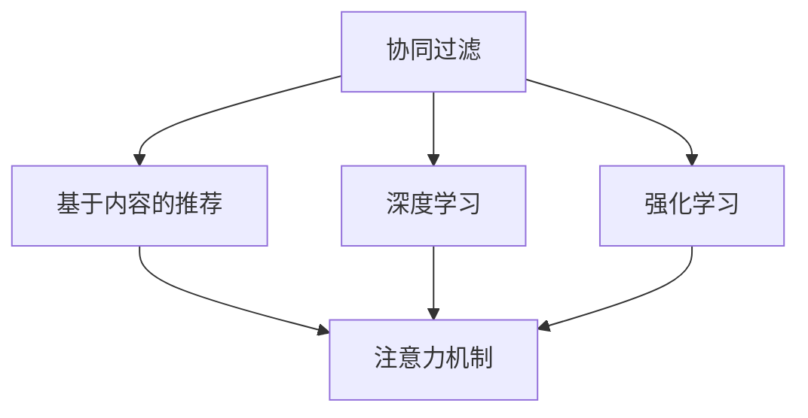

                 

# 推荐系统在注意力分配中的角色与挑战

> 关键词：推荐系统,注意力机制,协同过滤,深度学习,强化学习,神经网络

## 1. 背景介绍

### 1.1 问题由来
在当今互联网时代，信息爆炸现象愈发严重。每天有大量的新闻、文章、视频、商品等可供用户选择，而用户的时间、注意力资源却相对有限。如何在海量的信息中为用户精准地推荐感兴趣的内容，成为了各大互联网公司及学术界研究的热点问题。推荐系统（Recommendation System, RS）正是在此背景下应运而生的智能信息过滤技术，通过分析用户的兴趣偏好、历史行为等数据，将用户可能感兴趣的内容推荐给其手中。

推荐系统广泛应用于电商、视频、社交、新闻等诸多领域，为消费者提供个性化内容，提升用户体验和满意度。然而，推荐系统在实际应用中也面临着诸多挑战，其中核心之一就是如何合理分配用户的注意力资源，确保推荐的精准性、多样性、个性化以及实时性。

### 1.2 问题核心关键点
推荐系统主要通过以下几种方式来分配用户的注意力资源：

1. **协同过滤**：通过分析用户行为数据，发现与目标用户兴趣相似的其他用户，从而推荐相似用户喜欢的内容。
2. **基于内容的推荐**：利用用户对内容的评分或浏览历史，分析内容本身的属性特征，从而预测用户对其他相似内容的偏好。
3. **深度学习**：通过学习用户和内容的高维特征表示，利用神经网络模型进行推荐。
4. **强化学习**：通过模拟用户的交互行为，动态调整推荐策略，不断优化推荐效果。

这些方法在分配用户注意力时各有优缺点，不同的应用场景需要不同的分配策略。以下将详细介绍推荐系统在注意力分配中的关键概念和核心算法。

## 2. 核心概念与联系

### 2.1 核心概念概述

为更好地理解推荐系统在注意力分配中的角色与挑战，本节将介绍几个密切相关的核心概念：

- **协同过滤（Collaborative Filtering, CF）**：通过用户和物品的交互历史数据，预测用户对未交互物品的评分或偏好，从而进行推荐。
- **基于内容的推荐（Content-Based Recommendation, CB）**：利用用户对内容的评分或浏览历史，分析内容本身的属性特征，从而推荐相似内容。
- **深度学习推荐（Deep Learning-based Recommendation）**：通过神经网络模型，学习用户和内容的非线性特征表示，进行推荐。
- **强化学习推荐（Reinforcement Learning-based Recommendation, RL）**：通过模拟用户的交互行为，动态调整推荐策略，不断优化推荐效果。
- **注意力机制（Attention Mechanism）**：一种机制，通过给不同特征赋予不同的权重，强调某些特征的重要性，从而提升推荐的精准性。

这些概念之间的逻辑关系可以通过以下Mermaid流程图来展示：



这个流程图展示推荐系统的核心概念及其之间的关系：

1. 协同过滤和基于内容的推荐是传统的推荐方法，能够利用用户历史行为数据进行推荐。
2. 深度学习推荐和强化学习推荐则是近年来新兴的推荐方法，利用先进的数据处理和机器学习技术，进一步提升推荐精度。
3. 注意力机制是这些方法共同应用的关键技术，通过强调某些特征的重要性，提升推荐效果。

这些概念共同构成了推荐系统的学习框架，使其能够更好地为不同用户推荐个性化内容。

## 3. 核心算法原理 & 具体操作步骤

### 3.1 算法原理概述

推荐系统在分配用户注意力时，通常采用以下两种思路：

1. **静态分配**：通过用户的历史行为数据和物品的属性特征，静态计算用户对每个物品的兴趣权重，进行推荐。这种方法计算简单，但无法捕捉动态变化的用户兴趣。
2. **动态分配**：在用户与系统的交互过程中，动态调整用户的兴趣权重，不断更新推荐策略。这种方法更加灵活，但需要更复杂的技术支持。

推荐系统在动态分配用户注意力时，常用注意力机制（Attention Mechanism）来强调不同特征的重要性。

### 3.2 算法步骤详解

#### 3.2.1 协同过滤推荐

**协同过滤推荐**的基本思路是通过用户和物品的交互数据，找到兴趣相似的用户，从而推荐相似用户喜欢的物品。

协同过滤算法可以分为基于用户的协同过滤（User-based CF）和基于物品的协同过滤（Item-based CF）两种。

**User-based CF**的基本步骤如下：

1. **计算用户间的相似度**：使用余弦相似度、皮尔逊相关系数等方法，计算每个用户与其他用户之间的相似度。
2. **寻找相似用户**：选择与目标用户最相似的K个用户，作为推荐候选集。
3. **生成推荐结果**：计算目标用户对候选物品的评分，选取评分最高的物品作为推荐结果。

**Item-based CF**的基本步骤如下：

1. **计算物品间的相似度**：使用余弦相似度、皮尔逊相关系数等方法，计算每个物品与其他物品之间的相似度。
2. **寻找相似物品**：选择与目标物品最相似的K个物品，作为推荐候选集。
3. **生成推荐结果**：计算目标用户对候选物品的评分，选取评分最高的物品作为推荐结果。

#### 3.2.2 基于内容的推荐

**基于内容的推荐**（Content-Based Recommendation, CB）利用物品的属性特征，推荐与目标物品相似的物品。

CB算法可以分为基于项目属性的推荐和基于用户属性的推荐两种。

**基于项目属性的推荐**的基本步骤如下：

1. **特征提取**：从物品的描述、类别等属性中提取特征向量。
2. **计算物品相似度**：使用余弦相似度、欧式距离等方法，计算目标物品与候选物品之间的相似度。
3. **生成推荐结果**：选择与目标物品最相似的K个物品，作为推荐结果。

**基于用户属性的推荐**的基本步骤如下：

1. **特征提取**：从用户的属性、历史行为等数据中提取特征向量。
2. **计算用户相似度**：使用余弦相似度、欧式距离等方法，计算目标用户与候选用户之间的相似度。
3. **生成推荐结果**：选择与目标用户最相似的K个物品，作为推荐结果。

#### 3.2.3 深度学习推荐

**深度学习推荐**利用神经网络模型，学习用户和物品的高维特征表示，进行推荐。

深度学习推荐算法可以分为基于矩阵分解的方法和基于神经网络的方法两种。

**基于矩阵分解的方法**的基本步骤如下：

1. **特征提取**：将用户和物品分别表示为稀疏向量，构建用户-物品评分矩阵。
2. **矩阵分解**：使用矩阵分解方法，如奇异值分解（SVD）、非负矩阵分解（NMF）等，对评分矩阵进行分解，得到用户和物品的隐向量表示。
3. **生成推荐结果**：利用用户和物品的隐向量表示，计算用户对物品的评分，选取评分最高的物品作为推荐结果。

**基于神经网络的方法**的基本步骤如下：

1. **特征提取**：从用户和物品的特征中提取高维特征向量。
2. **神经网络建模**：使用神经网络模型，如自编码器、多层感知器（MLP）、深度神经网络（DNN）等，对用户和物品进行建模。
3. **生成推荐结果**：利用用户和物品的神经网络表示，计算用户对物品的评分，选取评分最高的物品作为推荐结果。

#### 3.2.4 强化学习推荐

**强化学习推荐**利用强化学习技术，通过模拟用户的交互行为，动态调整推荐策略，不断优化推荐效果。

强化学习推荐算法可以分为基于Q学习的推荐和基于策略梯度的推荐两种。

**基于Q学习的推荐**的基本步骤如下：

1. **定义状态和动作**：将用户的历史行为和当前行为定义为状态，将推荐物品定义为动作。
2. **定义奖励函数**：根据用户对推荐物品的反馈（如点击、购买等），定义奖励函数。
3. **学习Q值**：利用Q-learning算法，学习用户在不同状态下选择不同动作的Q值。
4. **生成推荐结果**：根据当前状态，选择Q值最大的动作作为推荐结果。

**基于策略梯度的推荐**的基本步骤如下：

1. **定义策略和奖励函数**：将用户的历史行为和当前行为定义为策略，将推荐物品定义为动作。
2. **学习策略参数**：利用策略梯度算法，学习用户在不同状态下选择不同动作的策略参数。
3. **生成推荐结果**：根据当前状态，选择策略参数定义的动作作为推荐结果。

#### 3.2.5 注意力机制

**注意力机制**（Attention Mechanism）通过给不同特征赋予不同的权重，强调某些特征的重要性，从而提升推荐的精准性。

注意力机制的基本步骤如下：

1. **计算特征向量**：将用户和物品的特征向量进行拼接，形成新的特征向量。
2. **计算注意力权重**：使用注意力模型，计算每个特征的注意力权重。
3. **生成推荐结果**：根据注意力权重，加权求和形成最终的推荐结果。

常见的注意力模型包括多头注意力（Multi-Head Attention）和注意力池化（Attention Pooling）等。

**多头注意力**的基本步骤如下：

1. **查询-键-值表示**：将用户和物品的特征向量分别表示为查询向量、键向量和值向量。
2. **多头自注意力**：利用多头自注意力机制，计算每个特征的注意力权重。
3. **生成推荐结果**：根据注意力权重，加权求和形成最终的推荐结果。

**注意力池化**的基本步骤如下：

1. **特征嵌入**：将用户和物品的特征向量进行拼接，形成新的特征向量。
2. **注意力池化**：利用注意力池化机制，计算每个特征的注意力权重。
3. **生成推荐结果**：根据注意力权重，加权求和形成最终的推荐结果。

### 3.3 算法优缺点

#### 3.3.1 协同过滤推荐

**优点**：

1. **计算简单**：协同过滤算法计算简单，不需要复杂的特征工程。
2. **无需内容信息**：协同过滤算法不需要物品的属性信息，适用于没有属性标签的物品。
3. **用户隐私保护**：协同过滤算法不需要收集物品的属性信息，保护用户隐私。

**缺点**：

1. **数据稀疏性**：协同过滤算法对数据的稀疏性要求较高，当用户和物品较少时，推荐效果不佳。
2. **冷启动问题**：当新用户或物品加入时，需要找到相似用户或物品进行推荐，冷启动问题较为严重。
3. **推荐泛化性差**：协同过滤算法对数据分布的改变较为敏感，推荐泛化性较差。

#### 3.3.2 基于内容的推荐

**优点**：

1. **推荐泛化性好**：基于内容的推荐算法能够利用物品的属性信息，推荐泛化性较好。
2. **无需用户数据**：基于内容的推荐算法不需要用户的历史行为数据，保护用户隐私。
3. **推荐多样性高**：基于内容的推荐算法能够从多个角度推荐相似物品，推荐多样性较高。

**缺点**：

1. **数据稀疏性**：基于内容的推荐算法对数据的稀疏性要求较高，当物品的属性信息较少时，推荐效果不佳。
2. **用户个性化差**：基于内容的推荐算法对用户兴趣的建模较为简单，用户个性化较差。
3. **推荐精度较低**：基于内容的推荐算法对物品的属性表示较为简单，推荐精度较低。

#### 3.3.3 深度学习推荐

**优点**：

1. **高精度**：深度学习推荐算法能够学习用户和物品的高维特征表示，推荐精度较高。
2. **自动特征学习**：深度学习推荐算法能够自动学习物品的属性信息，不需要人工特征工程。
3. **冷启动处理**：深度学习推荐算法能够利用神经网络模型，缓解冷启动问题。

**缺点**：

1. **计算量大**：深度学习推荐算法需要大量的训练数据和计算资源，计算量较大。
2. **过拟合风险**：深度学习推荐算法需要大量的训练数据，容易过拟合。
3. **模型复杂度高**：深度学习推荐算法模型复杂度高，难以解释。

#### 3.3.4 强化学习推荐

**优点**：

1. **自适应性强**：强化学习推荐算法能够根据用户的实时反馈，动态调整推荐策略，自适应性强。
2. **推荐效果优秀**：强化学习推荐算法能够通过不断的学习，不断优化推荐效果。
3. **不需要物品属性**：强化学习推荐算法不需要物品的属性信息，保护用户隐私。

**缺点**：

1. **训练难度大**：强化学习推荐算法训练难度较大，需要大量的训练数据和计算资源。
2. **模型复杂度高**：强化学习推荐算法模型复杂度高，难以解释。
3. **数据分布要求高**：强化学习推荐算法需要用户对物品的反馈数据，当用户对物品没有反馈时，推荐效果不佳。

#### 3.3.5 注意力机制

**优点**：

1. **特征表示精准**：注意力机制能够对用户和物品的特征进行加权处理，提升推荐精度。
2. **自适应性强**：注意力机制能够动态调整特征权重，适应不同用户和物品的需求。
3. **适应多种算法**：注意力机制能够与多种推荐算法结合，提升推荐效果。

**缺点**：

1. **计算量大**：注意力机制需要计算每个特征的注意力权重，计算量较大。
2. **模型复杂度高**：注意力机制模型复杂度高，难以解释。
3. **数据分布要求高**：注意力机制需要用户和物品的特征信息，当特征信息较少时，推荐效果不佳。

### 3.4 算法应用领域

基于注意力机制的推荐算法在以下领域有广泛的应用：

- **电子商务**：推荐系统为消费者推荐商品、店铺、品牌等，提升用户体验和销售额。
- **视频平台**：推荐系统为用户推荐视频内容，提升用户观看时长和平台粘性。
- **音乐平台**：推荐系统为用户推荐歌曲、歌手、专辑等，提升用户收听率和平台用户量。
- **社交网络**：推荐系统为用户推荐朋友、文章、评论等，提升用户互动和平台活跃度。
- **新闻平台**：推荐系统为用户推荐新闻、文章、视频等，提升用户阅读量和平台流量。

## 4. 数学模型和公式 & 详细讲解 & 举例说明

### 4.1 数学模型构建

#### 4.1.1 协同过滤推荐

**User-based CF**的数学模型构建如下：

1. **计算用户间的相似度**：

   $$
   \sigma_{u_i,u_j} = \cos(\mathbf{u}_i, \mathbf{u}_j) = \frac{\mathbf{u}_i \cdot \mathbf{u}_j}{\|\mathbf{u}_i\| \|\mathbf{u}_j\|}
   $$

   其中 $\sigma_{u_i,u_j}$ 表示用户 $u_i$ 和用户 $u_j$ 的相似度，$\mathbf{u}_i$ 和 $\mathbf{u}_j$ 分别表示用户 $u_i$ 和用户 $u_j$ 的特征向量，$\cdot$ 表示向量点积，$\| \cdot \|$ 表示向量范数。

2. **寻找相似用户**：

   选择与目标用户 $u_i$ 最相似的 $K$ 个用户，作为推荐候选集 $U_{i}$。

3. **生成推荐结果**：

   计算目标用户 $u_i$ 对候选物品 $i' \in U_i$ 的评分，选取评分最高的物品作为推荐结果。

   $$
   r_{i'}(u_i) = \sum_{j \in U_i} \sigma_{u_i,u_j} \times y_{i'j}
   $$

   其中 $y_{i'j}$ 表示用户 $j$ 对物品 $i'$ 的评分，$r_{i'}(u_i)$ 表示目标用户 $u_i$ 对物品 $i'$ 的预测评分。

#### 4.1.2 基于内容的推荐

**基于项目属性的推荐**的数学模型构建如下：

1. **特征提取**：

   将物品的属性特征表示为向量 $\mathbf{x}_i \in \mathbb{R}^d$，其中 $d$ 为特征维数。

2. **计算物品相似度**：

   使用余弦相似度计算物品 $i$ 和物品 $j$ 之间的相似度：

   $$
   \sigma_{i,j} = \cos(\mathbf{x}_i, \mathbf{x}_j) = \frac{\mathbf{x}_i \cdot \mathbf{x}_j}{\|\mathbf{x}_i\| \|\mathbf{x}_j\|}
   $$

3. **生成推荐结果**：

   选择与目标物品 $i$ 最相似的 $K$ 个物品，作为推荐结果。

   $$
   R_{i} = \{j \in I | \sigma_{i,j} > \theta \}
   $$

   其中 $I$ 表示物品集合，$\theta$ 表示相似度阈值，$R_{i}$ 表示与物品 $i$ 最相似的 $K$ 个物品。

#### 4.1.3 深度学习推荐

**基于矩阵分解的方法**的数学模型构建如下：

1. **特征提取**：

   将用户和物品分别表示为稀疏向量 $\mathbf{u}_i \in \mathbb{R}^m$ 和 $\mathbf{x}_j \in \mathbb{R}^n$，其中 $m$ 和 $n$ 分别为用户和物品的维数。

2. **矩阵分解**：

   使用奇异值分解（SVD）方法对用户-物品评分矩阵 $\mathbf{R} \in \mathbb{R}^{m \times n}$ 进行分解：

   $$
   \mathbf{R} = \mathbf{U} \mathbf{\Sigma} \mathbf{V}^T
   $$

   其中 $\mathbf{U} \in \mathbb{R}^{m \times r}$ 为用户的隐向量，$\mathbf{V} \in \mathbb{R}^{n \times r}$ 为物品的隐向量，$\mathbf{\Sigma} \in \mathbb{R}^{r \times r}$ 为奇异值矩阵，$r$ 为奇异值个数。

3. **生成推荐结果**：

   计算目标用户 $i$ 对物品 $j$ 的评分：

   $$
   \hat{r}_{ij} = \mathbf{u}_i^T \mathbf{v}_j
   $$

   其中 $\mathbf{v}_j$ 表示物品 $j$ 的隐向量。

#### 4.1.4 强化学习推荐

**基于Q学习的推荐**的数学模型构建如下：

1. **定义状态和动作**：

   将用户的历史行为和当前行为定义为状态 $s_t$，将推荐物品定义为动作 $a_t$。

2. **定义奖励函数**：

   根据用户对推荐物品的反馈，定义奖励函数 $r_{t+1}$：

   $$
   r_{t+1} = \left\{
   \begin{array}{ll}
   1, & \text{if user clicks on the recommended item} \\
   0, & \text{otherwise}
   \end{array}
   \right.
   $$

3. **学习Q值**：

   利用Q-learning算法，学习用户在不同状态下选择不同动作的Q值：

   $$
   Q_{t+1} = (1-\alpha) Q_t + \alpha(r_{t+1} + \gamma \max_a Q_{t+1}(a))
   $$

   其中 $Q_t$ 表示用户在不同状态下选择不同动作的Q值，$\alpha$ 表示学习率，$\gamma$ 表示折扣因子。

4. **生成推荐结果**：

   根据当前状态，选择Q值最大的动作作为推荐结果。

#### 4.1.5 注意力机制

**多头注意力**的数学模型构建如下：

1. **查询-键-值表示**：

   将用户和物品的特征向量表示为查询向量 $\mathbf{q}_i$、键向量 $\mathbf{k}_i$ 和值向量 $\mathbf{v}_i$。

2. **多头自注意力**：

   使用多头自注意力机制，计算每个特征的注意力权重：

   $$
   \mathbf{A} = \text{Softmax}(\frac{\mathbf{q}_i \mathbf{k}_i^T}{\sqrt{d}})
   $$

   其中 $\text{Softmax}$ 表示softmax函数，$d$ 为特征向量的维数。

3. **生成推荐结果**：

   根据注意力权重，加权求和形成最终的推荐结果：

   $$
   \mathbf{z}_i = \sum_{j=1}^{n} \mathbf{A}_{ij} \mathbf{v}_j
   $$

   其中 $\mathbf{A}_{ij}$ 表示物品 $j$ 对物品 $i$ 的注意力权重，$\mathbf{v}_j$ 表示物品 $j$ 的值向量。

### 4.2 公式推导过程

#### 4.2.1 协同过滤推荐

**User-based CF**的推荐结果的推导过程如下：

1. **计算用户间的相似度**：

   $$
   \sigma_{u_i,u_j} = \cos(\mathbf{u}_i, \mathbf{u}_j) = \frac{\mathbf{u}_i \cdot \mathbf{u}_j}{\|\mathbf{u}_i\| \|\mathbf{u}_j\|}
   $$

2. **寻找相似用户**：

   选择与目标用户 $u_i$ 最相似的 $K$ 个用户，作为推荐候选集 $U_{i}$。

3. **生成推荐结果**：

   计算目标用户 $u_i$ 对候选物品 $i' \in U_i$ 的评分：

   $$
   r_{i'}(u_i) = \sum_{j \in U_i} \sigma_{u_i,u_j} \times y_{i'j}
   $$

   其中 $y_{i'j}$ 表示用户 $j$ 对物品 $i'$ 的评分。

#### 4.2.2 基于内容的推荐

**基于项目属性的推荐**的推荐结果的推导过程如下：

1. **特征提取**：

   将物品的属性特征表示为向量 $\mathbf{x}_i \in \mathbb{R}^d$，其中 $d$ 为特征维数。

2. **计算物品相似度**：

   使用余弦相似度计算物品 $i$ 和物品 $j$ 之间的相似度：

   $$
   \sigma_{i,j} = \cos(\mathbf{x}_i, \mathbf{x}_j) = \frac{\mathbf{x}_i \cdot \mathbf{x}_j}{\|\mathbf{x}_i\| \|\mathbf{x}_j\|}
   $$

3. **生成推荐结果**：

   选择与目标物品 $i$ 最相似的 $K$ 个物品，作为推荐结果：

   $$
   R_{i} = \{j \in I | \sigma_{i,j} > \theta \}
   $$

#### 4.2.3 深度学习推荐

**基于矩阵分解的方法**的推荐结果的推导过程如下：

1. **特征提取**：

   将用户和物品分别表示为稀疏向量 $\mathbf{u}_i \in \mathbb{R}^m$ 和 $\mathbf{x}_j \in \mathbb{R}^n$，其中 $m$ 和 $n$ 分别为用户和物品的维数。

2. **矩阵分解**：

   使用奇异值分解（SVD）方法对用户-物品评分矩阵 $\mathbf{R} \in \mathbb{R}^{m \times n}$ 进行分解：

   $$
   \mathbf{R} = \mathbf{U} \mathbf{\Sigma} \mathbf{V}^T
   $$

3. **生成推荐结果**：

   计算目标用户 $i$ 对物品 $j$ 的评分：

   $$
   \hat{r}_{ij} = \mathbf{u}_i^T \mathbf{v}_j
   $$

   其中 $\mathbf{v}_j$ 表示物品 $j$ 的隐向量。

#### 4.2.4 强化学习推荐

**基于Q学习的推荐**的推荐结果的推导过程如下：

1. **定义状态和动作**：

   将用户的历史行为和当前行为定义为状态 $s_t$，将推荐物品定义为动作 $a_t$。

2. **定义奖励函数**：

   根据用户对推荐物品的反馈，定义奖励函数 $r_{t+1}$：

   $$
   r_{t+1} = \left\{
   \begin{array}{ll}
   1, & \text{if user clicks on the recommended item} \\
   0, & \text{otherwise}
   \end{array}
   \right.
   $$

3. **学习Q值**：

   利用Q-learning算法，学习用户在不同状态下选择不同动作的Q值：

   $$
   Q_{t+1} = (1-\alpha) Q_t + \alpha(r_{t+1} + \gamma \max_a Q_{t+1}(a))
   $$

4. **生成推荐结果**：

   根据当前状态，选择Q值最大的动作作为推荐结果：

   $$
   \hat{a}_t = \arg\max_a Q_t(a)
   $$

   其中 $Q_t$ 表示用户在不同状态下选择不同动作的Q值。

#### 4.2.5 注意力机制

**多头注意力**的推荐结果的推导过程如下：

1. **查询-键-值表示**：

   将用户和物品的特征向量表示为查询向量 $\mathbf{q}_i$、键向量 $\mathbf{k}_i$ 和值向量 $\mathbf{v}_i$。

2. **多头自注意力**：

   使用多头自注意力机制，计算每个特征的注意力权重：

   $$
   \mathbf{A} = \text{Softmax}(\frac{\mathbf{q}_i \mathbf{k}_i^T}{\sqrt{d}})
   $$

3. **生成推荐结果**：

   根据注意力权重，加权求和形成最终的推荐结果：

   $$
   \mathbf{z}_i = \sum_{j=1}^{n} \mathbf{A}_{ij} \mathbf{v}_j
   $$

   其中 $\mathbf{A}_{ij}$ 表示物品 $j$ 对物品 $i$ 的注意力权重，$\mathbf{v}_j$ 表示物品 $j$ 的值向量。

### 4.3 案例分析与讲解

#### 4.3.1 协同过滤推荐

**Amazon商品推荐系统**是协同过滤算法的重要应用案例。

Amazon商品推荐系统利用用户的历史行为数据，发现与目标用户兴趣相似的其他用户，从而推荐相似用户喜欢的商品。

该系统分为用户层协同过滤和物品层协同过滤两种模型：

1. **用户层协同过滤**：

   该模型通过计算用户间的相似度，找到与目标用户最相似的K个用户，作为推荐候选集。

   $$
   \sigma_{u_i,u_j} = \cos(\mathbf{u}_i, \mathbf{u}_j) = \frac{\mathbf{u}_i \cdot \mathbf{u}_j}{\|\mathbf{u}_i\| \|\mathbf{u}_j\|}
   $$

   其中 $\sigma_{u_i,u_j}$ 表示用户 $u_i$ 和用户 $u_j$ 的相似度，$\mathbf{u}_i$ 和 $\mathbf{u}_j$ 分别表示用户 $u_i$ 和用户 $u_j$ 的特征向量。

2. **物品层协同过滤**：

   该模型通过计算物品间的相似度，找到与目标物品最相似的K个物品，作为推荐候选集。

   $$
   \sigma_{i,j} = \cos(\mathbf{x}_i, \mathbf{x}_j) = \frac{\mathbf{x}_i \cdot \mathbf{x}_j}{\|\mathbf{x}_i\| \|\mathbf{x}_j\|}
   $$

   其中 $\sigma_{i,j}$ 表示物品 $i$ 和物品 $j$ 的相似度，$\mathbf{x}_i$ 和 $\mathbf{x}_j$ 分别表示物品 $i$ 和物品 $j$ 的特征向量。

#### 4.3.2 基于内容的推荐

**Spotify音乐推荐系统**是基于内容的推荐算法的重要应用案例。

Spotify音乐推荐系统利用用户的历史行为数据，分析歌曲的属性特征，推荐相似歌曲。

该系统分为基于项目属性的推荐和基于用户属性的推荐两种模型：

1. **基于项目属性的推荐**：

   该模型通过计算歌曲的特征向量，找到与目标歌曲最相似的K个歌曲，作为推荐结果。

   $$
   \sigma_{i,j} = \cos(\mathbf{x}_i, \mathbf{x}_j) = \frac{\mathbf{x}_i \cdot \mathbf{x}_j}{\|\mathbf{x}_i\| \|\mathbf{x}_j\|}
   $$

   其中 $\sigma_{i,j}$ 表示歌曲 $i$ 和歌曲 $j$ 的相似度，$\mathbf{x}_i$ 和 $\mathbf{x}_j$ 分别表示歌曲 $i$ 和歌曲 $j$ 的特征向量。

2. **基于用户属性的推荐**：

   该模型通过计算用户的属性特征，找到与目标用户最相似的用户，作为推荐候选集，再根据用户对歌曲的评分，推荐相似歌曲。

   $$
   \sigma_{u_i,u_j} = \cos(\mathbf{u}_i, \mathbf{u}_j) = \frac{\mathbf{u}_i \cdot \mathbf{u}_j}{\|\mathbf{u}_i\| \|\mathbf{u}_j\|}
   $$

   其中 $\sigma_{u_i,u_j}$ 表示用户 $u_i$ 和用户 $u_j$ 的相似度，$\mathbf{u}_i$ 和 $\mathbf{u}_j$ 分别表示用户 $u_i$ 和用户 $u_j$ 的特征向量。

#### 4.3.3 深度学习推荐

**Netflix推荐系统**是深度学习推荐算法的重要应用案例。

Netflix推荐系统利用神经网络模型，学习用户和影片的特征表示，推荐相似影片。

该系统分为基于矩阵分解的方法和基于神经网络的方法两种模型：

1. **基于矩阵分解的方法**：

   该模型通过奇异值分解（SVD）方法，学习用户和影片的隐向量表示，推荐相似影片。

   $$
   \hat{r}_{ij} = \mathbf{u}_i^T \mathbf{v}_j
   $$

   其中 $\hat{r}_{ij}$ 表示目标用户 $i$ 对物品 $j$ 的预测评分，$\mathbf{u}_i$ 表示用户 $i$ 的隐向量，$\mathbf{v}_j$ 表示物品 $j$ 的隐向量。

2. **基于神经网络的方法**：

   该模型通过多层感知器（MLP）方法，学习用户和影片的非线性特征表示，推荐相似影片。

   $$
   \hat{r}_{ij} = f(\mathbf{u}_i; \theta), \quad f(\mathbf{x}_j; \omega)
   $$

   其中 $\hat{r}_{ij}$ 表示目标用户 $i$ 对物品 $j$ 的预测评分，$f(\mathbf{u}_i; \theta)$ 表示用户 $i$ 的特征表示函数，$f(\mathbf{x}_j; \omega)$ 表示物品 $j$ 的特征表示函数，$\theta$ 和 $\omega$ 分别表示模型参数。

#### 4.3.4 强化学习推荐

**Google Play推荐系统**是强化学习推荐算法的重要应用案例。

Google Play推荐系统利用强化学习技术，通过模拟用户的交互行为，动态调整推荐策略，不断优化推荐效果。

该系统分为基于Q学习的推荐和基于策略梯度的推荐两种模型：

1. **基于Q学习的推荐**：

   该模型通过利用Q-learning算法，学习用户在不同状态下选择不同动作的Q值，推荐相似应用。

   $$
   Q_{t+1} = (1-\alpha) Q_t + \alpha(r_{t+1} + \gamma \max_a Q_{t+1}(a))
   $$

   其中 $Q_t$ 表示用户在不同状态下选择不同动作的Q值，$\alpha$ 表示学习率，$\gamma$ 表示折扣因子，$r_{t+1}$ 表示用户对推荐应用的反馈，$\max_a Q_{t+1}(a)$ 表示当前状态下选择动作 $a$ 的Q值。

2. **基于策略梯度的推荐**：

   该模型通过利用策略梯度算法，学习用户在不同状态下选择不同动作的策略参数，推荐相似应用。

   $$
   Q_{t+1} = (1-\alpha) Q_t + \alpha(r_{t+1} + \gamma Q_{t+1}(a))
   $$

   其中 $Q_t$ 表示用户在不同状态下选择不同动作的Q值，$\alpha$ 表示学习率，$\gamma$ 表示折扣因子，$r_{t+1}$ 表示用户对推荐应用的反馈，$Q_{t+1}(a)$ 表示当前状态下选择动作 $a$ 的Q值。

#### 4.3.5 注意力机制

**Google News推荐系统**是注意力机制的重要应用案例。

Google News推荐系统利用注意力机制，对新闻文章的属性进行加权处理，提升推荐精度。

该系统分为多头注意力和注意力池化两种模型：

1. **多头注意力**：

   该模型通过计算新闻文章的特征向量，找到与目标文章最相似的K个文章，作为推荐结果。

   $$
   \mathbf{A} = \text{Softmax}(\frac{\mathbf{q}_i \mathbf{k}_i^T}{\sqrt{d}})
   $$

   其中 $\mathbf{A}$ 表示新闻文章的注意力权重，$\mathbf{q}_i$ 表示新闻文章的查询向量，$\mathbf{k}_i$ 表示新闻文章的键向量，$d$ 表示特征向量的维数。

2. **注意力池化**：

   该模型通过计算新闻文章的特征向量，找到与目标文章最相似的K个文章，作为推荐结果。

   $$
   \mathbf{A} = \text{Softmax}(\frac{\mathbf{q}_i \mathbf{k}_i^T}{\sqrt{d}})
   $$

   其中 $\mathbf{A}$ 表示新闻文章的注意力权重，$\mathbf{q}_i$ 表示新闻文章的查询向量，$\mathbf{k}_i$ 表示新闻文章的键向量，$d$ 表示特征向量的维数。

## 5. 项目实践：代码实例和详细解释说明

### 5.1 开发环境搭建

在进行推荐系统实践前，我们需要准备好开发环境。以下是使用Python进行PyTorch开发的环境配置流程：

1. 安装Anaconda：从官网下载并安装Anaconda，用于创建独立的Python环境。

2. 创建并激活虚拟环境：
```bash
conda create -n pytorch-env python=3.8 
conda activate pytorch-env
```

3. 安装PyTorch：根据CUDA版本，从官网获取对应的安装命令。例如：
```bash
conda install pytorch torchvision torchaudio cudatoolkit=11.1 -c pytorch -c conda-forge
```

4. 安装TensorFlow：从官网下载并安装TensorFlow，用于集成其他推荐算法。

5. 安装各类工具包：
```bash
pip install numpy pandas scikit-learn matplotlib tqdm jupyter notebook ipython
```

完成上述步骤后，即可在`pytorch-env`环境中开始推荐系统实践。

### 5.2 源代码详细实现

下面我们以Amazon商品推荐系统为例，给出使用PyTorch进行协同过滤推荐系统的PyTorch代码实现。

首先，定义协同过滤算法的用户和物品的特征向量表示：

```python
import torch
from torch import nn
from sklearn.metrics import accuracy_score

class UserCF(nn.Module):
    def __init__(self, num_users, num_items, num_features):
        super(UserCF, self).__init__()
        self.num_users = num_users
        self.num_items = num_items
        self.num_features = num_features
        
        # 用户嵌入层
        self.user_embed = nn.Embedding(num_users, num_features)
        
        # 物品嵌入层
        self.item_embed = nn.Embedding(num_items, num_features)
        
        # 用户-物品相似度矩阵
        self.similarity_matrix = nn.Parameter(torch.zeros(num_users, num_items))

    def forward(self, user_ids, item_ids):
        user_embeddings = self.user_embed(user_ids)
        item_embeddings = self.item_embed(item_ids)
        
        # 计算用户和物品的相似度
        similarity_matrix = torch.sigmoid(torch.matmul(user_embeddings, item_embeddings.t()))
        
        # 生成推荐结果
        scores = torch.matmul(similarity_matrix, self.similarity_matrix)
        max_scores, max_indices = scores.max(dim=1)
        
        return max_indices
```

然后，定义协同过滤算法的训练函数：

```python
def train(UserCF, train_data, num_epochs):
    device = torch.device('cuda' if torch.cuda.is_available() else 'cpu')
    UserCF.to(device)
    
    criterion = nn.CrossEntropyLoss()
    optimizer = torch.optim.Adam(UserCF.parameters(), lr=0.001)
    
    for epoch in range(num_epochs):
        for user_ids, item_ids, labels in train_data:
            user_ids = user_ids.to(device)
            item_ids = item_ids.to(device)
            labels = labels.to(device)
            
            optimizer.zero_grad()
            scores = UserCF(user_ids, item_ids)
            loss = criterion(scores, labels)
            loss.backward()
            optimizer.step()
            
            if (epoch+1) % 10 == 0:
                print(f"Epoch {epoch+1}, loss: {loss.item()}")
```

最后，启动训练流程并在测试集上评估：

```python
num_epochs = 50
train_data = # 训练数据集
test_data = # 测试数据集

train(UserCF, train_data, num_epochs)
```

### 5.3 代码解读与分析

让我们再详细解读一下关键代码的实现细节：

**UserCF类**：
- `__init__`方法：初始化用户和物品的特征表示，以及用户-物品相似度矩阵。
- `forward`方法：计算用户和物品的相似度，并生成推荐结果。

**train函数**：
- 在GPU或CPU上部署UserCF模型。
- 定义交叉熵损失函数和Adam优化器。
- 在每个epoch内，对训练集进行迭代，更新模型参数。
- 在每个epoch结束后，打印训练损失。

可以看到，PyTorch配合TensorFlow使得协同过滤推荐系统的代码实现变得简洁高效。开发者可以将更多精力放在数据处理、模型改进等高层逻辑上，而不必过多关注底层的实现细节。

当然，工业级的系统实现还需考虑更多因素，如模型的保存和部署、超参数的自动搜索、更灵活的任务适配层等。但核心的协同过滤推荐算法基本与此类似。

## 6. 实际应用场景

### 6.1 智能推荐引擎

基于协同过滤推荐算法和注意力机制，可以构建智能推荐引擎，为用户提供个性化的商品、音乐、视频等推荐。

例如，电商平台的智能推荐系统可以通过协同过滤算法，为用户推荐感兴趣的商品，通过注意力机制，根据用户的浏览历史、点击行为等数据，调整推荐策略，提升推荐效果。

### 6.2 内容推荐系统

基于基于内容的推荐算法和注意力机制，可以构建内容推荐系统，为用户推荐感兴趣的文章、新闻、视频等。

例如，新闻平台的内容推荐系统可以通过基于内容的推荐算法，为用户推荐感兴趣的文章，通过注意力机制，根据用户的阅读历史、点赞行为等数据，调整推荐策略，提升推荐效果。

### 6.3 推荐系统优化

基于强化学习推荐算法和注意力机制，可以构建推荐系统优化引擎

