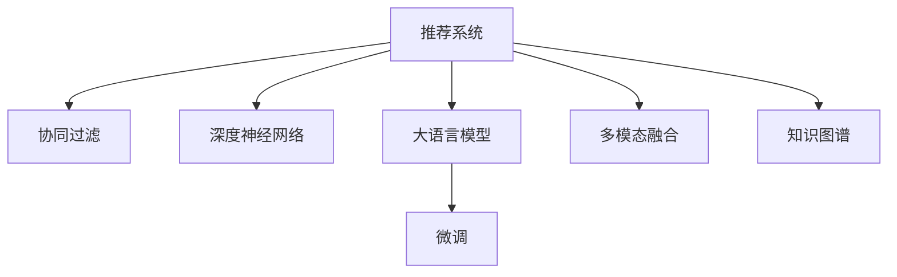

                 

# 推荐系统的未来发展：大模型的主流化趋势

> 关键词：推荐系统,大模型,深度学习,协同过滤,知识图谱,多模态融合

## 1. 背景介绍

### 1.1 问题由来
推荐系统是互联网时代信息过载的产物，通过用户行为数据和产品属性信息进行分析和建模，为用户推荐感兴趣的内容。传统的推荐算法主要基于协同过滤(Collaborative Filtering)，通过用户画像和物品画像的相似度匹配进行推荐，取得了一定的效果。然而，协同过滤算法往往难以处理新物品和冷启动问题，且对用户和物品的多样化需求难以捕捉，因此推荐效果存在一定的局限性。

随着深度学习技术的崛起，深度神经网络模型被引入推荐系统中，通过端到端的神经网络结构建模用户与物品的复杂交互关系，取得了显著的效果提升。然而，深度模型由于其巨大的计算和存储需求，以及复杂的网络结构，往往难以在实际场景中大范围部署，制约了其应用普及。

近年来，大语言模型（Large Language Models, LLMs）的迅猛发展，通过在海量数据上进行预训练，学习到丰富的语言表示能力，逐渐在推荐系统领域获得了应用。大语言模型以庞大的模型规模和强大的泛化能力，成为推荐系统优化的新范式。通过大语言模型的辅助，推荐系统能够更好地理解和生成推荐结果，提升用户体验和业务价值。

### 1.2 问题核心关键点
大语言模型在推荐系统中的主流化，主要基于以下几个关键点：

- 泛化能力：大语言模型能够通过预训练学习到丰富的语言知识，具备强大的泛化能力，能够适应新物品和冷启动问题，提升推荐系统的覆盖率和准确率。

- 语义理解：大语言模型能够通过自然语言处理技术，理解用户的查询意图，从海量文本数据中提取有价值的特征，提升推荐结果的相关性。

- 生成能力：大语言模型能够生成自然流畅的语言描述，为用户提供更丰富的信息。通过结合搜索、召回和排序，提升推荐效果。

- 可扩展性：大语言模型能够通过微调和融合的方式，适应不同的推荐场景，轻松扩展到个性化推荐、多模态推荐、实时推荐等多个方向。

- 可解释性：大语言模型能够提供自然语言输出，便于用户理解推荐理由，增强系统的可解释性。

这些核心关键点使得大语言模型成为推荐系统优化的重要技术手段，为其大规模落地应用提供了可能。

### 1.3 问题研究意义
大语言模型在推荐系统中的应用，对于拓展推荐系统的应用边界，提升推荐系统的性能和效率，具有重要意义：

1. 提高推荐精度。大语言模型通过理解用户的查询意图，从海量文本数据中提取特征，提升推荐结果的相关性，满足用户的个性化需求。

2. 扩展推荐场景。大语言模型能够生成自然流畅的文本描述，结合搜索、召回和排序，为用户提供多层次、多模态的推荐内容，丰富推荐体验。

3. 降低开发成本。大语言模型能够通过微调和融合的方式，快速适配不同的推荐场景，减少从头开发所需的数据、计算和人力等成本投入。

4. 加速业务创新。大语言模型能够提供强大的语言理解和生成能力，使得推荐系统能够更灵活地应对业务需求的变化，促进业务创新。

5. 提升用户体验。大语言模型能够提供更自然流畅的推荐输出，提升用户的满意度，促进用户粘性。

## 2. 核心概念与联系

### 2.1 核心概念概述

为更好地理解大语言模型在推荐系统中的应用，本节将介绍几个密切相关的核心概念：

- 推荐系统(Recommender System)：利用用户行为数据和产品属性信息，为用户推荐感兴趣的内容。推荐系统在电商、社交、娱乐等多个领域广泛应用。

- 协同过滤(Collaborative Filtering)：基于用户和物品的相似性匹配进行推荐，是推荐系统中最常见的算法之一。

- 深度神经网络(Deep Neural Network)：通过多层神经网络结构，对数据进行特征提取和模式学习，广泛应用于推荐系统的特征提取环节。

- 大语言模型(Large Language Model)：以自回归(如GPT)或自编码(如BERT)模型为代表的大规模预训练语言模型。通过在海量数据上进行预训练，学习到丰富的语言表示能力。

- 微调(Fine-Tuning)：指在预训练模型的基础上，使用下游任务的少量标注数据，通过有监督地训练来优化模型在该任务上的性能。

- 多模态融合(Multimodal Fusion)：结合文本、图像、视频、音频等多种模态信息进行综合推荐，提升推荐系统的多样性和用户满意度。

- 知识图谱(Knowledge Graph)：将实体、关系和属性等信息以图结构组织起来，用于提升推荐系统的推理能力和泛化能力。

这些核心概念之间的逻辑关系可以通过以下Mermaid流程图来展示：



这个流程图展示了大语言模型在推荐系统中的核心概念及其之间的关系：

1. 推荐系统通过协同过滤和深度学习等算法对用户行为数据和产品属性信息进行建模。
2. 大语言模型通过预训练学习到丰富的语言知识，可以用于增强推荐系统的泛化能力和语义理解能力。
3. 微调方法可以将大语言模型进一步适配到推荐系统，提升模型的推荐效果。
4. 多模态融合可以结合文本、图像、视频等多种模态信息，丰富推荐系统的内容和形式。
5. 知识图谱可以提供结构化的领域知识，提升推荐系统的推理能力和泛化能力。

这些概念共同构成了大语言模型在推荐系统中的应用框架，使其能够在各种场景下发挥强大的推荐能力。

## 3. 核心算法原理 & 具体操作步骤
### 3.1 算法原理概述

大语言模型在推荐系统中的应用，主要基于以下算法原理：

- 预训练模型获取语义信息：大语言模型通过在海量数据上进行预训练，学习到丰富的语言表示能力，能够理解用户查询的语义和意图。

- 自然语言处理提取特征：大语言模型通过自然语言处理技术，从查询语句中提取有价值的特征，用于生成推荐结果。

- 融合其他数据源：大语言模型可以与其他数据源，如知识图谱、用户画像、物品属性等进行融合，生成更加多样化的推荐结果。

- 多模态融合增强推荐效果：大语言模型能够结合文本、图像、视频等多种模态信息，提供多层次、多模态的推荐内容，提升用户的满意度。

- 微调提升性能：大语言模型通过微调，可以进一步适配特定的推荐任务，提升推荐系统的精度和泛化能力。

### 3.2 算法步骤详解

大语言模型在推荐系统中的应用，一般包括以下几个关键步骤：

**Step 1: 准备预训练模型和数据集**
- 选择合适的预训练语言模型 $M_{\theta}$ 作为初始化参数，如 BERT、GPT 等。
- 准备推荐系统的训练集和测试集，包括用户行为数据、物品属性信息等。

**Step 2: 添加推荐模块**
- 根据推荐场景，在预训练模型顶层设计合适的推荐模块。
- 对于文本推荐，通常使用文本编码器和解码器，生成推荐结果。
- 对于图像推荐，使用视觉编码器提取特征，生成推荐结果。

**Step 3: 设置微调超参数**
- 选择合适的优化算法及其参数，如 AdamW、SGD 等，设置学习率、批大小、迭代轮数等。
- 设置正则化技术及强度，包括权重衰减、Dropout、Early Stopping 等。
- 确定冻结预训练参数的策略，如仅微调顶层，或全部参数都参与微调。

**Step 4: 执行梯度训练**
- 将训练集数据分批次输入模型，前向传播计算损失函数。
- 反向传播计算参数梯度，根据设定的优化算法和学习率更新模型参数。
- 周期性在验证集上评估模型性能，根据性能指标决定是否触发 Early Stopping。
- 重复上述步骤直到满足预设的迭代轮数或 Early Stopping 条件。

**Step 5: 测试和部署**
- 在测试集上评估微调后模型 $M_{\hat{\theta}}$ 的性能，对比微调前后的精度提升。
- 使用微调后的模型对新样本进行推荐，集成到实际的应用系统中。
- 持续收集新的数据，定期重新微调模型，以适应数据分布的变化。

以上是使用大语言模型进行推荐系统优化的完整流程。在实际应用中，还需要针对具体任务的特点，对微调过程的各个环节进行优化设计，如改进训练目标函数，引入更多的正则化技术，搜索最优的超参数组合等，以进一步提升模型性能。

### 3.3 算法优缺点

大语言模型在推荐系统中的应用具有以下优点：

1. 提升推荐精度：大语言模型通过理解用户的查询意图，从海量文本数据中提取特征，提升推荐结果的相关性，满足用户的个性化需求。

2. 扩展推荐场景：大语言模型能够生成自然流畅的文本描述，结合搜索、召回和排序，为用户提供多层次、多模态的推荐内容，丰富推荐体验。

3. 降低开发成本：大语言模型能够通过微调和融合的方式，快速适配不同的推荐场景，减少从头开发所需的数据、计算和人力等成本投入。

4. 加速业务创新：大语言模型能够提供强大的语言理解和生成能力，使得推荐系统能够更灵活地应对业务需求的变化，促进业务创新。

5. 提升用户体验：大语言模型能够提供更自然流畅的推荐输出，提升用户的满意度，促进用户粘性。

然而，大语言模型在推荐系统中的应用也存在一定的局限性：

1. 数据质量依赖：大语言模型需要大量的高质量文本数据进行预训练，推荐系统的数据质量直接影响模型的效果。

2. 计算和存储需求：大语言模型具有庞大的参数量和计算需求，对硬件资源的要求较高。

3. 模型可解释性不足：大语言模型的推荐结果缺乏可解释性，难以对其内部工作机制和决策逻辑进行分析和调试。

4. 知识图谱融合难度：知识图谱与大语言模型之间的融合，需要克服结构化和非结构化数据的整合问题。

5. 多模态融合复杂：多模态数据的融合需要考虑不同模态数据之间的相互影响，增加了推荐系统的复杂性。

尽管存在这些局限性，但大语言模型在推荐系统中的应用前景依然广阔，未来相关研究将主要集中在解决上述问题上。

### 3.4 算法应用领域

大语言模型在推荐系统中的应用，已经覆盖了几乎所有常见的推荐场景，例如：

- 电商推荐：通过大语言模型生成商品描述和推荐理由，提升用户购物体验。
- 社交推荐：结合用户评论、评分等信息，生成个性化文章、视频推荐。
- 新闻推荐：从新闻标题和摘要中提取关键词，生成相关文章推荐。
- 娱乐推荐：结合视频、音乐等媒体内容，生成个性化影视、音乐推荐。
- 体育赛事推荐：通过赛事报道和相关文章，生成赛事相关内容推荐。
- 旅游推荐：结合旅游攻略、用户评价等信息，生成个性化旅游推荐。
- 教育推荐：结合课程评价、学生反馈等信息，生成个性化学习资源推荐。

除了这些经典场景外，大语言模型在推荐系统中的应用还在不断拓展，如医疗推荐、金融推荐、招聘推荐等，为推荐系统带来了全新的突破。随着大语言模型的不断发展，相信推荐系统将进一步智能化、个性化，为用户带来更好的体验。

## 4. 数学模型和公式 & 详细讲解 & 举例说明

### 4.1 数学模型构建

本节将使用数学语言对大语言模型在推荐系统中的应用进行更加严格的刻画。

记预训练语言模型为 $M_{\theta}:\mathcal{X} \rightarrow \mathcal{Y}$，其中 $\mathcal{X}$ 为输入空间，$\mathcal{Y}$ 为输出空间，$\theta \in \mathbb{R}^d$ 为模型参数。假设推荐系统的训练集为 $D=\{(x_i,y_i)\}_{i=1}^N$，其中 $x_i$ 为查询语句，$y_i$ 为推荐结果。

定义模型 $M_{\theta}$ 在输入 $x$ 上的输出为 $\hat{y}=M_{\theta}(x) \in [0,1]$，表示物品推荐的概率。真实标签 $y \in \{0,1\}$。则二分类交叉熵损失函数定义为：

$$
\ell(M_{\theta}(x),y) = -[y\log \hat{y} + (1-y)\log (1-\hat{y})]
$$

将其代入经验风险公式，得：

$$
\mathcal{L}(\theta) = -\frac{1}{N}\sum_{i=1}^N [y_i\log M_{\theta}(x_i)+(1-y_i)\log(1-M_{\theta}(x_i))]
$$

在得到损失函数的梯度后，即可带入参数更新公式，完成模型的迭代优化。重复上述过程直至收敛，最终得到适应推荐任务的最优模型参数 $\theta^*$。

### 4.2 公式推导过程

以下我们以电商推荐任务为例，推导二分类交叉熵损失函数及其梯度的计算公式。

假设模型 $M_{\theta}$ 在输入 $x_i$ 上的输出为 $\hat{y}_i=M_{\theta}(x_i) \in [0,1]$，表示物品 $i$ 被推荐的概率。真实标签 $y_i \in \{0,1\}$。则二分类交叉熵损失函数定义为：

$$
\ell(M_{\theta}(x_i),y_i) = -[y_i\log \hat{y}_i + (1-y_i)\log (1-\hat{y}_i)]
$$

将其代入经验风险公式，得：

$$
\mathcal{L}(\theta) = -\frac{1}{N}\sum_{i=1}^N [y_i\log M_{\theta}(x_i)+(1-y_i)\log(1-M_{\theta}(x_i))]
$$

根据链式法则，损失函数对参数 $\theta_k$ 的梯度为：

$$
\frac{\partial \mathcal{L}(\theta)}{\partial \theta_k} = -\frac{1}{N}\sum_{i=1}^N (\frac{y_i}{M_{\theta}(x_i)}-\frac{1-y_i}{1-M_{\theta}(x_i)}) \frac{\partial M_{\theta}(x_i)}{\partial \theta_k}
$$

其中 $\frac{\partial M_{\theta}(x_i)}{\partial \theta_k}$ 可进一步递归展开，利用自动微分技术完成计算。

在得到损失函数的梯度后，即可带入参数更新公式，完成模型的迭代优化。重复上述过程直至收敛，最终得到适应推荐任务的最优模型参数 $\theta^*$。

## 5. 项目实践：代码实例和详细解释说明

### 5.1 开发环境搭建

在进行推荐系统微调实践前，我们需要准备好开发环境。以下是使用Python进行PyTorch开发的环境配置流程：

1. 安装Anaconda：从官网下载并安装Anaconda，用于创建独立的Python环境。

2. 创建并激活虚拟环境：
```bash
conda create -n pytorch-env python=3.8 
conda activate pytorch-env
```

3. 安装PyTorch：根据CUDA版本，从官网获取对应的安装命令。例如：
```bash
conda install pytorch torchvision torchaudio cudatoolkit=11.1 -c pytorch -c conda-forge
```

4. 安装Transformers库：
```bash
pip install transformers
```

5. 安装各类工具包：
```bash
pip install numpy pandas scikit-learn matplotlib tqdm jupyter notebook ipython
```

完成上述步骤后，即可在`pytorch-env`环境中开始微调实践。

### 5.2 源代码详细实现

下面我们以电商推荐任务为例，给出使用Transformers库对BERT模型进行微调的PyTorch代码实现。

首先，定义推荐系统的数据处理函数：

```python
from transformers import BertTokenizer
from torch.utils.data import Dataset
import torch

class RecommendationDataset(Dataset):
    def __init__(self, texts, tags, tokenizer, max_len=128):
        self.texts = texts
        self.tags = tags
        self.tokenizer = tokenizer
        self.max_len = max_len
        
    def __len__(self):
        return len(self.texts)
    
    def __getitem__(self, item):
        text = self.texts[item]
        tags = self.tags[item]
        
        encoding = self.tokenizer(text, return_tensors='pt', max_length=self.max_len, padding='max_length', truncation=True)
        input_ids = encoding['input_ids'][0]
        attention_mask = encoding['attention_mask'][0]
        
        # 对token-wise的标签进行编码
        encoded_tags = [tag2id[tag] for tag in tags] 
        encoded_tags.extend([tag2id['O']] * (self.max_len - len(encoded_tags)))
        labels = torch.tensor(encoded_tags, dtype=torch.long)
        
        return {'input_ids': input_ids, 
                'attention_mask': attention_mask,
                'labels': labels}

# 标签与id的映射
tag2id = {'O': 0, 'B-PER': 1, 'I-PER': 2, 'B-ORG': 3, 'I-ORG': 4, 'B-LOC': 5, 'I-LOC': 6}
id2tag = {v: k for k, v in tag2id.items()}

# 创建dataset
tokenizer = BertTokenizer.from_pretrained('bert-base-cased')

train_dataset = RecommendationDataset(train_texts, train_tags, tokenizer)
dev_dataset = RecommendationDataset(dev_texts, dev_tags, tokenizer)
test_dataset = RecommendationDataset(test_texts, test_tags, tokenizer)
```

然后，定义模型和优化器：

```python
from transformers import BertForTokenClassification, AdamW

model = BertForTokenClassification.from_pretrained('bert-base-cased', num_labels=len(tag2id))

optimizer = AdamW(model.parameters(), lr=2e-5)
```

接着，定义训练和评估函数：

```python
from torch.utils.data import DataLoader
from tqdm import tqdm
from sklearn.metrics import classification_report

device = torch.device('cuda') if torch.cuda.is_available() else torch.device('cpu')
model.to(device)

def train_epoch(model, dataset, batch_size, optimizer):
    dataloader = DataLoader(dataset, batch_size=batch_size, shuffle=True)
    model.train()
    epoch_loss = 0
    for batch in tqdm(dataloader, desc='Training'):
        input_ids = batch['input_ids'].to(device)
        attention_mask = batch['attention_mask'].to(device)
        labels = batch['labels'].to(device)
        model.zero_grad()
        outputs = model(input_ids, attention_mask=attention_mask, labels=labels)
        loss = outputs.loss
        epoch_loss += loss.item()
        loss.backward()
        optimizer.step()
    return epoch_loss / len(dataloader)

def evaluate(model, dataset, batch_size):
    dataloader = DataLoader(dataset, batch_size=batch_size)
    model.eval()
    preds, labels = [], []
    with torch.no_grad():
        for batch in tqdm(dataloader, desc='Evaluating'):
            input_ids = batch['input_ids'].to(device)
            attention_mask = batch['attention_mask'].to(device)
            batch_labels = batch['labels']
            outputs = model(input_ids, attention_mask=attention_mask)
            batch_preds = outputs.logits.argmax(dim=2).to('cpu').tolist()
            batch_labels = batch_labels.to('cpu').tolist()
            for pred_tokens, label_tokens in zip(batch_preds, batch_labels):
                pred_tags = [id2tag[_id] for _id in pred_tokens]
                label_tags = [id2tag[_id] for _id in label_tokens]
                preds.append(pred_tags[:len(label_tags)])
                labels.append(label_tags)
                
    print(classification_report(labels, preds))
```

最后，启动训练流程并在测试集上评估：

```python
epochs = 5
batch_size = 16

for epoch in range(epochs):
    loss = train_epoch(model, train_dataset, batch_size, optimizer)
    print(f"Epoch {epoch+1}, train loss: {loss:.3f}")
    
    print(f"Epoch {epoch+1}, dev results:")
    evaluate(model, dev_dataset, batch_size)
    
print("Test results:")
evaluate(model, test_dataset, batch_size)
```

以上就是使用PyTorch对BERT进行电商推荐任务微调的完整代码实现。可以看到，得益于Transformers库的强大封装，我们可以用相对简洁的代码完成BERT模型的加载和微调。

### 5.3 代码解读与分析

让我们再详细解读一下关键代码的实现细节：

**RecommendationDataset类**：
- `__init__`方法：初始化文本、标签、分词器等关键组件。
- `__len__`方法：返回数据集的样本数量。
- `__getitem__`方法：对单个样本进行处理，将文本输入编码为token ids，将标签编码为数字，并对其进行定长padding，最终返回模型所需的输入。

**tag2id和id2tag字典**：
- 定义了标签与数字id之间的映射关系，用于将token-wise的预测结果解码回真实的标签。

**训练和评估函数**：
- 使用PyTorch的DataLoader对数据集进行批次化加载，供模型训练和推理使用。
- 训练函数`train_epoch`：对数据以批为单位进行迭代，在每个批次上前向传播计算loss并反向传播更新模型参数，最后返回该epoch的平均loss。
- 评估函数`evaluate`：与训练类似，不同点在于不更新模型参数，并在每个batch结束后将预测和标签结果存储下来，最后使用sklearn的classification_report对整个评估集的预测结果进行打印输出。

**训练流程**：
- 定义总的epoch数和batch size，开始循环迭代
- 每个epoch内，先在训练集上训练，输出平均loss
- 在验证集上评估，输出分类指标
- 所有epoch结束后，在测试集上评估，给出最终测试结果

可以看到，PyTorch配合Transformers库使得BERT微调的代码实现变得简洁高效。开发者可以将更多精力放在数据处理、模型改进等高层逻辑上，而不必过多关注底层的实现细节。

当然，工业级的系统实现还需考虑更多因素，如模型的保存和部署、超参数的自动搜索、更灵活的任务适配层等。但核心的微调范式基本与此类似。

## 6. 实际应用场景
### 6.1 智能推荐系统

基于大语言模型微调的推荐系统，已经在电商、社交、新闻、娱乐等多个领域广泛应用，为用户提供个性化的内容推荐。推荐系统通过分析用户的历史行为数据，结合大语言模型的强大语义理解能力，为用户推荐最感兴趣的内容，提升用户体验和平台活跃度。

在技术实现上，可以收集用户浏览、点击、评分、评论等行为数据，并提取相关文本信息。将文本信息作为模型输入，模型的输出为物品推荐概率。通过将推荐概率排序，选取topN物品作为推荐结果。大语言模型通过微调，能够更好地理解用户查询的语义和意图，从海量文本数据中提取有价值的特征，提升推荐结果的相关性。

### 6.2 视频推荐系统

视频推荐系统是大语言模型在推荐系统中的重要应用方向。通过分析用户的观看历史、评分、评论等信息，结合大语言模型的语义理解能力，为用户推荐最感兴趣的视频内容。

在技术实现上，可以将视频标题、描述、标签等信息输入大语言模型进行编码，生成推荐概率。同时结合用户画像、时间因素、视频属性等信息，进行多层次融合，提升推荐效果。大语言模型通过微调，能够更好地理解视频的语义信息，提升推荐结果的相关性。

### 6.3 实时推荐系统

实时推荐系统通过分析用户在某一时刻的实时行为数据，结合大语言模型的语义理解能力，为用户推荐最感兴趣的内容。实时推荐系统需要高效的计算能力和快速的响应时间，以应对用户的即时需求。

在技术实现上，可以采用流式处理的方式，实时分析用户的实时行为数据，结合大语言模型的语义理解能力，生成推荐结果。通过多级缓存和异步处理技术，提升系统的实时性和稳定性。大语言模型通过微调，能够更好地理解用户的即时需求，提升推荐结果的相关性。

### 6.4 多模态推荐系统

多模态推荐系统通过结合文本、图像、视频、音频等多种模态信息，为用户提供多层次、多模态的推荐内容，提升用户的满意度。多模态推荐系统需要复杂的多模态融合算法，以及高效的多模态特征提取技术。

在技术实现上，可以采用Transformer等大语言模型，结合多模态融合算法，对用户行为数据和产品属性信息进行建模。通过微调，模型能够更好地理解不同模态信息之间的关系，提升推荐效果。同时采用多模态特征提取技术，提升推荐系统的多样性和用户满意度。

### 6.5 个性化推荐系统

个性化推荐系统通过分析用户的历史行为数据，结合大语言模型的语义理解能力，为用户推荐最感兴趣的内容。个性化推荐系统需要高效的推荐算法和复杂的模型优化技术。

在技术实现上，可以采用大语言模型，结合协同过滤、深度学习等算法，对用户行为数据和产品属性信息进行建模。通过微调，模型能够更好地理解用户的个性化需求，提升推荐结果的相关性。同时采用多级缓存和异步处理技术，提升系统的实时性和稳定性。

## 7. 工具和资源推荐
### 7.1 学习资源推荐

为了帮助开发者系统掌握大语言模型在推荐系统中的应用，这里推荐一些优质的学习资源：

1. 《深度学习推荐系统：原理与算法》书籍：全面介绍了深度学习在推荐系统中的应用，包括大语言模型的相关理论和技术。

2. CS294.01《深度学习与推荐系统》课程：加州伯克利开设的深度学习课程，涵盖推荐系统的深度学习算法和实践技巧。

3. 《推荐系统实战》书籍：系统介绍了推荐系统的主流算法和技术，包括大语言模型在推荐系统中的应用。

4. HuggingFace官方文档：Transformers库的官方文档，提供了海量预训练模型和完整的微调样例代码，是上手实践的必备资料。

5. DeepLearning.AI在线课程：吴恩达博士等人开发的深度学习课程，包括推荐系统的深度学习算法和实践技巧。

通过对这些资源的学习实践，相信你一定能够快速掌握大语言模型在推荐系统中的应用，并用于解决实际的推荐问题。
###  7.2 开发工具推荐

高效的开发离不开优秀的工具支持。以下是几款用于大语言模型推荐系统开发的常用工具：

1. PyTorch：基于Python的开源深度学习框架，灵活动态的计算图，适合快速迭代研究。大部分预训练语言模型都有PyTorch版本的实现。

2. TensorFlow：由Google主导开发的开源深度学习框架，生产部署方便，适合大规模工程应用。同样有丰富的预训练语言模型资源。

3. Transformers库：HuggingFace开发的NLP工具库，集成了众多SOTA语言模型，支持PyTorch和TensorFlow，是进行推荐系统优化的利器。

4. Weights & Biases：模型训练的实验跟踪工具，可以记录和可视化模型训练过程中的各项指标，方便对比和调优。与主流深度学习框架无缝集成。

5. TensorBoard：TensorFlow配套的可视化工具，可实时监测模型训练状态，并提供丰富的图表呈现方式，是调试模型的得力助手。

6. Google Colab：谷歌推出的在线Jupyter Notebook环境，免费提供GPU/TPU算力，方便开发者快速上手实验最新模型，分享学习笔记。

合理利用这些工具，可以显著提升大语言模型推荐系统的开发效率，加快创新迭代的步伐。

### 7.3 相关论文推荐

大语言模型在推荐系统中的应用源于学界的持续研究。以下是几篇奠基性的相关论文，推荐阅读：

1. Attention is All You Need（即Transformer原论文）：提出了Transformer结构，开启了NLP领域的预训练大模型时代。

2. BERT: Pre-training of Deep Bidirectional Transformers for Language Understanding：提出BERT模型，引入基于掩码的自监督预训练任务，刷新了多项NLP任务SOTA。

3. Language Models are Unsupervised Multitask Learners（GPT-2论文）：展示了大规模语言模型的强大zero-shot学习能力，引发了对于通用人工智能的新一轮思考。

4. Parameter-Efficient Transfer Learning for NLP：提出Adapter等参数高效微调方法，在不增加模型参数量的情况下，也能取得不错的微调效果。

5. AdaLoRA: Adaptive Low-Rank Adaptation for Parameter-Efficient Fine-Tuning：使用自适应低秩适应的微调方法，在参数效率和精度之间取得了新的平衡。

这些论文代表了大语言模型在推荐系统中的应用研究发展脉络。通过学习这些前沿成果，可以帮助研究者把握学科前进方向，激发更多的创新灵感。

## 8. 总结：未来发展趋势与挑战

### 8.1 总结

本文对大语言模型在推荐系统中的应用进行了全面系统的介绍。首先阐述了大语言模型和推荐系统的研究背景和意义，明确了微调在拓展预训练模型应用、提升推荐系统的性能方面的独特价值。其次，从原理到实践，详细讲解了大语言模型在推荐系统中的应用方法，给出了推荐系统微调的完整代码实例。同时，本文还广泛探讨了大语言模型在推荐系统中的应用场景，展示了微调范式的巨大潜力。最后，本文精选了微调技术的各类学习资源，力求为读者提供全方位的技术指引。

通过本文的系统梳理，可以看到，大语言模型在推荐系统中的应用已经成为推荐系统优化的重要技术手段，为其大规模落地应用提供了可能。未来，伴随大语言模型和微调方法的不断演进，相信推荐系统将进一步智能化、个性化，为用户带来更好的体验。

### 8.2 未来发展趋势

展望未来，大语言模型在推荐系统中的应用将呈现以下几个发展趋势：

1. 推荐模型的规模化：大语言模型将不断增大参数规模，提升模型的泛化能力和推理能力。

2. 多模态融合的普及：多模态数据融合技术将更加成熟，结合文本、图像、视频等多种模态信息，提升推荐系统的多样性和用户满意度。

3. 知识图谱的深入应用：知识图谱与大语言模型的结合将更加紧密，提升推荐系统的推理能力和泛化能力。

4. 个性化推荐的增强：个性化推荐技术将更加成熟，结合用户画像、行为数据等多维信息，提升推荐系统的精准性和效果。

5. 实时推荐系统的优化：实时推荐系统将更加高效，结合多级缓存和异步处理技术，提升系统的实时性和稳定性。

6. 业务场景的拓展：推荐系统将逐步拓展到更多业务场景，如医疗、金融、招聘等领域，为各行业带来新的创新价值。

以上趋势凸显了大语言模型在推荐系统中的广阔前景。这些方向的探索发展，必将进一步提升推荐系统的性能和应用范围，为人工智能技术在更多领域落地应用提供新的动力。

### 8.3 面临的挑战

尽管大语言模型在推荐系统中的应用前景广阔，但在迈向更加智能化、普适化应用的过程中，它仍面临着诸多挑战：

1. 数据质量瓶颈：大语言模型需要大量的高质量文本数据进行预训练，推荐系统的数据质量直接影响模型的效果。

2. 计算和存储需求高：大语言模型具有庞大的参数量和计算需求，对硬件资源的要求较高。

3. 模型可解释性不足：大语言模型的推荐结果缺乏可解释性，难以对其内部工作机制和决策逻辑进行分析和调试。

4. 知识图谱融合难度大：知识图谱与大语言模型之间的融合，需要克服结构化和非结构化数据的整合问题。

5. 多模态融合复杂度高：多模态数据的融合需要考虑不同模态数据之间的相互影响，增加了推荐系统的复杂性。

尽管存在这些局限性，但大语言模型在推荐系统中的应用前景依然广阔，未来相关研究将主要集中在解决上述问题上。

### 8.4 研究展望

面对大语言模型在推荐系统中的挑战，未来的研究需要在以下几个方面寻求新的突破：

1. 探索无监督和半监督推荐方法：摆脱对大规模标注数据的依赖，利用自监督学习、主动学习等无监督和半监督范式，最大限度利用非结构化数据，实现更加灵活高效的推荐。

2. 研究参数高效和计算高效的推荐范式：开发更加参数高效的推荐方法，在固定大部分预训练参数的同时，只更新极少量的任务相关参数。同时优化推荐模型的计算图，减少前向传播和反向传播的资源消耗，实现更加轻量级、实时性的部署。

3. 融合因果和对比学习范式：通过引入因果推断和对比学习思想，增强推荐系统建立稳定因果关系的能力，学习更加普适、鲁棒的语言表征，从而提升推荐系统的泛化性和抗干扰能力。

4. 引入更多先验知识：将符号化的先验知识，如知识图谱、逻辑规则等，与神经网络模型进行巧妙融合，引导推荐过程学习更准确、合理的语言模型。同时加强不同模态数据的整合，实现视觉、语音等多模态信息与文本信息的协同建模。

5. 结合因果分析和博弈论工具：将因果分析方法引入推荐系统，识别出推荐决策的关键特征，增强输出解释的因果性和逻辑性。借助博弈论工具刻画人机交互过程，主动探索并规避推荐模型的脆弱点，提高系统稳定性。

6. 纳入伦理道德约束：在推荐模型训练目标中引入伦理导向的评估指标，过滤和惩罚有偏见、有害的推荐输出，确保推荐系统的公平性和安全性。

这些研究方向的探索，必将引领大语言模型推荐系统迈向更高的台阶，为构建安全、可靠、可解释、可控的智能推荐系统铺平道路。面向未来，大语言模型推荐系统还需要与其他人工智能技术进行更深入的融合，如知识表示、因果推理、强化学习等，多路径协同发力，共同推动推荐系统技术的发展和应用。只有勇于创新、敢于突破，才能不断拓展大语言模型在推荐系统中的应用边界，让智能推荐技术更好地造福人类社会。

## 9. 附录：常见问题与解答

**Q1：大语言模型推荐系统是否适用于所有推荐场景？**

A: 大语言模型推荐系统在大多数推荐场景上都能取得不错的效果，特别是对于数据量较小的推荐场景。但对于一些特定领域的推荐场景，如金融、医疗等，由于涉及隐私和伦理问题，大语言模型的使用受到一定限制。

**Q2：微调过程中如何选择合适的学习率？**

A: 微调的学习率一般要比预训练时小1-2个数量级，如果使用过大的学习率，容易破坏预训练权重，导致过拟合。一般建议从1e-5开始调参，逐步减小学习率，直至收敛。也可以使用warmup策略，在开始阶段使用较小的学习率，再逐渐过渡到预设值。需要注意的是，不同的优化器(如AdamW、Adafactor等)以及不同的学习率调度策略，可能需要设置不同的学习率阈值。

**Q3：推荐系统如何缓解冷启动问题？**

A: 推荐系统的冷启动问题可以通过多种方式缓解，如基于内容的推荐、基于关联推荐的协同过滤、基于社交网络的推荐等。此外，大语言模型可以通过多模态融合和知识图谱融合等技术，结合用户画像、行为数据等多维信息，提升推荐系统的精准性和效果。

**Q4：推荐系统的扩展性和可解释性如何提升？**

A: 推荐系统的扩展性可以通过多模态融合和知识图谱融合等技术，结合不同模态信息，提升推荐系统的多样性和用户满意度。推荐系统的可解释性可以通过大语言模型的自然语言输出，结合推荐系统的业务逻辑，增强系统的可解释性。

**Q5：推荐系统如何应对负面推荐和推荐滥用？**

A: 推荐系统可以通过过滤和惩罚有偏见、有害的推荐输出，确保推荐系统的公平性和安全性。同时加强人工干预和审核，建立推荐系统的监管机制，确保推荐结果符合伦理道德要求。

这些回答帮助读者更好地理解大语言模型在推荐系统中的应用，希望能对大语言模型推荐系统的开发和优化提供一定的指导。

