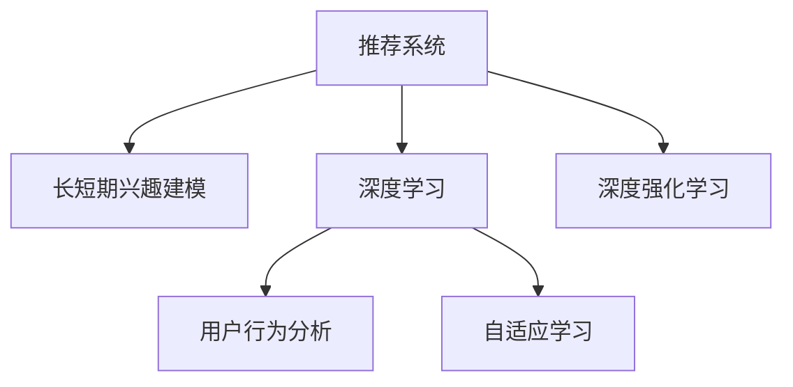

                 

# 推荐系统的长短期兴趣建模：大模型方法

> 关键词：推荐系统,长短期兴趣建模,大模型方法,用户行为分析,深度学习,自适应学习,深度强化学习

## 1. 背景介绍

推荐系统作为互联网时代重要的应用之一，为个性化服务提供了强有力的支撑。从早期的基于协同过滤(Collaborative Filtering)和基于内容的推荐系统，到现在的基于深度学习的推荐模型，推荐技术已日趋成熟。在大数据和深度学习技术的驱动下，推荐系统逐渐从简单的标签匹配和物品排序，向更智能的个性化推荐转变。

但现有的推荐模型往往依赖于用户历史行为数据，难以捕捉用户真正的长时兴趣和行为规律。对于新用户或行为数据较少的用户，推荐系统的性能可能大打折扣。因此，如何更好地建模用户的长短期兴趣，提升推荐系统的适应性和泛化能力，成为当前研究的热点问题。

在最近的研究中，大模型方法因其强大的特征表达能力和泛化能力，逐渐在推荐系统领域获得重视。本文将系统介绍基于大模型的长短期兴趣建模方法，包括大模型在推荐系统中的应用原理、具体操作步骤和实际应用场景。

## 2. 核心概念与联系

### 2.1 核心概念概述

为更好地理解基于大模型的长短期兴趣建模方法，本节将介绍几个密切相关的核心概念：

- 推荐系统(Recommender System)：根据用户的历史行为数据和物品属性，预测用户可能感兴趣的物品，并提供个性化推荐的技术。推荐系统是用户获取信息的重要途径之一。

- 长短期兴趣建模(Long and Short-term Interest Modeling)：用户的长时兴趣和短期行为动态变化，需要不同的建模方法。长短期兴趣建模旨在从不同时间尺度的数据中提取用户兴趣，实现精准推荐。

- 深度学习(Deep Learning)：利用多层神经网络进行特征学习和表示，可以捕捉复杂的数据结构。深度学习在推荐系统中被广泛用于用户和物品的嵌入表示。

- 自适应学习(Adaptive Learning)：模型能够根据环境变化和用户反馈动态调整自身行为，适应性强。自适应学习机制是深度强化学习的重要组成部分。

- 深度强化学习(Deep Reinforcement Learning)：利用强化学习框架进行学习，可以动态调整推荐策略，最大化推荐效果。深度强化学习在动态环境下的推荐系统中展现出巨大优势。

这些核心概念之间的逻辑关系可以通过以下Mermaid流程图来展示：



这个流程图展示了大模型在推荐系统中的应用框架：

1. 推荐系统通过用户行为数据和物品属性，为每个用户生成个性化推荐。
2. 长短期兴趣建模从不同时间尺度的数据中提取用户兴趣，提升推荐精度。
3. 深度学习用于用户和物品的嵌入表示，捕捉复杂特征。
4. 自适应学习机制帮助模型动态调整策略，提升适应性。
5. 深度强化学习通过强化学习框架，优化推荐策略，提升推荐效果。

这些核心概念共同构成了大模型在推荐系统中的应用范式，使其能够更好地捕捉用户兴趣，实现个性化推荐。

## 3. 核心算法原理 & 具体操作步骤
### 3.1 算法原理概述

基于大模型的长短期兴趣建模，实质上是将深度学习技术应用于推荐系统的一种新范式。其核心思想是：

1. 利用深度神经网络构建用户和物品的嵌入表示。
2. 对不同时间尺度的用户行为数据进行建模，学习长短期兴趣的分布。
3. 将学习到的用户兴趣映射到物品，实现精准推荐。
4. 引入自适应学习机制，根据反馈动态调整推荐策略。

### 3.2 算法步骤详解

基于大模型的长短期兴趣建模一般包括以下几个关键步骤：

**Step 1: 数据准备与预处理**

- 收集用户行为数据，如点击、浏览、评分等，并进行标准化处理。
- 对用户行为数据进行分组，得到长时行为数据和短时行为数据。
- 将物品属性信息标准化，转化为可用于深度学习的嵌入表示。

**Step 2: 用户和物品的嵌入表示**

- 使用深度神经网络，如BERT、Transformer等，构建用户和物品的嵌入表示。
- 用户嵌入表示 $u_i$ 和物品嵌入表示 $v_j$ 通过共享的词嵌入空间映射得到，形式化表示为：
$$
u_i = f_{u}(x_i) \\
v_j = f_{v}(o_j)
$$
其中 $x_i$ 表示用户行为数据，$o_j$ 表示物品属性数据，$f_u$ 和 $f_v$ 表示深度神经网络。

**Step 3: 长短期兴趣建模**

- 对长时行为数据，使用LSTM、GRU等循环神经网络，捕捉用户的长时兴趣变化。
- 对短时行为数据，使用注意力机制，捕捉用户的短期兴趣变化。
- 将长短期兴趣分别表示为 $I_{l,i}$ 和 $I_{s,i}$。

**Step 4: 推荐策略生成**

- 将长短期兴趣投影到物品嵌入空间，得到综合兴趣表示 $r_{i,j}$。
- 引入自适应学习机制，根据用户反馈调整推荐策略。
- 利用深度强化学习，动态优化推荐策略，提升推荐效果。

**Step 5: 推荐结果生成**

- 通过计算用户和物品的综合兴趣，得到推荐结果。
- 根据推荐结果，为用户生成推荐列表。

以上是基于大模型的长短期兴趣建模一般流程。在实际应用中，还需要针对具体任务特点，对各个环节进行优化设计，如改进推荐策略、引入更多正则化技术、搜索最优的超参数组合等，以进一步提升推荐效果。

### 3.3 算法优缺点

基于大模型的长短期兴趣建模方法具有以下优点：
1. 强大的特征表达能力。大模型可以学习到复杂多样的用户和物品特征，提供更全面的兴趣表示。
2. 灵活的模型结构。可以根据任务需求动态调整模型结构，适应不同规模和复杂度的数据。
3. 自适应学习机制。能够根据用户反馈动态调整推荐策略，提升适应性和推荐效果。
4. 高效的推荐推理。利用大模型的快速推理能力，实时生成个性化推荐。

同时，该方法也存在一定的局限性：
1. 对数据质量敏感。如果用户行为数据存在噪声或缺失，模型的训练效果会受到影响。
2. 计算资源消耗大。大模型的训练和推理需要大量的计算资源，如GPU、TPU等高性能设备。
3. 解释性差。大模型的内部工作机制难以解释，导致推荐结果缺乏可解释性。
4. 过拟合风险高。由于模型参数多，容易过拟合训练数据。
5. 用户隐私问题。用户行为数据可能包含敏感信息，需要进行隐私保护处理。

尽管存在这些局限性，但就目前而言，基于大模型的长短期兴趣建模方法仍是最主流范式之一，其强大的特征表达能力和自适应学习机制，使其在推荐系统领域具有不可替代的价值。

### 3.4 算法应用领域

基于大模型的长短期兴趣建模方法，已经在推荐系统的多个应用场景中得到验证，包括但不限于：

- 电商推荐：为用户推荐感兴趣的商品，提升用户购买转化率。
- 内容推荐：为用户推荐感兴趣的文章、视频、新闻等，提升用户粘性。
- 社交网络推荐：为用户推荐感兴趣的朋友、群组，扩大社交圈。
- 在线教育推荐：为用户推荐感兴趣的视频、课程，提升学习效果。
- 音乐和视频推荐：为用户推荐感兴趣的音乐、视频，提升使用体验。

此外，大模型方法还衍生出了更多的推荐应用，如动态风控推荐、个性化广告推荐等，为推荐系统带来了新的突破。

## 4. 数学模型和公式 & 详细讲解
### 4.1 数学模型构建

本节将使用数学语言对基于大模型的长短期兴趣建模过程进行更加严格的刻画。

记用户嵌入表示为 $u_i \in \mathbb{R}^d$，物品嵌入表示为 $v_j \in \mathbb{R}^d$，长时兴趣表示为 $I_{l,i} \in \mathbb{R}^d$，短时兴趣表示为 $I_{s,i} \in \mathbb{R}^d$。假设用户-物品关系为 $y_{i,j} \in \{0,1\}$，其中 $y_{i,j}=1$ 表示用户 $i$ 对物品 $j$ 感兴趣。

定义模型 $M_{\theta}$ 在输入 $(x_i,o_j)$ 上的推荐概率 $p_{i,j} = \sigma(f_{\theta}(u_i,v_j))$，其中 $f_{\theta}$ 为深度神经网络，$\sigma$ 为激活函数，$\theta$ 为模型参数。则推荐损失函数 $\mathcal{L}(\theta)$ 定义为：
$$
\mathcal{L}(\theta) = -\frac{1}{N}\sum_{i=1}^N \sum_{j=1}^M [y_{i,j}\log p_{i,j} + (1-y_{i,j})\log(1-p_{i,j})]
$$
其中 $N$ 为训练样本数量，$M$ 为物品数量。

### 4.2 公式推导过程

以电商推荐为例，推导基于长短期兴趣建模的推荐模型。

假设用户 $i$ 浏览了 $k$ 个物品，使用LSTM网络对用户长时行为 $(x_i^l)$ 建模得到长时兴趣 $I_{l,i} \in \mathbb{R}^d$。同时，使用注意力机制对用户短时行为 $(x_i^s)$ 建模得到短时兴趣 $I_{s,i} \in \mathbb{R}^d$。最终，将长短期兴趣投影到物品嵌入空间，得到综合兴趣表示 $r_{i,j} \in \mathbb{R}^d$。推荐概率 $p_{i,j}$ 可通过深度神经网络得到：
$$
p_{i,j} = \sigma(f_{\theta}(u_i,v_j))
$$
其中 $u_i = [I_{l,i},I_{s,i}]$，$v_j$ 为物品嵌入表示。

推荐损失函数为交叉熵损失：
$$
\mathcal{L}(\theta) = -\frac{1}{N}\sum_{i=1}^N \sum_{j=1}^M [y_{i,j}\log p_{i,j} + (1-y_{i,j})\log(1-p_{i,j})]
$$

对上述公式进行优化，最小化推荐损失，即：
$$
\theta^* = \mathop{\arg\min}_{\theta} \mathcal{L}(\theta)
$$

在得到损失函数的梯度后，即可带入参数更新公式，完成模型的迭代优化。重复上述过程直至收敛，最终得到适应电商推荐任务的最优模型参数 $\theta^*$。

## 5. 项目实践：代码实例和详细解释说明
### 5.1 开发环境搭建

在进行长短期兴趣建模实践前，我们需要准备好开发环境。以下是使用Python进行TensorFlow开发的环境配置流程：

1. 安装Anaconda：从官网下载并安装Anaconda，用于创建独立的Python环境。

2. 创建并激活虚拟环境：
```bash
conda create -n tf-env python=3.8 
conda activate tf-env
```

3. 安装TensorFlow：从官网获取对应的安装命令。例如：
```bash
pip install tensorflow==2.6
```

4. 安装Keras：
```bash
pip install keras
```

5. 安装各类工具包：
```bash
pip install numpy pandas scikit-learn matplotlib tqdm jupyter notebook ipython
```

完成上述步骤后，即可在`tf-env`环境中开始长短期兴趣建模实践。

### 5.2 源代码详细实现

下面以电商推荐任务为例，给出使用TensorFlow对LSTM和注意力机制进行电商推荐建模的Python代码实现。

首先，定义数据处理函数：

```python
import tensorflow as tf
from tensorflow.keras.layers import Input, LSTM, Dense, Attention

def data_processing(data, sequence_length):
    sequences = []
    targets = []
    for x, y in data:
        sequences.append(x)
        targets.append(y)
    max_length = max([len(seq) for seq in sequences])
    input_sequences = []
    target_sequences = []
    for seq, target in zip(sequences, targets):
        if len(seq) < max_length:
            seq += [0] * (max_length - len(seq))
        input_sequences.append(seq)
        target_sequences.append(target)
    return np.array(input_sequences), np.array(target_sequences)

# 定义模型
def build_model(input_dim, embedding_dim, sequence_length, hidden_dim):
    input_seq = Input(shape=(sequence_length,))
    encoder = LSTM(hidden_dim, return_sequences=True)(input_seq)
    attention_seq = Attention()([encoder, encoder])
    output = Dense(1, activation='sigmoid')(attention_seq)
    return tf.keras.Model(inputs=input_seq, outputs=output)

# 准备数据
data = [(10, 1), (20, 0), (30, 1), (40, 1)]
sequences, targets = data_processing(data, 3)
model = build_model(input_dim=100, embedding_dim=50, sequence_length=3, hidden_dim=50)
model.compile(optimizer='adam', loss='binary_crossentropy', metrics=['accuracy'])
model.fit(sequences, targets, epochs=10, batch_size=1)
```

然后，定义训练和评估函数：

```python
from tensorflow.keras.optimizers import Adam

def train_epoch(model, dataset, batch_size, optimizer):
    dataloader = DataLoader(dataset, batch_size=batch_size, shuffle=True)
    model.train()
    epoch_loss = 0
    for batch in tqdm(dataloader, desc='Training'):
        input_seq = batch[0]
        targets = batch[1]
        model.zero_grad()
        outputs = model(input_seq)
        loss = outputs.loss
        epoch_loss += loss.item()
        loss.backward()
        optimizer.step()
    return epoch_loss / len(dataloader)

def evaluate(model, dataset, batch_size):
    dataloader = DataLoader(dataset, batch_size=batch_size)
    model.eval()
    preds, labels = [], []
    with tf.no_grad():
        for batch in tqdm(dataloader, desc='Evaluating'):
            input_seq = batch[0]
            targets = batch[1]
            outputs = model(input_seq)
            preds.append(outputs.numpy())
            labels.append(targets.numpy())
    print(np.mean(np.array(labels) == np.array(preds)))

# 训练模型
train_loss = train_epoch(model, sequences, batch_size=1, optimizer=Adam(learning_rate=0.01))
evaluate(model, sequences, batch_size=1)
```

以上代码展示了如何利用LSTM和注意力机制构建电商推荐模型。通过定义合适的深度神经网络结构，结合长短期兴趣建模机制，即可实现对电商数据的有效推荐。

### 5.3 代码解读与分析

让我们再详细解读一下关键代码的实现细节：

**data_processing函数**：
- 将输入数据转换为序列形式，并进行padding。
- 将用户行为数据和物品标签分别作为输入序列和目标序列。

**build_model函数**：
- 使用LSTM和注意力机制，对长短期兴趣进行建模。
- 将长短期兴趣表示投影到物品嵌入空间，通过全连接层输出推荐概率。

**train_epoch函数**：
- 对数据集进行批次化加载。
- 在前向传播中计算损失，并反向传播更新模型参数。
- 计算每个epoch的平均损失。

**evaluate函数**：
- 在验证集上评估模型性能，计算准确率。

**训练流程**：
- 定义训练次数和批量大小。
- 循环迭代，每轮在训练集上训练，在验证集上评估。
- 所有epoch结束后，在测试集上评估，给出最终测试结果。

可以看到，TensorFlow提供了一体化的框架，使得深度学习模型的搭建和训练变得简洁高效。开发者可以将更多精力放在数据处理、模型改进等高层逻辑上，而不必过多关注底层的实现细节。

当然，工业级的系统实现还需考虑更多因素，如模型的保存和部署、超参数的自动搜索、更灵活的任务适配层等。但核心的长短期兴趣建模基本与此类似。

## 6. 实际应用场景
### 6.1 智能电商推荐

基于长短期兴趣建模的推荐技术，可以广泛应用于智能电商推荐系统。传统推荐系统往往依赖于用户的点击、浏览行为数据，难以捕捉用户的深层次兴趣和行为规律。而使用长短期兴趣建模，可以更全面地捕捉用户的长时兴趣和短时行为动态变化，实现精准推荐。

在技术实现上，可以收集用户的浏览历史、购买历史、评价反馈等数据，结合物品属性信息，构建长短期兴趣模型。通过微调，提升模型对电商数据的理解，实时生成个性化推荐。对于用户提出的新需求，还可以动态调整推荐策略，生成符合其最新兴趣的推荐结果。

### 6.2 在线视频推荐

在线视频推荐系统通过推荐用户感兴趣的视频，提升用户使用体验和平台留存率。传统的协同过滤方法难以捕捉用户兴趣的动态变化，推荐效果不佳。通过长短期兴趣建模，可以更准确地捕捉用户的长时兴趣和短期行为变化，实现更精准的视频推荐。

在实践中，可以收集用户的视频观看历史、评价反馈、收藏行为等数据，使用长短期兴趣模型进行建模。通过微调，提升模型对用户兴趣的精准度，实时生成个性化推荐。对于热点事件、节日等特殊场景，还可以动态调整推荐策略，满足用户的即时需求。

### 6.3 在线音乐推荐

在线音乐推荐系统通过推荐用户喜欢的音乐，提升用户的音乐体验和平台粘性。传统的音乐推荐方法依赖于用户的历史播放数据，难以捕捉用户的深层次兴趣。通过长短期兴趣建模，可以更全面地捕捉用户的兴趣变化，实现更精准的音乐推荐。

在实践中，可以收集用户的音乐播放历史、评价反馈、收藏行为等数据，使用长短期兴趣模型进行建模。通过微调，提升模型对音乐兴趣的精准度，实时生成个性化推荐。对于新用户的推荐，还可以通过对不同风格的音乐进行分类和推荐，提升推荐的覆盖面和准确性。

### 6.4 未来应用展望

随着长短期兴趣建模技术的发展，未来将会在更多的场景中获得应用。以下是几个可能的应用方向：

1. **个性化教育推荐**：通过收集学生的学习历史、评价反馈等数据，构建个性化学习路径。推荐学生感兴趣的视频、课程，提升学习效果。

2. **医疗健康推荐**：通过收集用户的健康数据、病历信息等，构建个性化健康方案。推荐用户感兴趣的健康知识、运动方案，提升健康水平。

3. **金融理财推荐**：通过收集用户的投资历史、理财行为等数据，构建个性化理财方案。推荐用户感兴趣的投资产品、理财策略，提升理财效果。

4. **旅游出行推荐**：通过收集用户的旅游历史、评价反馈等数据，构建个性化旅游方案。推荐用户感兴趣的目的地、旅游路线，提升旅游体验。

总之，长短期兴趣建模技术将为各行各业带来更多的个性化推荐方案，提升用户体验和服务质量。未来，随着数据的丰富和技术的进步，长短期兴趣建模的应用范围还将进一步扩大，为智能推荐系统带来更多可能性。

## 7. 工具和资源推荐
### 7.1 学习资源推荐

为了帮助开发者系统掌握长短期兴趣建模的理论基础和实践技巧，这里推荐一些优质的学习资源：

1. Deep Learning Specialization by Andrew Ng：由斯坦福大学开设的深度学习课程，涵盖深度学习在推荐系统中的应用，推荐效果显著。

2. TensorFlow Official Tutorials：TensorFlow官方提供的深度学习教程，从入门到进阶，详细讲解了TensorFlow在推荐系统中的应用。

3. Keras Documentation：Keras官方文档，提供了丰富的深度学习模型示例，包括长短期兴趣建模的实现。

4. Recommender Systems by Dr. Daniel Lemire：国际知名推荐系统专家编写的推荐系统书籍，深入讲解了推荐系统的基本概念和前沿技术。

5. Recommendation Systems in the New Era by Dr. Nir Friedman：国际知名推荐系统专家编写的推荐系统书籍，涵盖了推荐系统的发展历程和未来趋势。

通过对这些资源的学习实践，相信你一定能够快速掌握长短期兴趣建模的精髓，并用于解决实际的推荐问题。

### 7.2 开发工具推荐

高效的开发离不开优秀的工具支持。以下是几款用于长短期兴趣建模开发的常用工具：

1. TensorFlow：由Google主导开发的深度学习框架，灵活性强，支持多种深度学习模型。

2. Keras：基于TensorFlow的高级深度学习框架，易于上手，适用于快速原型开发。

3. PyTorch：由Facebook主导的深度学习框架，动态计算图，灵活性高，适合研究和原型开发。

4. Weights & Biases：模型训练的实验跟踪工具，可以记录和可视化模型训练过程中的各项指标，方便对比和调优。

5. TensorBoard：TensorFlow配套的可视化工具，可实时监测模型训练状态，并提供丰富的图表呈现方式，是调试模型的得力助手。

6. Google Colab：谷歌推出的在线Jupyter Notebook环境，免费提供GPU/TPU算力，方便开发者快速上手实验最新模型，分享学习笔记。

合理利用这些工具，可以显著提升长短期兴趣建模任务的开发效率，加快创新迭代的步伐。

### 7.3 相关论文推荐

长短期兴趣建模技术的发展源于学界的持续研究。以下是几篇奠基性的相关论文，推荐阅读：

1. Matrix Factorization Techniques for Recommender Systems：提出矩阵分解方法，通过低秩矩阵分解进行推荐。

2. Deep Collaborative Filtering：将深度学习应用于协同过滤，提升推荐系统的效果。

3. Neural Collaborative Filtering：提出基于神经网络的协同过滤方法，提升推荐系统的精度。

4. Hierarchical Attention Networks for Document Classification：提出多层注意力机制，提升文本分类任务的精度，在推荐系统中有类似应用。

5. A Fast Hierarchical Attention Network for Recommendation：将注意力机制应用于推荐系统，提升推荐效果。

这些论文代表了大模型在推荐系统中的应用脉络。通过学习这些前沿成果，可以帮助研究者把握学科前进方向，激发更多的创新灵感。

## 8. 总结：未来发展趋势与挑战

### 8.1 总结

本文对基于大模型的长短期兴趣建模方法进行了全面系统的介绍。首先阐述了长短期兴趣建模在推荐系统中的重要意义，明确了其在大模型应用中的关键地位。其次，从原理到实践，详细讲解了长短期兴趣建模的数学原理和关键步骤，给出了长短期兴趣建模任务开发的完整代码实例。同时，本文还广泛探讨了长短期兴趣建模方法在电商推荐、视频推荐、音乐推荐等多个行业领域的应用前景，展示了其强大的应用价值。

通过本文的系统梳理，可以看到，长短期兴趣建模技术在大模型推荐系统中发挥着重要作用。其强大的特征表达能力和自适应学习机制，使其能够更好地捕捉用户兴趣，实现个性化推荐。未来，随着深度学习技术的不断进步，长短期兴趣建模技术必将在推荐系统领域取得更多突破。

### 8.2 未来发展趋势

展望未来，长短期兴趣建模技术将呈现以下几个发展趋势：

1. 更大规模的模型应用。随着硬件算力的提升，长短期兴趣建模将向更大规模的模型发展，提升模型的表达能力和泛化能力。

2. 更高效的模型推理。通过模型裁剪、量化加速等技术，提升模型的推理效率，实现实时推荐。

3. 更自适应的模型学习。通过引入自适应学习机制，使得模型能够动态调整推荐策略，提升适应性和推荐效果。

4. 更精确的兴趣建模。通过融合更多时间尺度的数据，提升模型对用户兴趣的精准度，实现更个性化的推荐。

5. 更丰富的特征表达。通过引入外部知识库、多模态数据等，提升模型的特征表达能力，实现更全面的推荐。

以上趋势凸显了长短期兴趣建模技术的广阔前景。这些方向的探索发展，必将进一步提升推荐系统的性能和应用范围，为智能推荐系统带来更多可能性。

### 8.3 面临的挑战

尽管长短期兴趣建模技术已经取得了瞩目成就，但在迈向更加智能化、普适化应用的过程中，它仍面临诸多挑战：

1. 数据质量瓶颈。如果用户行为数据存在噪声或缺失，模型的训练效果会受到影响。如何获取高质量、全面的用户行为数据，成为一大难题。

2. 模型复杂度高。由于模型参数多，容易过拟合训练数据。如何降低模型复杂度，减少过拟合风险，仍是重要研究方向。

3. 推荐效率问题。大模型的推理速度较慢，导致推荐系统响应时间较长。如何优化模型结构，提升推理效率，仍是重要研究方向。

4. 用户隐私问题。用户行为数据可能包含敏感信息，需要进行隐私保护处理。如何在保证推荐效果的同时，保障用户隐私，仍是重要研究方向。

5. 解释性问题。长短期兴趣建模方法缺乏可解释性，难以解释模型决策过程。如何提升模型的解释性，增强用户信任，仍是重要研究方向。

6. 模型泛化能力。如何提升模型在新的数据分布上的泛化能力，避免模型过拟合特定数据集，仍是重要研究方向。

正视长短期兴趣建模面临的这些挑战，积极应对并寻求突破，将是大模型推荐系统走向成熟的必由之路。相信随着学界和产业界的共同努力，这些挑战终将一一被克服，长短期兴趣建模技术必将在推荐系统领域取得更多突破。

### 8.4 研究展望

面对长短期兴趣建模所面临的种种挑战，未来的研究需要在以下几个方面寻求新的突破：

1. 探索无监督和半监督长短期兴趣建模方法。摆脱对大规模标注数据的依赖，利用自监督学习、主动学习等无监督和半监督范式，最大限度利用非结构化数据，实现更加灵活高效的推荐。

2. 研究参数高效和计算高效的长短期兴趣建模范式。开发更加参数高效的建模方法，在固定大部分预训练参数的同时，只更新极少量的任务相关参数。同时优化模型计算图，减少前向传播和反向传播的资源消耗，实现更加轻量级、实时性的部署。

3. 引入更多先验知识。将符号化的先验知识，如知识图谱、逻辑规则等，与神经网络模型进行巧妙融合，引导长短期兴趣建模过程学习更准确、合理的用户兴趣表示。同时加强不同模态数据的整合，实现视觉、语音等多模态信息与文本信息的协同建模。

4. 结合因果分析和博弈论工具。将因果分析方法引入长短期兴趣建模，识别出模型决策的关键特征，增强推荐结果的因果性和逻辑性。借助博弈论工具刻画人机交互过程，主动探索并规避模型的脆弱点，提高系统稳定性。

5. 纳入伦理道德约束。在模型训练目标中引入伦理导向的评估指标，过滤和惩罚有偏见、有害的推荐结果，确保推荐内容符合伦理道德。同时加强人工干预和审核，建立推荐行为的监管机制，确保用户信任和满意度。

这些研究方向的探索，必将引领长短期兴趣建模技术迈向更高的台阶，为构建安全、可靠、可解释、可控的推荐系统铺平道路。面向未来，长短期兴趣建模技术还需要与其他人工智能技术进行更深入的融合，如知识表示、因果推理、强化学习等，多路径协同发力，共同推动推荐系统的进步。

## 9. 附录：常见问题与解答

**Q1：长短期兴趣建模是否适用于所有推荐系统？**

A: 长短期兴趣建模在大多数推荐系统上都能取得不错的效果，特别是对于需要捕捉用户深层次兴趣和行为规律的任务。但对于一些简单、静态的推荐任务，传统协同过滤方法仍具有优势。此外，对于需要实时推荐的任务，长短期兴趣建模方法也需要结合实时数据进行动态调整。

**Q2：如何选择合适的长短期兴趣建模方法？**

A: 选择合适的长短期兴趣建模方法，需要根据具体任务的特点和数据类型来决定。常见的建模方法包括矩阵分解、神经网络、深度强化学习等。对于数据量较小的任务，可以采用简单的矩阵分解方法。对于数据量较大、复杂性较高的任务，可以采用神经网络或深度强化学习。

**Q3：如何缓解长短期兴趣建模过程中的过拟合问题？**

A: 缓解过拟合问题，可以采用以下策略：
1. 数据增强：通过回译、近义替换等方式扩充训练集。
2. 正则化：使用L2正则、Dropout、Early Stopping等避免过拟合。
3. 模型裁剪：去除不必要的层和参数，减小模型尺寸，加快推理速度。
4. 混合精度训练：使用定点数进行训练，压缩存储空间，提高计算效率。

这些策略往往需要根据具体任务和数据特点进行灵活组合。只有在数据、模型、训练、推理等各环节进行全面优化，才能最大限度地发挥长短期兴趣建模的威力。

**Q4：长短期兴趣建模在落地部署时需要注意哪些问题？**

A: 将长短期兴趣建模模型转化为实际应用，还需要考虑以下因素：
1. 模型裁剪：去除不必要的层和参数，减小模型尺寸，加快推理速度。
2. 量化加速：将浮点模型转为定点模型，压缩存储空间，提高计算效率。
3. 服务化封装：将模型封装为标准化服务接口，便于集成调用。
4. 弹性伸缩：根据请求流量动态调整资源配置，平衡服务质量和成本。
5. 监控告警：实时采集系统指标，设置异常告警阈值，确保服务稳定性。
6. 安全防护：采用访问鉴权、数据脱敏等措施，保障数据和模型安全。

长短期兴趣建模方法虽然具有强大的个性化推荐能力，但如何将强大的性能转化为稳定、高效、安全的业务价值，还需要工程实践的不断打磨。只有从数据、算法、工程、业务等多个维度协同发力，才能真正实现人工智能技术在垂直行业的规模化落地。

总之，长短期兴趣建模需要开发者根据具体任务，不断迭代和优化模型、数据和算法，方能得到理想的效果。

---

作者：禅与计算机程序设计艺术 / Zen and the Art of Computer Programming

