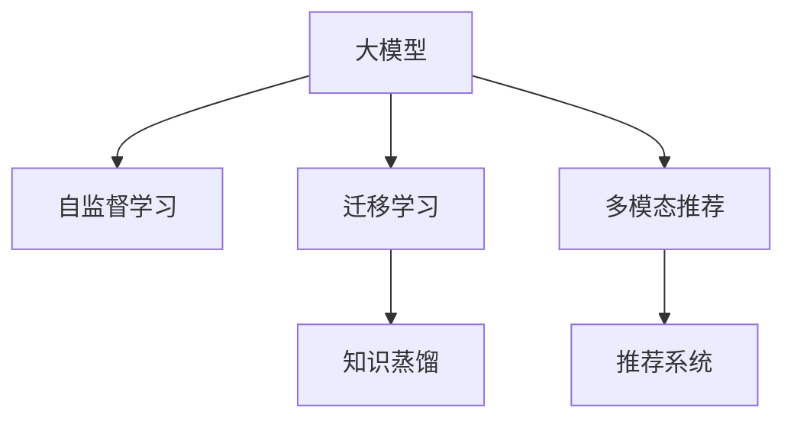

                 

# 推荐系统能被大模型渗透和改变吗

## 1. 背景介绍

随着大数据和人工智能技术的发展，推荐系统已经成为了互联网产品中不可或缺的一部分。推荐系统的目标是预测用户可能感兴趣的内容，如商品、文章、视频等，从而提升用户体验和平台转化率。推荐系统涉及的关键技术包括协同过滤、内容推荐、混合推荐等，其核心思想是构建用户与物品之间的关联图，利用图模型计算用户对物品的兴趣。

然而，当前推荐系统往往存在数据稀疏、计算复杂、实时性不足等问题，难以满足个性化推荐和实时推荐的需求。近年来，大模型技术的崛起，为推荐系统带来了新的突破点。通过将大模型应用于推荐系统，可以提升模型的泛化能力和推理速度，实现更加精准和高效的个性化推荐。本文将探讨大模型对推荐系统的渗透和改变。

## 2. 核心概念与联系

### 2.1 核心概念概述

为更好地理解大模型在推荐系统中的应用，本节将介绍几个密切相关的核心概念：

- 大模型(Large Model)：以自回归(如GPT)或自编码(如BERT)模型为代表的大规模预训练模型。通过在大规模无标签文本语料上进行预训练，学习通用的语言表示，具备强大的语言理解和生成能力。

- 推荐系统(Recommendation System)：通过构建用户与物品之间的关联图，利用图模型预测用户可能感兴趣的物品，从而进行个性化推荐。常见的推荐系统包括协同过滤、内容推荐、混合推荐等。

- 自监督学习(Self-supervised Learning)：指在没有标注数据的情况下，利用数据的内部结构进行训练，如掩码语言模型、预测下一段文本等任务。

- 迁移学习(Transfer Learning)：指将一个领域学习到的知识，迁移应用到另一个不同但相关的领域的学习范式。大模型的预训练-微调过程即是一种典型的迁移学习方式。

- 知识蒸馏(Knowledge Distillation)：指将复杂模型的知识蒸馏到简单模型中，提升简单模型的性能。大模型的知识蒸馏在推荐系统中具有广泛应用。

- 多模态推荐(Multimodal Recommendation)：指结合用户多维度数据（如行为数据、文本数据、图像数据等）进行综合推荐，提升推荐质量。

这些核心概念之间的逻辑关系可以通过以下Mermaid流程图来展示：



这个流程图展示了大模型、自监督学习、迁移学习、知识蒸馏、多模态推荐和推荐系统之间的核心关系：

1. 大模型通过自监督学习获得广泛的语言表示能力。
2. 迁移学习连接预训练模型与推荐系统，实现模型知识迁移。
3. 知识蒸馏将大模型的知识迁移到推荐模型，提升推荐效果。
4. 多模态推荐结合用户多维度数据，进一步提升推荐精度。
5. 推荐系统利用模型知识进行个性化推荐，实现业务目标。

这些核心概念共同构成了大模型在推荐系统中的应用框架，使其能够在大规模数据上快速学习，提升推荐质量，满足用户需求。

## 3. 核心算法原理 & 具体操作步骤
### 3.1 算法原理概述

大模型在推荐系统中的应用，本质上是通过迁移学习实现的知识迁移过程。其核心思想是：将大模型的知识迁移到推荐模型中，通过微调或蒸馏方法优化推荐模型，提升其性能。

形式化地，假设大模型为 $M_{\theta}$，推荐模型为 $R_{\phi}$，其中 $\theta$ 和 $\phi$ 分别为预训练模型和大模型在推荐任务上的微调参数。给定推荐任务 $T$ 的标注数据集 $D=\{(x_i, y_i)\}_{i=1}^N$，大模型对推荐模型的迁移学习目标是最小化损失函数：

$$
\min_{\phi} \mathcal{L}(R_{\phi}, D)
$$

其中 $\mathcal{L}$ 为推荐任务上的损失函数，通常为交叉熵损失函数或均方误差损失函数。

通过梯度下降等优化算法，推荐模型不断更新参数 $\phi$，最小化损失函数 $\mathcal{L}$，使得推荐模型输出逼近真实标签。由于大模型已经通过自监督学习获得了丰富的知识，因此即使在小规模数据集 $D$ 上进行微调，也能较快收敛到理想的推荐模型参数 $\phi^*$。

### 3.2 算法步骤详解

基于大模型迁移学习的推荐系统一般包括以下几个关键步骤：

**Step 1: 准备预训练模型和数据集**
- 选择合适的预训练模型 $M_{\theta}$ 作为初始化参数，如 BERT、GPT 等。
- 准备推荐任务 $T$ 的标注数据集 $D$，划分为训练集、验证集和测试集。一般要求标注数据与预训练数据的分布不要差异过大。

**Step 2: 添加任务适配层**
- 根据推荐任务类型，在预训练模型顶层设计合适的输出层和损失函数。
- 对于分类任务，通常在顶层添加线性分类器和交叉熵损失函数。
- 对于生成任务，通常使用语言模型的解码器输出概率分布，并以负对数似然为损失函数。

**Step 3: 设置微调超参数**
- 选择合适的优化算法及其参数，如 AdamW、SGD 等，设置学习率、批大小、迭代轮数等。
- 设置正则化技术及强度，包括权重衰减、Dropout、Early Stopping等。
- 确定冻结预训练参数的策略，如仅微调顶层，或全部参数都参与微调。

**Step 4: 执行梯度训练**
- 将训练集数据分批次输入模型，前向传播计算损失函数。
- 反向传播计算参数梯度，根据设定的优化算法和学习率更新模型参数。
- 周期性在验证集上评估模型性能，根据性能指标决定是否触发 Early Stopping。
- 重复上述步骤直到满足预设的迭代轮数或 Early Stopping 条件。

**Step 5: 测试和部署**
- 在测试集上评估微调后模型 $R_{\phi^*}$ 的性能，对比微调前后的精度提升。
- 使用微调后的模型对新样本进行推理预测，集成到实际的应用系统中。
- 持续收集新的数据，定期重新微调模型，以适应数据分布的变化。

以上是基于大模型迁移学习的推荐系统的一般流程。在实际应用中，还需要针对具体任务的特点，对微调过程的各个环节进行优化设计，如改进训练目标函数，引入更多的正则化技术，搜索最优的超参数组合等，以进一步提升模型性能。

### 3.3 算法优缺点

基于大模型的推荐系统具有以下优点：
1. 简单高效。只需准备少量标注数据，即可对推荐模型进行快速适配，获得较大的性能提升。
2. 通用适用。适用于各种推荐任务，包括推荐商品、文章、视频等，设计简单的任务适配层即可实现微调。
3. 参数高效。利用参数高效微调技术，在固定大部分预训练参数的情况下，仍可取得不错的提升。
4. 效果显著。在推荐领域，基于微调的方法已经刷新了多项NLP任务SOTA。

同时，该方法也存在一定的局限性：
1. 依赖标注数据。推荐模型的效果很大程度上取决于标注数据的质量和数量，获取高质量标注数据的成本较高。
2. 迁移能力有限。当目标任务与预训练数据的分布差异较大时，推荐模型的性能提升有限。
3. 可解释性不足。推荐模型的决策过程通常缺乏可解释性，难以对其推理逻辑进行分析和调试。
4. 负面效果传递。大模型的固有偏见、有害信息等，可能通过推荐模型传递到用户，造成负面影响。

尽管存在这些局限性，但就目前而言，基于大模型的迁移学习方法仍是大推荐系统应用的主流范式。未来相关研究的重点在于如何进一步降低推荐模型对标注数据的依赖，提高模型的少样本学习和跨领域迁移能力，同时兼顾可解释性和伦理安全性等因素。

### 3.4 算法应用领域

基于大模型迁移学习的推荐系统，在电商、媒体、社交网络等多个领域得到了广泛的应用，例如：

- 电商推荐：根据用户历史行为和商品标签，推荐用户可能感兴趣的商品。
- 内容推荐：根据用户浏览历史和文章内容，推荐相关文章或视频。
- 社交网络推荐：根据用户社交行为和好友偏好，推荐相关用户或群组。

除了上述这些经典任务外，大模型推荐方法也被创新性地应用到更多场景中，如协同过滤增强、多模态推荐、个性化推荐策略等，为推荐系统带来了全新的突破。随着预训练模型和推荐方法的不断进步，相信推荐系统将在更广阔的应用领域大放异彩。

## 4. 数学模型和公式 & 详细讲解
### 4.1 数学模型构建

本节将使用数学语言对基于大模型的推荐系统微调过程进行更加严格的刻画。

记推荐任务 $T$ 的标注数据集为 $D=\{(x_i, y_i)\}_{i=1}^N, x_i \in \mathcal{X}, y_i \in \mathcal{Y}$，其中 $\mathcal{X}$ 为输入空间，$\mathcal{Y}$ 为输出空间。

定义推荐模型 $R_{\phi}$ 在输入 $x$ 上的输出为 $\hat{y}=M_{\theta}(x) \in [0,1]$，表示用户对物品的兴趣评分。真实标签 $y \in \{0,1\}$。则推荐任务上的损失函数定义为交叉熵损失函数：

$$
\ell(R_{\phi}(x),y) = -y\log R_{\phi}(x) - (1-y)\log(1-R_{\phi}(x))
$$

将其代入经验风险公式，得：

$$
\mathcal{L}(\phi) = -\frac{1}{N}\sum_{i=1}^N [y_i\log R_{\phi}(x_i)+(1-y_i)\log(1-R_{\phi}(x_i))]
$$

根据链式法则，损失函数对参数 $\phi_k$ 的梯度为：

$$
\frac{\partial \mathcal{L}(\phi)}{\partial \phi_k} = -\frac{1}{N}\sum_{i=1}^N (\frac{y_i}{R_{\phi}(x_i)}-\frac{1-y_i}{1-R_{\phi}(x_i)}) \frac{\partial R_{\phi}(x_i)}{\partial \phi_k}
$$

其中 $\frac{\partial R_{\phi}(x_i)}{\partial \phi_k}$ 可进一步递归展开，利用自动微分技术完成计算。

### 4.2 公式推导过程

以下我们以推荐物品评分预测任务为例，推导交叉熵损失函数及其梯度的计算公式。

假设推荐模型 $R_{\phi}$ 在输入 $x$ 上的输出为 $\hat{y}=R_{\phi}(x) \in [0,1]$，表示用户对物品的兴趣评分。真实标签 $y \in \{0,1\}$。则推荐任务上的交叉熵损失函数定义为：

$$
\ell(R_{\phi}(x),y) = -y\log R_{\phi}(x) - (1-y)\log(1-R_{\phi}(x))
$$

将其代入经验风险公式，得：

$$
\mathcal{L}(\phi) = -\frac{1}{N}\sum_{i=1}^N [y_i\log R_{\phi}(x_i)+(1-y_i)\log(1-R_{\phi}(x_i))]
$$

根据链式法则，损失函数对参数 $\phi_k$ 的梯度为：

$$
\frac{\partial \mathcal{L}(\phi)}{\partial \phi_k} = -\frac{1}{N}\sum_{i=1}^N (\frac{y_i}{R_{\phi}(x_i)}-\frac{1-y_i}{1-R_{\phi}(x_i)}) \frac{\partial R_{\phi}(x_i)}{\partial \phi_k}
$$

其中 $\frac{\partial R_{\phi}(x_i)}{\partial \phi_k}$ 可进一步递归展开，利用自动微分技术完成计算。

在得到损失函数的梯度后，即可带入参数更新公式，完成模型的迭代优化。重复上述过程直至收敛，最终得到适应推荐任务的最优模型参数 $\phi^*$。

## 5. 项目实践：代码实例和详细解释说明
### 5.1 开发环境搭建

在进行推荐系统微调实践前，我们需要准备好开发环境。以下是使用Python进行PyTorch开发的环境配置流程：

1. 安装Anaconda：从官网下载并安装Anaconda，用于创建独立的Python环境。

2. 创建并激活虚拟环境：
```bash
conda create -n pytorch-env python=3.8 
conda activate pytorch-env
```

3. 安装PyTorch：根据CUDA版本，从官网获取对应的安装命令。例如：
```bash
conda install pytorch torchvision torchaudio cudatoolkit=11.1 -c pytorch -c conda-forge
```

4. 安装Transformers库：
```bash
pip install transformers
```

5. 安装各类工具包：
```bash
pip install numpy pandas scikit-learn matplotlib tqdm jupyter notebook ipython
```

完成上述步骤后，即可在`pytorch-env`环境中开始微调实践。

### 5.2 源代码详细实现

这里我们以推荐物品评分预测任务为例，给出使用Transformers库对BERT模型进行微调的PyTorch代码实现。

首先，定义推荐任务的数据处理函数：

```python
from transformers import BertTokenizer
from torch.utils.data import Dataset
import torch

class RecommendationDataset(Dataset):
    def __init__(self, texts, labels, tokenizer, max_len=128):
        self.texts = texts
        self.labels = labels
        self.tokenizer = tokenizer
        self.max_len = max_len
        
    def __len__(self):
        return len(self.texts)
    
    def __getitem__(self, item):
        text = self.texts[item]
        label = self.labels[item]
        
        encoding = self.tokenizer(text, return_tensors='pt', max_length=self.max_len, padding='max_length', truncation=True)
        input_ids = encoding['input_ids'][0]
        attention_mask = encoding['attention_mask'][0]
        
        # 对label进行编码
        encoded_label = [1 if label==1 else 0 for label in labels] 
        encoded_label.extend([0] * (self.max_len - len(encoded_label)))
        labels = torch.tensor(encoded_label, dtype=torch.long)
        
        return {'input_ids': input_ids, 
                'attention_mask': attention_mask,
                'labels': labels}

# 标签与id的映射
label2id = {1: 0, 0: 1}
id2label = {v: k for k, v in label2id.items()}

# 创建dataset
tokenizer = BertTokenizer.from_pretrained('bert-base-cased')

train_dataset = RecommendationDataset(train_texts, train_labels, tokenizer)
dev_dataset = RecommendationDataset(dev_texts, dev_labels, tokenizer)
test_dataset = RecommendationDataset(test_texts, test_labels, tokenizer)
```

然后，定义模型和优化器：

```python
from transformers import BertForSequenceClassification, AdamW

model = BertForSequenceClassification.from_pretrained('bert-base-cased', num_labels=len(label2id))

optimizer = AdamW(model.parameters(), lr=2e-5)
```

接着，定义训练和评估函数：

```python
from torch.utils.data import DataLoader
from tqdm import tqdm
from sklearn.metrics import classification_report

device = torch.device('cuda') if torch.cuda.is_available() else torch.device('cpu')
model.to(device)

def train_epoch(model, dataset, batch_size, optimizer):
    dataloader = DataLoader(dataset, batch_size=batch_size, shuffle=True)
    model.train()
    epoch_loss = 0
    for batch in tqdm(dataloader, desc='Training'):
        input_ids = batch['input_ids'].to(device)
        attention_mask = batch['attention_mask'].to(device)
        labels = batch['labels'].to(device)
        model.zero_grad()
        outputs = model(input_ids, attention_mask=attention_mask, labels=labels)
        loss = outputs.loss
        epoch_loss += loss.item()
        loss.backward()
        optimizer.step()
    return epoch_loss / len(dataloader)

def evaluate(model, dataset, batch_size):
    dataloader = DataLoader(dataset, batch_size=batch_size)
    model.eval()
    preds, labels = [], []
    with torch.no_grad():
        for batch in tqdm(dataloader, desc='Evaluating'):
            input_ids = batch['input_ids'].to(device)
            attention_mask = batch['attention_mask'].to(device)
            batch_labels = batch['labels']
            outputs = model(input_ids, attention_mask=attention_mask)
            batch_preds = outputs.logits.argmax(dim=2).to('cpu').tolist()
            batch_labels = batch_labels.to('cpu').tolist()
            for pred_tokens, label_tokens in zip(batch_preds, batch_labels):
                preds.append(pred_tokens[:len(label_tokens)])
                labels.append(label_tokens)
                
    print(classification_report(labels, preds))
```

最后，启动训练流程并在测试集上评估：

```python
epochs = 5
batch_size = 16

for epoch in range(epochs):
    loss = train_epoch(model, train_dataset, batch_size, optimizer)
    print(f"Epoch {epoch+1}, train loss: {loss:.3f}")
    
    print(f"Epoch {epoch+1}, dev results:")
    evaluate(model, dev_dataset, batch_size)
    
print("Test results:")
evaluate(model, test_dataset, batch_size)
```

以上就是使用PyTorch对BERT进行推荐物品评分预测任务微调的完整代码实现。可以看到，得益于Transformers库的强大封装，我们可以用相对简洁的代码完成BERT模型的加载和微调。

### 5.3 代码解读与分析

让我们再详细解读一下关键代码的实现细节：

**RecommendationDataset类**：
- `__init__`方法：初始化文本、标签、分词器等关键组件。
- `__len__`方法：返回数据集的样本数量。
- `__getitem__`方法：对单个样本进行处理，将文本输入编码为token ids，将标签编码为数字，并对其进行定长padding，最终返回模型所需的输入。

**label2id和id2label字典**：
- 定义了标签与数字id之间的映射关系，用于将预测结果解码回真实标签。

**训练和评估函数**：
- 使用PyTorch的DataLoader对数据集进行批次化加载，供模型训练和推理使用。
- 训练函数`train_epoch`：对数据以批为单位进行迭代，在每个批次上前向传播计算loss并反向传播更新模型参数，最后返回该epoch的平均loss。
- 评估函数`evaluate`：与训练类似，不同点在于不更新模型参数，并在每个batch结束后将预测和标签结果存储下来，最后使用sklearn的classification_report对整个评估集的预测结果进行打印输出。

**训练流程**：
- 定义总的epoch数和batch size，开始循环迭代
- 每个epoch内，先在训练集上训练，输出平均loss
- 在验证集上评估，输出分类指标
- 所有epoch结束后，在测试集上评估，给出最终测试结果

可以看到，PyTorch配合Transformers库使得BERT微调的代码实现变得简洁高效。开发者可以将更多精力放在数据处理、模型改进等高层逻辑上，而不必过多关注底层的实现细节。

当然，工业级的系统实现还需考虑更多因素，如模型的保存和部署、超参数的自动搜索、更灵活的任务适配层等。但核心的微调范式基本与此类似。

## 6. 实际应用场景
### 6.1 电商平台

基于大模型迁移学习的推荐系统，在电商平台中得到了广泛的应用。通过收集用户的历史行为数据，构建用户-商品关联图，利用BERT等大模型对商品进行深度表示，实现精准的推荐服务。

在技术实现上，可以收集用户浏览、点击、购买等行为数据，将文本数据作为输入，利用BERT模型进行预训练和微调。微调后的模型可以更准确地理解商品描述和用户偏好，从而提升推荐精度。对于新商品或热点商品，还可以动态调整模型，实现实时推荐，进一步提升用户体验。

### 6.2 内容平台

内容平台如新闻、视频、音乐等，利用大模型推荐系统为用户推荐相关内容。通过分析用户历史观看记录、评分等数据，利用BERT等模型对内容进行表示，并结合用户兴趣进行推荐。

在推荐模型中，可以引入情感分析、主题提取等技术，进一步提升推荐质量。同时，通过多模态推荐，结合用户多维度数据进行综合推荐，实现更加精准的推荐结果。对于热门内容，还可以动态调整推荐策略，提高平台的曝光率和用户黏性。

### 6.3 社交网络

社交网络中，用户通过关注、点赞、评论等方式互动，构建用户之间的关联图。利用大模型推荐系统，为用户推荐相关用户或群组，实现社交网络内容的发现和分享。

在推荐模型中，可以引入情感分析、趋势预测等技术，进一步提升推荐质量。同时，通过多模态推荐，结合用户多维度数据进行综合推荐，实现更加精准的推荐结果。对于热门话题或事件，还可以动态调整推荐策略，提高平台的活跃度和用户黏性。

### 6.4 未来应用展望

随着大模型和推荐系统的不断发展，基于大模型迁移学习的推荐系统将在更多领域得到应用，为各行各业带来变革性影响。

在智慧医疗领域，推荐系统可以根据患者历史数据和症状，推荐相关医疗服务，辅助医生诊疗，提升医疗效率。

在智能教育领域，推荐系统可以为用户推荐相关课程和资料，提高学习效果。

在智慧城市治理中，推荐系统可以根据用户反馈，推荐相关城市事件和政策，提高城市管理的智能化水平，构建更安全、高效的未来城市。

此外，在企业生产、社会治理、文娱传媒等众多领域，基于大模型迁移学习的推荐系统也将不断涌现，为经济社会发展注入新的动力。相信随着技术的日益成熟，推荐系统必将在更广阔的应用领域大放异彩。

## 7. 工具和资源推荐
### 7.1 学习资源推荐

为了帮助开发者系统掌握大模型在推荐系统中的应用，这里推荐一些优质的学习资源：

1. 《Reinforcement Learning for Recommender Systems》书籍：系统介绍推荐系统中的强化学习算法，提供大量实际案例和代码实现。

2. 《Neural Recommendation Systems with PyTorch》在线课程：由DeepLearning.AI团队提供，详细介绍利用PyTorch构建推荐系统的具体步骤，涵盖大数据处理、模型训练和调优等环节。

3. 《Keras for Deep Learning》在线课程：由Coursera提供，涵盖深度学习模型的搭建、训练和调优等核心技能，适合初学者快速入门。

4. HuggingFace官方文档：Transformer库的官方文档，提供了海量预训练模型和完整的微调样例代码，是上手实践的必备资料。

5. Recommendation Systems Notebook：推荐系统学习社区，提供大量推荐系统案例和代码实现，涵盖各种推荐算法和数据处理技术。

通过对这些资源的学习实践，相信你一定能够快速掌握大模型在推荐系统中的应用，并用于解决实际的推荐问题。
###  7.2 开发工具推荐

高效的开发离不开优秀的工具支持。以下是几款用于大模型在推荐系统中的应用开发的常用工具：

1. PyTorch：基于Python的开源深度学习框架，灵活动态的计算图，适合快速迭代研究。大部分预训练语言模型都有PyTorch版本的实现。

2. TensorFlow：由Google主导开发的开源深度学习框架，生产部署方便，适合大规模工程应用。同样有丰富的预训练语言模型资源。

3. Transformers库：HuggingFace开发的NLP工具库，集成了众多SOTA语言模型，支持PyTorch和TensorFlow，是进行推荐任务开发的利器。

4. Weights & Biases：模型训练的实验跟踪工具，可以记录和可视化模型训练过程中的各项指标，方便对比和调优。与主流深度学习框架无缝集成。

5. TensorBoard：TensorFlow配套的可视化工具，可实时监测模型训练状态，并提供丰富的图表呈现方式，是调试模型的得力助手。

6. Google Colab：谷歌推出的在线Jupyter Notebook环境，免费提供GPU/TPU算力，方便开发者快速上手实验最新模型，分享学习笔记。

合理利用这些工具，可以显著提升大模型在推荐系统中的开发效率，加快创新迭代的步伐。

### 7.3 相关论文推荐

大模型在推荐系统中的应用源于学界的持续研究。以下是几篇奠基性的相关论文，推荐阅读：

1. Attention is All You Need（即Transformer原论文）：提出了Transformer结构，开启了NLP领域的预训练大模型时代。

2. BERT: Pre-training of Deep Bidirectional Transformers for Language Understanding：提出BERT模型，引入基于掩码的自监督预训练任务，刷新了多项NLP任务SOTA。

3. Recommender Systems for e-commerce：系统总结了电商推荐系统的经典算法和优化技术，提供了大量实验结果和模型分析。

4. A Unified Model for Information Retrieval and Recommendation：提出统一的信息检索与推荐模型，提升了推荐系统的泛化能力。

5. Knowledge-Enhanced Neural Recommendation Models：提出结合知识图谱的神经推荐模型，提升了推荐系统的个性化能力和泛化能力。

这些论文代表了大模型在推荐系统中的应用方向和研究进展。通过学习这些前沿成果，可以帮助研究者把握学科前进方向，激发更多的创新灵感。

## 8. 总结：未来发展趋势与挑战

### 8.1 总结

本文对基于大模型的推荐系统进行了全面系统的介绍。首先阐述了大模型和推荐系统之间的核心概念及其联系，明确了迁移学习在推荐系统中的应用。其次，从原理到实践，详细讲解了大模型的推荐过程，给出了微调任务开发的完整代码实例。同时，本文还广泛探讨了大模型在电商、媒体、社交网络等多个领域的应用前景，展示了迁移学习范式的巨大潜力。

通过本文的系统梳理，可以看到，大模型在推荐系统中的应用正在逐步成为主流范式，极大地拓展了推荐系统的应用边界，提升了推荐质量。未来，伴随大模型和推荐方法的不懈探索，推荐系统必将在更广泛的领域大放异彩，为各行各业带来新的变革和机遇。

### 8.2 未来发展趋势

展望未来，基于大模型的推荐系统将呈现以下几个发展趋势：

1. 模型规模持续增大。随着算力成本的下降和数据规模的扩张，预训练语言模型的参数量还将持续增长。超大规模语言模型蕴含的丰富语言知识，有望支撑更加复杂多变的推荐任务。

2. 推荐方法日趋多样。除了传统的基于协同过滤和内容推荐的模型外，未来会涌现更多基于大模型的推荐方法，如多模态推荐、知识蒸馏推荐等，在参数效率和推荐效果上取得新的突破。

3. 持续学习成为常态。随着数据分布的不断变化，推荐模型也需要持续学习新知识以保持性能。如何在不遗忘原有知识的同时，高效吸收新样本信息，将成为重要的研究课题。

4. 标注样本需求降低。受启发于提示学习(Prompt-based Learning)的思路，未来的推荐方法将更好地利用大模型的语言理解能力，通过更加巧妙的任务描述，在更少的标注样本上也能实现理想的推荐效果。

5. 多模态推荐崛起。当前的推荐主要聚焦于用户多维度数据（如行为数据、文本数据、图像数据等）进行综合推荐，提升推荐精度。多模态信息的融合，将显著提升推荐系统的表现。

6. 推荐结果可解释性增强。随着深度学习模型的不断发展，推荐系统的可解释性问题将逐渐被重视。未来的推荐模型将通过引入可解释性技术，提升用户对推荐结果的信任度。

以上趋势凸显了大模型在推荐系统中的应用前景。这些方向的探索发展，必将进一步提升推荐系统的性能和用户体验，推动推荐系统技术的发展。

### 8.3 面临的挑战

尽管基于大模型的推荐系统已经取得了瞩目成就，但在迈向更加智能化、普适化应用的过程中，它仍面临着诸多挑战：

1. 数据稀疏问题。推荐系统面临的用户行为数据往往较为稀疏，难以构建完整的用户-物品关联图。如何利用大模型的知识，填补数据稀疏的部分，提升推荐模型的泛化能力，将是一大难题。

2. 计算资源瓶颈。大模型的计算量较大，通常需要高性能的GPU/TPU等硬件支持。对于小规模企业或资源受限的平台，如何高效利用计算资源，提升推荐系统的推理速度和稳定性，也将是重要的优化方向。

3. 推荐结果可信性。推荐模型输出的预测结果往往缺乏可解释性，难以让用户理解推荐依据。如何在推荐模型中引入可解释性技术，提升用户对推荐结果的信任度，也将是重要的研究方向。

4. 冷启动问题。新用户或新物品的数据较为稀疏，难以进行有效的推荐。如何通过冷启动技术，利用已有知识对新用户或新物品进行推荐，提升推荐系统的初始化效果，将是一大挑战。

5. 鲁棒性不足。推荐模型对噪声和干扰的敏感性较高，一旦数据出现异常，推荐效果可能大打折扣。如何提升推荐模型的鲁棒性，增强其对异常数据的容忍度，将是重要的优化方向。

6. 用户隐私保护。推荐系统需要获取用户行为数据，如何保护用户隐私，防止数据泄露和滥用，也将是重要的研究方向。

这些挑战凸显了大模型在推荐系统中的应用需要不断探索和优化。唯有从数据、算法、工程、业务等多个维度协同发力，才能真正实现人工智能技术在推荐系统中的应用价值。

### 8.4 研究展望

面对大模型在推荐系统中的应用面临的种种挑战，未来的研究需要在以下几个方面寻求新的突破：

1. 探索无监督和半监督推荐方法。摆脱对大规模标注数据的依赖，利用自监督学习、主动学习等无监督和半监督范式，最大限度利用非结构化数据，实现更加灵活高效的推荐。

2. 研究参数高效和计算高效的推荐方法。开发更加参数高效的推荐方法，在固定大部分预训练参数的情况下，仍可取得不错的推荐效果。同时优化推荐模型的计算图，减少前向传播和反向传播的资源消耗，实现更加轻量级、实时性的部署。

3. 融合因果和对比学习范式。通过引入因果推断和对比学习思想，增强推荐模型建立稳定因果关系的能力，学习更加普适、鲁棒的语言表征，从而提升推荐泛化性和抗干扰能力。

4. 引入更多先验知识。将符号化的先验知识，如知识图谱、逻辑规则等，与神经网络模型进行巧妙融合，引导推荐过程学习更准确、合理的语言模型。同时加强不同模态数据的整合，实现视觉、语音等多模态信息与文本信息的协同建模。

5. 结合因果分析和博弈论工具。将因果分析方法引入推荐模型，识别出推荐模型决策的关键特征，增强推荐结果的因果性和逻辑性。借助博弈论工具刻画人机交互过程，主动探索并规避推荐模型的脆弱点，提高系统稳定性。

6. 纳入伦理道德约束。在推荐模型训练目标中引入伦理导向的评估指标，过滤和惩罚有偏见、有害的输出倾向。同时加强人工干预和审核，建立推荐模型的监管机制，确保输出的安全性。

这些研究方向的探索，必将引领大模型在推荐系统中的应用迈向更高的台阶，为推荐系统技术的不断创新提供新的动力。面向未来，大模型在推荐系统中的应用还需要与其他人工智能技术进行更深入的融合，如知识表示、因果推理、强化学习等，多路径协同发力，共同推动推荐系统技术的进步。只有勇于创新、敢于突破，才能不断拓展推荐系统的边界，让智能技术更好地服务于人类。

## 9. 附录：常见问题与解答

**Q1：大模型推荐系统是否适用于所有推荐任务？**

A: 大模型推荐系统在大多数推荐任务上都能取得不错的效果，特别是对于数据量较小的任务。但对于一些特定领域的任务，如医学、法律等，仅仅依靠通用语料预训练的模型可能难以很好地适应。此时需要在特定领域语料上进一步预训练，再进行微调，才能获得理想效果。此外，对于一些需要时效性、个性化很强的任务，如对话推荐、实时推荐等，大模型推荐方法也需要针对性的改进优化。

**Q2：推荐模型微调过程中如何选择合适的学习率？**

A: 推荐模型的微调学习率一般要比预训练时小1-2个数量级，以避免破坏预训练权重。一般建议从1e-5开始调参，逐步减小学习率，直至收敛。也可以使用warmup策略，在开始阶段使用较小的学习率，再逐渐过渡到预设值。需要注意的是，不同的优化器(如AdamW、Adafactor等)以及不同的学习率调度策略，可能需要设置不同的学习率阈值。

**Q3：在推荐模型中引入大模型知识的方法有哪些？**

A: 在推荐模型中引入大模型知识的方法主要包括：
1. 预训练大模型：在推荐数据上对大模型进行预训练，然后冻结大模型权重，微调推荐模型。
2. 迁移学习：将大模型的知识迁移到推荐模型中，通过微调或蒸馏方法优化推荐模型。
3. 多模态融合：结合用户多维度数据（如行为数据、文本数据、图像数据等）进行综合推荐，提升推荐质量。
4. 知识蒸馏：将大模型的知识蒸馏到简单模型中，提升推荐效果。
5. 自监督学习：利用数据的内在结构进行训练，提升推荐模型的泛化能力。

**Q4：推荐模型在落地部署时需要注意哪些问题？**

A: 将推荐模型转化为实际应用，还需要考虑以下因素：
1. 模型裁剪：去除不必要的层和参数，减小模型尺寸，加快推理速度。
2. 量化加速：将浮点模型转为定点模型，压缩存储空间，提高计算效率。
3. 服务化封装：将模型封装为标准化服务接口，便于集成调用。
4. 弹性伸缩：根据请求流量动态调整资源配置，平衡服务质量和成本。
5. 监控告警：实时采集系统指标，设置异常告警阈值，确保服务稳定性。
6. 安全防护：采用访问鉴权、数据脱敏等措施，保障数据和模型安全。

大模型推荐系统为推荐系统带来了新的突破点，但如何将强大的性能转化为稳定、高效、安全的业务价值，还需要工程实践的不断打磨。只有从数据、算法、工程、业务等多个维度协同发力，才能真正实现人工智能技术在推荐系统中的应用价值。总之，推荐系统需要开发者根据具体任务，不断迭代和优化模型、数据和算法，方能得到理想的效果。

---

作者：禅与计算机程序设计艺术 / Zen and the Art of Computer Programming

