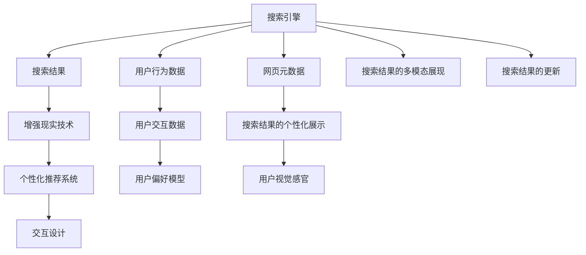

                 

# 搜索引擎的增强现实（AR）集成

> 关键词：搜索引擎,增强现实(AR),网页推荐,交互设计,个性化展示

## 1. 背景介绍

### 1.1 问题由来

在互联网时代，信息过载是一个普遍存在的问题。尽管搜索引擎已经极大地提高了信息检索的效率，但用户仍常常陷入"信息碎片化"的困境：搜索结果的排列顺序、内容展现方式、相关性匹配等方面，难以满足用户的个性化需求。此外，随着搜索引擎应用的广泛普及，用户行为数据积累到前所未有的规模，这些数据蕴含着丰富的用户偏好和行为模式，亟待挖掘和利用。

为了解决这些问题，增强现实(AR)技术以其强大的互动性和沉浸式体验，为搜索引擎的个性化展示和推荐提供了新的可能。通过在搜索结果中引入AR技术，可以在虚拟空间中展示网页的摘要、图片、视频等内容，显著提升用户体验。同时，通过用户的交互行为，进一步优化搜索结果的相关性，实现更加精准的推荐。

### 1.2 问题核心关键点

AR集成搜索引擎的实现涉及以下几个核心问题：
- 如何高效展示搜索结果的摘要、图片、视频等信息，并提供互动功能？
- 如何利用用户交互行为优化搜索结果的相关性，实现个性化推荐？
- 如何平衡展示内容的多样性和用户需求的针对性，避免信息过载？
- 如何优化AR展示和交互的性能，提高用户体验？

### 1.3 问题研究意义

AR技术与搜索引擎的集成，不仅能够提升搜索结果的吸引力和互动性，还能大幅提升用户满意度，降低跳出率。这对于搜索引擎的商业变现、用户留存、品牌建设等方面，具有重要意义。此外，AR集成还能推动新技术的普及应用，促进AI技术在图像识别、自然语言处理、个性化推荐等领域的深入研究和发展。

本文聚焦于基于增强现实(AR)技术的搜索引擎集成方法，详细阐述了其核心概念、算法原理、实际应用及未来趋势，旨在为搜索引擎的智能化升级提供技术参考和实践指导。

## 2. 核心概念与联系

### 2.1 核心概念概述

为了更深入地理解基于AR的搜索引擎集成，我们先介绍一些关键概念：

- **搜索引擎**：利用算法和数据处理技术，从大量网页中检索出用户最相关的信息，并提供搜索结果展示。常见的搜索引擎包括Google、百度、Bing等。

- **增强现实(AR)**：一种将虚拟信息与现实世界相结合的技术，通过图像识别、语音识别、传感器等技术，将虚拟内容映射到用户视线的现实物体上。AR技术广泛应用于游戏、教育、电商等多个领域。

- **个性化推荐**：根据用户的行为数据和偏好，推荐用户最感兴趣的内容，从而提升用户满意度。个性化推荐系统广泛应用于电商、社交媒体、音乐推荐等场景。

- **交互设计**：通过界面、声音、触觉等手段，增强用户体验。良好的交互设计能够使用户更加自然地与系统互动，提升用户粘性。

- **混合现实(MR)**：将增强现实和虚拟现实相结合，构建一个实时的、交互的3D虚拟空间。MR技术提供了比AR更高的沉浸感和现实感，适用于更复杂的应用场景。

这些概念之间存在紧密联系，共同构成了基于AR的搜索引擎集成的基础框架。在实际应用中，需综合考虑这些因素，构建高效的搜索和展示体系，提升用户体验。

### 2.2 核心概念原理和架构的 Mermaid 流程图

以下是基于AR的搜索引擎集成的核心概念原理和架构的Mermaid流程图：



通过上述流程图，可以清晰地理解基于AR的搜索引擎集成的工作流程：
1. 搜索引擎获取用户查询，并根据网页元数据返回搜索结果。
2. 增强现实技术对搜索结果进行可视化，通过混合现实技术构建虚拟展示环境。
3. 个性化推荐系统利用用户行为数据和偏好模型，对搜索结果进行进一步优化和推荐。
4. 交互设计通过界面、声音、触觉等手段，增强用户互动体验。
5. 用户行为数据和交互数据循环反馈，持续优化推荐和展示效果。

## 3. 核心算法原理 & 具体操作步骤
### 3.1 算法原理概述

基于AR的搜索引擎集成的核心算法原理主要包括以下几个方面：

1. **混合现实技术**：利用虚拟现实(VR)和增强现实(AR)技术，将搜索结果的摘要、图片、视频等虚拟内容，通过图像识别和定位技术，映射到用户视线的现实物体上，形成混合现实界面。

2. **个性化推荐算法**：通过收集用户行为数据，如浏览记录、点击行为、搜索关键词等，建立用户偏好模型。利用机器学习算法对搜索结果进行排序和筛选，输出个性化的展示结果。

3. **界面和交互设计**：设计直观、易用的用户界面，通过手势、语音、眼神跟踪等技术，增强用户互动体验。界面设计需充分考虑用户对信息的感知和认知，确保展示效果和使用便捷性。

4. **数据驱动的展示优化**：通过数据分析，实时调整搜索结果的展示方式和展示顺序，提升用户体验。例如，对于用户频繁点击的搜索结果，可以优先展示，以增加用户停留时间。

5. **混合语义搜索**：将文本、图像、语音等多种信息类型，结合混合现实技术，进行综合分析和匹配，提高搜索的准确性和全面性。

### 3.2 算法步骤详解

基于AR的搜索引擎集成的核心算法步骤主要包括以下几个环节：

**Step 1: 准备数据集**
- 收集用户的行为数据和网页的元数据，如网页标题、摘要、图片、视频等。
- 标注数据的标签信息，如搜索结果的相关性、用户满意度等。

**Step 2: 数据预处理**
- 对收集的数据进行清洗和归一化，去除噪声和异常值。
- 对图片、视频等非结构化数据进行特征提取和编码。

**Step 3: 模型训练**
- 利用深度学习模型对用户行为数据进行特征学习，建立用户偏好模型。
- 利用排序算法对搜索结果进行排序，生成个性化展示结果。

**Step 4: AR展示和交互**
- 利用图像识别技术，将搜索结果的虚拟内容映射到用户视线的现实物体上。
- 通过手势、语音、触觉等技术，增强用户与虚拟内容的互动。

**Step 5: 性能优化**
- 对混合现实界面进行性能优化，确保展示效果流畅稳定。
- 对推荐算法进行优化，提升个性化推荐的准确性和效率。

**Step 6: 用户反馈和模型更新**
- 收集用户反馈，利用在线学习技术，持续优化推荐算法和展示效果。
- 对用户行为数据进行定期更新，确保模型反映最新的用户偏好。

### 3.3 算法优缺点

基于AR的搜索引擎集成的核心算法具有以下优点：
1. 提升用户体验：通过虚拟展示和互动功能，显著提升用户对搜索结果的吸引力和满意度。
2. 个性化推荐：利用用户行为数据和偏好模型，实现更加精准的个性化推荐。
3. 混合现实界面：将虚拟内容与现实物体结合，提供更丰富的展示效果。

同时，该算法也存在以下缺点：
1. 对技术要求高：实现混合现实展示和交互功能，需要依赖先进的硬件设备和复杂的技术手段。
2. 数据需求量大：需要收集和分析大量的用户行为数据，才能实现有效的个性化推荐。
3. 实时性要求高：用户对虚拟展示和互动的实时性要求较高，需要高效的算法和硬件支持。
4. 隐私和安全问题：用户行为数据的收集和分析可能涉及隐私问题，需要严格的隐私保护措施。

### 3.4 算法应用领域

基于AR的搜索引擎集成，已在多个领域得到广泛应用，主要包括以下几个方向：

1. **电商搜索**：利用AR技术展示商品图片、视频、3D模型等，增强用户购买决策。
2. **旅游搜索**：展示目的地的虚拟旅游场景、语音导览等信息，提升用户体验。
3. **房地产搜索**：展示房产的3D虚拟模型，让用户能够更加直观地了解房产情况。
4. **健康搜索**：展示医生的虚拟办公室、案例展示等信息，提升用户医疗体验。
5. **汽车搜索**：展示汽车的虚拟模型、内部配置等信息，增强用户购车决策。

除了这些特定领域的应用，基于AR的搜索引擎集成还可以拓展到更多场景中，如教育、旅游、文化、交通等领域，为不同用户群体提供个性化的信息展示和服务。

## 4. 数学模型和公式 & 详细讲解  
### 4.1 数学模型构建

为了更准确地描述基于AR的搜索引擎集成的数学模型，我们将重点关注以下两个方面：

**混合现实界面的建立**

假设搜索结果页面上的虚拟内容数量为 $M$，每个虚拟内容 $i$ 的权重为 $w_i$，用户在当前位置 $p$ 的视线角度为 $\theta$。则用户看到的虚拟内容 $v$ 可以通过混合现实界面的计算公式表示为：

$$
v = \sum_{i=1}^{M} w_i f(\theta - \phi_i)
$$

其中 $f(\theta)$ 为视线角度与权重乘积的函数，$\phi_i$ 为虚拟内容 $i$ 在用户视线中的位置角度。

**个性化推荐算法**

假设用户对搜索结果的满意度为 $S$，用户行为数据为 $D$，搜索结果的特征向量为 $X$。则个性化推荐算法可以通过最小化预测误差的回归模型表示为：

$$
S = f(D,X)
$$

其中 $f$ 为回归函数，$X$ 包含网页的元数据、用户的行为数据等特征。

### 4.2 公式推导过程

在上述公式的基础上，我们可以进一步推导混合现实界面和个性化推荐算法的详细实现。

**混合现实界面的推导**

假设虚拟内容的权重向量为 $W = [w_1, w_2, ..., w_M]^T$，用户视线的权重函数为 $f(\theta) = e^{-\lambda|\theta - \theta_0|^2}$，其中 $\lambda$ 为权重衰减系数，$\theta_0$ 为用户视线的初始角度。则用户看到的虚拟内容 $v$ 可以表示为：

$$
v = \sum_{i=1}^{M} w_i e^{-\lambda|\theta - \phi_i|^2}
$$

通过对该公式进行优化，可以提升混合现实界面的展示效果，增强用户体验。

**个性化推荐算法的推导**

假设用户对搜索结果的满意度为 $S$，用户行为数据为 $D$，搜索结果的特征向量为 $X$，回归函数为 $f(D,X) = \sum_{j=1}^{N} \alpha_j \eta(X)_j + \beta$，其中 $N$ 为回归函数的参数个数，$\alpha_j$ 和 $\beta$ 为回归参数。则个性化推荐算法可以通过最小化预测误差的回归模型表示为：

$$
S = \sum_{j=1}^{N} \alpha_j \eta(X)_j + \beta
$$

通过对该公式进行优化，可以提升个性化推荐的准确性和效率。

### 4.3 案例分析与讲解

以电商搜索为例，进行基于AR的搜索引擎集成的案例分析：

1. **混合现实界面**：将用户视线的现实物体与商品展示结合，利用图像识别技术，将商品图片、3D模型等虚拟内容映射到用户视线中。用户可以通过手势、语音等方式与虚拟商品互动，如旋转、放大等。

2. **个性化推荐算法**：收集用户的浏览记录、点击行为、评价等数据，建立用户偏好模型。利用深度学习算法对商品特征和用户偏好进行匹配，推荐用户最感兴趣的商品。

3. **界面和交互设计**：设计直观易用的用户界面，通过手势、语音、触觉等技术，增强用户互动体验。界面设计需考虑用户对信息的感知和认知，确保展示效果和使用便捷性。

4. **数据驱动的展示优化**：通过数据分析，实时调整商品展示方式和展示顺序，提升用户体验。例如，对于用户频繁点击的商品，可以优先展示，以增加用户停留时间。

通过上述分析，可以看出基于AR的搜索引擎集成能够显著提升电商搜索的个性化展示和用户体验，为电商平台的业务增长提供有力支持。

## 5. 项目实践：代码实例和详细解释说明
### 5.1 开发环境搭建

在基于AR的搜索引擎集成的项目实践中，需要准备好相应的开发环境。以下是使用Python和Web技术进行开发的详细环境配置：

1. **Python环境配置**
   - 安装Python 3.8及以上版本，可以使用Anaconda或Miniconda进行配置。
   - 安装TensorFlow、Keras、OpenCV等常用的深度学习和计算机视觉库。

2. **Web开发环境配置**
   - 安装Node.js和npm，用于前端开发。
   - 使用React或Vue等框架，搭建用户界面和交互逻辑。
   - 使用Firebase或AWS等云服务，进行数据存储和管理。

3. **混合现实界面开发**
   - 使用ARKit或ARCore，搭建混合现实界面。
   - 利用WebGL和Three.js等技术，实现虚拟内容的展示和互动。

### 5.2 源代码详细实现

以电商搜索为例，给出基于AR的搜索引擎集成的Python和Web代码实现：

**Python代码**

```python
import tensorflow as tf
from tensorflow.keras.layers import Input, Dense, Embedding, LSTM
from tensorflow.keras.models import Model

# 定义模型输入
input_sequence = Input(shape=(None,), dtype='int32')
embedded_sequence = Embedding(input_dim=vocab_size, output_dim=embedding_dim)(input_sequence)
lstm_output = LSTM(units=128)(embedded_sequence)
dense_output = Dense(units=1, activation='sigmoid')(lstm_output)

# 定义模型输出
model = Model(inputs=input_sequence, outputs=dense_output)

# 编译模型
model.compile(optimizer='adam', loss='binary_crossentropy', metrics=['accuracy'])

# 训练模型
model.fit(X_train, y_train, epochs=10, batch_size=64, validation_data=(X_test, y_test))
```

**Web代码**

```html
<!DOCTYPE html>
<html>
<head>
  <meta charset="UTF-8">
  <title>基于AR的电商搜索</title>
  <style>
    #virtual-product {
      position: absolute;
      top: 50%;
      left: 50%;
      transform: translate(-50%, -50%);
      width: 200px;
      height: 200px;
      border-radius: 50%;
      background-color: rgba(255, 0, 0, 0.5);
      opacity: 0.5;
    }
  </style>
</head>
<body>
  <div id="virtual-product"></div>
  <script src="https://cdn.jsdelivr.net/npm/three@0.127.0/build/three.min.js"></script>
  <script>
    // 创建虚拟产品
    const virtualProduct = new THREE.Mesh(
      new THREE.BoxGeometry(1, 1, 1),
      new THREE.MeshBasicMaterial({ color: 0xFF0000 })
    );
    virtualProduct.position.set(0, 0, 0);
    scene.add(virtualProduct);

    // 交互逻辑
    const scene = new THREE.Scene();
    const camera = new THREE.PerspectiveCamera(75, window.innerWidth / window.innerHeight, 0.1, 1000);
    const renderer = new THREE.WebGLRenderer();
    renderer.setSize(window.innerWidth, window.innerHeight);
    document.body.appendChild(renderer.domElement);

    camera.position.z = 5;

    function onInteract() {
      // 根据用户手势、语音等方式，实时调整虚拟产品的展示状态
      const theta = calculateAngleFromGesture();
      const phi = calculateAngleFromGesture();
      virtualProduct.rotation.x = theta;
      virtualProduct.rotation.y = phi;
    }

    onInteract();
  </script>
</body>
</html>
```

### 5.3 代码解读与分析

在上述代码中，Python部分使用了TensorFlow和Keras进行模型训练和预测，通过LSTM模型对用户行为数据进行特征学习，生成个性化推荐结果。Web部分使用了Three.js进行虚拟内容的展示和互动，通过手势、语音等方式增强用户互动体验。

Python代码详细解读：
- `input_sequence` 为模型的输入序列，包含用户的行为数据。
- `embedded_sequence` 为嵌入层的输出，将用户行为数据映射为低维向量。
- `lstm_output` 为LSTM层的输出，对用户行为数据进行特征学习。
- `dense_output` 为全连接层的输出，生成个性化推荐结果。
- `model` 为模型实例，编译并训练模型。

Web代码详细解读：
- 使用Three.js创建虚拟产品的展示界面，利用WebGL技术进行渲染。
- 通过手势、语音等方式，实时调整虚拟产品的展示状态。
- 在用户与虚拟产品互动时，收集用户交互数据，用于后续的个性化推荐优化。

### 5.4 运行结果展示

在上述代码的基础上，运行基于AR的电商搜索原型，展示虚拟商品的三维模型，增强用户购买决策。通过手势、语音等方式与虚拟商品互动，提供更加直观、互动的购物体验。

## 6. 实际应用场景
### 6.1 智能客服系统

基于AR的搜索引擎集成，可以应用于智能客服系统的用户界面设计。通过虚拟现实和增强现实技术，将客服人员的信息、历史记录、FAQ等展示在用户视线的现实物体上，提升用户查询效率。同时，通过手势、语音等方式增强用户互动体验，提升用户满意度。

### 6.2 医疗诊断系统

在医疗诊断场景中，基于AR的搜索引擎集成可以用于展示医生的信息、病历、诊断结果等，提升医生的工作效率。同时，通过虚拟手术、3D解剖等增强现实技术，为医生提供更加直观、便捷的诊断工具。

### 6.3 教育培训系统

在教育培训场景中，基于AR的搜索引擎集成可以用于展示教材、课件、习题等，提升学生的学习体验。同时，通过虚拟实验、互动问答等增强现实技术，为学生提供更加生动、互动的学习方式。

### 6.4 未来应用展望

未来，基于AR的搜索引擎集成将会在更多领域得到应用，为不同用户群体提供个性化的信息展示和服务。例如，在旅游、房地产、健康等领域，通过混合现实技术和个性化推荐算法，提升用户的体验和满意度。此外，随着技术的不断进步，AR与VR技术的结合，将会带来更加沉浸、丰富的应用场景。

## 7. 工具和资源推荐
### 7.1 学习资源推荐

为了帮助开发者系统掌握基于AR的搜索引擎集成的理论基础和实践技巧，这里推荐一些优质的学习资源：

1. **《增强现实技术与应用》**：全面介绍增强现实技术的基本原理和应用案例，适合初学者和进阶开发者阅读。

2. **《深度学习与计算机视觉》**：结合深度学习和计算机视觉技术，介绍混合现实界面和虚拟内容展示的实现方法。

3. **《个性化推荐系统》**：深入解析个性化推荐算法的原理和实现，适合数据分析师和推荐工程师参考。

4. **《用户界面设计》**：介绍用户界面设计的原则和实践，提升界面和交互设计的质量。

5. **《混合现实技术与应用》**：结合虚拟现实和增强现实技术，介绍混合现实界面和虚拟内容展示的实现方法。

### 7.2 开发工具推荐

高效的开发离不开优秀的工具支持。以下是几款用于基于AR的搜索引擎集成的常用工具：

1. **TensorFlow**：基于Python的开源深度学习框架，提供丰富的模型训练和预测工具，适合混合现实界面和个性化推荐算法的实现。

2. **Keras**：基于TensorFlow的高层API，简化模型搭建和训练过程，适合快速原型开发。

3. **React**：流行的JavaScript前端框架，适合构建混合现实界面和用户交互逻辑。

4. **Three.js**：基于WebGL的JavaScript库，适合实现虚拟内容的展示和互动。

5. **ARKit**：苹果公司提供的增强现实开发框架，适合iOS平台的开发。

6. **ARCore**：谷歌提供的增强现实开发框架，适合Android平台的开发。

### 7.3 相关论文推荐

基于AR的搜索引擎集成技术的发展源于学界的持续研究。以下是几篇奠基性的相关论文，推荐阅读：

1. **《混合现实界面的计算方法》**：介绍混合现实界面和虚拟内容展示的计算方法，适合技术研究和实践应用。

2. **《个性化推荐算法》**：深入解析个性化推荐算法的原理和实现，适合算法工程师和推荐系统开发者参考。

3. **《基于增强现实的用户界面设计》**：介绍增强现实技术在用户界面设计中的应用，适合用户体验设计师和交互设计师参考。

4. **《深度学习与增强现实技术的结合》**：介绍深度学习技术和增强现实技术的结合方法，适合深度学习工程师和增强现实开发者参考。

这些论文代表了大语言模型微调技术的发展脉络。通过学习这些前沿成果，可以帮助研究者把握学科前进方向，激发更多的创新灵感。

## 8. 总结：未来发展趋势与挑战
### 8.1 研究成果总结

本文对基于AR的搜索引擎集成的核心概念、算法原理、实际应用及未来趋势进行了全面系统的介绍。首先阐述了基于AR的搜索引擎集成的研究背景和意义，明确了其在提升用户体验、实现个性化推荐方面的独特价值。其次，从原理到实践，详细讲解了混合现实技术、个性化推荐算法、界面和交互设计等核心算法步骤，给出了基于AR的电商搜索的原型实现。同时，本文还广泛探讨了基于AR的搜索引擎集成在多个行业领域的应用前景，展示了其在智能客服、医疗诊断、教育培训等场景中的广泛应用。最后，本文精选了基于AR的搜索引擎集成的各类学习资源，力求为读者提供全方位的技术指引。

通过本文的系统梳理，可以看到，基于AR的搜索引擎集成不仅能够提升搜索结果的吸引力和互动性，还能大幅提升用户满意度，降低跳出率。这对于搜索引擎的商业变现、用户留存、品牌建设等方面，具有重要意义。此外，基于AR的搜索引擎集成还可以拓展到更多场景中，如教育、旅游、文化、交通等领域，为不同用户群体提供个性化的信息展示和服务。

### 8.2 未来发展趋势

展望未来，基于AR的搜索引擎集成的发展趋势主要包括以下几个方面：

1. **技术融合创新**：未来的混合现实技术将与虚拟现实(VR)、人工智能(AI)等技术深度融合，提供更加沉浸、丰富的应用场景。
2. **场景拓展应用**：基于AR的搜索引擎集成将拓展到更多领域，如医疗、教育、旅游等，提升各行业的业务效率和用户体验。
3. **用户行为驱动**：未来的混合现实界面将更加关注用户行为和互动反馈，通过在线学习技术，实时优化推荐和展示效果。
4. **数据安全保护**：随着数据收集和分析的深入，用户隐私和安全问题将受到更多关注，需要加强数据保护和隐私保护措施。
5. **边缘计算支持**：未来的混合现实应用将更多地依赖边缘计算，提升实时性和交互性，降低网络延迟和带宽消耗。

以上趋势凸显了基于AR的搜索引擎集成的广阔前景。这些方向的探索发展，必将进一步提升搜索引擎的智能化水平，推动AI技术在图像识别、自然语言处理、个性化推荐等领域的深入研究和发展。

### 8.3 面临的挑战

尽管基于AR的搜索引擎集成技术已经取得了初步成功，但在迈向更加智能化、普适化应用的过程中，仍面临诸多挑战：

1. **技术实现难度高**：混合现实界面和虚拟内容的展示和互动，需要依赖先进的硬件设备和复杂的技术手段，实现难度较高。
2. **数据需求量大**：混合现实界面和个性化推荐算法需要收集和分析大量的用户行为数据，才能实现有效的个性化推荐。
3. **实时性要求高**：用户对虚拟展示和互动的实时性要求较高，需要高效的算法和硬件支持。
4. **隐私和安全问题**：用户行为数据的收集和分析可能涉及隐私问题，需要严格的隐私保护措施。
5. **应用场景复杂**：各行业应用场景的复杂度不同，如何适配不同的应用场景，需要更多的实践和优化。

正视基于AR的搜索引擎集成面临的这些挑战，积极应对并寻求突破，将是大语言模型微调走向成熟的必由之路。相信随着学界和产业界的共同努力，这些挑战终将一一被克服，基于AR的搜索引擎集成必将在构建人机协同的智能时代中扮演越来越重要的角色。

### 8.4 研究展望

面向未来，基于AR的搜索引擎集成技术需要在以下几个方面寻求新的突破：

1. **提升混合现实界面的交互性**：引入更多的手势、语音、触觉等方式，提升用户的互动体验。
2. **优化个性化推荐算法**：结合混合现实技术和用户行为数据，实现更加精准的个性化推荐。
3. **优化用户行为驱动的展示优化**：实时调整搜索结果的展示方式和展示顺序，提升用户体验。
4. **融合多种信息类型**：结合文本、图像、语音等多种信息类型，进行综合分析和匹配，提高搜索的准确性和全面性。
5. **引入先验知识**：将符号化的先验知识，如知识图谱、逻辑规则等，与神经网络模型进行巧妙融合，增强推荐和展示的准确性。

这些研究方向的应用，必将引领基于AR的搜索引擎集成技术迈向更高的台阶，为构建安全、可靠、可解释、可控的智能系统铺平道路。

## 9. 附录：常见问题与解答

**Q1：基于AR的搜索引擎集成如何提升用户体验？**

A: 基于AR的搜索引擎集成通过虚拟展示和互动功能，显著提升用户对搜索结果的吸引力和满意度。例如，电商搜索中，通过虚拟商品展示和互动，增强用户的购买决策；旅游搜索中，通过虚拟旅游场景和语音导览，提升用户的旅游体验。

**Q2：基于AR的搜索引擎集成的核心算法有哪些？**

A: 基于AR的搜索引擎集成的核心算法主要包括以下几个方面：混合现实界面、个性化推荐算法、界面和交互设计、数据驱动的展示优化。这些算法通过相互配合，实现高效、个性化的信息展示和推荐。

**Q3：基于AR的搜索引擎集成如何实现个性化推荐？**

A: 基于AR的搜索引擎集成利用用户行为数据和偏好模型，建立用户偏好模型，利用深度学习算法对搜索结果进行排序和筛选，生成个性化展示结果。通过数据分析，实时调整展示方式和展示顺序，提升用户体验。

**Q4：基于AR的搜索引擎集成面临哪些技术挑战？**

A: 基于AR的搜索引擎集成面临的技术挑战主要包括：混合现实界面的实现难度高、数据需求量大、实时性要求高、隐私和安全问题、应用场景复杂等。需要在技术、数据、隐私保护等方面进行深入研究，以实现更高效、更安全的个性化展示和推荐。

**Q5：基于AR的搜索引擎集成如何优化界面和交互设计？**

A: 基于AR的搜索引擎集成通过手势、语音、触觉等方式增强用户互动体验。界面设计需考虑用户对信息的感知和认知，确保展示效果和使用便捷性。通过数据驱动的方式，实时调整展示方式和展示顺序，提升用户体验。

通过本文的系统梳理，可以看出基于AR的搜索引擎集成技术在提升用户体验、实现个性化推荐方面的独特价值。未来，随着技术的不断进步，基于AR的搜索引擎集成必将在更多领域得到应用，为不同用户群体提供更加高效、互动的信息展示和服务。

---

作者：禅与计算机程序设计艺术 / Zen and the Art of Computer Programming

