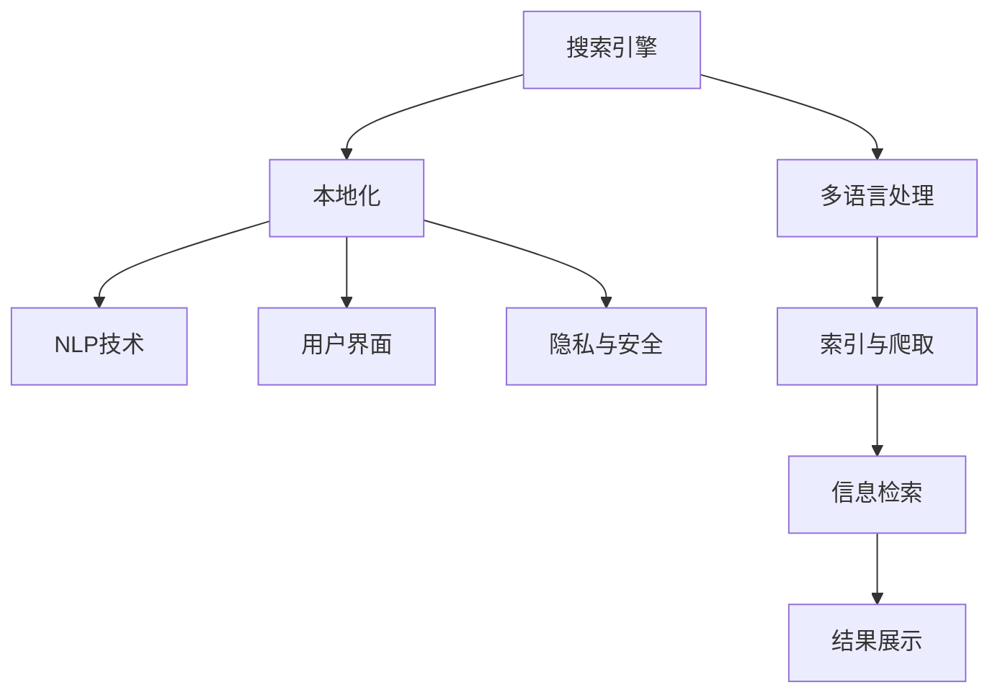

                 

# 搜索引擎的本地化：适应不同文化和语言

> 关键词：搜索引擎,本地化,多语言,文化适应,信息检索,自然语言处理(NLP)

## 1. 背景介绍

### 1.1 问题由来

随着互联网全球化进程的加速，搜索引擎已经成为全球用户获取信息的重要工具。然而，不同地区和文化背景的用户对信息的获取方式和偏好差异较大，这给搜索引擎的全球化带来了挑战。尤其是对于非英语国家，搜索引擎的本地化显得尤为重要。

搜索引擎本地化的核心在于：1) 理解和适应不同文化和语言的搜索习惯；2) 准确理解和检索目标用户对查询的理解；3) 能够根据目标语言和文化的特定需求，提供最相关的搜索结果。

### 1.2 问题核心关键点

搜索引擎本地化的核心在于以下几个关键点：

1. **语言适应**：搜索引擎需要理解并适应不同语言，包括语法、词汇、语义等方面的差异。
2. **文化适应**：不同文化对信息检索的需求和期望不同，搜索引擎需要了解并适应这些差异。
3. **信息检索**：搜索引擎必须能够理解和检索不同语言和文化的查询，并提供最相关的结果。
4. **用户界面**：搜索结果展示和交互界面需要适应目标用户的操作习惯和语言环境。
5. **隐私和安全**：搜索引擎需要确保在全球化过程中保护用户隐私，并在不同文化环境中遵守相关法律法规。

## 2. 核心概念与联系

### 2.1 核心概念概述

为了更好地理解搜索引擎本地化的概念，本节将介绍几个核心概念：

1. **搜索引擎(Search Engine)**：一种信息检索系统，通过爬取和索引互联网上的内容，使用户能够通过输入关键词获取相关信息。

2. **本地化(Localization, L10n)**：将产品或服务的内容和功能本地化到特定语言和文化环境的过程。

3. **多语言(Multilingual)**：指能够支持多种语言的搜索引擎或搜索功能。

4. **自然语言处理(NLP, Natural Language Processing)**：使计算机能够理解、处理和生成人类语言的技术，是搜索引擎本地化的关键技术之一。

5. **信息检索**：从大量信息中快速、准确地检索出用户所需信息的过程。

6. **用户界面(UI)**：搜索结果展示和交互的界面设计，需要考虑目标用户的需求和习惯。

7. **隐私和安全**：在全球化过程中，如何保护用户隐私，并确保搜索内容符合不同文化环境的法律法规。

这些核心概念之间具有紧密联系，共同构成了搜索引擎本地化的基础框架。通过理解这些概念，我们可以更好地把握搜索引擎本地化的工作原理和优化方向。

### 2.2 核心概念原理和架构的 Mermaid 流程图



这个流程图展示了搜索引擎本地化过程中涉及的关键概念及其相互关系：

1. **搜索引擎**：通过索引与爬取，从互联网抓取信息，并进行信息检索。
2. **多语言处理**：涉及索引和查询的多语言化处理，确保搜索功能在不同语言环境下都能正常工作。
3. **本地化**：根据目标语言和文化环境对搜索结果和用户界面进行调整。
4. **NLP技术**：使搜索引擎能够理解和生成人类语言，并处理查询和搜索结果。
5. **用户界面(UI)**：展示搜索结果并提供交互功能，适应目标用户的操作习惯。
6. **隐私与安全**：在本地化过程中保护用户隐私，并确保合规。

这些概念相互交织，构成了搜索引擎本地化的复杂体系。

## 3. 核心算法原理 & 具体操作步骤

### 3.1 算法原理概述

搜索引擎本地化的算法原理基于以下几个步骤：

1. **多语言处理**：对索引和查询进行多语言化处理，确保搜索功能在不同语言环境下正常工作。
2. **本地化**：根据目标语言和文化环境，对搜索结果和用户界面进行调整。
3. **信息检索**：使用NLP技术理解和检索不同语言和文化的查询，并提供最相关的结果。
4. **隐私与安全**：在本地化过程中，确保用户隐私和合规。

### 3.2 算法步骤详解

#### 3.2.1 多语言处理

多语言处理包括索引和查询的多语言化处理，确保搜索引擎能够理解不同语言的查询。

**Step 1: 索引多语言化处理**
- 对网页进行多语言标注，包括原始语言和翻译版本。
- 对查询进行多语言标注，确保搜索引擎能够理解不同语言查询的意图。

**Step 2: 查询多语言化处理**
- 使用多语言分词器对查询进行分词，识别出不同语言中的关键词和短语。
- 通过机器翻译技术将查询转换为目标语言，确保查询能够被正确理解和处理。

#### 3.2.2 本地化

本地化包括根据目标语言和文化环境对搜索结果和用户界面进行调整。

**Step 1: 搜索结果本地化**
- 使用目标语言进行文本排序，确保搜索结果按目标语言的习惯顺序展示。
- 调整搜索结果展示的语料，使其符合目标语言和文化的习惯。

**Step 2: 用户界面本地化**
- 使用目标语言对搜索结果展示和交互界面进行翻译。
- 调整界面元素和布局，符合目标用户的视觉习惯和操作习惯。

#### 3.2.3 信息检索

信息检索的核心在于使用NLP技术理解和检索不同语言和文化的查询，并提供最相关的结果。

**Step 1: 查询理解**
- 使用NLP技术解析查询，识别出关键词和短语。
- 通过词向量模型或语言模型，理解查询的语义和意图。

**Step 2: 结果生成**
- 使用NLP技术生成文本摘要，将搜索结果转换为易于理解的形式。
- 调整搜索结果的排序算法，确保最相关的结果排在前面。

#### 3.2.4 隐私与安全

隐私与安全是本地化过程中不可忽视的部分，尤其是在处理敏感数据时。

**Step 1: 用户隐私保护**
- 对用户查询和行为进行加密，防止数据泄露。
- 对用户隐私进行隐私保护设置，如匿名化处理等。

**Step 2: 合规处理**
- 确保搜索结果展示和界面设计符合目标文化环境的法律法规。
- 对用户数据进行合规处理，防止数据滥用和不当使用。

### 3.3 算法优缺点

#### 3.3.1 优点

1. **全局化应用**：搜索引擎本地化可以提供更广泛的服务，满足全球用户的需求。
2. **提升用户体验**：通过本地化调整，用户可以更方便地使用搜索引擎，提高满意度和忠诚度。
3. **提升搜索结果相关性**：本地化处理可以确保搜索结果更符合用户需求，提升信息检索效果。
4. **增强数据安全**：通过本地化处理，可以更好地保护用户隐私和数据安全。

#### 3.3.2 缺点

1. **复杂度高**：本地化处理涉及多种语言和文化环境，复杂度较高。
2. **资源消耗大**：本地化处理需要大量的计算资源和时间，特别是在大规模数据集上。
3. **文化差异处理困难**：不同文化对信息的理解和需求存在差异，本地化处理可能难以完全适应。
4. **数据质量影响**：本地化处理依赖于高质量的多语言数据，数据质量差会影响处理效果。

## 4. 数学模型和公式 & 详细讲解

### 4.1 数学模型构建

搜索引擎本地化的数学模型主要包括以下几个部分：

1. **查询理解模型**：使用NLP技术解析查询，识别关键词和短语，理解查询意图。
2. **信息检索模型**：使用向量空间模型或神经网络模型，检索最相关的结果。
3. **用户界面设计模型**：使用UI设计原则，调整界面元素和布局，符合用户习惯。

### 4.2 公式推导过程

#### 4.2.1 查询理解模型

查询理解模型使用自然语言处理技术，解析查询并理解其语义和意图。以下是一个基本的查询理解模型公式：

$$
Q = T_w * Q_{w} + T_c * Q_{c} + T_o * Q_{o}
$$

其中：
- $Q$：查询向量，表示查询的语义和意图。
- $T_w$：词向量的权重系数，表示词向量对查询向量的影响。
- $Q_{w}$：词向量矩阵，表示查询中每个词的向量表示。
- $T_c$：短语向量的权重系数，表示短语向量对查询向量的影响。
- $Q_{c}$：短语向量矩阵，表示查询中的短语向量。
- $T_o$：操作符向量的权重系数，表示操作符向量对查询向量的影响。
- $Q_{o}$：操作符向量矩阵，表示查询中的操作符向量。

通过上述公式，搜索引擎可以理解不同语言和文化的查询，并识别出关键词和短语。

#### 4.2.2 信息检索模型

信息检索模型使用向量空间模型或神经网络模型，检索最相关的结果。以下是一个基本的向量空间模型公式：

$$
R_i = \frac{(Q - T * X_i)}{||Q - T * X_i||}
$$

其中：
- $R_i$：第$i$个结果的得分，表示结果的相关性。
- $Q$：查询向量，表示查询的语义和意图。
- $T$：相似度矩阵，表示查询与每个结果的相似度。
- $X_i$：第$i$个结果的向量表示。

通过上述公式，搜索引擎可以检索出最相关的结果，并按相关性排序展示。

### 4.3 案例分析与讲解

#### 4.3.1 案例一：Google翻译

Google翻译是多语言处理的重要案例，使用机器翻译技术实现多语言查询的处理。以下是一个简单的Google翻译模型示例：

**Step 1: 分词和编码**
- 对查询进行分词，识别出关键词和短语。
- 对查询进行编码，转换为计算机可处理的形式。

**Step 2: 机器翻译**
- 使用机器翻译模型，将查询转换为目标语言。
- 对翻译结果进行解码，转换为目标语言的形式。

#### 4.3.2 案例二：百度翻译

百度翻译使用了深度学习技术，提升了机器翻译的质量和速度。以下是一个百度翻译模型示例：

**Step 1: 分词和编码**
- 对查询进行分词，识别出关键词和短语。
- 对查询进行编码，转换为计算机可处理的形式。

**Step 2: 深度学习模型**
- 使用深度学习模型，对查询进行翻译。
- 对翻译结果进行解码，转换为目标语言的形式。

## 5. 项目实践：代码实例和详细解释说明

### 5.1 开发环境搭建

在进行搜索引擎本地化实践前，我们需要准备好开发环境。以下是使用Python进行自然语言处理开发的环境配置流程：

1. 安装Anaconda：从官网下载并安装Anaconda，用于创建独立的Python环境。

2. 创建并激活虚拟环境：
```bash
conda create -n nlp-env python=3.8 
conda activate nlp-env
```

3. 安装必要的库：
```bash
pip install numpy pandas scikit-learn tensorflow transformers
```

4. 安装Google Cloud SDK：用于访问Google Cloud Services，如Google Translate API。
```bash
pip install google-cloud-translate
```

5. 安装BertModel库：用于实现基于BERT的查询理解模型。
```bash
pip install bert-serving-server bert-serving-client
```

完成上述步骤后，即可在`nlp-env`环境中开始搜索引擎本地化的项目开发。

### 5.2 源代码详细实现

下面是使用Python和BERT模型进行搜索引擎本地化的示例代码：

```python
from transformers import BertTokenizer, BertForSequenceClassification
from google.cloud import translate_v2
import numpy as np
import pandas as pd
from sklearn.feature_extraction.text import TfidfVectorizer
from sklearn.metrics.pairwise import cosine_similarity

# 加载BERT模型和分词器
tokenizer = BertTokenizer.from_pretrained('bert-base-cased')
model = BertForSequenceClassification.from_pretrained('bert-base-cased', num_labels=2)

# 初始化Google Translate API客户端
translate_client = translate_v2.Client()

# 构建查询理解模型
def query_understanding(query, language='en'):
    # 对查询进行分词和编码
    input_ids = tokenizer.encode(query, add_special_tokens=True, return_tensors='pt')
    # 使用BERT模型预测查询向量
    with torch.no_grad():
        outputs = model(input_ids)
        query_vector = outputs.last_hidden_state[:, 0, :].numpy()
    # 将查询向量转换为目标语言
    translated_vector = translate_client.translate(query, target_language=language)
    # 对翻译后的向量进行处理
    translated_vector = tokenizer.encode(translated_vector['translatedText'], add_special_tokens=True, return_tensors='pt')
    translated_vector = outputs.last_hidden_state[:, 0, :].numpy()
    return query_vector, translated_vector

# 构建信息检索模型
def information_retrieval(query_vector, doc_vectors):
    # 计算查询向量与文档向量的余弦相似度
    similarity_matrix = cosine_similarity(query_vector, doc_vectors)
    # 对相似度矩阵进行排序
    sorted_indices = np.argsort(-similarity_matrix)[1:10]
    # 获取最相关的文档向量
    relevant_vectors = doc_vectors[sorted_indices]
    return relevant_vectors

# 加载查询和文档数据
query_data = pd.read_csv('queries.csv', header=None)
doc_data = pd.read_csv('documents.csv', header=None)

# 构建查询理解模型
query_vectors = []
for query in query_data[0]:
    query_vector, _ = query_understanding(query)
    query_vectors.append(query_vector)
query_vectors = np.array(query_vectors)

# 构建信息检索模型
doc_vectors = []
for doc in doc_data[0]:
    doc_vector = tokenizer.encode(doc, add_special_tokens=True, return_tensors='pt')
    doc_vectors.append(doc_vector)
doc_vectors = np.array(doc_vectors)

# 运行信息检索模型
relevant_documents = information_retrieval(query_vectors, doc_vectors)
print(relevant_documents)
```

### 5.3 代码解读与分析

让我们再详细解读一下关键代码的实现细节：

**查询理解模型**：
- `query_understanding`函数：对查询进行分词和编码，使用BERT模型预测查询向量，并使用Google Translate API将查询翻译为目标语言。
- `query_vector`和`translated_vector`：分别表示查询向量和翻译后的向量，用于信息检索模型的计算。

**信息检索模型**：
- `information_retrieval`函数：计算查询向量与文档向量的余弦相似度，并按相似度排序，获取最相关的文档向量。
- `similarity_matrix`：查询向量与文档向量的余弦相似度矩阵。
- `sorted_indices`：根据相似度排序的文档向量索引。
- `relevant_documents`：最相关的文档向量。

**数据加载和处理**：
- `query_data`和`doc_data`：查询和文档数据集，使用Pandas进行加载。
- `query_vectors`和`doc_vectors`：查询向量和文档向量，用于信息检索模型的计算。

通过上述代码，我们展示了如何使用BERT模型和Google Translate API实现搜索引擎本地化的查询理解和信息检索功能。

## 6. 实际应用场景

### 6.1 智能客服系统

智能客服系统通过搜索引擎本地化，能够理解和响应不同语言和文化背景的用户查询。

**实际应用**：
- 收集不同语言的客服对话数据，构建多语言查询理解模型。
- 使用搜索引擎本地化技术，对查询进行翻译和理解。
- 通过智能客服系统生成最相关的回复，提高用户满意度。

### 6.2 电商平台

电商平台通过搜索引擎本地化，能够准确理解和检索不同语言和文化的用户查询，提供最相关的商品信息。

**实际应用**：
- 收集多语言的商品描述和用户评论，构建查询理解模型。
- 使用搜索引擎本地化技术，对用户查询进行翻译和理解。
- 生成最相关的商品信息，提升用户购买体验。

### 6.3 旅游信息平台

旅游信息平台通过搜索引擎本地化，能够提供不同语言和文化的旅游信息，帮助用户更好地规划行程。

**实际应用**：
- 收集多语言的旅游目的地信息，构建查询理解模型。
- 使用搜索引擎本地化技术，对用户查询进行翻译和理解。
- 生成最相关的旅游信息，提高用户体验。

### 6.4 未来应用展望

随着搜索引擎本地化技术的不断发展和应用，未来有望在更多领域得到广泛应用：

1. **智慧城市**：通过搜索引擎本地化，智慧城市能够提供多语言的信息检索和导航服务，提高市民的出行效率和生活质量。
2. **在线教育**：通过搜索引擎本地化，在线教育平台能够提供多语言的课程和资料，帮助不同语言和文化背景的用户学习。
3. **医疗健康**：通过搜索引擎本地化，医疗平台能够提供多语言的医疗信息，帮助不同语言和文化背景的用户获取健康信息。

## 7. 工具和资源推荐

### 7.1 学习资源推荐

为了帮助开发者系统掌握搜索引擎本地化的理论基础和实践技巧，这里推荐一些优质的学习资源：

1. **《自然语言处理综论》**：LingPipe的高级NLP教材，全面介绍了NLP技术的基本概念和前沿进展。
2. **《深度学习与自然语言处理》**：斯坦福大学的在线课程，涵盖了深度学习在NLP中的应用，包括搜索引擎本地化。
3. **《机器翻译基础》**：Yoshua Bengio和François Chollet的入门书籍，详细介绍了机器翻译技术的基本原理和应用。
4. **《自然语言处理实战》**：Google官方文档，提供了搜索引擎本地化的详细教程和样例代码。
5. **《自然语言处理》**：清华大学NLP实验室的入门课程，涵盖了NLP技术的各个方面，包括搜索引擎本地化。

通过对这些资源的学习实践，相信你一定能够快速掌握搜索引擎本地化的精髓，并用于解决实际的NLP问题。

### 7.2 开发工具推荐

高效的开发离不开优秀的工具支持。以下是几款用于搜索引擎本地化开发的常用工具：

1. **TensorFlow**：由Google主导开发的深度学习框架，适合大规模工程应用。
2. **NLTK**：Python自然语言处理库，提供了丰富的NLP功能和工具。
3. **Gensim**：Python自然语言处理库，主要用于主题建模和文本相似度计算。
4. **Google Cloud Translate API**：Google提供的云翻译服务，支持多语言翻译。
5. **BERT-Server**：用于部署和查询BERT模型的服务器端工具。

合理利用这些工具，可以显著提升搜索引擎本地化任务的开发效率，加快创新迭代的步伐。

### 7.3 相关论文推荐

搜索引擎本地化技术的发展源于学界的持续研究。以下是几篇奠基性的相关论文，推荐阅读：

1. **《Multilingual Document Similarity: a Survey and Future Challenges》**：详细介绍了多语言文档相似性的研究进展和挑战。
2. **《A Survey of Multilingual Information Retrieval Techniques》**：对多语言信息检索技术的现状和发展进行了综述。
3. **《Machine Translation: A Survey》**：对机器翻译技术的研究进展进行了综述，涵盖了最新的研究方向和应用场景。
4. **《Multilingual Search and Information Retrieval》**：对多语言搜索和信息检索技术进行了全面的综述，涵盖了最新的研究成果和应用案例。

这些论文代表了大语言模型微调技术的发展脉络。通过学习这些前沿成果，可以帮助研究者把握学科前进方向，激发更多的创新灵感。

## 8. 总结：未来发展趋势与挑战

### 8.1 总结

本文对搜索引擎本地化的实现过程进行了全面系统的介绍。首先阐述了搜索引擎本地化的背景和核心关键点，明确了本地化在理解和检索不同语言和文化信息方面的独特价值。其次，从原理到实践，详细讲解了本地化的数学模型和核心算法，给出了搜索引擎本地化的完整代码实例。同时，本文还广泛探讨了本地化在智能客服、电商平台、旅游信息平台等多个行业领域的应用前景，展示了本地化技术的广阔潜力。此外，本文精选了搜索引擎本地化的各类学习资源，力求为读者提供全方位的技术指引。

通过本文的系统梳理，可以看到，搜索引擎本地化技术正在成为NLP领域的重要范式，极大地拓展了搜索引擎的应用边界，提升了全球用户的搜索体验。未来，伴随搜索引擎本地化技术的不断发展，必将为NLP技术带来更广阔的应用前景，深刻影响人类的生产生活方式。

### 8.2 未来发展趋势

展望未来，搜索引擎本地化技术将呈现以下几个发展趋势：

1. **多语言支持**：随着全球化进程的加速，搜索引擎将支持更多语言，满足全球用户的搜索需求。
2. **文化适应性**：搜索引擎将更好地理解不同文化背景下的搜索习惯和需求，提供更个性化、更符合用户习惯的搜索结果。
3. **智能推荐**：基于用户历史行为和上下文信息，搜索引擎将提供更智能、更个性化的搜索结果推荐。
4. **跨语言检索**：搜索引擎将支持不同语言之间的跨语言检索，提供更广泛的搜索功能。
5. **实时更新**：搜索引擎将能够实时更新索引和搜索结果，确保信息的实时性和时效性。

### 8.3 面临的挑战

尽管搜索引擎本地化技术已经取得了显著成就，但在迈向更加智能化、普适化应用的过程中，它仍面临着诸多挑战：

1. **多语言数据缺乏**：不同语言的搜索数据获取难度较大，数据质量和数量不足将影响本地化效果。
2. **文化差异处理困难**：不同文化对信息的理解和需求存在较大差异，本地化处理可能难以完全适应。
3. **模型复杂度增加**：本地化处理涉及多种语言和文化环境，模型复杂度较高。
4. **资源消耗大**：本地化处理需要大量的计算资源和时间，特别是在大规模数据集上。

### 8.4 研究展望

面对搜索引擎本地化面临的种种挑战，未来的研究需要在以下几个方面寻求新的突破：

1. **数据获取与处理**：探索更高效的数据获取和处理技术，确保多语言数据的质量和数量。
2. **文化差异处理**：开发更智能、更灵活的文化适应方法，更好地处理不同文化背景下的搜索需求。
3. **模型优化**：探索更高效的模型结构和优化方法，降低本地化处理的复杂度和资源消耗。
4. **智能推荐**：结合用户历史行为和上下文信息，提供更智能、更个性化的搜索结果推荐。
5. **跨语言检索**：探索跨语言检索技术，支持不同语言之间的无缝检索。

这些研究方向的探索，必将引领搜索引擎本地化技术迈向更高的台阶，为构建全球化的智能搜索引擎铺平道路。面向未来，搜索引擎本地化技术还需要与其他人工智能技术进行更深入的融合，如知识表示、因果推理、强化学习等，多路径协同发力，共同推动自然语言理解和智能交互系统的进步。只有勇于创新、敢于突破，才能不断拓展搜索引擎本地化的边界，让全球用户享受更好的搜索体验。

## 9. 附录：常见问题与解答

**Q1: 如何实现搜索引擎的多语言支持？**

A: 搜索引擎的多语言支持主要通过查询的多语言化处理和索引的多语言化处理实现。查询的多语言化处理可以使用多语言分词器，将查询进行分词和编码；索引的多语言化处理需要对网页进行多语言标注，并构建多语言的索引。

**Q2: 如何处理不同文化背景下的搜索需求？**

A: 处理不同文化背景下的搜索需求需要理解不同文化的搜索习惯和偏好，可以通过文化分析和技术优化相结合的方式进行处理。具体方法包括：
1. 文化分析：收集不同文化背景下的搜索数据，分析其特点和规律。
2. 技术优化：使用机器学习模型对文化数据进行建模，提高搜索排序的准确性和个性化程度。

**Q3: 本地化过程中如何保护用户隐私？**

A: 本地化过程中保护用户隐私是搜索引擎的重要任务。具体方法包括：
1. 数据加密：对用户查询和行为进行加密，防止数据泄露。
2. 匿名化处理：对用户数据进行匿名化处理，保护用户隐私。
3. 合规处理：确保搜索结果展示和界面设计符合目标文化环境的法律法规。

**Q4: 本地化过程中如何提高模型的效率？**

A: 本地化过程中提高模型的效率可以通过以下方式实现：
1. 数据预处理：对数据进行预处理，去除无用信息和冗余数据，提高模型训练和推理效率。
2. 模型压缩：对模型进行压缩和优化，减少计算量和存储空间。
3. 并行计算：使用并行计算技术，提高模型训练和推理速度。

这些方法可以显著降低本地化处理的复杂度和资源消耗，提高搜索引擎的性能和用户体验。

**Q5: 本地化过程中如何处理文化差异？**

A: 处理文化差异需要理解不同文化背景下的搜索习惯和需求，可以通过以下方式实现：
1. 文化分析：收集不同文化背景下的搜索数据，分析其特点和规律。
2. 技术优化：使用机器学习模型对文化数据进行建模，提高搜索排序的准确性和个性化程度。
3. 多文化模型：构建多文化的搜索引擎模型，适应不同文化背景下的搜索需求。

通过这些方法，可以更好地处理文化差异，提升搜索引擎的本地化效果。

---

作者：禅与计算机程序设计艺术 / Zen and the Art of Computer Programming

