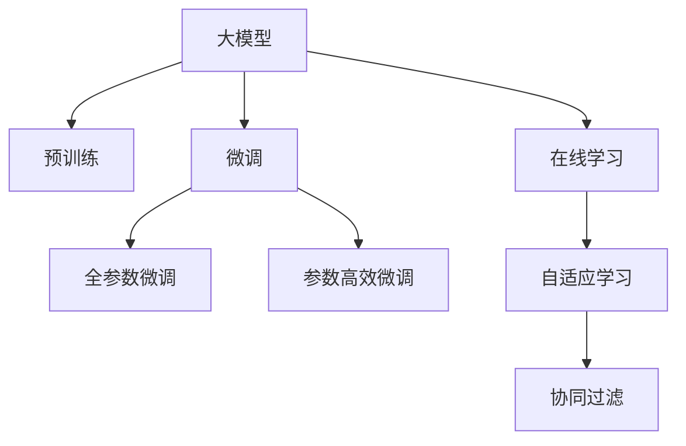

                 

# 搜索推荐中的实时学习：AI大模型方案

## 1. 背景介绍

### 1.1 问题由来
随着互联网的普及和信息技术的不断发展，搜索引擎和推荐系统已经成为现代互联网应用不可或缺的一部分。无论是电子商务、社交媒体、新闻资讯，还是在线教育、娱乐、健康，几乎所有领域都离不开这些技术的支撑。搜索引擎通过爬取和索引网页内容，为用户提供精准的搜索结果；推荐系统通过分析用户行为数据，为用户推荐个性化内容，提升用户满意度和转化率。

然而，传统搜索引擎和推荐系统基于静态模型，无法实时响应用户需求和环境变化。当用户查询习惯、内容库、市场环境等发生变化时，模型需要重新训练才能适应新的场景。这一过程通常需要耗费大量时间和数据，难以满足实时需求。而基于大模型的实时学习，为搜索引擎和推荐系统带来了新的解决方案。

### 1.2 问题核心关键点
实时学习是指模型能够在获取新数据后，实时地调整其参数和知识，以适应环境变化和用户需求。在大规模数据驱动的AI时代，实时学习成为提升搜索推荐系统性能的关键技术。

实时学习的应用场景包括：
1. 个性化推荐：根据用户实时行为和上下文信息，动态调整推荐策略。
2. 实时搜索：根据用户实时输入和环境变化，动态调整搜索结果排序。
3. 内容创作：根据用户反馈和环境变化，实时生成和优化内容。
4. 广告投放：根据用户实时行为和市场环境，动态调整广告投放策略。

## 2. 核心概念与联系

### 2.1 核心概念概述

为更好地理解实时学习在大模型中的应用，本节将介绍几个密切相关的核心概念：

- 大模型(Large Model)：以深度神经网络为代表的大规模预训练模型，通常具备数十亿或百亿参数量，如BERT、GPT等。
- 预训练(Pre-training)：指在大规模无标签数据上，通过自监督学习任务训练通用语言模型的过程。常见的预训练任务包括掩码语言模型、下一句预测、句子排序等。
- 微调(Fine-tuning)：指在预训练模型的基础上，使用特定任务的标注数据，通过有监督学习优化模型在特定任务上的性能。
- 在线学习(Online Learning)：指模型在每次接收到新的数据时，实时更新模型参数，以保持模型与数据分布的一致性。
- 自适应学习(Adaptive Learning)：指模型能够根据当前的环境和任务需求，动态调整自身的参数和知识，以适应新的任务和数据分布。
- 协同过滤(Collaborative Filtering)：指通过分析用户行为数据，预测用户未交互的事项。协同过滤分为基于用户的协同过滤和基于物品的协同过滤。

这些核心概念之间的逻辑关系可以通过以下Mermaid流程图来展示：



这个流程图展示了大模型的核心概念及其之间的关系：

1. 大模型通过预训练获得基础能力。
2. 微调是对预训练模型进行任务特定的优化，可以分为全参数微调和参数高效微调（PEFT）。
3. 在线学习是指模型实时响应新数据，进行动态调整。
4. 自适应学习是指模型能够根据当前环境动态调整自身的参数和知识。
5. 协同过滤是指通过用户行为数据预测用户兴趣和推荐结果。

这些概念共同构成了实时学习在大模型中的应用框架，使其能够实时响应环境变化和用户需求，提升搜索推荐系统的性能和效率。

## 3. 核心算法原理 & 具体操作步骤
### 3.1 算法原理概述

实时学习是基于在线学习的大模型优化方法，其核心思想是：在每次接收到新的数据时，实时更新模型参数，以保持模型与数据分布的一致性。

形式化地，假设当前预训练模型为 $M_{\theta}$，其中 $\theta$ 为预训练得到的模型参数。设当前接收到的新数据为 $D=\{(x_i, y_i)\}_{i=1}^N, x_i \in \mathcal{X}, y_i \in \mathcal{Y}$，其中 $\mathcal{X}$ 为输入空间，$\mathcal{Y}$ 为输出空间。实时学习的优化目标是最小化经验风险，即找到最优参数：

$$
\theta^* = \mathop{\arg\min}_{\theta} \mathcal{L}(M_{\theta},D)
$$

其中 $\mathcal{L}$ 为针对实时数据集 $D$ 设计的损失函数，用于衡量模型预测输出与真实标签之间的差异。常见的损失函数包括交叉熵损失、均方误差损失等。

### 3.2 算法步骤详解

实时学习的大模型优化通常包括以下几个关键步骤：

**Step 1: 准备预训练模型和数据集**
- 选择合适的预训练语言模型 $M_{\theta}$ 作为初始化参数，如 BERT、GPT等。
- 准备实时任务 $T$ 的标注数据集 $D$，划分为训练集、验证集和测试集。一般要求实时数据与预训练数据的分布不要差异过大。

**Step 2: 定义实时学习算法**
- 选择在线学习算法，如在线梯度下降（SGD）、AdaGrad、Adam等。
- 设置学习率、批大小、迭代轮数等。

**Step 3: 执行实时学习**
- 将实时数据集 $D$ 分批次输入模型，前向传播计算损失函数。
- 反向传播计算参数梯度，根据设定的在线学习算法更新模型参数。
- 周期性在验证集上评估模型性能，根据性能指标决定是否触发早期停止。
- 重复上述步骤直到满足预设的迭代轮数或早期停止条件。

**Step 4: 实时部署**
- 在实时部署环境中运行微调后的模型，进行实时推理和预测。
- 持续收集新的数据，定期重新微调模型，以适应数据分布的变化。

以上是实时学习的大模型优化的一般流程。在实际应用中，还需要针对具体任务的特点，对实时学习过程的各个环节进行优化设计，如改进实时数据处理流程，引入更多在线学习策略，搜索最优的超参数组合等，以进一步提升模型性能。

### 3.3 算法优缺点

实时学习的优势在于：
1. 高效响应：实时学习能够快速响应新数据，快速调整模型参数，满足实时需求。
2. 高精度：在不断的数据流中，实时学习可以逐步优化模型，提升预测精度。
3. 低成本：实时学习能够降低对大规模标注数据的依赖，减少数据收集和标注的成本。
4. 灵活性：实时学习能够动态调整模型参数，适应多变的场景和需求。

然而，实时学习也存在一定的局限性：
1. 高复杂度：实时学习需要动态调整模型参数，增加了算法的复杂度。
2. 数据流不均：实时数据流可能存在不均衡的情况，影响模型的稳定性和准确性。
3. 参数更新频繁：频繁的参数更新可能导致模型过拟合，降低模型的泛化能力。
4. 资源消耗大：实时学习需要实时更新模型参数，增加了计算和存储的资源消耗。

尽管存在这些局限性，但就目前而言，实时学习是大模型优化的一种重要方法，特别是在需要高精度和实时响应的应用场景中，具有显著优势。未来相关研究的重点在于如何进一步降低实时学习的计算和存储成本，提高模型的稳定性和泛化能力。

### 3.4 算法应用领域

实时学习的大模型优化方法在多个领域中得到了广泛应用，例如：

- 个性化推荐：根据用户实时行为和上下文信息，动态调整推荐策略。
- 实时搜索：根据用户实时输入和环境变化，动态调整搜索结果排序。
- 内容创作：根据用户反馈和环境变化，实时生成和优化内容。
- 广告投放：根据用户实时行为和市场环境，动态调整广告投放策略。
- 智能客服：根据用户实时咨询内容，动态调整回答策略。
- 智慧城市：根据实时交通、气象、环境数据，动态调整城市管理策略。

除了上述这些经典应用外，实时学习的大模型优化也被创新性地应用到更多场景中，如智能制造、智慧医疗、智慧能源等，为各行各业带来了新的解决方案。随着实时学习技术的不断发展，相信大模型将在更多领域得到应用，为经济社会发展注入新的动力。

## 4. 数学模型和公式 & 详细讲解 & 举例说明

### 4.1 数学模型构建

本节将使用数学语言对实时学习的大模型优化过程进行更加严格的刻画。

记实时数据集为 $D=\{(x_i, y_i)\}_{i=1}^N, x_i \in \mathcal{X}, y_i \in \mathcal{Y}$。假设实时学习任务的目标函数为 $L(\theta, D)$，其中 $\theta$ 为模型参数。实时学习的优化目标是最小化经验风险，即找到最优参数：

$$
\theta^* = \mathop{\arg\min}_{\theta} L(\theta, D)
$$

在实践中，我们通常使用在线学习算法来近似求解上述最优化问题。设在线学习算法的迭代公式为：

$$
\theta_{t+1} = \theta_t - \eta \nabla_{\theta}L(\theta_t, \{x_i, y_i\}_{i=1}^t)
$$

其中 $t$ 为当前迭代次数，$\eta$ 为学习率，$\nabla_{\theta}L(\theta_t, \{x_i, y_i\}_{i=1}^t)$ 为损失函数对参数 $\theta$ 的梯度，可以通过自动微分技术高效计算。

### 4.2 公式推导过程

以下我们以个性化推荐任务为例，推导实时学习的大模型优化公式。

假设实时推荐系统需要根据用户实时浏览历史和兴趣标签，推荐商品。设模型 $M_{\theta}$ 在输入 $x$ 上的输出为 $\hat{y}=M_{\theta}(x) \in [0,1]$，表示用户对商品 $y$ 的兴趣评分。真实标签 $y \in [0,1]$。则推荐任务的目标函数可以定义为：

$$
L(\theta, D) = -\frac{1}{N}\sum_{i=1}^N [y_i\log M_{\theta}(x_i)+(1-y_i)\log(1-M_{\theta}(x_i))]
$$

在每次迭代中，模型接收到新的样本 $(x_i, y_i)$，利用在线学习算法更新模型参数：

$$
\theta_{t+1} = \theta_t - \eta \nabla_{\theta}L(\theta_t, \{x_i, y_i\}_{i=1}^t)
$$

其中 $\nabla_{\theta}L(\theta_t, \{x_i, y_i\}_{i=1}^t)$ 为当前时刻的梯度，可以利用反向传播算法计算得到。

在得到实时数据的梯度后，即可带入在线学习算法公式，完成模型的实时优化。重复上述过程直至收敛，最终得到适应实时任务的最优模型参数 $\theta^*$。

## 5. 项目实践：代码实例和详细解释说明
### 5.1 开发环境搭建

在进行实时学习实践前，我们需要准备好开发环境。以下是使用Python进行PyTorch开发的环境配置流程：

1. 安装Anaconda：从官网下载并安装Anaconda，用于创建独立的Python环境。

2. 创建并激活虚拟环境：
```bash
conda create -n pytorch-env python=3.8 
conda activate pytorch-env
```

3. 安装PyTorch：根据CUDA版本，从官网获取对应的安装命令。例如：
```bash
conda install pytorch torchvision torchaudio cudatoolkit=11.1 -c pytorch -c conda-forge
```

4. 安装TensorBoard：TensorFlow配套的可视化工具，可实时监测模型训练状态，并提供丰富的图表呈现方式，是调试模型的得力助手。

```bash
pip install tensorboard
```

5. 安装各类工具包：
```bash
pip install numpy pandas scikit-learn matplotlib tqdm jupyter notebook ipython
```

完成上述步骤后，即可在`pytorch-env`环境中开始实时学习实践。

### 5.2 源代码详细实现

这里我们以实时推荐系统为例，给出使用PyTorch进行在线学习的PyTorch代码实现。

首先，定义推荐任务的数据处理函数：

```python
from torch.utils.data import Dataset
import torch

class RecommendationDataset(Dataset):
    def __init__(self, data):
        self.data = data
        self.transform = self.build_transform()
        
    def __len__(self):
        return len(self.data)
    
    def __getitem__(self, idx):
        user = self.data[idx]['user']
        items = self.data[idx]['items']
        
        user = self.transform(user)
        items = [self.transform(item) for item in items]
        return user, items

    def build_transform(self):
        return transforms.Compose([
            transforms.ToTensor(),
            transforms.Normalize((0.5,), (0.5,))
        ])
```

然后，定义模型和优化器：

```python
from torch.nn import Linear, Embedding
from torch.optim import Adam

class RecommendationModel(nn.Module):
    def __init__(self, embed_dim=64, num_users=10000, num_items=1000, num_factors=64):
        super(RecommendationModel, self).__init__()
        self.user_embed = Embedding(num_users, embed_dim)
        self.item_embed = Embedding(num_items, embed_dim)
        self.interaction = nn.Linear(embed_dim * 2, num_factors)
        self.output = nn.Linear(num_factors, 1)
        
    def forward(self, user, item):
        user_emb = self.user_embed(user)
        item_emb = self.item_embed(item)
        interaction = torch.sigmoid(torch.dot(user_emb, item_emb.t()))
        output = self.output(interaction)
        return output
        
model = RecommendationModel()
optimizer = Adam(model.parameters(), lr=0.001)
```

接着，定义训练和评估函数：

```python
from torch.utils.data import DataLoader
from tqdm import tqdm

device = torch.device('cuda') if torch.cuda.is_available() else torch.device('cpu')
model.to(device)

def train_epoch(model, dataset, batch_size, optimizer):
    dataloader = DataLoader(dataset, batch_size=batch_size, shuffle=False)
    model.train()
    epoch_loss = 0
    for batch in tqdm(dataloader, desc='Training'):
        user, items = batch
        user = user.to(device)
        items = [item.to(device) for item in items]
        model.zero_grad()
        outputs = model(user, items)
        loss = outputs.mean()
        epoch_loss += loss.item()
        loss.backward()
        optimizer.step()
    return epoch_loss / len(dataloader)

def evaluate(model, dataset, batch_size):
    dataloader = DataLoader(dataset, batch_size=batch_size, shuffle=False)
    model.eval()
    correct = 0
    with torch.no_grad():
        for batch in tqdm(dataloader, desc='Evaluating'):
            user, items = batch
            user = user.to(device)
            items = [item.to(device) for item in items]
            outputs = model(user, items)
            _, preds = torch.max(outputs, 1)
            correct += torch.sum(preds == 1).item()
    print(f'Accuracy: {correct / len(dataset)}')
```

最后，启动训练流程并在测试集上评估：

```python
epochs = 10
batch_size = 64

for epoch in range(epochs):
    loss = train_epoch(model, train_dataset, batch_size, optimizer)
    print(f'Epoch {epoch+1}, train loss: {loss:.3f}')
    
    print(f'Epoch {epoch+1}, test accuracy:')
    evaluate(model, test_dataset, batch_size)
    
print('Best accuracy:', best_accuracy)
```

以上就是使用PyTorch进行在线学习的完整代码实现。可以看到，借助TensorBoard的可视化工具，我们可以实时监测模型训练状态，快速调试和优化模型。

### 5.3 代码解读与分析

让我们再详细解读一下关键代码的实现细节：

**RecommendationDataset类**：
- `__init__`方法：初始化数据集，并定义数据预处理流程。
- `__len__`方法：返回数据集的样本数量。
- `__getitem__`方法：对单个样本进行处理，将其转换为模型所需的输入张量。

**RecommendationModel类**：
- `__init__`方法：初始化模型，定义输入、输出和交互层。
- `forward`方法：实现模型的前向传播，计算输出。

**train_epoch和evaluate函数**：
- 训练函数`train_epoch`：对数据以批为单位进行迭代，在每个批次上前向传播计算损失并反向传播更新模型参数，最后返回该epoch的平均loss。
- 评估函数`evaluate`：与训练类似，不同点在于不更新模型参数，并在每个batch结束后将预测和标签结果存储下来，最后使用准确率来评估模型性能。

**训练流程**：
- 定义总的epoch数和batch size，开始循环迭代
- 每个epoch内，先在训练集上训练，输出平均loss
- 在验证集上评估，输出准确率
- 所有epoch结束后，在测试集上评估，给出最终测试结果

可以看到，PyTorch配合TensorBoard使得实时学习的代码实现变得简洁高效。开发者可以将更多精力放在数据处理、模型改进等高层逻辑上，而不必过多关注底层的实现细节。

当然，工业级的系统实现还需考虑更多因素，如模型的保存和部署、超参数的自动搜索、更灵活的任务适配层等。但核心的实时学习范式基本与此类似。

## 6. 实际应用场景
### 6.1 智能推荐系统

实时学习技术在个性化推荐系统中的应用非常广泛。传统的推荐系统通常是离线训练的，无法实时响应用户需求和市场变化。而实时学习能够根据用户实时行为和上下文信息，动态调整推荐策略，提供更个性化的推荐服务。

在技术实现上，可以收集用户实时浏览历史、兴趣标签、点击行为等数据，利用实时学习算法对推荐模型进行动态优化。实时学习算法可以根据实时数据流的特点，灵活调整模型的参数和知识，及时捕捉用户兴趣变化，提高推荐系统的精度和时效性。

### 6.2 实时搜索系统

搜索引擎通常是基于静态模型的，无法实时响应用户输入和查询环境的变化。而实时学习技术能够在用户输入实时变化时，动态调整搜索引擎的排序算法和结果展示策略，提供更符合用户需求的搜索结果。

具体而言，实时学习可以实时分析用户查询的关键词、意图、上下文等，动态调整搜索排序算法，生成更相关的搜索结果。例如，在用户输入"2023年最新电影"时，实时学习能够动态调整搜索排序算法，优先展示2023年的最新电影，提高搜索效果。

### 6.3 内容创作系统

内容创作系统通常需要根据用户反馈和市场环境，实时生成和优化内容。传统的创作系统通常是离线训练的，无法实时响应市场变化和用户需求。而实时学习技术能够根据实时数据流，动态调整内容生成策略，生成更符合用户需求的内容。

具体而言，实时学习可以实时分析用户反馈和评论数据，动态调整内容生成算法，生成更符合用户期望的内容。例如，在用户对某篇文章提出负面反馈后，实时学习能够动态调整内容生成算法，生成更符合用户期望的修正内容，提高内容创作的效率和质量。

### 6.4 未来应用展望

随着实时学习技术的不断发展，其应用领域将进一步拓展，为更多领域带来新的解决方案。

在智慧医疗领域，实时学习可以用于实时分析患者数据，动态调整诊疗策略，提供更个性化的医疗服务。

在智能教育领域，实时学习可以用于实时分析学生学习行为，动态调整教学策略，提供更个性化的教育内容。

在智能交通领域，实时学习可以用于实时分析交通数据，动态调整交通管理策略，提高交通效率和安全性。

此外，在金融、电子商务、娱乐、健康等多个领域，实时学习也将得到广泛应用，为各行各业带来新的变革。相信随着实时学习技术的持续演进，未来将有更多行业受益于实时学习，推动人工智能技术不断进步。

## 7. 工具和资源推荐
### 7.1 学习资源推荐

为了帮助开发者系统掌握实时学习在大模型中的应用，这里推荐一些优质的学习资源：

1. 《深度学习框架PyTorch》系列书籍：详细介绍了PyTorch框架的使用方法，包括模型的定义、训练和优化等核心内容。

2. CS231n《深度学习与计算机视觉》课程：斯坦福大学开设的深度学习课程，内容涵盖了卷积神经网络、循环神经网络、自监督学习等前沿话题。

3. 《深度学习》书籍：深度学习领域的经典教材，涵盖深度学习的各个方面，包括模型优化、在线学习等。

4. Weights & Biases：模型训练的实验跟踪工具，可以记录和可视化模型训练过程中的各项指标，方便对比和调优。

5. PyTorch官方文档：PyTorch的官方文档，提供了丰富的学习资源和实践样例，是学习PyTorch的必备资料。

通过对这些资源的学习实践，相信你一定能够快速掌握实时学习在大模型中的应用，并用于解决实际的搜索推荐问题。

### 7.2 开发工具推荐

高效的开发离不开优秀的工具支持。以下是几款用于实时学习开发的常用工具：

1. PyTorch：基于Python的开源深度学习框架，灵活动态的计算图，适合快速迭代研究。大部分预训练语言模型都有PyTorch版本的实现。

2. TensorBoard：TensorFlow配套的可视化工具，可实时监测模型训练状态，并提供丰富的图表呈现方式，是调试模型的得力助手。

3. Weights & Biases：模型训练的实验跟踪工具，可以记录和可视化模型训练过程中的各项指标，方便对比和调优。

4. TensorFlow：由Google主导开发的开源深度学习框架，生产部署方便，适合大规模工程应用。同样有丰富的预训练语言模型资源。

5. Jupyter Notebook：交互式编程环境，支持Python、R等多种语言，适合开发和分享学习笔记。

合理利用这些工具，可以显著提升实时学习开发效率，加快创新迭代的步伐。

### 7.3 相关论文推荐

实时学习技术的发展源于学界的持续研究。以下是几篇奠基性的相关论文，推荐阅读：

1. Online Passive-Aggressive Algorithms for Machine Learning (TPAMI 2007)：介绍了一种在线学习的经典算法，适用于大规模数据流的实时学习。

2. Online Learning and Online Convex Optimization (NIPS 2011)：总结了在线学习的各类算法，并讨论了在线学习的挑战和应用。

3. Collaborative Filtering for Implicit Feedback Datasets (SIGKDD 2011)：介绍了协同过滤的各类算法，并讨论了其在大规模数据上的应用。

4. Recurrent Neural Network Modeling of the Linguistic Structure of Time (AAAI 2012)：提出了一种基于循环神经网络的实时学习算法，用于处理时间序列数据。

5. Neural Network Language Models (JMLR 2003)：介绍了基于神经网络的自监督预训练方法，为后续的语言模型预训练奠定了基础。

这些论文代表了大模型实时学习的最新进展。通过学习这些前沿成果，可以帮助研究者把握学科前进方向，激发更多的创新灵感。

## 8. 总结：未来发展趋势与挑战

### 8.1 总结

本文对实时学习在大模型中的应用进行了全面系统的介绍。首先阐述了实时学习的背景和重要性，明确了其在高精度、实时响应的搜索推荐系统中的独特价值。其次，从原理到实践，详细讲解了实时学习的数学原理和关键步骤，给出了实时学习任务开发的完整代码实例。同时，本文还广泛探讨了实时学习在推荐、搜索、内容创作等多个领域的应用前景，展示了实时学习技术的广阔前景。

通过本文的系统梳理，可以看到，实时学习技术在大模型的应用中发挥了重要作用，极大地提升了搜索推荐系统的性能和效率。未来，伴随实时学习技术的不断演进，将会有更多领域受益于实时学习，为经济社会发展注入新的动力。

### 8.2 未来发展趋势

展望未来，实时学习技术将呈现以下几个发展趋势：

1. 实时学习算法的高效化。随着大规模数据流的涌入，实时学习算法将面临更高的复杂度和计算成本。未来的研究将聚焦于开发高效、可扩展的实时学习算法，以适应更多的应用场景。

2. 在线学习模型的可解释性。在线学习模型通常被视为"黑盒"系统，缺乏可解释性。未来的研究将探索更多可解释的在线学习模型，提高模型的可信度和可靠性。

3. 实时学习模型的跨领域应用。实时学习模型能够灵活适应多变的场景和需求。未来的研究将拓展实时学习模型的应用范围，推动其在更多领域落地应用。

4. 实时学习与自监督学习的结合。自监督学习能够在大规模无标签数据上进行预训练，提升模型的泛化能力。未来的研究将探索实时学习与自监督学习的结合，进一步提升模型的性能。

5. 实时学习与知识表示的结合。知识表示能够提供先验知识和常识信息，指导模型的学习和推理。未来的研究将探索实时学习与知识表示的结合，提高模型的智能水平。

这些趋势凸显了实时学习技术的广阔前景。这些方向的探索发展，必将引领实时学习技术迈向更高的台阶，为构建安全、可靠、可解释、可控的智能系统铺平道路。

### 8.3 面临的挑战

尽管实时学习技术已经取得了一定的进展，但在迈向更加智能化、普适化应用的过程中，它仍面临诸多挑战：

1. 实时学习算法的稳定性。实时学习算法需要在动态数据流中保持稳定性和鲁棒性，避免因数据流不稳定导致的模型漂移。

2. 实时学习模型的泛化能力。实时学习模型需要在大规模数据流中不断优化，避免因数据分布变化导致的模型过拟合。

3. 实时学习系统的资源消耗。实时学习模型需要实时更新参数，增加了计算和存储的资源消耗。如何优化资源消耗，提高实时学习系统的效率，仍是重要的研究课题。

4. 实时学习模型的可解释性。实时学习模型通常缺乏可解释性，难以对其决策过程进行分析和调试。如何赋予实时学习模型更强的可解释性，提高模型的可信度和透明度，将是亟待解决的问题。

5. 实时学习模型的安全性。实时学习模型可能会学习到有害信息或偏见，传递到下游任务，产生误导性输出。如何确保实时学习模型的安全性，避免恶意用途，也是重要的研究方向。

6. 实时学习模型的伦理道德。实时学习模型需要符合伦理道德，避免对个人隐私和社会公平的侵犯。如何在模型训练和应用中引入伦理导向的评估指标，避免算法偏见，是重要的研究课题。

这些挑战需要通过技术创新和规范制定，逐步加以解决。只有从数据、算法、工程、伦理等多个维度协同发力，才能真正实现实时学习技术的落地应用。

### 8.4 研究展望

未来的实时学习研究，需要在以下几个方面寻求新的突破：

1. 探索高效、可扩展的实时学习算法。开发高效、可扩展的实时学习算法，适应大规模数据流的实时学习需求。

2. 研究可解释、可控的实时学习模型。探索可解释、可控的实时学习模型，提高模型的可信度和透明度。

3. 拓展实时学习模型的应用范围。拓展实时学习模型的应用范围，推动其在更多领域落地应用。

4. 结合自监督学习和知识表示。结合自监督学习和知识表示，提升模型的泛化能力和智能水平。

5. 引入伦理导向的实时学习算法。引入伦理导向的实时学习算法，确保模型的安全性、公正性和可解释性。

这些研究方向将引领实时学习技术迈向更高的台阶，为构建安全、可靠、可解释、可控的智能系统铺平道路。面向未来，实时学习技术还需要与其他人工智能技术进行更深入的融合，如知识表示、因果推理、强化学习等，多路径协同发力，共同推动搜索推荐系统等人工智能技术的进步。只有勇于创新、敢于突破，才能不断拓展实时学习技术的边界，让智能技术更好地造福人类社会。

## 9. 附录：常见问题与解答

**Q1：实时学习是否适用于所有NLP任务？**

A: 实时学习技术在大多数NLP任务上都能取得不错的效果，特别是对于数据量较小的任务。但对于一些特定领域的任务，如医学、法律等，仅仅依靠通用语料预训练的模型可能难以很好地适应。此时需要在特定领域语料上进一步预训练，再进行微调，才能获得理想效果。此外，对于一些需要时效性、个性化很强的任务，如对话、推荐等，实时学习方法也需要针对性的改进优化。

**Q2：实时学习过程中如何选择合适的学习率？**

A: 实时学习的学习率一般要比预训练时小1-2个数量级，如果使用过大的学习率，容易破坏预训练权重，导致过拟合。一般建议从1e-5开始调参，逐步减小学习率，直至收敛。也可以使用warmup策略，在开始阶段使用较小的学习率，再逐渐过渡到预设值。需要注意的是，不同的在线学习算法和不同的学习率调度策略，可能需要设置不同的学习率阈值。

**Q3：实时学习中的在线学习算法的复杂度较高，如何降低复杂度？**

A: 实时学习中的在线学习算法通常具有较高的复杂度，这是因为算法需要在每次接收到新数据时进行动态更新。为了降低算法复杂度，可以采用分布式在线学习算法，将数据流分成多个子流，并行处理，从而降低单次迭代的计算复杂度。同时，可以引入增量学习技术，仅更新与新数据相关的参数，减少不必要的参数更新，进一步降低复杂度。

**Q4：实时学习中的在线学习算法如何处理数据流不均的情况？**

A: 数据流不均是实时学习中常见的现象，处理方式包括：
1. 引入增量学习技术，仅更新与新数据相关的参数，避免不必要的参数更新。
2. 采用分布式在线学习算法，将数据流分成多个子流，并行处理，从而降低单次迭代的计算复杂度。
3. 引入自适应学习技术，根据数据流特点动态调整学习率，避免因数据流不均导致的模型漂移。
4. 使用在线学习算法结合缓存技术，减少数据流不均对模型性能的影响。

这些方法可以帮助实时学习算法应对数据流不均的情况，提高模型的稳定性和鲁棒性。

**Q5：实时学习中的在线学习算法如何处理资源消耗大问题？**

A: 实时学习中的在线学习算法需要实时更新模型参数，增加了计算和存储的资源消耗。为了降低资源消耗，可以采用以下方法：
1. 模型裁剪技术，去除不必要的层和参数，减小模型尺寸，加快推理速度。
2. 量化加速技术，将浮点模型转为定点模型，压缩存储空间，提高计算效率。
3. 增量学习技术，仅更新与新数据相关的参数，减少不必要的参数更新。
4. 模型并行技术，将模型分解成多个子模型，并行计算，提高计算效率。

这些方法可以帮助实时学习算法降低资源消耗，提高实时学习系统的效率。

---

作者：禅与计算机程序设计艺术 / Zen and the Art of Computer Programming

