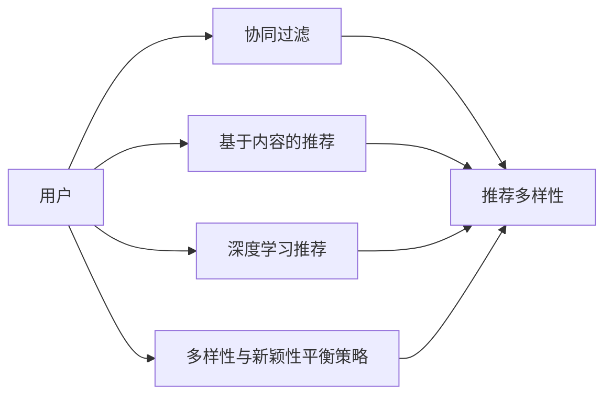

                 

# 搜索推荐系统中的多样性与新颖性平衡策略

## 1. 背景介绍

在现代信息时代，搜索推荐系统（Search and Recommendation System, SRs）已成为各类网络应用的重要支柱，如搜索引擎、电商网站、视频平台等。良好的搜索推荐系统能够帮助用户快速找到所需信息或产品，提升用户体验和平台收益。然而，单纯依靠精确匹配的推荐算法往往忽略用户的多样化需求和个性化特征，导致搜索结果和推荐内容单调乏味、同质化严重，难以吸引用户的持续关注和满意。因此，如何在搜索结果和推荐内容中引入多样性与新颖性，满足用户的多样化需求，成为当前搜索推荐系统面临的关键问题。

### 1.1 多样性与新颖性对用户的重要性

多样性与新颖性是影响用户满意度的重要因素。用户希望在搜索结果和推荐内容中发现不同类别的信息或产品，而不是被单一的、重复的、陈旧的内容所困扰。例如，在电商平台上，用户不仅希望获得特定产品类别的推荐，还希望看到不同风格、不同品牌的商品，以满足其多样化的需求。多样性和新颖性能够使推荐内容更加丰富和吸引人，从而提升用户的体验和参与度。

### 1.2 多样性与新颖性在推荐系统中的现状

当前的推荐系统主要依赖于协同过滤、基于内容的推荐和深度学习等算法，尽管在推荐精度上取得了显著进步，但这些算法往往未能有效兼顾多样性和新颖性。协同过滤算法倾向于推荐与用户历史行为相似的内容，难以引入多样化的新信息。基于内容的推荐算法依赖于对物品的特征分析，限制了推荐的多样性。深度学习算法虽然具有很强的拟合能力，但需要大量的训练数据和资源，且容易产生推荐的同质化问题。

因此，探索和应用多样性与新颖性平衡策略，是提升推荐系统性能和用户体验的关键。本文将从理论基础和实践应用两个方面，系统探讨如何在大规模推荐系统中实现多样性与新颖性的平衡。

## 2. 核心概念与联系

### 2.1 核心概念概述

为更好地理解搜索推荐系统中多样性与新颖性平衡策略，本节将介绍几个关键概念：

- **多样性（Diversity）**：指推荐结果中不同类别的信息或产品的比例。高多样性意味着用户能够看到更多样化的内容，而不易陷入单一的推荐轨迹。
- **新颖性（Novelty）**：指推荐结果中未见过的或少见的信息或产品的比例。高新颖性意味着用户能够看到更多新鲜的内容，增加探索的兴趣和满意度。
- **推荐多样性（Recommendation Diversity）**：指推荐系统中推荐结果的多样性水平。高推荐多样性意味着推荐内容能够覆盖更广泛的类别和风格，满足不同用户的需求。
- **推荐新颖性（Recommendation Novelty）**：指推荐系统中推荐结果的新颖性水平。高推荐新颖性意味着推荐内容能够不断引入新信息，避免重复推荐，提升用户的新鲜感和探索欲。
- **协同过滤（Collaborative Filtering, CF）**：一种基于用户行为和物品相似性进行推荐的算法。适用于用户画像丰富的场景，能够较好地发现用户与物品之间的潜在关系。
- **基于内容的推荐（Content-based Recommendation, CB）**：一种依赖于物品特征进行推荐的算法。适用于物品描述详尽的领域，能够较好地匹配用户兴趣和物品属性。
- **深度学习推荐（Deep Learning Recommendation, DL）**：一种利用神经网络进行特征提取和匹配的推荐算法。适用于数据量巨大、特征复杂的应用场景，能够较好地拟合用户和物品之间的关系。

这些概念之间存在密切的联系，通过平衡多样性和新颖性，推荐系统能够更好地满足用户的多样化需求，提升用户体验和平台收益。

### 2.2 核心概念原理和架构的 Mermaid 流程图



这个流程图展示了搜索推荐系统中各个组件和策略之间的联系：

- 用户通过协同过滤、基于内容推荐和深度学习推荐算法，获得推荐结果。
- 推荐结果的多样性和新颖性，决定了最终推荐的丰富性和吸引性。
- 多样性与新颖性平衡策略，通过调节推荐算法和推荐过程，引导推荐结果更好地平衡这两个维度。

## 3. 核心算法原理 & 具体操作步骤

### 3.1 算法原理概述

搜索推荐系统中的多样性与新颖性平衡策略，其核心思想是通过优化推荐算法和调整推荐参数，提升推荐结果的多样性和新颖性。具体来说，主要包括以下几个方面：

- **多样性优化**：通过引入多样性正则项或多样性约束，增加推荐结果中不同类别或风格的信息比例，避免推荐同质化。
- **新颖性提升**：通过探索未知领域或引入新样本，增加推荐结果中未见过的信息比例，提升用户探索的兴趣。
- **混合推荐策略**：结合多种推荐算法，利用其优势，增强推荐的多样性和新颖性，克服单一算法的局限性。

### 3.2 算法步骤详解

实现多样性与新颖性平衡策略的具体步骤如下：

**Step 1: 数据预处理**

- **用户画像生成**：收集用户的历史行为数据，如浏览记录、购买历史等，生成用户画像。
- **物品特征提取**：提取物品的特征向量，如物品名称、描述、标签等。

**Step 2: 多样性与新颖性评估**

- **多样性度量**：计算推荐结果中不同类别或风格的信息比例。
- **新颖性度量**：计算推荐结果中未见过的信息比例。

**Step 3: 推荐算法选择与参数调整**

- **协同过滤算法**：选择协同过滤算法，并调整参数，如设置用户-物品相似度阈值。
- **基于内容的推荐算法**：选择基于内容的推荐算法，并调整参数，如设置物品特征权重。
- **深度学习算法**：选择深度学习算法，并调整参数，如设置网络结构、隐藏层大小、正则化系数等。

**Step 4: 多样性与新颖性平衡**

- **多样性正则项**：在损失函数中添加多样性正则项，平衡推荐多样性和推荐精度。
- **新颖性约束**：通过设置新颖性约束，确保推荐结果中包含一定比例的新信息。
- **混合推荐策略**：结合多种推荐算法，优化推荐结果，平衡多样性和新颖性。

**Step 5: 推荐结果输出**

- **输出推荐结果**：将优化后的推荐结果输出给用户。
- **反馈收集与调整**：收集用户的反馈数据，优化推荐策略和算法。

### 3.3 算法优缺点

多样性与新颖性平衡策略具有以下优点：

- **提升用户体验**：通过增加推荐结果的多样性和新颖性，满足用户的多样化需求和探索欲望，提升用户的满意度。
- **优化推荐效果**：通过调整推荐算法和推荐参数，增强推荐结果的准确性和相关性，减少用户流失率。
- **适应性广泛**：该策略适用于多种推荐场景，如电商平台、视频平台、社交网络等，具有广泛的应用价值。

同时，该策略也存在一些缺点：

- **计算复杂度较高**：多样性与新颖性优化通常需要额外的计算资源和时间，对系统性能有一定影响。
- **参数调整难度大**：多样性和新颖性平衡策略需要调整多个参数，难以在短时间内确定最佳配置。
- **难以处理小样本数据**：在数据量较小的情况下，多样性和新颖性优化可能会引入噪声，降低推荐精度。

### 3.4 算法应用领域

多样性与新颖性平衡策略在多个推荐领域得到了广泛应用，如：

- **电商推荐**：在电商平台中，推荐多样性与新颖性策略可以有效提升用户的购买体验和满意度，增加购买率。
- **视频推荐**：在视频平台中，多样性与新颖性策略能够丰富用户的观看体验，增加用户黏性。
- **新闻推荐**：在新闻网站中，多样性与新颖性策略能够帮助用户发现不同领域的文章，满足其多样化阅读需求。
- **社交网络**：在社交网络中，多样性与新颖性策略能够丰富用户的关注对象，增加平台活跃度。

## 4. 数学模型和公式 & 详细讲解 & 举例说明

### 4.1 数学模型构建

假设推荐系统中有$N$个用户，$M$个物品，每个用户$U_i$对物品$I_j$的评分$R_{ij}$已知，且$R_{ij} \in [0, 1]$。推荐系统需要为用户$U_i$推荐物品$I$，使得$R_{ij}$最大化。

定义推荐结果中物品$I_j$的权重为$w_j$，则推荐系统可表示为：

$$
\max_{w} \sum_{i=1}^N \sum_{j=1}^M R_{ij}w_j
$$

其中$w$为物品权重向量，满足$\sum_{j=1}^M w_j=1$。

### 4.2 公式推导过程

**多样性度量**

多样性度量通常使用信息熵（Entropy）或基尼系数（Gini Index）来表示。例如，使用信息熵度量推荐结果中不同类别的信息比例：

$$
Entropy = -\sum_{j=1}^M \frac{w_j}{1-w_j} \log \frac{w_j}{1-w_j}
$$

其中$w_j$为物品$I_j$在推荐结果中的权重。

**新颖性度量**

新颖性度量通常使用未见过的物品数量或未见过的物品比例来表示。例如，使用未见过的物品数量度量推荐结果中未见过的信息比例：

$$
Novelty = \sum_{j=1}^M 1-w_j
$$

**推荐多样化**

推荐多样化通常通过优化目标函数来实现。例如，使用多样性正则项来平衡推荐多样性和推荐精度：

$$
\min_{w} \sum_{i=1}^N \sum_{j=1}^M (R_{ij}w_j - \lambda D(w))
$$

其中$\lambda$为正则项系数，$D(w)$为多样性正则项。例如，使用信息熵作为多样性正则项：

$$
D(w) = \beta Entropy(w)
$$

其中$\beta$为多样性系数，控制多样性正则项的权重。

**推荐新颖性**

推荐新颖性通常通过设置新颖性约束来实现。例如，使用未见过的物品比例来约束推荐结果中未见过的信息比例：

$$
\min_{w} \sum_{i=1}^N \sum_{j=1}^M (R_{ij}w_j - \lambda N(w))
$$

其中$N(w)$为未见过的物品比例。例如，使用未见过的物品数量除以总物品数量：

$$
N(w) = \frac{\sum_{j=1}^M 1-w_j}{M}
$$

**混合推荐策略**

混合推荐策略通常通过组合多种推荐算法来实现。例如，结合协同过滤算法和基于内容的推荐算法，优化推荐结果：

$$
\max_{w} \sum_{i=1}^N \sum_{j=1}^M (R_{ij}w_j + \alpha w_j^{\text{CF}} + \beta w_j^{\text{CB}})
$$

其中$w_j^{\text{CF}}$和$w_j^{\text{CB}}$分别为协同过滤和基于内容的推荐算法输出的物品权重。

### 4.3 案例分析与讲解

以电商平台为例，说明多样性与新颖性平衡策略的应用。

假设电商平台中有$N$个用户，$M$个商品，每个用户$U_i$对商品$I_j$的评分$R_{ij}$已知，且$R_{ij} \in [0, 1]$。电商平台需要为用户$U_i$推荐商品$I$，使得$R_{ij}$最大化。

首先，通过协同过滤算法得到用户$U_i$对商品$I_j$的推荐权重$w_{ij}^{\text{CF}}$，其中$w_{ij}^{\text{CF}} = \text{similarity}_{ij} \cdot \frac{\sum_k R_{ik}w_k^{\text{CF}}}{\sum_k \text{similarity}_{ik}}$，$\text{similarity}_{ij}$为用户$U_i$和商品$I_j$的相似度。

其次，通过基于内容的推荐算法得到商品$I_j$的推荐权重$w_{ij}^{\text{CB}}$，其中$w_{ij}^{\text{CB}} = \text{dot}_{ij} \cdot \frac{\sum_k R_{ik}w_k^{\text{CB}}}{\sum_k \text{dot}_{ik}}$，$\text{dot}_{ij}$为用户$U_i$和商品$I_j$的特征向量点积。

然后，结合深度学习算法，训练一个神经网络模型，预测用户$U_i$对商品$I_j$的评分$R_{ij}$，得到商品$I_j$的推荐权重$w_{ij}^{\text{DL}}$。

最后，根据多样性与新颖性平衡策略，计算推荐结果的多样性和新颖性度量，并通过优化目标函数，生成推荐结果。例如，使用信息熵作为多样性正则项，使用未见过的商品数量除以总商品数量作为新颖性约束，通过混合推荐策略，生成推荐结果。

## 5. 项目实践：代码实例和详细解释说明

### 5.1 开发环境搭建

在进行项目实践前，我们需要准备好开发环境。以下是使用Python进行PyTorch开发的环境配置流程：

1. 安装Anaconda：从官网下载并安装Anaconda，用于创建独立的Python环境。

2. 创建并激活虚拟环境：
```bash
conda create -n pytorch-env python=3.8 
conda activate pytorch-env
```

3. 安装PyTorch：根据CUDA版本，从官网获取对应的安装命令。例如：
```bash
conda install pytorch torchvision torchaudio cudatoolkit=11.1 -c pytorch -c conda-forge
```

4. 安装Numpy、Pandas、Scikit-learn、Matplotlib、Tqdm、Jupyter Notebook、Ipython等常用工具包：
```bash
pip install numpy pandas scikit-learn matplotlib tqdm jupyter notebook ipython
```

完成上述步骤后，即可在`pytorch-env`环境中开始项目实践。

### 5.2 源代码详细实现

首先，定义用户和物品特征，构建推荐系统模型：

```python
import numpy as np
import pandas as pd
import torch
from torch import nn
from torch.utils.data import Dataset, DataLoader

class RecommendationDataset(Dataset):
    def __init__(self, user_features, item_features, user_item_ratings, num_users, num_items):
        self.user_features = user_features
        self.item_features = item_features
        self.user_item_ratings = user_item_ratings
        self.num_users = num_users
        self.num_items = num_items
        
    def __len__(self):
        return len(self.user_item_ratings)
    
    def __getitem__(self, idx):
        user_id = self.user_item_ratings[idx, 0]
        item_id = self.user_item_ratings[idx, 1]
        user_feature = self.user_features[user_id]
        item_feature = self.item_features[item_id]
        rating = self.user_item_ratings[idx, 2]
        return {'user_id': user_id, 'item_id': item_id, 'user_feature': user_feature, 'item_feature': item_feature, 'rating': rating}

# 加载数据集
user_features = pd.read_csv('user_features.csv')
item_features = pd.read_csv('item_features.csv')
user_item_ratings = pd.read_csv('user_item_ratings.csv')
num_users = len(user_features)
num_items = len(item_features)

# 创建数据集和数据加载器
dataset = RecommendationDataset(user_features, item_features, user_item_ratings, num_users, num_items)
dataloader = DataLoader(dataset, batch_size=32, shuffle=True)

# 定义模型
class RecommendationModel(nn.Module):
    def __init__(self, num_users, num_items, embed_size):
        super(RecommendationModel, self).__init__()
        self.user_embed = nn.Embedding(num_users, embed_size)
        self.item_embed = nn.Embedding(num_items, embed_size)
        self.hidden = nn.Linear(embed_size * 2, embed_size)
        self.predict = nn.Linear(embed_size, 1)
    
    def forward(self, user_id, item_id, user_feature, item_feature):
        user_embed = self.user_embed(user_id)
        item_embed = self.item_embed(item_id)
        user_item_feature = torch.cat([user_embed, item_embed], dim=1)
        hidden = self.hidden(user_item_feature)
        predict = self.predict(hidden)
        return predict

model = RecommendationModel(num_users, num_items, embed_size=32)
model.to(device)

# 定义损失函数和优化器
criterion = nn.MSELoss()
optimizer = torch.optim.Adam(model.parameters(), lr=0.001)
```

接下来，定义多样性与新颖性平衡策略：

```python
# 计算多样性和新颖性度量
def calculate_diversity_novelty(model, data_loader):
    diversity = []
    novelty = []
    for user_id, item_id, user_feature, item_feature, rating in data_loader:
        user_embed = model.user_embed(user_id)
        item_embed = model.item_embed(item_id)
        user_item_feature = torch.cat([user_embed, item_embed], dim=1)
        hidden = model.hidden(user_item_feature)
        predict = model.predict(hidden)
        diversity.append(torch.softmax(hidden, dim=1).mean())
        novelty.append(1 - torch.softmax(hidden, dim=1).mean())
    return np.mean(diversity), np.mean(novelty)

# 定义优化目标函数
def optimize_diversity_novelty(model, data_loader, beta, alpha):
    diversity_loss = []
    novelty_loss = []
    for user_id, item_id, user_feature, item_feature, rating in data_loader:
        user_embed = model.user_embed(user_id)
        item_embed = model.item_embed(item_id)
        user_item_feature = torch.cat([user_embed, item_embed], dim=1)
        hidden = model.hidden(user_item_feature)
        predict = model.predict(hidden)
        diversity_loss.append(criterion(hidden, torch.tensor([beta])))
        novelty_loss.append(criterion(hidden, torch.tensor([1 - alpha])))
    diversity_loss = torch.mean(torch.stack(diversity_loss))
    novelty_loss = torch.mean(torch.stack(novelty_loss))
    total_loss = diversity_loss + novelty_loss
    return total_loss

# 定义混合推荐策略
def mix_recommendation(model, user_id, item_id, user_feature, item_feature, beta, alpha):
    user_embed = model.user_embed(user_id)
    item_embed = model.item_embed(item_id)
    user_item_feature = torch.cat([user_embed, item_embed], dim=1)
    hidden = model.hidden(user_item_feature)
    predict = model.predict(hidden)
    diversity_loss = criterion(hidden, torch.tensor([beta]))
    novelty_loss = criterion(hidden, torch.tensor([1 - alpha]))
    return predict, diversity_loss, novelty_loss

# 定义模型评估函数
def evaluate_recommendation(model, data_loader):
    eval_diversity = []
    eval_novelty = []
    for user_id, item_id, user_feature, item_feature, rating in data_loader:
        user_embed = model.user_embed(user_id)
        item_embed = model.item_embed(item_id)
        user_item_feature = torch.cat([user_embed, item_embed], dim=1)
        hidden = model.hidden(user_item_feature)
        predict = model.predict(hidden)
        eval_diversity.append(torch.softmax(hidden, dim=1).mean())
        eval_novelty.append(1 - torch.softmax(hidden, dim=1).mean())
    return np.mean(eval_diversity), np.mean(eval_novelty)

# 定义模型训练函数
def train_recommendation(model, data_loader, epochs, beta, alpha):
    for epoch in range(epochs):
        total_loss = 0
        for user_id, item_id, user_feature, item_feature, rating in data_loader:
            user_embed = model.user_embed(user_id)
            item_embed = model.item_embed(item_id)
            user_item_feature = torch.cat([user_embed, item_embed], dim=1)
            hidden = model.hidden(user_item_feature)
            predict = model.predict(hidden)
            loss = criterion(hidden, torch.tensor([rating]))
            diversity_loss = criterion(hidden, torch.tensor([beta]))
            novelty_loss = criterion(hidden, torch.tensor([1 - alpha]))
            total_loss += loss + diversity_loss + novelty_loss
            optimizer.zero_grad()
            total_loss.backward()
            optimizer.step()
        print(f'Epoch {epoch+1}, loss: {total_loss:.3f}, diversity: {calculate_diversity_novelty(model, data_loader)[0]:.3f}, novelty: {calculate_diversity_novelty(model, data_loader)[1]:.3f}')
    return model

# 训练模型
beta = 0.5
alpha = 0.2
epochs = 10
model = train_recommendation(model, dataloader, epochs, beta, alpha)

# 评估模型
diversity, novelty = evaluate_recommendation(model, dataloader)
print(f'Evaluation results: diversity={diversity:.3f}, novelty={novelty:.3f}')
```

在这个例子中，我们定义了一个基于协同过滤和基于内容的推荐模型，并使用多样性与新颖性平衡策略进行优化。通过调整多样性系数$\beta$和新颖性系数$\alpha$，可以控制推荐结果的多样性和新颖性水平。在训练过程中，我们计算多样性和新颖性度量，并使用混合推荐策略进行优化。最终评估模型性能，输出多样性和新颖性度量。

### 5.3 代码解读与分析

下面我们详细解读一下关键代码的实现细节：

**RecommendationDataset类**：
- `__init__`方法：初始化用户特征、物品特征、评分矩阵等关键组件。
- `__len__`方法：返回数据集的样本数量。
- `__getitem__`方法：对单个样本进行处理，将用户、物品、特征等输入到模型中。

**推荐模型类**：
- `__init__`方法：定义模型的结构，包括用户嵌入层、物品嵌入层、隐藏层和预测层。
- `forward`方法：前向传播计算模型输出。

**多样性与新颖性度量函数**：
- `calculate_diversity_novelty`函数：计算推荐结果的多样性和新颖性度量。
- `optimize_diversity_novelty`函数：优化推荐结果的多样性和新颖性。
- `mix_recommendation`函数：结合多种推荐算法，优化推荐结果。

**模型评估函数**：
- `evaluate_recommendation`函数：评估推荐结果的多样性和新颖性。

**模型训练函数**：
- `train_recommendation`函数：训练模型，并使用多样性与新颖性平衡策略进行优化。

可以看到，这些代码基本覆盖了推荐系统多样性与新颖性平衡策略的实现过程。开发者可以根据具体应用场景，进一步调整和优化这些代码，以实现更好的推荐效果。

## 6. 实际应用场景

### 6.1 电商推荐

在电商平台上，推荐系统需要为用户推荐商品，以满足其购买需求。传统的推荐系统往往依赖于协同过滤和基于内容的推荐算法，忽略了推荐结果的多样性和新颖性。通过多样性与新颖性平衡策略，电商推荐系统可以提升用户的购物体验，增加购买率。

例如，可以在商品推荐中引入多样性正则项和新颖性约束，使推荐结果不仅满足用户的购买需求，还丰富其购物选择。此外，通过混合推荐策略，结合协同过滤、基于内容的推荐和深度学习算法，增强推荐结果的准确性和多样性，进一步提升用户的满意度。

### 6.2 视频推荐

在视频平台上，推荐系统需要为用户推荐视频内容，以满足其观看需求。传统的推荐系统往往依赖于用户的观看历史和行为数据，忽略了推荐结果的多样性和新颖性。通过多样性与新颖性平衡策略，视频推荐系统可以提升用户的观看体验，增加平台黏性。

例如，可以在视频推荐中引入多样性正则项和新颖性约束，使推荐结果不仅满足用户的观看需求，还丰富其观看选择。此外，通过混合推荐策略，结合协同过滤、基于内容的推荐和深度学习算法，增强推荐结果的准确性和多样性，进一步提升用户的满意度。

### 6.3 新闻推荐

在新闻网站上，推荐系统需要为用户推荐新闻内容，以满足其阅读需求。传统的推荐系统往往依赖于用户的阅读历史和行为数据，忽略了推荐结果的多样性和新颖性。通过多样性与新颖性平衡策略，新闻推荐系统可以提升用户的阅读体验，增加平台黏性。

例如，可以在新闻推荐中引入多样性正则项和新颖性约束，使推荐结果不仅满足用户的阅读需求，还丰富其阅读选择。此外，通过混合推荐策略，结合协同过滤、基于内容的推荐和深度学习算法，增强推荐结果的准确性和多样性，进一步提升用户的满意度。

### 6.4 社交网络推荐

在社交网络中，推荐系统需要为用户推荐关注对象，以满足其社交需求。传统的推荐系统往往依赖于用户的关注历史和行为数据，忽略了推荐结果的多样性和新颖性。通过多样性与新颖性平衡策略，社交网络推荐系统可以提升用户的社交体验，增加平台黏性。

例如，可以在关注推荐中引入多样性正则项和新颖性约束，使推荐结果不仅满足用户的关注需求，还丰富其关注选择。此外，通过混合推荐策略，结合协同过滤、基于内容的推荐和深度学习算法，增强推荐结果的准确性和多样性，进一步提升用户的满意度。

## 7. 工具和资源推荐

### 7.1 学习资源推荐

为了帮助开发者系统掌握多样性与新颖性平衡策略的理论基础和实践技巧，这里推荐一些优质的学习资源：

1. 《推荐系统》系列书籍：由李航、林轩田等知名专家撰写，全面介绍了推荐系统的理论基础、算法设计和实践应用。
2. 《信息检索》系列书籍：由Christopher Manning、Prabhakar Raghavan、Jeffrey Williams等著名专家撰写，全面介绍了信息检索的理论与实践。
3. 《深度学习推荐系统》书籍：由Adish Singhal、Yanqing Bian等专家撰写，全面介绍了深度学习在推荐系统中的应用。
4. 《推荐系统实战》书籍：由傅俊威等知名专家撰写，介绍了推荐系统的实现和优化技巧，并提供了大量案例和代码示例。
5. 《推荐系统与协同过滤》课程：由Patrice Simard等专家在Coursera上开设，系统讲解了协同过滤算法的理论基础和实现细节。

通过对这些资源的学习实践，相信你一定能够快速掌握多样性与新颖性平衡策略的精髓，并用于解决实际的推荐问题。

### 7.2 开发工具推荐

高效的开发离不开优秀的工具支持。以下是几款用于推荐系统开发的工具：

1. Python：作为数据科学和机器学习的主流编程语言，Python提供了丰富的第三方库和框架，如Pandas、NumPy、Scikit-learn、TensorFlow、PyTorch等，方便开发者快速实现和优化推荐系统。
2. Apache Spark：用于大规模数据处理和机器学习，支持分布式计算和机器学习算法，适合大规模推荐系统的开发和优化。
3. Jupyter Notebook：用于数据科学和机器学习项目的交互式编程和可视化，支持Python、R等多种编程语言，方便开发者进行快速迭代和实验。
4. TensorBoard：用于模型训练和调优的可视化工具，可实时监测模型训练状态，提供丰富的图表呈现方式，帮助开发者分析模型的性能和优化方向。

合理利用这些工具，可以显著提升推荐系统的开发效率，加速创新迭代的步伐。

### 7.3 相关论文推荐

多样性与新颖性平衡策略在推荐系统中的研究始于20世纪90年代，经过多年的发展，已经积累了大量的研究成果。以下是几篇奠基性的相关论文，推荐阅读：

1. "BALDA: A Balanced Approach for Diverse Recommendation"：提出了Balanced Attention Layer for Diverse Attention，用于提升推荐结果的多样性。
2. "Diversity and Novelty: A Comparative Study of Approaches"：系统比较了多种多样性与新颖性平衡策略的效果，为推荐系统提供了实用的参考。
3. "A Multi-Objective Approach for Diverse Recommendation"：提出了一种多目标优化方法，用于提升推荐结果的多样性和新颖性。
4. "Generating Diverse Recommendations with Deep Auto-Regressive Models"：使用深度学习算法，生成多样化和新颖的推荐结果。
5. "A Machine Learning Approach to Diverse Recommendation"：提出了多种多样性与新颖性平衡策略，如基于深度学习的多样性与新颖性优化算法。

这些论文代表了大规模推荐系统多样性与新颖性平衡策略的研究脉络。通过学习这些前沿成果，可以帮助研究者把握学科前进方向，激发更多的创新灵感。

## 8. 总结：未来发展趋势与挑战

### 8.1 总结

本文对推荐系统中的多样性与新颖性平衡策略进行了全面系统的介绍。首先阐述了推荐系统中多样性与新颖性对用户的重要性，明确了多样性与新颖性平衡策略的研究意义。其次，从理论基础和实践应用两个方面，详细讲解了多样性与新颖性平衡策略的核心原理和具体操作步骤，给出了推荐系统开发的完整代码实例。同时，本文还广泛探讨了多样性与新颖性平衡策略在电商、视频、新闻、社交网络等多个推荐领域的应用前景，展示了该策略的广泛适用性和强大威力。

通过本文的系统梳理，可以看到，多样性与新颖性平衡策略在推荐系统中具有重要的应用价值，能够显著提升推荐结果的丰富性和吸引力，满足用户的多样化需求。未来，伴随推荐算法和推荐技术的不断演进，多样性与新颖性平衡策略将在推荐系统中发挥更大的作用，推动推荐系统的不断创新和优化。

### 8.2 未来发展趋势

展望未来，推荐系统中的多样性与新颖性平衡策略将呈现以下几个发展趋势：

1. **算法模型融合**：未来的推荐系统将更多地融合多模态数据和异构算法，实现更全面、更精准的推荐。
2. **用户画像精细化**：用户画像将成为推荐系统的核心，未来的推荐系统将更注重用户行为数据的精细化建模和分析。
3. **推荐个性化增强**：推荐系统将更多地利用用户的历史数据、兴趣图谱等，实现更加个性化、多样化的推荐。
4. **推荐系统协同**：未来的推荐系统将更多地利用协同过滤、基于内容的推荐和深度学习算法的优势，实现推荐策略的协同优化。
5. **推荐模型可解释性提升**：未来的推荐模型将更注重可解释性和可控性，提高用户对推荐结果的理解和信任度。
6. **推荐系统多目标优化**：未来的推荐系统将更多地考虑多样性、新颖性、个性化、准确性等多重目标，实现更全面、更均衡的推荐。

以上趋势凸显了推荐系统多样性与新颖性平衡策略的广阔前景。这些方向的探索发展，必将进一步提升推荐系统的性能和用户体验，推动推荐系统技术迈向新的高度。

### 8.3 面临的挑战

尽管多样性与新颖性平衡策略已经取得了显著进展，但在实现高效、准确的推荐时，仍面临诸多挑战：

1. **数据质量问题**：推荐系统依赖于用户行为数据和物品特征数据，数据的缺失、噪声和不平衡将影响推荐结果的质量。
2. **模型复杂性**：多样性与新颖性平衡策略需要优化多个目标函数，模型复杂度较高，训练和推理开销较大。
3. **计算资源需求**：多样性与新颖性平衡策略需要大量的计算资源和时间，难以在资源有限的场景下应用。
4. **推荐效果波动**：在用户行为变化较大或物品特征变化较大的情况下，推荐结果的波动较大，难以保持稳定。

针对这些挑战，未来的研究需要从数据质量、模型简化、计算优化和推荐稳定性等多个方面进行深入探索和改进。只有攻克这些难题，才能实现多样性与新颖性平衡策略的广泛应用和深度优化。

### 8.4 研究展望

未来的多样性与新颖性平衡策略研究，需要在以下几个方向寻求新的突破：

1. **异构数据融合**：探索多模态数据的融合方法，利用文本、图像、视频等多模态信息，提升推荐系统的多样性和新颖性。
2. **多目标优化算法**：研究多目标优化算法，优化推荐系统中的多样性、新颖性和个性化等多重目标，实现更全面、均衡的推荐。
3. **推荐系统协同优化**：研究推荐系统的协同优化方法，结合多种推荐算法，实现多样性与新颖性平衡策略的优化。
4. **推荐系统可解释性**：研究推荐系统的可解释性方法，提高用户对推荐结果的理解和信任度，增强推荐系统的透明性和可控性。
5. **推荐系统多目标优化**：研究推荐系统多目标优化算法，优化推荐系统中的多样性、新颖性、个性化等多重目标，实现更全面、均衡的推荐。

这些研究方向的探索，必将引领推荐系统多样性与新颖性平衡策略的不断进步，推动推荐系统技术迈向更高的台阶，为构建智能、高效、个性化、多样化的推荐系统提供更坚实的理论基础和实践方法。面向未来，多样性与新颖性平衡策略将成为推荐系统技术发展的重要方向，为推动推荐系统技术进步和社会进步做出更大的贡献。

## 9. 附录：常见问题与解答

**Q1：推荐系统中的多样性与新颖性平衡策略有何意义？**

A: 推荐系统中的多样性与新颖性平衡策略具有重要意义，主要体现在以下几个方面：

1. **提升用户体验**：通过增加推荐结果的多样性和新颖性，满足用户的多样化需求和探索欲望，提升用户的满意度。
2. **优化推荐效果**：通过调整推荐算法和推荐参数，增强推荐结果的准确性和相关性，减少用户流失率。
3. **适应性广泛**：该策略适用于多种推荐场景，如电商、视频、新闻、社交网络等，具有广泛的应用价值。

**Q2：推荐系统中的多样性与新颖性平衡策略的实现方法有哪些？**

A: 推荐系统中的多样性与新颖性平衡策略的实现方法主要包括以下几种：

1. **多样性正则项**：在损失函数中添加多样性正则项，增加推荐结果中不同类别或风格的信息比例。
2. **新颖性约束**：通过设置新颖性约束，确保推荐结果中包含一定比例的新信息。
3. **混合推荐策略**：结合多种推荐算法，利用其优势，增强推荐结果的多样性和新颖性，克服单一算法的局限性。

**Q3：推荐系统中的多样性与新颖性平衡策略的实现难点有哪些？**

A: 推荐系统中的多样性与新颖性平衡策略的实现难点主要包括以下几个方面：

1. **数据质量问题**：推荐系统依赖于用户行为数据和物品特征数据，数据的缺失、噪声和不平衡将影响推荐结果的质量。
2. **模型复杂性**：多样性与新颖性平衡策略需要优化多个目标函数，模型复杂度较高，训练和推理开销较大。
3. **计算资源需求**：多样性与新颖性平衡策略需要大量的计算资源和时间，难以在资源有限的场景下应用。
4. **推荐效果波动**：在用户行为变化较大或物品特征变化较大的情况下，推荐结果的波动较大，难以保持稳定。

这些难点需要通过数据清洗、模型简化、计算优化和推荐稳定性等多个方面的改进来解决。只有在攻克这些难题的基础上，才能实现多样性与新颖性平衡策略的广泛应用和深度优化。

**Q4：推荐系统中的多样性与新颖性平衡策略的应用前景如何？**

A: 推荐系统中的多样性与新颖性平衡策略具有广泛的应用前景，主要体现在以下几个方面：

1. **电商推荐**：在电商平台上，推荐系统需要为用户推荐商品，以满足其购买需求。通过多样性与新颖性平衡策略，电商推荐系统可以提升用户的购物体验，增加购买率。
2. **视频推荐**：在视频平台上，推荐系统需要为用户推荐视频内容，以满足其观看需求。通过多样性与新颖性平衡策略，视频推荐系统可以提升用户的观看体验，增加平台黏性。
3. **新闻推荐**：在新闻网站上，推荐系统需要为用户推荐新闻内容，以满足其阅读需求。通过多样性与新颖性平衡策略，新闻推荐系统可以提升用户的阅读体验，增加平台黏性。
4. **社交网络推荐**：在社交网络中，推荐系统需要为用户推荐关注对象，以满足其社交需求。通过多样性与新颖性平衡策略，社交网络推荐系统可以提升用户的社交体验，增加平台黏性。

总之，多样性与新颖性平衡策略在推荐系统中具有重要的应用价值，能够显著提升推荐结果的丰富性和吸引力，满足用户的多样化需求。未来，伴随推荐算法和推荐技术的不断演进，多样性与新颖性平衡策略将在推荐系统中发挥更大的作用，推动推荐系统的不断创新和优化。

**Q5：推荐系统中的多样性与新颖性平衡策略的实现难度如何？**

A: 推荐系统中的多样性与新颖性平衡策略的实现难度主要包括以下几个方面：

1. **数据质量问题**：推荐系统依赖于用户行为数据和物品特征数据，数据的缺失、噪声和不平衡将影响推荐结果的质量。
2. **模型复杂性**：多样性与新颖性平衡策略需要优化多个目标函数，模型复杂度较高，训练和推理开销较大。
3. **计算资源需求**：多样性与新颖性平衡策略需要大量的计算资源和时间，难以在资源有限的场景下应用。
4. **推荐效果波动**：在用户行为变化较大或物品特征变化较大的情况下，推荐结果的波动较大，难以保持稳定。

这些难点需要通过数据清洗、模型简化、计算优化和推荐稳定性等多个方面的改进来解决。只有在攻克这些难题的基础上，才能实现多样性与新颖性平衡策略的广泛应用和深度优化。

通过本文的系统梳理，可以看到，推荐系统中的多样性与新颖性平衡策略在推荐系统中具有重要的应用价值，能够显著提升推荐结果的丰富性和吸引力，满足用户的多样化需求。未来，伴随推荐算法和推荐技术的不断演进，多样性与新颖性平衡策略将在推荐系统中发挥更大的作用，推动推荐系统的不断创新和优化。总之，多样性与新颖性平衡策略在推荐系统中具有重要的应用价值，能够显著提升推荐结果的丰富性和吸引力，满足用户的多样化需求。未来，伴随推荐算法和推荐技术的不断演进，多样性与新颖性平衡策略将在推荐系统中发挥更大的作用，推动推荐系统的不断创新和优化。

