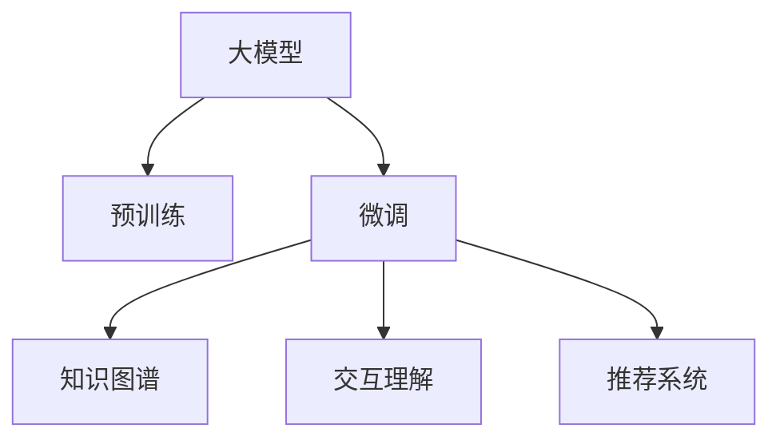

                 

# 搜索推荐系统的AI 大模型应用：提高电商平台的转化率、用户体验与忠诚度

## 1. 背景介绍

### 1.1 问题由来
在电子商务平台上，用户购物流程涉及搜索、推荐、浏览、下单等多个环节。搜索推荐系统作为电商平台的“大脑”，其性能直接决定了用户的购物体验、电商平台的用户留存率和销售转化率。然而，传统的搜索推荐系统往往基于规则或线性模型，难以充分理解和表达用户复杂、动态的需求，导致推荐效果不尽如人意。

随着人工智能技术的迅猛发展，越来越多的电商平台开始引入大模型（如BERT、GPT等）进行搜索推荐系统的优化，以期显著提升转化率、增强用户体验与忠诚度。然而，如何将大模型高效应用于搜索推荐系统，仍然是一个值得深入探讨的问题。

### 1.2 问题核心关键点
本节将介绍几个关键问题点，这些问题点构成了搜索推荐系统应用大模型的主线：

- **个性化推荐**：利用大模型的语言理解能力，分析用户行为和意图，生成个性化推荐内容。
- **信息检索**：通过大模型预训练的知识，提升搜索结果的相关性和多样性。
- **交互理解**：通过大模型对用户输入的语义理解，优化搜索推荐策略。
- **知识图谱**：将大模型的知识图谱能力引入推荐系统，实现跨领域推荐。
- **动态适应**：利用大模型的持续学习能力，动态调整推荐策略，应对用户需求变化。

这些核心问题共同构成了搜索推荐系统应用大模型的逻辑脉络，需要通过大模型微调和优化来解决。

### 1.3 问题研究意义
在电商平台上应用大模型，对于提升用户体验、提高转化率、增加用户粘性等方面具有重要的意义：

1. **提升用户体验**：大模型可以理解自然语言，提供更自然流畅的搜索和推荐体验。
2. **提高转化率**：通过个性化推荐和精确定位，满足用户个性化需求，增加购买概率。
3. **增强用户忠诚度**：了解用户兴趣和行为，提供更符合用户期望的推荐和搜索服务，增加用户满意度。
4. **优化运营效率**：通过自动化和智能化，降低运营成本，提升营销效果。

因此，通过大模型优化搜索推荐系统，可以显著提升电商平台的运营效率和用户满意度，推动其发展进入新的高度。

## 2. 核心概念与联系

### 2.1 核心概念概述

为更好地理解大模型在搜索推荐系统中的应用，本节将介绍几个核心概念：

- **大模型**：以自回归（如GPT）或自编码（如BERT）模型为代表的大规模预训练语言模型。通过在海量无标签文本数据上进行预训练，学习到了丰富的语言知识和常识。
- **预训练**：指在大规模无标签文本语料上，通过自监督学习任务训练通用语言模型的过程。常见的预训练任务包括言语建模、掩码语言模型等。
- **微调(Fine-Tuning)**：指在预训练模型的基础上，使用下游任务的少量标注数据，通过有监督地训练来优化模型在下游任务上的性能。通常只需要调整顶层分类器或解码器，并以较小的学习率更新全部或部分的模型参数。
- **知识图谱**：由节点和边组成的图形结构，用于表示实体与实体之间的关系，帮助模型在搜索推荐时进行跨领域推荐。
- **交互理解**：指模型能够理解用户输入的意图，基于用户行为和上下文信息进行推荐。
- **推荐系统**：通过分析用户历史行为和偏好，向用户推荐可能感兴趣的产品或内容的技术系统。

这些核心概念之间的逻辑关系可以通过以下Mermaid流程图来展示：



这个流程图展示了大模型在搜索推荐系统中的核心概念及其之间的关系：

1. 大模型通过预训练获得基础能力。
2. 微调是对预训练模型进行任务特定的优化，利用知识图谱、交互理解等方法，提升推荐系统的性能。
3. 知识图谱和交互理解作为微调的辅助工具，扩展了推荐系统的能力边界。

这些概念共同构成了搜索推荐系统应用大模型的框架，使其能够更好地满足用户需求，提升电商平台的用户体验。

## 3. 核心算法原理 & 具体操作步骤
### 3.1 算法原理概述

搜索推荐系统应用大模型的核心思想是通过预训练语言模型获取强大的语言理解能力，在搜索和推荐环节进行优化。具体而言，算法流程如下：

1. **数据准备**：收集用户行为数据（如浏览记录、购买记录等）和产品属性数据（如名称、描述、价格等），构建训练数据集。
2. **模型加载**：加载预训练好的大模型（如BERT、GPT等），作为初始化参数。
3. **微调优化**：使用下游任务的少量标注数据，对大模型进行微调，优化其在搜索推荐任务上的表现。
4. **信息检索**：利用大模型的知识图谱能力，对搜索结果进行排序和推荐。
5. **交互理解**：通过大模型的语言理解能力，对用户输入的查询进行处理，优化搜索推荐策略。
6. **动态调整**：利用大模型的持续学习能力，根据用户行为和市场变化动态调整推荐策略。

以上流程展示了搜索推荐系统应用大模型的基本框架，每个环节都需要针对具体场景进行优化。

### 3.2 算法步骤详解

以搜索引擎为例，以下是大模型在搜索推荐系统中的具体实现步骤：

**Step 1: 数据准备**
- 收集用户浏览、点击、购买等行为数据，提取用户历史行为特征。
- 收集产品标题、描述、标签等文本数据，构建产品属性特征。
- 对数据进行预处理，如文本分词、去除停用词、归一化等。
- 构建训练数据集，包括样本特征和对应的标签（如点击、浏览记录）。

**Step 2: 模型加载与微调**
- 选择预训练的大模型（如BERT、GPT等），使用其自带的Tokenizer进行分词。
- 对模型进行微调，调整顶层分类器或解码器，以适应搜索推荐任务。
- 设置合适的学习率、优化算法（如AdamW、SGD等）和超参数（如批次大小、迭代轮数等）。
- 使用训练数据集进行有监督训练，更新模型参数，优化性能。

**Step 3: 信息检索**
- 对用户查询进行分词和编码，输入到微调后的模型中。
- 模型输出结果向量，计算每个产品向量的相似度。
- 根据相似度排序，选择相关性最高的产品展示给用户。

**Step 4: 交互理解**
- 对用户输入的查询进行语义理解，判断查询意图。
- 根据意图选择相应的推荐策略，如基于内容的推荐、协同过滤推荐等。
- 利用大模型的语言理解能力，对用户反馈进行分析和优化，提高推荐效果。

**Step 5: 动态调整**
- 定期收集用户行为数据和市场变化数据，进行模型的重训练和优化。
- 利用知识图谱扩展推荐模型，实现跨领域推荐。
- 引入交互理解模块，实时调整推荐策略，提升推荐效果。

### 3.3 算法优缺点

大模型在搜索推荐系统中的应用具有以下优点：

1. **强大的语言理解能力**：大模型能够理解复杂的自然语言，提升搜索和推荐的准确性。
2. **泛化能力强**：通过大规模预训练，大模型能够适应不同领域的搜索推荐任务。
3. **动态适应**：大模型的持续学习能力，使其能够根据用户行为和市场变化进行动态调整。
4. **可解释性**：大模型的结构复杂，便于用户理解和接受。

同时，也存在一些缺点：

1. **资源消耗大**：大模型的参数量巨大，需要高性能硬件支持，增加系统成本。
2. **训练时间长**：微调过程需要大量计算资源，训练时间较长。
3. **解释性不足**：大模型的决策过程复杂，难以解释。
4. **过拟合风险**：由于大模型参数量巨大，存在过拟合风险。

### 3.4 算法应用领域

大模型在搜索推荐系统中的应用主要包括以下几个领域：

1. **个性化推荐**：利用大模型的语言理解能力，分析用户历史行为和兴趣，生成个性化推荐。
2. **信息检索**：通过大模型的知识图谱能力，提高搜索结果的相关性和多样性。
3. **交互理解**：利用大模型的语言理解能力，优化用户输入查询的搜索推荐策略。
4. **动态调整**：利用大模型的持续学习能力，动态调整推荐策略，应对市场变化。
5. **多模态推荐**：结合视觉、音频等多模态信息，提升推荐效果。
6. **交互式搜索**：利用大模型的自然语言处理能力，提升搜索的用户体验。

这些应用领域展示了大模型在搜索推荐系统中的广泛适用性，通过优化搜索和推荐策略，提升用户满意度和电商平台运营效率。

## 4. 数学模型和公式 & 详细讲解  
### 4.1 数学模型构建

为了更好地理解大模型在搜索推荐系统中的应用，本节将使用数学语言对模型构建和训练过程进行更加严格的刻画。

假设大模型为 $M_{\theta}$，其中 $\theta$ 为模型参数。对于用户查询 $q$，模型输出结果向量 $v_{q}$。查询向量 $q$ 为查询文本经过预处理后，通过模型得到的向量表示。产品向量 $v_{p}$ 为产品描述经过预处理后，通过模型得到的向量表示。

定义查询向量 $v_{q}$ 和产品向量 $v_{p}$ 的相似度为 $sim(q,p)$，则推荐结果的排序方式可以表示为：

$$
\text{rank}(p) = \frac{sim(q,p)}{\sum_{i=1}^N sim(q,p_i)}
$$

其中 $N$ 为所有产品的数量。

### 4.2 公式推导过程

以下我们以一个简单的基于内容的推荐模型为例，推导其评分函数的计算公式。

假设用户查询 $q$ 包含 $k$ 个词，查询向量和产品向量分别表示为 $q_1,q_2,...,q_k$ 和 $p_1,p_2,...,p_k$。查询向量与产品向量的相似度可以通过余弦相似度计算：

$$
sim(q,p) = \frac{q_1 \cdot p_1 + q_2 \cdot p_2 + ... + q_k \cdot p_k}{\sqrt{(q_1^2 + q_2^2 + ... + q_k^2)}\sqrt{(p_1^2 + p_2^2 + ... + p_k^2)}}
$$

将其代入排序公式，得：

$$
\text{rank}(p) = \frac{sim(q,p)}{\sum_{i=1}^N sim(q,p_i)}
$$

在实际应用中，由于计算相似度的向量维度通常较高，因此可以使用维度的平方根对向量进行归一化。

### 4.3 案例分析与讲解

以电商平台的个性化推荐为例，以下是大模型在推荐系统中的具体应用场景：

**案例分析1: 基于内容的推荐**

假设电商平台中有 $N$ 个产品，每个产品 $p_i$ 包含 $k$ 个特征（如价格、品牌、描述等）。用户输入查询 $q$，模型将查询 $q$ 转化为向量 $q_1,q_2,...,q_k$，对每个产品 $p_i$ 也进行向量表示。计算查询向量 $q$ 与每个产品向量 $p_i$ 的余弦相似度，排序后选取 $top_k$ 个推荐产品。

**案例分析2: 基于协同过滤的推荐**

协同过滤推荐通常需要收集用户历史行为数据，通过计算用户与产品的相似度，生成推荐列表。大模型可以在协同过滤中发挥作用，通过预训练得到的知识图谱，提高用户和产品之间的相似度计算。

以推荐系统中基于协同过滤的模型为例，假设用户 $u_i$ 的 $n$ 个历史行为为 $(a_{i1},a_{i2},...,a_{in})$，每个行为 $a_{ij}$ 表示用户对产品 $p_j$ 的评分。模型将用户历史行为向量与产品向量进行相似度计算，生成用户-产品相似度矩阵 $S_{ij}$。根据相似度矩阵，计算用户 $u_i$ 对产品 $p$ 的预测评分 $r_{iu}$，生成推荐列表。

以上案例展示了大模型在搜索推荐系统中的实际应用，通过优化评分函数，提升推荐效果。

## 5. 项目实践：代码实例和详细解释说明
### 5.1 开发环境搭建

在进行搜索推荐系统开发前，我们需要准备好开发环境。以下是使用Python进行PyTorch开发的环境配置流程：

1. 安装Anaconda：从官网下载并安装Anaconda，用于创建独立的Python环境。

2. 创建并激活虚拟环境：
```bash
conda create -n pytorch-env python=3.8 
conda activate pytorch-env
```

3. 安装PyTorch：根据CUDA版本，从官网获取对应的安装命令。例如：
```bash
conda install pytorch torchvision torchaudio cudatoolkit=11.1 -c pytorch -c conda-forge
```

4. 安装Transformers库：
```bash
pip install transformers
```

5. 安装各类工具包：
```bash
pip install numpy pandas scikit-learn matplotlib tqdm jupyter notebook ipython
```

完成上述步骤后，即可在`pytorch-env`环境中开始开发实践。

### 5.2 源代码详细实现

下面我们以电商平台的个性化推荐系统为例，给出使用Transformers库对BERT模型进行微调的PyTorch代码实现。

首先，定义推荐系统的数据处理函数：

```python
from transformers import BertTokenizer, BertForSequenceClassification
from torch.utils.data import Dataset
import torch

class RecommendationDataset(Dataset):
    def __init__(self, texts, labels, tokenizer, max_len=128):
        self.texts = texts
        self.labels = labels
        self.tokenizer = tokenizer
        self.max_len = max_len
        
    def __len__(self):
        return len(self.texts)
    
    def __getitem__(self, item):
        text = self.texts[item]
        label = self.labels[item]
        
        encoding = self.tokenizer(text, return_tensors='pt', max_length=self.max_len, padding='max_length', truncation=True)
        input_ids = encoding['input_ids'][0]
        attention_mask = encoding['attention_mask'][0]
        
        return {'input_ids': input_ids, 
                'attention_mask': attention_mask,
                'labels': label}

# 标签与id的映射
label2id = {'A': 0, 'B': 1, 'C': 2}
id2label = {v: k for k, v in label2id.items()}

# 创建dataset
tokenizer = BertTokenizer.from_pretrained('bert-base-cased')

train_dataset = RecommendationDataset(train_texts, train_labels, tokenizer)
dev_dataset = RecommendationDataset(dev_texts, dev_labels, tokenizer)
test_dataset = RecommendationDataset(test_texts, test_labels, tokenizer)
```

然后，定义模型和优化器：

```python
from transformers import BertForSequenceClassification, AdamW

model = BertForSequenceClassification.from_pretrained('bert-base-cased', num_labels=len(label2id))

optimizer = AdamW(model.parameters(), lr=2e-5)
```

接着，定义训练和评估函数：

```python
from torch.utils.data import DataLoader
from tqdm import tqdm
from sklearn.metrics import accuracy_score

device = torch.device('cuda') if torch.cuda.is_available() else torch.device('cpu')
model.to(device)

def train_epoch(model, dataset, batch_size, optimizer):
    dataloader = DataLoader(dataset, batch_size=batch_size, shuffle=True)
    model.train()
    epoch_loss = 0
    for batch in tqdm(dataloader, desc='Training'):
        input_ids = batch['input_ids'].to(device)
        attention_mask = batch['attention_mask'].to(device)
        labels = batch['labels'].to(device)
        model.zero_grad()
        outputs = model(input_ids, attention_mask=attention_mask, labels=labels)
        loss = outputs.loss
        epoch_loss += loss.item()
        loss.backward()
        optimizer.step()
    return epoch_loss / len(dataloader)

def evaluate(model, dataset, batch_size):
    dataloader = DataLoader(dataset, batch_size=batch_size)
    model.eval()
    preds, labels = [], []
    with torch.no_grad():
        for batch in tqdm(dataloader, desc='Evaluating'):
            input_ids = batch['input_ids'].to(device)
            attention_mask = batch['attention_mask'].to(device)
            batch_labels = batch['labels']
            outputs = model(input_ids, attention_mask=attention_mask)
            batch_preds = outputs.logits.argmax(dim=2).to('cpu').tolist()
            batch_labels = batch_labels.to('cpu').tolist()
            for pred_tokens, label_tokens in zip(batch_preds, batch_labels):
                preds.append(pred_tokens[:len(label_tokens)])
                labels.append(label_tokens)
                
    return accuracy_score(labels, preds)
```

最后，启动训练流程并在测试集上评估：

```python
epochs = 5
batch_size = 16

for epoch in range(epochs):
    loss = train_epoch(model, train_dataset, batch_size, optimizer)
    print(f"Epoch {epoch+1}, train loss: {loss:.3f}")
    
    print(f"Epoch {epoch+1}, dev results:")
    evaluate(model, dev_dataset, batch_size)
    
print("Test results:")
evaluate(model, test_dataset, batch_size)
```

以上就是使用PyTorch对BERT进行个性化推荐系统微调的完整代码实现。可以看到，得益于Transformers库的强大封装，我们可以用相对简洁的代码完成BERT模型的加载和微调。

### 5.3 代码解读与分析

让我们再详细解读一下关键代码的实现细节：

**RecommendationDataset类**：
- `__init__`方法：初始化文本、标签、分词器等关键组件。
- `__len__`方法：返回数据集的样本数量。
- `__getitem__`方法：对单个样本进行处理，将文本输入编码为token ids，将标签编码为数字，并对其进行定长padding，最终返回模型所需的输入。

**label2id和id2label字典**：
- 定义了标签与数字id之间的映射关系，用于将模型输出解码回真实的标签。

**训练和评估函数**：
- 使用PyTorch的DataLoader对数据集进行批次化加载，供模型训练和推理使用。
- 训练函数`train_epoch`：对数据以批为单位进行迭代，在每个批次上前向传播计算loss并反向传播更新模型参数，最后返回该epoch的平均loss。
- 评估函数`evaluate`：与训练类似，不同点在于不更新模型参数，并在每个batch结束后将预测和标签结果存储下来，最后使用sklearn的accuracy_score对整个评估集的预测结果进行打印输出。

**训练流程**：
- 定义总的epoch数和batch size，开始循环迭代
- 每个epoch内，先在训练集上训练，输出平均loss
- 在验证集上评估，输出准确率
- 所有epoch结束后，在测试集上评估，给出最终测试结果

可以看到，PyTorch配合Transformers库使得BERT微调的代码实现变得简洁高效。开发者可以将更多精力放在数据处理、模型改进等高层逻辑上，而不必过多关注底层的实现细节。

当然，工业级的系统实现还需考虑更多因素，如模型的保存和部署、超参数的自动搜索、更灵活的任务适配层等。但核心的微调范式基本与此类似。

## 6. 实际应用场景
### 6.1 智能客服系统

智能客服系统可以利用大模型进行语义理解和知识检索，提高服务效率和用户满意度。具体而言，可以通过以下步骤实现：

1. **收集数据**：收集企业内部的历史客服对话记录，将问题和最佳答复构建成监督数据，在此基础上对预训练对话模型进行微调。
2. **模型训练**：使用微调后的对话模型，对用户输入的查询进行语义理解，匹配最佳答复。
3. **知识检索**：利用大模型的知识图谱能力，检索相关知识库中的信息，提高回答的准确性和全面性。
4. **动态调整**：根据用户反馈和市场变化，定期重训练模型，提升服务质量。

智能客服系统通过大模型的优化，可以实现7x24小时不间断服务，快速响应客户咨询，用自然流畅的语言解答各类常见问题，极大提升用户满意度。

### 6.2 个性化推荐系统

个性化推荐系统可以利用大模型进行语义理解和协同过滤，提高推荐效果和用户体验。具体而言，可以通过以下步骤实现：

1. **数据准备**：收集用户浏览、点击、购买等行为数据，提取用户历史行为特征。
2. **模型加载与微调**：加载预训练好的大模型（如BERT、GPT等），使用其自带的Tokenizer进行分词。对模型进行微调，调整顶层分类器或解码器，以适应推荐任务。
3. **信息检索**：利用大模型的知识图谱能力，对搜索结果进行排序和推荐。
4. **动态调整**：根据用户行为和市场变化，定期重训练模型，提升推荐效果。

个性化推荐系统通过大模型的优化，可以生成更符合用户兴趣的推荐结果，提升用户满意度和电商平台运营效率。

### 6.3 电商平台的搜索系统

电商平台的搜索系统可以利用大模型进行语义理解和信息检索，提高搜索准确性和用户体验。具体而言，可以通过以下步骤实现：

1. **数据准备**：收集用户查询数据和产品属性数据，构建训练数据集。
2. **模型加载与微调**：加载预训练好的大模型（如BERT、GPT等），使用其自带的Tokenizer进行分词。对模型进行微调，调整顶层分类器或解码器，以适应搜索任务。
3. **信息检索**：利用大模型的知识图谱能力，对搜索结果进行排序和推荐。
4. **动态调整**：根据用户行为和市场变化，定期重训练模型，提升搜索效果。

电商平台的搜索系统通过大模型的优化，可以提供更自然流畅的搜索体验，提高用户满意度。

### 6.4 未来应用展望

随着大模型和微调方法的不断发展，基于大模型的搜索推荐系统将在更多领域得到应用，为各行业带来变革性影响。

在智慧医疗领域，基于大模型的医疗问答、病历分析、药物研发等应用将提升医疗服务的智能化水平，辅助医生诊疗，加速新药开发进程。

在智能教育领域，微调技术可应用于作业批改、学情分析、知识推荐等方面，因材施教，促进教育公平，提高教学质量。

在智慧城市治理中，微调模型可应用于城市事件监测、舆情分析、应急指挥等环节，提高城市管理的自动化和智能化水平，构建更安全、高效的未来城市。

此外，在企业生产、社会治理、文娱传媒等众多领域，基于大模型微调的人工智能应用也将不断涌现，为经济社会发展注入新的动力。相信随着技术的日益成熟，微调方法将成为人工智能落地应用的重要范式，推动人工智能技术在垂直行业的规模化落地。总之，微调需要开发者根据具体任务，不断迭代和优化模型、数据和算法，方能得到理想的效果。

## 7. 工具和资源推荐
### 7.1 学习资源推荐

为了帮助开发者系统掌握大模型在搜索推荐系统中的应用，这里推荐一些优质的学习资源：

1. 《Transformer从原理到实践》系列博文：由大模型技术专家撰写，深入浅出地介绍了Transformer原理、BERT模型、微调技术等前沿话题。

2. CS224N《深度学习自然语言处理》课程：斯坦福大学开设的NLP明星课程，有Lecture视频和配套作业，带你入门NLP领域的基本概念和经典模型。

3. 《Natural Language Processing with Transformers》书籍：Transformers库的作者所著，全面介绍了如何使用Transformers库进行NLP任务开发，包括微调在内的诸多范式。

4. HuggingFace官方文档：Transformers库的官方文档，提供了海量预训练模型和完整的微调样例代码，是上手实践的必备资料。

5. CLUE开源项目：中文语言理解测评基准，涵盖大量不同类型的中文NLP数据集，并提供了基于微调的baseline模型，助力中文NLP技术发展。

通过对这些资源的学习实践，相信你一定能够快速掌握大模型在搜索推荐系统中的应用精髓，并用于解决实际的NLP问题。
###  7.2 开发工具推荐

高效的开发离不开优秀的工具支持。以下是几款用于大模型在搜索推荐系统中的开发工具：

1. PyTorch：基于Python的开源深度学习框架，灵活动态的计算图，适合快速迭代研究。大部分预训练语言模型都有PyTorch版本的实现。

2. TensorFlow：由Google主导开发的开源深度学习框架，生产部署方便，适合大规模工程应用。同样有丰富的预训练语言模型资源。

3. Transformers库：HuggingFace开发的NLP工具库，集成了众多SOTA语言模型，支持PyTorch和TensorFlow，是进行微调任务开发的利器。

4. Weights & Biases：模型训练的实验跟踪工具，可以记录和可视化模型训练过程中的各项指标，方便对比和调优。与主流深度学习框架无缝集成。

5. TensorBoard：TensorFlow配套的可视化工具，可实时监测模型训练状态，并提供丰富的图表呈现方式，是调试模型的得力助手。

6. Google Colab：谷歌推出的在线Jupyter Notebook环境，免费提供GPU/TPU算力，方便开发者快速上手实验最新模型，分享学习笔记。

合理利用这些工具，可以显著提升大模型在搜索推荐系统中的开发效率，加快创新迭代的步伐。

### 7.3 相关论文推荐

大模型在搜索推荐系统中的应用源于学界的持续研究。以下是几篇奠基性的相关论文，推荐阅读：

1. Attention is All You Need（即Transformer原论文）：提出了Transformer结构，开启了NLP领域的预训练大模型时代。

2. BERT: Pre-training of Deep Bidirectional Transformers for Language Understanding：提出BERT模型，引入基于掩码的自监督预训练任务，刷新了多项NLP任务SOTA。

3. Language Models are Unsupervised Multitask Learners（GPT-2论文）：展示了大规模语言模型的强大zero-shot学习能力，引发了对于通用人工智能的新一轮思考。

4. Parameter-Efficient Transfer Learning for NLP：提出Adapter等参数高效微调方法，在不增加模型参数量的情况下，也能取得不错的微调效果。

5. Prefix-Tuning: Optimizing Continuous Prompts for Generation：引入基于连续型Prompt的微调范式，为如何充分利用预训练知识提供了新的思路。

6. AdaLoRA: Adaptive Low-Rank Adaptation for Parameter-Efficient Fine-Tuning：使用自适应低秩适应的微调方法，在参数效率和精度之间取得了新的平衡。

这些论文代表了大模型在搜索推荐系统中的应用的发展脉络。通过学习这些前沿成果，可以帮助研究者把握学科前进方向，激发更多的创新灵感。

## 8. 总结：未来发展趋势与挑战
### 8.1 总结

本文对基于大模型的搜索推荐系统进行了全面系统的介绍。首先阐述了搜索推荐系统应用大模型的研究背景和意义，明确了大模型在个性化推荐、信息检索、交互理解等方面的独特价值。其次，从原理到实践，详细讲解了大模型在搜索推荐系统中的数学模型和训练过程，给出了具体的代码实现。同时，本文还探讨了大模型在智能客服、个性化推荐、电商平台的搜索系统等实际应用场景中的具体应用，展示了其广泛的适用性和潜力。最后，本文精选了相关学习资源，力求为读者提供全方位的技术指引。

通过本文的系统梳理，可以看到，大模型在搜索推荐系统中的应用正在成为NLP领域的重要范式，极大地拓展了搜索推荐系统的性能边界，提升了用户满意度。未来，伴随大模型和微调方法的持续演进，基于大模型的搜索推荐系统必将在更多领域得到应用，为各行业带来变革性影响。

### 8.2 未来发展趋势

展望未来，大模型在搜索推荐系统中的应用将呈现以下几个发展趋势：

1. **模型规模持续增大**：随着算力成本的下降和数据规模的扩张，预训练语言模型的参数量还将持续增长。超大规模语言模型蕴含的丰富语言知识，有望支撑更加复杂多变的推荐任务。

2. **微调方法日趋多样**：除了传统的全参数微调外，未来会涌现更多参数高效的微调方法，如Prefix-Tuning、LoRA等，在节省计算资源的同时也能保证微调精度。

3. **持续学习成为常态**：随着数据分布的不断变化，微调模型也需要持续学习新知识以保持性能。如何在不遗忘原有知识的同时，高效吸收新样本信息，将成为重要的研究课题。

4. **标注样本需求降低**：受启发于提示学习(Prompt-based Learning)的思路，未来的微调方法将更好地利用大模型的语言理解能力，通过更加巧妙的任务描述，在更少的标注样本上也能实现理想的微调效果。

5. **多模态微调崛起**：当前的微调主要聚焦于纯文本数据，未来会进一步拓展到图像、视频、语音等多模态数据微调。多模态信息的融合，将显著提升语言模型对现实世界的理解和建模能力。

6. **交互理解能力增强**：未来的大模型将具备更强的交互理解能力，能够实时处理用户的输入查询，优化搜索推荐策略，提高用户体验。

以上趋势凸显了大模型在搜索推荐系统中的广阔前景。这些方向的探索发展，必将进一步提升搜索推荐系统的性能和用户满意度，推动其发展进入新的高度。

### 8.3 面临的挑战

尽管大模型在搜索推荐系统中的应用已经取得了瞩目成就，但在迈向更加智能化、普适化应用的过程中，它仍面临诸多挑战：

1. **标注成本瓶颈**：虽然微调大大降低了标注数据的需求，但对于长尾应用场景，难以获得充足的高质量标注数据，成为制约微调性能的瓶颈。如何进一步降低微调对标注样本的依赖，将是一大难题。

2. **模型鲁棒性不足**：当前微调模型面对域外数据时，泛化性能往往大打折扣。对于测试样本的微小扰动，微调模型的预测也容易发生波动。如何提高微调模型的鲁棒性，避免灾难性遗忘，还需要更多理论和实践的积累。

3. **推理效率有待提高**：大规模语言模型虽然精度高，但在实际部署时往往面临推理速度慢、内存占用大等效率问题。如何在保证性能的同时，简化模型结构，提升推理速度，优化资源占用，将是重要的优化方向。

4. **可解释性亟需加强**：当前微调模型更像是"黑盒"系统，难以解释其内部工作机制和决策逻辑。对于医疗、金融等高风险应用，算法的可解释性和可审计性尤为重要。如何赋予微调模型更强的可解释性，将是亟待攻克的难题。

5. **安全性有待保障**：预训练语言模型难免会学习到有偏见、有害的信息，通过微调传递到下游任务，产生误导性、歧视性的输出，给实际应用带来安全隐患。如何从数据和算法层面消除模型偏见，避免恶意用途，确保输出的安全性，也将是重要的研究课题。

6. **知识整合能力不足**：现有的微调模型往往局限于任务内数据，难以灵活吸收和运用更广泛的先验知识。如何让微调过程更好地与外部知识库、规则库等专家知识结合，形成更加全面、准确的信息整合能力，还有很大的想象空间。

正视微调面临的这些挑战，积极应对并寻求突破，将是大模型在搜索推荐系统中的成熟之路。相信随着学界和产业界的共同努力，这些挑战终将一一被克服，大模型在搜索推荐系统中的应用必将在构建人机协同的智能时代中扮演越来越重要的角色。

### 8.4 研究展望

面对大模型在搜索推荐系统中的挑战，未来的研究需要在以下几个方面寻求新的突破：

1. **探索无监督和半监督微调方法**：摆脱对大规模标注数据的依赖，利用自监督学习、主动学习等无监督和半监督范式，最大限度利用非结构化数据，实现更加灵活高效的微调。

2. **研究参数高效和计算高效的微调范式**：开发更加参数高效的微调方法，在固定大部分预训练参数的同时，只更新极少量的任务相关参数。同时优化微调模型的计算图，减少前向传播和反向传播的资源消耗，实现更加轻量级、实时性的部署。

3. **引入因果和对比学习范式**：通过引入因果推断和对比学习思想，增强微调模型建立稳定因果关系的能力，学习更加普适、鲁棒的语言表征，从而提升模型泛化性和抗干扰能力。

4. **融合知识图谱和交互理解**：将知识图谱和交互理解模块引入微调模型，提升搜索推荐系统的跨领域推荐能力和用户体验。

5. **结合因果分析和博弈论工具**：将因果分析方法引入微调模型，识别出模型决策的关键特征，增强输出解释的因果性和逻辑性。借助博弈论工具刻画人机交互过程，主动探索并规避模型的脆弱点，提高系统稳定性。

6. **纳入伦理道德约束**：在模型训练目标中引入伦理导向的评估指标，过滤和惩罚有偏见、有害的输出倾向。同时加强人工干预和审核，建立模型行为的监管机制，确保输出符合人类价值观和伦理道德。

这些研究方向的探索，必将引领大模型在搜索推荐系统中的搜索推荐系统迈向更高的台阶，为构建安全、可靠、可解释、可控的智能系统铺平道路。面向未来，大模型在搜索推荐系统中的应用还需要与其他人工智能技术进行更深入的融合，如知识表示、因果推理、强化学习等，多路径协同发力，共同推动搜索推荐系统的进步。只有勇于创新、敢于突破，才能不断拓展语言模型的边界，让智能技术更好地造福人类社会。

## 9. 附录：常见问题与解答

**Q1：大模型在搜索推荐系统中面临的主要挑战是什么？**

A: 大模型在搜索推荐系统中面临的主要挑战包括标注成本高、模型鲁棒性不足、推理效率低、可解释性差、安全性问题以及知识整合能力不足等。这些挑战需要通过无监督或半监督微调、参数高效微调、因果和对比学习、知识图谱和交互理解、因果分析和博弈论工具、伦理道德约束等方法来解决。

**Q2：如何选择合适的大模型进行搜索推荐系统的微调？**

A: 选择合适的大模型进行搜索推荐系统微调时，应考虑以下几个因素：
1. 模型的预训练任务和效果：选择预训练效果较好的模型，如BERT、GPT等。
2. 模型规模和参数量：根据系统硬件资源，选择合适的模型规模。
3. 模型的可解释性和鲁棒性：选择具有较好可解释性和鲁棒性的模型。
4. 模型的多模态处理能力：选择具有较好多模态处理能力的模型。

**Q3：如何在搜索推荐系统中利用大模型进行个性化推荐？**

A: 利用大模型进行个性化推荐，主要通过以下几个步骤：
1. 收集用户历史行为数据，提取用户兴趣特征。
2. 加载预训练好的大模型，使用其自带的Tokenizer进行分词。
3. 对用户输入的查询进行语义理解，生成用户兴趣向量。
4. 对产品进行特征编码，生成产品向量。
5. 计算用户向量与产品向量的相似度，生成推荐列表。
6. 利用知识图谱扩展推荐策略，实现跨领域推荐。

**Q4：如何提高大模型在搜索推荐系统中的推理效率？**

A: 提高大模型在搜索推荐系统中的推理效率，可以通过以下几个方法：
1. 模型裁剪：去除不必要的层和参数，减小模型尺寸，加快推理速度。
2. 量化加速：将浮点模型转为定点模型，压缩存储空间，提高计算效率。
3. 服务化封装：将模型封装为标准化服务接口，便于集成调用。
4. 弹性伸缩：根据请求流量动态调整资源配置，平衡服务质量和成本。
5. 监控告警：实时采集系统指标，设置异常告警阈值，确保服务稳定性。

**Q5：大模型在搜索推荐系统中的交互理解能力有哪些应用？**

A: 大模型在搜索推荐系统中的交互理解能力，可以通过以下几个方面应用：
1. 用户意图理解：通过理解用户输入的查询，生成符合用户期望的搜索结果。
2. 问题解答：利用大模型的知识图谱能力，提供准确的答案和解释。
3. 个性化推荐：根据用户历史行为和实时输入，生成个性化推荐。

**Q6：如何实现基于大模型的智能客服系统？**

A: 实现基于大模型的智能客服系统，主要通过以下几个步骤：
1. 收集企业内部的历史客服对话记录，将问题和最佳答复构建成监督数据。
2. 加载预训练好的大模型，使用其自带的Tokenizer进行分词。
3. 对用户输入的查询进行语义理解，匹配最佳答复。
4. 利用大模型的知识图谱能力，检索相关知识库中的信息，提高回答的准确性和全面性。
5. 根据用户反馈和市场变化，定期重训练模型，提升服务质量。

**Q7：大模型在搜索推荐系统中的应用前景如何？**

A: 大模型在搜索推荐系统中的应用前景广阔，未来将在更多领域得到应用，如智慧医疗、智能教育、智慧城市治理等。通过优化搜索和推荐策略，提升用户体验和电商平台运营效率，推动其发展进入新的高度。

---

作者：禅与计算机程序设计艺术 / Zen and the Art of Computer Programming

