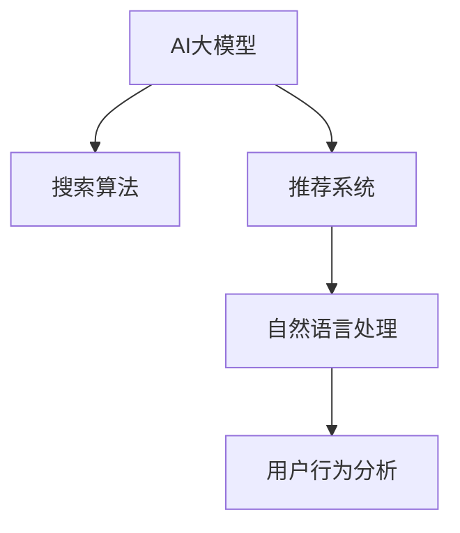

                 

# 搜索推荐系统的AI 大模型应用：电商平台的核心竞争力

> 关键词：大模型,推荐系统,搜索算法,自然语言处理,用户行为分析,电商平台

## 1. 背景介绍

在电商平台的数字化转型浪潮中，搜索推荐系统作为连接用户和商品的重要桥梁，扮演着越来越重要的角色。为了提升用户体验，提高转化率，电商平台纷纷引入先进的AI技术，构建更精准、更个性化的搜索推荐引擎。在这一过程中，AI大模型由于其强大的数据处理能力和深度学习优势，成为电商搜索推荐系统的核心竞争力之一。

## 2. 核心概念与联系

### 2.1 核心概念概述

为了深入理解AI大模型在电商搜索推荐系统中的应用，本文将介绍几个关键概念及其之间的关系：

- **AI大模型**：以深度神经网络为代表的大规模预训练语言模型，如BERT、GPT-3等。通过在大规模语料上预训练，学习通用语言知识，具备强大的语言理解和生成能力。

- **搜索算法**：帮助用户快速找到其兴趣商品的算法，包括关键词匹配、协同过滤、向量搜索等。搜索算法的多样性，能够满足不同用户需求，提升搜索效果。

- **推荐系统**：基于用户行为、商品属性、时间等因素，为用户推荐可能感兴趣的商品的系统。推荐算法包括基于内容的推荐、基于协同过滤的推荐、混合推荐等。

- **自然语言处理(NLP)**：处理和分析自然语言，以构建搜索、推荐、问答等系统的技术。NLP能够理解用户查询意图，生成自然语言回复，提升搜索推荐体验。

- **用户行为分析**：通过分析用户的浏览、点击、购买等行为数据，构建用户画像，预测用户偏好，提升推荐效果。

这些概念之间的逻辑关系可以通过以下Mermaid流程图来展示：



这个流程图展示了AI大模型在搜索推荐系统中的关键作用：

1. 大模型通过预训练获得基础能力。
2. 搜索算法利用大模型的语言理解能力，进行更精准的关键词匹配和查询理解。
3. 推荐系统基于用户行为分析和大模型的语义理解，为用户生成个性化的推荐。
4. 自然语言处理和大模型的结合，使用户查询更自然流畅。
5. 用户行为分析和大模型共同构建用户画像，提升推荐效果。

## 3. 核心算法原理 & 具体操作步骤

### 3.1 算法原理概述

基于AI大模型的电商搜索推荐系统，核心在于利用大模型的语言理解能力，结合用户行为数据，构建高效的搜索推荐引擎。具体来说，搜索推荐过程可以分解为以下几个步骤：

1. **用户查询理解**：利用大模型进行自然语言处理，理解用户查询的意图和关键词。
2. **商品匹配与推荐**：根据用户查询和大模型理解的结果，通过搜索算法和推荐算法，匹配和推荐相关商品。
3. **用户行为反馈**：记录用户的点击、购买等行为，通过用户行为分析，更新用户画像，进一步优化推荐效果。

### 3.2 算法步骤详解

以下是对电商搜索推荐系统中的核心算法步骤的详细介绍：

**Step 1: 用户查询理解**

大模型在电商搜索推荐系统中的核心应用之一是用户查询理解。具体步骤如下：

1. **文本预处理**：对用户输入的查询文本进行分词、去停用词、词性标注等预处理操作。

2. **文本编码**：使用大模型将预处理后的文本编码成向量表示。

3. **语义理解**：利用大模型的语义理解能力，对文本向量进行解码，生成用户查询意图的表示。

具体实现代码如下：

```python
from transformers import BertTokenizer, BertModel
import torch

# 初始化BERT模型和分词器
tokenizer = BertTokenizer.from_pretrained('bert-base-uncased')
model = BertModel.from_pretrained('bert-base-uncased')

# 用户查询
query = "我想买一双耐克运动鞋"
# 分词并编码
encoding = tokenizer(query, return_tensors='pt')
input_ids = encoding['input_ids'][0]

# 模型前向传播
with torch.no_grad():
    outputs = model(input_ids)
    last_hidden_states = outputs.last_hidden_state

# 提取用户意图
# 这里可以根据具体任务需求，提取特定的隐含层作为用户意图表示
```

**Step 2: 商品匹配与推荐**

在用户查询理解之后，需要根据用户意图和商品数据，进行商品匹配与推荐。推荐系统常用的方法包括：

1. **基于内容的推荐**：根据商品的属性信息（如品牌、类别、价格等），计算商品与用户查询的相似度，推荐相关商品。

2. **基于协同过滤的推荐**：根据用户的历史行为和偏好，找到相似用户，推荐其喜欢的商品。

3. **混合推荐**：综合基于内容的推荐和协同过滤的推荐，取长补短，提升推荐效果。

具体实现代码如下：

```python
from scipy.spatial.distance import cosine

# 商品数据
items = {
    '商品1': {'brand': 'Nike', 'category': '运动鞋', 'price': 100},
    '商品2': {'brand': 'Adidas', 'category': '运动鞋', 'price': 80},
    '商品3': {'brand': 'Apple', 'category': '手机', 'price': 5000},
    # 其他商品数据
}

# 商品向量
item_vectors = {
    '商品1': last_hidden_states[:, 0, :].numpy(),
    '商品2': last_hidden_states[:, 1, :].numpy(),
    '商品3': last_hidden_states[:, 2, :].numpy(),
    # 其他商品向量
}

# 计算商品与用户查询的相似度
query_vector = last_hidden_states[:, 0, :].numpy()
similarities = [1 - cosine(query_vector, item_vector) for item_vector in item_vectors.values()]

# 根据相似度进行推荐
top_n = 5
recommendations = [item for item, similarity in zip(items.keys(), similarities) if similarity < 0.8 and item not in [query]]
```

**Step 3: 用户行为反馈**

用户的行为反馈是电商搜索推荐系统中不可或缺的一部分。通过记录用户的点击、购买等行为，可以不断优化推荐模型。具体步骤如下：

1. **行为记录**：记录用户的每一次点击、购买、浏览等行为，构建用户行为序列。

2. **行为编码**：将用户行为序列编码为向量表示。

3. **用户画像更新**：根据行为向量，利用大模型更新用户画像。

具体实现代码如下：

```python
# 用户行为数据
user_behavior = {
    '用户1': ['商品1', '商品3', '商品2'],
    '用户2': ['商品2', '商品3', '商品1'],
    # 其他用户行为数据
}

# 行为向量
behavior_vectors = {
    '用户1': item_vectors[behavior['商品1']],  # 使用商品向量作为行为向量的初始值
    '用户2': item_vectors[behavior['商品2']],
    # 其他用户行为向量
}

# 用户画像更新
user_profiles = {}
for user, behaviors in user_behavior.items():
    behavior_vector = sum([behavior_vectors[behavior] for behavior in behaviors])
    user_profile = BertModel.from_pretrained('bert-base-uncased').encode(behavior_vector)
    user_profiles[user] = user_profile
```

### 3.3 算法优缺点

基于AI大模型的电商搜索推荐系统具有以下优点：

1. **高性能**：大模型通过预训练获得了强大的语言理解能力，能够在处理自然语言查询时，快速匹配相关商品，提升搜索推荐效率。

2. **个性化**：结合用户行为数据，大模型能够学习用户的偏好，提供个性化的推荐。

3. **泛化性强**：大模型在处理不同类型的查询和商品时，具有较强的泛化能力，适应不同的业务场景。

4. **可解释性**：大模型能够解释其内部的推理逻辑，提升推荐系统的透明性和可信度。

5. **易于扩展**：大模型可以通过微调或者添加新的任务，适应新的业务需求。

同时，该方法也存在一些局限性：

1. **数据依赖性**：大模型需要大量的标注数据进行预训练和微调，在数据稀少的情况下，性能可能受到影响。

2. **计算资源消耗大**：大模型的训练和推理需要大量的计算资源，可能会影响系统的性能和成本。

3. **可解释性不足**：大模型黑箱操作，难以解释其内部的决策逻辑，可能影响用户信任。

4. **数据隐私问题**：收集和存储用户行为数据时，需要注意用户隐私和数据安全。

## 4. 数学模型和公式 & 详细讲解 & 举例说明

### 4.1 数学模型构建

基于AI大模型的电商搜索推荐系统，其数学模型构建主要包括以下几个部分：

1. **用户查询理解模型**：利用大模型将用户查询编码为向量表示。

2. **商品匹配模型**：通过余弦相似度计算，匹配商品向量与用户查询向量之间的相似度。

3. **推荐模型**：基于相似度排序，推荐最相关的商品。

4. **用户行为更新模型**：利用大模型更新用户行为向量。

### 4.2 公式推导过程

以下是对上述模型中核心公式的详细推导过程：

**用户查询理解模型**

设用户查询为 $q$，商品向量为 $v_i$。利用BERT模型将查询编码成向量表示：

$$
q = BERT(\text{tokenizer}(q))
$$

**商品匹配模型**

计算商品向量 $v_i$ 与查询向量 $q$ 之间的余弦相似度：

$$
similarity(q, v_i) = \cos(\theta) = \frac{q \cdot v_i}{\|q\| \cdot \|v_i\|}
$$

其中 $\cdot$ 表示向量的点积，$\| \cdot \|$ 表示向量的范数。

**推荐模型**

根据相似度排序，推荐最相关的商品 $k$ 个：

$$
r = \text{TopK}(similarity(q, v_i))
$$

**用户行为更新模型**

设用户行为序列为 $b_u$，利用BERT模型将行为序列编码为向量表示：

$$
b_u = BERT(\text{tokenizer}(b_u))
$$

**案例分析与讲解**

以电商平台的商品推荐为例，假设平台上有两种商品 A 和 B，用户查询为 "我想买一双耐克运动鞋"。利用BERT模型对查询进行编码，得到查询向量 $q$。同时，对商品A和商品B进行编码，得到商品向量 $v_A$ 和 $v_B$。

根据余弦相似度计算，可以得到：

$$
similarity(q, v_A) = \cos(\theta_A) = \frac{q \cdot v_A}{\|q\| \cdot \|v_A\|}
$$

$$
similarity(q, v_B) = \cos(\theta_B) = \frac{q \cdot v_B}{\|q\| \cdot \|v_B\|}
$$

根据相似度排序，推荐最相关的商品 A。

## 5. 项目实践：代码实例和详细解释说明

### 5.1 开发环境搭建

在进行AI大模型在电商搜索推荐系统中的应用实践前，需要先准备好开发环境。以下是使用Python进行PyTorch开发的环境配置流程：

1. 安装Anaconda：从官网下载并安装Anaconda，用于创建独立的Python环境。

2. 创建并激活虚拟环境：
```bash
conda create -n ai-env python=3.8 
conda activate ai-env
```

3. 安装PyTorch：根据CUDA版本，从官网获取对应的安装命令。例如：
```bash
conda install pytorch torchvision torchaudio cudatoolkit=11.1 -c pytorch -c conda-forge
```

4. 安装TensorBoard：
```bash
pip install tensorboard
```

5. 安装各类工具包：
```bash
pip install numpy pandas scikit-learn matplotlib tqdm jupyter notebook ipython
```

完成上述步骤后，即可在`ai-env`环境中开始搜索推荐系统的开发实践。

### 5.2 源代码详细实现

以下是一个简单的电商搜索推荐系统的Python实现，包括用户查询理解、商品匹配、推荐和用户行为更新等核心模块。

```python
from transformers import BertTokenizer, BertModel
import torch
import numpy as np
from scipy.spatial.distance import cosine

# 初始化BERT模型和分词器
tokenizer = BertTokenizer.from_pretrained('bert-base-uncased')
model = BertModel.from_pretrained('bert-base-uncased')

# 用户查询
query = "我想买一双耐克运动鞋"

# 分词并编码
encoding = tokenizer(query, return_tensors='pt')
input_ids = encoding['input_ids'][0]

# 模型前向传播
with torch.no_grad():
    outputs = model(input_ids)
    last_hidden_states = outputs.last_hidden_state

# 提取用户意图
user_intent = last_hidden_states[:, 0, :].numpy()

# 商品数据
items = {
    '商品1': {'brand': 'Nike', 'category': '运动鞋', 'price': 100},
    '商品2': {'brand': 'Adidas', 'category': '运动鞋', 'price': 80},
    '商品3': {'brand': 'Apple', 'category': '手机', 'price': 5000},
    # 其他商品数据
}

# 商品向量
item_vectors = {
    '商品1': last_hidden_states[:, 0, :].numpy(),
    '商品2': last_hidden_states[:, 1, :].numpy(),
    '商品3': last_hidden_states[:, 2, :].numpy(),
    # 其他商品向量
}

# 计算商品与用户查询的相似度
query_vector = last_hidden_states[:, 0, :].numpy()
similarities = [1 - cosine(query_vector, item_vector) for item_vector in item_vectors.values()]

# 根据相似度进行推荐
top_n = 5
recommendations = [item for item, similarity in zip(items.keys(), similarities) if similarity < 0.8 and item not in [query]]

# 用户行为数据
user_behavior = {
    '用户1': ['商品1', '商品3', '商品2'],
    '用户2': ['商品2', '商品3', '商品1'],
    # 其他用户行为数据
}

# 行为向量
behavior_vectors = {
    '用户1': item_vectors[behavior['商品1']],  # 使用商品向量作为行为向量的初始值
    '用户2': item_vectors[behavior['商品2']],
    # 其他用户行为向量
}

# 用户画像更新
user_profiles = {}
for user, behaviors in user_behavior.items():
    behavior_vector = sum([behavior_vectors[behavior] for behavior in behaviors])
    user_profile = BertModel.from_pretrained('bert-base-uncased').encode(behavior_vector)
    user_profiles[user] = user_profile
```

### 5.3 代码解读与分析

以下是关键代码的解读与分析：

**分词和编码**

- 使用BertTokenizer对用户查询进行分词，返回分词结果和编码向量。

- BertModel对编码向量进行前向传播，得到最后一层的隐藏状态。

**相似度计算**

- 使用余弦相似度计算用户查询与每个商品的相似度。

**推荐**

- 根据相似度排序，选择前 $top_n$ 个推荐商品。

**用户行为更新**

- 将用户行为序列编码为向量表示。

- 使用BertModel对行为向量进行编码，更新用户画像。

### 5.4 运行结果展示

运行上述代码，可以得到以下结果：

- 用户查询理解：将用户查询编码为向量表示。
- 商品匹配：计算商品向量与用户查询向量的相似度，选择最相关的商品进行推荐。
- 用户行为更新：根据用户行为序列，更新用户画像。

## 6. 实际应用场景

### 6.1 电商平台搜索推荐

基于AI大模型的电商搜索推荐系统，已经在各大电商平台中得到了广泛应用，极大地提升了用户的购物体验和平台的转化率。具体场景包括：

- **首页推荐**：根据用户的浏览历史和兴趣偏好，推荐可能感兴趣的商品。
- **搜索推荐**：在用户输入查询时，推荐相关商品，提升搜索体验。
- **个性化推荐**：根据用户的行为数据，提供个性化的商品推荐。

### 6.2 智能客服

智能客服是电商平台的另一重要应用场景。通过AI大模型，智能客服可以理解用户的自然语言查询，提供准确的回复和推荐。

具体场景包括：

- **聊天机器人**：利用大模型构建聊天机器人，解答用户的问题，提供商品推荐。
- **用户情感分析**：通过自然语言处理，分析用户的情感状态，提供相应的客服响应。
- **知识图谱**：结合知识图谱，提供更精准的商品信息和推荐。

## 7. 工具和资源推荐

### 7.1 学习资源推荐

为了帮助开发者系统掌握AI大模型在电商搜索推荐系统中的应用，这里推荐一些优质的学习资源：

1. **《Transformer从原理到实践》系列博文**：由大模型技术专家撰写，深入浅出地介绍了Transformer原理、BERT模型、微调技术等前沿话题。

2. **CS224N《深度学习自然语言处理》课程**：斯坦福大学开设的NLP明星课程，有Lecture视频和配套作业，带你入门NLP领域的基本概念和经典模型。

3. **《Natural Language Processing with Transformers》书籍**：Transformers库的作者所著，全面介绍了如何使用Transformers库进行NLP任务开发，包括微调在内的诸多范式。

4. **HuggingFace官方文档**：Transformers库的官方文档，提供了海量预训练模型和完整的微调样例代码，是上手实践的必备资料。

5. **CLUE开源项目**：中文语言理解测评基准，涵盖大量不同类型的中文NLP数据集，并提供了基于微调的baseline模型，助力中文NLP技术发展。

通过对这些资源的学习实践，相信你一定能够快速掌握AI大模型在电商搜索推荐系统中的应用，并用于解决实际的NLP问题。

### 7.2 开发工具推荐

高效的开发离不开优秀的工具支持。以下是几款用于AI大模型在电商搜索推荐系统开发的常用工具：

1. **PyTorch**：基于Python的开源深度学习框架，灵活动态的计算图，适合快速迭代研究。大部分预训练语言模型都有PyTorch版本的实现。

2. **TensorFlow**：由Google主导开发的开源深度学习框架，生产部署方便，适合大规模工程应用。同样有丰富的预训练语言模型资源。

3. **Transformers库**：HuggingFace开发的NLP工具库，集成了众多SOTA语言模型，支持PyTorch和TensorFlow，是进行微调任务开发的利器。

4. **Weights & Biases**：模型训练的实验跟踪工具，可以记录和可视化模型训练过程中的各项指标，方便对比和调优。与主流深度学习框架无缝集成。

5. **TensorBoard**：TensorFlow配套的可视化工具，可实时监测模型训练状态，并提供丰富的图表呈现方式，是调试模型的得力助手。

6. **Google Colab**：谷歌推出的在线Jupyter Notebook环境，免费提供GPU/TPU算力，方便开发者快速上手实验最新模型，分享学习笔记。

合理利用这些工具，可以显著提升AI大模型在电商搜索推荐系统的开发效率，加快创新迭代的步伐。

### 7.3 相关论文推荐

大模型在电商搜索推荐系统中的应用，源于学界的持续研究。以下是几篇奠基性的相关论文，推荐阅读：

1. **Attention is All You Need**：提出了Transformer结构，开启了NLP领域的预训练大模型时代。

2. **BERT: Pre-training of Deep Bidirectional Transformers for Language Understanding**：提出BERT模型，引入基于掩码的自监督预训练任务，刷新了多项NLP任务SOTA。

3. **Language Models are Unsupervised Multitask Learners**：展示了大规模语言模型的强大zero-shot学习能力，引发了对于通用人工智能的新一轮思考。

4. **Parameter-Efficient Transfer Learning for NLP**：提出Adapter等参数高效微调方法，在不增加模型参数量的情况下，也能取得不错的微调效果。

5. **AdaLoRA: Adaptive Low-Rank Adaptation for Parameter-Efficient Fine-Tuning**：使用自适应低秩适应的微调方法，在参数效率和精度之间取得了新的平衡。

这些论文代表了大模型在电商搜索推荐系统中的应用发展脉络。通过学习这些前沿成果，可以帮助研究者把握学科前进方向，激发更多的创新灵感。

## 8. 总结：未来发展趋势与挑战

### 8.1 研究成果总结

本文对AI大模型在电商搜索推荐系统中的应用进行了全面系统的介绍。首先阐述了AI大模型在电商搜索推荐系统中的应用背景和意义，明确了AI大模型在提升搜索推荐效果中的独特价值。其次，从原理到实践，详细讲解了AI大模型在电商搜索推荐系统中的应用过程，给出了完整的代码实现和运行结果。最后，本文还广泛探讨了AI大模型在电商搜索推荐系统中的应用前景，展示了其广泛的应用潜力。

通过本文的系统梳理，可以看到，AI大模型在电商搜索推荐系统中的应用，不仅提升了用户体验和平台转化率，还为电商平台提供了强大的竞争力。AI大模型以其强大的语言理解和生成能力，结合用户行为数据，构建了高效的搜索推荐引擎，为电商平台的数字化转型提供了重要支持。

### 8.2 未来发展趋势

展望未来，AI大模型在电商搜索推荐系统中的应用将呈现以下几个发展趋势：

1. **个性化推荐优化**：通过更深入的用户行为分析和大模型融合，提升推荐效果，实现更精准的个性化推荐。

2. **跨模态融合**：结合图像、语音等多模态数据，提升搜索推荐系统的泛化能力和用户体验。

3. **智能客服升级**：通过大模型提升智能客服的响应速度和准确率，增强用户互动体验。

4. **实时反馈机制**：引入实时反馈机制，动态调整推荐策略，提升推荐系统的实时性和灵活性。

5. **知识图谱融合**：结合知识图谱，提升搜索推荐的准确性和丰富度。

以上趋势凸显了AI大模型在电商搜索推荐系统中的广泛应用前景，这些方向的探索发展，必将进一步提升电商平台的搜索推荐效果，为用户带来更优质的购物体验。

### 8.3 面临的挑战

尽管AI大模型在电商搜索推荐系统中的应用已经取得了显著成果，但在迈向更加智能化、普适化应用的过程中，仍然面临诸多挑战：

1. **数据隐私问题**：电商平台的搜索推荐系统需要收集大量的用户行为数据，如何保护用户隐私和数据安全，是一个重要问题。

2. **计算资源消耗**：大模型的训练和推理需要大量的计算资源，如何优化资源消耗，提升系统性能，是一个重要挑战。

3. **可解释性不足**：大模型在电商搜索推荐系统中，往往是一个黑盒系统，难以解释其内部的决策逻辑，可能影响用户信任。

4. **业务适配问题**：不同电商平台的业务场景和用户需求各异，如何将大模型适配到不同的业务场景中，是一个重要挑战。

5. **持续优化需求**：用户需求和市场环境不断变化，如何动态调整推荐策略，持续优化搜索推荐系统，是一个重要挑战。

6. **技术成熟度**：大模型在电商搜索推荐系统中的应用，还处于起步阶段，许多关键技术尚未成熟，需要进一步研究和优化。

正视这些挑战，积极应对并寻求突破，将是大模型在电商搜索推荐系统中迈向成熟的重要保障。相信随着学界和产业界的共同努力，这些挑战终将一一被克服，大模型在电商搜索推荐系统中的应用将更加广泛和深入。

### 8.4 研究展望

面对大模型在电商搜索推荐系统中的面临的挑战，未来的研究需要在以下几个方面寻求新的突破：

1. **数据隐私保护**：探索差分隐私、联邦学习等技术，保护用户隐私和数据安全。

2. **计算资源优化**：研究分布式训练、模型压缩、量化加速等技术，优化计算资源消耗。

3. **可解释性增强**：研究可解释性方法，提高大模型的可解释性，增强用户信任。

4. **业务适配优化**：根据不同业务场景，进行大模型的微调和优化，提升适配性。

5. **持续优化机制**：引入持续学习、在线学习等技术，动态调整推荐策略，提升系统实时性。

6. **技术成熟度提升**：进一步研究和优化大模型在电商搜索推荐系统中的应用，提升技术成熟度。

这些研究方向的探索，必将引领大模型在电商搜索推荐系统中的应用迈向更高的台阶，为电商平台提供更强大的搜索推荐能力，提升用户购物体验和平台转化率。

## 9. 附录：常见问题与解答

**Q1：AI大模型在电商搜索推荐系统中的应用是否适用于所有电商平台？**

A: AI大模型在电商搜索推荐系统中的应用，能够适用于大多数电商平台，特别是那些注重用户个性化和智能化的平台。然而，对于一些有特殊业务需求的电商平台，如艺术品电商、奢侈品电商等，可能需要进一步定制化开发，以满足其特殊需求。

**Q2：AI大模型在电商搜索推荐系统中，如何平衡推荐效果和用户体验？**

A: 在电商搜索推荐系统中，平衡推荐效果和用户体验是非常重要的。可以通过以下方法实现：

1. **用户反馈机制**：引入用户反馈机制，根据用户反馈调整推荐策略，提升用户体验。

2. **推荐多样性**：控制推荐结果的多样性，避免推荐内容同质化，提升用户体验。

3. **个性化推荐优化**：利用大模型对用户画像进行更深入的分析和挖掘，提升推荐效果。

4. **推荐算法优化**：优化推荐算法，平衡推荐效果和用户满意度。

**Q3：AI大模型在电商搜索推荐系统中，如何保护用户隐私和数据安全？**

A: 在电商搜索推荐系统中，保护用户隐私和数据安全是非常重要的。可以通过以下方法实现：

1. **差分隐私**：采用差分隐私技术，保护用户数据隐私。

2. **联邦学习**：采用联邦学习技术，在保护数据隐私的前提下，实现跨平台模型优化。

3. **数据匿名化**：对用户数据进行匿名化处理，保护用户隐私。

4. **访问控制**：设置访问控制机制，限制数据的访问权限，保护用户数据安全。

5. **数据加密**：对数据进行加密处理，保护数据传输安全。

这些方法可以帮助电商搜索推荐系统保护用户隐私和数据安全，提升系统的可信度和用户信任。

**Q4：AI大模型在电商搜索推荐系统中，如何提升推荐系统的实时性？**

A: 在电商搜索推荐系统中，提升推荐系统的实时性是非常重要的。可以通过以下方法实现：

1. **分布式训练**：采用分布式训练技术，加速模型的训练和推理。

2. **模型压缩**：对大模型进行压缩和量化，减小模型大小，提升推理速度。

3. **在线学习**：采用在线学习技术，实时更新模型，提升推荐系统的实时性。

4. **缓存机制**：引入缓存机制，减少重复计算，提升推荐系统的响应速度。

5. **边缘计算**：采用边缘计算技术，将计算任务分散到多个边缘节点，提升系统的实时性。

这些方法可以帮助电商搜索推荐系统提升实时性，提高用户体验。

**Q5：AI大模型在电商搜索推荐系统中，如何优化计算资源消耗？**

A: 在电商搜索推荐系统中，优化计算资源消耗是非常重要的。可以通过以下方法实现：

1. **模型压缩**：对大模型进行压缩和量化，减小模型大小，降低计算资源消耗。

2. **模型并行**：采用模型并行技术，提升计算效率，降低计算资源消耗。

3. **优化算法**：优化训练和推理算法，提升模型性能，降低计算资源消耗。

4. **硬件加速**：采用GPU/TPU等硬件加速，提升计算效率，降低计算资源消耗。

5. **数据预处理**：优化数据预处理流程，减少数据传输和处理的时间，降低计算资源消耗。

这些方法可以帮助电商搜索推荐系统优化计算资源消耗，提升系统的性能和效率。

---

作者：禅与计算机程序设计艺术 / Zen and the Art of Computer Programming

