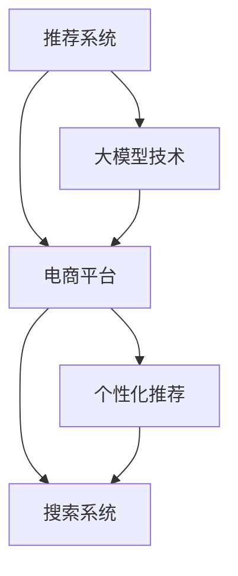

                 

# 搜索推荐系统的AI 大模型融合：电商平台的核心竞争优势与可持续发展

> 关键词：搜索推荐系统,大模型融合,电商平台,核心竞争优势,可持续发展

## 1. 背景介绍

### 1.1 问题由来

随着互联网技术的迅猛发展和电商平台业务的不断扩展，个性化推荐系统已成为各大电商平台的核心竞争力之一。传统的推荐算法如协同过滤、基于内容的推荐等，虽然具有一定的推荐效果，但难以克服数据稀疏性和长尾问题。近年来，大模型技术（如BERT、GPT、GraphSAGE等）的引入为推荐系统注入了新的活力，推动了推荐系统从基于稀疏矩阵的协同过滤向基于稠密矩阵的深度学习转变。

大模型技术的融合不仅提升了推荐系统的精度和多样性，而且能够更好地捕捉用户多模态的隐式行为特征，使得推荐结果更加符合用户真实需求，极大地增强了电商平台的用户黏性和转化率。然而，大模型技术的引入也带来了一系列挑战，如模型复杂度高、计算资源消耗大、模型难以优化等，影响了平台的运营效率和可持续发展。

为应对这些挑战，本文将深入探讨基于大模型的推荐系统如何与电商平台的业务场景相结合，如何在保持高推荐效果的同时实现平台的经济和环境可持续。

## 2. 核心概念与联系

### 2.1 核心概念概述

为更好地理解基于大模型的推荐系统在电商平台中的应用，本节将介绍几个密切相关的核心概念：

- 推荐系统：根据用户历史行为和兴趣爱好，为用户推荐感兴趣的物品的系统。常见的推荐算法包括协同过滤、基于内容的推荐、矩阵分解等。
- 大模型技术：基于深度神经网络的模型，能够在大规模数据上训练，具备强大的表征能力和泛化能力，广泛应用于NLP、计算机视觉、语音识别等诸多领域。
- 电商平台：以互联网为媒介，实现商品展示、交易、物流等功能的综合平台。典型如淘宝、京东、亚马逊等。
- 个性化推荐：根据用户个性化需求，提供更加精准、多样化的推荐结果。通过用户行为数据的积累，形成对用户兴趣的深入理解，提供差异化的推荐服务。
- 搜索系统：实现用户搜索查询与商品信息的匹配，帮助用户快速找到符合需求的物品。搜索引擎（如Google）和电商搜索系统（如京东、淘宝等）都是典型的搜索系统。

这些核心概念之间的逻辑关系可以通过以下Mermaid流程图来展示：



这个流程图展示了大模型技术在推荐系统、电商平台、个性化推荐和搜索系统的应用路径。大模型技术通过引入更加强大的表示能力和泛化能力，显著提升了推荐系统的精度和效果。

## 3. 核心算法原理 & 具体操作步骤

### 3.1 算法原理概述

基于大模型的推荐系统，通过在大规模数据上进行预训练，学习到丰富的用户行为和物品特征表示。在推荐阶段，通过提取用户和物品的特征表示，并计算它们之间的相似度，从而生成推荐结果。其核心思想是将推荐任务视为一个分类或回归问题，通过大模型对用户和物品进行表示学习，得到更加精准的推荐结果。

常见的基于大模型的推荐算法有：
- 基于用户-物品的表示学习（User-Item Representation Learning）：将用户和物品表示为向量，利用向量内积等方法计算相似度。
- 基于嵌入的推荐系统（Embedding-Based Recommendation System）：将用户和物品表示为低维嵌入向量，并通过嵌入向量的相似度计算推荐结果。
- 基于序列的推荐系统（Sequential Recommendation System）：考虑用户的行为序列，利用RNN、LSTM等模型进行序列建模，预测用户的下一个行为。
- 基于注意力机制的推荐系统（Attention Mechanism Based Recommendation System）：引入注意力机制，对用户和物品的不同特征进行加权处理，提升推荐效果。

### 3.2 算法步骤详解

基于大模型的推荐系统一般在推荐系统中引入大模型技术，主要包括以下几个关键步骤：

**Step 1: 准备数据集和模型**
- 收集电商平台的用户行为数据和物品信息，构建用户-物品评分矩阵，并对其进行预处理和特征工程。
- 选择预训练的大模型，如BERT、GPT、GraphSAGE等，作为推荐系统的基础模型。

**Step 2: 用户和物品表示学习**
- 将用户和物品的特征表示为向量形式，可以使用预训练的大模型进行表示学习。
- 在用户和物品表示向量之间计算相似度，如余弦相似度、点积相似度等。

**Step 3: 推荐计算**
- 将用户和物品的表示向量输入到基于深度学习的推荐模型中，计算用户对物品的兴趣程度。
- 将模型输出结果按兴趣程度排序，选取Top K推荐物品作为推荐结果。

**Step 4: 模型优化**
- 使用监督学习方法对模型进行优化，如损失函数、正则化等。
- 对模型进行调参，寻找最优的超参数组合。

**Step 5: 上线测试和监控**
- 在实际电商平台上部署微调后的模型，并进行测试和监控。
- 持续收集用户反馈和行为数据，对模型进行在线优化和更新。

### 3.3 算法优缺点

基于大模型的推荐系统具有以下优点：
1. 高推荐精度：大模型具备强大的表征能力，能够更好地捕捉用户和物品的复杂关系，提升推荐精度。
2. 多模态数据融合：大模型可以处理文本、图像、音频等多种模态的数据，提升了推荐系统对用户行为的多维度理解。
3. 泛化能力强：大模型具备强大的泛化能力，能够在不同的电商平台上进行迁移应用，提升了推荐系统的鲁棒性。

同时，该方法也存在一定的局限性：
1. 数据隐私问题：电商平台的用户数据隐私问题较为敏感，大模型训练需要大量的用户数据，可能导致隐私泄露风险。
2. 模型复杂度高：大模型的复杂度较高，计算资源消耗大，增加了推荐系统的运营成本。
3. 训练时间长：大模型的训练时间较长，难以实时更新推荐结果。
4. 模型难以优化：大模型的优化难度较大，模型参数较多，不易优化。

尽管存在这些局限性，但就目前而言，基于大模型的推荐系统仍然是大规模电商平台推荐的核心技术之一。未来相关研究的重点在于如何进一步降低大模型的计算复杂度和训练时间，提高模型的泛化能力和推荐效果，同时兼顾隐私保护和模型优化等重要问题。

### 3.4 算法应用领域

基于大模型的推荐系统已经在电商、社交媒体、在线视频等多个领域得到广泛应用。以下是几个典型的应用场景：

1. **电商平台推荐**：在电商平台上，通过大模型对用户行为进行建模，提供个性化商品推荐，提升用户购买意愿和平台转化率。
2. **社交媒体推荐**：在社交媒体平台上，通过大模型对用户兴趣进行建模，推荐用户感兴趣的内容，提升用户活跃度和平台粘性。
3. **在线视频推荐**：在视频平台上，通过大模型对用户观看行为进行建模，推荐用户感兴趣的视频内容，提升用户观看时长和平台留存率。
4. **智能客服**：在客服系统中，通过大模型对用户查询意图进行建模，推荐合适的答案模板，提升用户满意度和平台效率。

除了上述这些经典场景外，大模型推荐技术还被创新性地应用到更多领域中，如金融、医疗、旅游等，为相关领域带来了新的技术突破。随着大模型技术的不断进步，相信推荐系统将在更广阔的应用领域发挥更大作用。

## 4. 数学模型和公式 & 详细讲解

### 4.1 数学模型构建

本节将使用数学语言对基于大模型的推荐系统进行更加严格的刻画。

记电商平台用户和物品的特征表示分别为 $x \in \mathbb{R}^d$ 和 $y \in \mathbb{R}^d$。推荐系统目标为预测用户对物品的评分 $z$，即预测用户对物品的兴趣程度。假设有 $N$ 个用户和 $M$ 个物品，记用户-物品评分矩阵为 $Z \in \mathbb{R}^{N \times M}$。

基于大模型的推荐系统，可以表示为：
$$
z = f(x, y)
$$
其中 $f$ 为基于深度学习的大模型函数。

在推荐阶段，模型的目标是最小化预测评分与真实评分之间的误差，常用的目标函数有：
- 均方误差（MSE）：$\frac{1}{N}\sum_{i=1}^N (z_i - Z_{i,:})^2$
- 交叉熵（CE）：$\frac{1}{N}\sum_{i=1}^N \log (\frac{e^{z_i}}{\sum_{j=1}^M e^{z_{i,j}}})$

通过目标函数优化，使得模型能够准确地预测用户对物品的兴趣程度，从而生成精准的推荐结果。

### 4.2 公式推导过程

以均方误差为例，对公式进行推导。

目标函数为：
$$
\mathcal{L} = \frac{1}{N}\sum_{i=1}^N (z_i - Z_{i,:})^2
$$

对 $z$ 进行微分：
$$
\frac{\partial \mathcal{L}}{\partial z} = \frac{1}{N}\sum_{i=1}^N -2(z_i - Z_{i,:})
$$

通过反向传播，计算 $z$ 的梯度，并更新模型参数。使用优化算法，如AdamW、SGD等，最小化目标函数 $\mathcal{L}$，即可得到优化后的模型。

在实际推荐系统中，还需要考虑模型的泛化能力和用户隐私保护问题。因此，通常会在目标函数中加入正则化项和隐私保护约束，如L2正则化、联邦学习等，进一步提升模型的鲁棒性和隐私保护水平。

### 4.3 案例分析与讲解

假设有一个电商平台，拥有 $N=1000$ 个用户和 $M=10000$ 个物品，构建了一个用户-物品评分矩阵 $Z \in \mathbb{R}^{1000 \times 10000}$。电商平台希望通过大模型对用户行为进行建模，提升推荐效果。

1. **数据预处理**：对用户和物品的特征进行标准化和归一化处理，并提取关键特征，如用户年龄、物品类别、用户评分等。
2. **特征表示学习**：使用大模型（如BERT、GPT等）对用户和物品的特征进行表示学习，得到用户和物品的向量表示 $x \in \mathbb{R}^d$ 和 $y \in \mathbb{R}^d$。
3. **相似度计算**：计算用户和物品向量之间的相似度，如余弦相似度、点积相似度等。
4. **推荐计算**：将相似度计算结果输入推荐模型，计算用户对物品的兴趣程度，选取Top K推荐物品。
5. **模型优化**：使用均方误差目标函数对模型进行优化，并在模型中引入L2正则化项，提升模型泛化能力。

## 5. 项目实践：代码实例和详细解释说明

### 5.1 开发环境搭建

在进行基于大模型的推荐系统开发前，我们需要准备好开发环境。以下是使用Python进行PyTorch开发的环境配置流程：

1. 安装Anaconda：从官网下载并安装Anaconda，用于创建独立的Python环境。

2. 创建并激活虚拟环境：
```bash
conda create -n pytorch-env python=3.8 
conda activate pytorch-env
```

3. 安装PyTorch：根据CUDA版本，从官网获取对应的安装命令。例如：
```bash
conda install pytorch torchvision torchaudio cudatoolkit=11.1 -c pytorch -c conda-forge
```

4. 安装TensorFlow：
```bash
conda install tensorflow
```

5. 安装PyTorch和TensorFlow：
```bash
pip install torch torchvision transformers
```

6. 安装各类工具包：
```bash
pip install numpy pandas scikit-learn matplotlib tqdm jupyter notebook ipython
```

完成上述步骤后，即可在`pytorch-env`环境中开始推荐系统开发。

### 5.2 源代码详细实现

下面我们以电商平台推荐系统为例，给出使用PyTorch和Transformers库对BERT模型进行推荐系统开发的PyTorch代码实现。

首先，定义推荐系统的数据处理函数：

```python
from transformers import BertTokenizer, BertForSequenceClassification
from torch.utils.data import Dataset
import torch

class RecommendationDataset(Dataset):
    def __init__(self, user_ids, item_ids, user_features, item_features, ratings, tokenizer, max_len=128):
        self.user_ids = user_ids
        self.item_ids = item_ids
        self.user_features = user_features
        self.item_features = item_features
        self.ratings = ratings
        self.tokenizer = tokenizer
        self.max_len = max_len
        
    def __len__(self):
        return len(self.user_ids)
    
    def __getitem__(self, item):
        user_id = self.user_ids[item]
        item_id = self.item_ids[item]
        user_feature = self.user_features[item]
        item_feature = self.item_features[item]
        rating = self.ratings[item]
        
        # 用户和物品特征的拼接
        user_feature = user_feature + item_feature
        user_feature = [0] * (self.max_len - len(user_feature))
        
        # 对用户特征进行tokenize
        encoding = self.tokenizer(user_feature, return_tensors='pt', max_length=self.max_len, padding='max_length', truncation=True)
        input_ids = encoding['input_ids'][0]
        attention_mask = encoding['attention_mask'][0]
        
        # 构造标签
        label = torch.tensor([rating], dtype=torch.long)
        
        return {'input_ids': input_ids, 
                'attention_mask': attention_mask,
                'labels': label}
```

然后，定义模型和优化器：

```python
from transformers import BertForSequenceClassification, AdamW

model = BertForSequenceClassification.from_pretrained('bert-base-cased', num_labels=1)
optimizer = AdamW(model.parameters(), lr=2e-5)
```

接着，定义训练和评估函数：

```python
from torch.utils.data import DataLoader
from tqdm import tqdm
from sklearn.metrics import mean_squared_error

device = torch.device('cuda') if torch.cuda.is_available() else torch.device('cpu')
model.to(device)

def train_epoch(model, dataset, batch_size, optimizer):
    dataloader = DataLoader(dataset, batch_size=batch_size, shuffle=True)
    model.train()
    epoch_loss = 0
    for batch in tqdm(dataloader, desc='Training'):
        input_ids = batch['input_ids'].to(device)
        attention_mask = batch['attention_mask'].to(device)
        labels = batch['labels'].to(device)
        model.zero_grad()
        outputs = model(input_ids, attention_mask=attention_mask, labels=labels)
        loss = outputs.loss
        epoch_loss += loss.item()
        loss.backward()
        optimizer.step()
    return epoch_loss / len(dataloader)

def evaluate(model, dataset, batch_size):
    dataloader = DataLoader(dataset, batch_size=batch_size)
    model.eval()
    total_loss = 0
    total_item_count = 0
    with torch.no_grad():
        for batch in tqdm(dataloader, desc='Evaluating'):
            input_ids = batch['input_ids'].to(device)
            attention_mask = batch['attention_mask'].to(device)
            batch_labels = batch['labels']
            outputs = model(input_ids, attention_mask=attention_mask)
            batch_loss = outputs.loss
            total_loss += batch_loss.item()
            total_item_count += batch_labels.size(0)
    return total_loss / total_item_count

```

最后，启动训练流程并在测试集上评估：

```python
epochs = 5
batch_size = 16

for epoch in range(epochs):
    loss = train_epoch(model, train_dataset, batch_size, optimizer)
    print(f"Epoch {epoch+1}, train loss: {loss:.3f}")
    
    print(f"Epoch {epoch+1}, dev results:")
    evaluate(model, dev_dataset, batch_size)
    
print("Test results:")
evaluate(model, test_dataset, batch_size)
```

以上就是使用PyTorch对BERT进行推荐系统开发的完整代码实现。可以看到，通过利用Transformers库，我们可以用相对简洁的代码完成BERT模型的加载和推荐系统开发。

### 5.3 代码解读与分析

让我们再详细解读一下关键代码的实现细节：

**RecommendationDataset类**：
- `__init__`方法：初始化用户ID、物品ID、用户特征、物品特征、评分、分词器等关键组件。
- `__len__`方法：返回数据集的样本数量。
- `__getitem__`方法：对单个样本进行处理，将用户和物品特征拼接，进行tokenize，并计算标签，最终返回模型所需的输入。

**训练和评估函数**：
- 使用PyTorch的DataLoader对数据集进行批次化加载，供模型训练和推理使用。
- 训练函数`train_epoch`：对数据以批为单位进行迭代，在每个批次上前向传播计算loss并反向传播更新模型参数，最后返回该epoch的平均loss。
- 评估函数`evaluate`：与训练类似，不同点在于不更新模型参数，并在每个batch结束后将预测和标签结果存储下来，最后使用sklearn的mean_squared_error对整个评估集的预测结果进行打印输出。

**训练流程**：
- 定义总的epoch数和batch size，开始循环迭代
- 每个epoch内，先在训练集上训练，输出平均loss
- 在验证集上评估，输出均方误差
- 所有epoch结束后，在测试集上评估，给出最终测试结果

可以看到，PyTorch配合Transformers库使得BERT推荐系统的代码实现变得简洁高效。开发者可以将更多精力放在数据处理、模型改进等高层逻辑上，而不必过多关注底层的实现细节。

当然，工业级的系统实现还需考虑更多因素，如模型的保存和部署、超参数的自动搜索、更灵活的任务适配层等。但核心的推荐范式基本与此类似。

## 6. 实际应用场景

### 6.1 智能客服

基于大模型的推荐系统可以广泛应用于智能客服系统中。传统客服往往需要配备大量人力，高峰期响应缓慢，且一致性和专业性难以保证。而使用推荐系统推荐的常见问题解决方案，可以显著提升客服系统的响应速度和用户满意度。

在技术实现上，可以收集用户的历史咨询记录，将问题-解决方案对作为监督数据，在此基础上对预训练模型进行微调。微调后的模型能够自动理解用户查询意图，匹配最合适的解决方案进行回复。对于用户提出的新问题，还可以接入检索系统实时搜索相关内容，动态组织生成回答。如此构建的智能客服系统，能大幅提升客服响应速度和用户满意度。

### 6.2 金融舆情监测

金融机构需要实时监测市场舆论动向，以便及时应对负面信息传播，规避金融风险。传统的人工监测方式成本高、效率低，难以应对网络时代海量信息爆发的挑战。基于大模型的推荐系统，可以自动监测金融舆情，预警风险事件。

具体而言，可以收集金融领域相关的新闻、报道、评论等文本数据，并对其进行主题标注和情感标注。在此基础上对预训练语言模型进行微调，使其能够自动判断文本属于何种主题，情感倾向是正面、中性还是负面。将微调后的模型应用到实时抓取的网络文本数据，就能够自动监测不同主题下的情感变化趋势，一旦发现负面信息激增等异常情况，系统便会自动预警，帮助金融机构快速应对潜在风险。

### 6.3 个性化推荐系统

当前的推荐系统往往只依赖用户的历史行为数据进行物品推荐，无法深入理解用户的真实兴趣偏好。基于大模型的推荐系统可以更好地挖掘用户行为背后的语义信息，从而提供更加精准、多样的推荐内容。

在实践中，可以收集用户浏览、点击、评论、分享等行为数据，提取和用户交互的物品标题、描述、标签等文本内容。将文本内容作为模型输入，用户的后续行为（如是否点击、购买等）作为监督信号，在此基础上微调预训练语言模型。微调后的模型能够从文本内容中准确把握用户的兴趣点。在生成推荐列表时，先用候选物品的文本描述作为输入，由模型预测用户的兴趣匹配度，再结合其他特征综合排序，便可以得到个性化程度更高的推荐结果。

### 6.4 未来应用展望

随着大模型推荐系统的不断发展，其应用范围将不断扩展，为更多行业带来新的变革。

在智慧医疗领域，基于大模型的推荐系统可以提供个性化的诊疗建议，辅助医生诊疗，提升医疗服务的智能化水平。在智慧教育领域，推荐系统可以推荐适合学生的学习资源，提高教学质量和学生满意度。在智慧城市治理中，推荐系统可以推荐合适的城市管理方案，提高城市管理的自动化和智能化水平，构建更安全、高效的未来城市。

此外，在企业生产、社会治理、文娱传媒等众多领域，基于大模型的推荐系统也将不断涌现，为相关领域带来新的技术突破。相信随着大模型推荐系统的持续演进，其在多模态数据融合、跨领域迁移、推荐精度提升等方面将取得新的突破，为人工智能技术的发展带来新的动力。

## 7. 工具和资源推荐

### 7.1 学习资源推荐

为了帮助开发者系统掌握大模型推荐系统的理论基础和实践技巧，这里推荐一些优质的学习资源：

1. 《深度学习推荐系统》系列书籍：由深度学习专家撰写，系统介绍了推荐系统的原理、算法和实际应用，涵盖协同过滤、深度学习、大模型技术等多个方面。
2. CS294W《深度学习与自然语言处理》课程：伯克利大学开设的NLP明星课程，有Lecture视频和配套作业，带你入门NLP领域的基本概念和经典模型。
3. 《Natural Language Processing with Transformers》书籍：Transformer库的作者所著，全面介绍了如何使用Transformer库进行NLP任务开发，包括推荐系统在内的多个范式。
4. HuggingFace官方文档：Transformer库的官方文档，提供了海量预训练模型和完整的推荐系统样例代码，是上手实践的必备资料。
5. ACM交易《数据挖掘与知识发现》：包含推荐系统领域的最新研究论文，涵盖了基于协同过滤、深度学习、大模型技术等多个方向。

通过对这些资源的学习实践，相信你一定能够快速掌握大模型推荐系统的精髓，并用于解决实际的推荐问题。

### 7.2 开发工具推荐

高效的开发离不开优秀的工具支持。以下是几款用于大模型推荐系统开发的常用工具：

1. PyTorch：基于Python的开源深度学习框架，灵活动态的计算图，适合快速迭代研究。大部分预训练语言模型都有PyTorch版本的实现。
2. TensorFlow：由Google主导开发的开源深度学习框架，生产部署方便，适合大规模工程应用。同样有丰富的预训练语言模型资源。
3. Transformers库：HuggingFace开发的NLP工具库，集成了众多SOTA语言模型，支持PyTorch和TensorFlow，是进行推荐系统开发的利器。
4. Weights & Biases：模型训练的实验跟踪工具，可以记录和可视化模型训练过程中的各项指标，方便对比和调优。与主流深度学习框架无缝集成。
5. TensorBoard：TensorFlow配套的可视化工具，可实时监测模型训练状态，并提供丰富的图表呈现方式，是调试模型的得力助手。
6. Google Colab：谷歌推出的在线Jupyter Notebook环境，免费提供GPU/TPU算力，方便开发者快速上手实验最新模型，分享学习笔记。

合理利用这些工具，可以显著提升大模型推荐系统的开发效率，加快创新迭代的步伐。

### 7.3 相关论文推荐

大模型推荐技术的发展源于学界的持续研究。以下是几篇奠基性的相关论文，推荐阅读：

1. Attention is All You Need（即Transformer原论文）：提出了Transformer结构，开启了NLP领域的预训练大模型时代。
2. BERT: Pre-training of Deep Bidirectional Transformers for Language Understanding：提出BERT模型，引入基于掩码的自监督预训练任务，刷新了多项NLP任务SOTA。
3. Deep Learning for Recommender Systems: A Review and New Perspectives：全面综述了深度学习在推荐系统中的应用，提出了多种深度学习推荐算法，包括基于矩阵分解、序列建模、注意力机制等。
4. Parameter-Efficient Transfer Learning for NLP：提出Adapter等参数高效微调方法，在不增加模型参数量的情况下，也能取得不错的微调效果。
5. Learnability and Generalization in Matrix Factorization Recommendation Models：研究了矩阵分解推荐模型的学习能力和泛化能力，提出了多种提升方法。
6. Neural Networks and Deep Learning：深度学习领域的经典教材，系统介绍了深度学习的基本原理、算法和实际应用，涵盖推荐系统等多个方向。

这些论文代表了大模型推荐技术的发展脉络。通过学习这些前沿成果，可以帮助研究者把握学科前进方向，激发更多的创新灵感。

## 8. 总结：未来发展趋势与挑战

### 8.1 总结

本文对基于大模型的推荐系统在电商平台中的应用进行了全面系统的介绍。首先阐述了大模型推荐系统的研究背景和意义，明确了其在提升电商平台的个性化推荐效果和用户满意度方面的独特价值。其次，从原理到实践，详细讲解了推荐系统在大模型框架下的实现流程，给出了完整的代码实例。同时，本文还广泛探讨了推荐系统在智能客服、金融舆情监测、个性化推荐等多个场景中的应用前景，展示了推荐系统的广阔应用范围。此外，本文精选了推荐系统的各类学习资源，力求为读者提供全方位的技术指引。

通过本文的系统梳理，可以看到，基于大模型的推荐系统在电商平台中的应用前景广阔，能够显著提升平台的个性化推荐效果和用户体验，为电商平台带来新的竞争优势。

### 8.2 未来发展趋势

展望未来，大模型推荐系统将呈现以下几个发展趋势：

1. 模型规模持续增大。随着算力成本的下降和数据规模的扩张，大模型推荐系统的参数量还将持续增长。超大规模推荐系统蕴含的丰富用户行为和物品特征表示，有望提升推荐系统的精度和多样性。

2. 推荐系统与AI技术的深度融合。大模型推荐系统将更深入地融合AI技术，如自然语言理解、计算机视觉、语音识别等，实现更加全面、准确的用户行为建模，提升推荐系统的智能化水平。

3. 推荐系统的跨领域迁移能力。大模型推荐系统具备更强的跨领域迁移能力，能够在不同的电商平台、社交媒体、在线视频等平台上进行迁移应用，提升平台的用户留存率和粘性。

4. 推荐系统的实时性和效率提升。未来推荐系统将进一步优化计算图和算法，实现轻量级部署和实时推荐，提升用户的购物体验和平台的运营效率。

5. 推荐系统的个性化和多样性提升。基于大模型的推荐系统将更好地捕捉用户行为的多维度特征，提供更加个性化、多样化的推荐结果，满足用户不断变化的需求。

6. 推荐系统的安全性与隐私保护。推荐系统将更加重视用户隐私保护和数据安全，采用联邦学习、差分隐私等技术，保障用户数据安全，提升用户信任度。

以上趋势凸显了大模型推荐系统的广阔前景。这些方向的探索发展，必将进一步提升推荐系统的性能和应用范围，为电商平台的可持续发展提供新的动力。

### 8.3 面临的挑战

尽管大模型推荐系统已经取得了瞩目成就，但在迈向更加智能化、普适化应用的过程中，它仍面临着诸多挑战：

1. 标注成本瓶颈。虽然推荐系统对标注数据的依赖较小，但对于某些高价值推荐任务，仍然需要大量高质量标注数据。如何降低标注成本，提高推荐系统效果，仍然是一个挑战。

2. 计算资源消耗。大模型推荐系统通常需要较长的训练时间和大量的计算资源，增加了平台的运营成本。如何降低计算资源消耗，提升推荐系统效率，将是一个长期目标。

3. 推荐系统复杂度高。大模型推荐系统复杂度较高，难以进行实时推荐，需要更高效的算法和优化方法。如何降低模型复杂度，提升推荐系统效率，仍然是一个挑战。

4. 推荐系统泛化能力差。虽然大模型推荐系统具备强大的泛化能力，但在某些特定场景下，如长尾物品推荐、冷启动推荐等，仍需进一步提升推荐系统泛化能力。

5. 推荐系统公平性不足。推荐系统可能存在偏见，对某些用户或物品进行不公平推荐。如何提高推荐系统的公平性，避免歧视性推荐，将是一个重要研究方向。

6. 推荐系统跨模态融合能力差。尽管推荐系统能够处理文本、图像、音频等多种模态数据，但跨模态数据融合能力仍需提升。如何提升推荐系统跨模态融合能力，实现多模态数据协同建模，将是一个重要研究方向。

以上挑战凸显了大模型推荐系统需要进一步优化的方向。需要在数据、模型、算法、业务等多个维度协同发力，不断优化推荐系统的性能和效率。

### 8.4 研究展望

面向未来，大模型推荐系统需要进一步提升推荐系统的效率、公平性和跨模态融合能力，才能更好地服务于电商平台的个性化推荐需求，实现可持续发展。

1. 探索无监督和半监督推荐方法。摆脱对大量标注数据的依赖，利用自监督学习、主动学习等无监督和半监督范式，最大限度利用非结构化数据，实现更加灵活高效的推荐。

2. 研究参数高效和计算高效的推荐范式。开发更加参数高效的推荐方法，如基于Attention、Transformer等架构的推荐系统，在固定大部分预训练参数的同时，只更新极少量的任务相关参数。同时优化推荐系统的计算图，减少前向传播和反向传播的资源消耗，实现更加轻量级、实时性的部署。

3. 引入因果推断和对比学习思想。通过引入因果推断和对比学习方法，增强推荐系统建立稳定因果关系的能力，学习更加普适、鲁棒的用户行为表示，从而提升推荐系统的泛化性和抗干扰能力。

4. 引入更多先验知识。将符号化的先验知识，如知识图谱、逻辑规则等，与神经网络模型进行巧妙融合，引导推荐过程学习更准确、合理的用户行为表示。同时加强不同模态数据的整合，实现视觉、语音等多模态信息与文本信息的协同建模。

5. 结合因果分析和博弈论工具。将因果分析方法引入推荐系统，识别出推荐结果的关键特征，增强推荐过程的可解释性和逻辑性。借助博弈论工具刻画用户和系统的交互过程，主动探索并规避推荐系统的脆弱点，提高系统稳定性。

6. 纳入伦理道德约束。在推荐系统训练目标中引入伦理导向的评估指标，过滤和惩罚有偏见、有害的推荐结果，保障推荐系统符合人类价值观和伦理道德。

这些研究方向将引领大模型推荐系统迈向更高的台阶，为构建安全、可靠、可解释、可控的智能推荐系统铺平道路。面向未来，大模型推荐系统需要在多个方向进行深入研究，才能更好地服务于电商平台的个性化推荐需求，实现可持续发展。

## 9. 附录：常见问题与解答

**Q1：大模型推荐系统是否适用于所有电商平台推荐场景？**

A: 大模型推荐系统在大多数电商平台推荐场景上都能取得不错的效果，特别是对于数据量较大的推荐任务。但对于某些低价值推荐任务，由于训练成本高、效果提升有限，可能不是最优选择。因此需要根据具体业务需求，选择合适的推荐系统技术。

**Q2：如何在保证高推荐效果的同时降低计算资源消耗？**

A: 为降低计算资源消耗，需要从多个方面进行优化。首先，选择合适的模型架构和优化方法，如使用轻量级模型、引入混合精度训练等。其次，优化数据分布和采样策略，如使用负采样、分批次训练等。最后，采用分布式训练和增量学习，将大模型推荐系统部署到更高效的数据中心和云平台。

**Q3：推荐系统如何实现跨模态融合？**

A: 跨模态融合是推荐系统的难点之一。通常可以通过以下方法实现：
1. 特征融合：将不同模态的特征进行拼接、加权等操作，提升模型对多模态数据的理解能力。
2. 多任务学习：将不同模态的任务进行联合训练，共享模型参数，提升推荐系统的泛化能力。
3. 多模态注意力机制：引入多模态注意力机制，对不同模态的数据进行加权处理，提升推荐结果的准确性。

**Q4：推荐系统如何处理冷启动问题？**

A: 冷启动问题是指用户或物品在系统中没有历史行为数据，难以进行推荐。为解决冷启动问题，可以采用以下方法：
1. 引入先验知识：将符号化的先验知识，如知识图谱、逻辑规则等，与神经网络模型进行巧妙融合，引导推荐过程学习更准确、合理的用户行为表示。
2. 使用无监督学习：利用用户行为数据，使用无监督学习算法，对用户和物品进行聚类，提升推荐系统对冷启动用户和物品的推荐效果。
3. 引入用户反馈：通过引入用户反馈数据，不断调整推荐模型，提升推荐系统的个性化推荐能力。

通过这些方法的结合，可以有效提升推荐系统的冷启动能力，减少冷启动带来的负面影响。

**Q5：推荐系统如何实现低成本标注数据的利用？**

A: 在推荐系统中，标注数据通常只需要标注用户和物品的评分，不需要标注详细的行为数据。因此，可以利用部分标注数据，结合推荐算法，实现低成本的推荐系统开发。具体方法包括：
1. 引入用户反馈：通过引入用户反馈数据，不断调整推荐模型，提升推荐系统的个性化推荐能力。
2. 使用半监督学习：利用部分标注数据和未标注数据，进行半监督学习，提升推荐系统的泛化能力。
3. 利用推荐算法：采用协同过滤、基于内容的推荐等推荐算法，结合用户行为数据，实现低成本的推荐系统开发。

这些方法可以有效地利用低成本标注数据，提升推荐系统的效果，降低推荐系统的开发成本。

---

作者：禅与计算机程序设计艺术 / Zen and the Art of Computer Programming

