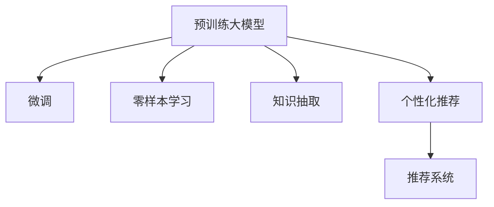

                 

# 搜索推荐系统的AI 大模型融合：电商平台的核心竞争力与可持续增长战略

> 关键词：搜索推荐系统, 电商平台, AI大模型融合, 核心竞争力, 可持续增长

## 1. 背景介绍

### 1.1 问题由来

随着互联网和电子商务的迅猛发展，电商平台已成为全球零售业的重要力量。在流量日益碎片化、竞争日趋白热化的今天，如何提升用户体验、增加用户粘性、提高转化率，成为电商企业持续发展的关键问题。

传统的电商平台主要依靠用户历史行为数据进行推荐，如浏览记录、购买记录等，但这种基于历史数据的推荐方法，存在显著的局限性：

1. **冷启动问题**：新用户或没有足够历史行为的用户，难以获得个性化推荐。
2. **数据稀疏性**：部分用户行为数据较少，导致推荐算法无法进行有效建模。
3. **用户行为变化**：用户兴趣和需求随时间变化，历史数据可能不再准确反映当前兴趣。

近年来，人工智能技术在电商领域的深度应用，特别是预训练大模型的兴起，为推荐系统带来了新的突破。基于预训练大模型的推荐系统能够更好地理解用户的长期行为和潜在需求，提供更个性化、更精准的推荐，从而大幅提升电商平台的运营效率和用户体验。

### 1.2 问题核心关键点

基于预训练大模型的推荐系统核心在于：通过大规模无标签数据预训练模型，学习到丰富的语言表示和知识，再通过微调或零样本学习等技术，适配特定的推荐任务，构建高泛化能力的推荐引擎。这种融合大模型的推荐系统，具有以下关键点：

1. **自监督学习**：通过大规模无标签文本数据预训练大模型，学习到通用的语言表示和知识。
2. **微调/零样本学习**：将预训练模型与特定推荐任务结合，通过微调或零样本学习技术，适配具体的推荐需求。
3. **知识抽取**：利用预训练大模型的语义理解能力，抽取商品描述、用户评论等文本信息，进行推荐。
4. **个性化推荐**：通过分析用户行为数据和商品属性信息，构建个性化推荐模型，提高用户满意度。
5. **持续优化**：不断收集用户反馈和行为数据，持续优化推荐模型，提升用户体验。

这些关键点构成了基于预训练大模型的推荐系统，为电商平台的推荐引擎提供了强大的技术支持。

### 1.3 问题研究意义

深入研究基于预训练大模型的推荐系统，对于提升电商平台的核心竞争力、实现可持续增长具有重要意义：

1. **提高用户满意度**：通过个性化推荐，满足用户多样化的需求，提升购物体验，增加用户粘性。
2. **提高转化率**：精准推荐提升用户的决策效率，降低购物成本，增加订单量。
3. **降低运营成本**：优化推荐算法，减少无效曝光和广告投入，提高广告ROI。
4. **促进创新**：预训练大模型为电商推荐系统提供了新的技术手段，促进了业务创新和流程优化。
5. **增强市场竞争力**：在激烈的市场竞争中，通过高效精准的推荐系统，实现差异化竞争，提升品牌影响力。

## 2. 核心概念与联系

### 2.1 核心概念概述

为了更好地理解基于预训练大模型的推荐系统，本节将介绍几个密切相关的核心概念：

- **预训练大模型(Pre-trained Large Model)**：如BERT、GPT等，通过大规模无标签文本数据预训练得到的模型，具备强大的语言表示和知识学习能力。
- **微调(Fine-tuning)**：将预训练模型适配特定任务，通过少量有标签数据优化模型参数，提高模型性能。
- **零样本学习(Zero-shot Learning)**：在未见过的任务上，通过预训练模型和任务描述，无需标注样本即能进行推荐或分类。
- **知识抽取(Knowledge Extraction)**：利用预训练模型理解文本信息，提取商品描述、用户评论中的关键特征，用于推荐决策。
- **个性化推荐(Personalized Recommendation)**：根据用户行为和商品属性，提供个性化推荐，提高推荐相关性和准确性。
- **推荐系统(Recommendation System)**：通过推荐算法，将商品推荐给用户，提升用户满意度，增加销售转化。

这些核心概念之间的逻辑关系可以通过以下Mermaid流程图来展示：



这个流程图展示了大模型的核心概念及其之间的关系：

1. 预训练大模型通过大规模无标签数据预训练，学习到通用的语言表示和知识。
2. 微调将预训练模型适配特定任务，通过少量有标签数据优化模型参数。
3. 零样本学习通过预训练模型和任务描述，无需标注样本即能进行推荐或分类。
4. 知识抽取利用预训练模型理解文本信息，提取关键特征用于推荐决策。
5. 个性化推荐根据用户行为和商品属性，提供个性化推荐，提高推荐相关性和准确性。
6. 推荐系统通过推荐算法，将商品推荐给用户，提升用户满意度，增加销售转化。

这些概念共同构成了基于预训练大模型的推荐系统，使得电商平台的推荐引擎具备强大的性能和灵活性。

## 3. 核心算法原理 & 具体操作步骤

### 3.1 算法原理概述

基于预训练大模型的推荐系统，本质上是利用大模型的语言表示和知识抽取能力，进行个性化推荐的过程。其核心思想是：通过大规模无标签数据预训练模型，学习到通用的语言表示和知识；再将预训练模型与特定推荐任务结合，通过微调或零样本学习技术，适配具体的推荐需求，构建高泛化能力的推荐引擎。

形式化地，假设预训练大模型为 $M_{\theta}$，其中 $\theta$ 为预训练得到的模型参数。给定电商平台的商品数据 $S$ 和用户行为数据 $U$，推荐系统的目标是找到最优参数 $\hat{\theta}$，使得推荐系统输出 $R$ 尽可能接近真实推荐 $R^*$。推荐系统的优化目标是最小化损失函数：

$$
\hat{\theta} = \mathop{\arg\min}_{\theta} \mathcal{L}(M_{\theta}, S, U, R^*)
$$

其中 $\mathcal{L}$ 为推荐系统损失函数，用于衡量推荐系统输出与真实推荐之间的差异。常见的推荐系统损失函数包括均方误差损失、交叉熵损失等。

通过梯度下降等优化算法，推荐系统不断更新模型参数 $\theta$，最小化损失函数 $\mathcal{L}$，使得推荐系统输出逼近真实推荐 $R^*$。由于 $\theta$ 已经通过预训练获得了较好的初始化，因此即便在数据量较少的推荐任务上，也能较快收敛到理想的模型参数 $\hat{\theta}$。

### 3.2 算法步骤详解

基于预训练大模型的推荐系统一般包括以下几个关键步骤：

**Step 1: 准备预训练模型和数据集**
- 选择合适的预训练大模型 $M_{\theta}$ 作为初始化参数，如BERT、GPT等。
- 准备电商平台的商品数据 $S$ 和用户行为数据 $U$，划分为训练集、验证集和测试集。一般要求商品数据和用户行为数据与预训练数据的分布不要差异过大。

**Step 2: 添加任务适配层**
- 根据推荐任务类型，在预训练模型顶层设计合适的输出层和损失函数。
- 对于推荐任务，通常使用点击率、转化率等作为预测目标，采用交叉熵损失函数。

**Step 3: 设置微调超参数**
- 选择合适的优化算法及其参数，如 AdamW、SGD 等，设置学习率、批大小、迭代轮数等。
- 设置正则化技术及强度，包括权重衰减、Dropout、Early Stopping等。
- 确定冻结预训练参数的策略，如仅微调顶层，或全部参数都参与微调。

**Step 4: 执行梯度训练**
- 将训练集数据分批次输入模型，前向传播计算损失函数。
- 反向传播计算参数梯度，根据设定的优化算法和学习率更新模型参数。
- 周期性在验证集上评估模型性能，根据性能指标决定是否触发 Early Stopping。
- 重复上述步骤直到满足预设的迭代轮数或 Early Stopping 条件。

**Step 5: 测试和部署**
- 在测试集上评估推荐系统的性能，对比微调前后的推荐效果。
- 使用推荐系统对新商品进行推荐，集成到实际的应用系统中。
- 持续收集新的用户反馈和行为数据，定期重新微调模型，以适应数据分布的变化。

以上是基于预训练大模型的推荐系统的一般流程。在实际应用中，还需要针对具体任务的特点，对微调过程的各个环节进行优化设计，如改进训练目标函数，引入更多的正则化技术，搜索最优的超参数组合等，以进一步提升推荐系统性能。

### 3.3 算法优缺点

基于预训练大模型的推荐系统具有以下优点：

1. **泛化能力强**：预训练大模型通过大规模无标签数据预训练，学习到丰富的语言表示和知识，对新商品和新用户具有良好的泛化能力。
2. **数据利用率高**：通过微调或零样本学习技术，在少量标注数据下也能快速适应特定推荐任务，提高数据利用率。
3. **效果显著**：在多个推荐任务上，基于大模型的推荐系统已经刷新了多项最先进的推荐效果指标。
4. **灵活性高**：大模型融合推荐系统具有较高的灵活性，可以适应多种推荐场景，如商品推荐、内容推荐等。

但同时，该方法也存在一些局限性：

1. **依赖标注数据**：尽管数据利用率高，但微调和零样本学习仍需一定量的标注数据，对标注数据的依赖仍然较高。
2. **计算资源需求高**：大模型的预训练和微调需要大量的计算资源，对硬件和软件环境的要求较高。
3. **模型复杂性高**：大模型的结构复杂，推理过程涉及大量的计算和内存操作，推理速度较慢。
4. **可解释性不足**：推荐系统的决策过程较为复杂，难以解释，不利于用户理解和信任。
5. **公平性问题**：由于数据偏见和算法设计，推荐系统可能存在不公平现象，如性别偏见、商品推荐偏见等。

尽管存在这些局限性，但就目前而言，基于预训练大模型的推荐系统仍然是推荐领域的重要范式。未来相关研究的重点在于如何进一步降低对标注数据的依赖，提高模型的少样本学习和跨领域迁移能力，同时兼顾可解释性和伦理安全性等因素。

### 3.4 算法应用领域

基于预训练大模型的推荐系统已经在电商、内容、社交等多个领域得到了广泛的应用，覆盖了几乎所有常见推荐场景，例如：

- 商品推荐：基于用户的浏览、点击、购买等行为数据，推荐商品给用户。
- 内容推荐：根据用户的历史阅读、观看等行为数据，推荐相关内容。
- 个性化广告推荐：将用户的兴趣标签和行为数据结合，推荐个性化的广告。
- 社交网络推荐：根据用户的社交关系和行为数据，推荐潜在的朋友或内容。
- 旅游推荐：根据用户的地理位置和偏好，推荐旅游目的地和景点。
- 金融推荐：根据用户的消费行为和财务数据，推荐金融产品或服务。

除了上述这些经典应用外，大模型的融合推荐系统还被创新性地应用到更多场景中，如智能客服、个性化学习、智慧健康等，为各行各业带来了新的突破。随着预训练模型和推荐技术的不断进步，相信推荐系统将在更广阔的应用领域大放异彩。

## 4. 数学模型和公式 & 详细讲解

### 4.1 数学模型构建

本节将使用数学语言对基于预训练大模型的推荐系统进行更加严格的刻画。

假设推荐系统的训练集为 $D=\{(x_i, y_i)\}_{i=1}^N, x_i \in S, y_i \in R$，其中 $x_i$ 为商品特征向量，$y_i$ 为用户的真实推荐 $R^*$。

定义推荐系统 $M_{\theta}$ 在数据样本 $(x,y)$ 上的损失函数为 $\ell(M_{\theta}(x),y)$，则在数据集 $D$ 上的经验风险为：

$$
\mathcal{L}(\theta) = \frac{1}{N}\sum_{i=1}^N \ell(M_{\theta}(x_i),y_i)
$$

其中 $\ell$ 为推荐系统损失函数，用于衡量推荐系统输出与真实推荐之间的差异。常见的推荐系统损失函数包括均方误差损失、交叉熵损失等。

通过梯度下降等优化算法，推荐系统不断更新模型参数 $\theta$，最小化损失函数 $\mathcal{L}$，使得推荐系统输出逼近真实推荐 $R^*$。由于 $\theta$ 已经通过预训练获得了较好的初始化，因此即便在数据量较少的推荐任务上，也能较快收敛到理想的模型参数 $\hat{\theta}$。

### 4.2 公式推导过程

以下我们以点击率预测为例，推导均方误差损失函数及其梯度的计算公式。

假设推荐系统 $M_{\theta}$ 在商品特征向量 $x_i$ 上的输出为 $\hat{R}_i=M_{\theta}(x_i)$，表示预测点击率。真实标签 $y_i$ 为0或1，表示用户是否点击商品。则均方误差损失函数定义为：

$$
\ell(M_{\theta}(x_i),y_i) = (\hat{R}_i - y_i)^2
$$

将其代入经验风险公式，得：

$$
\mathcal{L}(\theta) = \frac{1}{N}\sum_{i=1}^N (\hat{R}_i - y_i)^2
$$

根据链式法则，损失函数对参数 $\theta_k$ 的梯度为：

$$
\frac{\partial \mathcal{L}(\theta)}{\partial \theta_k} = -2\frac{1}{N}\sum_{i=1}^N \frac{\partial \hat{R}_i}{\partial \theta_k}(\hat{R}_i - y_i)
$$

其中 $\frac{\partial \hat{R}_i}{\partial \theta_k}$ 可进一步递归展开，利用自动微分技术完成计算。

在得到损失函数的梯度后，即可带入参数更新公式，完成推荐系统的迭代优化。重复上述过程直至收敛，最终得到适应电商推荐任务的最优模型参数 $\hat{\theta}$。

## 5. 项目实践：代码实例和详细解释说明

### 5.1 开发环境搭建

在进行推荐系统实践前，我们需要准备好开发环境。以下是使用Python进行PyTorch开发的环境配置流程：

1. 安装Anaconda：从官网下载并安装Anaconda，用于创建独立的Python环境。

2. 创建并激活虚拟环境：
```bash
conda create -n pytorch-env python=3.8 
conda activate pytorch-env
```

3. 安装PyTorch：根据CUDA版本，从官网获取对应的安装命令。例如：
```bash
conda install pytorch torchvision torchaudio cudatoolkit=11.1 -c pytorch -c conda-forge
```

4. 安装Transformers库：
```bash
pip install transformers
```

5. 安装各类工具包：
```bash
pip install numpy pandas scikit-learn matplotlib tqdm jupyter notebook ipython
```

完成上述步骤后，即可在`pytorch-env`环境中开始推荐系统实践。

### 5.2 源代码详细实现

下面我们以电商平台商品推荐系统为例，给出使用Transformers库对BERT模型进行推荐系统开发的PyTorch代码实现。

首先，定义推荐系统的数据处理函数：

```python
from transformers import BertTokenizer
from torch.utils.data import Dataset
import torch

class RecommendationDataset(Dataset):
    def __init__(self, items, features, labels, tokenizer, max_len=128):
        self.items = items
        self.features = features
        self.labels = labels
        self.tokenizer = tokenizer
        self.max_len = max_len
        
    def __len__(self):
        return len(self.items)
    
    def __getitem__(self, item):
        item_id = self.items[item]
        item_features = self.features[item]
        label = self.labels[item]
        
        features = []
        for feature in item_features:
            features.append(feature)
        features = [tokenizer.encode(feature, add_special_tokens=True, max_length=self.max_len, truncation=True)[0] for feature in features]
        
        input_ids = torch.tensor(features, dtype=torch.long)
        attention_mask = torch.tensor([1] * len(features), dtype=torch.long)
        labels = torch.tensor(label, dtype=torch.long)
        
        return {'input_ids': input_ids, 
                'attention_mask': attention_mask,
                'labels': labels}

# 标签与id的映射
tag2id = {'1': 1, '0': 0}
id2tag = {v: k for k, v in tag2id.items()}

# 创建dataset
tokenizer = BertTokenizer.from_pretrained('bert-base-cased')

train_dataset = RecommendationDataset(train_items, train_features, train_labels, tokenizer)
dev_dataset = RecommendationDataset(dev_items, dev_features, dev_labels, tokenizer)
test_dataset = RecommendationDataset(test_items, test_features, test_labels, tokenizer)
```

然后，定义模型和优化器：

```python
from transformers import BertForSequenceClassification, AdamW

model = BertForSequenceClassification.from_pretrained('bert-base-cased', num_labels=2)

optimizer = AdamW(model.parameters(), lr=2e-5)
```

接着，定义训练和评估函数：

```python
from torch.utils.data import DataLoader
from tqdm import tqdm
from sklearn.metrics import classification_report

device = torch.device('cuda') if torch.cuda.is_available() else torch.device('cpu')
model.to(device)

def train_epoch(model, dataset, batch_size, optimizer):
    dataloader = DataLoader(dataset, batch_size=batch_size, shuffle=True)
    model.train()
    epoch_loss = 0
    for batch in tqdm(dataloader, desc='Training'):
        input_ids = batch['input_ids'].to(device)
        attention_mask = batch['attention_mask'].to(device)
        labels = batch['labels'].to(device)
        model.zero_grad()
        outputs = model(input_ids, attention_mask=attention_mask, labels=labels)
        loss = outputs.loss
        epoch_loss += loss.item()
        loss.backward()
        optimizer.step()
    return epoch_loss / len(dataloader)

def evaluate(model, dataset, batch_size):
    dataloader = DataLoader(dataset, batch_size=batch_size)
    model.eval()
    preds, labels = [], []
    with torch.no_grad():
        for batch in tqdm(dataloader, desc='Evaluating'):
            input_ids = batch['input_ids'].to(device)
            attention_mask = batch['attention_mask'].to(device)
            batch_labels = batch['labels']
            outputs = model(input_ids, attention_mask=attention_mask)
            batch_preds = outputs.logits.argmax(dim=2).to('cpu').tolist()
            batch_labels = batch_labels.to('cpu').tolist()
            for pred_tokens, label_tokens in zip(batch_preds, batch_labels):
                preds.append(pred_tokens[:len(label_tokens)])
                labels.append(label_tokens)
                
    print(classification_report(labels, preds))
```

最后，启动训练流程并在测试集上评估：

```python
epochs = 5
batch_size = 16

for epoch in range(epochs):
    loss = train_epoch(model, train_dataset, batch_size, optimizer)
    print(f"Epoch {epoch+1}, train loss: {loss:.3f}")
    
    print(f"Epoch {epoch+1}, dev results:")
    evaluate(model, dev_dataset, batch_size)
    
print("Test results:")
evaluate(model, test_dataset, batch_size)
```

以上就是使用PyTorch对BERT进行商品推荐系统微调的完整代码实现。可以看到，得益于Transformers库的强大封装，我们可以用相对简洁的代码完成BERT模型的加载和微调。

### 5.3 代码解读与分析

让我们再详细解读一下关键代码的实现细节：

**RecommendationDataset类**：
- `__init__`方法：初始化商品特征、标签、分词器等关键组件。
- `__len__`方法：返回数据集的样本数量。
- `__getitem__`方法：对单个样本进行处理，将商品特征编码为token ids，标签编码为数字，并对其进行定长padding，最终返回模型所需的输入。

**标签与id的映射**：
- 定义了标签与数字id之间的映射关系，用于将token-wise的预测结果解码回真实的标签。

**训练和评估函数**：
- 使用PyTorch的DataLoader对数据集进行批次化加载，供模型训练和推理使用。
- 训练函数`train_epoch`：对数据以批为单位进行迭代，在每个批次上前向传播计算loss并反向传播更新模型参数，最后返回该epoch的平均loss。
- 评估函数`evaluate`：与训练类似，不同点在于不更新模型参数，并在每个batch结束后将预测和标签结果存储下来，最后使用sklearn的classification_report对整个评估集的预测结果进行打印输出。

**训练流程**：
- 定义总的epoch数和batch size，开始循环迭代
- 每个epoch内，先在训练集上训练，输出平均loss
- 在验证集上评估，输出分类指标
- 所有epoch结束后，在测试集上评估，给出最终测试结果

可以看到，PyTorch配合Transformers库使得BERT微调的代码实现变得简洁高效。开发者可以将更多精力放在数据处理、模型改进等高层逻辑上，而不必过多关注底层的实现细节。

当然，工业级的系统实现还需考虑更多因素，如模型的保存和部署、超参数的自动搜索、更灵活的任务适配层等。但核心的推荐范式基本与此类似。

## 6. 实际应用场景

### 6.1 智能客服系统

基于预训练大模型的推荐系统，可以广泛应用于智能客服系统的构建。传统客服往往需要配备大量人力，高峰期响应缓慢，且一致性和专业性难以保证。而使用基于预训练大模型的推荐系统，可以7x24小时不间断服务，快速响应客户咨询，用自然流畅的语言解答各类常见问题。

在技术实现上，可以收集企业内部的历史客服对话记录，将问题和最佳答复构建成监督数据，在此基础上对预训练推荐系统进行微调。微调后的推荐系统能够自动理解用户意图，匹配最合适的答复模板进行回复。对于客户提出的新问题，还可以接入检索系统实时搜索相关内容，动态组织生成回答。如此构建的智能客服系统，能大幅提升客户咨询体验和问题解决效率。

### 6.2 金融舆情监测

金融机构需要实时监测市场舆论动向，以便及时应对负面信息传播，规避金融风险。传统的人工监测方式成本高、效率低，难以应对网络时代海量信息爆发的挑战。基于预训练大模型的文本分类和情感分析技术，为金融舆情监测提供了新的解决方案。

具体而言，可以收集金融领域相关的新闻、报道、评论等文本数据，并对其进行主题标注和情感标注。在此基础上对预训练推荐系统进行微调，使其能够自动判断文本属于何种主题，情感倾向是正面、中性还是负面。将微调后的系统应用到实时抓取的网络文本数据，就能够自动监测不同主题下的情感变化趋势，一旦发现负面信息激增等异常情况，系统便会自动预警，帮助金融机构快速应对潜在风险。

### 6.3 个性化推荐系统

当前的推荐系统往往只依赖用户的历史行为数据进行推荐，无法深入理解用户的真实兴趣偏好。基于预训练大模型的推荐系统，可以更好地挖掘用户行为背后的语义信息，从而提供更个性化、更精准的推荐。

在实践中，可以收集用户浏览、点击、评论、分享等行为数据，提取和用户交互的物品标题、描述、标签等文本内容。将文本内容作为模型输入，用户的后续行为（如是否点击、购买等）作为监督信号，在此基础上微调预训练推荐系统。微调后的系统能够从文本内容中准确把握用户的兴趣点。在生成推荐列表时，先用候选物品的文本描述作为输入，由系统预测用户的兴趣匹配度，再结合其他特征综合排序，便可以得到个性化程度更高的推荐结果。

### 6.4 未来应用展望

随着预训练大模型的推荐系统不断发展，其在更多领域的应用前景也将更加广阔。

在智慧医疗领域，基于预训练大模型的医疗问答、病历分析、药物研发等应用将提升医疗服务的智能化水平，辅助医生诊疗，加速新药开发进程。

在智能教育领域，推荐系统可应用于作业批改、学情分析、知识推荐等方面，因材施教，促进教育公平，提高教学质量。

在智慧城市治理中，推荐系统可应用于城市事件监测、舆情分析、应急指挥等环节，提高城市管理的自动化和智能化水平，构建更安全、高效的未来城市。

此外，在企业生产、社会治理、文娱传媒等众多领域，基于预训练大模型的推荐系统也将不断涌现，为各行各业带来新的变革。相信随着技术的日益成熟，推荐系统必将成为人工智能落地应用的重要范式，推动人工智能技术在垂直行业的规模化落地。

## 7. 工具和资源推荐
### 7.1 学习资源推荐

为了帮助开发者系统掌握预训练大模型推荐系统的理论基础和实践技巧，这里推荐一些优质的学习资源：

1. 《深度学习与推荐系统》系列博文：由大模型技术专家撰写，深入浅出地介绍了深度学习在推荐系统中的应用，包括预训练大模型、微调技术等。

2. 《推荐系统算法与实践》课程：北京大学开设的推荐系统经典课程，详细讲解了推荐系统的原理和算法，结合实际案例进行分析。

3. 《深度学习与推荐系统》书籍：深入浅出地介绍了深度学习在推荐系统中的应用，包括预训练大模型、微调技术等，适合初学者入门。

4. 《推荐系统原理与算法》书籍：全面系统地介绍了推荐系统的原理和算法，结合大量实际案例进行讲解，适合进阶学习。

5. HuggingFace官方文档：推荐系统开发常用的Transformers库，提供了丰富的预训练模型和微调样例代码，是上手实践的必备资料。

通过对这些资源的学习实践，相信你一定能够快速掌握预训练大模型推荐系统的精髓，并用于解决实际的推荐问题。
###  7.2 开发工具推荐

高效的开发离不开优秀的工具支持。以下是几款用于推荐系统开发的常用工具：

1. PyTorch：基于Python的开源深度学习框架，灵活动态的计算图，适合快速迭代研究。大部分预训练语言模型都有PyTorch版本的实现。

2. TensorFlow：由Google主导开发的开源深度学习框架，生产部署方便，适合大规模工程应用。同样有丰富的预训练语言模型资源。

3. Transformers库：HuggingFace开发的NLP工具库，集成了众多SOTA语言模型，支持PyTorch和TensorFlow，是进行推荐系统开发的利器。

4. Weights & Biases：模型训练的实验跟踪工具，可以记录和可视化模型训练过程中的各项指标，方便对比和调优。与主流深度学习框架无缝集成。

5. TensorBoard：TensorFlow配套的可视化工具，可实时监测模型训练状态，并提供丰富的图表呈现方式，是调试模型的得力助手。

6. Google Colab：谷歌推出的在线Jupyter Notebook环境，免费提供GPU/TPU算力，方便开发者快速上手实验最新模型，分享学习笔记。

合理利用这些工具，可以显著提升推荐系统开发效率，加快创新迭代的步伐。

### 7.3 相关论文推荐

预训练大模型推荐系统的发展源于学界的持续研究。以下是几篇奠基性的相关论文，推荐阅读：

1. Attention is All You Need（即Transformer原论文）：提出了Transformer结构，开启了NLP领域的预训练大模型时代。

2. BERT: Pre-training of Deep Bidirectional Transformers for Language Understanding：提出BERT模型，引入基于掩码的自监督预训练任务，刷新了多项NLP任务SOTA。

3. Deep Neural Networks for Large-Scale Recommender Systems：提出神经网络推荐系统的经典算法，奠定了深度学习在推荐系统中的基础。

4. Deep Attention for Recommender Networks：引入注意力机制，提高了推荐系统的泛化能力和效果。

5. Neural Collaborative Filtering：提出基于神经网络的协同过滤算法，在推荐系统中取得了很好的效果。

6. Adaptive Recommendation Models：提出自适应推荐模型，通过在线学习更新模型参数，提高了推荐系统的实时性和适应性。

这些论文代表了大模型推荐系统的发展脉络。通过学习这些前沿成果，可以帮助研究者把握学科前进方向，激发更多的创新灵感。

## 8. 总结：未来发展趋势与挑战

### 8.1 总结

本文对基于预训练大模型的推荐系统进行了全面系统的介绍。首先阐述了推荐系统的发展背景和意义，明确了预训练大模型推荐系统的核心思想和技术路线。其次，从原理到实践，详细讲解了推荐系统的数学原理和关键步骤，给出了推荐系统开发的完整代码实例。同时，本文还广泛探讨了推荐系统在电商、金融、社交等多个领域的应用前景，展示了预训练大模型的强大性能。

通过本文的系统梳理，可以看到，基于预训练大模型的推荐系统为电商平台的推荐引擎提供了强大的技术支持。该系统通过微调或零样本学习技术，在少量标注数据下也能快速适应特定推荐任务，提高数据利用率，优化推荐效果。未来，伴随预训练语言模型和推荐技术的不断进步，基于大模型的推荐系统必将在更多领域得到应用，为各行各业带来新的变革。

### 8.2 未来发展趋势

展望未来，预训练大模型的推荐系统将呈现以下几个发展趋势：

1. **数据利用率更高**：通过微调或零样本学习技术，在少量标注数据下也能快速适应特定推荐任务，提高数据利用率。
2. **个性化推荐更精准**：利用预训练大模型的语言表示和知识抽取能力，提供更个性化、更精准的推荐，提升用户满意度。
3. **实时性更强**：通过在线学习等技术，推荐系统能够实时更新模型参数，提高推荐相关性和准确性。
4. **跨领域迁移能力更强**：预训练大模型具备更强的跨领域迁移能力，能够适应更多推荐场景，如商品推荐、内容推荐等。
5. **知识融合更全面**：通过与外部知识库、规则库等专家知识的结合，实现更全面、准确的信息整合，提高推荐模型的性能。

这些趋势凸显了预训练大模型推荐系统的广阔前景。这些方向的探索发展，必将进一步提升推荐系统性能，拓展应用范围，为各行各业带来新的突破。

### 8.3 面临的挑战

尽管预训练大模型的推荐系统已经取得了瞩目成就，但在迈向更加智能化、普适化应用的过程中，它仍面临着诸多挑战：

1. **标注成本瓶颈**：尽管数据利用率高，但微调和零样本学习仍需一定量的标注数据，对标注数据的依赖仍然较高。如何进一步降低微调对标注样本的依赖，将是一大难题。
2. **计算资源需求高**：大模型的预训练和微调需要大量的计算资源，对硬件和软件环境的要求较高。
3. **模型复杂性高**：大模型的结构复杂，推理过程涉及大量的计算和内存操作，推理速度较慢。
4. **可解释性不足**：推荐系统的决策过程较为复杂，难以解释，不利于用户理解和信任。
5. **公平性问题**：由于数据偏见和算法设计，推荐系统可能存在不公平现象，如性别偏见、商品推荐偏见等。

尽管存在这些挑战，但就目前而言，基于预训练大模型的推荐系统仍然是推荐领域的重要范式。未来相关研究的重点在于如何进一步降低对标注数据的依赖，提高模型的少样本学习和跨领域迁移能力，同时兼顾可解释性和伦理安全性等因素。

### 8.4 研究展望

面对预训练大模型推荐系统所面临的挑战，未来的研究需要在以下几个方面寻求新的突破：

1. **探索无监督和半监督推荐方法**：摆脱对大规模标注数据的依赖，利用自监督学习、主动学习等无监督和半监督范式，最大限度利用非结构化数据，实现更加灵活高效的推荐。
2. **研究参数高效和计算高效的推荐范式**：开发更加参数高效的推荐方法，在固定大部分预训练参数的同时，只更新极少量的任务相关参数。同时优化推荐模型的计算图，减少前向传播和反向传播的资源消耗，实现更加轻量级、实时性的部署。
3. **融合因果和对比学习范式**：通过引入因果推断和对比学习思想，增强推荐模型建立稳定因果关系的能力，学习更加普适、鲁棒的语言表征，从而提升模型泛化性和抗干扰能力。
4. **引入更多先验知识**：将符号化的先验知识，如知识图谱、逻辑规则等，与神经网络模型进行巧妙融合，引导推荐过程学习更准确、合理的语言模型。同时加强不同模态数据的整合，实现视觉、语音等多模态信息与文本信息的协同建模。
5. **结合因果分析和博弈论工具**：将因果分析方法引入推荐模型，识别出模型决策的关键特征，增强输出解释的因果性和逻辑性。借助博弈论工具刻画人机交互过程，主动探索并规避模型的脆弱点，提高系统稳定性。
6. **纳入伦理道德约束**：在模型训练目标中引入伦理导向的评估指标，过滤和惩罚有偏见、有害的输出倾向。同时加强人工干预和审核，建立模型行为的监管机制，确保输出符合人类价值观和伦理道德。

这些研究方向的探索，必将引领预训练大模型推荐系统迈向更高的台阶，为构建安全、可靠、可解释、可控的智能系统铺平道路。面向未来，预训练大模型推荐技术还需要与其他人工智能技术进行更深入的融合，如知识表示、因果推理、强化学习等，多路径协同发力，共同推动自然语言理解和智能交互系统的进步。只有勇于创新、敢于突破，才能不断拓展推荐模型的边界，让智能技术更好地造福人类社会。

## 9. 附录：常见问题与解答

**Q1：预训练大模型推荐系统是否适用于所有推荐场景？**

A: 预训练大模型推荐系统在大多数推荐场景上都能取得不错的效果，特别是对于数据量较小的任务。但对于一些特定领域的任务，如医学、法律等，仅仅依靠通用语料预训练的模型可能难以很好地适应。此时需要在特定领域语料上进一步预训练，再进行微调，才能获得理想效果。此外，对于一些需要时效性、个性化很强的任务，如对话、推荐等，推荐方法也需要针对性的改进优化。

**Q2：微调过程中如何选择合适的学习率？**

A: 微调的学习率一般要比预训练时小1-2个数量级，如果使用过大的学习率，容易破坏预训练权重，导致过拟合。一般建议从1e-5开始调参，逐步减小学习率，直至收敛。也可以使用warmup策略，在开始阶段使用较小的学习率，再逐渐过渡到预设值。需要注意的是，不同的优化器(如AdamW、Adafactor等)以及不同的学习率调度策略，可能需要设置不同的学习率阈值。

**Q3：推荐系统在落地部署时需要注意哪些问题？**

A: 将推荐系统转化为实际应用，还需要考虑以下因素：
1. 模型裁剪：去除不必要的层和参数，减小模型尺寸，加快推理速度
2. 量化加速：将浮点模型转为定点模型，压缩存储空间，提高计算效率
3. 服务化封装：将模型封装为标准化服务接口，便于集成调用
4. 弹性伸缩：根据请求流量动态调整资源配置，平衡服务质量和成本
5. 监控告警：实时采集系统指标，设置异常告警阈值，确保服务稳定性
6. 安全防护：采用访问鉴权、数据脱敏等措施，保障数据和模型安全

预训练大模型推荐系统为电商平台的推荐引擎提供了强大的技术支持。但如何将强大的性能转化为稳定、高效、安全的业务价值，还需要工程实践的不断打磨。唯有从数据、算法、工程、业务等多个维度协同发力，才能真正实现人工智能技术在垂直行业的规模化落地。总之，推荐系统需要开发者根据具体任务，不断迭代和优化模型、数据和算法，方能得到理想的效果。

---

作者：禅与计算机程序设计艺术 / Zen and the Art of Computer Programming

