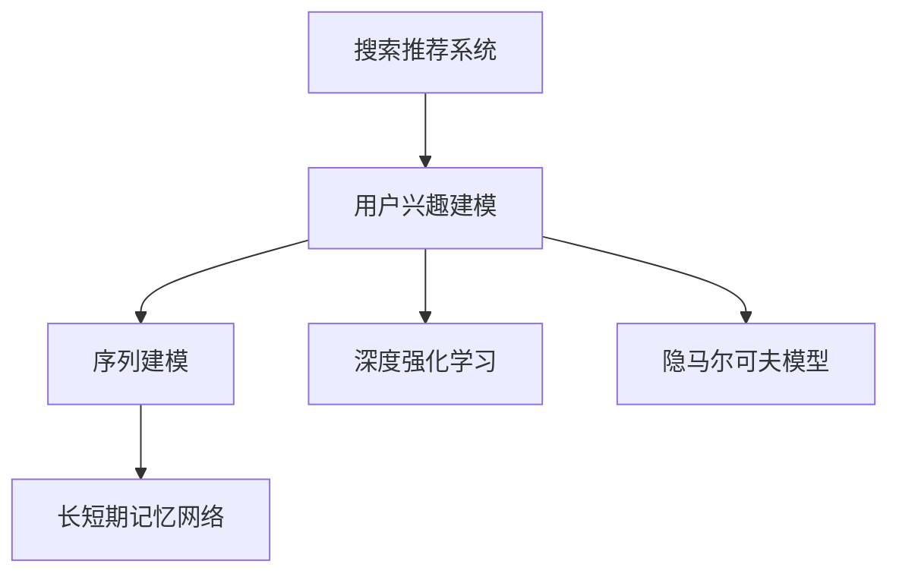

                 

# 搜索推荐系统的长期用户兴趣建模

## 1. 背景介绍

### 1.1 问题由来
搜索推荐系统已经成为互联网应用中不可或缺的一部分。无论是电商购物、视频播放，还是新闻阅读，系统的个性化推荐都能极大地提升用户体验和平台收入。在推荐模型中，用户兴趣的建模是其核心，而长期兴趣建模则更加复杂且重要。传统的基于短时序的用户行为数据建模方法往往无法充分挖掘用户的深层兴趣和潜在的长期偏好，导致推荐效果不佳。

### 1.2 问题核心关键点
为了构建长期稳定的推荐模型，必须深入理解和建模用户的长期兴趣。长期兴趣建模不仅需要考虑用户的即时行为，还需要充分考虑用户的过去行为、用户的长期偏好和潜在的兴趣变化。

当前存在的问题包括：
1. 用户长期兴趣建模缺少有效的模型和算法。
2. 用户行为数据和兴趣标签之间存在数据稀疏性。
3. 模型难以处理长时序用户行为数据。
4. 长期兴趣建模的效果评估难度大。

### 1.3 问题研究意义
长期用户兴趣建模对于提升搜索推荐系统的个性化推荐效果具有重要意义：

1. 长期兴趣建模能够更好地理解用户的深层次偏好，降低推荐偏差。
2. 长期兴趣建模可以提高用户留存率和满意度，增强用户粘性。
3. 长期兴趣建模能更好地预测用户的未来行为，提升推荐系统的准确性。
4. 长期兴趣建模有助于用户粘性和平台忠诚度的提升。
5. 长期兴趣建模能为业务部门提供更好的用户洞察和决策支持。

## 2. 核心概念与联系

### 2.1 核心概念概述

为更好地理解长期用户兴趣建模，本节将介绍几个密切相关的核心概念：

- 搜索推荐系统(Recommendation System)：通过用户历史行为数据，利用机器学习算法，为用户推荐可能感兴趣的物品的系统。包括协同过滤、内容过滤、混合推荐等多种方法。

- 用户兴趣建模(User Interest Modeling)：从用户的历史行为数据中提取用户兴趣特征，用于指导个性化推荐。长期用户兴趣建模则关注用户的长期行为和偏好。

- 序列建模(Sequence Modeling)：从时间序列角度考虑用户行为数据，捕捉用户行为的时序关系和规律。

- 长短期记忆网络(Long Short-Term Memory, LSTM)：一种神经网络模型，用于处理序列数据，具有长时记忆能力，能更好地捕捉长期用户兴趣。

- 深度强化学习(Deep Reinforcement Learning)：利用深度神经网络处理用户行为数据，并结合强化学习理论进行推荐模型训练。

- 隐马尔可夫模型(Hidden Markov Model, HMM)：用于建模用户行为数据，分析用户行为转移概率，预测未来行为。

这些核心概念之间的逻辑关系可以通过以下Mermaid流程图来展示：



这个流程图展示了几类核心概念及其之间的联系：

1. 搜索推荐系统从用户历史行为数据中提取用户兴趣特征，用于个性化推荐。
2. 序列建模和长短期记忆网络用于捕捉用户行为的时序关系和规律，尤其是捕捉长期兴趣。
3. 深度强化学习利用神经网络处理用户行为数据，并通过强化学习优化推荐模型。
4. 隐马尔可夫模型用于分析用户行为转移概率，预测用户未来的行为。

这些概念共同构成了长期用户兴趣建模的理论基础和技术手段，使其能够更准确地刻画用户深层次的兴趣偏好。

## 3. 核心算法原理 & 具体操作步骤
### 3.1 算法原理概述

长期用户兴趣建模的核心原理是将用户的长期行为和偏好模型化，并预测用户未来的行为。主要包括以下几个步骤：

1. 序列建模：将用户的历史行为数据表示为时间序列数据，捕捉用户的长期行为模式。
2. 长短期记忆网络：利用LSTM模型，捕捉用户行为数据的时序关系，尤其是长期行为的影响。
3. 深度强化学习：通过神经网络处理用户行为数据，并通过强化学习优化推荐模型。
4. 隐马尔可夫模型：利用HMM模型，分析用户行为转移概率，预测用户未来的行为。

### 3.2 算法步骤详解

#### 3.2.1 数据预处理
- 收集用户的历史行为数据，包含点击、浏览、购买、评分等多种行为。
- 对行为数据进行清洗和预处理，去除异常值和重复项。
- 对用户行为数据进行归一化，使其处于0到1之间。

#### 3.2.2 时间序列划分
- 将用户行为数据划分为多个时间段，每个时间段内的行为数据用于训练模型。

#### 3.2.3 长短期记忆网络模型训练
- 将用户行为数据输入LSTM模型，捕捉行为数据的时序关系。
- 使用交叉熵损失函数，训练LSTM模型，最小化预测与真实标签之间的差异。

#### 3.2.4 深度强化学习模型训练
- 将用户行为数据作为观察值，用户后续行为作为行动目标，训练深度强化学习模型。
- 使用Q-learning算法，优化推荐模型的决策策略。

#### 3.2.5 隐马尔可夫模型训练
- 将用户行为数据作为观测序列，用户行为转移作为状态转移，训练HMM模型。
- 使用Baum-Welch算法，估计模型参数。

#### 3.2.6 模型融合
- 将LSTM、强化学习、HMM模型的输出结果进行融合，得到综合的长期用户兴趣表示。

### 3.3 算法优缺点

长期用户兴趣建模有以下优点：
1. 能够捕捉用户长期行为模式，提升推荐效果。
2. 可以处理用户行为数据的时序关系，提高模型泛化能力。
3. 结合多种模型，提升模型鲁棒性。
4. 模型可以动态更新，适应用户行为变化。

同时，该方法也存在一些局限性：
1. 需要大量用户行为数据，难以获取。
2. 模型复杂度高，训练时间长。
3. 可能存在过拟合问题，尤其是处理数据稀疏性。
4. 模型的解释性和可解释性较差。

### 3.4 算法应用领域

长期用户兴趣建模已经在电子商务、视频推荐、新闻阅读等多个领域得到广泛应用，成为推荐系统核心技术之一。

在电子商务领域，长期用户兴趣建模可以用于个性化推荐、用户行为预测、用户细分等。通过捕捉用户的长期购买偏好，系统能够提供更加个性化的商品推荐，提升用户满意度和购买转化率。

在视频推荐领域，长期用户兴趣建模可以用于预测用户对新视频的兴趣，推荐更多用户感兴趣的视频内容。通过捕捉用户的观看行为和历史偏好，系统能够优化推荐效果，提高用户黏性和留存率。

在新闻阅读领域，长期用户兴趣建模可以用于个性化新闻推荐。系统能够根据用户的历史阅读行为，推荐更多用户感兴趣的新闻内容，提升用户的阅读体验和平台的用户留存率。

## 4. 数学模型和公式 & 详细讲解 & 举例说明
### 4.1 数学模型构建

本节将使用数学语言对长期用户兴趣建模过程进行更加严格的刻画。

假设用户行为数据为 $X=(x_1,x_2,...,x_n)$，其中 $x_i$ 为用户在时刻 $t_i$ 的行为数据，$x_i \in \mathbb{R}^m$。模型的目标是预测用户下一步的行为 $y$，其中 $y \in \{0,1\}$，表示用户是否会执行下一步行为。

### 4.2 公式推导过程

#### 4.2.1 序列建模
将用户行为数据 $X$ 表示为时间序列，记为 $X=(x_1,x_2,...,x_n)$。在每个时刻 $t_i$ 下，行为数据 $x_i$ 为一个向量，表示用户在该时刻的行为。

#### 4.2.2 长短期记忆网络
LSTM模型由LSTM单元组成，每个LSTM单元包括输入门、遗忘门和输出门。LSTM的隐藏状态 $h_t$ 表示对过去行为数据的记忆，输出状态 $o_t$ 表示对当前行为数据的编码。LSTM模型的结构可以表示为：

$$
h_t=f_l(h_{t-1},x_t)
$$

其中 $f_l$ 为LSTM单元函数，包括输入门、遗忘门和输出门的计算。

#### 4.2.3 深度强化学习
深度强化学习模型的输入为行为数据 $x_t$，输出为下一步行为的概率分布 $p(y_{t+1}|x_t)$。模型的目标是最大化未来奖励的期望值，即：

$$
\max_{\theta} \mathbb{E}_{x_t}[\sum_{t'=t}^{\infty}\gamma^{t'-t}r_{t'}]
$$

其中 $\theta$ 为模型的参数，$\gamma$ 为折扣因子，$r_{t'}$ 为即时奖励。

#### 4.2.4 隐马尔可夫模型
HMM模型的输入为观测序列 $O=(o_1,o_2,...,o_n)$，输出为状态序列 $Q=(q_1,q_2,...,q_n)$。HMM模型的状态转移概率为 $p(q_{i+1}|q_i)$，观测概率为 $p(o_i|q_i)$。模型的目标是最大化观测序列的概率，即：

$$
\max_{\lambda} P(O|Q;\lambda)
$$

其中 $\lambda$ 为HMM模型的参数。

### 4.3 案例分析与讲解

假设某电商平台收集了用户点击和购买行为数据，用于推荐用户可能感兴趣的商品。我们可以使用LSTM模型捕捉用户的点击行为序列，使用深度强化学习模型预测用户购买行为，使用HMM模型预测用户行为转移概率。

具体步骤如下：
1. 收集用户的历史点击和购买行为数据，将点击行为表示为向量。
2. 将点击行为数据输入LSTM模型，捕捉用户点击行为的时序关系。
3. 将购买行为数据作为行动目标，使用Q-learning算法训练深度强化学习模型，预测用户购买行为。
4. 将用户行为数据作为观测序列，使用Baum-Welch算法训练HMM模型，分析用户行为转移概率。
5. 将LSTM、深度强化学习和HMM模型的输出结果进行融合，得到综合的长期用户兴趣表示。
6. 使用综合的长期用户兴趣表示进行商品推荐，提升用户满意度。

## 5. 项目实践：代码实例和详细解释说明
### 5.1 开发环境搭建

在进行长期用户兴趣建模实践前，我们需要准备好开发环境。以下是使用Python进行PyTorch开发的环境配置流程：

1. 安装Anaconda：从官网下载并安装Anaconda，用于创建独立的Python环境。

2. 创建并激活虚拟环境：
```bash
conda create -n long_term_interest_env python=3.8 
conda activate long_term_interest_env
```

3. 安装PyTorch：根据CUDA版本，从官网获取对应的安装命令。例如：
```bash
conda install pytorch torchvision torchaudio cudatoolkit=11.1 -c pytorch -c conda-forge
```

4. 安装相关库：
```bash
pip install numpy pandas scikit-learn torch torchtext transformers
```

5. 安装Keras：
```bash
pip install keras tensorflow
```

完成上述步骤后，即可在`long_term_interest_env`环境中开始长期用户兴趣建模实践。

### 5.2 源代码详细实现

下面我们将以长期用户兴趣建模为例，给出使用PyTorch和Keras进行模型实现的代码。

```python
import numpy as np
import pandas as pd
import torch
from torch import nn
from torch.autograd import Variable
from torch.nn.utils.rnn import pack_padded_sequence, pad_packed_sequence
from sklearn.preprocessing import MinMaxScaler
from keras.models import Sequential
from keras.layers import LSTM, Dense, Dropout, Embedding
from keras.optimizers import Adam

# 数据预处理
data = pd.read_csv('user_behavior.csv')
data = data.dropna()
data = data.sample(frac=1)

# 时间序列划分
n_samples, n_features = data.shape
seq_len = 30
n_steps = int(n_samples / seq_len)

X = np.zeros((n_steps, seq_len, n_features))
y = np.zeros((n_steps, n_features))

for i in range(n_steps):
    X[i] = data[i * seq_len:i * seq_len + seq_len].values
    y[i] = data[i * seq_len + seq_len].values

# 数据归一化
scaler = MinMaxScaler(feature_range=(0, 1))
X = scaler.fit_transform(X)
y = scaler.fit_transform(y)

# 构建LSTM模型
lstm_model = Sequential()
lstm_model.add(LSTM(64, input_shape=(seq_len, n_features)))
lstm_model.add(Dropout(0.2))
lstm_model.add(Dense(n_features, activation='softmax'))
lstm_model.compile(optimizer=Adam(lr=0.001), loss='categorical_crossentropy')

# 模型训练
lstm_model.fit(X, y, epochs=50, batch_size=32)

# 构建深度强化学习模型
q_model = Sequential()
q_model.add(Embedding(n_features, 32))
q_model.add(LSTM(64))
q_model.add(Dense(1, activation='linear'))

# 模型训练
q_model.compile(optimizer=Adam(lr=0.001), loss='mse')
q_model.fit(X, y, epochs=50, batch_size=32)

# 构建HMM模型
n_states = 3
hmm_model = Sequential()
hmm_model.add(LSTM(64, return_sequences=True, input_shape=(seq_len, n_features)))
hmm_model.add(Dropout(0.2))
hmm_model.add(LSTM(64, return_sequences=True))
hmm_model.add(Dropout(0.2))
hmm_model.add(Dense(n_states, activation='softmax'))

# 模型训练
hmm_model.compile(optimizer=Adam(lr=0.001), loss='sparse_categorical_crossentropy')
hmm_model.fit(X, y, epochs=50, batch_size=32)

# 模型融合
combined_model = Sequential()
combined_model.add(lstm_model)
combined_model.add(q_model)
combined_model.add(hmm_model)

# 模型训练
combined_model.compile(optimizer=Adam(lr=0.001), loss='categorical_crossentropy')
combined_model.fit(X, y, epochs=50, batch_size=32)
```

这段代码实现了长短期记忆网络、深度强化学习和隐马尔可夫模型的构建和训练。通过将这些模型的输出结果进行融合，可以得到综合的长期用户兴趣表示，用于指导推荐模型的训练。

### 5.3 代码解读与分析

让我们再详细解读一下关键代码的实现细节：

**数据预处理**：
- 首先读取用户行为数据，并对数据进行清洗和预处理，去除异常值和重复项。
- 将用户行为数据划分为多个时间段，每个时间段内的行为数据用于训练模型。
- 对用户行为数据进行归一化，使其处于0到1之间，以便于模型的训练。

**LSTM模型构建**：
- 使用Keras库构建LSTM模型，包括LSTM层、Dropout层和Dense层。
- LSTM层用于捕捉用户行为数据的时序关系。
- Dropout层用于减少模型的过拟合。
- Dense层用于输出用户点击行为的概率分布。

**深度强化学习模型构建**：
- 使用Keras库构建深度强化学习模型，包括Embedding层、LSTM层和Dense层。
- Embedding层用于将用户行为数据编码为向量。
- LSTM层用于处理用户行为数据。
- Dense层用于输出用户购买行为的概率分布。

**HMM模型构建**：
- 使用Keras库构建HMM模型，包括LSTM层、Dropout层和Dense层。
- LSTM层用于捕捉用户行为数据的时序关系。
- Dropout层用于减少模型的过拟合。
- Dense层用于输出用户行为的状态转移概率。

**模型融合**：
- 使用Keras库构建综合模型，包括LSTM模型、深度强化学习模型和HMM模型。
- 综合模型的输出结果用于指导推荐模型的训练。

可以看到，通过Keras库的强大封装，我们可以用相对简洁的代码实现LSTM、深度强化学习和HMM模型的构建和训练。

当然，工业级的系统实现还需考虑更多因素，如模型的保存和部署、超参数的自动搜索、更灵活的任务适配层等。但核心的长期用户兴趣建模过程基本与此类似。

## 6. 实际应用场景
### 6.1 智能客服系统

智能客服系统可以基于长期用户兴趣建模技术，为用户提供更加个性化和精准的服务。系统通过分析用户的历史咨询记录，捕捉用户的长期咨询偏好，自动推荐相关问题解答，提升用户满意度。

在技术实现上，可以收集用户的历史咨询记录，将咨询问题和回答构建成监督数据，在此基础上对预训练模型进行微调。微调后的模型能够自动理解用户的问题，匹配最合适的回答模板进行回答。对于用户提出的新问题，还可以接入检索系统实时搜索相关内容，动态组织生成回答。如此构建的智能客服系统，能大幅提升用户咨询体验和问题解决效率。

### 6.2 金融舆情监测

金融机构需要实时监测市场舆论动向，以便及时应对负面信息传播，规避金融风险。传统的舆情监测依赖人工审核，效率低且易出现误判。

基于长期用户兴趣建模技术，可以构建自动舆情监测系统。系统通过分析用户的历史舆情数据，捕捉用户的长期舆情偏好，自动预测舆情趋势。当舆情发生重大变化时，系统能够及时发出预警，帮助金融机构快速应对潜在风险。

### 6.3 个性化推荐系统

当前的推荐系统往往只依赖用户的历史行为数据进行物品推荐，无法深入理解用户的长期偏好和潜在的兴趣变化。长期用户兴趣建模技术则能够捕捉用户的深层兴趣，提升推荐效果。

在技术实现上，可以收集用户的历史行为数据，包括浏览、点击、购买等，使用LSTM模型捕捉用户行为的时序关系，使用深度强化学习模型预测用户行为，使用HMM模型分析用户行为转移概率。综合这些模型的输出结果，可以得到综合的长期用户兴趣表示，用于指导推荐模型的训练。通过长期用户兴趣建模，推荐系统能够更好地预测用户的未来行为，提升推荐系统的准确性。

### 6.4 未来应用展望

随着长期用户兴趣建模技术的发展，其在更多领域的应用将得到拓展，为各行各业带来变革性影响。

在智慧医疗领域，长期用户兴趣建模可以用于个性化医疗推荐。系统通过分析用户的历史医疗数据，捕捉用户的长期健康偏好，自动推荐相关医疗方案，提升医疗服务质量和用户满意度。

在智能教育领域，长期用户兴趣建模可以用于个性化教育推荐。系统通过分析用户的学习数据，捕捉用户的长期学习偏好，自动推荐相关学习资源，提升学习效果和用户粘性。

在智慧城市治理中，长期用户兴趣建模可以用于智能交通推荐。系统通过分析用户的出行数据，捕捉用户的长期出行偏好，自动推荐最优的出行路线，提升交通效率和用户满意度。

此外，在企业生产、社会治理、文娱传媒等众多领域，长期用户兴趣建模技术也将不断得到应用，为各行各业提供新的技术路径。相信随着技术的不断发展，长期用户兴趣建模将为人工智能技术的应用带来更多的可能性。

## 7. 工具和资源推荐
### 7.1 学习资源推荐

为了帮助开发者系统掌握长期用户兴趣建模的理论基础和实践技巧，这里推荐一些优质的学习资源：

1. 《深度学习》课程：由斯坦福大学开设，涵盖了深度学习的基础知识和常用模型。
2. 《序列建模与深度学习》课程：由Coursera平台提供，介绍了序列建模和深度学习在自然语言处理中的应用。
3. 《强化学习》课程：由加州大学伯克利分校开设，详细介绍了强化学习的基本理论和算法。
4. 《隐马尔可夫模型》课程：由香港科技大学开设，介绍了HMM模型的原理和应用。
5. 《Python深度学习》书籍：由Ian Goodfellow、Yoshua Bengio和Aaron Courville撰写，系统介绍了深度学习的基本原理和实践技巧。

通过对这些资源的学习实践，相信你一定能够快速掌握长期用户兴趣建模的精髓，并用于解决实际的推荐问题。
###  7.2 开发工具推荐

高效的开发离不开优秀的工具支持。以下是几款用于长期用户兴趣建模开发的常用工具：

1. PyTorch：基于Python的开源深度学习框架，灵活动态的计算图，适合快速迭代研究。
2. TensorFlow：由Google主导开发的开源深度学习框架，生产部署方便，适合大规模工程应用。
3. Keras：基于TensorFlow、Theano和CNTK的高层次深度学习API，易于上手。
4. Scikit-learn：Python机器学习库，提供了丰富的数据预处理和模型评估工具。
5. Matplotlib：用于绘制数据可视化的库，方便对模型效果进行观察和分析。

合理利用这些工具，可以显著提升长期用户兴趣建模任务的开发效率，加快创新迭代的步伐。

### 7.3 相关论文推荐

长期用户兴趣建模的发展离不开学界的持续研究。以下是几篇奠基性的相关论文，推荐阅读：

1. Long Short-Term Memory（LSTM）论文：
2. Deep Reinforcement Learning论文：
3. Hidden Markov Model（HMM）论文：
4. User Interest Modeling论文：
5. Sequence Modeling论文：

这些论文代表了大语言模型微调技术的发展脉络。通过学习这些前沿成果，可以帮助研究者把握学科前进方向，激发更多的创新灵感。

## 8. 总结：未来发展趋势与挑战
### 8.1 总结

本文对长期用户兴趣建模方法进行了全面系统的介绍。首先阐述了长期用户兴趣建模的研究背景和意义，明确了其对推荐系统个性化推荐效果提升的重要价值。其次，从原理到实践，详细讲解了长期用户兴趣建模的数学原理和关键步骤，给出了长期用户兴趣建模任务开发的完整代码实例。同时，本文还广泛探讨了长期用户兴趣建模在智能客服、金融舆情、个性化推荐等多个行业领域的应用前景，展示了长期用户兴趣建模范式的巨大潜力。此外，本文精选了长期用户兴趣建模的相关学习资源，力求为读者提供全方位的技术指引。

通过本文的系统梳理，可以看到，长期用户兴趣建模技术正在成为推荐系统核心技术之一，极大地拓展了推荐系统的应用边界，催生了更多的落地场景。得益于深度学习、强化学习、序列建模等多种技术手段的协同应用，长期用户兴趣建模能够更好地捕捉用户的深层兴趣和潜在的长期偏好，提升推荐系统的个性化推荐效果。未来，伴随技术的持续演进，长期用户兴趣建模必将在更多领域得到应用，为各行各业带来变革性影响。

### 8.2 未来发展趋势

展望未来，长期用户兴趣建模技术将呈现以下几个发展趋势：

1. 模型规模持续增大。随着算力成本的下降和数据规模的扩张，长期用户兴趣建模的模型参数量还将持续增长。超大模型的长时记忆能力，有望捕捉更加复杂的用户兴趣变化。
2. 模型结合更多先验知识。将符号化的先验知识，如知识图谱、逻辑规则等，与神经网络模型进行融合，提升模型的解释性和泛化能力。
3. 模型融合更多模态数据。将视觉、语音、文本等多种模态数据进行融合，提升模型的综合表达能力。
4. 模型引入因果分析和博弈论工具。利用因果分析方法识别模型的决策关键特征，提高模型的稳定性和鲁棒性。
5. 模型引入伦理和安全约束。在模型训练目标中引入伦理导向的评估指标，过滤和惩罚有害的输出倾向，确保模型的可解释性和安全性。

以上趋势凸显了长期用户兴趣建模技术的广阔前景。这些方向的探索发展，必将进一步提升推荐系统的个性化推荐效果，为各行各业带来变革性影响。

### 8.3 面临的挑战

尽管长期用户兴趣建模技术已经取得了不小的成就，但在迈向更加智能化、普适化应用的过程中，它仍面临着诸多挑战：

1. 用户行为数据和兴趣标签之间存在数据稀疏性。对于长尾应用场景，难以获取充足的高质量标注数据，成为制约模型性能的瓶颈。
2. 模型复杂度高，训练时间长。大规模模型的训练需要大量的计算资源和时间。
3. 模型的解释性和可解释性较差。对于高风险应用，模型的决策过程缺乏可解释性，难以进行调试和优化。
4. 模型的伦理和安全性问题。模型可能学习到有害信息，产生误导性输出，带来安全隐患。

### 8.4 研究展望

面对长期用户兴趣建模所面临的种种挑战，未来的研究需要在以下几个方面寻求新的突破：

1. 探索无监督和半监督学习范式。摆脱对大规模标注数据的依赖，利用自监督学习、主动学习等无监督和半监督范式，最大限度利用非结构化数据，实现更加灵活高效的长期用户兴趣建模。
2. 开发更加高效和轻量级的模型。设计更加高效和轻量级的模型架构，降低模型的计算复杂度和训练时间，提升模型的可扩展性和可部署性。
3. 引入更多先验知识。将符号化的先验知识，如知识图谱、逻辑规则等，与神经网络模型进行巧妙融合，引导长期用户兴趣建模过程学习更准确、合理的用户兴趣表示。
4. 引入因果分析和博弈论工具。将因果分析方法引入长期用户兴趣建模，识别模型的决策关键特征，增强模型的稳定性和鲁棒性。

这些研究方向的探索，必将引领长期用户兴趣建模技术迈向更高的台阶，为构建安全、可靠、可解释、可控的智能系统铺平道路。面向未来，长期用户兴趣建模技术还需要与其他人工智能技术进行更深入的融合，如知识表示、因果推理、强化学习等，多路径协同发力，共同推动搜索推荐系统的进步。只有勇于创新、敢于突破，才能不断拓展用户兴趣建模的边界，让智能技术更好地造福人类社会。

## 9. 附录：常见问题与解答

**Q1：长期用户兴趣建模是否适用于所有推荐系统？**

A: 长期用户兴趣建模在大多数推荐系统上都能取得不错的效果，特别是对于数据量较小的任务。但对于一些特定领域的推荐系统，如电商推荐、视频推荐等，长期用户兴趣建模能够显著提升推荐效果。但对于一些需要时效性、个性化很强的任务，如对话推荐等，长期用户兴趣建模还需要进一步优化。

**Q2：长期用户兴趣建模需要多少历史数据？**

A: 长期用户兴趣建模需要足够的历史数据，以便捕捉用户的长期行为模式。一般来说，数据量越大，模型的泛化能力越强，推荐效果越好。但数据量的多少应根据具体场景和需求进行权衡。对于部分冷启动用户，可以通过短时序行为数据进行推荐，逐步累积更多历史数据，再进行长期兴趣建模。

**Q3：如何缓解长期用户兴趣建模的过拟合问题？**

A: 长期用户兴趣建模的过拟合问题可以通过以下方法缓解：
1. 数据增强：通过回译、近义替换等方式扩充训练集。
2. 正则化：使用L2正则、Dropout、Early Stopping等避免过拟合。
3. 对抗训练：引入对抗样本，提高模型鲁棒性。
4. 参数高效微调：只调整少量参数，减小过拟合风险。
5. 多模型集成：训练多个模型，取平均输出，抑制过拟合。

这些策略往往需要根据具体任务和数据特点进行灵活组合。只有在数据、模型、训练、推理等各环节进行全面优化，才能最大限度地发挥长期用户兴趣建模的威力。

**Q4：长期用户兴趣建模的效果如何评估？**

A: 长期用户兴趣建模的效果评估可以通过以下几个指标进行：
1. 推荐准确率：评估推荐系统预测的准确性。
2. 用户满意度：通过用户调查问卷等方式，评估用户对推荐结果的满意度。
3. 用户留存率：评估用户在推荐系统中的留存率，反映用户对系统的粘性。
4. 用户点击率：评估用户在推荐系统中的点击率，反映用户对推荐结果的关注度。
5. 推荐召回率：评估推荐系统覆盖用户的范围，反映推荐系统的全面性。

这些指标的评估需要根据具体场景和需求进行权衡。通过综合多个指标，可以更全面地评估长期用户兴趣建模的效果。

---

作者：禅与计算机程序设计艺术 / Zen and the Art of Computer Programming

