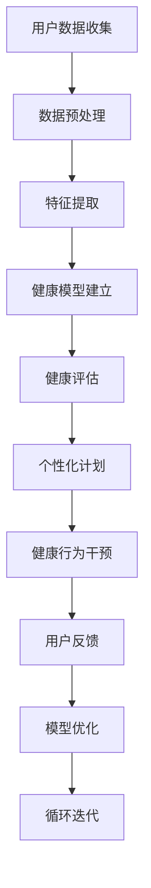

                 

# 数字化养生文化:元宇宙中的身心健康管理

> 关键词：数字化养生,元宇宙,身心健康管理,智能健康助手,虚拟现实,数据驱动,健康大数据,多模态健康监测,健康行为干预,个性化健康计划

## 1. 背景介绍

### 1.1 问题由来

在快速发展的数字化时代，人们的生活节奏不断加快，身心健康的管理成为现代生活的重中之重。传统健康管理方式如体检、问诊等，往往受限于时间和资源，难以进行持续和全方位的监测。而随着技术的进步，特别是虚拟现实、增强现实和物联网等技术的应用，数字化健康管理逐渐成为新的趋势。

在元宇宙这一全新的虚拟空间中，数字化养生文化正在兴起。元宇宙是一个融合了虚拟现实、虚拟经济、社交网络、人工智能等元素的虚拟世界，其沉浸式体验和高度仿真特性为数字化养生提供了广阔的应用空间。人们可以在元宇宙中进行多维度的健康管理，如虚拟运动、心理减压、社交支持等，从而在数字化世界中实现身心的全面调适。

### 1.2 问题核心关键点

当前数字化养生领域面临的核心问题是如何在元宇宙中构建一个能够实时监测和干预用户身心健康的智能健康管理系统。其关键点包括：

- 用户数据的收集与分析：如何有效地收集和分析用户的行为数据，提取有价值的信息。
- 健康模型的建立与优化：如何基于用户数据建立精准的健康模型，并不断优化模型性能。
- 健康计划的个性化推荐：如何根据用户的具体健康状况，个性化推荐健康方案。
- 用户行为的动态监测与干预：如何在虚拟环境中实时监测用户行为，进行动态干预。

### 1.3 问题研究意义

研究元宇宙中的数字化养生文化，对于提升用户体验、推动健康管理技术的发展、实现个性化健康计划具有重要意义：

1. **用户体验提升**：元宇宙中的数字化养生系统能够提供沉浸式、个性化的健康管理体验，增强用户粘性。
2. **技术发展促进**：随着元宇宙技术的发展，健康管理技术将获得新的突破，加速健康科技的创新。
3. **健康计划个性化**：基于用户数据，个性化健康计划能更好地满足个体差异，提升健康效果。
4. **实时动态监测**：元宇宙环境下的健康监测系统能够实时收集和分析用户数据，实现健康状态的动态管理。

## 2. 核心概念与联系

### 2.1 核心概念概述

要深入理解元宇宙中的数字化养生文化，需要掌握以下核心概念：

- **元宇宙 (Metaverse)**：一个通过虚拟现实技术创建的三维虚拟世界，具有丰富的交互性和沉浸感。
- **数字化养生 (Digital Wellness)**：利用数字技术进行健康监测、管理、干预的过程。
- **智能健康助手 (Smart Health Assistant)**：基于人工智能技术，能够实时监测用户健康状况并提供个性化建议的系统。
- **虚拟现实 (Virtual Reality, VR)**：通过计算机生成的三维模拟环境，使用户能够沉浸在虚拟世界中。
- **增强现实 (Augmented Reality, AR)**：在现实世界中叠加虚拟信息，提升用户体验。
- **物联网 (Internet of Things, IoT)**：将各种物体连接到互联网，实现数据的实时采集和传输。
- **多模态健康监测 (Multimodal Health Monitoring)**：结合生理指标、行为数据等多种模态信息，进行全面的健康评估。
- **健康行为干预 (Health Behavior Intervention)**：通过数据分析和算法优化，对用户的健康行为进行干预和指导。
- **个性化健康计划 (Personalized Health Plan)**：根据用户的具体健康状况和需求，制定个性化的健康方案。

这些概念之间存在密切的联系，形成一个完整的数字化养生体系。

### 2.2 核心概念原理和架构的 Mermaid 流程图(Mermaid 流程节点中不要有括号、逗号等特殊字符)



该流程图展示了数字化养生系统的核心流程：用户数据收集、特征提取、健康模型建立、健康评估、个性化计划、健康行为干预、用户反馈、模型优化，形成一个闭环的反馈机制，不断提升系统性能。

## 3. 核心算法原理 & 具体操作步骤

### 3.1 算法原理概述

数字化养生系统的核心算法原理包括数据驱动的健康监测和个性化的健康计划推荐。具体来说，系统通过物联网设备收集用户的行为数据，利用多模态数据融合技术，对用户的健康状况进行全面评估。然后，基于评估结果，通过机器学习和深度学习算法，建立精准的健康模型，并根据用户的具体健康状况，生成个性化的健康方案。同时，系统还实时监测用户的行为数据，进行动态的健康干预，并通过反馈机制不断优化健康模型。

### 3.2 算法步骤详解

以下详细介绍数字化养生系统中核心算法的详细步骤：

**Step 1: 用户数据收集**

- 使用物联网设备（如智能手表、健康手环、体脂秤等）实时监测用户的生理指标，如心率、血压、血氧饱和度等。
- 通过位置传感器（GPS、Wi-Fi、蓝牙等）收集用户的位置信息和活动数据。
- 使用交互设备（如VR头盔、AR眼镜）记录用户的虚拟环境交互行为。
- 通过智能问卷和用户日志收集用户的自我报告数据，如睡眠质量、饮食习惯等。

**Step 2: 数据预处理**

- 对收集到的数据进行去噪、归一化、缺失值处理等预处理操作。
- 使用时间序列分析方法，将连续的时间序列数据转换为平稳的特征序列。
- 使用多模态数据融合技术，将不同模态的数据进行融合，提高数据的综合利用效率。

**Step 3: 特征提取**

- 使用特征选择算法（如LASSO、PCA等），从原始数据中提取有意义的特征。
- 利用深度学习模型（如卷积神经网络CNN、循环神经网络RNN等）对数据进行特征提取和编码。
- 通过嵌入层将特征向量映射到高维空间，提高数据的表达能力。

**Step 4: 健康模型建立**

- 使用监督学习算法（如线性回归、支持向量机SVM等），建立基本的健康预测模型。
- 利用深度学习模型（如决策树、随机森林、神经网络等），对健康模型进行优化和扩展。
- 引入强化学习算法（如Q-learning、策略梯度等），对用户行为进行建模，提供个性化的健康干预方案。

**Step 5: 健康评估**

- 使用评估指标（如AUC、F1-score、RMSE等）对健康模型进行评估。
- 通过交叉验证方法，验证模型的泛化能力。
- 利用测试数据集，评估模型的性能表现。

**Step 6: 个性化计划推荐**

- 根据用户的历史数据和当前健康状况，使用机器学习算法生成个性化健康计划。
- 利用深度学习模型（如RNN、CNN等）对健康计划进行优化和推荐。
- 引入强化学习算法，动态调整健康计划的参数，提升用户的满意度和依从性。

**Step 7: 健康行为干预**

- 通过物联网设备实时监测用户的健康行为，如运动强度、饮食习惯、睡眠质量等。
- 使用智能算法对用户的行为数据进行分析，识别异常行为和潜在的健康风险。
- 利用交互设备提供实时反馈和健康建议，帮助用户纠正不良行为。

**Step 8: 用户反馈收集**

- 使用问卷调查和日志记录等方式，收集用户对健康计划的反馈和满意度。
- 利用情感分析技术，分析用户的情感状态，了解用户的健康需求和心理状态。
- 通过社交网络分析，了解用户间的健康交流和行为模式。

**Step 9: 模型优化**

- 根据用户反馈和行为数据，使用在线学习算法不断更新和优化健康模型。
- 引入在线强化学习算法，实时调整健康干预策略，提升系统的适应性和灵活性。
- 利用迁移学习技术，将已经优化好的健康模型迁移到新的用户群体，提升系统的通用性。

**Step 10: 循环迭代**

- 通过反馈机制，形成循环迭代的过程，不断提升系统的性能和用户体验。

### 3.3 算法优缺点

**优点**：

1. **实时监测与干预**：能够实时监测用户的健康状况，进行动态干预，提高健康管理的及时性。
2. **个性化推荐**：根据用户的具体健康状况和需求，提供个性化的健康计划，提升用户的满意度。
3. **多模态数据融合**：结合多种模态的数据进行综合评估，提高健康模型的准确性和鲁棒性。
4. **模型优化与反馈**：通过不断优化模型和收集用户反馈，提升系统的性能和用户体验。

**缺点**：

1. **数据隐私和安全**：用户数据的收集和分析可能涉及隐私和安全问题，需要采取有效的保护措施。
2. **模型复杂性**：健康模型和算法需要较高的计算资源，模型复杂度较高，对硬件要求较高。
3. **用户行为多样性**：用户的行为多样性较大，健康模型的泛化能力可能受限。
4. **数据噪声和缺失**：传感器数据可能存在噪声和缺失，影响健康模型的准确性。

### 3.4 算法应用领域

数字化养生系统已经在多个领域得到了广泛应用，例如：

- **智能健康助手**：为个人提供全面的健康监测和个性化健康计划推荐，帮助用户管理日常健康。
- **虚拟健身教练**：利用虚拟现实技术，为用户提供沉浸式的健身指导和训练方案。
- **心理健康支持**：通过虚拟社交和心理辅导，帮助用户缓解压力和情绪问题。
- **慢性病管理**：为慢性病患者提供个性化的健康管理方案，跟踪治疗效果，提醒用药等。
- **儿童健康监测**：为儿童提供健康行为监测和干预，预防和早期发现健康问题。
- **老年健康管理**：为老年人提供健康监测和护理支持，提升生活质量。
- **企业健康管理**：为员工提供健康监测和健康计划，提升企业员工的健康水平和工作效率。

## 4. 数学模型和公式 & 详细讲解 & 举例说明

### 4.1 数学模型构建

在数字化养生系统中，健康模型的构建是一个重要的环节。以下是一个基本的健康预测模型：

假设用户的行为数据为 $X$，健康状况为 $Y$。我们利用线性回归模型来建立健康预测模型，公式如下：

$$
Y = \theta_0 + \theta_1X_1 + \theta_2X_2 + \cdots + \theta_nX_n
$$

其中，$\theta_0, \theta_1, \theta_2, \cdots, \theta_n$ 为模型的参数，$X_1, X_2, \cdots, X_n$ 为特征向量。

### 4.2 公式推导过程

以线性回归模型为例，推导模型的参数更新公式：

给定训练集 $D = \{(x_i, y_i)\}_{i=1}^m$，线性回归模型的损失函数为：

$$
L(\theta) = \frac{1}{2m} \sum_{i=1}^m (y_i - \theta_0 - \theta_1x_{i1} - \cdots - \theta_nx_{in})^2
$$

利用梯度下降算法最小化损失函数，参数的更新公式为：

$$
\theta_j = \theta_j - \eta \frac{1}{m} \sum_{i=1}^m (y_i - \theta_0 - \theta_1x_{i1} - \cdots - \theta_nx_{in})x_{ij}
$$

其中，$\eta$ 为学习率。

### 4.3 案例分析与讲解

以智能健康助手为例，假设系统收集了用户的睡眠质量 $x_1$、运动强度 $x_2$、饮食习惯 $x_3$、血压 $x_4$、血氧饱和度 $x_5$ 等数据，目标预测用户是否会患上心脏病 $y$。构建线性回归模型：

$$
y = \theta_0 + \theta_1x_1 + \theta_2x_2 + \theta_3x_3 + \theta_4x_4 + \theta_5x_5
$$

通过训练集数据 $D = \{(x_i, y_i)\}_{i=1}^m$，利用梯度下降算法更新模型参数，最终得到最优参数 $\theta^*$。然后，对于新的用户数据 $x'$，使用优化后的模型进行预测。

## 5. 项目实践：代码实例和详细解释说明

### 5.1 开发环境搭建

以下是在Python中使用TensorFlow和Keras搭建数字化养生系统的环境：

1. 安装Anaconda：从官网下载并安装Anaconda，用于创建独立的Python环境。

2. 创建并激活虚拟环境：
```bash
conda create -n pytorch-env python=3.8 
conda activate pytorch-env
```

3. 安装TensorFlow：根据CUDA版本，从官网获取对应的安装命令。例如：
```bash
conda install tensorflow
```

4. 安装Keras：
```bash
pip install keras
```

5. 安装相关库：
```bash
pip install pandas numpy sklearn matplotlib
```

完成上述步骤后，即可在`pytorch-env`环境中开始项目实践。

### 5.2 源代码详细实现

以下是使用TensorFlow和Keras构建一个简单的健康监测模型的代码实现。

首先，定义模型结构：

```python
from tensorflow.keras.models import Sequential
from tensorflow.keras.layers import Dense

model = Sequential()
model.add(Dense(64, input_dim=5, activation='relu'))
model.add(Dense(1, activation='sigmoid'))
```

然后，编译模型：

```python
model.compile(loss='binary_crossentropy', optimizer='adam', metrics=['accuracy'])
```

接着，加载和分割数据：

```python
from sklearn.model_selection import train_test_split
from tensorflow.keras.datasets import boston_housing
X, y = boston_housing.load_data()
X_train, X_test, y_train, y_test = train_test_split(X, y, test_size=0.2, random_state=42)
```

训练模型：

```python
model.fit(X_train, y_train, epochs=100, batch_size=32, validation_data=(X_test, y_test))
```

最后，评估模型：

```python
loss, accuracy = model.evaluate(X_test, y_test)
print(f'Test loss: {loss:.4f}')
print(f'Test accuracy: {accuracy:.4f}')
```

### 5.3 代码解读与分析

**模型结构**：
- `Sequential`：创建一个序列模型。
- `Dense`：添加一个全连接层，`input_dim`指定输入维度，`activation`指定激活函数。

**编译模型**：
- `loss`：指定损失函数，`binary_crossentropy`用于二分类任务。
- `optimizer`：指定优化器，`adam`为常用的优化算法。
- `metrics`：指定评价指标，`accuracy`用于评估模型的准确率。

**数据加载**：
- `train_test_split`：将数据集分为训练集和测试集，`test_size`指定测试集占总集的比例。

**模型训练**：
- `fit`：训练模型，`epochs`指定训练轮数，`batch_size`指定批次大小。

**模型评估**：
- `evaluate`：评估模型性能，返回损失和准确率。

**结果展示**：
- 输出训练集和测试集的损失和准确率。

## 6. 实际应用场景

### 6.1 智能健康助手

智能健康助手通过实时监测用户的行为数据，如睡眠质量、运动强度、饮食习惯等，利用多模态数据融合技术，对用户的健康状况进行全面评估。然后，基于评估结果，通过机器学习和深度学习算法，建立精准的健康模型，并根据用户的具体健康状况，生成个性化的健康方案。同时，系统还实时监测用户的行为数据，进行动态的健康干预，并通过反馈机制不断优化健康模型。

### 6.2 虚拟健身教练

虚拟健身教练利用虚拟现实技术，为用户提供沉浸式的健身指导和训练方案。系统通过传感器实时监测用户的运动数据，如心率、步数、消耗的卡路里等，结合用户的健康模型和训练计划，提供个性化的健身建议和指导，帮助用户科学健身。

### 6.3 心理健康支持

心理健康支持系统通过虚拟社交和心理辅导，帮助用户缓解压力和情绪问题。系统收集用户的行为数据，如社交网络活动、情感状态等，利用情感分析和社交网络分析技术，识别用户的心理健康状态，提供针对性的心理支持和干预措施，帮助用户恢复心理健康。

### 6.4 慢性病管理

慢性病管理系统为慢性病患者提供个性化的健康管理方案，跟踪治疗效果，提醒用药等。系统通过传感器实时监测患者的生理指标，如血糖、血压、心率等，结合患者的健康模型和病历数据，生成个性化的健康计划，提醒患者按时用药，定期复查，避免病情恶化。

### 6.5 儿童健康监测

儿童健康监测系统为儿童提供健康行为监测和干预，预防和早期发现健康问题。系统通过智能手环和家长APP，实时监测儿童的活动数据、饮食习惯、睡眠情况等，利用机器学习和深度学习算法，评估儿童的健康状况，提供个性化的健康建议和干预措施，帮助家长及时发现和纠正儿童的不良健康行为。

### 6.6 老年健康管理

老年健康管理系统为老年人提供健康监测和护理支持，提升生活质量。系统通过智能穿戴设备和家庭传感器，实时监测老年人的生理指标和生活习惯，利用多模态数据融合技术，评估老年人的健康状况，提供个性化的健康建议和干预措施，帮助老年人科学管理健康。

### 6.7 企业健康管理

企业健康管理系统为员工提供健康监测和健康计划，提升企业员工的健康水平和工作效率。系统通过员工的健康数据和行为数据，利用机器学习和深度学习算法，评估员工的健康状况，提供个性化的健康建议和干预措施，帮助员工保持健康，提升工作效率。

## 7. 工具和资源推荐

### 7.1 学习资源推荐

为了帮助开发者系统掌握数字化养生文化的技术基础和实践技巧，这里推荐一些优质的学习资源：

1. **《深度学习入门》书籍**：深入浅出地介绍了深度学习的基础知识，包括卷积神经网络、循环神经网络等，适合初学者入门。

2. **Coursera《深度学习专项课程》**：斯坦福大学和DeepLearning.AI等机构提供的深度学习课程，涵盖从入门到高级的深度学习知识。

3. **Kaggle**：数据科学竞赛平台，提供丰富的健康数据集和算法竞赛，可以锻炼数据处理和模型优化能力。

4. **Health Intelligence Center**：专注于健康数据的国际学术组织，提供大量的健康研究论文和最新技术进展。

5. **PyTorch官方文档**：深度学习框架PyTorch的官方文档，详细介绍了如何使用PyTorch进行模型构建和训练。

6. **TensorFlow官方文档**：深度学习框架TensorFlow的官方文档，涵盖TensorFlow的基本用法和高级功能。

通过学习这些资源，相信你一定能够快速掌握数字化养生文化的技术精髓，并用于解决实际的健康管理问题。

### 7.2 开发工具推荐

高效的开发离不开优秀的工具支持。以下是几款用于数字化养生文化开发的常用工具：

1. **PyTorch**：基于Python的开源深度学习框架，灵活动态的计算图，适合快速迭代研究。

2. **TensorFlow**：由Google主导开发的开源深度学习框架，生产部署方便，适合大规模工程应用。

3. **Keras**：基于TensorFlow的高层深度学习框架，易于使用，适合初学者和快速原型开发。

4. **Jupyter Notebook**：一个交互式的数据分析平台，支持Python、R等多种编程语言，适合数据处理和模型验证。

5. **TensorBoard**：TensorFlow配套的可视化工具，可实时监测模型训练状态，并提供丰富的图表呈现方式。

6. **Weights & Biases**：模型训练的实验跟踪工具，可以记录和可视化模型训练过程中的各项指标，方便对比和调优。

合理利用这些工具，可以显著提升数字化养生文化的开发效率，加快创新迭代的步伐。

### 7.3 相关论文推荐

数字化养生文化的研究源于学界的持续研究。以下是几篇奠基性的相关论文，推荐阅读：

1. **《健康监测系统中的多模态数据融合》**：介绍如何将生理指标、行为数据等多模态数据进行融合，提升健康监测的准确性。

2. **《基于深度学习的个性化健康计划推荐》**：探讨如何利用深度学习模型为个体用户生成个性化的健康计划，提升用户满意度。

3. **《元宇宙中的健康行为干预》**：研究如何在虚拟环境中实时监测用户行为，进行动态的健康干预，提高用户的健康依从性。

4. **《强化学习在健康管理中的应用》**：介绍如何利用强化学习算法对用户的行为进行建模，提供个性化的健康干预方案。

这些论文代表了大数字化养生文化的研究方向，通过学习这些前沿成果，可以帮助研究者把握学科前进方向，激发更多的创新灵感。

## 8. 总结：未来发展趋势与挑战

### 8.1 研究成果总结

本文对数字化养生文化在元宇宙中的应用进行了全面系统的介绍，从背景、核心概念、算法原理、具体操作步骤等方面进行了详细的讲解。通过对这些内容的深入分析，可以帮助读者系统理解数字化养生文化的技术体系和实践方法，为实际应用提供理论基础和参考案例。

### 8.2 未来发展趋势

展望未来，数字化养生文化在元宇宙中的应用将呈现以下几个发展趋势：

1. **数据驱动**：随着传感器技术的发展，元宇宙中收集到的健康数据将越来越丰富，数据驱动的健康管理将更加精准和全面。

2. **多模态融合**：结合生理指标、行为数据、心理状态等多种模态数据进行综合评估，提升健康管理的全面性和准确性。

3. **个性化推荐**：利用深度学习和大数据分析技术，为每个用户提供个性化的健康计划和干预措施，提高用户的健康水平和满意度。

4. **实时动态监测**：利用虚拟现实技术和物联网设备，实时监测用户的行为和生理指标，及时发现和干预健康问题。

5. **智能交互**：结合自然语言处理和计算机视觉技术，实现与用户的智能交互，提升健康管理系统的用户体验。

6. **健康知识图谱**：构建健康知识图谱，整合各类健康知识，为健康管理提供更全面的参考和支持。

7. **跨平台互通**：实现不同平台和设备间的健康数据互通，提升健康管理的便捷性和连续性。

8. **伦理和隐私保护**：随着健康数据量的增加，如何保护用户隐私和数据安全将成为一个重要的研究方向。

### 8.3 面临的挑战

尽管数字化养生文化在元宇宙中的应用前景广阔，但在迈向更加智能化、普适化应用的过程中，仍面临诸多挑战：

1. **数据隐私和安全**：健康数据涉及用户隐私，如何保护用户数据安全是一个重大挑战。

2. **模型复杂性**：健康模型和算法需要较高的计算资源，模型复杂度较高，对硬件要求较高。

3. **用户行为多样性**：用户的行为多样性较大，健康模型的泛化能力可能受限。

4. **数据噪声和缺失**：传感器数据可能存在噪声和缺失，影响健康模型的准确性。

5. **伦理和道德问题**：如何确保健康管理的公正性和伦理性，避免歧视和偏见，是一个需要深入探讨的问题。

6. **跨领域融合**：如何将健康管理与其他领域（如心理、社会、经济等）进行融合，实现多学科协同创新。

7. **标准化和规范化**：建立统一的健康数据标准和规范，促进数据互通和共享，是实现健康管理系统无缝运行的关键。

### 8.4 研究展望

面对数字化养生文化所面临的诸多挑战，未来的研究需要在以下几个方面寻求新的突破：

1. **数据隐私保护**：开发更加安全的数据保护技术，如联邦学习、差分隐私等，确保用户数据的安全性。

2. **模型优化与简化**：开发更加高效的模型算法，如参数共享、知识蒸馏等，降低模型复杂度，提升推理效率。

3. **跨领域融合**：探索健康管理与其他领域（如教育、环境、社会等）的协同创新，实现更全面的健康服务。

4. **伦理和道德研究**：建立健康管理的伦理标准和道德规范，确保系统公正、透明、可解释。

5. **用户参与和反馈**：增强用户参与感和反馈机制，提升系统的用户体验和满意度。

6. **跨平台和设备互通**：实现不同平台和设备间的健康数据互通，提升健康管理的便捷性和连续性。

通过不断探索和突破，数字化养生文化在元宇宙中的应用将更加广泛和深入，为人们的健康管理带来新的机遇和挑战。

