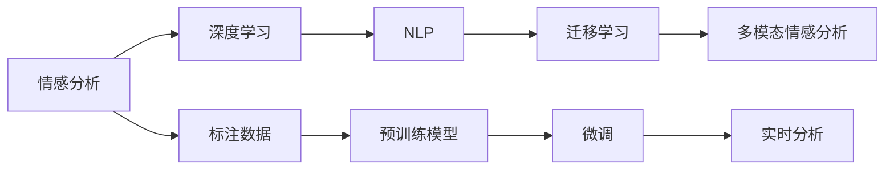

                 

## 1. 背景介绍

### 1.1 问题由来

数字化时代的来临，让社交媒体成为表达情感的主要渠道。越来越多的企业、品牌和政府机构希望借助数字化手段，深入了解公众情绪，预测市场趋势，及时调整策略，把握发展机遇。情感分析作为其中的核心技术，能够自动分析文本内容，提取情感极性、情绪强度等信息，已成为数字化的重要工具。然而，传统的情感分析往往依赖人工标注和简单的统计模型，难以高效处理大规模数据，并且精度不高。因此，需要借助人工智能和机器学习技术，开发先进的情感分析系统，提升数据分析的自动化和精准度。

### 1.2 问题核心关键点

情感分析的核心是识别文本中的情感信息。这包括：

1. **情感极性识别**：判断文本是积极、消极还是中性。
2. **情绪强度分析**：识别情感的强度，如程度、语气等。
3. **情绪变化监测**：跟踪用户情绪随时间的变化。
4. **情境感知**：结合文本的上下文，理解情感背后的原因。
5. **多语言支持**：处理多种语言文本的情感信息。

传统的情感分析方法主要基于词典、规则或简单的统计模型，存在以下局限：

- **标注成本高**：情感标注需要大量人工参与，成本高、耗时长。
- **上下文理解能力弱**：无法有效捕捉情感背后的复杂语境。
- **泛化能力差**：对未见过的情感表达形式和新兴词汇识别不足。
- **实时性差**：处理大规模数据时，实时性难以保证。

## 2. 核心概念与联系

### 2.1 核心概念概述

为了更好地理解情感分析，我们先梳理一下相关的核心概念：

- **情感分析（Sentiment Analysis）**：自动化地识别和提取文本中的情感信息，通常包括情感极性、情绪强度等。
- **深度学习（Deep Learning）**：利用多层神经网络进行特征提取和建模，可以处理大规模数据并捕捉复杂的语义关系。
- **自然语言处理（NLP）**：处理、分析、理解自然语言的理论和方法，情感分析是其重要应用之一。
- **迁移学习（Transfer Learning）**：将一个领域学到的知识迁移到另一个领域，通过预训练模型进行情感分析可以显著提升性能。
- **多模态情感分析（Multimodal Sentiment Analysis）**：结合文本、图像、音频等多种信息源，进行更全面和准确的情感识别。

这些核心概念通过以下Mermaid流程图进行联系展示：



该流程图展示了情感分析从标注数据开始，通过深度学习模型进行预训练，利用迁移学习进行微调，结合多模态信息进行最终分析，并实现实时应用的全过程。

### 2.2 核心概念原理和架构的 Mermaid 流程图


## 3. 核心算法原理 & 具体操作步骤

### 3.1 算法原理概述

情感分析的算法原理主要分为以下几个步骤：

1. **数据准备**：收集和标注情感分析所需的数据集，包括情感极性、情绪强度等标注信息。
2. **预训练模型**：使用深度学习模型（如BERT、GPT等）在大型文本数据集上进行预训练，学习通用的语言表示。
3. **微调**：根据任务特点，调整模型的输出层和损失函数，在标注数据上进行微调，使其适应特定任务的情感分析需求。
4. **多模态融合**：结合文本、图像、音频等多种模态的信息，进行更全面的情感识别。
5. **实时分析**：在实际应用中，对实时数据进行情感分析，并及时提供分析结果。

### 3.2 算法步骤详解

#### 3.2.1 数据准备

数据准备是情感分析的基础。具体步骤如下：

1. **数据收集**：从社交媒体、用户评论、论坛、博客等渠道，收集文本数据。可以使用网络爬虫、API接口等方法获取数据。
2. **数据标注**：为收集到的文本数据添加情感标注，包括情感极性（正、负、中性）和情绪强度（强烈、中等、轻微）等信息。标注通常由人工完成，也可以使用半监督、无监督学习方法进行标注。
3. **数据清洗**：去除无意义、重复或错误的文本数据，确保数据集的质量。

#### 3.2.2 预训练模型

预训练模型是情感分析的核心组件。主要步骤如下：

1. **模型选择**：选择合适的预训练模型，如BERT、GPT等。这些模型在大规模无标签文本数据上进行了预训练，具备强大的语言理解和生成能力。
2. **模型加载**：使用预训练模型的权重进行加载，使用相应的深度学习框架（如TensorFlow、PyTorch等）搭建模型结构。
3. **模型微调**：根据任务特点，调整模型的输出层和损失函数，并在标注数据上进行微调。微调过程中，通常采用较小的学习率，以避免破坏预训练权重。

#### 3.2.3 多模态融合

多模态融合是将文本、图像、音频等多种信息源结合起来，进行更全面和准确的情感识别。主要步骤如下：

1. **文本处理**：使用自然语言处理技术对文本数据进行预处理，包括分词、去除停用词、词性标注等。
2. **特征提取**：使用预训练模型提取文本特征，如BERT模型的上下文表示。
3. **其他模态处理**：对图像、音频等非文本数据进行特征提取，如使用CNN提取图像特征，使用MFCC提取音频特征。
4. **融合策略**：结合文本特征和其他模态特征，使用融合策略（如融合向量、权重融合等）进行综合分析，得到最终的情感结果。

#### 3.2.4 实时分析

实时分析是将情感分析应用到实际场景中，对实时数据进行情感分析，并及时提供分析结果。主要步骤如下：

1. **数据采集**：通过API接口、网络爬虫等方式，实时采集数据。
2. **特征提取**：对实时数据进行特征提取，如使用预训练模型提取文本特征。
3. **情感分析**：使用训练好的模型对实时数据进行情感分析，得到情感极性和强度。
4. **结果展示**：将分析结果以图表、报告等形式展示，供用户查看和决策参考。

### 3.3 算法优缺点

情感分析的算法具有以下优点：

1. **自动化程度高**：通过深度学习模型进行自动化分析，减少了人工标注的繁琐工作。
2. **处理能力强**：能够处理大规模数据，实时分析情感变化，适用于实时性要求高的场景。
3. **泛化能力强**：通过预训练和微调，模型可以迁移到不同领域和任务，适应性强。
4. **融合多种信息源**：结合文本、图像、音频等多种信息源，提高了情感分析的准确度。

同时，情感分析也存在一些缺点：

1. **标注成本高**：高质量的标注数据获取成本较高，特别是在特定领域和场景下。
2. **上下文理解有限**：当前的情感分析模型对文本上下文的理解能力仍有待提高。
3. **数据隐私问题**：在处理敏感信息时，需要注意数据隐私保护和合规问题。
4. **模型复杂度高**：深度学习模型的训练和部署需要较高的计算资源和专业技能。

### 3.4 算法应用领域

情感分析的应用领域非常广泛，以下是一些典型场景：

1. **社交媒体监测**：对社交媒体上的用户评论进行情感分析，了解公众情绪和舆情变化。
2. **品牌情感分析**：分析用户对品牌、产品的情感反馈，优化营销策略。
3. **客户服务分析**：对客服聊天记录进行情感分析，提高客户服务质量。
4. **舆情监控**：对网络上的舆情信息进行实时监测，及时发现和处理负面舆情。
5. **市场趋势预测**：分析用户对市场、产品的情感反馈，预测市场趋势和用户需求。

## 4. 数学模型和公式 & 详细讲解

### 4.1 数学模型构建

情感分析的数学模型主要包括以下几个组成部分：

1. **情感标注**：使用标签$y_i$表示文本情感极性，取值范围为$\{0, 1, 2\}$，分别代表正、中、负。
2. **文本表示**：使用预训练模型$M_{\theta}$将文本$x_i$转换为向量表示$\mathbf{v}_i$。
3. **情感模型**：使用线性回归模型或分类模型$f(x_i)$，对文本情感进行预测。
4. **损失函数**：使用交叉熵损失函数$\mathcal{L}$，衡量模型预测与真实标签的差异。

### 4.2 公式推导过程

设训练样本数为$N$，模型参数为$\theta$，情感标注为$y_i \in \{0, 1, 2\}$。

模型的损失函数可以表示为：

$$
\mathcal{L}(\theta) = -\frac{1}{N}\sum_{i=1}^N \log f(x_i)
$$

其中$f(x_i)$表示模型对文本$x_i$的情感预测。

假设模型$f(x_i)$为线性回归模型，则：

$$
f(x_i) = \mathbf{w}^T \mathbf{v}_i + b
$$

其中$\mathbf{w}$为权重向量，$b$为偏置项。

### 4.3 案例分析与讲解

以Twitter数据为例，进行情感分析的案例分析：

1. **数据收集**：从Twitter上爬取用户评论，并标注情感极性。
2. **预训练模型**：使用BERT模型进行预训练，提取文本向量表示。
3. **微调模型**：在标注数据上进行微调，优化模型参数。
4. **情感分析**：对实时评论进行情感分析，得到情感极性和强度。
5. **结果展示**：将分析结果以图表形式展示，供用户查看。

## 5. 项目实践：代码实例和详细解释说明

### 5.1 开发环境搭建

情感分析项目开发需要一定的硬件和软件环境，以下是搭建环境的详细步骤：

1. **环境配置**：安装Python、深度学习框架（如TensorFlow、PyTorch等）、自然语言处理库（如NLTK、spaCy等）、数据处理库（如Pandas、NumPy等）。
2. **数据准备**：收集和标注情感分析所需的数据集，存储在本地或云端。
3. **模型选择**：选择适合的预训练模型，如BERT、GPT等。
4. **环境部署**：在本地或云端搭建服务环境，支持模型的训练和推理。

### 5.2 源代码详细实现

情感分析的代码实现可以分为以下几个部分：

1. **数据预处理**：对收集到的文本数据进行清洗、分词、去除停用词等预处理操作。
2. **模型加载**：使用预训练模型的权重进行加载，搭建模型结构。
3. **情感分析**：使用训练好的模型对文本数据进行情感分析，得到情感极性和强度。
4. **结果展示**：将分析结果以图表、报告等形式展示，供用户查看和决策参考。

以下是情感分析的Python代码实现示例：

```python
import torch
import torch.nn as nn
import torch.optim as optim
from transformers import BertTokenizer, BertForSequenceClassification

# 初始化模型和优化器
tokenizer = BertTokenizer.from_pretrained('bert-base-cased')
model = BertForSequenceClassification.from_pretrained('bert-base-cased', num_labels=3)
optimizer = optim.Adam(model.parameters(), lr=2e-5)

# 数据预处理
def tokenize_and_truncate(text):
    tokens = tokenizer.encode(text, truncation=True, max_length=512)
    return tokens

# 模型训练
def train_epoch(model, dataset, optimizer, device):
    model.to(device)
    model.train()
    total_loss = 0
    for batch in dataset:
        input_ids = batch['input_ids'].to(device)
        attention_mask = batch['attention_mask'].to(device)
        labels = batch['labels'].to(device)
        optimizer.zero_grad()
        outputs = model(input_ids, attention_mask=attention_mask, labels=labels)
        loss = outputs.loss
        total_loss += loss.item()
        loss.backward()
        optimizer.step()
    return total_loss / len(dataset)

# 模型评估
def evaluate(model, dataset, device):
    model.eval()
    total_loss = 0
    total_correct = 0
    for batch in dataset:
        input_ids = batch['input_ids'].to(device)
        attention_mask = batch['attention_mask'].to(device)
        labels = batch['labels'].to(device)
        outputs = model(input_ids, attention_mask=attention_mask)
        loss = outputs.loss
        logits = outputs.logits
        _, predicted = torch.max(logits, dim=1)
        total_loss += loss.item()
        total_correct += (predicted == labels).sum().item()
    return total_loss / len(dataset), total_correct / len(dataset)

# 训练模型
epochs = 5
batch_size = 16
device = 'cuda' if torch.cuda.is_available() else 'cpu'

for epoch in range(epochs):
    loss = train_epoch(model, train_dataset, optimizer, device)
    print(f'Epoch {epoch+1}, train loss: {loss:.3f}')
    
    dev_loss, dev_acc = evaluate(model, dev_dataset, device)
    print(f'Epoch {epoch+1}, dev results:')
    print(f'  Dev loss: {dev_loss:.3f}, Dev accuracy: {dev_acc:.2f}')

print('Test results:')
test_loss, test_acc = evaluate(model, test_dataset, device)
print(f'Test loss: {test_loss:.3f}, Test accuracy: {test_acc:.2f}')
```

### 5.3 代码解读与分析

上述代码实现了情感分析的基本流程，包括模型加载、数据预处理、模型训练、模型评估等步骤。

1. **数据预处理**：使用BERT Tokenizer对文本进行分词和截断，得到模型所需的输入。
2. **模型训练**：在训练集上使用Adam优化器进行模型训练，更新模型参数。
3. **模型评估**：在验证集和测试集上对模型进行评估，计算损失和准确率。
4. **结果展示**：将评估结果以图表、报告等形式展示，供用户查看和决策参考。

## 6. 实际应用场景

### 6.1 社交媒体监测

社交媒体监测是情感分析的重要应用场景之一。通过情感分析，企业可以了解公众情绪，预测市场趋势，及时调整策略。例如，对Twitter上的用户评论进行情感分析，可以了解用户对某个产品的态度，及时调整产品策略和营销活动。

### 6.2 品牌情感分析

品牌情感分析可以帮助企业了解用户对品牌的情感反馈，优化营销策略。例如，对电商平台的用户评论进行情感分析，可以了解用户对品牌的满意度和需求，帮助品牌调整产品和服务。

### 6.3 客户服务分析

客户服务分析可以通过情感分析，提高客户服务质量。例如，对客服聊天记录进行情感分析，可以了解客户的需求和情感变化，优化客服策略和流程。

### 6.4 舆情监控

舆情监控可以及时发现和处理负面舆情，维护企业形象和声誉。例如，对社交媒体上的舆情信息进行情感分析，可以及时发现负面舆情，采取应对措施，避免负面影响扩散。

## 7. 工具和资源推荐

### 7.1 学习资源推荐

为了帮助开发者掌握情感分析技术，以下是一些优秀的学习资源推荐：

1. **《深度学习》（周志华）**：全面介绍深度学习的基础知识和应用场景，包括情感分析在内的诸多NLP任务。
2. **《自然语言处理综论》（Daniel Jurafsky & James H. Martin）**：权威的自然语言处理教材，涵盖情感分析、语言模型、文本分类等重要内容。
3. **《Python自然语言处理》（Steven Bird, Ewan Klein, Edward Loper）**：基于Python的NLP开发实战指南，包含情感分析的代码示例。
4. **Google AI Blog**：Google AI博客，分享最新的NLP研究成果和实践经验，包括情感分析的最新进展。
5. **Kaggle**：Kaggle数据科学竞赛平台，提供丰富的情感分析数据集和竞赛题目，供开发者学习和实践。

### 7.2 开发工具推荐

为了提高情感分析的开发效率，以下是一些常用的开发工具推荐：

1. **PyTorch**：基于Python的深度学习框架，支持动态计算图，灵活性好。
2. **TensorFlow**：由Google开发的深度学习框架，生产部署方便，适合大规模工程应用。
3. **NLTK**：自然语言处理工具包，包含分词、词性标注、情感分析等工具。
4. **spaCy**：自然语言处理工具库，处理速度快，支持多种语言。
5. **Transformers**：由Hugging Face开发的NLP工具库，提供多种预训练语言模型，适合情感分析等任务。

### 7.3 相关论文推荐

情感分析的研究历史悠久，以下是一些经典和前沿的情感分析论文推荐：

1. **《Sentiment Analysis with Deep Learning: A Tutorial》（Jin, L.）**：介绍深度学习在情感分析中的应用，涵盖情感极性识别、情绪强度分析等任务。
2. **《A Survey on Sentiment Analysis》（Shu, X. et al.）**：综述情感分析的研究现状和未来趋势，涵盖深度学习、多模态情感分析等方向。
3. **《Deep Learning Methods for Sentiment Analysis》（Dua, D. et al.）**：介绍深度学习在情感分析中的应用，包括卷积神经网络、循环神经网络、Transformer等模型。
4. **《Multimodal Sentiment Analysis: A Survey》（Sun, J. et al.）**：综述多模态情感分析的研究现状和未来趋势，涵盖文本、图像、音频等多种信息源的融合。

## 8. 总结：未来发展趋势与挑战

### 8.1 研究成果总结

情感分析作为自然语言处理的重要分支，近年来取得了显著进展。主要成果包括：

1. **深度学习模型的应用**：深度学习模型（如BERT、GPT等）在情感分析中取得了优异表现，显著提升了情感分析的精度和效率。
2. **多模态融合**：结合文本、图像、音频等多种信息源，进行更全面和准确的情感识别。
3. **实时分析**：实现实时情感分析，对社交媒体、客户服务等领域提供实时反馈。
4. **大规模数据处理**：处理大规模数据集，实现自动化和实时化。

### 8.2 未来发展趋势

未来的情感分析将呈现以下几个发展趋势：

1. **实时性提升**：提高情感分析的实时性，支持实时情感监测和反馈。
2. **多模态融合**：结合多种信息源，进行更全面和准确的情感识别。
3. **数据增强**：使用数据增强技术，提升情感分析的泛化能力。
4. **跨领域迁移**：将情感分析技术应用于更多领域，如医疗、金融等。
5. **可解释性增强**：提高情感分析的可解释性，帮助用户理解情感分析的结果。

### 8.3 面临的挑战

情感分析在发展过程中仍面临一些挑战：

1. **数据获取成本高**：高质量的标注数据获取成本较高，特别是在特定领域和场景下。
2. **上下文理解有限**：当前的情感分析模型对文本上下文的理解能力仍有待提高。
3. **模型复杂度高**：深度学习模型的训练和部署需要较高的计算资源和专业技能。
4. **数据隐私问题**：在处理敏感信息时，需要注意数据隐私保护和合规问题。

### 8.4 研究展望

未来的情感分析研究需要在以下几个方面进行探索：

1. **无监督和半监督情感分析**：摆脱对大规模标注数据的依赖，利用自监督学习、主动学习等方法进行情感分析。
2. **知识增强情感分析**：结合知识图谱、逻辑规则等外部知识，提高情感分析的准确性和可解释性。
3. **跨领域迁移学习**：将情感分析技术应用于更多领域，提升模型的泛化能力和应用范围。
4. **数据隐私保护**：在处理敏感信息时，使用差分隐私、联邦学习等技术，保护用户隐私和数据安全。

总之，情感分析技术在数字化时代具有重要应用价值，未来的研究需要在提高准确性、实时性和可解释性等方面不断创新和突破。只有在不断探索和优化中，才能更好地服务于人类社会的情感理解和表达。

## 9. 附录：常见问题与解答

**Q1: 情感分析的精度如何？**

A: 情感分析的精度取决于数据集的质量和模型的复杂度。使用深度学习模型（如BERT、GPT等）进行情感分析，通常可以取得较高的精度。但在特定领域和场景下，仍需进一步优化模型和数据集，以提高精度。

**Q2: 情感分析的计算资源需求如何？**

A: 情感分析的计算资源需求较高，特别是在深度学习模型的训练和推理过程中。可以使用GPU/TPU等高性能设备进行加速，减少计算时间。同时，可以使用模型裁剪、量化加速等技术优化模型结构，减少内存和存储空间。

**Q3: 情感分析的数据获取方式有哪些？**

A: 情感分析的数据获取方式包括：

1. **公开数据集**：从Kaggle、Google Dataset Search等平台获取公开情感分析数据集。
2. **网络爬虫**：使用网络爬虫从社交媒体、电商平台等获取用户评论和反馈数据。
3. **API接口**：使用社交媒体、电商平台等提供的API接口获取用户评论和反馈数据。
4. **用户生成内容**：收集用户生成的评论、博客、论坛帖子等文本数据。

**Q4: 情感分析的实时性如何保证？**

A: 情感分析的实时性可以通过以下方式保证：

1. **模型推理加速**：使用GPU/TPU等高性能设备进行模型推理，加速计算速度。
2. **数据流处理**：使用流处理技术（如Apache Kafka、Apache Flink等），实时处理和分析数据。
3. **缓存机制**：使用缓存技术（如Redis、Memcached等），减少数据读取和处理时间。
4. **异步处理**：使用异步处理技术（如Tornado、Twisted等），提高系统吞吐量和响应速度。

**Q5: 情感分析的跨领域迁移能力如何提升？**

A: 提升情感分析的跨领域迁移能力可以从以下几个方面进行：

1. **领域适应**：使用领域自适应技术（如AdaptationLayer、DA-LR等），提升模型在不同领域的表现。
2. **多任务学习**：将情感分析与多个任务进行联合训练，提升模型的泛化能力。
3. **迁移学习**：将预训练模型在不同领域上进行微调，提升模型的迁移能力。
4. **知识增强**：结合外部知识（如知识图谱、逻辑规则等），提高模型的跨领域迁移能力。

通过上述方法，可以提升情感分析的跨领域迁移能力，使其在更多领域和场景中发挥作用。

---

作者：禅与计算机程序设计艺术 / Zen and the Art of Computer Programming

