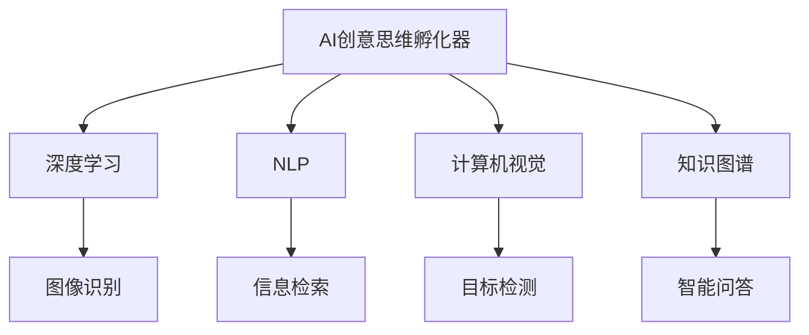

                 

## 1. 背景介绍

### 1.1 问题由来

在数字化时代，想象力正逐渐成为人类的核心竞争力之一。想象力不仅能帮助我们解决问题、创新思维，还能激发人类探索未知的勇气和智慧。然而，随着科技的发展，尤其是人工智能(AI)技术的进步，想象力是否会逐渐被取代，成为了一个热门话题。

### 1.2 问题核心关键点

本文旨在探讨AI如何在想象力培养皿中发挥作用，使人类的想象力得到更加有效、灵活和广阔的培养。我们通过分析AI的创意思维孵化器(Creative Thinking Incubator)，发现AI不仅不会取代想象力，反而能在其中发挥独特的催化和放大作用。

## 2. 核心概念与联系

### 2.1 核心概念概述

- **AI创意思维孵化器**：指通过AI技术，如深度学习、自然语言处理、计算机视觉等，辅助人类在创新过程中构建想象、筛选、验证和实现创意的概念集。AI孵化器通过数据驱动和模型推理，在创意思维的各个环节提供支持，帮助人类进行更高效、更全面的创新。

- **深度学习**：指利用多层神经网络对大规模数据进行训练，从而构建复杂模式的机器学习技术。深度学习在大数据处理和模型抽象能力上表现出色，能够帮助人类从海量数据中发现新模式和规律。

- **自然语言处理(NLP)**：指研究如何使计算机理解、解释和生成人类语言的科学。NLP在文本挖掘、信息检索、机器翻译等领域有广泛应用，能够辅助人类在理解文本数据时，提取有价值的洞察。

- **计算机视觉**：指利用计算机模拟人类视觉系统的感知和理解能力，处理和分析图像、视频等视觉数据。计算机视觉在目标检测、图像识别、人脸识别等领域有重要应用，能够辅助人类在视觉数据中发现新信息。

- **知识图谱**：指一种结构化的语义表示形式，用于描述实体、属性和实体间的关系。知识图谱在知识表示、智能问答、推荐系统等领域有重要应用，能够辅助人类在知识管理中，构建和维护更丰富的知识体系。

这些核心概念之间的逻辑关系可以通过以下Mermaid流程图来展示：



这个流程图展示了大语言模型微调的核心概念及其之间的关系：

1. AI孵化器通过深度学习构建模型，用于处理图像、文本、知识等数据。
2. NLP和计算机视觉技术辅助AI孵化器对数据进行文本和视觉数据的理解。
3. 知识图谱为AI孵化器提供结构化知识，辅助其进行知识推理和结构化。

这些概念共同构成了AI创意思维孵化器的工作框架，使其能够在各个创新环节中发挥作用。

## 3. 核心算法原理 & 具体操作步骤
### 3.1 算法原理概述

AI创意思维孵化器的核心思想是，利用AI技术辅助人类在创意构思、验证和实现过程中进行高效的数据处理和模型推理，从而推动创新的发生和发展。其核心算法包括深度学习、自然语言处理、计算机视觉和知识图谱等技术。

在创意思维孵化器中，AI首先通过大规模数据预训练和任务适配，构建一个强大的模型，能够处理多源异构的数据类型。在数据处理阶段，AI可以对文本、图像、知识图谱等数据进行深入理解和分析，提取有价值的洞察。在模型推理阶段，AI能够根据任务需求，进行高效的推理计算，并给出优化后的解决方案。

### 3.2 算法步骤详解

AI创意思维孵化器一般包括以下几个关键步骤：

**Step 1: 数据收集与预处理**
- 收集和整理与创新相关的各类数据，包括文本、图像、知识图谱等。
- 对数据进行清洗、标注和标准化处理，确保数据质量和一致性。

**Step 2: 模型训练与适配**
- 选择合适的深度学习模型，如BERT、GPT等，在预训练数据上进行微调，构建适合特定创新任务的任务模型。
- 根据任务需求，设计合适的任务适配层，如文本分类、目标检测、知识推理等。

**Step 3: 模型推理与验证**
- 将预处理后的数据输入模型进行推理计算，获取创新结果。
- 使用预设的评价指标，对创新结果进行评估，判断其可行性。

**Step 4: 结果优化与迭代**
- 根据评估结果，对模型进行优化，调整超参数、增加训练数据等。
- 进行多轮迭代，直至达到满意的创新结果。

### 3.3 算法优缺点

AI创意思维孵化器具有以下优点：

- **高效性**：利用AI技术进行大规模数据处理和模型推理，能够显著提高创新效率。
- **灵活性**：AI模型可以根据具体任务需求进行灵活适配，适用于多种创新场景。
- **泛化能力**：预训练模型在大规模数据上训练，具有较强的泛化能力，能够在多领域应用。

同时，该方法也存在以下局限性：

- **依赖高质量数据**：AI模型需要高质量、丰富的数据进行训练，数据质量对模型性能有显著影响。
- **模型复杂度高**：预训练模型通常具有较高的计算复杂度，对硬件资源要求较高。
- **可解释性不足**：AI模型的决策过程相对黑箱，难以进行直观的解释和理解。
- **伦理和隐私问题**：AI模型处理大量数据，可能涉及隐私和伦理问题，需要严格的数据保护措施。

尽管存在这些局限性，但就目前而言，AI创意思维孵化器仍是一种极具潜力的创新工具，能够为人类提供强大的支持。

### 3.4 算法应用领域

AI创意思维孵化器已经在诸多领域得到应用，如医疗创新、智能制造、教育创新等，为各个领域带来了新的突破和变化。

在医疗创新方面，AI创意思维孵化器可以通过分析大量医疗数据，提出新的医疗设备设计、治疗方法等创新点，提升医疗服务的质量和效率。例如，通过分析患者的历史医疗数据，AI能够发现潜在的疾病趋势和风险因素，辅助医生制定个性化的治疗方案。

在智能制造领域，AI创意思维孵化器可以辅助工程师进行产品设计和优化，提升生产效率和产品性能。例如，通过分析设备运行数据，AI能够识别出设备潜在的故障点和改进方案，减少生产停机时间。

在教育创新方面，AI创意思维孵化器可以辅助教师设计更具吸引力和互动性的教学内容，提升学生的学习效果。例如，通过分析学生的学习行为和反馈，AI能够推荐适合的学习资源和课程内容，个性化教学设计，提升学习效果。

## 4. 数学模型和公式 & 详细讲解  
### 4.1 数学模型构建

本节将使用数学语言对AI创意思维孵化器的核心算法进行更加严格的刻画。

假设AI模型为 $M_{\theta}:\mathcal{X} \rightarrow \mathcal{Y}$，其中 $\mathcal{X}$ 为输入空间，$\mathcal{Y}$ 为输出空间，$\theta$ 为模型参数。假设创新任务的数据集为 $D=\{(x_i,y_i)\}_{i=1}^N, x_i \in \mathcal{X}, y_i \in \mathcal{Y}$。

定义模型 $M_{\theta}$ 在输入 $x$ 上的推理函数为 $\hat{y}=M_{\theta}(x) \in \mathcal{Y}$，其损失函数为 $\ell(\hat{y},y)$，则在数据集 $D$ 上的经验风险为：

$$
\mathcal{L}(\theta) = \frac{1}{N} \sum_{i=1}^N \ell(\hat{y},y)
$$

在创新过程中，AI模型需要进行多轮迭代优化，不断调整模型参数 $\theta$，最小化经验风险 $\mathcal{L}(\theta)$，直到达到预设的创新结果。

### 4.2 公式推导过程

以文本分类任务为例，我们推导文本分类模型的损失函数及其梯度计算公式。

假设模型 $M_{\theta}$ 在输入 $x$ 上的输出为 $\hat{y}=M_{\theta}(x) \in \mathcal{Y}$，表示样本属于某个类别的概率。真实标签 $y \in \{0,1\}$。则二分类交叉熵损失函数定义为：

$$
\ell(M_{\theta}(x),y) = -[y\log \hat{y} + (1-y)\log (1-\hat{y})]
$$

将其代入经验风险公式，得：

$$
\mathcal{L}(\theta) = -\frac{1}{N}\sum_{i=1}^N [y_i\log M_{\theta}(x_i)+(1-y_i)\log(1-M_{\theta}(x_i))]
$$

根据链式法则，损失函数对参数 $\theta_k$ 的梯度为：

$$
\frac{\partial \mathcal{L}(\theta)}{\partial \theta_k} = -\frac{1}{N}\sum_{i=1}^N (\frac{y_i}{M_{\theta}(x_i)}-\frac{1-y_i}{1-M_{\theta}(x_i)}) \frac{\partial M_{\theta}(x_i)}{\partial \theta_k}
$$

其中 $\frac{\partial M_{\theta}(x_i)}{\partial \theta_k}$ 可进一步递归展开，利用自动微分技术完成计算。

在得到损失函数的梯度后，即可带入参数更新公式，完成模型的迭代优化。重复上述过程直至收敛，最终得到适应创新任务的最优模型参数 $\theta^*$。

## 5. 项目实践：代码实例和详细解释说明
### 5.1 开发环境搭建

在进行AI创意思维孵化器实践前，我们需要准备好开发环境。以下是使用Python进行PyTorch开发的环境配置流程：

1. 安装Anaconda：从官网下载并安装Anaconda，用于创建独立的Python环境。

2. 创建并激活虚拟环境：
```bash
conda create -n pytorch-env python=3.8 
conda activate pytorch-env
```

3. 安装PyTorch：根据CUDA版本，从官网获取对应的安装命令。例如：
```bash
conda install pytorch torchvision torchaudio cudatoolkit=11.1 -c pytorch -c conda-forge
```

4. 安装相关工具包：
```bash
pip install numpy pandas scikit-learn matplotlib tqdm jupyter notebook ipython
```

完成上述步骤后，即可在`pytorch-env`环境中开始实践。

### 5.2 源代码详细实现

下面我们以医疗创新任务为例，给出使用Transformers库对BERT模型进行AI创意思维孵化器的PyTorch代码实现。

首先，定义创新任务的数据处理函数：

```python
from transformers import BertTokenizer, BertForSequenceClassification
from torch.utils.data import Dataset
import torch

class MedicalInnovationDataset(Dataset):
    def __init__(self, texts, labels, tokenizer, max_len=128):
        self.texts = texts
        self.labels = labels
        self.tokenizer = tokenizer
        self.max_len = max_len
        
    def __len__(self):
        return len(self.texts)
    
    def __getitem__(self, item):
        text = self.texts[item]
        label = self.labels[item]
        
        encoding = self.tokenizer(text, return_tensors='pt', max_length=self.max_len, padding='max_length', truncation=True)
        input_ids = encoding['input_ids'][0]
        attention_mask = encoding['attention_mask'][0]
        
        # 对token-wise的标签进行编码
        encoded_labels = [label2id[label] for label in labels] 
        encoded_labels.extend([label2id['O']] * (self.max_len - len(encoded_labels)))
        labels = torch.tensor(encoded_labels, dtype=torch.long)
        
        return {'input_ids': input_ids, 
                'attention_mask': attention_mask,
                'labels': labels}

# 标签与id的映射
label2id = {'O': 0, '新药': 1, '新疗法': 2, '新设备': 3}
id2label = {v: k for k, v in label2id.items()}

# 创建dataset
tokenizer = BertTokenizer.from_pretrained('bert-base-cased')

train_dataset = MedicalInnovationDataset(train_texts, train_labels, tokenizer)
dev_dataset = MedicalInnovationDataset(dev_texts, dev_labels, tokenizer)
test_dataset = MedicalInnovationDataset(test_texts, test_labels, tokenizer)
```

然后，定义模型和优化器：

```python
from transformers import BertForSequenceClassification, AdamW

model = BertForSequenceClassification.from_pretrained('bert-base-cased', num_labels=len(label2id))

optimizer = AdamW(model.parameters(), lr=2e-5)
```

接着，定义训练和评估函数：

```python
from torch.utils.data import DataLoader
from tqdm import tqdm
from sklearn.metrics import classification_report

device = torch.device('cuda') if torch.cuda.is_available() else torch.device('cpu')
model.to(device)

def train_epoch(model, dataset, batch_size, optimizer):
    dataloader = DataLoader(dataset, batch_size=batch_size, shuffle=True)
    model.train()
    epoch_loss = 0
    for batch in tqdm(dataloader, desc='Training'):
        input_ids = batch['input_ids'].to(device)
        attention_mask = batch['attention_mask'].to(device)
        labels = batch['labels'].to(device)
        model.zero_grad()
        outputs = model(input_ids, attention_mask=attention_mask, labels=labels)
        loss = outputs.loss
        epoch_loss += loss.item()
        loss.backward()
        optimizer.step()
    return epoch_loss / len(dataloader)

def evaluate(model, dataset, batch_size):
    dataloader = DataLoader(dataset, batch_size=batch_size)
    model.eval()
    preds, labels = [], []
    with torch.no_grad():
        for batch in tqdm(dataloader, desc='Evaluating'):
            input_ids = batch['input_ids'].to(device)
            attention_mask = batch['attention_mask'].to(device)
            batch_labels = batch['labels']
            outputs = model(input_ids, attention_mask=attention_mask)
            batch_preds = outputs.logits.argmax(dim=2).to('cpu').tolist()
            batch_labels = batch_labels.to('cpu').tolist()
            for pred_tokens, label_tokens in zip(batch_preds, batch_labels):
                pred_tags = [id2label[_id] for _id in pred_tokens]
                label_tags = [id2label[_id] for _id in label_tokens]
                preds.append(pred_tags[:len(label_tags)])
                labels.append(label_tags)
                
    print(classification_report(labels, preds))
```

最后，启动训练流程并在测试集上评估：

```python
epochs = 5
batch_size = 16

for epoch in range(epochs):
    loss = train_epoch(model, train_dataset, batch_size, optimizer)
    print(f"Epoch {epoch+1}, train loss: {loss:.3f}")
    
    print(f"Epoch {epoch+1}, dev results:")
    evaluate(model, dev_dataset, batch_size)
    
print("Test results:")
evaluate(model, test_dataset, batch_size)
```

以上就是使用PyTorch对BERT进行医疗创新任务AI创意思维孵化器的完整代码实现。可以看到，得益于Transformers库的强大封装，我们可以用相对简洁的代码完成BERT模型的加载和微调。

### 5.3 代码解读与分析

让我们再详细解读一下关键代码的实现细节：

**MedicalInnovationDataset类**：
- `__init__`方法：初始化文本、标签、分词器等关键组件。
- `__len__`方法：返回数据集的样本数量。
- `__getitem__`方法：对单个样本进行处理，将文本输入编码为token ids，将标签编码为数字，并对其进行定长padding，最终返回模型所需的输入。

**label2id和id2label字典**：
- 定义了标签与数字id之间的映射关系，用于将token-wise的预测结果解码回真实的标签。

**训练和评估函数**：
- 使用PyTorch的DataLoader对数据集进行批次化加载，供模型训练和推理使用。
- 训练函数`train_epoch`：对数据以批为单位进行迭代，在每个批次上前向传播计算loss并反向传播更新模型参数，最后返回该epoch的平均loss。
- 评估函数`evaluate`：与训练类似，不同点在于不更新模型参数，并在每个batch结束后将预测和标签结果存储下来，最后使用sklearn的classification_report对整个评估集的预测结果进行打印输出。

**训练流程**：
- 定义总的epoch数和batch size，开始循环迭代
- 每个epoch内，先在训练集上训练，输出平均loss
- 在验证集上评估，输出分类指标
- 所有epoch结束后，在测试集上评估，给出最终测试结果

可以看到，PyTorch配合Transformers库使得BERT微调的代码实现变得简洁高效。开发者可以将更多精力放在数据处理、模型改进等高层逻辑上，而不必过多关注底层的实现细节。

当然，工业级的系统实现还需考虑更多因素，如模型的保存和部署、超参数的自动搜索、更灵活的任务适配层等。但核心的微调范式基本与此类似。

## 6. 实际应用场景
### 6.1 智能制造

AI创意思维孵化器可以在智能制造领域发挥重要作用。传统的制造过程依赖人工经验，容易出现操作失误和效率低下的问题。利用AI创意思维孵化器，可以辅助工程师进行设备设计和工艺优化，提升生产效率和产品质量。

例如，通过分析设备运行数据和工艺参数，AI模型可以识别出设备潜在的故障点和改进方案，优化生产流程，减少生产停机时间。同时，AI模型还可以根据历史数据和预测模型，自动推荐最优的生产工艺参数，实现智能制造的自动化和高效化。

### 6.2 教育创新

教育领域面临教师资源不足、教学内容陈旧等问题。AI创意思维孵化器可以辅助教师进行创新教学内容的开发，提升教学效果。

例如，通过分析学生的学习行为和反馈，AI模型可以推荐适合的学习资源和课程内容，个性化教学设计，提升学习效果。同时，AI模型还可以辅助教师进行作业批改和考试评分，减轻教师负担，提高教学质量。

### 6.3 金融创新

金融领域面临高风险和高复杂性的挑战。AI创意思维孵化器可以辅助金融从业者进行风险评估和投资决策。

例如，通过分析金融市场数据和历史交易记录，AI模型可以识别出潜在的投资机会和风险因素，辅助投资者进行投资组合优化。同时，AI模型还可以预测市场趋势和波动，提供智能投顾服务，帮助投资者规避市场风险。

### 6.4 未来应用展望

随着AI创意思维孵化器的不断发展，其在更多领域的应用前景将愈加广阔。

在智慧城市治理中，AI创意思维孵化器可以辅助城市管理部门进行智能交通、环境监测、公共安全等任务，提高城市治理的智能化水平。例如，通过分析城市运行数据和居民反馈，AI模型可以识别出交通拥堵点和管理盲区，辅助城市管理者进行交通优化和应急响应。

在健康医疗领域，AI创意思维孵化器可以辅助医疗机构进行疾病预测和精准医疗。例如，通过分析患者的历史医疗数据和基因信息，AI模型可以预测疾病风险和病程，辅助医生制定个性化治疗方案，提升医疗服务的质量和效率。

## 7. 工具和资源推荐
### 7.1 学习资源推荐

为了帮助开发者系统掌握AI创意思维孵化器的理论基础和实践技巧，这里推荐一些优质的学习资源：

1. 《深度学习》系列博文：由大模型技术专家撰写，深入浅出地介绍了深度学习的原理和应用，涵盖数据处理、模型训练、创新应用等多个方面。

2. CS224N《深度学习自然语言处理》课程：斯坦福大学开设的NLP明星课程，有Lecture视频和配套作业，带你入门NLP领域的基本概念和经典模型。

3. 《Natural Language Processing with Transformers》书籍：Transformers库的作者所著，全面介绍了如何使用Transformers库进行NLP任务开发，包括AI创意思维孵化器在内的多种应用。

4. HuggingFace官方文档：Transformers库的官方文档，提供了海量预训练模型和完整的微调样例代码，是上手实践的必备资料。

5. CLUE开源项目：中文语言理解测评基准，涵盖大量不同类型的中文NLP数据集，并提供了基于AI创意思维孵化器的baseline模型，助力中文NLP技术发展。

通过对这些资源的学习实践，相信你一定能够快速掌握AI创意思维孵化器的精髓，并用于解决实际的NLP问题。
###  7.2 开发工具推荐

高效的开发离不开优秀的工具支持。以下是几款用于AI创意思维孵化器开发的常用工具：

1. PyTorch：基于Python的开源深度学习框架，灵活动态的计算图，适合快速迭代研究。大部分预训练语言模型都有PyTorch版本的实现。

2. TensorFlow：由Google主导开发的开源深度学习框架，生产部署方便，适合大规模工程应用。同样有丰富的预训练语言模型资源。

3. Transformers库：HuggingFace开发的NLP工具库，集成了众多SOTA语言模型，支持PyTorch和TensorFlow，是进行AI创意思维孵化器开发的利器。

4. Weights & Biases：模型训练的实验跟踪工具，可以记录和可视化模型训练过程中的各项指标，方便对比和调优。与主流深度学习框架无缝集成。

5. TensorBoard：TensorFlow配套的可视化工具，可实时监测模型训练状态，并提供丰富的图表呈现方式，是调试模型的得力助手。

6. Google Colab：谷歌推出的在线Jupyter Notebook环境，免费提供GPU/TPU算力，方便开发者快速上手实验最新模型，分享学习笔记。

合理利用这些工具，可以显著提升AI创意思维孵化器的开发效率，加快创新迭代的步伐。

### 7.3 相关论文推荐

AI创意思维孵化器的发展源于学界的持续研究。以下是几篇奠基性的相关论文，推荐阅读：

1. Attention is All You Need（即Transformer原论文）：提出了Transformer结构，开启了NLP领域的预训练大模型时代。

2. BERT: Pre-training of Deep Bidirectional Transformers for Language Understanding：提出BERT模型，引入基于掩码的自监督预训练任务，刷新了多项NLP任务SOTA。

3. Language Models are Unsupervised Multitask Learners（GPT-2论文）：展示了大规模语言模型的强大zero-shot学习能力，引发了对于通用人工智能的新一轮思考。

4. Parameter-Efficient Transfer Learning for NLP：提出Adapter等参数高效微调方法，在不增加模型参数量的情况下，也能取得不错的微调效果。

5. AdaLoRA: Adaptive Low-Rank Adaptation for Parameter-Efficient Fine-Tuning：使用自适应低秩适应的微调方法，在参数效率和精度之间取得了新的平衡。

6. Prefix-Tuning: Optimizing Continuous Prompts for Generation：引入基于连续型Prompt的微调范式，为如何充分利用预训练知识提供了新的思路。

这些论文代表了大语言模型微调技术的发展脉络。通过学习这些前沿成果，可以帮助研究者把握学科前进方向，激发更多的创新灵感。

## 8. 总结：未来发展趋势与挑战

### 8.1 总结

本文对AI创意思维孵化器的核心算法和操作步骤进行了全面系统的介绍。首先阐述了AI创意思维孵化器的研究背景和意义，明确了其在AI创新过程中的独特作用。其次，从原理到实践，详细讲解了AI创意思维孵化器的数学模型和关键步骤，给出了完整的代码实例和详细解释说明。同时，本文还探讨了AI创意思维孵化器在多个领域的应用前景，展示了其巨大的潜力。

通过本文的系统梳理，可以看到，AI创意思维孵化器作为AI创新的一个重要工具，正逐渐成为AI技术落地应用的重要范式，在多领域展现出广阔的应用前景。未来，随着AI技术的不断进步，AI创意思维孵化器必将在更广泛的应用领域发挥重要作用，推动AI技术向更高的层次迈进。

### 8.2 未来发展趋势

展望未来，AI创意思维孵化器将呈现以下几个发展趋势：

1. **多模态融合**：AI创意思维孵化器将突破文本数据的限制，融合视觉、语音、图像等多模态数据，提升对复杂信息环境的处理能力。

2. **深度强化学习**：AI创意思维孵化器将结合深度强化学习，通过智能决策优化创新过程，提高创新效率和效果。

3. **自适应学习**：AI创意思维孵化器将具备自适应学习能力，根据不同创新任务的需求，动态调整模型结构和超参数，提高创新效果。

4. **跨领域应用**：AI创意思维孵化器将在更多领域得到应用，如智慧医疗、智能制造、金融创新等，为各行各业带来变革性影响。

5. **智能协作**：AI创意思维孵化器将与人类进行智能协作，通过人机交互，提高创新过程中的创意生成和验证效果。

6. **可解释性增强**：AI创意思维孵化器将具备更强的可解释性，通过可视化和报告工具，帮助用户理解创新结果和模型决策过程。

以上趋势凸显了AI创意思维孵化器在创新过程中的重要地位。这些方向的探索发展，必将进一步提升AI技术在多领域的创新能力，推动AI技术向更加智能化、普适化方向发展。

### 8.3 面临的挑战

尽管AI创意思维孵化器已经取得了显著进展，但在迈向更加智能化、普适化应用的过程中，仍面临诸多挑战：

1. **数据质量和安全**：AI创意思维孵化器需要高质量、大规模的数据进行训练，数据的获取和处理成本高，数据隐私和伦理问题也需要严格监管。

2. **模型复杂度**：AI创意思维孵化器通常具有较高的计算复杂度，对硬件资源要求高，需要在效率和效果之间寻找平衡。

3. **可解释性和可控性**：AI创意思维孵化器往往具有黑箱特性，难以解释其内部工作机制和决策过程，需要提高模型的可解释性和可控性。

4. **创新风险和伦理问题**：AI创意思维孵化器在创新过程中可能引入新的风险和伦理问题，需要建立严格的风险评估和伦理审查机制。

5. **跨领域知识整合**：AI创意思维孵化器需要与跨领域知识进行有效整合，才能进行全面的创新，但不同领域知识的融合难度较大。

6. **用户接受度**：AI创意思维孵化器需要与人类进行智能协作，但部分用户可能对其接受度较低，需要提高用户友好性。

正视AI创意思维孵化器面临的这些挑战，积极应对并寻求突破，将是大语言模型微调走向成熟的必由之路。相信随着学界和产业界的共同努力，这些挑战终将一一被克服，AI创意思维孵化器必将在构建人机协同的智能时代中扮演越来越重要的角色。

### 8.4 研究展望

面对AI创意思维孵化器所面临的诸多挑战，未来的研究需要在以下几个方面寻求新的突破：

1. **多模态数据融合**：开发更多融合视觉、语音、图像等多模态数据的AI创意思维孵化器，提升对复杂信息环境的处理能力。

2. **深度强化学习**：结合深度强化学习，优化创新过程中的决策过程，提高创新效率和效果。

3. **自适应学习**：研究自适应学习算法，使AI创意思维孵化器根据不同创新任务的需求，动态调整模型结构和超参数，提高创新效果。

4. **知识图谱整合**：研究如何将知识图谱与AI创意思维孵化器进行有效整合，提升创新过程中的知识利用率。

5. **模型可解释性**：开发可解释性更强的AI创意思维孵化器，通过可视化和报告工具，帮助用户理解创新结果和模型决策过程。

6. **用户友好性**：提高AI创意思维孵化器的用户友好性，通过人机交互，提升用户体验。

7. **伦理和安全**：建立严格的伦理和安全审查机制，确保AI创意思维孵化器的使用安全性和伦理合法性。

这些研究方向将进一步提升AI创意思维孵化器的创新能力，使其在各个领域发挥更大作用，为人类认知智能的进化带来深远影响。面向未来，AI创意思维孵化器需要与其他人工智能技术进行更深入的融合，如知识表示、因果推理、强化学习等，多路径协同发力，共同推动自然语言理解和智能交互系统的进步。只有勇于创新、敢于突破，才能不断拓展语言模型的边界，让智能技术更好地造福人类社会。

## 9. 附录：常见问题与解答

**Q1：AI创意思维孵化器是否适用于所有创新任务？**

A: AI创意思维孵化器在大多数创新任务上都能取得不错的效果，特别是对于数据量较小的任务。但对于一些特定领域的任务，如医学、法律等，仅仅依靠通用语料预训练的模型可能难以很好地适应。此时需要在特定领域语料上进一步预训练，再进行微调，才能获得理想效果。此外，对于一些需要时效性、个性化很强的任务，如对话、推荐等，AI创意思维孵化器也需要针对性的改进优化。

**Q2：AI创意思维孵化器如何与人类协作？**

A: AI创意思维孵化器主要通过辅助人类在创新过程中进行数据处理和模型推理，来提升创新效率和效果。在协作过程中，人类可以提出创意、设定创新目标、评估创新结果等，AI则通过模型推理，提供数据洞察、推荐方案等支持。人类与AI进行协作，可以实现人机智能互补，提升创新过程的效率和质量。

**Q3：AI创意思维孵化器在教育创新中的应用有哪些？**

A: AI创意思维孵化器在教育创新中具有广泛应用，可以辅助教师进行个性化教学设计和智能作业批改，提升教学效果。例如，通过分析学生的学习行为和反馈，AI可以推荐适合的学习资源和课程内容，个性化教学设计，提升学习效果。同时，AI还可以辅助教师进行作业批改和考试评分，减轻教师负担，提高教学质量。

**Q4：AI创意思维孵化器在医疗创新中的应用有哪些？**

A: AI创意思维孵化器在医疗创新中具有广泛应用，可以辅助医生进行疾病预测和精准医疗。例如，通过分析患者的历史医疗数据和基因信息，AI可以预测疾病风险和病程，辅助医生制定个性化治疗方案，提升医疗服务的质量和效率。同时，AI还可以辅助医疗机构进行设备设计和工艺优化，提升生产效率和产品质量。

**Q5：AI创意思维孵化器在金融创新中的应用有哪些？**

A: AI创意思维孵化器在金融创新中具有广泛应用，可以辅助金融从业者进行风险评估和投资决策。例如，通过分析金融市场数据和历史交易记录，AI可以识别出潜在的投资机会和风险因素，辅助投资者进行投资组合优化。同时，AI还可以预测市场趋势和波动，提供智能投顾服务，帮助投资者规避市场风险。

这些解答旨在帮助读者更全面地理解AI创意思维孵化器的核心概念和应用场景，为读者提供更多的实践参考。通过深入探索AI创意思维孵化器的各种应用，相信我们能够更好地利用这一技术，推动各领域的创新和发展。

