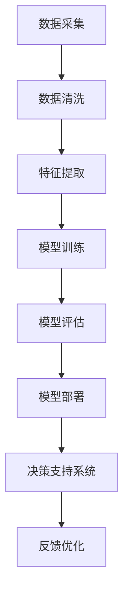

                 

# 数字化直觉培养：AI强化的第六感能力

> 关键词：数字化直觉,第六感, AI强化,机器学习,深度学习,数据驱动决策

## 1. 背景介绍

在数字化时代，数据无处不在，每个人都被数字化浪潮所包围。如何利用数据，让机器学习出直觉，成为现代企业家和决策者的必备技能。本文将探讨数字化直觉的培养，特别是通过AI技术强化的第六感能力。

### 1.1 问题由来

随着大数据、云计算、人工智能等技术的迅猛发展，数字化已经渗透到社会的各个层面，成为推动经济发展、提升生产效率、改善生活品质的重要引擎。然而，在数字化浪潮中，单纯的数据积累并不能产生真正的价值。如何从海量数据中提取有价值的洞见，利用AI技术强化直觉，是当今社会面临的一项重要挑战。

### 1.2 问题核心关键点

1. **数据质量与数据量**：高质量数据是挖掘洞见的前提，但数据量并不能保证结果的准确性。数据预处理、清洗、分析等步骤，对于最终结果的影响至关重要。

2. **AI技术的应用**：机器学习、深度学习等AI技术能够从数据中自动学习模式，但模型的选择、超参数调优、模型训练等环节需要专业知识。

3. **决策支持系统**：将AI模型嵌入到决策支持系统中，需要考虑模型的可解释性、实时性、可靠性等问题。

4. **人机协作**：在数字化决策中，人与AI的协作是关键。如何将AI的计算优势与人类的经验判断结合起来，最大化决策效果，是数字化的最终目标。

## 2. 核心概念与联系

### 2.1 核心概念概述

数字化直觉是指利用数据驱动的决策能力，通过算法分析、模式识别、预测与模拟等技术，实现对市场动态、用户需求、业务流程等环境变化的敏锐感知和快速响应。AI强化第六感能力，则是指通过机器学习、深度学习等AI技术，赋予人类数据处理和决策过程更高的智能和自动化水平。

### 2.2 核心概念原理和架构的 Mermaid 流程图(Mermaid 流程节点中不要有括号、逗号等特殊字符)



该流程图展示了数字化直觉培养的基本流程：数据采集、数据清洗、特征提取、模型训练、模型评估、模型部署、决策支持系统、反馈优化。

## 3. 核心算法原理 & 具体操作步骤

### 3.1 算法原理概述

数字化直觉的培养过程，本质上是一个数据驱动的学习过程。通过机器学习和深度学习技术，模型能够从大量历史数据中学习规律，并进行预测和决策。数字化直觉的核心算法包括但不限于以下几种：

1. **监督学习**：利用标注数据训练模型，使其能够对未来数据进行分类和预测。
2. **无监督学习**：在无标注数据上进行模式识别和聚类，发现数据的内在结构。
3. **强化学习**：通过奖励机制，训练模型在与环境的交互中，逐步优化决策策略。
4. **迁移学习**：利用在其他领域学到的知识，加速新领域的模型训练。

### 3.2 算法步骤详解

以监督学习为例，其操作步骤如下：

**Step 1: 数据准备**
- 采集相关数据，包括历史交易数据、客户行为数据、市场数据等。
- 对数据进行预处理，包括清洗、去重、标准化等操作。

**Step 2: 特征提取**
- 选择合适的特征进行提取，如价格、时间、季节、地区、用户行为等。
- 使用PCA、LDA等降维技术，减小特征空间的维度。

**Step 3: 模型选择与训练**
- 选择合适的算法模型，如线性回归、决策树、随机森林、神经网络等。
- 使用训练集进行模型训练，调整超参数，如学习率、迭代次数、正则化等。

**Step 4: 模型评估与优化**
- 使用测试集对模型进行评估，如均方误差、准确率、召回率等指标。
- 根据评估结果，调整模型参数或选择更好的模型，进行迭代优化。

**Step 5: 模型部署与应用**
- 将训练好的模型部署到生产环境中，集成到决策支持系统中。
- 实时监测模型性能，根据反馈数据进行模型优化和调整。

### 3.3 算法优缺点

**优点：**
- 能够从大量数据中自动发现规律，提高决策的科学性和效率。
- 模型训练过程自动化，减少人工干预，降低决策误差。

**缺点：**
- 数据质量对结果影响较大，数据偏差可能导致模型输出错误。
- 模型复杂度高，训练和推理成本较高，需要较长的计算时间。
- 模型黑箱问题，难以解释其决策过程，影响决策的透明度。

### 3.4 算法应用领域

数字化直觉的培养和AI强化第六感能力的应用，广泛覆盖了金融、零售、制造、医疗、交通等多个行业。以下是一些具体应用案例：

- **金融行业**：利用客户交易数据和市场行情数据，预测股票价格，进行投资组合优化。
- **零售行业**：根据客户购买行为和社交媒体数据，进行个性化推荐和库存管理。
- **医疗行业**：通过患者历史数据和基因信息，预测疾病风险，进行个性化治疗方案推荐。
- **交通行业**：利用车辆运行数据和交通流量数据，优化交通信号灯控制，减少交通拥堵。

## 4. 数学模型和公式 & 详细讲解 & 举例说明

### 4.1 数学模型构建

以线性回归模型为例，其数学模型为：

$$
y = w_0 + w_1x_1 + w_2x_2 + ... + w_nx_n
$$

其中，$y$ 为预测值，$w_i$ 为特征权重，$x_i$ 为特征向量。

### 4.2 公式推导过程

线性回归模型的最小二乘法求解公式为：

$$
\hat{w} = (X^TX)^{-1}X^Ty
$$

其中，$X$ 为特征矩阵，$y$ 为目标向量，$\hat{w}$ 为最优参数向量。

### 4.3 案例分析与讲解

假设某电商平台希望通过用户的浏览历史数据预测其购买意愿。具体步骤如下：

**Step 1: 数据准备**
- 收集用户的历史浏览记录、购买记录等数据。

**Step 2: 特征提取**
- 提取用户浏览时间、浏览次数、浏览商品类别等特征。

**Step 3: 模型训练**
- 使用历史数据训练线性回归模型，预测用户购买概率。

**Step 4: 模型评估**
- 在验证集上评估模型性能，使用准确率和召回率等指标。

**Step 5: 模型部署**
- 将训练好的模型部署到推荐系统中，实时预测用户购买意愿。

## 5. 项目实践：代码实例和详细解释说明

### 5.1 开发环境搭建

在进行数字化直觉培养的实践时，需要准备以下开发环境：

- **Python**：主流的数据科学和机器学习编程语言。
- **Pandas**：数据处理库，支持数据清洗和特征提取。
- **Scikit-learn**：机器学习库，支持多种算法模型的训练和评估。
- **TensorFlow/Keras**：深度学习库，支持复杂神经网络模型的构建。

### 5.2 源代码详细实现

以下是一个简单的线性回归模型的实现示例：

```python
import pandas as pd
from sklearn.linear_model import LinearRegression
from sklearn.metrics import mean_squared_error

# 读取数据
data = pd.read_csv('sales_data.csv')

# 数据预处理
data.dropna(inplace=True)
X = data[['feature1', 'feature2', 'feature3']]
y = data['sales']

# 训练模型
model = LinearRegression()
model.fit(X, y)

# 预测并评估
X_test = pd.read_csv('test_data.csv')
y_pred = model.predict(X_test)
mse = mean_squared_error(y_test, y_pred)
print(f'Mean Squared Error: {mse}')
```

### 5.3 代码解读与分析

**数据预处理**：
- 使用Pandas库进行数据读取、清洗、去重、标准化等操作。

**模型训练**：
- 使用Scikit-learn库中的线性回归模型进行训练，调整超参数。

**模型评估**：
- 使用均方误差作为评估指标，评估模型在测试集上的性能。

**模型部署**：
- 将训练好的模型部署到决策支持系统中，实时进行预测和评估。

### 5.4 运行结果展示

运行上述代码，输出均方误差，评估模型的预测准确性。

## 6. 实际应用场景

### 6.1 金融行业

在金融行业，数字化直觉的培养和AI强化第六感能力的应用，可以实现更加精准的投资分析和风险控制。

- **投资组合优化**：通过历史交易数据和市场行情数据，使用深度学习模型预测股票价格，构建最优投资组合。
- **风险评估**：利用客户信用数据和市场波动数据，使用机器学习模型预测违约风险，进行风险预警。

### 6.2 零售行业

在零售行业，数字化直觉的培养和AI强化第六感能力的应用，可以提升客户体验和销售效率。

- **个性化推荐**：通过客户购买行为和社交媒体数据，使用协同过滤、内容推荐等算法，进行个性化商品推荐。
- **库存管理**：利用销售数据和季节性数据，使用时间序列分析模型，进行库存优化和需求预测。

### 6.3 医疗行业

在医疗行业，数字化直觉的培养和AI强化第六感能力的应用，可以提高医疗服务的质量和效率。

- **疾病预测**：通过患者历史数据和基因信息，使用深度学习模型预测疾病风险，进行早期干预。
- **个性化治疗**：利用患者病历数据和临床试验数据，使用推荐系统算法，进行个性化治疗方案推荐。

### 6.4 交通行业

在交通行业，数字化直觉的培养和AI强化第六感能力的应用，可以优化交通管理和提高运输效率。

- **智能交通信号控制**：利用车辆运行数据和交通流量数据，使用深度学习模型优化交通信号灯控制，减少交通拥堵。
- **路径规划**：通过GPS数据和交通数据，使用路线规划算法，提供最优的出行路径。

## 7. 工具和资源推荐

### 7.1 学习资源推荐

为了帮助开发者系统掌握数字化直觉培养的理论基础和实践技巧，以下是一些优质的学习资源：

1. **《机器学习》（周志华著）**：介绍机器学习的基础理论和常用算法，适合初学者和进阶者阅读。
2. **《深度学习》（Ian Goodfellow, Yoshua Bengio, Aaron Courville著）**：深入讲解深度学习的基本原理和应用实例，是学习深度学习的经典教材。
3. **Coursera和Udacity的机器学习课程**：提供丰富的在线课程资源，涵盖从入门到高级的内容，适合自学和系统学习。
4. **Kaggle竞赛**：参与Kaggle机器学习竞赛，通过实际项目提升实战能力，积累经验。

### 7.2 开发工具推荐

高效的开发离不开优秀的工具支持。以下是几款用于数字化直觉培养开发的常用工具：

1. **Jupyter Notebook**：开源的交互式编程环境，支持Python、R等多种编程语言，适合快速迭代和实验。
2. **Google Colab**：谷歌提供的免费在线Jupyter Notebook环境，支持GPU/TPU等高性能设备，方便实验和分享。
3. **TensorFlow/Keras**：Google开源的深度学习框架，支持分布式训练，适合大规模模型开发。
4. **PyTorch**：Facebook开源的深度学习框架，支持动态计算图，适合快速实验和研究。
5. **Scikit-learn**：Python科学计算库，支持多种机器学习算法的实现和评估。

### 7.3 相关论文推荐

数字化直觉的培养和AI强化第六感能力的研究，源于学界的持续研究。以下是几篇奠基性的相关论文，推荐阅读：

1. **《基于强化学习的决策支持系统》（任东野，侯勇著）**：介绍强化学习在决策支持系统中的应用，分析模型优化和部署。
2. **《数据驱动的智能决策》（李颖杰，张志斌著）**：探讨数据驱动决策的基本原理和实现方法，分析数据驱动的决策流程。
3. **《深度学习在医疗中的应用》（梁建民，蔡幸福著）**：介绍深度学习在医疗数据挖掘和预测中的应用，分析模型构建和优化。

## 8. 总结：未来发展趋势与挑战

### 8.1 研究成果总结

数字化直觉的培养和AI强化第六感能力的研究，已经取得了显著的进展。从简单的线性回归模型，到复杂的深度神经网络模型，从单一的监督学习算法，到多元化的AI技术集成，数字化直觉培养的实践已经覆盖了各个行业。

### 8.2 未来发展趋势

展望未来，数字化直觉培养和AI强化第六感能力的研究将呈现以下几个趋势：

1. **深度学习和神经网络技术的发展**：深度学习模型的层数和参数规模将持续增加，能够处理更加复杂的数据结构和模式。
2. **多模态数据融合**：将文本、图像、语音等多种数据源融合，构建多模态的数字化直觉培养模型。
3. **跨领域迁移学习**：通过跨领域迁移学习，将一个领域学到的知识迁移到另一个领域，提升数字化直觉培养的普适性。
4. **实时计算和流计算**：利用流计算和大数据技术，实现实时数据处理和决策支持。
5. **自动化和智能化决策**：引入自动化决策算法，利用AI技术提升决策的智能化和自动化水平。

### 8.3 面临的挑战

尽管数字化直觉培养和AI强化第六感能力的研究已经取得了显著进展，但在迈向更加智能化、普适化应用的过程中，仍然面临诸多挑战：

1. **数据质量问题**：数据质量对模型性能影响较大，如何确保数据完整性、一致性和真实性，是一个重要挑战。
2. **模型复杂度问题**：深度学习模型通常结构复杂，参数量巨大，训练和推理成本较高，需要高效的优化算法和硬件支持。
3. **模型解释性问题**：深度学习模型的黑箱特性，使得其决策过程难以解释，影响决策的透明度和可信度。
4. **隐私和安全问题**：数字化决策中涉及大量敏感数据，如何保护数据隐私和安全，是一个不容忽视的问题。
5. **技术融合问题**：将AI技术与其他技术（如物联网、区块链、大数据等）进行有效融合，需要多学科知识的协同合作。

### 8.4 研究展望

面对这些挑战，未来的研究需要在以下几个方面寻求新的突破：

1. **数据治理和质量保障**：建立健全的数据治理机制，确保数据的质量和一致性。
2. **模型优化和高效计算**：开发高效的优化算法和计算平台，降低模型的训练和推理成本。
3. **模型解释性和透明化**：引入可解释性技术，提升模型决策的透明性和可信度。
4. **数据隐私和安全保护**：引入数据加密和匿名化技术，保护数据隐私和安全。
5. **多技术融合和协同**：探索AI技术与其他技术的协同应用，实现跨领域的数据融合和智能化决策。

## 9. 附录：常见问题与解答

**Q1: 什么是数字化直觉培养？**

A: 数字化直觉培养是指通过机器学习、深度学习等AI技术，从大量数据中自动学习规律，并基于此规律进行决策和预测，从而提高决策的科学性和效率。

**Q2: 数字化直觉培养和AI强化第六感能力有什么区别？**

A: 数字化直觉培养强调数据驱动的决策过程，而AI强化第六感能力则通过AI技术增强决策的智能和自动化水平。数字化直觉培养是AI强化第六感能力的基础，两者相辅相成。

**Q3: 如何确保数据的质量和一致性？**

A: 数据质量对数字化直觉培养的效果至关重要。建议采用以下措施：
- 数据清洗和预处理：去除重复数据、处理缺失值、标准化数据格式等。
- 数据验证和校验：通过测试和验证，确保数据的一致性和真实性。
- 数据治理机制：建立数据治理体系，规范数据的使用和管理。

**Q4: 如何提升模型决策的透明性和可信度？**

A: 模型的透明性和可信度是数字化直觉培养的重要目标之一。建议采用以下措施：
- 引入可解释性技术：如LIME、SHAP等，分析模型决策的依据。
- 结合专家知识：将专家知识和经验与模型输出结合，提升决策的可信度。
- 多模型集成：通过多模型集成，提高决策的稳定性和准确性。

**Q5: 如何在实际应用中保护数据隐私和安全？**

A: 数据隐私和安全是数字化决策中必须考虑的重要问题。建议采用以下措施：
- 数据加密和匿名化：对敏感数据进行加密和匿名化处理。
- 访问控制和权限管理：建立严格的访问控制机制，限制数据访问权限。
- 安全审计和监控：实时监控数据使用情况，进行安全审计和风险预警。

---

作者：禅与计算机程序设计艺术 / Zen and the Art of Computer Programming

