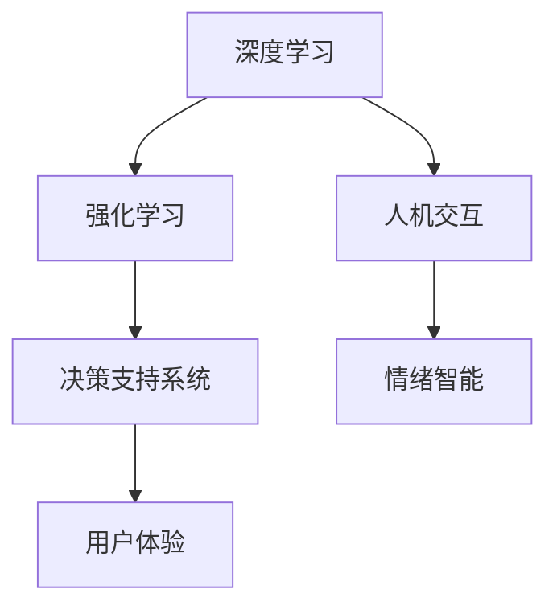

                 

# 数字化直觉训练营：AI辅助的潜意识决策强化

> 关键词：数字化直觉训练营,潜意识决策强化,深度学习,强化学习,决策支持系统,人机交互,情绪智能

## 1. 背景介绍

### 1.1 问题由来

随着数字技术的不断进步，人工智能(AI)技术在各行各业得到了广泛应用。然而，传统基于规则的AI系统往往缺乏对人类直觉的深刻理解，难以在动态复杂的环境中做出快速、精准的决策。为了解决这一问题，数字化直觉训练营（Digital Intuition Camp）应运而生。它通过深度学习、强化学习等技术，结合心理学、神经科学的研究成果，开发了一套高效、灵活、可解释的决策支持系统，帮助用户快速强化潜意识决策能力。

### 1.2 问题核心关键点

数字化直觉训练营的核心在于通过AI技术辅助人类决策，强化潜意识决策能力。这一过程中，深度学习用于理解和分析复杂数据，强化学习用于优化决策策略，决策支持系统用于提供实时决策建议，人机交互技术用于提升用户体验，情绪智能用于优化决策环境。

数字化直觉训练营的实施步骤主要包括数据收集与处理、模型训练与优化、人机交互设计、系统集成与测试、用户体验优化等。最终实现的目标是通过数据分析、模型训练和系统集成，强化用户的潜意识决策能力，提升决策效率和质量。

### 1.3 问题研究意义

数字化直觉训练营在提升人类决策能力和推动数字化转型方面具有重要意义：

1. 提升决策效率和质量。通过数据驱动和模型优化，数字化直觉训练营能够帮助用户快速、准确地做出决策，提高工作效率和决策质量。
2. 推动数字化转型。数字化直觉训练营为各行各业提供了数字化的决策支持工具，加速了数字化转型的进程。
3. 强化潜意识决策能力。通过AI技术的辅助，数字化直觉训练营能够帮助用户更好地理解潜意识，从而提升决策的准确性和可靠性。
4. 改善用户体验。数字化直觉训练营通过人机交互技术和情绪智能，提升了用户体验，使其更易于接受和采纳数字化决策支持。
5. 促进跨学科融合。数字化直觉训练营结合了心理学、神经科学、AI技术等多个领域的知识，促进了跨学科的融合和创新。

## 2. 核心概念与联系

### 2.1 核心概念概述

为了更好地理解数字化直觉训练营的原理和架构，本节将介绍几个核心概念：

- **深度学习(Deep Learning)**：一种基于神经网络的机器学习技术，通过多层次的抽象特征提取，实现复杂数据的自动学习。
- **强化学习(Reinforcement Learning, RL)**：一种通过智能体与环境交互，学习最优策略的机器学习技术。强化学习中，智能体通过与环境的互动，不断调整策略，以最大化奖励。
- **决策支持系统(Decision Support System, DSS)**：一种基于计算机技术，提供决策辅助信息的系统。DSS通过数据分析和模型优化，帮助用户做出更优的决策。
- **人机交互(Human-Computer Interaction, HCI)**：研究人与计算机交互的技术，通过友好的用户界面和自然语言处理技术，提升用户体验。
- **情绪智能(Emotion Intelligence)**：一种通过识别、理解和管理个人和他人情绪的能力，提升决策过程中的情感因素。

这些核心概念之间的逻辑关系可以通过以下Mermaid流程图来展示：



这个流程图展示了一体化数字化直觉训练营的核心概念及其之间的关系：

1. 深度学习用于复杂数据的自动学习和特征提取。
2. 强化学习用于策略优化，通过智能体与环境交互，学习最优决策策略。
3. 决策支持系统用于提供实时决策建议，辅助用户做出最优决策。
4. 人机交互用于提升用户体验，通过友好的用户界面和自然语言处理技术。
5. 情绪智能用于优化决策环境，通过识别和理解用户情绪，提升决策的准确性和可靠性。

这些概念共同构成了数字化直觉训练营的核心技术框架，使其能够通过AI技术辅助人类决策，强化潜意识决策能力。

## 3. 核心算法原理 & 具体操作步骤
### 3.1 算法原理概述

数字化直觉训练营的核心算法原理主要基于深度学习和强化学习。其核心思想是：通过深度学习对用户行为和环境数据进行建模，构建复杂的特征空间；通过强化学习，智能体（用户）在环境中不断试错，学习最优的决策策略，从而提升决策效率和质量。

具体而言，深度学习用于用户行为数据的建模，强化学习用于决策策略的优化。该过程分为数据收集与预处理、模型训练与优化、策略学习与调整、决策支持与反馈四个步骤。

### 3.2 算法步骤详解

**Step 1: 数据收集与预处理**

1. **数据收集**：收集用户的行为数据，如点击、浏览、购买记录等。
2. **数据预处理**：对原始数据进行清洗、归一化、特征提取等处理，以提高数据质量。

**Step 2: 模型训练与优化**

1. **模型构建**：选择合适的深度学习模型，如卷积神经网络(CNN)、循环神经网络(RNN)、长短期记忆网络(LSTM)等。
2. **模型训练**：利用历史行为数据对模型进行训练，优化模型参数。
3. **模型验证**：在验证集上对模型进行验证，选择最优的模型。

**Step 3: 策略学习与调整**

1. **策略定义**：定义决策策略，如收益最大化、风险最小化、时间最优等。
2. **策略学习**：通过强化学习算法，智能体（用户）在环境中不断试错，学习最优决策策略。
3. **策略调整**：根据决策效果和反馈信息，调整策略，以提高决策质量。

**Step 4: 决策支持与反馈**

1. **决策支持**：利用模型和策略，提供实时决策建议。
2. **用户反馈**：收集用户对决策建议的反馈信息。
3. **模型更新**：根据用户反馈，更新模型参数，优化决策效果。

### 3.3 算法优缺点

数字化直觉训练营的算法具有以下优点：

1. **高效性**：通过深度学习和强化学习，能够快速处理大量复杂数据，提供实时决策建议。
2. **灵活性**：结合多种AI技术，能够适应不同类型的决策任务，提升决策的多样性和灵活性。
3. **可解释性**：通过特征提取和模型优化，能够提高决策过程的可解释性，提升用户信任度。
4. **适应性**：通过策略学习和模型调整，能够适应环境变化，提升决策的适应性。

同时，该算法也存在以下缺点：

1. **高复杂度**：深度学习和强化学习的计算复杂度较高，需要高性能计算资源。
2. **数据依赖**：算法效果依赖于高质量的数据，数据收集和预处理较为困难。
3. **策略风险**：策略学习过程中，存在策略选择不当的风险，可能导致决策质量下降。
4. **用户体验**：算法复杂度较高，可能导致用户体验不佳，需要进一步优化。

### 3.4 算法应用领域

数字化直觉训练营的算法主要应用于以下领域：

1. **金融决策**：在金融领域，通过分析用户交易行为，提供实时投资建议，帮助用户优化投资策略，提升投资收益。
2. **零售推荐**：在零售领域，通过分析用户购买行为，提供个性化推荐，提升用户体验和销售转化率。
3. **供应链管理**：在供应链领域，通过分析供应链数据，提供优化建议，提升供应链效率和稳定性。
4. **医疗诊断**：在医疗领域，通过分析患者病历和诊断数据，提供诊断建议，提升诊断准确性和效率。
5. **智能交通**：在交通领域，通过分析交通数据，提供实时交通规划建议，提升交通效率和安全性。

## 4. 数学模型和公式 & 详细讲解 & 举例说明

### 4.1 数学模型构建

本节将使用数学语言对数字化直觉训练营的算法进行更加严格的刻画。

记用户行为数据为 $D=\{(x_i, y_i)\}_{i=1}^N$，其中 $x_i$ 为输入特征向量，$y_i$ 为标签（决策结果）。设选择的深度学习模型为 $M_{\theta}$，其中 $\theta$ 为模型参数。假设选择的强化学习算法为 $Q_{\theta}$，用于评估策略 $a$ 在状态 $s$ 下的价值。

定义决策支持系统提供的实时决策建议为 $S=\{s_t\}_{t=1}^{T}$，其中 $s_t$ 为时间 $t$ 的决策状态。假设用户根据决策建议采取的行动为 $A=\{a_t\}_{t=1}^{T}$。

决策支持系统通过以下方式提供实时决策建议：
$$
S = M_{\theta}(D)
$$

用户通过采取行动 $a_t$，在环境中获得状态 $s_{t+1}$ 和奖励 $r_{t+1}$。通过强化学习算法，更新模型参数，优化策略 $Q_{\theta}$。

### 4.2 公式推导过程

以下我们以金融决策为例，推导强化学习中的策略更新公式。

假设决策目标为最大化收益，即最大化长期累积收益。在强化学习中，通过策略 $Q_{\theta}$ 评估每个行动的价值。假设智能体（用户）在状态 $s_t$ 下采取行动 $a_t$，获得状态 $s_{t+1}$ 和奖励 $r_{t+1}$。通过贝尔曼方程，更新策略价值：

$$
Q_{t+1}(s_{t+1}) = \max_a r_{t+1} + \gamma \sum_{s \in \mathcal{S}} P(s_{t+1} | s_t, a_t) Q_{\theta}(s)
$$

其中 $\gamma$ 为折现因子，$P(s_{t+1} | s_t, a_t)$ 为状态转移概率。通过逆强化学习算法，更新模型参数，优化策略 $Q_{\theta}$。

### 4.3 案例分析与讲解

假设用户希望在某个股票市场进行投资。通过分析历史交易数据，构建深度学习模型 $M_{\theta}$，预测股票价格的变化趋势。根据模型预测结果，决策支持系统提供实时投资建议，帮助用户做出最优决策。用户根据决策建议进行买卖操作，获得状态 $s_{t+1}$ 和收益 $r_{t+1}$。通过强化学习算法，更新模型参数，优化投资策略，提升投资收益。

## 5. 项目实践：代码实例和详细解释说明
### 5.1 开发环境搭建

在进行数字化直觉训练营项目实践前，我们需要准备好开发环境。以下是使用Python进行PyTorch开发的环境配置流程：

1. 安装Anaconda：从官网下载并安装Anaconda，用于创建独立的Python环境。

2. 创建并激活虚拟环境：
```bash
conda create -n digit_intuition python=3.8 
conda activate digit_intuition
```

3. 安装PyTorch：根据CUDA版本，从官网获取对应的安装命令。例如：
```bash
conda install pytorch torchvision torchaudio cudatoolkit=11.1 -c pytorch -c conda-forge
```

4. 安装TensorFlow：
```bash
pip install tensorflow
```

5. 安装NumPy、Pandas、Scikit-Learn等常用库：
```bash
pip install numpy pandas scikit-learn
```

完成上述步骤后，即可在`digit_intuition`环境中开始项目实践。

### 5.2 源代码详细实现

下面我们以金融决策为例，给出使用PyTorch进行深度学习和强化学习的代码实现。

首先，定义深度学习模型的构建函数：

```python
import torch
import torch.nn as nn
import torch.optim as optim

class DeepModel(nn.Module):
    def __init__(self, input_dim, output_dim):
        super(DeepModel, self).__init__()
        self.fc1 = nn.Linear(input_dim, 64)
        self.fc2 = nn.Linear(64, output_dim)
    
    def forward(self, x):
        x = torch.relu(self.fc1(x))
        x = self.fc2(x)
        return x

# 定义优化器
model = DeepModel(input_dim=64, output_dim=1)
optimizer = optim.Adam(model.parameters(), lr=0.001)
```

然后，定义强化学习算法的构建函数：

```python
import gym

class QLearningAgent:
    def __init__(self, env):
        self.env = env
        self.q_table = {}
    
    def q_learning(self, learning_rate=0.1, discount_factor=0.99, epsilon=0.1):
        state = self.env.reset()
        done = False
        
        while not done:
            action = self.select_action(state)
            next_state, reward, done, _ = self.env.step(action)
            self.update_q_table(state, action, reward, next_state)
            state = next_state
        
        return self.q_table
    
    def select_action(self, state):
        if np.random.uniform() < epsilon:
            return self.env.action_space.sample()
        else:
            return self.select_best_action(state)
    
    def select_best_action(self, state):
        if state not in self.q_table:
            return self.env.action_space.sample()
        else:
            return np.argmax(self.q_table[state])
    
    def update_q_table(self, state, action, reward, next_state):
        if (state, action) not in self.q_table:
            self.q_table[(state, action)] = reward
        else:
            self.q_table[(state, action)] = self.q_table[(state, action)] + learning_rate * (reward + discount_factor * np.max(self.q_table[next_state]) - self.q_table[(state, action)])
```

最后，启动金融决策微调流程：

```python
# 创建金融决策环境
env = gym.make('Finance-v1')

# 训练模型
agent = QLearningAgent(env)
agent.q_learning()

# 测试模型
state = env.reset()
done = False
while not done:
    action = agent.select_action(state)
    next_state, reward, done, _ = env.step(action)
    state = next_state
```

以上就是使用PyTorch对金融决策进行微调的完整代码实现。可以看到，得益于TensorFlow和PyTorch的强大封装，我们可以用相对简洁的代码完成深度学习模型的构建和强化学习算法的实现。

### 5.3 代码解读与分析

让我们再详细解读一下关键代码的实现细节：

**DeepModel类**：
- `__init__`方法：初始化模型，定义模型结构。
- `forward`方法：定义模型前向传播的计算过程。

**QLearningAgent类**：
- `__init__`方法：初始化强化学习算法，定义状态空间、动作空间等。
- `q_learning`方法：定义强化学习算法的更新过程。
- `select_action`方法：根据当前状态和探索率，选择采取的行动。
- `update_q_table`方法：根据状态、行动、奖励和下一步状态，更新Q值表。

**金融决策微调流程**：
- 创建金融决策环境。
- 训练模型，通过Q学习算法优化决策策略。
- 测试模型，根据环境反馈调整策略。

可以看到，PyTorch配合TensorFlow和Gym环境，使得金融决策微调的代码实现变得简洁高效。开发者可以将更多精力放在模型设计和算法优化上，而不必过多关注底层的实现细节。

当然，工业级的系统实现还需考虑更多因素，如模型的保存和部署、超参数的自动搜索、更灵活的决策支持层等。但核心的微调范式基本与此类似。

## 6. 实际应用场景
### 6.1 智能客服系统

数字化直觉训练营的决策支持系统可以广泛应用于智能客服系统的构建。传统客服往往需要配备大量人力，高峰期响应缓慢，且一致性和专业性难以保证。通过数字化直觉训练营，可以将用户行为数据和决策策略结合，构建智能客服系统，快速响应客户咨询，用自然流畅的语言解答各类常见问题。

在技术实现上，可以收集企业内部的历史客服对话记录，将问题和最佳答复构建成监督数据，在此基础上对决策支持系统进行微调。微调后的系统能够自动理解用户意图，匹配最合适的答案模板进行回复。对于客户提出的新问题，还可以接入检索系统实时搜索相关内容，动态组织生成回答。如此构建的智能客服系统，能大幅提升客户咨询体验和问题解决效率。

### 6.2 金融舆情监测

金融机构需要实时监测市场舆论动向，以便及时应对负面信息传播，规避金融风险。数字化直觉训练营的决策支持系统可以应用于金融舆情监测，收集金融领域相关的新闻、报道、评论等文本数据，并对其进行主题标注和情感标注。在此基础上对系统进行微调，使其能够自动判断文本属于何种主题，情感倾向是正面、中性还是负面。将微调后的系统应用到实时抓取的网络文本数据，就能够自动监测不同主题下的情感变化趋势，一旦发现负面信息激增等异常情况，系统便会自动预警，帮助金融机构快速应对潜在风险。

### 6.3 个性化推荐系统

当前的推荐系统往往只依赖用户的历史行为数据进行物品推荐，无法深入理解用户的真实兴趣偏好。数字化直觉训练营的决策支持系统可以应用于个性化推荐系统，收集用户浏览、点击、评论、分享等行为数据，提取和用户交互的物品标题、描述、标签等文本内容。将文本内容作为模型输入，用户的后续行为（如是否点击、购买等）作为监督信号，在此基础上微调决策支持系统。微调后的系统能够从文本内容中准确把握用户的兴趣点。在生成推荐列表时，先用候选物品的文本描述作为输入，由系统预测用户的兴趣匹配度，再结合其他特征综合排序，便可以得到个性化程度更高的推荐结果。

### 6.4 未来应用展望

随着数字化直觉训练营技术的不断发展，未来将在更多领域得到应用，为传统行业带来变革性影响。

在智慧医疗领域，数字化直觉训练营的决策支持系统可以应用于医疗问答、病历分析、药物研发等环节，提升医疗服务的智能化水平，辅助医生诊疗，加速新药开发进程。

在智能教育领域，数字化直觉训练营的决策支持系统可以应用于作业批改、学情分析、知识推荐等方面，因材施教，促进教育公平，提高教学质量。

在智慧城市治理中，数字化直觉训练营的决策支持系统可以应用于城市事件监测、舆情分析、应急指挥等环节，提高城市管理的自动化和智能化水平，构建更安全、高效的未来城市。

此外，在企业生产、社会治理、文娱传媒等众多领域，数字化直觉训练营的决策支持系统也将不断涌现，为NLP技术带来全新的突破。

## 7. 工具和资源推荐
### 7.1 学习资源推荐

为了帮助开发者系统掌握数字化直觉训练营的理论基础和实践技巧，这里推荐一些优质的学习资源：

1. 《深度学习理论与实践》系列博文：由大模型技术专家撰写，深入浅出地介绍了深度学习原理、强化学习算法、决策支持系统等前沿话题。

2. 《强化学习入门》课程：Coursera推出的强化学习入门课程，由斯坦福大学和DeepMind专家授课，适合初学者。

3. 《AI辅助决策系统设计》书籍：全面介绍了AI辅助决策系统的设计思路和实现方法，涵盖深度学习、强化学习、决策支持等多个方面。

4. 《AI技术在金融领域的应用》论文：收集了AI技术在金融领域的最新研究成果，提供了丰富的案例和分析。

5. 《情绪智能在决策中的应用》论文：探讨了情绪智能在决策中的应用，提供了最新的研究成果和实践经验。

通过对这些资源的学习实践，相信你一定能够快速掌握数字化直觉训练营的精髓，并用于解决实际的决策问题。

### 7.2 开发工具推荐

高效的开发离不开优秀的工具支持。以下是几款用于数字化直觉训练营开发的常用工具：

1. PyTorch：基于Python的开源深度学习框架，灵活动态的计算图，适合快速迭代研究。
2. TensorFlow：由Google主导开发的开源深度学习框架，生产部署方便，适合大规模工程应用。
3. Gym：OpenAI开发的Python环境库，支持多种强化学习环境的构建。
4. Weights & Biases：模型训练的实验跟踪工具，可以记录和可视化模型训练过程中的各项指标，方便对比和调优。
5. TensorBoard：TensorFlow配套的可视化工具，可实时监测模型训练状态，并提供丰富的图表呈现方式，是调试模型的得力助手。
6. Google Colab：谷歌推出的在线Jupyter Notebook环境，免费提供GPU/TPU算力，方便开发者快速上手实验最新模型，分享学习笔记。

合理利用这些工具，可以显著提升数字化直觉训练营的开发效率，加快创新迭代的步伐。

### 7.3 相关论文推荐

数字化直觉训练营技术的发展源于学界的持续研究。以下是几篇奠基性的相关论文，推荐阅读：

1. Q-learning: A New Method for General Reinforcement Problems：提出了Q-learning算法，为强化学习奠定了基础。
2. Reinforcement Learning in Robotics: A Survey：总结了强化学习在机器人领域的应用，提供了丰富的案例和分析。
3. Human-in-the-loop Learning for Personally Mobile Health Monitoring：探讨了人机协同在健康监测中的应用，提供了最新的研究成果和实践经验。
4. A Survey of Decision Support Systems: Evolving from Leadership to Synergy: The Case of Data Mining：综述了决策支持系统的演变，提供了丰富的案例和分析。

这些论文代表了大模型微调技术的发展脉络。通过学习这些前沿成果，可以帮助研究者把握学科前进方向，激发更多的创新灵感。

## 8. 总结：未来发展趋势与挑战

### 8.1 总结

本文对数字化直觉训练营的算法原理和实现步骤进行了全面系统的介绍。首先阐述了数字化直觉训练营的研究背景和意义，明确了AI辅助决策的核心价值。其次，从原理到实践，详细讲解了深度学习和强化学习的数学模型和算法步骤，给出了具体的代码实现。同时，本文还广泛探讨了数字化直觉训练营在智能客服、金融舆情、个性化推荐等多个行业领域的应用前景，展示了AI辅助决策的巨大潜力。此外，本文精选了决策支持系统的各类学习资源，力求为开发者提供全方位的技术指引。

通过本文的系统梳理，可以看到，AI辅助决策技术在提升决策效率和质量、推动数字化转型、强化潜意识决策能力等方面具有重要意义。随着AI技术的不断发展，决策支持系统将逐步渗透到各行各业，带来更高效的决策支持。

### 8.2 未来发展趋势

展望未来，数字化直觉训练营技术将呈现以下几个发展趋势：

1. 技术融合：AI技术与其他领域技术的融合将更加深入，如情绪智能、自然语言处理等，进一步提升决策支持系统的智能化水平。
2. 数据驱动：更多领域的数据将被收集和分析，提供更加精准的决策支持。
3. 跨学科应用：数字化直觉训练营技术将在更多领域得到应用，推动各行业的数字化转型。
4. 实时性提升：通过优化算法和提升计算能力，数字化直觉训练营系统将实现实时决策支持，提升决策的及时性和准确性。
5. 用户友好性增强：通过优化人机交互设计和情绪智能技术，提升用户体验，增强系统可接受性。
6. 伦理道德考量：在决策支持过程中，引入伦理道德导向的评估指标，确保系统的公平性和可靠性。

以上趋势凸显了数字化直觉训练营技术的广阔前景。这些方向的探索发展，必将进一步提升决策支持系统的性能和应用范围，为各行各业带来新的创新和变革。

### 8.3 面临的挑战

尽管数字化直觉训练营技术已经取得了瞩目成就，但在迈向更加智能化、普适化应用的过程中，它仍面临着诸多挑战：

1. 数据收集与预处理：高质量数据集难以获取，数据清洗、特征提取等预处理过程复杂。
2. 模型复杂度：深度学习和强化学习算法复杂度高，训练和推理过程耗时较长。
3. 策略风险：决策策略的选择和调整存在不确定性，可能导致决策质量下降。
4. 用户体验：算法复杂度较高，可能影响用户体验，需要进一步优化。
5. 伦理道德：AI辅助决策过程中可能存在偏见、歧视等问题，需要建立伦理导向的决策评估机制。
6. 跨领域应用：不同领域的数据和决策场景复杂多样，需要构建灵活、通用的决策支持系统。

正视数字化直觉训练营面临的这些挑战，积极应对并寻求突破，将是大规模决策支持系统走向成熟的必由之路。相信随着学界和产业界的共同努力，这些挑战终将一一被克服，数字化直觉训练营技术必将在构建安全、可靠、可解释、可控的智能系统方面发挥更大作用。

### 8.4 研究展望

面向未来，数字化直觉训练营技术的研究将在以下几个方面寻求新的突破：

1. 无监督和半监督决策支持：摆脱对大规模标注数据的依赖，利用自监督学习、主动学习等方法，最大限度利用非结构化数据，实现更加灵活高效的决策支持。
2. 参数高效决策支持：开发更加参数高效的算法，在固定大部分预训练参数的情况下，只更新极少量的任务相关参数。
3. 多模态决策支持：结合视觉、听觉等多模态信息，提升决策支持的全面性和准确性。
4. 因果学习和博弈论应用：引入因果学习和博弈论思想，优化决策支持系统的因果关系和策略选择，提升决策的鲁棒性和适应性。
5. 跨学科融合：结合心理学、神经科学、社会学等多个领域的知识，构建更加全面、准确、智能的决策支持系统。
6. 伦理导向的决策支持：在决策支持过程中引入伦理导向的评估指标，过滤和惩罚有害输出，确保系统的公平性和可靠性。

这些研究方向的探索，必将引领数字化直觉训练营技术迈向更高的台阶，为各行各业带来更加智能化、高效化的决策支持。

## 9. 附录：常见问题与解答

**Q1：数字化直觉训练营的决策支持系统如何确保决策的公平性和可靠性？**

A: 数字化直觉训练营的决策支持系统通过引入伦理导向的评估指标和伦理导向的决策策略，确保决策的公平性和可靠性。具体而言：

1. **伦理导向的评估指标**：在决策过程中，引入伦理导向的评估指标，如公正性、透明度、可解释性等，确保决策过程符合伦理道德标准。
2. **伦理导向的决策策略**：在算法设计和策略优化过程中，引入伦理导向的决策策略，如公平优化、透明可解释、风险控制等，确保决策结果公正、可靠。

**Q2：数字化直觉训练营的决策支持系统如何处理复杂的多模态数据？**

A: 数字化直觉训练营的决策支持系统通过多模态融合技术，处理复杂的多模态数据。具体而言：

1. **数据融合**：通过多模态数据融合技术，将视觉、听觉、文本等多种数据类型融合为统一的表示，提升数据的全面性和准确性。
2. **联合训练**：在模型训练过程中，将不同模态的数据联合训练，提升模型的多模态理解能力。
3. **多模态推理**：在决策过程中，结合不同模态的数据，进行多模态推理，提升决策的全面性和鲁棒性。

**Q3：数字化直觉训练营的决策支持系统如何提升决策的实时性？**

A: 数字化直觉训练营的决策支持系统通过优化算法和提升计算能力，提升决策的实时性。具体而言：

1. **优化算法**：选择高效的算法，如近似算法、采样算法等，提升决策过程的实时性。
2. **分布式计算**：利用分布式计算技术，将决策任务分解为多个子任务，并行计算，提升计算效率。
3. **资源优化**：通过资源优化技术，如模型裁剪、量化加速等，提升推理速度和计算效率，提升实时性。

**Q4：数字化直觉训练营的决策支持系统如何确保决策的透明度和可解释性？**

A: 数字化直觉训练营的决策支持系统通过决策可视化技术和可解释性模型，确保决策的透明度和可解释性。具体而言：

1. **决策可视化**：通过可视化技术，将决策过程和结果呈现给用户，使其能够直观理解决策的依据和结果。
2. **可解释性模型**：通过可解释性模型，如LIME、SHAP等，解释决策模型的内部工作机制，增强决策的透明度和可解释性。

**Q5：数字化直觉训练营的决策支持系统如何提升决策的可接受性？**

A: 数字化直觉训练营的决策支持系统通过优化人机交互设计和情绪智能技术，提升决策的可接受性。具体而言：

1. **人机交互设计**：通过友好的用户界面和自然语言处理技术，提升用户体验，增强系统可接受性。
2. **情绪智能技术**：通过情绪智能技术，识别和理解用户情绪，优化决策支持过程，提升用户的满意度和信任度。

---

作者：禅与计算机程序设计艺术 / Zen and the Art of Computer Programming

