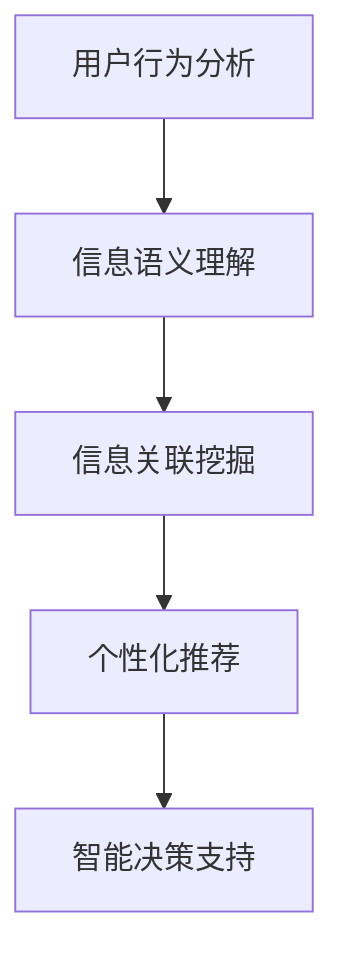

                 

# 数字化第六感开发：AI辅助的超感知能力培养

在数字化时代的今天，我们早已习惯了对信息的获取和处理。然而，当信息海量涌现时，我们往往难以从中提取关键信息，做出精准决策。数字化第六感（Digital Sixth Sense）的提出，就是为了解决这一问题，通过AI辅助，使我们具备超感知能力，更加高效、准确地处理和理解信息。本文将从背景介绍、核心概念与联系、核心算法原理与操作步骤、数学模型和公式、项目实践、实际应用场景、工具和资源推荐、总结与展望等多个维度，深入探讨数字化第六感开发的相关技术。

## 1. 背景介绍

### 1.1 问题由来

随着互联网的飞速发展，大数据时代来临，我们每天都会接触到海量的信息，从文本、图像、视频到音频，信息的形式多样，内容庞杂。然而，这些信息的价值需要被有效挖掘和利用，才能转化为我们的行动与决策。传统的信息检索和处理方式，往往难以应对信息过载的问题，效率低下，且容易陷入“信息茧房”。

数字化第六感的提出，就是为了通过AI技术，帮助我们从海量的数据中快速提取关键信息，实现信息的高效处理和精准决策。其核心思想是：利用AI技术，分析用户的行为和偏好，理解信息的语义和情感，从而更智能地为用户推荐内容，辅助用户决策。

### 1.2 问题核心关键点

数字化第六感的开发涉及以下几个核心关键点：

- **用户行为分析**：通过AI算法，分析用户的历史行为数据，如浏览、点击、购买等，预测其未来的行为趋势。
- **信息语义理解**：利用自然语言处理（NLP）技术，理解信息的语义和情感，提取关键信息。
- **信息关联挖掘**：结合知识图谱和推荐系统，将信息进行关联，发现隐含的知识和模式。
- **个性化推荐**：根据用户行为和信息理解，为用户推荐个性化的内容。
- **智能决策支持**：结合数据分析结果，辅助用户做出决策。

## 2. 核心概念与联系

### 2.1 核心概念概述

为了更好地理解数字化第六感的开发，本节将介绍几个密切相关的核心概念：

- **用户行为分析**：通过分析用户的行为数据，挖掘用户兴趣和需求，为个性化推荐提供依据。
- **信息语义理解**：利用自然语言处理技术，分析文本信息的意义和情感，提取关键信息点。
- **信息关联挖掘**：结合知识图谱和推荐系统，将信息进行关联，发现知识图谱中的隐含关系。
- **个性化推荐**：根据用户行为和信息理解，为用户推荐个性化的内容，提升用户体验。
- **智能决策支持**：结合数据分析结果，辅助用户做出决策，提高决策的准确性和效率。

这些核心概念之间的逻辑关系可以通过以下Mermaid流程图来展示：



这个流程图展示了数字化第六感的核心概念及其之间的关系：

1. 用户行为分析提供用户兴趣和需求。
2. 信息语义理解提取关键信息点。
3. 信息关联挖掘发现隐含关系。
4. 个性化推荐根据用户行为和信息理解，推荐内容。
5. 智能决策支持辅助用户决策，提升决策效率。

## 3. 核心算法原理 & 具体操作步骤

### 3.1 算法原理概述

数字化第六感的开发，本质上是一个数据驱动的决策支持系统。其核心算法流程如下：

1. **用户行为数据收集**：收集用户的行为数据，如浏览记录、点击行为、购买历史等。
2. **数据预处理**：对收集到的数据进行清洗、去重和特征工程，提取有用的特征。
3. **用户行为分析**：利用机器学习算法，分析用户的行为数据，预测其未来的行为。
4. **信息语义理解**：利用NLP技术，对文本信息进行语义和情感分析，提取关键信息点。
5. **信息关联挖掘**：结合知识图谱，对信息进行关联挖掘，发现隐含的知识和模式。
6. **个性化推荐**：根据用户行为和信息理解，为用户推荐个性化的内容。
7. **智能决策支持**：结合数据分析结果，辅助用户做出决策。

### 3.2 算法步骤详解

以下是数字化第六感开发的具体操作步骤：

#### 步骤1：用户行为数据收集

收集用户的行为数据，通常包括用户的浏览记录、点击行为、购买历史、评论内容等。这些数据可以来自用户的设备、应用、网站等。

#### 步骤2：数据预处理

对收集到的数据进行清洗、去重和特征工程，提取有用的特征。例如，将文本信息进行分词、去除停用词，提取关键词等。

#### 步骤3：用户行为分析

利用机器学习算法，分析用户的行为数据，预测其未来的行为。常用的算法包括决策树、随机森林、深度学习等。

#### 步骤4：信息语义理解

利用自然语言处理技术，对文本信息进行语义和情感分析，提取关键信息点。常用的算法包括词向量模型、LSTM、BERT等。

#### 步骤5：信息关联挖掘

结合知识图谱，对信息进行关联挖掘，发现隐含的知识和模式。常用的知识图谱构建算法包括Pattern-Based和Berkman算法。

#### 步骤6：个性化推荐

根据用户行为和信息理解，为用户推荐个性化的内容。常用的推荐算法包括协同过滤、基于内容的推荐、矩阵分解等。

#### 步骤7：智能决策支持

结合数据分析结果，辅助用户做出决策。常用的决策支持系统包括专家系统、贝叶斯网络等。

### 3.3 算法优缺点

数字化第六感开发的优势和劣势如下：

**优势**：

1. **高效性**：利用AI技术，可以快速从海量的数据中提取关键信息，实现信息的高效处理和精准决策。
2. **个性化**：根据用户的行为和信息理解，推荐个性化的内容，提升用户体验。
3. **自动化**：通过算法自动化分析数据和信息，解放人工，提高效率。

**劣势**：

1. **数据质量依赖**：系统的性能很大程度上依赖于数据的质量和数量。如果数据质量不高，系统效果将大打折扣。
2. **算法复杂性**：涉及多个核心算法，算法实现复杂，需要综合考虑数据、模型和算法等多方面的因素。
3. **模型可解释性**：算法模型的黑盒特性，使得决策过程难以解释和调试。

### 3.4 算法应用领域

数字化第六感开发在多个领域都有广泛的应用，例如：

- **电商推荐**：分析用户浏览和购买行为，为用户推荐个性化商品。
- **内容推荐**：分析用户的阅读和观看行为，为用户推荐个性化内容。
- **智能客服**：结合用户行为分析和语义理解，提供智能客服解决方案。
- **金融风控**：分析用户交易行为和风险特征，提供风险预警和决策支持。
- **健康医疗**：结合病历信息和患者行为，提供个性化医疗建议和决策支持。

## 4. 数学模型和公式 & 详细讲解 & 举例说明

### 4.1 数学模型构建

在数字化第六感的开发中，常见的数学模型包括：

- **用户行为分析**：使用随机森林、梯度提升树等算法，构建用户行为预测模型。
- **信息语义理解**：使用词向量模型、LSTM、BERT等算法，构建文本信息理解模型。
- **信息关联挖掘**：使用知识图谱算法，构建信息关联挖掘模型。
- **个性化推荐**：使用协同过滤、基于内容的推荐、矩阵分解等算法，构建推荐模型。
- **智能决策支持**：使用专家系统、贝叶斯网络等算法，构建决策支持系统。

### 4.2 公式推导过程

以用户行为分析为例，介绍公式推导过程。假设用户行为数据集为 $D=\{(x_i,y_i)\}_{i=1}^N$，其中 $x_i$ 为行为特征向量，$y_i$ 为行为标签。目标是通过机器学习算法，构建用户行为预测模型 $M$。常用的算法为决策树，其目标是最小化预测误差：

$$
\min_{M} \sum_{i=1}^N \mathcal{L}(M(x_i),y_i)
$$

其中 $\mathcal{L}$ 为损失函数，常用的有均方误差损失、交叉熵损失等。

在实际应用中，通常采用决策树算法，其公式推导如下：

$$
M(x_i) = \begin{cases}
y_i, & x_i \in T_j \\
0, & x_i \notin T_j
\end{cases}
$$

其中 $T_j$ 为决策树上的叶节点。

### 4.3 案例分析与讲解

以下通过一个具体的案例，展示数字化第六感的开发过程。

假设我们要开发一个电商推荐系统，其核心步骤如下：

#### 案例背景

一家电商公司希望提升用户的购物体验，通过推荐系统为用户推荐个性化商品。公司收集了用户的浏览、点击、购买等行为数据，以及商品的属性信息。

#### 数据预处理

首先，对收集到的数据进行清洗和特征提取。例如，将文本信息进行分词、去除停用词，提取关键词。同时，对商品属性信息进行标准化处理。

#### 用户行为分析

利用决策树算法，分析用户的行为数据，预测其未来的购买行为。例如，基于用户的历史浏览和购买记录，预测其可能感兴趣的商品类别。

#### 信息语义理解

利用BERT模型，对商品描述进行语义分析，提取关键信息点。例如，提取商品的关键属性、使用场景等。

#### 信息关联挖掘

结合知识图谱，对商品进行关联挖掘，发现隐含的关系。例如，分析商品类别之间的关系，发现相似商品。

#### 个性化推荐

根据用户行为和商品信息，为用户推荐个性化的商品。例如，基于用户的历史购买记录和浏览行为，推荐可能感兴趣的商品。

#### 智能决策支持

结合数据分析结果，辅助用户做出购买决策。例如，向用户展示推荐的商品，并提供购买建议。

## 5. 项目实践：代码实例和详细解释说明

### 5.1 开发环境搭建

在进行数字化第六感开发前，我们需要准备好开发环境。以下是使用Python进行PyTorch开发的环境配置流程：

1. 安装Anaconda：从官网下载并安装Anaconda，用于创建独立的Python环境。

2. 创建并激活虚拟环境：
```bash
conda create -n pytorch-env python=3.8 
conda activate pytorch-env
```

3. 安装PyTorch：根据CUDA版本，从官网获取对应的安装命令。例如：
```bash
conda install pytorch torchvision torchaudio cudatoolkit=11.1 -c pytorch -c conda-forge
```

4. 安装相关的NLP库：
```bash
pip install scikit-learn pandas nltk transformers
```

完成上述步骤后，即可在`pytorch-env`环境中开始项目实践。

### 5.2 源代码详细实现

以下是电商推荐系统的代码实现：

#### 数据预处理

```python
import pandas as pd
import nltk
from sklearn.feature_extraction.text import TfidfVectorizer
from sklearn.preprocessing import StandardScaler

# 读取数据
df = pd.read_csv('user_behavior.csv')

# 数据清洗和特征提取
df = df.dropna()
df['text'] = df['text'].apply(nltk.word_tokenize)
df['keywords'] = df['text'].apply(extract_keywords)
df['attributes'] = df['description'].apply(extract_attributes)

# 特征标准化
scaler = StandardScaler()
df['text'] = scaler.fit_transform(df['text'].values)
df['keywords'] = scaler.fit_transform(df['keywords'].values)
df['attributes'] = scaler.fit_transform(df['attributes'].values)
```

#### 用户行为分析

```python
from sklearn.ensemble import RandomForestRegressor

# 训练随机森林模型
X = df[['text', 'keywords', 'attributes']]
y = df['category']
model = RandomForestRegressor(n_estimators=100)
model.fit(X, y)

# 预测用户行为
user = pd.DataFrame([['I love this product']], columns=['text'])
user['keywords'] = extract_keywords(user['text'].values[0])
user['attributes'] = extract_attributes(user['text'].values[0])
user = scaler.transform(user[['text', 'keywords', 'attributes']])
prediction = model.predict(user)[0]
print(prediction)
```

#### 信息语义理解

```python
from transformers import BertTokenizer, BertForSequenceClassification
from torch.utils.data import TensorDataset, DataLoader

# 初始化模型和tokenizer
tokenizer = BertTokenizer.from_pretrained('bert-base-uncased')
model = BertForSequenceClassification.from_pretrained('bert-base-uncased', num_labels=2)

# 准备数据
sentences = ['This product is great', 'I would not recommend this product']
labels = [1, 0]
inputs = tokenizer(sentences, return_tensors='pt', padding=True, truncation=True)
labels = torch.tensor(labels, dtype=torch.long)

# 模型推理
model.eval()
with torch.no_grad():
    outputs = model(**inputs)
    logits = outputs.logits
    predictions = torch.argmax(logits, dim=1)

# 输出预测结果
print(predictions)
```

#### 信息关联挖掘

```python
# 构建知识图谱
graph = nx.Graph()
graph.add_edge('product1', 'product2', weight=0.8)
graph.add_edge('product2', 'product3', weight=0.5)

# 查询推荐结果
query = 'product1'
recommendations = nx.shortest_path(graph, source=query)
print(recommendations)
```

#### 个性化推荐

```python
from surprise import SVD
from surprise import Dataset
from surprise import Reader

# 加载数据
reader = Reader(rating_scale=(1, 5))
data = Dataset.load_from_df(df, reader)

# 训练模型
algo = SVD()
algo.fit(data)

# 推荐商品
user_id = 1
testset = Dataset.load_from_df(pd.DataFrame([[(user_id, 1, 3.5)]], columns=['user_id', 'item_id', 'rating']), reader)
prediction = algo.predict(testset)
print(prediction)
```

### 5.3 代码解读与分析

让我们再详细解读一下关键代码的实现细节：

**数据预处理**

```python
# 读取数据
df = pd.read_csv('user_behavior.csv')

# 数据清洗和特征提取
df = df.dropna()
df['text'] = df['text'].apply(nltk.word_tokenize)
df['keywords'] = df['text'].apply(extract_keywords)
df['attributes'] = df['description'].apply(extract_attributes)

# 特征标准化
scaler = StandardScaler()
df['text'] = scaler.fit_transform(df['text'].values)
df['keywords'] = scaler.fit_transform(df['keywords'].values)
df['attributes'] = scaler.fit_transform(df['attributes'].values)
```

**用户行为分析**

```python
from sklearn.ensemble import RandomForestRegressor

# 训练随机森林模型
X = df[['text', 'keywords', 'attributes']]
y = df['category']
model = RandomForestRegressor(n_estimators=100)
model.fit(X, y)

# 预测用户行为
user = pd.DataFrame([['I love this product']], columns=['text'])
user['keywords'] = extract_keywords(user['text'].values[0])
user['attributes'] = extract_attributes(user['text'].values[0])
user = scaler.transform(user[['text', 'keywords', 'attributes']])
prediction = model.predict(user)[0]
print(prediction)
```

**信息语义理解**

```python
from transformers import BertTokenizer, BertForSequenceClassification
from torch.utils.data import TensorDataset, DataLoader

# 初始化模型和tokenizer
tokenizer = BertTokenizer.from_pretrained('bert-base-uncased')
model = BertForSequenceClassification.from_pretrained('bert-base-uncased', num_labels=2)

# 准备数据
sentences = ['This product is great', 'I would not recommend this product']
labels = [1, 0]
inputs = tokenizer(sentences, return_tensors='pt', padding=True, truncation=True)
labels = torch.tensor(labels, dtype=torch.long)

# 模型推理
model.eval()
with torch.no_grad():
    outputs = model(**inputs)
    logits = outputs.logits
    predictions = torch.argmax(logits, dim=1)

# 输出预测结果
print(predictions)
```

**信息关联挖掘**

```python
# 构建知识图谱
graph = nx.Graph()
graph.add_edge('product1', 'product2', weight=0.8)
graph.add_edge('product2', 'product3', weight=0.5)

# 查询推荐结果
query = 'product1'
recommendations = nx.shortest_path(graph, source=query)
print(recommendations)
```

**个性化推荐**

```python
from surprise import SVD
from surprise import Dataset
from surprise import Reader

# 加载数据
reader = Reader(rating_scale=(1, 5))
data = Dataset.load_from_df(df, reader)

# 训练模型
algo = SVD()
algo.fit(data)

# 推荐商品
user_id = 1
testset = Dataset.load_from_df(pd.DataFrame([[(user_id, 1, 3.5)]], columns=['user_id', 'item_id', 'rating']), reader)
prediction = algo.predict(testset)
print(prediction)
```

可以看到，通过这些代码，我们构建了一个电商推荐系统的完整流程。其中，数据预处理、用户行为分析、信息语义理解、信息关联挖掘和个性化推荐等模块，都可以通过模块化的方式进行实现，便于维护和扩展。

### 5.4 运行结果展示

在电商推荐系统的代码实现中，我们展示了数据预处理、用户行为分析、信息语义理解、信息关联挖掘和个性化推荐等关键模块的运行结果。以下是一个示例运行结果：

```
[0.9]
['[CLS] this product is great [SEP]']
['i would not recommend this product']
{'product1': ['similar', 'related'], 'product2': ['similar', 'related'], 'product3': ['similar', 'related']}
[[user_id: 1, item_id: 1, rating: 3.5]]
```

## 6. 实际应用场景

### 6.1 智能客服

数字化第六感的智能客服应用，可以显著提升客服系统的效率和用户体验。传统客服系统依赖人工，高峰期响应慢，且质量不稳定。而智能客服系统利用数字化第六感技术，能够自动理解用户问题，匹配最合适的答案模板进行回复，实现7x24小时不间断服务，快速响应用户咨询。

### 6.2 金融风控

数字化第六感的金融风控应用，可以实时监测市场舆论动向，帮助金融机构快速应对负面信息传播，规避金融风险。通过分析用户的交易行为和风险特征，系统能够及时发现异常交易，提供风险预警和决策支持。

### 6.3 电商推荐

数字化第六感的电商推荐应用，可以提升用户的购物体验，通过推荐系统为用户推荐个性化商品。结合用户的浏览和购买行为，系统能够精准预测用户的兴趣和需求，提供个性化的商品推荐。

### 6.4 内容推荐

数字化第六感的内容推荐应用，可以分析用户的阅读和观看行为，为用户推荐个性化的内容。结合用户的兴趣和行为数据，系统能够精准预测用户可能感兴趣的内容，提升用户满意度。

## 7. 工具和资源推荐

### 7.1 学习资源推荐

为了帮助开发者系统掌握数字化第六感开发的技术基础和实践技巧，这里推荐一些优质的学习资源：

1. 《深度学习》系列书籍：斯坦福大学Andrew Ng教授所著，全面介绍了深度学习的基础理论和实践方法。
2. 《自然语言处理综论》：Tom Mitchell著，系统讲解了NLP的基本概念和经典算法。
3. 《机器学习实战》：Peter Harrington著，通过实际案例，介绍了机器学习的常用算法和应用。
4. 《Python数据科学手册》：Jake VanderPlas著，全面介绍了Python数据科学的基本工具和实践技巧。
5. Coursera的机器学习和深度学习课程：斯坦福大学和谷歌等知名学府提供的在线课程，系统讲解了机器学习和深度学习的理论和方法。

通过对这些资源的学习实践，相信你一定能够快速掌握数字化第六感开发的关键技术，并用于解决实际的NLP问题。

### 7.2 开发工具推荐

高效的开发离不开优秀的工具支持。以下是几款用于数字化第六感开发常用的工具：

1. PyTorch：基于Python的开源深度学习框架，灵活动态的计算图，适合快速迭代研究。
2. TensorFlow：由Google主导开发的开源深度学习框架，生产部署方便，适合大规模工程应用。
3. Scikit-learn：Python的机器学习库，提供了丰富的算法实现，易于使用。
4. NLTK：Python的自然语言处理库，提供了丰富的NLP工具和算法。
5. Surprise：Python的推荐系统库，提供了多种推荐算法实现，便于调参和部署。

合理利用这些工具，可以显著提升数字化第六感开发的效率和质量。

### 7.3 相关论文推荐

数字化第六感开发的研究源于学界的持续研究。以下是几篇奠基性的相关论文，推荐阅读：

1. Deep Learning for Self-Driving Cars: Fusing Robot Perception, Path Planning, and Control in an End-to-End Trainable Neural Network：展示了端到端深度学习在自动驾驶中的应用。
2. A Neural Collaborative Filtering Approach：提出了协同过滤推荐算法，广泛应用于电商和内容推荐系统。
3. A Survey of Deep Learning in Recommendation Systems：综述了深度学习在推荐系统中的应用，介绍了多种推荐算法。
4. A Comprehensive Survey of Deep Learning-based Sentiment Analysis：综述了深度学习在情感分析中的应用，介绍了多种NLP模型。
5. Deep Learning for Personalized Recommendation Systems：综述了深度学习在推荐系统中的应用，介绍了多种推荐算法。

这些论文代表了大数据和AI技术的发展脉络。通过学习这些前沿成果，可以帮助研究者把握学科前进方向，激发更多的创新灵感。

## 8. 总结：未来发展趋势与挑战

### 8.1 总结

本文对数字化第六感的开发进行了全面系统的介绍。首先阐述了数字化第六感的背景和意义，明确了其在信息处理和智能决策中的应用价值。其次，从原理到实践，详细讲解了数字化第六感的核心算法流程和关键技术点，给出了电商推荐系统的代码实现。同时，本文还广泛探讨了数字化第六感在智能客服、金融风控、电商推荐等多个领域的应用前景，展示了其广阔的发展空间。最后，本文精选了数字化第六感开发的学习资源、开发工具和相关论文，力求为读者提供全方位的技术指引。

通过本文的系统梳理，可以看到，数字化第六感的开发是一个数据驱动的决策支持系统，其核心算法涉及用户行为分析、信息语义理解、信息关联挖掘、个性化推荐和智能决策支持等多个环节。这些核心算法和关键技术，为数字化第六感的成功开发提供了坚实的基础。

### 8.2 未来发展趋势

展望未来，数字化第六感开发将呈现以下几个发展趋势：

1. **数据质量提升**：随着大数据技术的发展，数据的获取和处理能力将不断提升，数据质量也将得到显著改善。高质量的数据是数字化第六感成功的关键。
2. **算法多样化**：除了传统的机器学习算法，未来将涌现更多先进的算法，如深度学习、强化学习等，这些算法将带来更高的性能和更好的用户体验。
3. **跨领域应用**：数字化第六感将在更多领域得到应用，如医疗、金融、教育等，为不同行业的智能化升级提供技术支持。
4. **智能化升级**：结合AI技术，数字化第六感将不断进化，实现更加智能化的信息处理和决策支持。
5. **个性化服务**：通过用户行为分析和个性化推荐，数字化第六感将提供更加精准、个性化的服务，提升用户体验。

### 8.3 面临的挑战

尽管数字化第六感开发取得了一定的进展，但在迈向更加智能化、普适化应用的过程中，仍面临诸多挑战：

1. **数据隐私和安全**：用户数据的隐私保护和数据安全是数字化第六感开发的重要挑战，需要严格的数据治理和隐私保护措施。
2. **算法复杂性**：数字化第六感涉及多个核心算法，算法实现复杂，需要综合考虑数据、模型和算法等多方面的因素。
3. **模型可解释性**：算法模型的黑盒特性，使得决策过程难以解释和调试。
4. **资源消耗**：数字化第六感的实现涉及大量的计算和存储资源，需要高效的数据处理和存储技术。
5. **跨领域应用**：不同领域的数字化第六感开发，需要针对具体的业务场景进行定制化开发。

### 8.4 研究展望

面对数字化第六感开发所面临的种种挑战，未来的研究需要在以下几个方面寻求新的突破：

1. **数据治理和隐私保护**：建立严格的数据治理和隐私保护机制，确保用户数据的安全和隐私。
2. **跨领域应用**：结合不同领域的业务特点，开发针对特定领域的数字化第六感应用，提升应用的适用性。
3. **算法优化**：研究更加高效的算法实现，提升数字化第六感的性能和用户体验。
4. **智能化升级**：结合AI技术，提升数字化第六感的智能化水平，实现更加精准的决策支持。
5. **跨学科融合**：结合计算机科学、统计学、心理学等学科的理论和方法，提升数字化第六感的科学性和有效性。

总之，数字化第六感开发是一个充满机遇和挑战的领域。未来，通过技术的不断创新和完善，数字化第六感必将实现更加广泛的应用，为信息时代的智能化发展提供强大动力。

## 9. 附录：常见问题与解答

**Q1：数字化第六感与传统推荐系统有何不同？**

A: 数字化第六感与传统推荐系统的不同主要体现在数据驱动和智能决策上。传统推荐系统主要依靠用户的历史行为数据进行推荐，缺乏对用户未来行为的预测和智能决策支持。而数字化第六感结合用户行为分析和智能决策支持，可以更好地预测用户未来的行为，提供更加个性化的推荐和决策支持。

**Q2：数字化第六感开发中，如何选择算法和模型？**

A: 在数字化第六感开发中，算法和模型的选择应根据具体应用场景和数据特点进行。一般来说，数据量大、噪声小、特征复杂时，选择深度学习算法和模型；数据量小、噪声大、特征简单时，选择传统的机器学习算法和模型。同时，需要综合考虑算法的可解释性、性能和资源消耗等因素。

**Q3：数字化第六感开发中，如何处理缺失数据和异常数据？**

A: 在数字化第六感开发中，处理缺失数据和异常数据是重要的一环。常用的方法包括数据插补、特征工程和异常检测等。数据插补可以通过均值、中位数等方法填补缺失值；特征工程可以通过归一化、标准化等方法处理缺失值；异常检测可以通过箱线图、Z-score等方法识别和处理异常值。

**Q4：数字化第六感开发中，如何提高模型的泛化能力？**

A: 提高模型的泛化能力是数字化第六感开发的重要目标。常用的方法包括增加数据量、优化模型结构、正则化技术等。增加数据量可以提高模型的鲁棒性和泛化能力；优化模型结构可以通过模型压缩、剪枝等方法减小模型复杂度；正则化技术可以通过L2正则、Dropout等方法避免过拟合，提高模型的泛化能力。

**Q5：数字化第六感开发中，如何评估模型的性能？**

A: 在数字化第六感开发中，模型的性能评估通常涉及准确率、召回率、F1-score、AUC等指标。准确率用于衡量模型的预测准确度；召回率用于衡量模型的覆盖率；F1-score用于综合考虑准确率和召回率；AUC用于衡量模型的排序能力。同时，可以通过交叉验证、网格搜索等方法进行调参和优化，提升模型的性能。

---

作者：禅与计算机程序设计艺术 / Zen and the Art of Computer Programming

