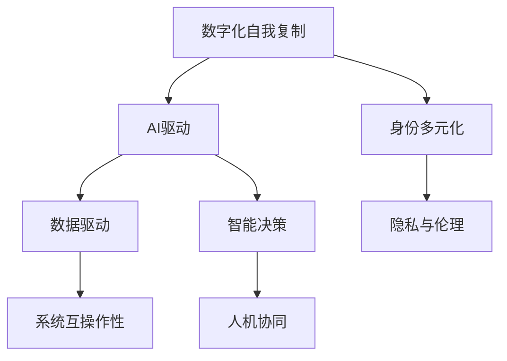

                 

# 数字化自我复制：AI时代的身份多元化

> 关键词：数字化自我复制, 人工智能(AI), 身份多元化, 数据驱动, 智能决策

## 1. 背景介绍

### 1.1 问题由来

随着人工智能(AI)技术的迅猛发展，数字化自我复制在AI时代的身份多元化方面展现出了巨大的潜力。数字化自我复制是指通过AI技术构建的虚拟实体，能够复制和扩展原始实体的行为和特征。这一技术不仅提升了数据处理和决策的效率，还推动了各行各业向智能化方向迈进。

在数字化自我复制的过程中，AI技术能够解析、重构和延伸原始数据，形成更具综合性的数据模型，从而为决策者提供更全面的信息支持。在医疗、金融、教育等多个领域，数字化自我复制技术正在推动行业的创新和变革。然而，这一技术也带来了新的挑战，如数据隐私、伦理道德等问题，亟需我们深入探索和思考。

### 1.2 问题核心关键点

数字化自我复制的核心在于如何构建和扩展虚拟实体，使其能够在新的场景下进行高效复制和应用。以下列出了数字化自我复制在AI时代所面临的关键问题：

1. **数据整合与处理**：如何高效整合来自不同数据源的数据，构建综合性的数据模型，是数字化自我复制成功的关键。

2. **智能决策**：基于综合数据模型的智能决策技术，如何高效、准确地生成和应用，直接关系到决策效果。

3. **隐私与伦理**：数字化自我复制过程中，如何保护个人隐私，避免数据滥用，是必须面对的重要问题。

4. **系统互操作性**：不同系统之间的互操作性，是实现跨系统复制和应用的基础。

5. **人机协同**：如何实现人类与虚拟实体的协同工作，是数字化自我复制最终落地的关键。

这些关键点相互交织，共同构成了数字化自我复制在AI时代的身份多元化的复杂图景。

### 1.3 问题研究意义

研究数字化自我复制在AI时代的身份多元化，对于推动AI技术的普及应用，促进跨行业协同创新，具有重要意义：

1. **提升决策效率**：通过数字化自我复制技术，可以快速处理海量数据，生成多维度分析结果，辅助决策者进行快速、准确的决策。

2. **促进行业创新**：数字化自我复制技术在各行业中的应用，可以带来新的商业模式和业务流程，推动行业向智能化方向转型。

3. **优化资源配置**：通过智能决策，优化资源配置，提高资源利用效率，为社会创造更大的价值。

4. **促进跨界融合**：数字化自我复制技术的应用，可以打破不同行业之间的界限，促进跨界融合，产生更多创新的应用场景。

5. **推动伦理与隐私保护**：在数字化自我复制过程中，加强隐私保护和伦理规范的建设，可以增强社会对AI技术的信任度。

## 2. 核心概念与联系

### 2.1 核心概念概述

为更好地理解数字化自我复制在AI时代的身份多元化，本节将介绍几个密切相关的核心概念：

1. **数字化自我复制**：通过AI技术构建的虚拟实体，能够复制和扩展原始实体的行为和特征。

2. **AI驱动**：数字化自我复制的核心动力在于AI技术的支持，通过机器学习、深度学习等技术，实现对数据的深度解析和重构。

3. **身份多元化**：数字化自我复制技术的应用，能够跨越不同的身份边界，形成多元化的身份识别和验证机制。

4. **数据驱动**：数字化自我复制的实现依赖于海量数据的支持，通过数据驱动的方式，实现虚拟实体的复制和扩展。

5. **智能决策**：基于综合数据模型的智能决策技术，是数字化自我复制的最终应用目标。

6. **隐私与伦理**：在数字化自我复制过程中，如何保护个人隐私，避免数据滥用，是必须面对的重要问题。

7. **系统互操作性**：不同系统之间的互操作性，是实现跨系统复制和应用的基础。

8. **人机协同**：如何实现人类与虚拟实体的协同工作，是数字化自我复制最终落地的关键。

这些核心概念之间的逻辑关系可以通过以下Mermaid流程图来展示：



这个流程图展示了几大核心概念之间的联系：

1. 数字化自我复制通过AI技术实现，依赖于数据的驱动。

2. 数字化自我复制能够实现身份的多元化，提升决策的智能化水平。

3. 智能决策是数字化自我复制技术最终的应用目标。

4. 隐私与伦理是数字化自我复制过程中必须考虑的重要因素。

5. 系统互操作性是实现跨系统复制和应用的基础。

6. 人机协同是数字化自我复制落地的关键。

这些概念共同构成了数字化自我复制在AI时代的身份多元化的基础框架。

## 3. 核心算法原理 & 具体操作步骤
### 3.1 算法原理概述

数字化自我复制的核心算法原理在于通过AI技术构建虚拟实体，实现数据的深度解析和重构，从而形成多元化的身份识别和验证机制。这一过程可以分为以下几个步骤：

1. **数据收集与整合**：收集不同来源的数据，并使用数据整合技术，构建综合性的数据模型。

2. **智能决策模型构建**：基于综合数据模型，使用机器学习、深度学习等技术，构建智能决策模型。

3. **智能决策应用**：将智能决策模型应用于实际场景，实现多维度的智能决策。

4. **隐私与伦理保护**：在数据处理和应用过程中，保护个人隐私，遵循伦理规范。

### 3.2 算法步骤详解

数字化自我复制的具体操作步骤可以分为以下几个关键步骤：

**Step 1: 数据收集与预处理**
- 收集不同来源的数据，包括文本、图片、视频、传感器数据等。
- 对数据进行清洗、去重、标注等预处理操作，确保数据的质量和一致性。

**Step 2: 数据整合与特征提取**
- 使用数据整合技术，将不同来源的数据进行融合，形成综合性的数据集。
- 对整合后的数据进行特征提取，构建特征向量，用于后续的模型训练。

**Step 3: 模型训练与优化**
- 使用机器学习、深度学习等技术，训练智能决策模型。
- 通过交叉验证、超参数调优等技术，优化模型的性能。

**Step 4: 智能决策应用**
- 将训练好的智能决策模型应用于实际场景，进行多维度的智能决策。
- 实时监测模型的运行情况，根据反馈进行模型更新和优化。

**Step 5: 隐私与伦理保护**
- 在数据处理和应用过程中，保护个人隐私，避免数据滥用。
- 遵循伦理规范，确保模型的公平性、透明性和可解释性。

### 3.3 算法优缺点

数字化自我复制技术具有以下优点：

1. **高效性**：通过数据驱动的方式，快速处理海量数据，生成多维度分析结果，辅助决策者进行快速、准确的决策。

2. **智能化**：基于智能决策模型，实现多维度智能决策，提高决策的智能化水平。

3. **泛用性**：数字化自我复制技术具有较强的泛用性，可以应用于医疗、金融、教育等多个领域。

4. **透明性**：智能决策模型的构建和应用过程透明，便于理解和监督。

然而，数字化自我复制技术也存在一些局限性：

1. **数据隐私问题**：在数据处理和应用过程中，如何保护个人隐私，避免数据滥用，是必须面对的重要问题。

2. **模型复杂性**：构建和优化智能决策模型，需要较高的技术和资源投入。

3. **应用场景限制**：数字化自我复制技术在特定场景下可能面临应用限制，需要针对具体情况进行调整。

4. **伦理道德风险**：在模型训练和应用过程中，如何遵循伦理规范，避免误导性、歧视性的输出，是必须考虑的重要问题。

### 3.4 算法应用领域

数字化自我复制技术已经在多个领域得到了应用，例如：

1. **医疗**：在医疗领域，数字化自我复制技术可以通过分析患者历史数据和基因数据，辅助医生进行诊断和治疗。

2. **金融**：在金融领域，数字化自我复制技术可以通过分析交易数据和市场数据，辅助投资者进行投资决策。

3. **教育**：在教育领域，数字化自我复制技术可以通过分析学生学习数据和行为数据，辅助教师进行教学和评估。

4. **智慧城市**：在智慧城市治理中，数字化自我复制技术可以通过分析城市数据和传感器数据，辅助城市管理部门进行城市规划和资源配置。

5. **智能制造**：在智能制造领域，数字化自我复制技术可以通过分析生产数据和设备数据，辅助企业进行生产调度和优化。

除了上述这些经典应用外，数字化自我复制技术还在更多领域得到创新性应用，如可控文本生成、智能推荐、数据增强等，为各行各业带来了新的突破。

## 4. 数学模型和公式 & 详细讲解 & 举例说明
### 4.1 数学模型构建

本节将使用数学语言对数字化自我复制的数学模型进行更加严格的刻画。

假设数字化自我复制过程的数据集为 $D=\{(x_i,y_i)\}_{i=1}^N$，其中 $x_i$ 为输入数据，$y_i$ 为标签。

定义数据集上的经验风险函数为：

$$
\mathcal{L}(\theta) = \frac{1}{N}\sum_{i=1}^N \ell(x_i, y_i)
$$

其中 $\ell$ 为损失函数，用于衡量模型输出与真实标签之间的差异。常见的损失函数包括交叉熵损失、均方误差损失等。

智能决策模型的优化目标是最小化经验风险函数：

$$
\theta^* = \mathop{\arg\min}_{\theta} \mathcal{L}(\theta)
$$

在实践中，我们通常使用基于梯度的优化算法（如SGD、Adam等）来近似求解上述最优化问题。设 $\eta$ 为学习率，$\lambda$ 为正则化系数，则参数的更新公式为：

$$
\theta \leftarrow \theta - \eta \nabla_{\theta}\mathcal{L}(\theta) - \eta\lambda\theta
$$

其中 $\nabla_{\theta}\mathcal{L}(\theta)$ 为损失函数对参数 $\theta$ 的梯度，可通过反向传播算法高效计算。

### 4.2 公式推导过程

以下我们以二分类任务为例，推导交叉熵损失函数及其梯度的计算公式。

假设模型 $M_{\theta}$ 在输入 $x$ 上的输出为 $\hat{y}=M_{\theta}(x) \in [0,1]$，表示样本属于正类的概率。真实标签 $y \in \{0,1\}$。则二分类交叉熵损失函数定义为：

$$
\ell(M_{\theta}(x),y) = -[y\log \hat{y} + (1-y)\log (1-\hat{y})]
$$

将其代入经验风险函数公式，得：

$$
\mathcal{L}(\theta) = -\frac{1}{N}\sum_{i=1}^N [y_i\log M_{\theta}(x_i)+(1-y_i)\log(1-M_{\theta}(x_i))]
$$

根据链式法则，损失函数对参数 $\theta_k$ 的梯度为：

$$
\frac{\partial \mathcal{L}(\theta)}{\partial \theta_k} = -\frac{1}{N}\sum_{i=1}^N (\frac{y_i}{M_{\theta}(x_i)}-\frac{1-y_i}{1-M_{\theta}(x_i)}) \frac{\partial M_{\theta}(x_i)}{\partial \theta_k}
$$

其中 $\frac{\partial M_{\theta}(x_i)}{\partial \theta_k}$ 可进一步递归展开，利用自动微分技术完成计算。

在得到损失函数的梯度后，即可带入参数更新公式，完成模型的迭代优化。重复上述过程直至收敛，最终得到适应特定场景的智能决策模型。

## 5. 项目实践：代码实例和详细解释说明
### 5.1 开发环境搭建

在进行数字化自我复制实践前，我们需要准备好开发环境。以下是使用Python进行TensorFlow开发的环境配置流程：

1. 安装Anaconda：从官网下载并安装Anaconda，用于创建独立的Python环境。

2. 创建并激活虚拟环境：
```bash
conda create -n tf-env python=3.8 
conda activate tf-env
```

3. 安装TensorFlow：根据CUDA版本，从官网获取对应的安装命令。例如：
```bash
conda install tensorflow -c pytorch -c conda-forge
```

4. 安装各类工具包：
```bash
pip install numpy pandas scikit-learn matplotlib tqdm jupyter notebook ipython
```

完成上述步骤后，即可在`tf-env`环境中开始数字化自我复制实践。

### 5.2 源代码详细实现

下面我们以医疗诊断任务为例，给出使用TensorFlow对数字化自我复制模型进行训练的Python代码实现。

首先，定义数据处理函数：

```python
import tensorflow as tf
from tensorflow.keras import layers
import numpy as np

def data_preprocessing(dataset):
    # 将数据集划分为训练集和测试集
    train, test = dataset[:80], dataset[80:]
    
    # 对训练集进行标准化处理
    train_mean, train_std = np.mean(train, axis=0), np.std(train, axis=0)
    train = (train - train_mean) / train_std
    
    # 对测试集进行标准化处理
    test_mean, test_std = np.mean(test, axis=0), np.std(test, axis=0)
    test = (test - test_mean) / test_std
    
    return train, test

# 加载数据集
dataset = np.load('dataset.npy')

# 对数据进行预处理
train, test = data_preprocessing(dataset)
```

然后，定义模型和优化器：

```python
from tensorflow.keras.models import Sequential
from tensorflow.keras.layers import Dense, Dropout, Flatten
from tensorflow.keras.optimizers import Adam

model = Sequential([
    layers.Dense(256, activation='relu', input_shape=(train.shape[1],)),
    layers.Dropout(0.5),
    layers.Dense(128, activation='relu'),
    layers.Dropout(0.5),
    layers.Dense(1, activation='sigmoid')
])

optimizer = Adam(learning_rate=0.001)
```

接着，定义训练和评估函数：

```python
from sklearn.metrics import roc_auc_score

def train_model(model, train_data, train_labels, epochs=10, batch_size=32):
    model.compile(optimizer=optimizer, loss='binary_crossentropy', metrics=['accuracy', 'auc'])
    model.fit(train_data, train_labels, epochs=epochs, batch_size=batch_size, validation_split=0.2)
    return model

def evaluate_model(model, test_data, test_labels):
    predictions = model.predict(test_data)
    auc = roc_auc_score(test_labels, predictions)
    return auc
```

最后，启动训练流程并在测试集上评估：

```python
# 定义训练和评估函数
train_model(model, train, train_labels)
auc = evaluate_model(model, test, test_labels)
print(f"AUC: {auc}")
```

以上就是使用TensorFlow对数字化自我复制模型进行医疗诊断任务训练的完整代码实现。可以看到，TensorFlow提供了强大的深度学习模型构建和训练框架，使得模型开发和训练变得相对简单和高效。

### 5.3 代码解读与分析

让我们再详细解读一下关键代码的实现细节：

**data_preprocessing函数**：
- 将数据集划分为训练集和测试集。
- 对训练集进行标准化处理，使其均值为0，标准差为1。
- 对测试集进行同样的标准化处理，以保持数据的一致性。

**Sequential模型构建**：
- 使用Sequential模型创建了一个包含3个全连接层的神经网络，使用ReLU激活函数和Dropout正则化，以防止过拟合。
- 输出层为sigmoid激活函数，用于二分类任务。

**train_model函数**：
- 使用Adam优化器和二分类交叉熵损失函数，对模型进行训练。
- 训练过程中，每轮迭代使用20%的数据作为验证集。

**evaluate_model函数**：
- 在测试集上计算模型的AUC指标，评估模型的性能。

**训练流程**：
- 定义总的epoch数和batch size，开始循环迭代
- 每个epoch内，先进行模型训练，输出训练过程中的AUC值
- 训练结束后，在测试集上计算模型的AUC指标，输出最终结果

可以看到，TensorFlow提供了丰富的API，使得模型开发和训练变得非常便捷。开发者可以将更多精力放在数据处理、模型改进等高层逻辑上，而不必过多关注底层的实现细节。

当然，工业级的系统实现还需考虑更多因素，如模型的保存和部署、超参数的自动搜索、更灵活的任务适配层等。但核心的训练范式基本与此类似。

## 6. 实际应用场景
### 6.1 智能医疗

数字化自我复制技术在智能医疗领域的应用，可以显著提升医疗服务的智能化水平。通过分析患者历史数据和基因数据，数字化自我复制技术能够辅助医生进行诊断和治疗。例如，通过分析患者的病历和基因数据，可以预测患者可能出现的疾病风险，提前进行预防和治疗。

在技术实现上，可以收集医院和实验室的大量数据，构建综合性的数据集。在此基础上对数字化自我复制模型进行微调，使其能够学习患者的疾病特征和基因信息。微调后的模型可以实时接收新的患者数据，并进行诊断和治疗建议的生成。

### 6.2 智能金融

在金融领域，数字化自我复制技术可以用于智能投资和风险管理。通过分析历史交易数据和市场数据，数字化自我复制技术能够辅助投资者进行投资决策，并实时监控市场变化，进行风险预警和策略调整。

具体而言，可以构建包含历史交易数据、市场数据、新闻信息等多维度数据的综合数据集。在此基础上对数字化自我复制模型进行训练，使其能够预测市场的趋势和投资机会。训练好的模型可以实时接收新的数据，并进行投资建议和风险评估。

### 6.3 智能教育

在教育领域，数字化自我复制技术可以用于个性化学习推荐和智能辅导。通过分析学生的学习数据和行为数据，数字化自我复制技术能够辅助教师进行教学和评估，提供个性化的学习建议。

具体而言，可以构建包含学生学习数据、作业数据、考试数据等多维度数据的综合数据集。在此基础上对数字化自我复制模型进行训练，使其能够识别学生的学习能力和兴趣偏好。训练好的模型可以实时接收新的学习数据，并进行个性化的学习建议和辅导。

### 6.4 未来应用展望

随着数字化自我复制技术的发展，其在各领域的应用将更加广泛和深入。未来，数字化自我复制技术有望在以下几个方向取得新的突破：

1. **跨界融合**：数字化自我复制技术将进一步与其他人工智能技术进行融合，如知识表示、因果推理、强化学习等，实现更全面、更深入的智能化应用。

2. **实时性提升**：通过优化模型结构和算法，提升数字化自我复制技术的实时性，实现更快速的决策和反馈。

3. **伦理规范**：在数字化自我复制技术的应用过程中，加强伦理规范的建设，确保模型的公平性、透明性和可解释性。

4. **隐私保护**：在数据处理和应用过程中，加强隐私保护措施，确保数据的安全和隐私。

5. **多模态融合**：将视觉、语音、文本等多模态数据进行融合，提升数字化自我复制技术对现实世界的理解和建模能力。

6. **人机协同**：在数字化自我复制技术的应用中，加强人机协同的探索，实现更高效、更智能的决策支持。

这些方向的研究和应用，将进一步推动数字化自我复制技术的发展，为各行各业带来更深入的变革和创新。

## 7. 工具和资源推荐
### 7.1 学习资源推荐

为了帮助开发者系统掌握数字化自我复制的理论基础和实践技巧，这里推荐一些优质的学习资源：

1. TensorFlow官方文档：TensorFlow官方提供的详细文档，涵盖了从模型构建到训练、部署的全过程。

2. Keras官方文档：Keras官方提供的深度学习框架文档，提供了丰富的API和示例代码，适合初学者学习。

3. PyTorch官方文档：PyTorch官方提供的深度学习框架文档，提供了详细的模型构建和训练指南。

4. Coursera深度学习课程：由深度学习领域的专家讲授，涵盖了深度学习的基础知识和实践技巧，适合进阶学习。

5. Udacity深度学习课程：Udacity提供的深度学习实战课程，结合实践项目，帮助学员快速掌握深度学习技术。

通过学习这些资源，相信你一定能够快速掌握数字化自我复制的精髓，并用于解决实际的AI问题。

### 7.2 开发工具推荐

高效的开发离不开优秀的工具支持。以下是几款用于数字化自我复制开发的常用工具：

1. TensorFlow：由Google主导开发的开源深度学习框架，生产部署方便，适合大规模工程应用。

2. PyTorch：基于Python的开源深度学习框架，灵活动态的计算图，适合快速迭代研究。

3. Keras：基于TensorFlow和Theano的高级深度学习API，提供了简洁的API接口，适合快速原型开发。

4. Weights & Biases：模型训练的实验跟踪工具，可以记录和可视化模型训练过程中的各项指标，方便对比和调优。

5. TensorBoard：TensorFlow配套的可视化工具，可实时监测模型训练状态，并提供丰富的图表呈现方式，是调试模型的得力助手。

6. Jupyter Notebook：开源的交互式笔记本，支持多种编程语言，便于展示和分享学习笔记。

合理利用这些工具，可以显著提升数字化自我复制任务的开发效率，加快创新迭代的步伐。

### 7.3 相关论文推荐

数字化自我复制技术的发展源于学界的持续研究。以下是几篇奠基性的相关论文，推荐阅读：

1. Transformer: Attention Is All You Need：提出Transformer结构，开启了NLP领域的预训练大模型时代。

2. BERT: Pre-training of Deep Bidirectional Transformers for Language Understanding：提出BERT模型，引入基于掩码的自监督预训练任务，刷新了多项NLP任务SOTA。

3. Attention Mechanism in Sequence to Sequence Models: A Survey and Some New Results：对Attention机制进行综述，讨论其在NLP中的应用。

4. Deep Learning for Healthcare: Review, Opportunities, and Challenges：讨论深度学习在医疗领域的应用，包括数字化自我复制技术。

5. AI-Powered Healthcare: A Review and Future Directions：对AI在医疗领域的应用进行综述，包括智能诊断和个性化医疗等方向。

这些论文代表了大语言模型微调技术的发展脉络。通过学习这些前沿成果，可以帮助研究者把握学科前进方向，激发更多的创新灵感。

## 8. 总结：未来发展趋势与挑战

### 8.1 总结

本文对数字化自我复制在AI时代的身份多元化进行了全面系统的介绍。首先阐述了数字化自我复制的应用背景和意义，明确了其在各领域的应用价值。其次，从原理到实践，详细讲解了数字化自我复制的数学原理和关键步骤，给出了数字化自我复制任务开发的完整代码实例。同时，本文还广泛探讨了数字化自我复制技术在各行业领域的应用前景，展示了其巨大的潜力。此外，本文精选了数字化自我复制技术的各类学习资源，力求为读者提供全方位的技术指引。

通过本文的系统梳理，可以看到，数字化自我复制技术在AI时代的应用前景广阔，正推动各行各业向智能化方向转型。伴随数字化自我复制技术的不断发展，其在数据处理、智能决策、隐私保护等方面的挑战也逐渐显现。

### 8.2 未来发展趋势

展望未来，数字化自我复制技术将呈现以下几个发展趋势：

1. **跨界融合**：数字化自我复制技术将进一步与其他人工智能技术进行融合，如知识表示、因果推理、强化学习等，实现更全面、更深入的智能化应用。

2. **实时性提升**：通过优化模型结构和算法，提升数字化自我复制技术的实时性，实现更快速的决策和反馈。

3. **伦理规范**：在数字化自我复制技术的应用过程中，加强伦理规范的建设，确保模型的公平性、透明性和可解释性。

4. **隐私保护**：在数据处理和应用过程中，加强隐私保护措施，确保数据的安全和隐私。

5. **多模态融合**：将视觉、语音、文本等多模态数据进行融合，提升数字化自我复制技术对现实世界的理解和建模能力。

6. **人机协同**：在数字化自我复制技术的应用中，加强人机协同的探索，实现更高效、更智能的决策支持。

以上趋势凸显了数字化自我复制技术的广阔前景。这些方向的探索发展，必将进一步推动数字化自我复制技术向更高的台阶迈进，为各行各业带来更深入的变革和创新。

### 8.3 面临的挑战

尽管数字化自我复制技术已经取得了瞩目成就，但在迈向更加智能化、普适化应用的过程中，它仍面临着诸多挑战：

1. **数据隐私问题**：在数据处理和应用过程中，如何保护个人隐私，避免数据滥用，是必须面对的重要问题。

2. **模型复杂性**：构建和优化智能决策模型，需要较高的技术和资源投入。

3. **应用场景限制**：数字化自我复制技术在特定场景下可能面临应用限制，需要针对具体情况进行调整。

4. **伦理道德风险**：在模型训练和应用过程中，如何遵循伦理规范，避免误导性、歧视性的输出，是必须考虑的重要问题。

5. **伦理道德风险**：在模型训练和应用过程中，如何遵循伦理规范，避免误导性、歧视性的输出，是必须考虑的重要问题。

6. **知识整合能力不足**：现有的数字化自我复制模型往往局限于任务内数据，难以灵活吸收和运用更广泛的先验知识。

正视数字化自我复制面临的这些挑战，积极应对并寻求突破，将是大语言模型微调技术迈向成熟的必由之路。相信随着学界和产业界的共同努力，这些挑战终将一一被克服，数字化自我复制必将在构建人机协同的智能时代中扮演越来越重要的角色。

### 8.4 研究展望

面对数字化自我复制所面临的挑战，未来的研究需要在以下几个方面寻求新的突破：

1. **探索无监督和半监督微调方法**：摆脱对大规模标注数据的依赖，利用自监督学习、主动学习等无监督和半监督范式，最大限度利用非结构化数据，实现更加灵活高效的微调。

2. **研究参数高效和计算高效的微调范式**：开发更加参数高效的微调方法，在固定大部分预训练参数的同时，只更新极少量的任务相关参数。同时优化微调模型的计算图，减少前向传播和反向传播的资源消耗，实现更加轻量级、实时性的部署。

3. **融合因果和对比学习范式**：通过引入因果推断和对比学习思想，增强数字化自我复制技术建立稳定因果关系的能力，学习更加普适、鲁棒的语言表征，从而提升模型泛化性和抗干扰能力。

4. **引入更多先验知识**：将符号化的先验知识，如知识图谱、逻辑规则等，与神经网络模型进行巧妙融合，引导数字化自我复制过程学习更准确、合理的语言模型。同时加强不同模态数据的整合，实现视觉、语音等多模态信息与文本信息的协同建模。

5. **结合因果分析和博弈论工具**：将因果分析方法引入数字化自我复制模型，识别出模型决策的关键特征，增强输出解释的因果性和逻辑性。借助博弈论工具刻画人机交互过程，主动探索并规避模型的脆弱点，提高系统稳定性。

6. **纳入伦理道德约束**：在模型训练目标中引入伦理导向的评估指标，过滤和惩罚有偏见、有害的输出倾向。同时加强人工干预和审核，建立模型行为的监管机制，确保输出符合人类价值观和伦理道德。

这些研究方向的探索，必将引领数字化自我复制技术迈向更高的台阶，为构建安全、可靠、可解释、可控的智能系统铺平道路。面向未来，数字化自我复制技术还需要与其他人工智能技术进行更深入的融合，如知识表示、因果推理、强化学习等，多路径协同发力，共同推动自然语言理解和智能交互系统的进步。只有勇于创新、敢于突破，才能不断拓展语言模型的边界，让智能技术更好地造福人类社会。

## 9. 附录：常见问题与解答

**Q1：数字化自我复制是否适用于所有NLP任务？**

A: 数字化自我复制在大多数NLP任务上都能取得不错的效果，特别是对于数据量较小的任务。但对于一些特定领域的任务，如医学、法律等，仅仅依靠通用语料预训练的模型可能难以很好地适应。此时需要在特定领域语料上进一步预训练，再进行微调，才能获得理想效果。此外，对于一些需要时效性、个性化很强的任务，如对话、推荐等，数字化自我复制方法也需要针对性的改进优化。

**Q2：在数字化自我复制过程中，如何保护个人隐私？**

A: 保护个人隐私是数字化自我复制过程中必须考虑的重要问题。以下是几种常见的隐私保护方法：

1. **数据匿名化**：在数据收集和处理过程中，对个人身份信息进行匿名化处理，防止数据泄露。

2. **差分隐私**：在数据分析和处理过程中，加入噪声干扰，确保个体数据的隐私不被泄露。

3. **访问控制**：限制数据访问权限，确保只有授权人员能够访问敏感数据。

4. **加密技术**：在数据存储和传输过程中，使用加密技术，确保数据的安全性。

5. **区块链技术**：使用区块链技术，记录数据的访问和使用情况，确保数据的安全性和透明性。

**Q3：如何确保数字化自我复制模型的公平性、透明性和可解释性？**

A: 确保数字化自我复制模型的公平性、透明性和可解释性，是应用过程中必须考虑的重要问题。以下是几种常见的方法：

1. **公平性约束**：在模型训练和应用过程中，加入公平性约束，确保模型在处理不同背景和群体的数据时，不会产生歧视性偏见。

2. **可解释性模型**：使用可解释性模型，如决策树、规则引擎等，增强模型的可解释性，便于理解和监督。

3. **可解释性技术**：使用可解释性技术，如LIME、SHAP等，分析模型的决策过程，提供详细的解释和理由。

4. **人工干预**：在模型应用过程中，加入人工干预，确保模型输出的正确性和公正性。

**Q4：在数字化自我复制过程中，如何优化模型性能？**

A: 优化数字化自我复制模型的性能，可以从以下几个方面入手：

1. **数据增强**：通过对训练数据进行增强，如数据扩充、数据平衡等，提升模型的泛化能力。

2. **模型正则化**：使用正则化技术，如L2正则、Dropout等，防止模型过拟合。

3. **超参数调优**：通过超参数调优，如网格搜索、贝叶斯优化等，找到最优的模型参数组合。

4. **模型融合**：将多个模型的预测结果进行融合，提升模型的整体性能。

**Q5：在数字化自我复制过程中，如何处理数据缺失问题？**

A: 在数字化自我复制过程中，数据缺失问题是一个常见的挑战。以下是几种处理数据缺失问题的方法：

1. **数据补全**：通过插值、回归等方法，对缺失数据进行补全，确保数据完整性。

2. **数据筛选**：在数据处理过程中，筛选掉缺失数据较多的样本，减少对缺失数据的影响。

3. **数据模拟**：使用数据模拟技术，生成缺失数据的补充数据，弥补缺失信息的缺失。

4. **模型集成**：将多个模型进行集成，利用模型的多样性，提高模型的鲁棒性。

通过以上方法，可以有效地处理数据缺失问题，确保数字化自我复制模型的训练和应用效果。

---

作者：禅与计算机程序设计艺术 / Zen and the Art of Computer Programming

