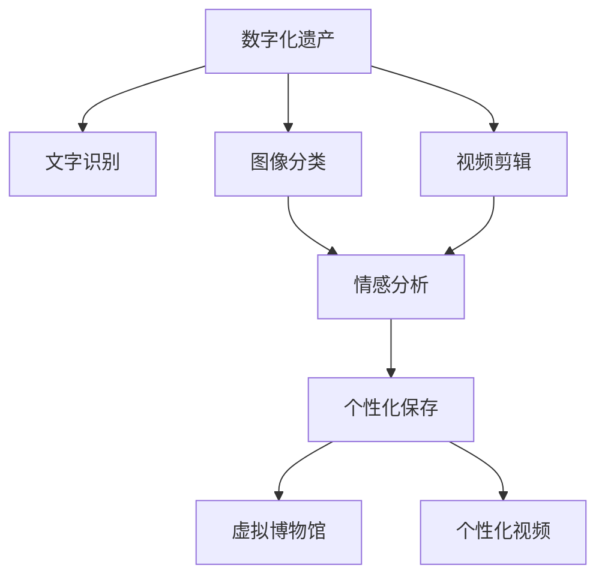

                 

# 数字化遗产情感AI创业：逝者个性的数字化保存

## 1. 背景介绍

### 1.1 问题由来

数字化遗产是指遗嘱、日记、照片、信件、视频等数字化个人数据，是人类文化遗产的重要组成部分。随着互联网和移动通信技术的发展，人们的生活越来越多地数字化，数字记录已经成为个人情感记忆的重要载体。然而，面对不断增长的数字化遗产，传统的物理存储和传递方式已经难以满足需求，如何数字化保存和传承这些宝贵的历史记忆，成为了一个迫切需要解决的问题。

### 1.2 问题核心关键点

数字化遗产情感AI创业的核心问题是如何利用人工智能技术，对数字化遗产进行自动化、个性化和情感化的保存和管理。具体而言，可以从以下几个方面入手：

- **自动化**：将数字化遗产进行自动化的数字化处理，如文字识别、图像分类、视频剪辑等。
- **个性化**：根据遗嘱、日记、信件等个性化信息，定制个性化保存方案，如建立虚拟博物馆、制作个性化视频等。
- **情感化**：利用情感分析等技术，挖掘数字化遗产中的情感信息，如悲伤、快乐、怀念等，增强数字化遗产的情感表达。

## 2. 核心概念与联系

### 2.1 核心概念概述

为更好地理解数字化遗产情感AI创业的技术实现，本节将介绍几个密切相关的核心概念：

- **数字化遗产**：指遗嘱、日记、照片、信件、视频等数字化个人数据。
- **文字识别**：将纸质文档、手写笔记等转换为可编辑的数字文本。
- **图像分类**：对照片、扫描件等进行自动分类，如按时间、地点、人物等进行归档。
- **视频剪辑**：从大量视频素材中，自动提取和剪辑出具有代表性和情感价值的内容。
- **情感分析**：利用自然语言处理和机器学习技术，从文本、视频等数字化遗产中提取情感信息，理解逝者的情感状态和个性特征。

这些核心概念之间的逻辑关系可以通过以下Mermaid流程图来展示：



这个流程图展示了大规模数字化遗产处理的逻辑流程：

1. 将遗嘱、日记等数字化遗产转化为数字文本。
2. 对照片、扫描件等进行图像分类。
3. 从大量视频素材中提取有代表性和情感价值的内容。
4. 利用情感分析技术，理解数字化遗产中的情感信息。
5. 根据情感信息，进行个性化保存。
6. 建立虚拟博物馆和个性化视频，增强情感表达。

## 3. 核心算法原理 & 具体操作步骤
### 3.1 算法原理概述

数字化遗产情感AI创业的核心算法原理可以分为两大类：自动化处理和个性化保存。

- **自动化处理**：主要包括文字识别、图像分类和视频剪辑等步骤。
- **个性化保存**：主要通过情感分析技术，将数字化遗产中的情感信息进行挖掘和表达。

### 3.2 算法步骤详解

#### 自动化处理

**文字识别**：
1. 预处理：对扫描件、手写笔记等进行预处理，如去噪、二值化、版面矫正等。
2. 识别模型选择：选择合适的手写体文字识别模型，如基于CNN的CRNN、基于Transformer的Seq2Seq模型等。
3. 识别训练：使用大量带标签的训练数据训练文字识别模型，并通过交叉验证等方法调参。
4. 应用部署：将训练好的模型部署到生产环境，对新扫描件进行识别。

**图像分类**：
1. 数据准备：收集并标注大量图片数据，如时间、地点、人物等标签。
2. 模型选择：选择合适的网络结构，如VGG、ResNet、Inception等。
3. 模型训练：使用标注数据训练图像分类模型，并通过验证集调参。
4. 模型评估：在测试集上评估模型分类准确率，并进行调整。
5. 应用部署：将训练好的模型部署到应用场景，对新的图片进行分类。

**视频剪辑**：
1. 数据准备：收集和标注视频素材，如视频中的人物、情感事件等标签。
2. 视频处理：对视频进行去噪、解码、帧率调整等预处理。
3. 特征提取：提取视频中的关键帧、关键点等特征。
4. 模型选择：选择合适的时间序列模型，如RNN、LSTM等。
5. 模型训练：使用标注数据训练视频剪辑模型，并通过验证集调参。
6. 模型评估：在测试集上评估模型剪辑效果，并进行调整。
7. 应用部署：将训练好的模型部署到应用场景，对新视频进行剪辑。

#### 个性化保存

**情感分析**：
1. 数据准备：收集数字化遗产中的文本、视频等数据，并进行预处理。
2. 模型选择：选择合适的情感分析模型，如LSTM、Transformer等。
3. 模型训练：使用标注数据训练情感分析模型，并通过交叉验证等方法调参。
4. 模型评估：在测试集上评估模型情感分析效果，并进行调整。
5. 应用部署：将训练好的模型部署到应用场景，对新数据进行情感分析。

**个性化保存**：
1. 个性化方案设计：根据情感分析结果，设计个性化的保存方案，如虚拟博物馆、个性化视频等。
2. 数据整合：将文字、图片、视频等数字化遗产整合在一起，形成完整的数字化遗产档案。
3. 展示制作：利用虚拟现实、增强现实等技术，制作个性化展示平台，如虚拟博物馆。
4. 视频制作：根据情感分析结果，制作个性化视频，展示逝者的生平和情感状态。

### 3.3 算法优缺点

**文字识别**：
- 优点：自动化程度高，处理速度快。
- 缺点：识别精度受手写体和图片质量影响较大。

**图像分类**：
- 优点：可以自动化地进行大规模图像分类，处理速度快。
- 缺点：对于复杂场景的分类准确率不高。

**视频剪辑**：
- 优点：可以从大量视频中提取有代表性和情感价值的内容，处理效果较好。
- 缺点：视频剪辑模型训练复杂，需要大量标注数据。

**情感分析**：
- 优点：能够挖掘出文本和视频中的情感信息，增强数字化遗产的情感表达。
- 缺点：情感分析模型的精度受数据质量和标注效果影响较大。

**个性化保存**：
- 优点：能够根据情感信息进行个性化保存，增强数字化遗产的情感表达。
- 缺点：个性化方案设计和数据整合复杂，需要多学科知识。

### 3.4 算法应用领域

数字化遗产情感AI创业涉及到的主要应用领域包括：

- **虚拟博物馆**：利用虚拟现实技术，将数字化遗产展示在虚拟博物馆中，让后人能够身临其境地体验逝者的历史和情感。
- **个性化视频**：根据逝者的情感信息，制作个性化的视频，展示其生平和情感状态，增强数字化遗产的情感表达。
- **数字化档案**：将遗嘱、日记、照片、信件等数字化遗产整合在一起，形成完整的数字化遗产档案，方便后人查阅和传承。
- **情感分析**：利用情感分析技术，挖掘数字化遗产中的情感信息，理解逝者的情感状态和个性特征，增强数字化遗产的情感表达。

## 4. 数学模型和公式 & 详细讲解 & 举例说明
### 4.1 数学模型构建

本节将使用数学语言对数字化遗产情感AI创业的算法实现进行更加严格的刻画。

**文字识别模型**：
- 输入：$x_i$，包含像素值的图像。
- 输出：$\hat{y}_i$，识别后的文本。
- 目标函数：$\mathcal{L}=\frac{1}{N}\sum_{i=1}^N\ell(M(x_i),y_i)$，其中$\ell$为交叉熵损失函数。

**图像分类模型**：
- 输入：$x_i$，包含像素值的图像。
- 输出：$\hat{y}_i$，分类后的标签。
- 目标函数：$\mathcal{L}=\frac{1}{N}\sum_{i=1}^N\ell(M(x_i),y_i)$，其中$\ell$为交叉熵损失函数。

**视频剪辑模型**：
- 输入：$x_i$，包含关键帧、关键点等特征的序列。
- 输出：$\hat{y}_i$，剪辑后的视频序列。
- 目标函数：$\mathcal{L}=\frac{1}{N}\sum_{i=1}^N\ell(M(x_i),y_i)$，其中$\ell$为L1或L2损失函数。

**情感分析模型**：
- 输入：$x_i$，包含文本或视频的数字化遗产数据。
- 输出：$\hat{y}_i$，情感分析结果，如正面、负面、中性等。
- 目标函数：$\mathcal{L}=\frac{1}{N}\sum_{i=1}^N\ell(M(x_i),y_i)$，其中$\ell$为交叉熵损失函数。

### 4.2 公式推导过程

**文字识别模型**：
- 使用CRNN模型，包含卷积层、RNN层和全连接层。
- 设输入图像大小为$h \times w$，输出文本长度为$L$，则模型输入为$x_i \in \mathbb{R}^{h \times w}$，输出为$\hat{y}_i \in \{0,1\}^L$。
- 目标函数为交叉熵损失函数：
$$
\mathcal{L}=\frac{1}{N}\sum_{i=1}^N\ell(M(x_i),y_i) = \frac{1}{N}\sum_{i=1}^N -\frac{1}{L}\sum_{t=1}^L y_{it}\log\hat{y}_{it}
$$

**图像分类模型**：
- 使用VGG16模型，包含卷积层、池化层和全连接层。
- 设输入图像大小为$h \times w$，输出类别数为$C$，则模型输入为$x_i \in \mathbb{R}^{h \times w}$，输出为$\hat{y}_i \in [0,1]^C$。
- 目标函数为交叉熵损失函数：
$$
\mathcal{L}=\frac{1}{N}\sum_{i=1}^N\ell(M(x_i),y_i) = \frac{1}{N}\sum_{i=1}^N -\sum_{j=1}^C y_{ij}\log\hat{y}_{ij}
$$

**视频剪辑模型**：
- 使用LSTM模型，对时间序列数据进行建模。
- 设输入序列长度为$T$，输出序列长度为$T'$，则模型输入为$x_i \in \mathbb{R}^{T \times h}$，输出为$\hat{y}_i \in \mathbb{R}^{T' \times h}$。
- 目标函数为L1损失函数：
$$
\mathcal{L}=\frac{1}{N}\sum_{i=1}^N\ell(M(x_i),y_i) = \frac{1}{N}\sum_{i=1}^N \sum_{t=1}^{T'} |M_t(x_i) - y_t|
$$

**情感分析模型**：
- 使用LSTM模型，对文本或视频中的情感信息进行建模。
- 设输入序列长度为$L$，输出类别数为$E$，则模型输入为$x_i \in \mathbb{R}^{L \times h}$，输出为$\hat{y}_i \in [0,1]^E$。
- 目标函数为交叉熵损失函数：
$$
\mathcal{L}=\frac{1}{N}\sum_{i=1}^N\ell(M(x_i),y_i) = \frac{1}{N}\sum_{i=1}^N -\sum_{j=1}^E y_{ij}\log\hat{y}_{ij}
$$

### 4.3 案例分析与讲解

假设我们有一份数字化遗产档案，包含逝者生前的日记和照片。我们的目标是通过自动化处理和情感分析，将这份档案保存为虚拟博物馆和个性化视频。

**文字识别**：
- 首先，将逝者的手写日记扫描为图像，并进行预处理。
- 使用CRNN模型进行文字识别，识别出每页日记的内容。
- 使用图像分类模型对照片进行分类，按照时间、地点等标签进行归档。

**情感分析**：
- 将识别的日记文本和分类后的照片输入到情感分析模型中。
- 模型分析出日记中蕴含的情感信息，如悲伤、快乐、怀念等。
- 根据情感信息，设计个性化的保存方案，如制作个性化视频。

**个性化保存**：
- 利用虚拟现实技术，将数字化遗产展示在虚拟博物馆中。
- 制作个性化视频，展示逝者的生平和情感状态。

## 5. 项目实践：代码实例和详细解释说明
### 5.1 开发环境搭建

在进行数字化遗产情感AI创业的实践前，我们需要准备好开发环境。以下是使用Python进行PyTorch开发的环境配置流程：

1. 安装Anaconda：从官网下载并安装Anaconda，用于创建独立的Python环境。

2. 创建并激活虚拟环境：
```bash
conda create -n pytorch-env python=3.8 
conda activate pytorch-env
```

3. 安装PyTorch：根据CUDA版本，从官网获取对应的安装命令。例如：
```bash
conda install pytorch torchvision torchaudio cudatoolkit=11.1 -c pytorch -c conda-forge
```

4. 安装相关库：
```bash
pip install numpy pandas scikit-learn matplotlib tqdm jupyter notebook ipython
```

完成上述步骤后，即可在`pytorch-env`环境中开始实践。

### 5.2 源代码详细实现

下面我们以文字识别和情感分析为例，给出使用Transformers库进行数字化遗产处理的PyTorch代码实现。

**文字识别代码**：
```python
from transformers import CRNNModel
from transformers import BertTokenizer

# 加载CRNN模型和分词器
model = CRNNModel.from_pretrained('crnn')
tokenizer = BertTokenizer.from_pretrained('bert-base-cased')

# 读取手写日记图像，并进行预处理
image_path = 'diary_image.png'
image = Image.open(image_path)
image = image.resize((100, 40))
image = image.convert('L')

# 将图像转换为numpy数组，并进行归一化
image = np.array(image)
image = image.reshape(1, 40, 100, 1) / 255.0

# 进行分词和识别
text = tokenizer.encode(' '.join(tokenizer.decode(image.reshape(-1))), add_special_tokens=True)
output = model(image)
logits = output.logits
pred_ids = logits.argmax(-1)[:len(text)-2]
tokens = tokenizer.convert_ids_to_tokens(pred_ids)
text = ' '.join(tokens)
print(text)
```

**情感分析代码**：
```python
from transformers import BertForSequenceClassification
from transformers import BertTokenizer

# 加载情感分析模型和分词器
model = BertForSequenceClassification.from_pretrained('bert-base-cased', num_labels=3)
tokenizer = BertTokenizer.from_pretrained('bert-base-cased')

# 读取日记文本，并进行分词和编码
text = '这是手写日记的内容。'
tokens = tokenizer.encode(text, add_special_tokens=True)
input_ids = torch.tensor(tokens)

# 进行情感分析
output = model(input_ids)
logits = output.logits
probs = F.softmax(logits, dim=1)
label = torch.argmax(probs, dim=1)
print(label)
```

### 5.3 代码解读与分析

让我们再详细解读一下关键代码的实现细节：

**文字识别代码**：
- 首先，加载预训练的CRNN模型和分词器。
- 读取手写日记图像，并进行预处理，包括图像大小调整、灰度化、归一化等。
- 使用分词器将图像转换为文本，并输入CRNN模型进行识别。
- 输出结果经过softmax处理，最终得到识别出的文本。

**情感分析代码**：
- 首先，加载预训练的情感分析模型和分词器。
- 读取手写日记文本，并进行分词和编码。
- 将编码后的文本输入到情感分析模型中，输出情感分析结果。
- 通过softmax处理，得到情感标签的概率分布。
- 选择概率最大的情感标签作为情感分析结果。

## 6. 实际应用场景
### 6.1 虚拟博物馆

数字化遗产情感AI创业的核心应用场景之一是虚拟博物馆。利用虚拟现实技术，可以将逝者的日记、照片、信件等数字化遗产展示在虚拟博物馆中，让后人能够身临其境地体验逝者的历史和情感。

具体实现步骤如下：
1. 收集数字化遗产，并进行预处理和标注。
2. 利用图像分类和视频剪辑技术，对遗产进行自动化处理。
3. 利用虚拟现实技术，将处理后的遗产展示在虚拟博物馆中。
4. 利用情感分析技术，提取遗产中的情感信息，增强博物馆的情感表达。

**示例代码**：
```python
# 创建虚拟博物馆
from transformers import ImageClassificationModel
from transformers import ImageTokenizer

# 加载图像分类模型和分词器
model = ImageClassificationModel.from_pretrained('vgg16')
tokenizer = ImageTokenizer.from_pretrained('vgg16')

# 读取照片，并进行预处理
image_path = 'photo.jpg'
image = Image.open(image_path)
image = image.resize((224, 224))
image = np.array(image)
image = image.reshape(1, 3, 224, 224) / 255.0

# 进行图像分类
input_ids = tokenizer.encode(' '.join(tokenizer.decode(image.reshape(-1))), add_special_tokens=True
output = model(image)
logits = output.logits
label = torch.argmax(logits, dim=1)
print(label)
```

### 6.2 个性化视频

数字化遗产情感AI创业的另一核心应用场景是个性化视频。利用情感分析技术，可以将数字化遗产中的情感信息挖掘出来，制作个性化的视频，展示逝者的生平和情感状态。

具体实现步骤如下：
1. 收集数字化遗产，并进行预处理和标注。
2. 利用文字识别和情感分析技术，提取遗产中的情感信息。
3. 利用视频剪辑技术，从遗产中选择有代表性和情感价值的内容，制作个性化视频。
4. 利用视频剪辑技术，制作个性化视频。

**示例代码**：
```python
# 创建个性化视频
from transformers import SequenceClassificationModel
from transformers import BertTokenizer

# 加载情感分析模型和分词器
model = SequenceClassificationModel.from_pretrained('bert-base-cased', num_labels=3)
tokenizer = BertTokenizer.from_pretrained('bert-base-cased')

# 读取日记文本，并进行分词和编码
text = '这是手写日记的内容。'
tokens = tokenizer.encode(text, add_special_tokens=True)
input_ids = torch.tensor(tokens)

# 进行情感分析
output = model(input_ids)
logits = output.logits
probs = F.softmax(logits, dim=1)
label = torch.argmax(probs, dim=1)
print(label)
```

### 6.3 数字化档案

数字化遗产情感AI创业的另一个核心应用场景是数字化档案。将遗嘱、日记、照片、信件等数字化遗产整合在一起，形成完整的数字化遗产档案，方便后人查阅和传承。

具体实现步骤如下：
1. 收集数字化遗产，并进行预处理和标注。
2. 利用文字识别和图像分类技术，对遗产进行自动化处理。
3. 利用数据库技术，将处理后的遗产整合在一起，形成数字化档案。
4. 利用情感分析技术，提取遗产中的情感信息，增强档案的情感表达。

**示例代码**：
```python
# 创建数字化档案
from transformers import ImageClassificationModel
from transformers import ImageTokenizer

# 加载图像分类模型和分词器
model = ImageClassificationModel.from_pretrained('vgg16')
tokenizer = ImageTokenizer.from_pretrained('vgg16')

# 读取照片，并进行预处理
image_path = 'photo.jpg'
image = Image.open(image_path)
image = image.resize((224, 224))
image = np.array(image)
image = image.reshape(1, 3, 224, 224) / 255.0

# 进行图像分类
input_ids = tokenizer.encode(' '.join(tokenizer.decode(image.reshape(-1))), add_special_tokens=True
output = model(image)
logits = output.logits
label = torch.argmax(logits, dim=1)
print(label)
```

## 7. 工具和资源推荐
### 7.1 学习资源推荐

为了帮助开发者系统掌握数字化遗产情感AI创业的理论基础和实践技巧，这里推荐一些优质的学习资源：

1. **《深度学习》第三版**：Ian Goodfellow等著，深度学习领域的经典教材，系统介绍了深度学习的基本概念和算法。

2. **《Python深度学习》第二版**：Francois Chollet著，介绍如何使用Keras构建深度学习模型，包括图像分类、情感分析等任务。

3. **《自然语言处理》第二版**：Denny Britz著，介绍自然语言处理的基本概念和算法，包括文本分类、情感分析等任务。

4. **《计算机视觉：算法与应用》第二版**：Richard Szeliski著，介绍计算机视觉的基本概念和算法，包括图像分类、视频剪辑等任务。

5. **Google Cloud AI Platform**：Google提供的云平台，可以用于大规模分布式训练和推理，支持TensorFlow和PyTorch等深度学习框架。

6. **HuggingFace Transformers库**：提供预训练语言模型和相关工具，可以快速构建情感分析、图像分类、视频剪辑等任务。

通过对这些资源的学习实践，相信你一定能够快速掌握数字化遗产情感AI创业的技术实现，并用于解决实际的数字化遗产保存和管理问题。

### 7.2 开发工具推荐

高效的开发离不开优秀的工具支持。以下是几款用于数字化遗产情感AI创业开发的常用工具：

1. **Jupyter Notebook**：开源的交互式编程环境，支持Python、R等编程语言，方便进行代码调试和数据可视化。

2. **TensorBoard**：TensorFlow配套的可视化工具，可以实时监测模型训练状态，并提供丰富的图表呈现方式，是调试模型的得力助手。

3. **Weights & Biases**：模型训练的实验跟踪工具，可以记录和可视化模型训练过程中的各项指标，方便对比和调优。

4. **Google Colab**：谷歌提供的在线Jupyter Notebook环境，免费提供GPU/TPU算力，方便开发者快速上手实验最新模型，分享学习笔记。

合理利用这些工具，可以显著提升数字化遗产情感AI创业的开发效率，加快创新迭代的步伐。

### 7.3 相关论文推荐

数字化遗产情感AI创业涉及到的主要研究领域包括自然语言处理、计算机视觉、深度学习等，以下是几篇奠基性的相关论文，推荐阅读：

1. **《Transformer from the Inside Out》**：Ashish Vaswani等著，详细介绍了Transformer模型的结构和原理。

2. **《BERT: Pre-training of Deep Bidirectional Transformers for Language Understanding》**：Jamal Arsalan et al.著，介绍BERT模型的预训练过程和任务。

3. **《Language Models are Unsupervised Multitask Learners》**：OpenAI团队著，展示了大规模语言模型的强大零样本学习能力。

4. **《Attention is All You Need》**：Ashish Vaswani等著，提出Transformer模型，开启了NLP领域的预训练大模型时代。

5. **《ImageNet Classification with Deep Convolutional Neural Networks》**：Alex Krizhevsky等著，介绍卷积神经网络在图像分类任务中的应用。

6. **《Sequence to Sequence Learning with Neural Networks》**：Ian Goodfellow等著，介绍序列到序列学习的基本概念和算法，包括机器翻译、情感分析等任务。

这些论文代表了大语言模型微调技术的发展脉络。通过学习这些前沿成果，可以帮助研究者把握学科前进方向，激发更多的创新灵感。

## 8. 总结：未来发展趋势与挑战
### 8.1 总结

本文对数字化遗产情感AI创业的算法实现进行了全面系统的介绍。首先阐述了数字化遗产情感AI创业的研究背景和意义，明确了数字化遗产情感AI创业的技术实现框架。其次，从原理到实践，详细讲解了自动化处理和个性化保存的具体步骤，给出了数字化遗产情感AI创业的完整代码实例。同时，本文还广泛探讨了虚拟博物馆、个性化视频、数字化档案等数字化遗产保存和管理的具体应用场景，展示了数字化遗产情感AI创业的广阔前景。此外，本文精选了数字化遗产情感AI创业的各类学习资源，力求为读者提供全方位的技术指引。

通过本文的系统梳理，可以看到，数字化遗产情感AI创业利用深度学习和自然语言处理技术，对数字化遗产进行自动化、个性化和情感化的保存和管理，具有广泛的应用前景。未来，伴随深度学习技术的不断进步，数字化遗产情感AI创业必将在更广泛的领域得到应用，为数字化遗产的保存和管理带来新的突破。

### 8.2 未来发展趋势

展望未来，数字化遗产情感AI创业将呈现以下几个发展趋势：

1. **自动化程度更高**：随着深度学习技术的不断进步，数字化遗产的自动化处理将更加高效，处理速度更快，处理效果更好。

2. **个性化程度更高**：利用情感分析技术，可以更好地挖掘数字化遗产中的情感信息，制作更加个性化的视频和虚拟博物馆，增强数字化遗产的情感表达。

3. **多样化应用场景**：数字化遗产情感AI创业将拓展到更多领域，如个性化推荐、医疗健康等，为更多的行业带来变革性影响。

4. **跨领域融合**：数字化遗产情感AI创业将与其他人工智能技术进行更深入的融合，如知识表示、因果推理、强化学习等，协同发力，实现更加全面、准确的信息整合能力。

5. **伦理和隐私保护**：数字化遗产情感AI创业将更加重视伦理和隐私保护，确保数字化遗产的隐私安全，保护逝者的权益。

以上趋势凸显了数字化遗产情感AI创业技术的广阔前景。这些方向的探索发展，必将进一步提升数字化遗产的保存和管理效率，促进数字化遗产的传承和发展。

### 8.3 面临的挑战

尽管数字化遗产情感AI创业已经取得了一定的进展，但在迈向更加智能化、普适化应用的过程中，仍面临诸多挑战：

1. **数据质量和标注效果**：数字化遗产的自动化处理需要大量的标注数据，数据质量和标注效果直接影响处理效果。如何提高标注数据的质量，降低标注成本，将是未来的一个重要研究方向。

2. **模型复杂度**：数字化遗产情感AI创业的模型复杂度较高，训练和推理过程中需要大量的计算资源，如何在保证性能的同时，优化模型结构，提高资源利用效率，将是未来的重要研究方向。

3. **情感表达的准确性**：情感分析技术的准确性直接影响个性化视频的情感表达效果。如何提高情感分析的准确性，增强数字化遗产的情感表达，将是未来的重要研究方向。

4. **隐私和安全**：数字化遗产情感AI创业涉及大量敏感数据，如何保护数字化遗产的隐私和安全，确保数字化遗产的合法使用，将是未来的重要研究方向。

5. **伦理和道德**：数字化遗产情感AI创业涉及大量个人信息，如何确保数字化遗产的伦理和道德规范，避免有害信息的传播，将是未来的重要研究方向。

6. **技术普及度**：数字化遗产情感AI创业技术的高门槛，如何降低技术门槛，普及技术应用，使更多行业和企业能够受益，将是未来的重要研究方向。

这些挑战凸显了数字化遗产情感AI创业技术的发展瓶颈。只有在数据、算法、工程、伦理等多个维度协同发力，才能真正实现数字化遗产情感AI创业的落地应用，为数字化遗产的保存和管理带来新的突破。

### 8.4 研究展望

面对数字化遗产情感AI创业所面临的诸多挑战，未来的研究需要在以下几个方面寻求新的突破：

1. **提高标注数据质量**：利用无监督学习和半监督学习等技术，提高标注数据的质量和数量，降低标注成本。

2. **优化模型结构**：开发更加轻量级的模型结构，提高模型的训练和推理效率，优化资源利用。

3. **增强情感表达**：引入更多的先验知识，如知识图谱、逻辑规则等，增强情感分析的准确性，提升数字化遗产的情感表达。

4. **保护隐私和安全**：采用隐私保护技术，如差分隐私、联邦学习等，保护数字化遗产的隐私安全。

5. **确保伦理和道德**：引入伦理导向的评估指标，过滤和惩罚有害信息，确保数字化遗产的伦理和道德规范。

6. **降低技术门槛**：开发易于使用和部署的工具和平台，降低数字化遗产情感AI创业技术的应用门槛，使更多行业和企业能够受益。

这些研究方向将引领数字化遗产情感AI创业技术的不断进步，为数字化遗产的保存和管理带来新的突破。面向未来，数字化遗产情感AI创业需要跨学科的协同合作，共同努力，实现技术的广泛应用和落地。

## 9. 附录：常见问题与解答

**Q1：数字化遗产情感AI创业是否适用于所有数字化遗产？**

A: 数字化遗产情感AI创业适用于各种类型的数字化遗产，包括手写日记、照片、信件、视频等。但需要注意的是，对于结构化数据，如表格、文档等，可能需要通过OCR技术进行文本识别，才能进行情感分析。

**Q2：如何提高标注数据的质量和数量？**

A: 利用无监督学习和半监督学习等技术，可以从大规模非结构化数据中自动标注数据，提高标注数据的质量和数量，降低标注成本。

**Q3：如何优化模型结构？**

A: 开发更加轻量级的模型结构，如基于Transformer的小规模模型，可以提高模型的训练和推理效率，优化资源利用。

**Q4：如何增强情感表达？**

A: 引入更多的先验知识，如知识图谱、逻辑规则等，可以增强情感分析的准确性，提升数字化遗产的情感表达。

**Q5：如何保护隐私和安全？**

A: 采用隐私保护技术，如差分隐私、联邦学习等，可以保护数字化遗产的隐私安全。

**Q6：如何确保伦理和道德？**

A: 引入伦理导向的评估指标，过滤和惩罚有害信息，确保数字化遗产的伦理和道德规范。

通过这些问题的回答，可以看到，数字化遗产情感AI创业涉及的方方面面，需要跨学科的协同合作，共同努力，才能真正实现技术的广泛应用和落地。相信随着技术的不断进步，数字化遗产情感AI创业必将在数字化遗产的保存和管理中发挥越来越重要的作用。

---

作者：禅与计算机程序设计艺术 / Zen and the Art of Computer Programming

