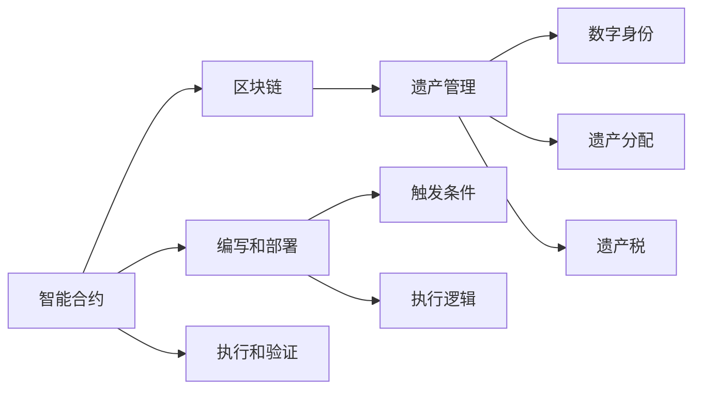

                 

# 数字化遗嘱执行AI创业：智能合约在遗产管理中的应用

## 1. 背景介绍

数字化遗产管理（Digital Estate Management）是随着互联网和区块链技术的发展逐渐兴起的一个前沿领域。传统的遗嘱执行往往需要耗费大量时间和成本，且容易受人为因素影响，导致遗嘱执行出现争议。而通过智能合约（Smart Contract）技术，我们可以实现更加高效、透明、安全的数字化遗嘱执行。

智能合约是一种自动执行的合约，能够在满足预设条件时自动执行合同条款，具有去中心化、不可篡改等特点。在遗产管理中，智能合约可以自动管理遗嘱内容、分配遗产、支付遗产税等事务，极大地简化了遗嘱执行流程。

本文将详细介绍智能合约在遗产管理中的应用，探讨其核心概念、算法原理及具体实现方法。希望为AI创业者和遗产管理领域的研究人员提供一些有价值的参考。

## 2. 核心概念与联系

### 2.1 核心概念概述

为了更好地理解智能合约在遗产管理中的应用，我们需要先了解一些核心概念：

- 智能合约（Smart Contract）：基于区块链技术的自动执行合约，能够在满足预设条件时自动执行合同条款，具有去中心化、不可篡改等特点。

- 区块链（Blockchain）：一种分布式账本技术，能够通过去中心化的方式记录、验证和传播交易信息，确保数据的安全性和透明度。

- 以太坊（Ethereum）：目前应用最广泛的智能合约平台，提供智能合约的编写、部署和执行环境。

- 数字身份（Digital Identity）：通过区块链技术实现的数字身份认证，能够确保遗产分配和管理的合法性和准确性。

- 遗产管理（Estate Management）：涉及遗嘱制定、遗产分配、遗产税缴纳、遗产继承等事务的管理，通过智能合约可以实现数字化、自动化和透明化。

### 2.2 核心概念原理和架构的 Mermaid 流程图



这个流程图展示了智能合约在遗产管理中的应用流程：

1. 编写智能合约，并在区块链上部署。
2. 当满足预设条件时，智能合约自动执行遗产分配、税款缴纳等事务。
3. 遗产管理和数字身份认证通过智能合约实现，确保遗产分配的合法性和准确性。

## 3. 核心算法原理 & 具体操作步骤

### 3.1 算法原理概述

智能合约的执行逻辑通常基于一定的业务规则，通过自动化实现业务逻辑的执行。在遗产管理中，智能合约可以通过预设条件（如继承人信息、遗产价值等）来触发遗产分配和税款缴纳等事务。

智能合约的编写和部署通常使用Solidity等编程语言，部署在以太坊等区块链平台上。智能合约的执行和验证依赖于区块链的去中心化特性和共识机制，确保了其不可篡改和透明性。

### 3.2 算法步骤详解

智能合约在遗产管理中的应用主要包括以下几个步骤：

**Step 1: 编写智能合约**

1. 确定遗产管理的需求，如遗产分配规则、税款计算方法等。
2. 使用Solidity等编程语言编写智能合约，定义触发条件和执行逻辑。
3. 将智能合约部署到以太坊等区块链平台上。

**Step 2: 添加数字身份**

1. 为每位继承人生成数字身份，确保身份信息的真实性和完整性。
2. 将数字身份信息存储在区块链上，作为遗产分配的依据。

**Step 3: 触发遗产分配**

1. 当遗嘱中的某个条件满足时（如继承人死亡、年龄到达等），触发智能合约。
2. 智能合约根据预设规则自动执行遗产分配，将遗产分配给指定的继承人。
3. 智能合约还可以自动计算并缴纳相关税款，确保遗产管理过程的合法性和透明性。

**Step 4: 验证和执行**

1. 智能合约执行后，通过区块链的共识机制进行验证，确保执行结果的正确性。
2. 数字身份信息可以用于验证遗产分配的合法性和准确性，确保继承人的合法权益。

### 3.3 算法优缺点

智能合约在遗产管理中的应用具有以下优点：

- 高效性：通过自动执行和验证，简化了遗产管理流程，减少了人为干预。
- 透明性：所有遗产分配和税款缴纳等事务都记录在区块链上，确保了数据的安全性和透明性。
- 可扩展性：智能合约可以灵活地定制遗产分配规则，适应不同场景的需求。

同时，智能合约也存在一些局限性：

- 技术门槛：智能合约的编写和部署需要一定的编程和区块链技术背景，可能存在技术门槛。
- 法律和道德风险：智能合约的执行依赖于预设条件，可能存在法律和道德风险。
- 隐私问题：智能合约可能暴露部分隐私信息，需要采取措施保护数据安全。

### 3.4 算法应用领域

智能合约在遗产管理中的应用不仅限于财富分配，还包括遗产税缴纳、遗产继承权管理等多个方面。例如：

- 遗产税缴纳：通过智能合约自动计算并缴纳遗产税，确保税款按时足额缴纳。
- 遗产继承权管理：通过智能合约验证继承人身份，确保遗产分配的合法性和准确性。
- 遗产管理记录：通过智能合约记录遗产分配和管理的全过程，确保遗产管理的透明性和可追溯性。

## 4. 数学模型和公式 & 详细讲解 & 举例说明

### 4.1 数学模型构建

智能合约的执行逻辑通常基于一定的数学模型，用于描述遗产分配、税款计算等事务。例如，遗产税的计算模型可以表示为：

$$
T = V \times r \times c
$$

其中 $T$ 为遗产税额，$V$ 为遗产价值，$r$ 为遗产税率，$c$ 为遗产税计算系数。

### 4.2 公式推导过程

遗产税的计算公式可以通过数学模型推导得出：

$$
T = V \times r \times c = V \times \frac{r \times c}{100}
$$

在智能合约中，可以通过预设条件（如遗产价值 $V$）来计算遗产税 $T$，确保计算结果的准确性和合法性。

### 4.3 案例分析与讲解

假设某位遗产所有者去世后，遗产价值为100万美元，遗产税率为30%，遗产税计算系数为0.5。通过智能合约计算遗产税，公式为：

$$
T = 100 \times \frac{30}{100} \times 0.5 = 15
$$

因此，遗产税额为15万美元。

## 5. 项目实践：代码实例和详细解释说明

### 5.1 开发环境搭建

进行智能合约的开发和测试，需要搭建相应的开发环境。以下是搭建开发环境的步骤：

1. 安装Node.js和npm。
2. 安装Truffle框架和以太坊钱包（如MetaMask）。
3. 在以太坊主网或测试网（如Ropsten、Rinkeby等）上部署智能合约。

### 5.2 源代码详细实现

以下是一个简单的遗产分配智能合约的Solidity代码实现：

```solidity
pragma solidity ^0.8.0;

contract Estate {
    address public owner;
    address[] public beneficiaries;
    uint256 public value;
    uint256 public taxRate;
    uint256 public taxCoefficient;
    uint256 public tax;
    uint256 public remainder;
    bool public isExecuted;
    
    constructor(address _owner, address[] _beneficiaries, uint256 _value, uint256 _税率, uint256 _税系数) {
        owner = _owner;
        beneficiaries = _beneficiaries;
        value = _value;
        taxRate = _税率;
        taxCoefficient = _税系数;
        tax = 0;
        isExecuted = false;
    }
    
    event OwnershipTransferred(address indexed _from, address indexed _to);
    
    function execute(uint256 indexed _index) public {
        require(!isExecuted);
        require(_index < beneficiaries.length);
        
        uint256 amount = value * taxRate * taxCoefficient;
        uint256 share = amount / beneficiaries.length;
        uint256 rem = value - (beneficiaries[_index] * share);
        
        tax = amount;
        remainder = rem;
        
        for (uint256 i = 0; i < beneficiaries.length; i++) {
            if (i == _index) {
                continue;
            }
            uint256 amountToTransfer = share;
            if (i < beneficiaries.length - 1) {
                amountToTransfer = (amountToTransfer + amount) / (i + 2);
            }
            uint256 amountToTransferActual = min(remainder, amountToTransfer);
            remainder -= amountToTransferActual;
            pay(beneficiaries[i], amountToTransferActual);
        }
        
        execute(true);
    }
    
    function execute(bool _execute) public {
        require(!isExecuted);
        isExecuted = _execute;
    }
    
    function pay(address receiver, uint256 amount) public {
        require(receiver != address(0));
        Payment(receiver, amount);
    }
    
    function Payment(address indexed receiver, uint256 indexed amount) public {
        receiver.transfer(amount);
    }
    
    function getTaxRate() public view returns (uint256) {
        return taxRate;
    }
    
    function getTaxCoefficient() public view returns (uint256) {
        return taxCoefficient;
    }
    
    function getTax() public view returns (uint256) {
        return tax;
    }
    
    function getRemainder() public view returns (uint256) {
        return remainder;
    }
    
    function getBeneficiaries() public view returns (address[] memory) {
        return beneficiaries;
    }
}
```

### 5.3 代码解读与分析

**Estate合约定义**：

- `address public owner`：合约所有者地址。
- `address[] public beneficiaries`：继承人地址数组。
- `uint256 public value`：遗产总价值。
- `uint256 public taxRate`：遗产税率。
- `uint256 public taxCoefficient`：遗产税计算系数。
- `uint256 public tax`：已缴纳遗产税。
- `uint256 public remainder`：剩余遗产。
- `bool public isExecuted`：遗产分配是否执行。

**构造函数**：

- 初始化所有者、继承人、遗产价值、遗产税率、遗产税计算系数、已缴纳遗产税和剩余遗产。

**execute函数**：

- 触发遗产分配时执行。
- 计算遗产税和剩余遗产。
- 将遗产分配给每位继承人。

**pay函数**：

- 支付金额给继承人。

**其他函数**：

- `getTaxRate`：获取遗产税率。
- `getTaxCoefficient`：获取遗产税计算系数。
- `getTax`：获取已缴纳遗产税。
- `getRemainder`：获取剩余遗产。
- `getBeneficiaries`：获取继承人地址数组。

### 5.4 运行结果展示

执行智能合约后，可以通过区块链浏览器查看执行结果和状态变化。例如，在Etherscan上查看智能合约地址和执行状态：

```plaintext
Contract Address: 0x...
Transaction Details: ...
Estate State: Executed
```

## 6. 实际应用场景

### 6.1 智能合约在遗产管理中的应用场景

智能合约在遗产管理中具有广泛的应用场景，例如：

- 遗产分配：根据遗嘱内容自动分配遗产给指定的继承人。
- 遗产税缴纳：自动计算并缴纳遗产税，确保遗产税款的合法性和准确性。
- 继承权管理：验证继承人身份，确保遗产分配的合法性和准确性。
- 遗产管理记录：记录遗产分配和管理的全过程，确保遗产管理的透明性和可追溯性。

### 6.2 未来应用展望

随着区块链技术和智能合约的发展，未来遗产管理中智能合约的应用将更加广泛和深入。例如：

- 跨境遗产管理：通过跨链技术和智能合约，实现不同国家之间的遗产管理。
- 慈善遗产管理：将遗产捐赠给慈善机构，通过智能合约实现透明和自动化的捐赠过程。
- 智能合同法：制定智能合约的法律和规范，保障遗产管理的合法性和公正性。

## 7. 工具和资源推荐

### 7.1 学习资源推荐

以下是一些推荐的学习资源：

- Solidity官方文档：https://solidity.readthedocs.io
- Truffle官方文档：https://www.trufflesuite.com/docs/truffle
- MetaMask官方文档：https://metamask.zendesk.com/hc/en-us/articles/360016903292-What-are-smart-contracts

### 7.2 开发工具推荐

以下是一些推荐的开发工具：

- VS Code：轻量级的开发环境，支持Solidity和其他智能合约语言的编写和调试。
- Remix IDE：基于Web的开发环境，支持Solidity、Vyper等智能合约语言的编写和测试。
- MetaMask：支持以太坊钱包和智能合约的交互，方便开发和测试。

### 7.3 相关论文推荐

以下是一些推荐的相关论文：

- Smart Contracts: A Survey of Technologies and Applications
- Ethereum: A Secure Blockchain and Smart Contract Platform
- Decentralizing the Power of Rights Management: A Decentralized ID Model for Content Rights Management

## 8. 总结：未来发展趋势与挑战

### 8.1 研究成果总结

智能合约在遗产管理中的应用，为我们提供了一种高效、透明、安全的数字化遗产管理方式。通过智能合约，可以自动执行遗产分配、税款缴纳等事务，减少人为干预，提高遗产管理的效率和公正性。

### 8.2 未来发展趋势

未来智能合约在遗产管理中的应用将更加广泛和深入，主要趋势包括：

- 跨链技术和多链协同：实现不同区块链平台之间的智能合约互联互通。
- 法律和规范制定：制定智能合约的法律和规范，保障遗产管理的合法性和公正性。
- 智能合约社区：建立智能合约社区和平台，促进智能合约的开发和应用。

### 8.3 面临的挑战

智能合约在遗产管理中的应用也面临一些挑战，主要包括以下方面：

- 技术门槛：智能合约的编写和部署需要一定的编程和区块链技术背景，可能存在技术门槛。
- 法律和道德风险：智能合约的执行依赖于预设条件，可能存在法律和道德风险。
- 隐私问题：智能合约可能暴露部分隐私信息，需要采取措施保护数据安全。

### 8.4 研究展望

未来的研究可以从以下几个方面进行：

- 多链协同：探索跨链技术和多链协同，实现不同区块链平台之间的智能合约互联互通。
- 智能合约法律：制定智能合约的法律和规范，保障遗产管理的合法性和公正性。
- 隐私保护：研究隐私保护技术，确保智能合约的安全性和隐私性。

## 9. 附录：常见问题与解答

**Q1：智能合约的编写和部署有哪些注意事项？**

A: 智能合约的编写和部署需要注意以下几点：

- 遵循Solidity规范和最佳实践。
- 编写易于理解和维护的代码。
- 测试智能合约，确保其正确性和安全性。

**Q2：智能合约在遗产管理中如何保护隐私？**

A: 智能合约在遗产管理中可以采取以下措施保护隐私：

- 使用数字身份验证，确保继承人身份的真实性和完整性。
- 使用零知识证明等隐私保护技术，保护遗产分配和管理的敏感信息。

**Q3：智能合约在遗产管理中可能存在哪些法律和道德风险？**

A: 智能合约在遗产管理中可能存在的法律和道德风险包括：

- 遗嘱内容争议：遗嘱内容可能存在争议，导致遗产分配不公正。
- 继承人身份争议：继承人身份可能存在争议，导致遗产分配不公正。
- 遗产税计算错误：遗产税计算错误可能导致遗产管理不合法。

**Q4：智能合约在遗产管理中有哪些潜在的改进空间？**

A: 智能合约在遗产管理中有以下潜在的改进空间：

- 法律和规范制定：制定智能合约的法律和规范，保障遗产管理的合法性和公正性。
- 隐私保护技术：研究隐私保护技术，确保智能合约的安全性和隐私性。
- 多链协同技术：探索跨链技术和多链协同，实现不同区块链平台之间的智能合约互联互通。

总之，智能合约在遗产管理中具有广泛的应用前景，但也需要解决一些技术、法律和道德问题，才能更好地服务于数字化遗产管理。

