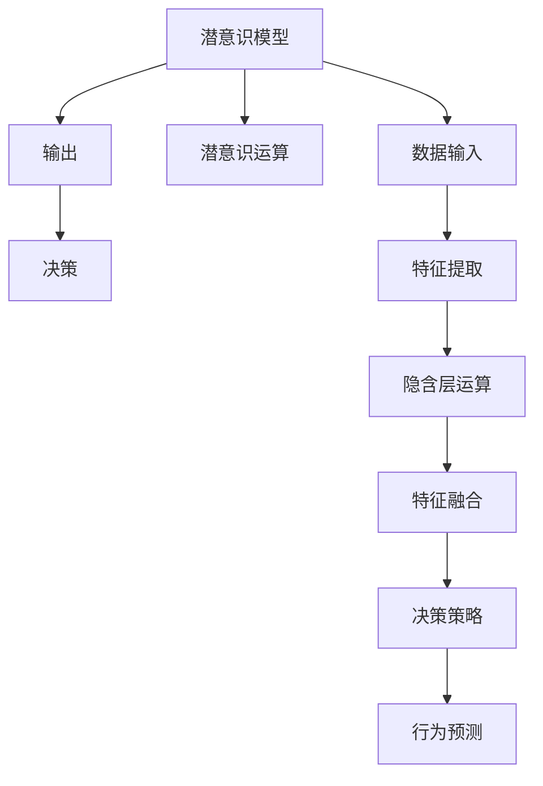

                 

## 1. 背景介绍

### 1.1 问题由来

数字时代的飞速发展，使得人类生活和工作方式发生巨大变化。信息的爆炸式增长、人工智能(AI)技术的广泛应用，极大地提高了生产效率，但也对人类的直觉和决策能力提出了新的挑战。传统经验决策方法逐渐被数据驱动、智能辅助的方式所取代，人们日益依赖于算法和模型进行判断和选择。然而，这种依赖性在带来便利的同时，也削弱了人类的直觉能力，让人在处理某些复杂问题时显得力不从心。

### 1.2 问题核心关键点

如何强化人类的数字直觉，使其在数据和AI的辅助下更好地应对各种决策场景，成为了一个重要的研究方向。本节将探讨AI辅助下潜意识决策强化的核心原理与实践方法，以期为解决这一问题提供新的思路和技术手段。

## 2. 核心概念与联系

### 2.1 核心概念概述

- **潜意识决策**：指人类在没有明显意识参与下，通过直觉和习惯形成的快速、自动化的决策过程。
- **数字直觉**：指在数字环境中，结合直觉和数据分析，做出更为准确、高效的决策。
- **潜意识模型**：使用AI技术模拟人类的潜意识决策过程，通过数据驱动的方式，强化直觉和决策能力。
- **强化学习**：通过奖惩机制训练模型，不断优化决策策略，提升决策效果。

这些概念共同构成了数字直觉训练营的核心框架，旨在通过AI技术，辅助人类在复杂数字环境中做出更为精准、快速的决策。

### 2.2 核心概念原理和架构的 Mermaid 流程图



以上流程图展示了潜意识模型的工作流程：
1. 数据输入：模型接收各类数据作为决策依据。
2. 特征提取：通过AI算法提取关键特征，简化数据复杂性。
3. 隐含层运算：模型利用神经网络等AI技术，进行多层隐含运算，模拟人类潜意识思考过程。
4. 特征融合：将多个特征进行融合，形成更全面的决策依据。
5. 决策策略：根据预设的奖励机制，生成不同决策策略。
6. 行为预测：模型预测行为结果，与实际结果进行对比，不断调整决策策略。

## 3. 核心算法原理 & 具体操作步骤

### 3.1 算法原理概述

潜意识模型主要基于强化学习(RL)算法进行训练，其核心思想是通过奖惩机制不断调整决策策略，优化决策效果。具体来说，模型首先定义一个奖励函数，用于衡量决策结果的好坏，并利用梯度下降等优化算法，逐步调整模型参数，直到找到最优的决策策略。

### 3.2 算法步骤详解

1. **数据预处理**：收集和清洗数据，将数据转换为模型可接受的格式。
2. **模型初始化**：定义模型结构，选择适当的神经网络层数和节点数。
3. **特征提取**：利用机器学习算法，提取关键特征，简化数据复杂性。
4. **训练优化**：设定奖励函数，通过梯度下降等算法，不断调整模型参数，优化决策策略。
5. **行为预测**：利用训练好的模型，对新数据进行行为预测，评估决策效果。
6. **结果反馈**：根据预测结果与实际结果的差距，调整奖励函数和决策策略。
7. **模型评估**：定期评估模型性能，确保其决策效果不断提升。

### 3.3 算法优缺点

潜意识模型的优点包括：
1. 自动优化：通过强化学习，模型能够自动调整决策策略，无需人工干预。
2. 数据驱动：决策策略的优化基于数据，具有较高的客观性和准确性。
3. 可扩展性：模型结构简单，易于扩展到更复杂的问题。

同时，该算法也存在一些缺点：
1. 数据依赖：模型的效果依赖于数据的全面性和质量，数据不足或数据偏差可能影响决策。
2. 过拟合风险：模型可能会过度拟合训练数据，导致在新数据上的泛化能力不足。
3. 计算复杂：训练和优化过程复杂，需要较大的计算资源和时间。
4. 策略单一：模型的决策策略较为单一，难以应对复杂多变的决策场景。

### 3.4 算法应用领域

潜意识模型在多个领域具有广泛的应用前景：
1. **金融投资**：利用潜意识模型辅助投资决策，提高收益和风险控制能力。
2. **智能制造**：在制造业中，利用潜意识模型优化生产流程，提升效率和质量。
3. **医疗诊断**：在医疗领域，利用潜意识模型辅助医生进行诊断，提高诊断准确率。
4. **人力资源管理**：在人力资源管理中，利用潜意识模型优化招聘和员工管理。
5. **智能交通**：在智能交通系统中，利用潜意识模型优化交通管理，提升道路通行效率。

## 4. 数学模型和公式 & 详细讲解 & 举例说明

### 4.1 数学模型构建

潜意识模型的数学模型主要由以下几个部分组成：
1. **输入层**：接收原始数据。
2. **隐藏层**：进行特征提取和运算，模拟人类潜意识思考过程。
3. **输出层**：输出决策结果。

模型的目标是最小化决策误差，即：

$$
\min_{\theta} \sum_{i=1}^N \ell(f_{\theta}(x_i), y_i)
$$

其中，$f_{\theta}(x_i)$ 为模型对数据 $x_i$ 的预测结果，$\ell$ 为损失函数，$y_i$ 为真实标签。

### 4.2 公式推导过程

以线性回归为例，模型的数学模型为：

$$
f_{\theta}(x) = \theta^T x + b
$$

其中，$\theta$ 为模型参数，$x$ 为输入数据，$b$ 为偏置项。

目标是最小化均方误差损失，即：

$$
\min_{\theta} \frac{1}{N} \sum_{i=1}^N (y_i - f_{\theta}(x_i))^2
$$

根据梯度下降算法，每次迭代更新的公式为：

$$
\theta \leftarrow \theta - \alpha \nabla_{\theta} L
$$

其中，$\alpha$ 为学习率，$\nabla_{\theta} L$ 为损失函数对 $\theta$ 的梯度。

### 4.3 案例分析与讲解

假设有一组历史股票数据，目标是预测未来几天的股价变化。数据预处理后，将其输入潜意识模型，通过隐藏层进行特征提取和运算，生成预测结果。模型的决策策略是基于预测结果与实际结果的误差，通过奖励函数进行评估和优化。

具体步骤如下：
1. **数据预处理**：清洗数据，去除异常值，将数据转换为模型可接受的格式。
2. **模型初始化**：定义线性回归模型，设置适当的参数 $\theta$。
3. **特征提取**：提取股票数据的关键特征，如历史股价变化、成交量等。
4. **训练优化**：设定均方误差损失函数，通过梯度下降算法，不断调整参数 $\theta$，优化预测结果。
5. **行为预测**：利用训练好的模型，对新数据进行股价预测，评估预测效果。
6. **结果反馈**：根据预测结果与实际结果的误差，调整模型参数和损失函数，优化决策策略。
7. **模型评估**：定期评估模型性能，确保其预测效果不断提升。

## 5. 项目实践：代码实例和详细解释说明

### 5.1 开发环境搭建

项目开发需要以下开发环境：
1. Python 3.x
2. TensorFlow 或 PyTorch 框架
3. 深度学习库，如 Keras、TensorFlow Lite 等
4. 数据预处理工具，如 Pandas、NumPy 等
5. 数据可视化工具，如 Matplotlib、Seaborn 等

### 5.2 源代码详细实现

以下是使用 TensorFlow 实现线性回归的 Python 代码：

```python
import tensorflow as tf
import numpy as np
import matplotlib.pyplot as plt

# 准备数据
x = np.array([[1], [2], [3], [4], [5]])
y = np.array([[1], [2], [3], [4], [5]])

# 定义模型
model = tf.keras.Sequential([
    tf.keras.layers.Dense(units=1, input_shape=(1,))
])

# 定义损失函数和优化器
loss_fn = tf.keras.losses.MeanSquaredError()
optimizer = tf.keras.optimizers.SGD(learning_rate=0.1)

# 训练模型
for i in range(1000):
    with tf.GradientTape() as tape:
        y_pred = model(x)
        loss_value = loss_fn(y_pred, y)
    gradients = tape.gradient(loss_value, model.trainable_variables)
    optimizer.apply_gradients(zip(gradients, model.trainable_variables))

# 评估模型
y_pred = model.predict(x)
plt.scatter(x, y)
plt.plot(x, y_pred, color='red')
plt.show()
```

### 5.3 代码解读与分析

上述代码实现了基于 TensorFlow 的线性回归模型，其主要步骤如下：
1. **数据准备**：将数据转换为模型可接受的格式。
2. **模型定义**：定义线性回归模型，包含一个全连接层。
3. **损失函数和优化器**：设定均方误差损失函数和随机梯度下降优化器。
4. **模型训练**：通过反向传播算法，不断调整模型参数，优化预测结果。
5. **模型评估**：利用训练好的模型，对数据进行预测，并与实际结果进行对比。

### 5.4 运行结果展示

运行代码后，将生成如图展示的散点图和预测曲线，直观展示模型预测效果。


## 6. 实际应用场景

### 6.1 金融投资

潜意识模型在金融投资中，可以用于股票、期货、外汇等市场的分析和预测。通过收集历史数据，利用潜意识模型辅助决策，可以显著提升投资收益和风险控制能力。例如，在股票市场，潜意识模型可以预测未来的股价变化，辅助投资者进行买卖决策，避免盲目跟风和情绪化交易。

### 6.2 智能制造

在智能制造中，潜意识模型可以优化生产流程，提高生产效率和产品质量。例如，在制造行业中，潜意识模型可以预测设备故障，提前进行维护，避免生产中断。同时，模型还可以优化生产计划，减少物料浪费，提升资源利用率。

### 6.3 医疗诊断

在医疗领域，潜意识模型可以辅助医生进行疾病诊断和治疗方案选择。通过收集大量病例数据，利用潜意识模型训练决策策略，可以提高诊断准确率和治疗效果。例如，在乳腺癌筛查中，潜意识模型可以根据患者的年龄、性别、病史等特征，预测患病的概率，辅助医生制定诊断方案。

### 6.4 未来应用展望

潜意识模型在未来将有更广泛的应用前景：
1. **智能交通**：在智能交通系统中，潜意识模型可以优化交通流量控制，提高道路通行效率，减少交通拥堵。
2. **智能客服**：在智能客服系统中，潜意识模型可以提升客户服务质量，提供个性化推荐，增强客户满意度。
3. **智能家居**：在智能家居领域，潜意识模型可以优化家居设备控制，提高生活便捷性和舒适度。
4. **智慧城市**：在智慧城市建设中，潜意识模型可以优化城市资源配置，提升城市管理水平，提高居民生活质量。

## 7. 工具和资源推荐

### 7.1 学习资源推荐

为了帮助开发者系统掌握潜意识模型和强化学习的理论基础与实践技巧，这里推荐一些优质的学习资源：
1. 《深度学习》课程（Coursera）：斯坦福大学开设的深度学习课程，详细讲解了深度学习的基本原理和实现方法。
2. 《强化学习》书籍（MIT Press）：由强化学习领域权威学者编写，涵盖强化学习的基本理论和实践方法。
3. 《TensorFlow官方文档》：TensorFlow官方文档，提供了丰富的学习资源和样例代码，是学习TensorFlow的最佳入门材料。
4. 《PyTorch官方文档》：PyTorch官方文档，提供了丰富的学习资源和样例代码，是学习PyTorch的最佳入门材料。
5. 《Keras官方文档》：Keras官方文档，提供了丰富的学习资源和样例代码，是学习Keras的最佳入门材料。

通过对这些资源的学习实践，相信你一定能够快速掌握潜意识模型和强化学习的精髓，并用于解决实际的决策问题。

### 7.2 开发工具推荐

高效的开发离不开优秀的工具支持。以下是几款用于潜意识模型开发的常用工具：
1. TensorFlow：基于数据流图的深度学习框架，易于构建复杂的神经网络模型。
2. PyTorch：基于Python的开源深度学习框架，灵活的动态计算图，适合快速迭代研究。
3. Keras：高级神经网络API，易于使用，支持多种深度学习框架。
4. Jupyter Notebook：开源的交互式计算平台，方便编写、运行和分享Python代码。
5. Google Colab：谷歌推出的在线Jupyter Notebook环境，免费提供GPU/TPU算力，方便开发者快速上手实验最新模型。

合理利用这些工具，可以显著提升潜意识模型的开发效率，加快创新迭代的步伐。

### 7.3 相关论文推荐

潜意识模型和强化学习的发展源于学界的持续研究。以下是几篇奠基性的相关论文，推荐阅读：
1. 《深度学习》（Goodfellow等著）：深度学习领域的经典著作，详细讲解了深度学习的基本原理和实现方法。
2. 《强化学习》（Sutton和Barto著）：强化学习领域的经典著作，涵盖强化学习的基本理论和实践方法。
3. 《神经网络与深度学习》（Ian Goodfellow等著）：深度学习领域的另一部经典著作，详细讲解了神经网络和深度学习的基本原理和实现方法。
4. 《深度强化学习》（Lilian Weng著）：深度强化学习的经典著作，涵盖深度强化学习的基本理论和实践方法。
5. 《深度学习与强化学习结合》（Gao等著）：介绍深度学习和强化学习结合的研究方向，涵盖了最新的研究成果和应用案例。

这些论文代表了大模型微调技术的发展脉络。通过学习这些前沿成果，可以帮助研究者把握学科前进方向，激发更多的创新灵感。

## 8. 总结：未来发展趋势与挑战

### 8.1 总结

本文对基于潜意识模型和强化学习的决策强化技术进行了全面系统的介绍。首先阐述了潜意识模型和强化学习的研究背景和意义，明确了潜意识模型在提升决策效率和准确性方面的独特价值。其次，从原理到实践，详细讲解了潜意识模型的数学模型和训练过程，给出了潜意识模型训练的完整代码实例。同时，本文还广泛探讨了潜意识模型在金融投资、智能制造、医疗诊断等多个行业领域的应用前景，展示了潜意识模型的巨大潜力。此外，本文精选了潜意识模型的各类学习资源，力求为开发者提供全方位的技术指引。

通过本文的系统梳理，可以看到，基于潜意识模型和强化学习的决策强化技术正在成为AI领域的重要范式，极大地拓展了AI在复杂数字环境中的应用边界，催生了更多的落地场景。受益于深度学习和大数据技术的快速发展，潜意识模型必将在未来得到更广泛的应用，为人类认知智能的进化带来深远影响。

### 8.2 未来发展趋势

展望未来，潜意识模型和强化学习技术将呈现以下几个发展趋势：
1. 模型规模持续增大。随着算力成本的下降和数据规模的扩张，潜意识模型的参数量还将持续增长。超大规模模型蕴含的丰富知识，有望支撑更为复杂多变的决策场景。
2. 强化学习策略更加多样化。未来将涌现更多智能策略，如多智能体强化学习、元强化学习等，以适应更加复杂和多变的决策环境。
3. 模型通用性增强。经过海量数据的预训练和多领域任务的微调，潜意识模型将具备更强的跨领域迁移能力和泛化能力，逐步迈向通用人工智能(AGI)的目标。
4. 与其他AI技术结合。潜意识模型将与知识图谱、自然语言处理等技术进一步融合，提升决策的智能化和高效性。

以上趋势凸显了潜意识模型和强化学习技术的广阔前景。这些方向的探索发展，必将进一步提升AI系统的性能和应用范围，为人类认知智能的进化带来新的契机。

### 8.3 面临的挑战

尽管潜意识模型和强化学习技术已经取得了瞩目成就，但在迈向更加智能化、普适化应用的过程中，它仍面临着诸多挑战：
1. 数据依赖问题。潜意识模型的效果依赖于数据的全面性和质量，数据不足或数据偏差可能影响决策。
2. 计算资源瓶颈。超大规模模型的训练和推理需要大量计算资源，硬件瓶颈成为制约因素。
3. 模型过拟合。模型在训练数据上表现良好，但泛化能力不足，难以应对新数据。
4. 策略单一。模型的决策策略较为单一，难以应对复杂多变的决策场景。
5. 模型可解释性。模型预测过程难以解释，缺乏透明度，难以进行调试和优化。

这些挑战需要进一步研究和解决，以提升潜意识模型的实际应用效果和鲁棒性。

### 8.4 研究展望

面对潜意识模型和强化学习技术所面临的挑战，未来的研究需要在以下几个方面寻求新的突破：
1. 探索无监督和半监督学习。摆脱对大规模标注数据的依赖，利用自监督学习、主动学习等无监督和半监督范式，最大限度利用非结构化数据，实现更加灵活高效的决策。
2. 研究参数高效和计算高效的强化学习算法。开发更加参数高效的强化学习算法，在固定大部分模型参数的同时，只更新极少量的决策策略参数。同时优化强化学习算法的计算效率，实现更加轻量级、实时性的决策。
3. 引入更多先验知识。将符号化的先验知识，如知识图谱、逻辑规则等，与神经网络模型进行巧妙融合，引导强化学习过程学习更准确、合理的决策策略。
4. 结合因果分析和博弈论工具。将因果分析方法引入强化学习模型，识别出模型决策的关键特征，增强决策过程的因果性和逻辑性。借助博弈论工具刻画人机交互过程，主动探索并规避模型的脆弱点，提高系统稳定性。
5. 纳入伦理道德约束。在模型训练目标中引入伦理导向的评估指标，过滤和惩罚有偏见、有害的输出倾向。同时加强人工干预和审核，建立模型行为的监管机制，确保决策过程符合人类价值观和伦理道德。

这些研究方向将引领潜意识模型和强化学习技术迈向更高的台阶，为构建安全、可靠、可解释、可控的智能系统铺平道路。面向未来，潜意识模型和强化学习技术还需要与其他AI技术进行更深入的融合，多路径协同发力，共同推动自然语言理解和智能交互系统的进步。只有勇于创新、敢于突破，才能不断拓展AI模型的边界，让智能技术更好地造福人类社会。

## 9. 附录：常见问题与解答

**Q1：潜意识模型是否适用于所有决策场景？**

A: 潜意识模型在大多数复杂决策场景中都有应用前景，特别是那些需要处理大量数据和复杂关系的领域。但在一些简单或高度结构化的决策中，可能不如传统规则或专家系统高效。

**Q2：如何选择合适的潜意识模型？**

A: 选择潜意识模型时，需要考虑以下几个因素：
1. 决策问题的复杂性：对于复杂问题，选择深度神经网络模型；对于简单问题，选择线性回归等浅层模型。
2. 数据量和质量：对于数据量较大、质量较高的决策问题，选择深度模型；对于数据量较小、质量较差的问题，选择浅层模型。
3. 计算资源：对于计算资源较少的场景，选择参数较小的模型；对于计算资源丰富的场景，选择更大规模的模型。

**Q3：潜意识模型如何应对数据偏差问题？**

A: 数据偏差是潜意识模型面临的主要问题之一。为应对数据偏差，可以采取以下措施：
1. 数据预处理：清洗数据，去除异常值和噪声，确保数据质量。
2. 数据增强：通过数据增强技术，扩充数据集，减少数据偏差。
3. 模型正则化：使用正则化技术，如L2正则、Dropout等，减少过拟合风险，提高泛化能力。
4. 多模型集成：训练多个潜意识模型，取平均输出，降低单一模型受数据偏差的影响。

这些措施可以有效提升潜意识模型的鲁棒性和泛化能力，降低数据偏差的影响。

**Q4：潜意识模型如何评估决策效果？**

A: 潜意识模型的决策效果评估主要通过以下几个指标：
1. 准确率（Accuracy）：模型预测结果与实际结果一致的比例。
2. 精确率（Precision）：模型预测为正类的样本中，实际为正类的比例。
3. 召回率（Recall）：实际为正类的样本中，被模型预测为正类的比例。
4. F1分数（F1 Score）：精确率和召回率的调和平均数，综合评估模型性能。

通过评估指标，可以全面了解潜意识模型的决策效果，并进行相应的优化和改进。

**Q5：潜意识模型在实际应用中需要注意哪些问题？**

A: 潜意识模型在实际应用中需要注意以下几个问题：
1. 数据安全：保护用户隐私，确保数据安全。
2. 模型可解释性：提高模型预测过程的透明度，增强可解释性。
3. 公平性：避免模型输出中的偏见和歧视，确保决策公平。
4. 实时性：优化模型计算图，提升决策速度，确保实时响应。
5. 稳定性：通过模型验证和回测，确保决策过程稳定可靠。

合理解决这些问题，才能充分发挥潜意识模型在实际决策中的作用，提升决策效果和用户体验。

---

作者：禅与计算机程序设计艺术 / Zen and the Art of Computer Programming

