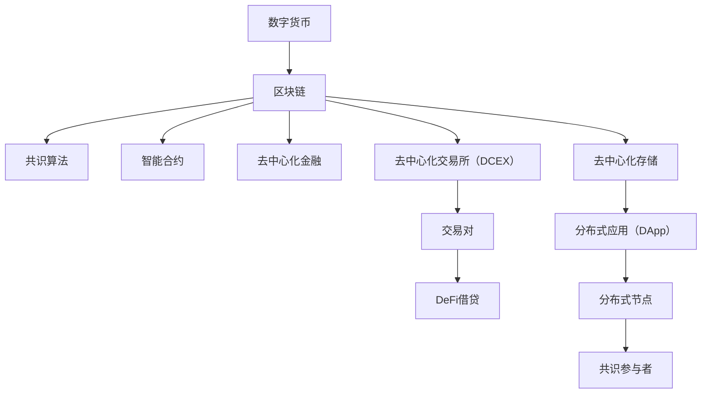

                 

## 1. 背景介绍

在金融科技飞速发展的今天，数字货币作为一种颠覆性技术，正迅速改变着全球的金融体系。从比特币到以太坊，再到现在的DeFi（去中心化金融），数字货币所带来的颠覆性变革已经开始影响金融、支付、投资等各个领域。随着技术的不断进步，数字货币创业的门槛逐渐降低，越来越多的创业者和投资机构开始关注这一领域，希望抓住数字货币变革带来的商机。

本文将从数字货币的核心原理、商业模式、技术架构、实际应用以及未来的发展趋势等方面，全面深入地探讨数字货币创业的关键要素，帮助读者理解这一领域的机会与挑战。

## 2. 核心概念与联系

### 2.1 核心概念概述

- **数字货币（Digital Currency）**：利用加密技术和区块链技术，实现无国界、去中心化的交易、支付和价值存储的电子货币。

- **区块链（Blockchain）**：一种去中心化的分布式账本技术，通过共识算法记录和验证交易数据，实现透明、不可篡改的数据存储和传输。

- **去中心化金融（DeFi）**：基于区块链技术的金融服务，包括借贷、交易、保险、投资等，旨在去除传统金融机构的中间环节，提高金融服务的透明度和效率。

- **智能合约（Smart Contract）**：一种基于区块链技术的自动化合约，通过代码实现交易规则的执行，无需中间人即可自动化执行。

- **共识算法（Consensus Algorithm）**：区块链中的核心组件，用于验证和确认交易的有效性，包括PoW（工作量证明）、PoS（权益证明）、DPoS（委托权益证明）等。

### 2.2 核心概念原理和架构的 Mermaid 流程图



这个图表展示了数字货币的核心架构及其相互关系。数字货币建立在区块链之上，区块链通过共识算法记录交易，智能合约实现自动化的交易执行，去中心化金融是区块链的应用，而去中心化交易所和分布式应用则是去中心化金融的具体形式。

## 3. 核心算法原理 & 具体操作步骤

### 3.1 算法原理概述

数字货币的核心理论包括加密技术、共识算法和区块链技术。其中，加密技术保证了交易的安全性和隐私性；共识算法保证了交易的透明性和不可篡改性；区块链技术则提供了去中心化的账本存储和数据传输能力。

**加密技术**：
加密技术通过将交易信息转换为难以破解的密文，保证了交易的机密性和安全性。数字货币常用的加密算法包括RSA、ECC（椭圆曲线加密）和SHA-256等。

**共识算法**：
共识算法是区块链的核心，用于验证和确认交易的有效性。常见的共识算法包括PoW、PoS和DPoS等。PoW通过计算复杂数学问题来验证交易；PoS则基于持币人的持币数量和时间来验证交易；DPoS通过投票机制选择一部分节点来验证交易。

**区块链技术**：
区块链是一种去中心化的分布式账本技术，通过共识算法记录和验证交易数据，实现透明、不可篡改的数据存储和传输。区块链技术的核心包括：
- 分布式节点：多个节点共同维护账本，避免了单点故障。
- 数据存储：每个区块存储交易信息，并通过哈希算法链接至前一个区块，形成链式结构。
- 共识算法：多个节点通过共识算法达成一致，验证交易的有效性。
- 智能合约：基于区块链技术的自动化合约，通过代码实现交易规则的执行。

### 3.2 算法步骤详解

数字货币创业的核心步骤包括：

1. **选择合适的数字货币项目**：
   - 分析数字货币项目的核心技术，如加密算法、共识算法和区块链架构。
   - 评估项目的市场需求和潜在用户，以及项目的市场竞争力。
   - 调研项目的团队背景和历史，确保团队具备相应的技术能力和商业运营经验。

2. **建立项目团队**：
   - 组建具有多样背景和专业技能的项目团队，包括技术专家、市场营销人员、法务顾问等。
   - 确定团队成员的职责分工和合作模式，确保项目顺畅推进。

3. **开发数字货币项目**：
   - 设计数字货币项目的架构，包括加密算法、共识算法和区块链架构。
   - 编写代码实现数字货币的交易、存储和验证等功能。
   - 进行测试和优化，确保项目的稳定性和安全性。

4. **部署数字货币项目**：
   - 选择合适的公有链或私有链部署项目。
   - 搭建区块链网络和分布式节点，确保项目能够顺利运行。
   - 发布项目白皮书和代码开源，吸引用户和开发者参与。

5. **市场推广和用户运营**：
   - 通过社交媒体、博客、论坛等渠道宣传项目，吸引用户关注和参与。
   - 开展社区建设和用户运营活动，提升项目的知名度和用户黏性。
   - 收集用户反馈和市场需求，持续优化产品和服务。

### 3.3 算法优缺点

**优点**：
1. **去中心化**：数字货币去除了传统金融机构的中间环节，提高了金融服务的透明度和效率。
2. **安全性高**：通过加密技术和共识算法，保证了交易的安全性和不可篡改性。
3. **开放性**：数字货币的代码开源，任何人都可以参与项目开发和验证。
4. **应用广泛**：数字货币可以应用于支付、交易、借贷、投资等多个领域。

**缺点**：
1. **技术复杂**：区块链和数字货币的技术门槛较高，需要具备一定的区块链开发和运维能力。
2. **监管难度大**：数字货币的监管环境尚不明确，存在法律和政策风险。
3. **市场波动大**：数字货币市场波动较大，存在较高的投资风险。
4. **技术依赖性高**：数字货币的运营和发展高度依赖技术支持和社区支持。

### 3.4 算法应用领域

数字货币技术可以应用于多个领域，包括：

1. **支付和结算**：通过区块链技术实现跨境支付、汇款和结算，提高交易效率和安全性。
2. **借贷和理财**：基于智能合约的DeFi借贷和理财平台，提供去中心化的借贷和投资服务。
3. **供应链管理**：通过区块链技术实现供应链溯源、物流追踪和交易记录，提高供应链透明度和效率。
4. **保险和理赔**：基于区块链技术的保险平台，实现透明、不可篡改的理赔记录和保险合同管理。
5. **版权和知识产权**：通过区块链技术记录和验证知识产权，保护创作者权益。
6. **社交和身份认证**：基于区块链技术的社交网络和身份认证系统，实现去中心化的社交和身份验证。

## 4. 数学模型和公式 & 详细讲解 & 举例说明

### 4.1 数学模型构建

数字货币的数学模型主要涉及加密算法、共识算法和区块链技术。以下是对这些核心数学模型的详细构建：

**加密算法**：
RSA算法：
- 公钥加密：$E(m) = m^e \mod n$
- 私钥解密：$D(c) = c^d \mod n$

**共识算法**：
PoW算法：
- 挖矿过程：求解$h$个哈希值小于某个目标值，其中$h$由时间$t$决定。
- 区块验证：验证新块的哈希值是否符合目标值。

**区块链技术**：
区块链的数学模型涉及哈希函数、区块链结构和共识算法。

### 4.2 公式推导过程

**RSA算法推导**：
- 公钥加密：$E(m) = m^e \mod n$
- 私钥解密：$D(c) = c^d \mod n$

**PoW算法推导**：
- 挖矿过程：求解$h$个哈希值小于某个目标值，其中$h$由时间$t$决定。
- 区块验证：验证新块的哈希值是否符合目标值。

**区块链结构推导**：
- 区块：每个区块包含交易信息和一个指向前一个区块的哈希值。
- 区块链：通过区块链接形成链式结构，记录所有交易信息。

### 4.3 案例分析与讲解

以比特币为例，其核心算法包括SHA-256哈希算法、工作量证明共识算法和分布式账本技术。

1. **SHA-256哈希算法**：
   - 比特币的交易信息通过SHA-256哈希算法加密，形成256位的哈希值，保证了交易信息的安全性。

2. **工作量证明共识算法**：
   - 比特币的共识算法为PoW，矿工通过计算复杂数学问题来验证交易，确保交易的透明性和不可篡改性。
   - 比特币通过哈希算法生成目标值，并在一定时间内求解哈希值，保证区块验证的公平性和安全性。

3. **分布式账本技术**：
   - 比特币通过分布式节点维护区块链，每个节点都保存完整的区块链数据，确保数据的去中心化和安全性。
   - 比特币的交易记录通过区块链接，形成一个完整的区块链，保证了交易的不可篡改性和透明性。

## 5. 项目实践：代码实例和详细解释说明

### 5.1 开发环境搭建

数字货币创业项目开发通常使用Python和区块链开发框架。以下是开发环境的搭建步骤：

1. **安装Python**：
   - 从官网下载并安装Python 3.x版本。
   - 配置环境变量，确保Python路径能够被系统识别。

2. **安装区块链开发框架**：
   - 使用pip安装区块链开发框架，如Ethereum、Hyperledger等。
   - 安装相应的依赖库，如Web3.js、JSON-RPC等。

3. **搭建区块链网络**：
   - 搭建多个区块链节点，形成分布式网络。
   - 配置共识算法和智能合约，确保区块链网络的正常运行。

4. **开发智能合约**：
   - 编写智能合约代码，定义交易规则和逻辑。
   - 测试和优化智能合约，确保其稳定性和安全性。

### 5.2 源代码详细实现

以下是一个简单的智能合约代码实现，使用Solidity语言编写：

```solidity
pragma solidity ^0.8.0;

contract SimpleContract {
    address public owner;
    
    function setOwner(address _owner) public {
        owner = _owner;
    }
    
    function transfer(address _to, uint256 _value) public {
        require(msg.sender == owner, "Only the owner can transfer tokens.");
        owner.send(_value);
    }
}
```

这个智能合约定义了一个简单的转账功能，只允许合约所有者进行转账操作。

### 5.3 代码解读与分析

智能合约的代码解读：

- `pragma solidity ^0.8.0;`：指定使用Solidity语言，并指定版本。
- `contract SimpleContract;`：定义一个名为SimpleContract的智能合约。
- `address public owner;`：定义一个公开地址变量owner，用于存储合约所有者的地址。
- `function setOwner(address _owner) public {`：定义一个名为setOwner的公共函数，用于设置合约所有者的地址。
- `owner = _owner;`：将传入的地址赋值给owner变量。
- `function transfer(address _to, uint256 _value) public {`：定义一个名为transfer的公共函数，用于转账操作。
- `require(msg.sender == owner, "Only the owner can transfer tokens.");`：判断发送者是否为合约所有者，如果不是则抛出异常。
- `owner.send(_value);`：将转账金额发送给接收者。

### 5.4 运行结果展示

智能合约运行结果展示：

- 运行智能合约，设置合约所有者地址。
- 使用智能合约进行转账操作，验证转账是否成功。

## 6. 实际应用场景

### 6.1 去中心化交易所（DCEX）

去中心化交易所（DCEX）是数字货币创业的一个热门方向，通过智能合约实现自动化的交易执行，避免了传统交易所的中间环节和费用。

**案例分析**：
Uniswap是一个基于以太坊的去中心化交易所，采用自动做市商（AMM）模式，通过代币池进行交易。用户可以添加流动性，参与交易，并分享交易手续费。Uniswap的交易手续费低，速度快，吸引了大量用户和流动性提供者。

### 6.2 DeFi借贷平台

DeFi借贷平台是数字货币创业的另一个重要方向，通过智能合约实现去中心化的借贷服务。用户可以借入和借出数字货币，并根据市场利率计算利息。

**案例分析**：
Aave是一个基于以太坊的去中心化借贷平台，采用抵押借贷模式，用户可以借入和借出多种数字货币，并根据抵押资产的利率计算利息。Aave的交易手续费低，透明度高，用户无需信任任何第三方中介机构。

### 6.3 供应链管理

基于区块链技术的供应链管理平台，可以记录和验证供应链的各个环节，提高供应链透明度和效率。

**案例分析**：
Walmart采用区块链技术记录和管理供应链，通过智能合约实现供应链溯源、物流追踪和交易记录。Walmart的区块链平台提高了供应链的透明度和效率，降低了运营成本。

## 7. 工具和资源推荐

### 7.1 学习资源推荐

1. **《区块链原理与实践》**：一本详细介绍区块链技术的书籍，帮助读者理解区块链的原理和应用。
2. **《智能合约编程实战》**：一本讲解Solidity语言的书籍，帮助读者掌握智能合约的编写和部署。
3. **Ethereum官方文档**：以太坊的官方文档，提供了详细的区块链开发和智能合约编写指南。
4. **Hyperledger官方文档**：Hyperledger的官方文档，提供了详细的区块链开发和智能合约编写指南。
5. **CryptoZombies**：一个学习Solidity语言的交互式教程，通过游戏化的方式帮助读者学习智能合约开发。

### 7.2 开发工具推荐

1. **GitHub**：GitHub是一个代码托管平台，提供了丰富的开源区块链项目，方便开发者学习和借鉴。
2. **Truffle**：Truffle是一个区块链开发框架，提供了自动化测试和部署功能，方便开发者进行智能合约开发。
3. **Web3.js**：Web3.js是一个JavaScript库，提供了以太坊网络的API，方便开发者进行区块链开发。
4. **Remix IDE**：Remix IDE是一个智能合约开发平台，提供了集成开发环境和测试工具，方便开发者进行智能合约开发和调试。

### 7.3 相关论文推荐

1. **《区块链技术发展与挑战》**：探讨区块链技术的发展历程和未来趋势，帮助读者理解区块链技术的现状和前景。
2. **《智能合约安全问题与防范措施》**：分析智能合约的安全问题和防范措施，帮助读者提高智能合约的安全性。
3. **《区块链与金融科技的应用》**：探讨区块链技术在金融科技中的应用，帮助读者理解区块链技术对金融业的影响。

## 8. 总结：未来发展趋势与挑战

### 8.1 研究成果总结

数字货币创业领域的研究成果主要集中在以下几个方面：

1. **共识算法优化**：新的共识算法，如PoS、DPoS和PoW变体，正在不断涌现，提高了区块链网络的效率和安全性。
2. **智能合约自动化**：自动化的智能合约平台，如Uniswap和Aave，正在改变传统金融服务的模式，提高金融服务的透明度和效率。
3. **去中心化金融应用**：去中心化金融（DeFi）应用，如借贷、交易和保险，正在改变金融服务的模式，降低传统金融机构的中间环节和费用。
4. **区块链与物联网的融合**：区块链技术与物联网的融合，正在推动供应链管理、医疗和智能合约等领域的发展，提高数据透明度和效率。

### 8.2 未来发展趋势

未来数字货币创业的发展趋势主要包括以下几个方面：

1. **生态系统建设**：构建完整的区块链生态系统，包括去中心化交易所、借贷平台和供应链管理等，形成完整的金融服务闭环。
2. **跨链技术发展**：推动跨链技术的研发，实现不同区块链之间的互联互通，提高区块链网络的互操作性。
3. **隐私保护技术**：开发隐私保护技术，如零知识证明和隐私计算，保护用户的隐私和数据安全。
4. **监管合规**：建立数字货币的监管框架，确保数字货币的合法合规性，降低法律风险。
5. **公有链与私有链的融合**：推动公有链和私有链的融合，实现去中心化与中心化的结合，满足不同场景的需求。

### 8.3 面临的挑战

数字货币创业领域面临的挑战主要包括以下几个方面：

1. **技术复杂性**：区块链和数字货币的技术门槛较高，需要具备一定的区块链开发和运维能力。
2. **监管不确定性**：数字货币的监管环境尚不明确，存在法律和政策风险。
3. **市场波动性**：数字货币市场波动较大，存在较高的投资风险。
4. **技术依赖性**：数字货币的运营和发展高度依赖技术支持和社区支持。

### 8.4 研究展望

未来数字货币创业的研究方向主要包括以下几个方面：

1. **智能合约自动化与优化**：开发自动化智能合约平台，提高金融服务的透明度和效率。
2. **隐私保护技术**：开发隐私保护技术，保护用户的隐私和数据安全。
3. **跨链技术**：推动跨链技术的研发，实现不同区块链之间的互联互通，提高区块链网络的互操作性。
4. **去中心化金融应用**：开发去中心化金融应用，如借贷、交易和保险，改变传统金融服务的模式。

## 9. 附录：常见问题与解答

### Q1: 数字货币和区块链技术有什么区别？

A: 数字货币是基于区块链技术的电子货币，通过加密算法实现交易的安全性和隐私性。而区块链技术则是一种分布式账本技术，用于记录和验证交易数据，实现去中心化的数据存储和传输。

### Q2: 数字货币创业需要哪些技术栈？

A: 数字货币创业需要掌握区块链技术、智能合约开发技术、共识算法等技术栈。同时需要具备数据安全、网络架构、区块链开发等技能。

### Q3: 数字货币创业如何降低法律风险？

A: 数字货币创业需要了解各国对数字货币的监管政策，确保项目的合规性。同时需要建立完整的合规机制，遵守相关法律法规，降低法律风险。

### Q4: 数字货币创业如何吸引用户？

A: 数字货币创业需要建立完整的生态系统，包括去中心化交易所、借贷平台和供应链管理等，满足用户的多种需求。同时需要积极宣传和推广，吸引用户关注和参与。

### Q5: 数字货币创业如何实现去中心化？

A: 数字货币创业需要构建完整的区块链生态系统，包括去中心化交易所、借贷平台和供应链管理等，实现去中心化的金融服务。同时需要采用共识算法和智能合约技术，确保区块链网络的透明性和安全性。

---

作者：禅与计算机程序设计艺术 / Zen and the Art of Computer Programming

