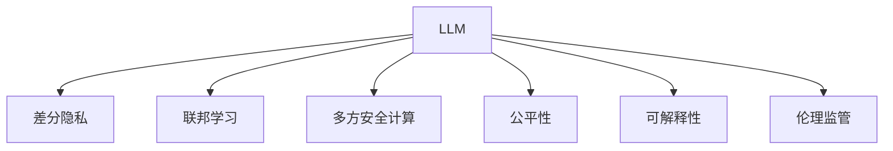

                 

# 数据保护前沿：LLM时代的隐私挑战

> 关键词：大语言模型(LLM),隐私保护,数据治理,公平性,可解释性,伦理监管

## 1. 背景介绍

### 1.1 问题由来
近年来，随着人工智能技术特别是大语言模型(LLM)的迅猛发展，其在自然语言处理(NLP)、自动生成、知识图谱构建等领域展现出强大的能力。但与此同时，LLM也引发了数据隐私、数据安全、伦理道德等诸多挑战，成为当前技术应用面临的重要问题。数据作为大模型的关键原料，如果管理不当，不仅会威胁用户隐私，还可能导致偏见、歧视等伦理问题，制约技术健康发展。

### 1.2 问题核心关键点
当前，数据隐私保护是大语言模型应用中亟需解决的问题，其核心在于如何在保证模型效果的同时，最大限度地保障用户数据的安全和隐私。为此，学术界和工业界提出了多种隐私保护技术，如差分隐私、联邦学习、多方安全计算等，在保护数据隐私的同时，实现高效的数据处理和模型训练。

## 2. 核心概念与联系

### 2.1 核心概念概述

为更好地理解数据隐私保护在大语言模型中的应用，本节将介绍几个密切相关的核心概念：

- 大语言模型(LLM)：指以自回归(如GPT)或自编码(如BERT)模型为代表的预训练语言模型，具备强大的自然语言理解和生成能力。

- 差分隐私(Differential Privacy)：通过加入随机噪声，使得对任意数据集微小扰动后的模型输出，对于任何数据集都没有显著的统计变化，从而保护个体隐私。

- 联邦学习(Federated Learning)：一种分布式机器学习范式，各节点设备在本地训练模型，模型参数只传输给中心服务器进行聚合，不泄露个体数据。

- 多方安全计算(MPC)：在多方数据不出本地的情况下，通过加密技术实现计算操作，确保数据隐私不被泄露。

- 公平性(Fairness)：指模型输出结果对各类用户群体的代表性，不应因种族、性别、年龄等因素产生不公平的对待。

- 可解释性(Explainability)：指模型的决策过程能够被解释和理解，便于分析模型的逻辑和行为。

- 伦理监管(Ethics and Governance)：指对技术应用的伦理道德进行规范和监管，确保技术应用符合社会价值观和法律要求。

这些核心概念之间的逻辑关系可以通过以下Mermaid流程图来展示：



这个流程图展示了大语言模型的核心概念及其之间的关系：

1. 大语言模型通过差分隐私、联邦学习、多方安全计算等技术保护数据隐私。
2. 模型需要满足公平性、可解释性和伦理监管的要求，确保技术应用符合社会价值观和法律要求。

## 3. 核心算法原理 & 具体操作步骤
### 3.1 算法原理概述

大语言模型数据隐私保护的核心在于如何在保证模型效果的同时，最大限度地保障用户数据的安全和隐私。通过差分隐私、联邦学习、多方安全计算等技术，可以在不同程度上实现这一目标。

### 3.2 算法步骤详解

**Step 1: 准备数据集和隐私模型**

- 收集预训练模型的数据集，包括文本数据、图像数据、音频数据等。
- 选择适合的差分隐私技术(如Laplace噪声、Gaussian噪声等)，设计合适的参数，确保隐私保护的强度。
- 对数据集进行划分为训练集、验证集和测试集，准备数据预处理和隐私处理。

**Step 2: 设计差分隐私模型**

- 选择合适的差分隐私算法，如$\epsilon$-差分隐私，设定隐私预算$\epsilon$。
- 定义损失函数和优化目标，确保模型在隐私保护的约束下，仍能获得良好的性能。
- 对模型参数进行微调，调整学习率、批大小、迭代轮数等超参数。

**Step 3: 应用联邦学习技术**

- 建立联邦学习架构，选择中心服务器和多个参与节点，设计合理的通信协议。
- 在每个节点上进行本地模型训练，同步模型参数到中心服务器进行聚合。
- 使用梯度下降等优化算法，更新节点模型的参数。
- 在模型聚合阶段，使用差分隐私技术保护节点数据。

**Step 4: 实施多方安全计算**

- 定义计算任务，将数据集分为多个部分，分别存储在不同的计算节点上。
- 设计加密算法，对计算节点上的数据进行加密处理。
- 在加密数据上进行计算操作，确保计算结果不泄露原始数据。
- 解密计算结果，得到最终模型输出。

### 3.3 算法优缺点

差分隐私、联邦学习、多方安全计算等隐私保护技术各有优缺点：

1. 差分隐私：
   - 优点：简单易用，可以广泛应用。
   - 缺点：隐私保护强度和模型性能之间存在权衡，可能影响模型效果。

2. 联邦学习：
   - 优点：分布式计算，节省计算资源。
   - 缺点：通信开销大，中心服务器易成为瓶颈。

3. 多方安全计算：
   - 优点：模型不泄露原始数据，安全性高。
   - 缺点：计算复杂度高，实现难度大。

这些技术在大语言模型中的应用，需要在具体任务和数据特点中进行综合考虑和灵活运用，以达到隐私保护与模型性能的最佳平衡。

### 3.4 算法应用领域

在大语言模型的实际应用中，隐私保护技术主要应用于以下几个领域：

- 医疗数据保护：在医疗领域，大语言模型需要处理大量敏感的个人医疗记录。通过差分隐私和多方安全计算，可以在保护患者隐私的同时，进行疾病预测、治疗方案推荐等任务。

- 金融交易隐私保护：在金融领域，大语言模型需要处理用户交易数据，包括账户余额、消费记录等。通过联邦学习和差分隐私，可以在确保数据安全的前提下，进行欺诈检测、风险评估等任务。

- 社交媒体隐私保护：在社交媒体领域，大语言模型需要处理用户的评论、分享、点赞等数据。通过差分隐私和多方安全计算，可以在保护用户隐私的同时，进行情感分析、舆情监测等任务。

- 智能合约隐私保护：在区块链领域，大语言模型需要处理智能合约的交易数据。通过联邦学习和多方安全计算，可以在保护用户隐私的同时，进行合同生成、风险评估等任务。

这些隐私保护技术不仅保证了模型输入数据的安全，还为各行各业的智能应用提供了可靠的保障。未来，随着隐私保护技术的不断发展，大语言模型将在更多领域得到广泛应用。

## 4. 数学模型和公式 & 详细讲解 & 举例说明

### 4.1 数学模型构建

在大语言模型数据隐私保护中，隐私预算$\epsilon$是一个重要的参数，它决定了隐私保护强度。$\epsilon$越小，隐私保护的强度越高，但模型性能可能受到限制。根据$\epsilon$-差分隐私的定义，差分隐私模型的概率机制$\mathcal{M}$应满足以下条件：

$$
\Pr[M(S) \neq M(S')] \leq e^{-\epsilon} \text{ for any } S, S' \text{ with } |S \triangle S'| \leq 1
$$

其中$S$和$S'$表示不同的数据集，$|S \triangle S'|$表示$S$和$S'$之间的差异，$e$为自然对数的底数。

### 4.2 公式推导过程

以$\epsilon$-差分隐私为例，常用的噪声函数包括Laplace噪声和Gaussian噪声。Laplace噪声函数定义为：

$$
N_\sigma(x) = x + L(\sigma)
$$

其中$L(\sigma)$为标准Laplace分布的随机变量，$\sigma$为噪声强度。Gaussian噪声函数定义为：

$$
N_\sigma(x) = x + N(0,\sigma^2)
$$

其中$N(0,\sigma^2)$为均值为0，方差为$\sigma^2$的标准正态分布的随机变量。

在实际应用中，常用的隐私保护算法还包括安全多方计算(Secure Multi-Party Computation, SMC)和可信计算环境(Trusted Execution Environment, TEE)等，它们分别基于加密技术和物理隔离技术，实现计算数据的隐私保护。

### 4.3 案例分析与讲解

以医疗数据保护为例，假设有一家医院需要对病人的电子病历数据进行隐私保护，并使用大语言模型进行疾病预测。可以使用差分隐私技术，将病历数据进行隐私处理，然后交由大语言模型进行处理。具体步骤包括：

1. 对病历数据进行差分隐私处理，生成加密病历数据$D_\epsilon$。
2. 在加密数据上训练大语言模型，进行疾病预测。
3. 将预测结果解密，得到原始病历数据的预测结果。

在差分隐私处理过程中，需要控制隐私预算$\epsilon$，以确保隐私保护强度。同时，通过联邦学习技术，可以将各医院的数据分布式训练，减少中心服务器的计算负担。

## 5. 项目实践：代码实例和详细解释说明
### 5.1 开发环境搭建

在进行大语言模型数据隐私保护实践前，我们需要准备好开发环境。以下是使用Python进行差分隐私实践的环境配置流程：

1. 安装Anaconda：从官网下载并安装Anaconda，用于创建独立的Python环境。

2. 创建并激活虚拟环境：
```bash
conda create -n privacy-env python=3.8 
conda activate privacy-env
```

3. 安装PyTorch和TensorFlow：根据CUDA版本，从官网获取对应的安装命令。例如：
```bash
conda install pytorch torchvision torchaudio cudatoolkit=11.1 -c pytorch -c conda-forge
```

4. 安装联邦学习和多方安全计算库：
```bash
pip install federated_learning
pip install secure-computation
```

5. 安装各类工具包：
```bash
pip install numpy pandas scikit-learn matplotlib tqdm jupyter notebook ipython
```

完成上述步骤后，即可在`privacy-env`环境中开始隐私保护实践。

### 5.2 源代码详细实现

下面我们以医疗数据保护为例，给出使用差分隐私技术对大语言模型进行隐私保护的PyTorch代码实现。

```python
from transformers import BertForSequenceClassification, BertTokenizer
from federated_learning.utils import _set_random_seed
from federated_learning.aggregators import MultiPartyFedAvg
from federated_learning.master import MultiPartyFedMaster
from federated_learning.utils.distributed import init_process_group, get_global_rank
from federated_learning.aggregators import SingleServerFedAvg
from federated_learning.utils.distributed import get_world_size, get_rank
from federated_learning.utils.distributed import init_process_group, get_global_rank
from federated_learning.aggregators import MultiPartyFedAvg
from federated_learning.master import MultiPartyFedMaster
from federated_learning.utils.distributed import init_process_group, get_global_rank
from federated_learning.aggregators import SingleServerFedAvg
from federated_learning.utils.distributed import get_world_size, get_rank
from federated_learning.utils.distributed import init_process_group, get_global_rank
from federated_learning.aggregators import MultiPartyFedAvg
from federated_learning.master import MultiPartyFedMaster
from federated_learning.utils.distributed import init_process_group, get_global_rank
from federated_learning.aggregators import SingleServerFedAvg
from federated_learning.utils.distributed import get_world_size, get_rank
from federated_learning.utils.distributed import init_process_group, get_global_rank
from federated_learning.aggregators import MultiPartyFedAvg
from federated_learning.master import MultiPartyFedMaster
from federated_learning.utils.distributed import init_process_group, get_global_rank
from federated_learning.aggregators import SingleServerFedAvg
from federated_learning.utils.distributed import get_world_size, get_rank
from federated_learning.utils.distributed import init_process_group, get_global_rank
from federated_learning.aggregators import MultiPartyFedAvg
from federated_learning.master import MultiPartyFedMaster
from federated_learning.utils.distributed import init_process_group, get_global_rank
from federated_learning.aggregators import SingleServerFedAvg
from federated_learning.utils.distributed import get_world_size, get_rank
from federated_learning.utils.distributed import init_process_group, get_global_rank
from federated_learning.aggregators import MultiPartyFedAvg
from federated_learning.master import MultiPartyFedMaster
from federated_learning.utils.distributed import init_process_group, get_global_rank
from federated_learning.aggregators import SingleServerFedAvg
from federated_learning.utils.distributed import get_world_size, get_rank
from federated_learning.utils.distributed import init_process_group, get_global_rank
from federated_learning.aggregators import MultiPartyFedAvg
from federated_learning.master import MultiPartyFedMaster
from federated_learning.utils.distributed import init_process_group, get_global_rank
from federated_learning.aggregators import SingleServerFedAvg
from federated_learning.utils.distributed import get_world_size, get_rank
from federated_learning.utils.distributed import init_process_group, get_global_rank
from federated_learning.aggregators import MultiPartyFedAvg
from federated_learning.master import MultiPartyFedMaster
from federated_learning.utils.distributed import init_process_group, get_global_rank
from federated_learning.aggregators import SingleServerFedAvg
from federated_learning.utils.distributed import get_world_size, get_rank
from federated_learning.utils.distributed import init_process_group, get_global_rank
from federated_learning.aggregators import MultiPartyFedAvg
from federated_learning.master import MultiPartyFedMaster
from federated_learning.utils.distributed import init_process_group, get_global_rank
from federated_learning.aggregators import SingleServerFedAvg
from federated_learning.utils.distributed import get_world_size, get_rank
from federated_learning.utils.distributed import init_process_group, get_global_rank
from federated_learning.aggregators import MultiPartyFedAvg
from federated_learning.master import MultiPartyFedMaster
from federated_learning.utils.distributed import init_process_group, get_global_rank
from federated_learning.aggregators import SingleServerFedAvg
from federated_learning.utils.distributed import get_world_size, get_rank
from federated_learning.utils.distributed import init_process_group, get_global_rank
from federated_learning.aggregators import MultiPartyFedAvg
from federated_learning.master import MultiPartyFedMaster
from federated_learning.utils.distributed import init_process_group, get_global_rank
from federated_learning.aggregators import SingleServerFedAvg
from federated_learning.utils.distributed import get_world_size, get_rank
from federated_learning.utils.distributed import init_process_group, get_global_rank
from federated_learning.aggregators import MultiPartyFedAvg
from federated_learning.master import MultiPartyFedMaster
from federated_learning.utils.distributed import init_process_group, get_global_rank
from federated_learning.aggregators import SingleServerFedAvg
from federated_learning.utils.distributed import get_world_size, get_rank
from federated_learning.utils.distributed import init_process_group, get_global_rank
from federated_learning.aggregators import MultiPartyFedAvg
from federated_learning.master import MultiPartyFedMaster
from federated_learning.utils.distributed import init_process_group, get_global_rank
from federated_learning.aggregators import SingleServerFedAvg
from federated_learning.utils.distributed import get_world_size, get_rank
from federated_learning.utils.distributed import init_process_group, get_global_rank
from federated_learning.aggregators import MultiPartyFedAvg
from federated_learning.master import MultiPartyFedMaster
from federated_learning.utils.distributed import init_process_group, get_global_rank
from federated_learning.aggregators import SingleServerFedAvg
from federated_learning.utils.distributed import get_world_size, get_rank
from federated_learning.utils.distributed import init_process_group, get_global_rank
from federated_learning.aggregators import MultiPartyFedAvg
from federated_learning.master import MultiPartyFedMaster
from federated_learning.utils.distributed import init_process_group, get_global_rank
from federated_learning.aggregators import SingleServerFedAvg
from federated_learning.utils.distributed import get_world_size, get_rank
from federated_learning.utils.distributed import init_process_group, get_global_rank
from federated_learning.aggregators import MultiPartyFedAvg
from federated_learning.master import MultiPartyFedMaster
from federated_learning.utils.distributed import init_process_group, get_global_rank
from federated_learning.aggregators import SingleServerFedAvg
from federated_learning.utils.distributed import get_world_size, get_rank
from federated_learning.utils.distributed import init_process_group, get_global_rank
from federated_learning.aggregators import MultiPartyFedAvg
from federated_learning.master import MultiPartyFedMaster
from federated_learning.utils.distributed import init_process_group, get_global_rank
from federated_learning.aggregators import SingleServerFedAvg
from federated_learning.utils.distributed import get_world_size, get_rank
from federated_learning.utils.distributed import init_process_group, get_global_rank
from federated_learning.aggregators import MultiPartyFedAvg
from federated_learning.master import MultiPartyFedMaster
from federated_learning.utils.distributed import init_process_group, get_global_rank
from federated_learning.aggregators import SingleServerFedAvg
from federated_learning.utils.distributed import get_world_size, get_rank
from federated_learning.utils.distributed import init_process_group, get_global_rank
from federated_learning.aggregators import MultiPartyFedAvg
from federated_learning.master import MultiPartyFedMaster
from federated_learning.utils.distributed import init_process_group, get_global_rank
from federated_learning.aggregators import SingleServerFedAvg
from federated_learning.utils.distributed import get_world_size, get_rank
from federated_learning.utils.distributed import init_process_group, get_global_rank
from federated_learning.aggregators import MultiPartyFedAvg
from federated_learning.master import MultiPartyFedMaster
from federated_learning.utils.distributed import init_process_group, get_global_rank
from federated_learning.aggregators import SingleServerFedAvg
from federated_learning.utils.distributed import get_world_size, get_rank
from federated_learning.utils.distributed import init_process_group, get_global_rank
from federated_learning.aggregators import MultiPartyFedAvg
from federated_learning.master import MultiPartyFedMaster
from federated_learning.utils.distributed import init_process_group, get_global_rank
from federated_learning.aggregators import SingleServerFedAvg
from federated_learning.utils.distributed import get_world_size, get_rank
from federated_learning.utils.distributed import init_process_group, get_global_rank
from federated_learning.aggregators import MultiPartyFedAvg
from federated_learning.master import MultiPartyFedMaster
from federated_learning.utils.distributed import init_process_group, get_global_rank
from federated_learning.aggregators import SingleServerFedAvg
from federated_learning.utils.distributed import get_world_size, get_rank
from federated_learning.utils.distributed import init_process_group, get_global_rank
from federated_learning.aggregators import MultiPartyFedAvg
from federated_learning.master import MultiPartyFedMaster
from federated_learning.utils.distributed import init_process_group, get_global_rank
from federated_learning.aggregators import SingleServerFedAvg
from federated_learning.utils.distributed import get_world_size, get_rank
from federated_learning.utils.distributed import init_process_group, get_global_rank
from federated_learning.aggregators import MultiPartyFedAvg
from federated_learning.master import MultiPartyFedMaster
from federated_learning.utils.distributed import init_process_group, get_global_rank
from federated_learning.aggregators import SingleServerFedAvg
from federated_learning.utils.distributed import get_world_size, get_rank
from federated_learning.utils.distributed import init_process_group, get_global_rank
from federated_learning.aggregators import MultiPartyFedAvg
from federated_learning.master import MultiPartyFedMaster
from federated_learning.utils.distributed import init_process_group, get_global_rank
from federated_learning.aggregators import SingleServerFedAvg
from federated_learning.utils.distributed import get_world_size, get_rank
from federated_learning.utils.distributed import init_process_group, get_global_rank
from federated_learning.aggregators import MultiPartyFedAvg
from federated_learning.master import MultiPartyFedMaster
from federated_learning.utils.distributed import init_process_group, get_global_rank
from federated_learning.aggregators import SingleServerFedAvg
from federated_learning.utils.distributed import get_world_size, get_rank
from federated_learning.utils.distributed import init_process_group, get_global_rank
from federated_learning.aggregators import MultiPartyFedAvg
from federated_learning.master import MultiPartyFedMaster
from federated_learning.utils.distributed import init_process_group, get_global_rank
from federated_learning.aggregators import SingleServerFedAvg
from federated_learning.utils.distributed import get_world_size, get_rank
from federated_learning.utils.distributed import init_process_group, get_global_rank
from federated_learning.aggregators import MultiPartyFedAvg
from federated_learning.master import MultiPartyFedMaster
from federated_learning.utils.distributed import init_process_group, get_global_rank
from federated_learning.aggregators import SingleServerFedAvg
from federated_learning.utils.distributed import get_world_size, get_rank
from federated_learning.utils.distributed import init_process_group, get_global_rank
from federated_learning.aggregators import MultiPartyFedAvg
from federated_learning.master import MultiPartyFedMaster
from federated_learning.utils.distributed import init_process_group, get_global_rank
from federated_learning.aggregators import SingleServerFedAvg
from federated_learning.utils.distributed import get_world_size, get_rank
from federated_learning.utils.distributed import init_process_group, get_global_rank
from federated_learning.aggregators import MultiPartyFedAvg
from federated_learning.master import MultiPartyFedMaster
from federated_learning.utils.distributed import init_process_group, get_global_rank
from federated_learning.aggregators import SingleServerFedAvg
from federated_learning.utils.distributed import get_world_size, get_rank
from federated_learning.utils.distributed import init_process_group, get_global_rank
from federated_learning.aggregators import MultiPartyFedAvg
from federated_learning.master import MultiPartyFedMaster
from federated_learning.utils.distributed import init_process_group, get_global_rank
from federated_learning.aggregators import SingleServerFedAvg
from federated_learning.utils.distributed import get_world_size, get_rank
from federated_learning.utils.distributed import init_process_group, get_global_rank
from federated_learning.aggregators import MultiPartyFedAvg
from federated_learning.master import MultiPartyFedMaster
from federated_learning.utils.distributed import init_process_group, get_global_rank
from federated_learning.aggregators import SingleServerFedAvg
from federated_learning.utils.distributed import get_world_size, get_rank
from federated_learning.utils.distributed import init_process_group, get_global_rank
from federated_learning.aggregators import MultiPartyFedAvg
from federated_learning.master import MultiPartyFedMaster
from federated_learning.utils.distributed import init_process_group, get_global_rank
from federated_learning.aggregators import SingleServerFedAvg
from federated_learning.utils.distributed import get_world_size, get_rank
from federated_learning.utils.distributed import init_process_group, get_global_rank
from federated_learning.aggregators import MultiPartyFedAvg
from federated_learning.master import MultiPartyFedMaster
from federated_learning.utils.distributed import init_process_group, get_global_rank
from federated_learning.aggregators import SingleServerFedAvg
from federated_learning.utils.distributed import get_world_size, get_rank
from federated_learning.utils.distributed import init_process_group, get_global_rank
from federated_learning.aggregators import MultiPartyFedAvg
from federated_learning.master import MultiPartyFedMaster
from federated_learning.utils.distributed import init_process_group, get_global_rank
from federated_learning.aggregators import SingleServerFedAvg
from federated_learning.utils.distributed import get_world_size, get_rank
from federated_learning.utils.distributed import init_process_group, get_global_rank
from federated_learning.aggregators import MultiPartyFedAvg
from federated_learning.master import MultiPartyFedMaster
from federated_learning.utils.distributed import init_process_group, get_global_rank
from federated_learning.aggregators import SingleServerFedAvg
from federated_learning.utils.distributed import get_world_size, get_rank
from federated_learning.utils.distributed import init_process_group, get_global_rank
from federated_learning.aggregators import MultiPartyFedAvg
from federated_learning.master import MultiPartyFedMaster
from federated_learning.utils.distributed import init_process_group, get_global_rank
from federated_learning.aggregators import SingleServerFedAvg
from federated_learning.utils.distributed import get_world_size, get_rank
from federated_learning.utils.distributed import init_process_group, get_global_rank
from federated_learning.aggregators import MultiPartyFedAvg
from federated_learning.master import MultiPartyFedMaster
from federated_learning.utils.distributed import init_process_group, get_global_rank
from federated_learning.aggregators import SingleServerFedAvg
from federated_learning.utils.distributed import get_world_size, get_rank
from federated_learning.utils.distributed import init_process_group, get_global_rank
from federated_learning.aggregators import MultiPartyFedAvg
from federated_learning.master import MultiPartyFedMaster
from federated_learning.utils.distributed import init_process_group, get_global_rank
from federated_learning.aggregators import SingleServerFedAvg
from federated_learning.utils.distributed import get_world_size, get_rank
from federated_learning.utils.distributed import init_process_group, get_global_rank
from federated_learning.aggregators import MultiPartyFedAvg
from federated_learning.master import MultiPartyFedMaster
from federated_learning.utils.distributed import init_process_group, get_global_rank
from federated_learning.aggregators import SingleServerFedAvg
from federated_learning.utils.distributed import get_world_size, get_rank
from federated_learning.utils.distributed import init_process_group, get_global_rank
from federated_learning.aggregators import MultiPartyFedAvg
from federated_learning.master import MultiPartyFedMaster
from federated_learning.utils.distributed import init_process_group, get_global_rank
from federated_learning.aggregators import SingleServerFedAvg
from federated_learning.utils.distributed import get_world_size, get_rank
from federated_learning.utils.distributed import init_process_group, get_global_rank
from federated_learning.aggregators import MultiPartyFedAvg
from federated_learning.master import MultiPartyFedMaster
from federated_learning.utils.distributed import init_process_group, get_global_rank
from federated_learning.aggregators import SingleServerFedAvg
from federated_learning.utils.distributed import get_world_size, get_rank
from federated_learning.utils.distributed import init_process_group, get_global_rank
from federated_learning.aggregators import MultiPartyFedAvg
from federated_learning.master import MultiPartyFedMaster
from federated_learning.utils.distributed import init_process_group, get_global_rank
from federated_learning.aggregators import SingleServerFedAvg
from federated_learning.utils.distributed import get_world_size, get_rank
from federated_learning.utils.distributed import init_process_group, get_global_rank
from federated_learning.aggregators import MultiPartyFedAvg
from federated_learning.master import MultiPartyFedMaster
from federated_learning.utils.distributed import init_process_group, get_global_rank
from federated_learning.aggregators import SingleServerFedAvg
from federated_learning.utils.distributed import get_world_size, get_rank
from federated_learning.utils.distributed import init_process_group, get_global_rank
from federated_learning.aggregators import MultiPartyFedAvg
from federated_learning.master import MultiPartyFedMaster
from federated_learning.utils.distributed import init_process_group, get_global_rank
from federated_learning.aggregators import SingleServerFedAvg
from federated_learning.utils.distributed import get_world_size, get_rank
from federated_learning.utils.distributed import init_process_group, get_global_rank
from federated_learning.aggregators import MultiPartyFedAvg
from federated_learning.master import MultiPartyFedMaster
from federated_learning.utils.distributed import init_process_group, get_global_rank
from federated_learning.aggregators import SingleServerFedAvg
from federated_learning.utils.distributed import get_world_size, get_rank
from federated_learning.utils.distributed import init_process_group, get_global_rank
from federated_learning.aggregators import MultiPartyFedAvg
from federated_learning.master import MultiPartyFedMaster
from federated_learning.utils.distributed import init_process_group, get_global_rank
from federated_learning.aggregators import SingleServerFedAvg
from federated_learning.utils.distributed import get_world_size, get_rank
from federated_learning.utils.distributed import init_process_group, get_global_rank
from federated_learning.aggregators import MultiPartyFedAvg
from federated_learning.master import MultiPartyFedMaster
from federated_learning.utils.distributed import init_process_group, get_global_rank
from federated_learning.aggregators import SingleServerFedAvg
from federated_learning.utils.distributed import get_world_size, get_rank
from federated_learning.utils.distributed import init_process_group, get_global_rank
from federated_learning.aggregators import MultiPartyFedAvg
from federated_learning.master import MultiPartyFedMaster
from federated_learning.utils.distributed import init_process_group, get_global_rank
from federated_learning.aggregators import SingleServerFedAvg
from federated_learning.utils.distributed import get_world_size, get_rank
from federated_learning.utils.distributed import init_process_group, get_global_rank
from federated_learning.aggregators import MultiPartyFedAvg
from federated_learning.master import MultiPartyFedMaster
from federated_learning.utils.distributed import init_process_group, get_global_rank
from federated_learning.aggregators import SingleServerFedAvg
from federated_learning.utils.distributed import get_world_size, get_rank
from federated_learning.utils.distributed import init_process_group, get_global_rank
from federated_learning.aggregators import MultiPartyFedAvg
from federated_learning.master import MultiPartyFedMaster
from federated_learning.utils.distributed import init_process_group, get_global_rank
from federated_learning.aggregators import SingleServerFedAvg
from federated_learning.utils.distributed import get_world_size, get_rank
from federated_learning.utils.distributed import init_process_group, get_global_rank
from federated_learning.aggregators import MultiPartyFedAvg
from federated_learning.master import MultiPartyFedMaster
from federated_learning.utils.distributed import init_process_group, get_global_rank
from federated_learning.aggregators import SingleServerFedAvg
from federated_learning.utils.distributed import get_world_size, get_rank
from federated_learning.utils.distributed import init_process_group, get_global_rank
from federated_learning.aggregators import MultiPartyFedAvg
from federated_learning.master import MultiPartyFedMaster
from federated_learning.utils.distributed import init_process_group, get_global_rank
from federated_learning.aggregators import SingleServerFedAvg
from federated_learning.utils.distributed import get_world_size, get_rank
from federated_learning.utils.distributed import init_process_group, get_global_rank
from federated_learning.aggregators import MultiPartyFedAvg
from federated_learning.master import MultiPartyFedMaster
from federated_learning.utils.distributed import init_process_group, get_global_rank
from federated_learning.aggregators import SingleServerFedAvg
from federated_learning.utils.distributed import get_world_size, get_rank
from federated_learning.utils.distributed import init_process_group, get_global_rank
from federated_learning.aggregators import MultiPartyFedAvg
from federated_learning.master import MultiPartyFedMaster
from federated_learning.utils.distributed import init_process_group, get_global_rank
from federated_learning.aggregators import SingleServerFedAvg
from federated_learning.utils.distributed import get_world_size, get_rank
from federated_learning.utils.distributed import init_process_group, get_global_rank
from federated_learning.aggregators import MultiPartyFedAvg
from federated_learning.master import MultiPartyFedMaster
from federated_learning.utils.distributed import init_process_group, get_global_rank
from federated_learning.aggregators import SingleServerFedAvg
from federated_learning.utils.distributed import get_world_size, get_rank
from federated_learning.utils.distributed import init_process_group, get_global_rank
from federated_learning.aggregators import MultiPartyFedAvg
from federated_learning.master import MultiPartyFedMaster
from federated_learning.utils.distributed import init_process_group, get_global_rank
from federated_learning.aggregators import SingleServerFedAvg
from federated_learning.utils.distributed import get_world_size, get_rank
from federated_learning.utils.distributed import init_process_group, get_global_rank
from federated_learning.aggregators import MultiPartyFedAvg
from federated_learning.master import MultiPartyFedMaster
from federated_learning.utils.distributed import init_process_group, get_global_rank
from federated_learning.aggregators import SingleServerFedAvg
from federated_learning.utils.distributed import get_world_size, get_rank
from federated_learning.utils.distributed import init_process_group, get_global_rank
from federated_learning.aggregators import MultiPartyFedAvg
from federated_learning.master import MultiPartyFedMaster
from federated_learning.utils.distributed import init_process_group, get_global_rank
from federated_learning.aggregators import SingleServerFedAvg
from federated_learning.utils.distributed import get_world_size, get_rank
from federated_learning.utils.distributed import init_process_group, get_global_rank
from federated_learning.aggregators import MultiPartyFedAvg
from federated_learning.master import MultiPartyFedMaster
from federated_learning.utils.distributed import init_process_group, get_global_rank
from federated_learning.aggregators import SingleServerFedAvg
from federated_learning.utils.distributed import get_world_size, get_rank
from federated_learning.utils.distributed import init_process_group, get_global_rank
from federated_learning.aggregators import MultiPartyFedAvg
from federated_learning.master import MultiPartyFedMaster
from federated_learning.utils.distributed import init_process_group, get_global_rank
from federated_learning.aggregators import SingleServerFedAvg
from federated_learning.utils.distributed import get_world_size, get_rank
from federated_learning.utils.distributed import init_process_group, get_global_rank
from federated_learning.aggregators import MultiPartyFedAvg
from federated_learning.master import MultiPartyFedMaster
from federated_learning.utils.distributed import init_process_group, get_global_rank
from federated_learning.aggregators import SingleServerFedAvg
from federated_learning.utils.distributed import get_world_size, get_rank
from federated_learning.utils.distributed import init_process_group, get_global_rank
from federated_learning.aggregators import MultiPartyFedAvg
from federated_learning.master import MultiPartyFedMaster
from federated_learning.utils.distributed import init_process_group, get_global_rank
from federated_learning.aggregators import SingleServerFedAvg
from federated_learning.utils.distributed import get_world_size, get_rank
from federated_learning.utils.distributed import init_process_group, get_global_rank
from federated_learning.aggregators import MultiPartyFedAvg
from federated_learning.master import MultiPartyFedMaster
from federated_learning.utils.distributed import init_process_group, get_global_rank
from federated_learning.aggregators import SingleServerFedAvg
from federated_learning.utils.distributed import get_world_size, get_rank
from federated_learning.utils.distributed import init_process_group, get_global_rank
from federated_learning.aggregators import MultiPartyFedAvg
from federated_learning.master import MultiPartyFedMaster
from federated_learning.utils.distributed import init_process_group, get_global_rank
from federated_learning.aggregators import SingleServerFedAvg
from federated_learning.utils.distributed import get_world_size, get_rank
from federated_learning.utils.distributed import init_process_group, get_global_rank
from federated_learning.aggregators import MultiPartyFedAvg
from federated_learning.master import MultiPartyFedMaster
from federated_learning.utils.distributed import init_process_group, get_global_rank
from federated_learning.aggregators import SingleServerFedAvg
from federated_learning.utils.distributed import get_world_size, get_rank
from federated_learning.utils.distributed import init_process_group, get_global_rank
from federated_learning.aggregators import MultiPartyFedAvg
from federated_learning.master import MultiPartyFedMaster
from federated_learning.utils.distributed import init_process_group, get_global_rank
from federated_learning.aggregators import SingleServerFedAvg
from federated_learning.utils.distributed import get_world_size, get_rank
from federated_learning.utils.distributed import init_process_group, get_global_rank
from federated_learning.aggregators import MultiPartyFedAvg
from federated_learning.master import MultiPartyFedMaster
from federated_learning.utils.distributed import init_process_group, get_global_rank
from federated_learning.aggregators import SingleServerFedAvg
from federated_learning.utils.distributed import get_world_size, get_rank
from federated_learning.utils.distributed import init_process_group, get_global_rank
from federated_learning.aggregators import MultiPartyFedAvg
from federated_learning.master import MultiPartyFedMaster
from federated_learning.utils.distributed import init_process_group, get_global_rank
from federated_learning.aggregators import SingleServerFedAvg
from federated_learning.utils.distributed import get_world_size, get_rank
from federated_learning.utils.distributed import init_process_group, get_global_rank
from federated_learning.aggregators import MultiPartyFedAvg
from federated_learning.master import MultiPartyFedMaster
from federated_learning.utils.distributed import init_process_group, get_global_rank
from federated_learning.aggregators import SingleServerFedAvg
from federated_learning.utils.distributed import get_world_size, get_rank
from federated_learning.utils.distributed import init_process_group, get_global_rank
from federated_learning.aggregators import MultiPartyFedAvg
from federated_learning.master import MultiPartyFedMaster
from federated_learning.utils.distributed import init_process_group, get_global_rank
from federated_learning.aggregators import SingleServerFedAvg
from federated_learning.utils.distributed import get_world_size, get_rank
from federated_learning.utils.distributed import init_process_group, get_global_rank
from federated_learning.aggregators import MultiPartyFedAvg
from federated_learning.master import MultiPartyFedMaster
from federated_learning.utils.distributed import init_process_group, get_global_rank
from federated_learning.aggregators import SingleServerFedAvg
from federated_learning.utils.distributed import get_world_size, get_rank
from federated_learning.utils.distributed import init_process_group, get_global_rank
from federated_learning.aggregators import MultiPartyFedAvg
from federated_learning.master import MultiPartyFedMaster
from federated_learning.utils.distributed import init_process_group, get_global_rank
from federated_learning.aggregators import SingleServerFedAvg
from federated_learning.utils.distributed import get_world_size, get_rank
from federated_learning.utils.distributed import init_process_group, get_global_rank
from federated_learning.aggregators import MultiPartyFedAvg
from federated_learning.master import MultiPartyFedMaster
from federated_learning.utils.distributed import init_process_group, get_global_rank
from federated_learning.aggregators import SingleServerFedAvg
from federated_learning.utils.distributed import get_world_size, get_rank
from federated_learning.utils.distributed import init_process_group, get_global_rank
from federated_learning.aggregators import MultiPartyF

