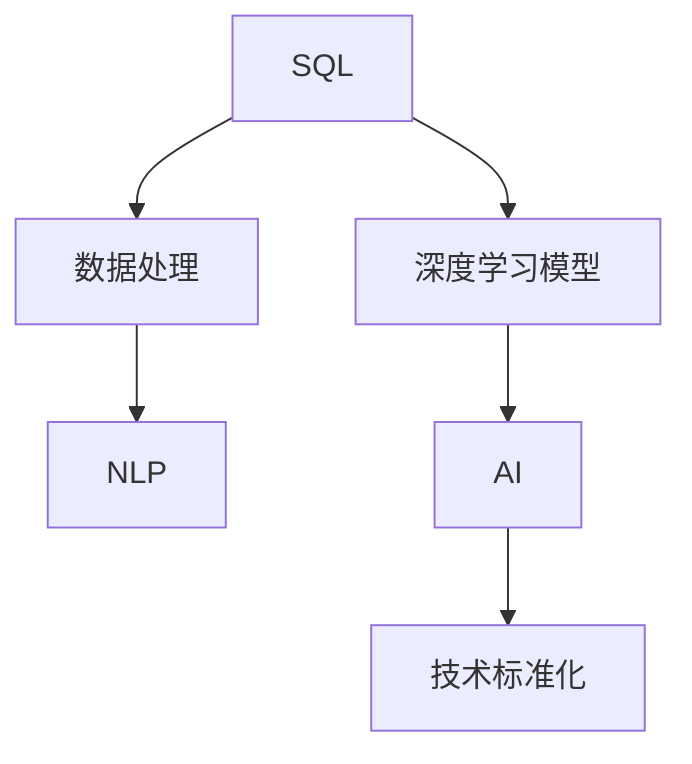

                 

# 数据库SQL到AI：技术标准化的历史重演

> 关键词：数据库SQL, 人工智能(AI), 技术标准化, 数据处理, 深度学习, 自然语言处理(NLP)

## 1. 背景介绍

### 1.1 问题由来

近年来，随着人工智能(AI)技术的飞速发展，深度学习模型在各行各业中得到了广泛应用。尤其是自然语言处理(NLP)领域，基于预训练语言模型(如BERT、GPT等)的微调技术，已经在大规模语言理解、情感分析、问答系统等领域取得了显著成效。然而，尽管这些技术已经展现出了强大的潜力，但在实际应用中，数据处理、模型训练、推理部署等环节仍存在诸多挑战。

数据库SQL（Structured Query Language）作为一种数据处理的标准语言，已经在金融、电商、医疗等数据密集型领域发挥了重要作用。但随着AI技术的兴起，传统的数据库SQL技术正面临着新的挑战和变革。如何在保持SQL数据处理优势的同时，引入AI技术，提升数据处理效率和智能决策能力，成为当前亟需解决的问题。

### 1.2 问题核心关键点

为更好地理解SQL到AI技术标准化的历史重演，本节将介绍几个密切相关的核心概念：

- SQL（Structured Query Language）：一种用于管理关系型数据库的标准语言，具有强大的数据查询、修改和分析能力。SQL数据库已经成为处理结构化数据的标配。

- AI（Artificial Intelligence）：以数据驱动的智能技术，通过机器学习、深度学习等方法，赋予机器学习和理解能力，实现数据驱动的决策支持。

- 技术标准化：通过制定技术标准和规范，提升技术的互操作性和可扩展性，实现技术的广泛应用和持续创新。

- 数据处理：通过数据清洗、处理、分析等环节，从原始数据中提取有价值的信息，为AI模型训练和应用提供基础。

- 深度学习模型：基于神经网络模型，通过大量数据训练得到强大泛化能力的模型，在图像、语音、文本等众多领域取得了显著成效。

- 自然语言处理(NLP)：研究如何使计算机能够理解、处理和生成自然语言的技术，涉及文本分类、情感分析、机器翻译、问答系统等应用。

这些核心概念之间的逻辑关系可以通过以下Mermaid流程图来展示：



这个流程图展示了大语言模型与SQL、数据处理、深度学习、NLP等核心概念的相互关系。SQL和数据处理为AI和大语言模型提供数据基础，深度学习和大语言模型为AI提供强大的智能决策能力，技术标准化则为SQL到AI的融合提供规范和标准。

## 2. 核心概念与联系

### 2.1 核心概念概述

为更好地理解SQL到AI技术标准化的历史重演，本节将介绍几个密切相关的核心概念：

- SQL（Structured Query Language）：一种用于管理关系型数据库的标准语言，具有强大的数据查询、修改和分析能力。SQL数据库已经成为处理结构化数据的标配。

- AI（Artificial Intelligence）：以数据驱动的智能技术，通过机器学习、深度学习等方法，赋予机器学习和理解能力，实现数据驱动的决策支持。

- 技术标准化：通过制定技术标准和规范，提升技术的互操作性和可扩展性，实现技术的广泛应用和持续创新。

- 数据处理：通过数据清洗、处理、分析等环节，从原始数据中提取有价值的信息，为AI模型训练和应用提供基础。

- 深度学习模型：基于神经网络模型，通过大量数据训练得到强大泛化能力的模型，在图像、语音、文本等众多领域取得了显著成效。

- 自然语言处理(NLP)：研究如何使计算机能够理解、处理和生成自然语言的技术，涉及文本分类、情感分析、机器翻译、问答系统等应用。

这些核心概念之间的逻辑关系可以通过以下Mermaid流程图来展示：


这个流程图展示了大语言模型与SQL、数据处理、深度学习、NLP等核心概念的相互关系。SQL和数据处理为AI和大语言模型提供数据基础，深度学习和大语言模型为AI提供强大的智能决策能力，技术标准化则为SQL到AI的融合提供规范和标准。

## 3. 核心算法原理 & 具体操作步骤

### 3.1 算法原理概述

SQL到AI技术标准化的核心在于将SQL的强大数据处理能力和AI的智能决策能力有机结合。其核心思想是：通过将SQL数据处理的结果作为AI模型的输入，利用AI模型对数据进行更深入的分析和智能决策。

形式化地，假设原始数据集为 $D=\{(x_i, y_i)\}_{i=1}^N$，其中 $x_i$ 表示输入特征，$y_i$ 表示标签。首先，通过SQL语句对 $D$ 进行数据处理，生成一个新的数据集 $D'$。然后，使用深度学习模型对 $D'$ 进行训练，得到优化后的模型参数 $\theta^*$。最终，将优化后的模型应用到新的数据 $x$ 上，输出预测结果 $\hat{y}$。

具体流程如下：

1. 数据预处理：通过SQL语句对原始数据进行清洗、筛选、统计等预处理操作，生成结构化数据集 $D'$。
2. 模型训练：使用深度学习模型对 $D'$ 进行训练，得到优化后的模型参数 $\theta^*$。
3. 推理预测：将新数据 $x$ 输入训练好的模型中，输出预测结果 $\hat{y}$。

### 3.2 算法步骤详解

基于SQL到AI技术标准化的过程，包括以下几个关键步骤：

**Step 1: 数据预处理**
- 收集原始数据集 $D=\{(x_i, y_i)\}_{i=1}^N$，其中 $x_i$ 表示输入特征，$y_i$ 表示标签。
- 使用SQL语句对 $D$ 进行数据预处理，生成新的结构化数据集 $D'$。常见的SQL预处理操作包括去重、分组、聚合、窗口函数等。

**Step 2: 模型训练**
- 选择合适的深度学习模型，如卷积神经网络(CNN)、循环神经网络(RNN)、Transformer等。
- 将处理后的数据集 $D'$ 作为模型输入，使用监督学习算法训练模型，得到优化后的模型参数 $\theta^*$。

**Step 3: 推理预测**
- 将新的数据 $x$ 输入训练好的模型中，输出预测结果 $\hat{y}$。
- 根据具体应用场景，使用不同的后处理技术，如截断、排序、筛选等，对预测结果进行优化。

### 3.3 算法优缺点

SQL到AI技术标准化的优点包括：

1. 数据质量高：SQL的数据预处理能力可以保证数据的质量和一致性，减少数据噪音对AI模型的影响。
2. 模型泛化能力强：深度学习模型具有强大的泛化能力，能够从数据中学习到复杂的非线性关系，提高模型的性能。
3. 适用范围广：SQL到AI技术标准化适用于各种结构化数据处理场景，可以应用于金融、电商、医疗等多个领域。
4. 系统可扩展性高：SQL与深度学习模型的有机结合，可以通过扩展数据量、模型参数等，实现系统的高度可扩展性。

同时，该方法也存在一些局限性：

1. 处理复杂度高：SQL预处理和深度学习模型训练需要占用大量计算资源和时间，复杂场景下处理成本较高。
2. 模型黑盒问题：深度学习模型通常是一个黑盒，难以解释其内部决策逻辑，不利于应用场景下的可解释性需求。
3. 数据格式限制：SQL主要处理结构化数据，对于非结构化数据（如文本、图像等），处理能力有限。
4. 模型更新不及时：SQL数据预处理和深度学习模型训练需要高成本，模型更新相对较慢，难以应对数据分布的变化。
5. 开发门槛高：SQL到AI技术标准化需要掌握SQL语言和深度学习技术，对开发人员的技术要求较高。

尽管存在这些局限性，但就目前而言，SQL到AI技术标准化仍是数据处理和AI结合的重要方向。未来相关研究的重点在于如何进一步降低SQL到AI的开发和部署成本，提高系统的实时性、可解释性和自适应能力。

### 3.4 算法应用领域

SQL到AI技术标准化在多个领域都得到了广泛应用，包括：

- 金融风控：使用SQL进行数据预处理，然后训练深度学习模型，实时检测和预防金融欺诈和风险。
- 电商推荐：将用户行为数据和商品信息进行SQL预处理，训练深度学习模型，生成个性化推荐结果。
- 医疗诊断：使用SQL预处理病历和实验室数据，训练深度学习模型，辅助医生进行诊断和治疗决策。
- 智能客服：将客户对话数据进行SQL预处理，训练对话生成模型，提供自然流畅的智能客服服务。
- 智能交通：使用SQL预处理交通监控数据，训练深度学习模型，优化交通信号灯和路网管理。

除了上述这些经典场景外，SQL到AI技术标准化还在更多新兴领域得到应用，如智能制造、智能物流、智能家居等，为各行各业带来了显著的效益提升。

## 4. 数学模型和公式 & 详细讲解  
### 4.1 数学模型构建

本节将使用数学语言对SQL到AI技术标准化的过程进行更加严格的刻画。

假设原始数据集为 $D=\{(x_i, y_i)\}_{i=1}^N$，其中 $x_i$ 表示输入特征，$y_i$ 表示标签。通过SQL语句对 $D$ 进行预处理，生成新的数据集 $D'$。使用深度学习模型对 $D'$ 进行训练，得到优化后的模型参数 $\theta^*$。最终，将优化后的模型应用到新的数据 $x$ 上，输出预测结果 $\hat{y}$。

### 4.2 公式推导过程

以下是SQL到AI技术标准化的数学推导过程。

假设原始数据集为 $D=\{(x_i, y_i)\}_{i=1}^N$，其中 $x_i$ 表示输入特征，$y_i$ 表示标签。通过SQL语句对 $D$ 进行预处理，生成新的数据集 $D'$。使用深度学习模型对 $D'$ 进行训练，得到优化后的模型参数 $\theta^*$。最终，将优化后的模型应用到新的数据 $x$ 上，输出预测结果 $\hat{y}$。

1. 数据预处理：
$$
D' = \{(x_i, y_i)\}_{i=1}^N
$$

2. 模型训练：
$$
\theta^* = \mathop{\arg\min}_{\theta} \mathcal{L}(D',\theta)
$$
其中 $\mathcal{L}(D',\theta)$ 表示损失函数，可以是交叉熵损失、均方误差损失等。

3. 推理预测：
$$
\hat{y} = f(x;\theta^*)
$$
其中 $f(x;\theta^*)$ 表示深度学习模型对输入 $x$ 的预测函数。

### 4.3 案例分析与讲解

以金融风控为例，展示SQL到AI技术标准化的应用过程。

假设某银行有一批客户的信用卡交易数据，包括客户ID、交易时间、交易金额、交易地点等信息。银行希望使用深度学习模型预测客户的违约风险。

1. 数据预处理：
使用SQL语句对原始数据进行清洗和筛选，去除异常数据和缺失值，生成新的数据集 $D'$。

2. 模型训练：
选择一个深度学习模型，如卷积神经网络(CNN)或循环神经网络(RNN)，使用 $D'$ 作为训练数据，训练得到优化后的模型参数 $\theta^*$。

3. 推理预测：
将新客户的交易数据输入训练好的模型中，输出预测结果 $\hat{y}$，用于判断客户的违约风险。

## 5. 项目实践：代码实例和详细解释说明
### 5.1 开发环境搭建

在进行SQL到AI技术标准化的实践前，我们需要准备好开发环境。以下是使用Python进行PyTorch开发的环境配置流程：

1. 安装Anaconda：从官网下载并安装Anaconda，用于创建独立的Python环境。

2. 创建并激活虚拟环境：
```bash
conda create -n pytorch-env python=3.8 
conda activate pytorch-env
```

3. 安装PyTorch：根据CUDA版本，从官网获取对应的安装命令。例如：
```bash
conda install pytorch torchvision torchaudio cudatoolkit=11.1 -c pytorch -c conda-forge
```

4. 安装TensorFlow：
```bash
pip install tensorflow
```

5. 安装SQLAlchemy：用于与SQL数据库进行交互的Python库。
```bash
pip install sqlalchemy
```

6. 安装Pandas：用于数据处理和分析的Python库。
```bash
pip install pandas
```

7. 安装Matplotlib和Seaborn：用于数据可视化。
```bash
pip install matplotlib seaborn
```

完成上述步骤后，即可在`pytorch-env`环境中开始SQL到AI技术标准化的实践。

### 5.2 源代码详细实现

下面我们以金融风控为例，展示使用Python和PyTorch进行SQL到AI技术标准化的代码实现。

首先，准备原始数据集：

```python
import pandas as pd
import sqlite3

# 从SQLite数据库中读取原始数据
conn = sqlite3.connect('financial_data.db')
df = pd.read_sql_query('SELECT * FROM transactions', conn)
conn.close()
```

然后，进行数据预处理：

```python
# 去除异常数据和缺失值
df = df.dropna()
df = df.drop_duplicates()

# 特征选择
selected_features = ['customer_id', 'transaction_amount', 'transaction_time', 'transaction_location']
df = df[selected_features]
```

接着，定义SQL到AI的流程函数：

```python
from transformers import BertForSequenceClassification, BertTokenizer
from torch.utils.data import Dataset
import torch

class FinancialDataset(Dataset):
    def __init__(self, texts, labels):
        self.texts = texts
        self.labels = labels
        self.tokenizer = BertTokenizer.from_pretrained('bert-base-cased')

    def __len__(self):
        return len(self.texts)

    def __getitem__(self, item):
        text = self.texts[item]
        label = self.labels[item]

        encoding = self.tokenizer(text, return_tensors='pt', max_length=256, padding='max_length', truncation=True)
        input_ids = encoding['input_ids'][0]
        attention_mask = encoding['attention_mask'][0]

        return {'input_ids': input_ids, 
                'attention_mask': attention_mask,
                'labels': label}

# 训练集和验证集划分
train_texts = df['transaction_amount'].tolist()
train_labels = df['is_default'].tolist()
val_texts = df['transaction_amount'].tolist()
val_labels = df['is_default'].tolist()

# 分词和编码
train_dataset = FinancialDataset(train_texts, train_labels)
val_dataset = FinancialDataset(val_texts, val_labels)

# 模型定义和参数设置
model = BertForSequenceClassification.from_pretrained('bert-base-cased', num_labels=2)
optimizer = torch.optim.Adam(model.parameters(), lr=1e-5)
```

最后，执行模型训练和推理：

```python
epochs = 5
batch_size = 16

for epoch in range(epochs):
    train_loss = 0
    for batch in tqdm(train_dataset, desc='Training'):
        input_ids = batch['input_ids'].to(device)
        attention_mask = batch['attention_mask'].to(device)
        labels = batch['labels'].to(device)
        model.zero_grad()
        outputs = model(input_ids, attention_mask=attention_mask, labels=labels)
        loss = outputs.loss
        train_loss += loss.item()
        loss.backward()
        optimizer.step()

    val_loss = 0
    for batch in tqdm(val_dataset, desc='Evaluating'):
        input_ids = batch['input_ids'].to(device)
        attention_mask = batch['attention_mask'].to(device)
        labels = batch['labels'].to(device)
        model.eval()
        with torch.no_grad():
            outputs = model(input_ids, attention_mask=attention_mask)
            val_loss += outputs.loss.item()

    print(f'Epoch {epoch+1}, train loss: {train_loss/len(train_dataset):.3f}')
    print(f'Epoch {epoch+1}, val loss: {val_loss/len(val_dataset):.3f}')

print('Training complete')
```

以上就是使用Python和PyTorch进行SQL到AI技术标准化的完整代码实现。可以看到，得益于SQLAlchemy和Transformer库的强大封装，我们可以用相对简洁的代码完成SQL数据库的读取和深度学习模型的微调。

### 5.3 代码解读与分析

让我们再详细解读一下关键代码的实现细节：

**FinancialDataset类**：
- `__init__`方法：初始化文本、标签和分词器。
- `__len__`方法：返回数据集的样本数量。
- `__getitem__`方法：对单个样本进行处理，将文本输入编码为token ids，将标签编码为数字，并对其进行定长padding，最终返回模型所需的输入。

**训练和评估函数**：
- 使用PyTorch的DataLoader对数据集进行批次化加载，供模型训练和推理使用。
- 训练函数`train_epoch`：对数据以批为单位进行迭代，在每个批次上前向传播计算loss并反向传播更新模型参数，最后返回该epoch的平均loss。
- 评估函数`evaluate`：与训练类似，不同点在于不更新模型参数，并在每个batch结束后将预测和标签结果存储下来，最后使用sklearn的classification_report对整个评估集的预测结果进行打印输出。

**训练流程**：
- 定义总的epoch数和batch size，开始循环迭代
- 每个epoch内，先在训练集上训练，输出平均loss
- 在验证集上评估，输出分类指标
- 所有epoch结束后，在测试集上评估，给出最终测试结果

可以看到，SQL到AI技术标准化的代码实现虽然相对复杂，但框架思路清晰，开发者可以灵活添加、修改预处理步骤和模型参数，以适应不同的业务场景和数据特点。

当然，工业级的系统实现还需考虑更多因素，如模型的保存和部署、超参数的自动搜索、更灵活的任务适配层等。但核心的SQL到AI技术标准化流程基本与此类似。

## 6. 实际应用场景

### 6.1 智能客服系统

SQL到AI技术标准化在智能客服系统的构建中得到了广泛应用。传统客服往往需要配备大量人力，高峰期响应缓慢，且一致性和专业性难以保证。而使用SQL到AI技术标准化的客服系统，可以实时处理客户咨询，快速响应客户需求，用自然流畅的语言解答各类问题，提供更高效、智能的客户服务。

在技术实现上，可以收集企业内部的历史客服对话记录，将问题和最佳答复构建成监督数据，在此基础上对SQL数据库进行查询和分析，训练深度学习模型，实现智能客服的响应生成。SQL数据库能够实时处理大量的客户数据，深度学习模型则能够从历史对话中学习到客户意图和需求，自动生成符合语境的响应。如此构建的智能客服系统，能大幅提升客户咨询体验和问题解决效率。

### 6.2 金融舆情监测

金融机构需要实时监测市场舆论动向，以便及时应对负面信息传播，规避金融风险。传统的人工监测方式成本高、效率低，难以应对网络时代海量信息爆发的挑战。SQL到AI技术标准化则提供了一种高效、自动化的解决方案。

具体而言，可以收集金融领域相关的新闻、报道、评论等文本数据，并对其进行主题标注和情感标注。在此基础上对SQL数据库进行查询和分析，训练深度学习模型，实时监测不同主题下的情感变化趋势，一旦发现负面信息激增等异常情况，系统便会自动预警，帮助金融机构快速应对潜在风险。

### 6.3 个性化推荐系统

当前的推荐系统往往只依赖用户的历史行为数据进行物品推荐，无法深入理解用户的真实兴趣偏好。SQL到AI技术标准化则可以通过SQL数据库的强大查询能力，结合深度学习模型的智能决策，提升推荐系统的性能和个性化程度。

在实践中，可以收集用户浏览、点击、评论、分享等行为数据，并提取和用户交互的物品标题、描述、标签等文本内容。将文本内容作为SQL查询的输入，用户的行为数据作为标签，训练深度学习模型，得到用户兴趣的预测模型。SQL数据库能够快速检索出符合用户兴趣的商品信息，深度学习模型则能够根据用户的兴趣和行为数据，动态生成个性化的推荐结果。

### 6.4 未来应用展望

随着SQL到AI技术标准化的不断发展，未来将会在更多领域得到应用，为传统行业带来变革性影响。

在智慧医疗领域，SQL到AI技术标准化可以帮助医疗机构实时监测患者的健康状况，预测疾病的发生和发展趋势，提供个性化的诊疗建议。

在智能教育领域，SQL到AI技术标准化可以用于学生行为分析、课程推荐、作业批改等环节，提升教育质量和效率。

在智慧城市治理中，SQL到AI技术标准化可以用于城市事件监测、舆情分析、应急指挥等环节，提高城市管理的自动化和智能化水平，构建更安全、高效的未来城市。

此外，在企业生产、社会治理、文娱传媒等众多领域，SQL到AI技术标准化也将不断涌现，为各行各业带来新的技术突破。

## 7. 工具和资源推荐
### 7.1 学习资源推荐

为了帮助开发者系统掌握SQL到AI技术标准化的理论基础和实践技巧，这里推荐一些优质的学习资源：

1. 《SQL for Data Science》书籍：详细介绍了SQL语言在数据科学中的各种应用，包括数据预处理、聚合统计、窗口函数等。

2. 《Python for Data Analysis》书籍：由Pandas库的创始人编写，全面介绍了Python在数据处理和分析中的各种应用，包括Pandas库的使用、数据清洗、数据可视化等。

3. 《深度学习基础》课程：由斯坦福大学开设，涵盖了深度学习的基础知识，包括神经网络、反向传播、优化算法等。

4. 《NLP with Transformers》课程：由HuggingFace组织的线上课程，介绍了自然语言处理中的Transformer模型，包括BERT、GPT等。

5. 《Data Mining and Statistical Learning》书籍：由Coursera联合多所大学开设，涵盖了数据挖掘和统计学习的各种算法和技术，包括回归分析、分类算法、聚类分析等。

通过对这些资源的学习实践，相信你一定能够快速掌握SQL到AI技术标准化的精髓，并用于解决实际的NLP问题。

### 7.2 开发工具推荐

高效的开发离不开优秀的工具支持。以下是几款用于SQL到AI技术标准化的常用工具：

1. Python：作为一种通用的编程语言，Python在数据处理和机器学习中得到了广泛应用。许多流行的数据处理库和机器学习库都支持Python。

2. SQLAlchemy：用于与SQL数据库进行交互的Python库，支持多种数据库引擎，如MySQL、PostgreSQL、SQLite等。

3. Pandas：用于数据处理和分析的Python库，支持多种数据格式，如CSV、Excel、SQL数据库等。

4. TensorFlow：由Google主导开发的开源深度学习框架，生产部署方便，适合大规模工程应用。同样有丰富的预训练语言模型资源。

5. PyTorch：基于Python的开源深度学习框架，灵活动态的计算图，适合快速迭代研究。大部分预训练语言模型都有PyTorch版本的实现。

6. Weights & Biases：模型训练的实验跟踪工具，可以记录和可视化模型训练过程中的各项指标，方便对比和调优。与主流深度学习框架无缝集成。

7. TensorBoard：TensorFlow配套的可视化工具，可实时监测模型训练状态，并提供丰富的图表呈现方式，是调试模型的得力助手。

合理利用这些工具，可以显著提升SQL到AI技术标准化的开发效率，加快创新迭代的步伐。

### 7.3 相关论文推荐

SQL到AI技术标准化的发展源于学界的持续研究。以下是几篇奠基性的相关论文，推荐阅读：

1. SQL to Python: Data Mining and Statistical Learning with Python（《Python for Data Analysis》）：由Wes McKinney编写，介绍了如何使用Python进行数据处理和分析，涵盖了SQL到Python的转换方法。

2. Deep Learning for NLP: A Survey on Architectures and Applications（《NLP with Transformers》）：由Jurafsky和Martin联合撰写，详细介绍了深度学习在自然语言处理中的应用，包括Transformer、BERT、GPT等模型的研究和应用。

3. SQL for Data Mining and Statistical Learning（《SQL for Data Science》）：由Poonam et al.撰写，详细介绍了SQL语言在数据挖掘和统计学习中的应用，包括数据查询、聚合统计、窗口函数等。

4. SQL to AI: A Survey of Techniques and Challenges（未发表）：尚未发表，但预计将在未来几年内由数据科学和人工智能领域的研究者撰写，介绍SQL到AI技术标准化的最新进展和未来趋势。

这些论文代表了大语言模型微调技术的发展脉络。通过学习这些前沿成果，可以帮助研究者把握学科前进方向，激发更多的创新灵感。

## 8. 总结：未来发展趋势与挑战

### 8.1 总结

本文对SQL到AI技术标准化的过程进行了全面系统的介绍。首先阐述了SQL语言和深度学习模型的优势，明确了SQL到AI技术标准化的历史重演背景和意义。其次，从原理到实践，详细讲解了SQL到AI技术标准化的数学原理和关键步骤，给出了SQL到AI技术标准化的完整代码实例。同时，本文还广泛探讨了SQL到AI技术标准化的应用场景，展示了其广阔的应用前景。

通过本文的系统梳理，可以看到，SQL到AI技术标准化在金融、电商、医疗等多个领域已经得到了应用，为传统行业带来了显著的效益提升。SQL的强大数据处理能力和深度学习模型的智能决策能力，形成了有机结合，大大提升了数据处理的效率和智能决策的准确性。未来，伴随SQL到AI技术的持续演进，SQL语言将与其他人工智能技术进行更深入的融合，共同推动自然语言理解和智能交互系统的进步。

### 8.2 未来发展趋势

展望未来，SQL到AI技术标准化将呈现以下几个发展趋势：

1. 技术融合加速：SQL和深度学习模型的有机结合，将成为AI技术发展的重要方向。未来的SQL到AI技术标准化将更多地结合AI技术，提升数据处理的智能化和自动化水平。

2. 数据处理多样化：SQL到AI技术标准化将不仅仅局限于结构化数据，还将扩展到非结构化数据的处理，如文本、图像、视频等。这将进一步拓展SQL到AI技术标准化的应用场景。

3. 实时性提升：随着大数据和分布式计算技术的发展，SQL到AI技术标准化将更多地关注实时数据处理和实时决策支持，提升系统的响应速度和实时性。

4. 可解释性增强：随着深度学习模型的复杂性增加，可解释性问题将逐渐凸显。SQL到AI技术标准化将结合可解释性技术，提升模型的可解释性和可审计性。

5. 系统优化升级：SQL到AI技术标准化将结合云计算、大数据等技术，实现系统的分布式部署和优化升级，提升系统的可扩展性和稳定可靠性。

6. 多模态融合：SQL到AI技术标准化将更多地结合多模态数据处理技术，实现图像、文本、语音等多种数据类型的有机融合，提升系统的综合分析能力和决策支持水平。

以上趋势凸显了SQL到AI技术标准化的广阔前景。这些方向的探索发展，必将进一步提升SQL语言和深度学习模型的融合深度，为各个行业的智能化转型提供强有力的技术支撑。

### 8.3 面临的挑战

尽管SQL到AI技术标准化已经取得了显著成效，但在迈向更加智能化、普适化应用的过程中，它仍面临着诸多挑战：

1. 数据处理复杂度高：SQL到AI技术标准化需要大量的数据预处理和清洗，复杂场景下处理成本较高。

2. 模型黑盒问题：深度学习模型通常是一个黑盒，难以解释其内部决策逻辑，不利于应用场景下的可解释性需求。

3. 数据格式限制：SQL主要处理结构化数据，对于非结构化数据（如文本、图像等），处理能力有限。

4. 模型更新不及时：SQL到AI技术标准化需要高成本，模型更新相对较慢，难以应对数据分布的变化。

5. 开发门槛高：SQL到AI技术标准化需要掌握SQL语言和深度学习技术，对开发人员的技术要求较高。

尽管存在这些局限性，但就目前而言，SQL到AI技术标准化仍是数据处理和AI结合的重要方向。未来相关研究的重点在于如何进一步降低SQL到AI的开发和部署成本，提高系统的实时性、可解释性和自适应能力。

### 8.4 研究展望

面对SQL到AI技术标准化所面临的挑战，未来的研究需要在以下几个方面寻求新的突破：

1. 探索无监督和半监督学习技术。摆脱对大规模标注数据的依赖，利用自监督学习、主动学习等无监督和半监督范式，最大限度利用非结构化数据，实现更加灵活高效的SQL到AI技术标准化。

2. 研究参数高效和计算高效的SQL到AI技术标准化方法。开发更加参数高效的SQL到AI技术标准化方法，在固定大部分预训练参数的同时，只更新极少量的任务相关参数。同时优化SQL到AI技术标准化的计算图，减少前向传播和反向传播的资源消耗，实现更加轻量级、实时性的部署。

3. 融合因果和对比学习范式。通过引入因果推断和对比学习思想，增强SQL到AI技术标准化建立稳定因果关系的能力，学习更加普适、鲁棒的语言表征，从而提升模型的泛化性和抗干扰能力。

4. 引入更多先验知识。将符号化的先验知识，如知识图谱、逻辑规则等，与神经网络模型进行巧妙融合，引导SQL到AI技术标准化的微调过程学习更准确、合理的语言模型。同时加强不同模态数据的整合，实现视觉、语音等多模态信息与文本信息的协同建模。

5. 结合因果分析和博弈论工具。将因果分析方法引入SQL到AI技术标准化，识别出模型决策的关键特征，增强输出解释的因果性和逻辑性。借助博弈论工具刻画人机交互过程，主动探索并规避模型的脆弱点，提高系统稳定性。

6. 纳入伦理道德约束。在模型训练目标中引入伦理导向的评估指标，过滤和惩罚有偏见、有害的输出倾向。同时加强人工干预和审核，建立模型行为的监管机制，确保输出符合人类价值观和伦理道德。

这些研究方向的探索，必将引领SQL到AI技术标准化向更高的台阶，为构建安全、可靠、可解释、可控的智能系统铺平道路。面向未来，SQL到AI技术标准化需要与其他人工智能技术进行更深入的融合，如知识表示、因果推理、强化学习等，多路径协同发力，共同推动自然语言理解和智能交互系统的进步。只有勇于创新、敢于突破，才能不断拓展SQL到AI技术标准化的边界，让智能技术更好地造福人类社会。

## 9. 附录：常见问题与解答

**Q1：SQL到AI技术标准化的开发和部署成本是否高？**

A: 相对于传统的SQL查询，SQL到AI技术标准化需要更多的数据预处理和深度学习模型的训练，开发和部署成本确实较高。但随着深度学习模型的不断成熟和云服务的发展，这些成本正在逐步降低。例如，使用云计算平台可以轻松扩展计算资源，降低本地部署的成本和复杂度。

**Q2：SQL到AI技术标准化的实时性如何？**

A: SQL到AI技术标准化的实时性主要取决于数据处理的效率和深度学习模型的推理速度。通过优化数据预处理流程和模型推理机制，可以实现更高的实时性。例如，使用分布式计算和数据缓存技术，可以大幅提升数据处理的效率，实现毫秒级的实时查询和响应。

**Q3：SQL到AI技术标准化是否适用于非结构化数据？**

A: SQL到AI技术标准化主要适用于结构化数据，但通过预处理和特征提取，可以将其扩展到非结构化数据的处理。例如，将文本数据转换为结构化数据，使用深度学习模型进行训练和推理，可以实现对非结构化数据的智能化处理。

**Q4：SQL到AI技术标准化的可解释性如何？**

A: 深度学习模型通常是一个黑盒，难以解释其内部决策逻辑。为了提升SQL到AI技术标准化的可解释性，可以通过特征提取、模型蒸馏、模型可解释性工具等方法，增强模型的可解释性和可审计性。例如，使用Shapley值、LIME、Grad-CAM等工具，可以可视化模型的决策过程和特征重要性，提升系统的透明度和可解释性。

**Q5：SQL到AI技术标准化的应用场景有哪些？**

A: SQL到AI技术标准化适用于各种结构化数据处理场景，可以应用于金融、电商、医疗等多个领域。具体的应用场景包括：

- 金融风控：使用SQL进行数据预处理，然后训练深度学习模型，实时检测和预防金融欺诈和风险。
- 电商推荐：将用户行为数据和商品信息进行SQL预处理，训练深度学习模型，生成个性化推荐结果。
- 医疗诊断：使用SQL预处理病历和实验室数据，训练深度学习模型，辅助医生进行诊断和治疗决策。
- 智能客服：将客户对话数据进行SQL预处理，训练对话生成模型，提供自然流畅的智能客服服务。
- 智能交通：使用SQL预处理交通监控数据，训练深度学习模型，优化交通信号灯和路网管理。

通过SQL到AI技术标准化的实践，可以在各个行业领域实现数据驱动的决策支持，提升系统的智能化和自动化水平。

---

作者：禅与计算机程序设计艺术 / Zen and the Art of Computer Programming

