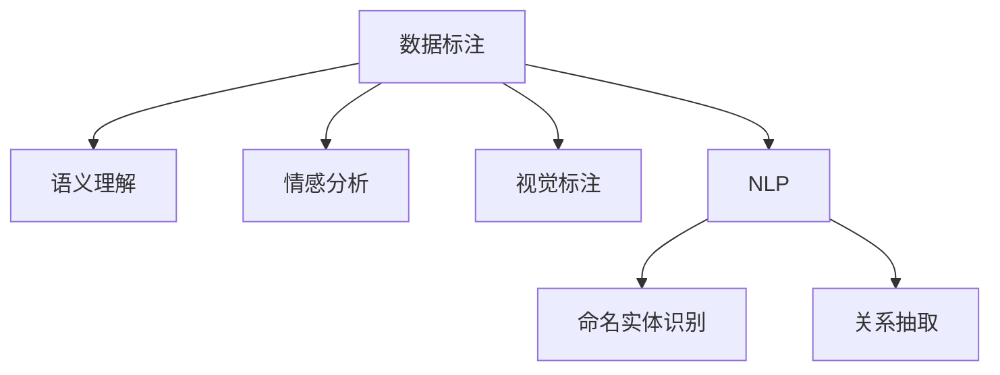
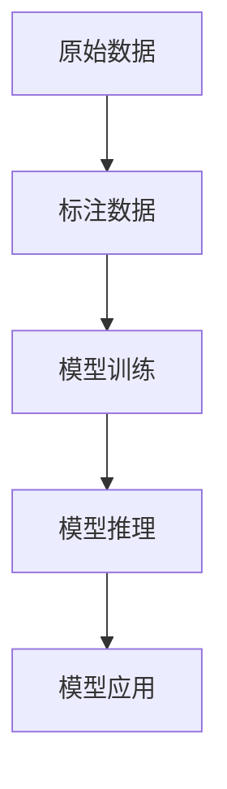

                 

# 数据标注：人工智能发展背后的幕后功臣

在人工智能发展的浪潮中，有一群幕后英雄在默默支持着AI技术的蓬勃发展，他们就是数据标注师。数据标注师，虽然不像算法工程师那样璀璨夺目，也不如数据科学家那样风光无限，但正是他们的辛勤工作，为AI模型提供了高质量、高价值的训练数据，确保了模型的正确性和可靠性。本文将深入探讨数据标注的重要性、核心概念、操作方法，并展望其未来的发展趋势。

## 1. 背景介绍

### 1.1 问题由来
随着深度学习技术的迅猛发展，AI模型在图像识别、语音识别、自然语言处理等领域的性能不断提升。然而，这些模型的训练需要大量的标注数据作为支撑。这些数据往往包含丰富的语义信息、情感色彩、视觉特征等，只有通过人工标注才能高效地获取。数据标注师便在这一过程中扮演了关键角色。

### 1.2 问题核心关键点
数据标注的核心在于提取数据中隐含的语义、行为、属性等信息，并将其转化为模型可以理解的格式。数据标注不仅影响模型的训练效果，还在很大程度上决定了模型的应用范围和性能表现。

## 2. 核心概念与联系

### 2.1 核心概念概述

为更好地理解数据标注的重要性，本节将介绍几个关键概念：

- **数据标注(Data Labeling)**：指对原始数据进行人工标注，提取其中的关键信息，以指导机器学习模型进行训练和推理。常见的标注类型包括分类、回归、文本标注等。
- **语义理解(Semantic Understanding)**：指模型对文本、图像等数据中语义信息的理解和识别。标注师通过对数据进行标注，帮助模型学习这些语义信息。
- **情感分析(Emotion Analysis)**：指模型对文本中情感信息的识别，如正面、负面、中性等。情感分析在社交媒体、评论分析等领域有广泛应用。
- **视觉标注(Visual Labeling)**：指对图像、视频等视觉数据进行标注，提取其中的物体、场景、动作等信息。视觉标注在计算机视觉、自动驾驶等领域有重要应用。
- **自然语言处理(Natural Language Processing, NLP)**：指让机器理解、处理和生成人类语言的技术。数据标注在NLP中尤为关键，如命名实体识别、关系抽取等任务都需要标注数据支持。

这些概念之间的逻辑关系可以通过以下Mermaid流程图来展示：



这个流程图展示数据标注的核心概念及其与其它领域的关系：

1. 数据标注是AI模型训练的基础。
2. 语义理解、情感分析、视觉标注等任务均依赖于数据标注提供的信息。
3. NLP中的许多任务，如命名实体识别、关系抽取等，都需基于数据标注进行训练。

### 2.2 核心概念原理和架构的 Mermaid 流程图



这个流程图展示了数据标注在AI模型应用中的核心作用：

1. 原始数据通过数据标注转化为模型可以理解的格式。
2. 模型在标注数据上训练，学习其中的语义、情感等信息。
3. 训练后的模型在实际应用中进行推理预测，解决具体问题。

## 3. 核心算法原理 & 具体操作步骤

### 3.1 算法原理概述

数据标注的算法原理主要包括数据准备、数据标注、数据清洗和数据存储四个步骤。

1. **数据准备**：收集、整理、筛选需要标注的数据，确保数据的多样性和代表性。
2. **数据标注**：使用人工或半自动工具对数据进行标注，提取关键信息。
3. **数据清洗**：检查标注数据的质量，修正错误和遗漏，确保标注数据的准确性。
4. **数据存储**：将标注数据存储到数据库或存储系统中，便于后续处理和分析。

### 3.2 算法步骤详解

#### 3.2.1 数据准备
1. **数据来源**：从公开数据集、社交媒体、行业数据库等渠道收集数据。
2. **数据筛选**：根据任务需求，筛选出有价值的数据，去除噪音和无关数据。
3. **数据整理**：对数据进行格式化、归一化、去重等预处理，确保数据质量。

#### 3.2.2 数据标注
1. **标注工具**：使用专业的标注工具，如Labelbox、Prodigy等，对数据进行标注。
2. **标注方法**：根据任务需求，采用分类、回归、框标注、关系标注等方法进行标注。
3. **标注标准**：制定统一的标注标准和规范，确保标注的一致性和可复现性。

#### 3.2.3 数据清洗
1. **数据校验**：通过人工审核或算法校验，检测标注数据中的错误和不一致。
2. **错误修正**：对标注数据中的错误和遗漏进行修正，确保数据质量。
3. **一致性检查**：对标注数据进行一致性检查，确保不同标注者间的一致性。

#### 3.2.4 数据存储
1. **存储格式**：选择适合的存储格式，如CSV、JSON、SQL等。
2. **存储位置**：将标注数据存储在云端或本地服务器上，确保数据安全。
3. **备份和恢复**：定期备份数据，防止数据丢失，确保数据恢复。

### 3.3 算法优缺点

数据标注的优点包括：

1. **提升模型性能**：高质量标注数据是模型训练的基础，标注数据的多样性和代表性直接影响模型的性能。
2. **减少过拟合**：标注数据能够帮助模型更好地理解数据的分布和特征，减少过拟合。
3. **促进任务完成**：标注数据为许多NLP、计算机视觉等任务提供了关键信息，促进了任务完成。

数据标注的缺点包括：

1. **成本高**：数据标注需要大量的人工参与，成本较高。
2. **效率低**：标注过程繁琐复杂，标注效率较低。
3. **质量不稳定**：标注数据的质量受标注师水平和标注工具影响，质量不稳定。

### 3.4 算法应用领域

数据标注广泛应用于以下领域：

- **自然语言处理(NLP)**：如命名实体识别、情感分析、机器翻译等。
- **计算机视觉(CV)**：如图像分类、目标检测、图像分割等。
- **语音识别(Speech Recognition)**：如语音转写、语音情感识别等。
- **生物信息学(Bioinformatics)**：如基因序列分析、蛋白质结构预测等。
- **医学影像分析(Medical Imaging)**：如肿瘤检测、放射影像分析等。

## 4. 数学模型和公式 & 详细讲解 & 举例说明

### 4.1 数学模型构建

在数据标注中，我们通常使用监督学习模型进行训练，以输出标注数据的正确分类。例如，对于图像分类任务，我们可以使用卷积神经网络(CNN)作为模型，通过标注数据进行训练。

数学模型构建如下：

- **输入**：标注数据$(x_i, y_i)$，其中$x_i$为原始数据，$y_i$为标注标签。
- **模型**：假设模型为$f(x; \theta)$，其中$\theta$为模型参数。
- **损失函数**：定义损失函数$\mathcal{L}(\theta)$，用于衡量模型输出与标注标签之间的差异。
- **优化算法**：使用优化算法（如梯度下降、Adam等）最小化损失函数，更新模型参数$\theta$。

### 4.2 公式推导过程

以图像分类任务为例，假设有$n$个样本，每个样本的标注标签为$y_i \in \{1, 2, ..., C\}$，其中$C$为类别数。模型输出为$f(x_i; \theta) \in [0, 1]^C$，表示模型对每个类别的预测概率。损失函数采用交叉熵损失：

$$
\mathcal{L}(\theta) = -\frac{1}{n}\sum_{i=1}^n \sum_{c=1}^C y_{ic} \log f_{ic}(x_i; \theta)
$$

其中$f_{ic}(x_i; \theta)$表示模型对第$i$个样本属于第$c$类的预测概率。

通过梯度下降等优化算法，最小化损失函数，更新模型参数：

$$
\theta \leftarrow \theta - \eta \nabla_{\theta} \mathcal{L}(\theta)
$$

其中$\eta$为学习率，$\nabla_{\theta} \mathcal{L}(\theta)$为损失函数对模型参数的梯度。

### 4.3 案例分析与讲解

以情感分析任务为例，我们收集了社交媒体上的评论数据，每个评论对应一个情感标签（如正面、负面、中性）。我们首先使用标注工具对数据进行标注，然后将标注数据输入到预训练的BERT模型中，进行微调。

具体步骤如下：

1. **数据准备**：收集社交媒体评论数据，对其进行预处理和筛选，去除噪音和无关数据。
2. **数据标注**：使用标注工具对每个评论进行情感标注，提取情感信息。
3. **数据清洗**：对标注数据进行校验和修正，确保标注数据的质量。
4. **数据存储**：将标注数据存储到数据库中，便于后续处理和分析。
5. **模型微调**：将标注数据输入到预训练的BERT模型中，进行微调。
6. **模型评估**：在测试数据集上评估微调后的模型，确保模型性能达标。

## 5. 项目实践：代码实例和详细解释说明

### 5.1 开发环境搭建

在进行数据标注实践前，我们需要准备好开发环境。以下是使用Python进行NLP任务开发的环境配置流程：

1. 安装Anaconda：从官网下载并安装Anaconda，用于创建独立的Python环境。
2. 创建并激活虚拟环境：
```bash
conda create -n nlp-env python=3.8 
conda activate nlp-env
```
3. 安装PyTorch：根据CUDA版本，从官网获取对应的安装命令。例如：
```bash
conda install pytorch torchvision torchaudio cudatoolkit=11.1 -c pytorch -c conda-forge
```
4. 安装Natural Language Toolkit (NLTK)：
```bash
pip install nltk
```
5. 安装相关依赖包：
```bash
pip install pandas numpy scikit-learn
```

完成上述步骤后，即可在`nlp-env`环境中开始数据标注实践。

### 5.2 源代码详细实现

下面我们以情感分析任务为例，给出使用NLP工具对文本数据进行标注的PyTorch代码实现。

首先，定义标注数据类：

```python
import torch
import torch.nn as nn
import torch.optim as optim

class LabelDataset(torch.utils.data.Dataset):
    def __init__(self, texts, labels, tokenizer, max_len):
        self.texts = texts
        self.labels = labels
        self.tokenizer = tokenizer
        self.max_len = max_len
    
    def __len__(self):
        return len(self.texts)
    
    def __getitem__(self, item):
        text = self.texts[item]
        label = self.labels[item]
        
        encoding = self.tokenizer(text, return_tensors='pt', max_length=self.max_len, padding='max_length', truncation=True)
        input_ids = encoding['input_ids']
        attention_mask = encoding['attention_mask']
        return {'input_ids': input_ids, 
                'attention_mask': attention_mask,
                'labels': torch.tensor(label, dtype=torch.long)}
```

然后，定义模型和优化器：

```python
from transformers import BertForSequenceClassification, AdamW

model = BertForSequenceClassification.from_pretrained('bert-base-cased', num_labels=3)
optimizer = AdamW(model.parameters(), lr=2e-5)
```

接着，定义训练和评估函数：

```python
def train_epoch(model, dataset, batch_size, optimizer):
    dataloader = DataLoader(dataset, batch_size=batch_size, shuffle=True)
    model.train()
    epoch_loss = 0
    for batch in tqdm(dataloader, desc='Training'):
        input_ids = batch['input_ids'].to(device)
        attention_mask = batch['attention_mask'].to(device)
        labels = batch['labels'].to(device)
        model.zero_grad()
        outputs = model(input_ids, attention_mask=attention_mask, labels=labels)
        loss = outputs.loss
        epoch_loss += loss.item()
        loss.backward()
        optimizer.step()
    return epoch_loss / len(dataloader)

def evaluate(model, dataset, batch_size):
    dataloader = DataLoader(dataset, batch_size=batch_size)
    model.eval()
    preds, labels = [], []
    with torch.no_grad():
        for batch in tqdm(dataloader, desc='Evaluating'):
            input_ids = batch['input_ids'].to(device)
            attention_mask = batch['attention_mask'].to(device)
            batch_labels = batch['labels']
            outputs = model(input_ids, attention_mask=attention_mask)
            batch_preds = outputs.logits.argmax(dim=1).to('cpu').tolist()
            batch_labels = batch_labels.to('cpu').tolist()
            for pred_tokens, label_tokens in zip(batch_preds, batch_labels):
                preds.append(pred_tokens)
                labels.append(label_tokens)
    return preds, labels
```

最后，启动训练流程并在测试集上评估：

```python
epochs = 5
batch_size = 16

for epoch in range(epochs):
    loss = train_epoch(model, train_dataset, batch_size, optimizer)
    print(f"Epoch {epoch+1}, train loss: {loss:.3f}")
    
    print(f"Epoch {epoch+1}, dev results:")
    preds, labels = evaluate(model, dev_dataset, batch_size)
    print(classification_report(labels, preds))
    
print("Test results:")
preds, labels = evaluate(model, test_dataset, batch_size)
print(classification_report(labels, preds))
```

以上就是使用PyTorch对BERT进行情感分析任务标注的完整代码实现。可以看到，得益于HuggingFace的强大封装，我们可以用相对简洁的代码完成BERT模型的加载和微调。

### 5.3 代码解读与分析

让我们再详细解读一下关键代码的实现细节：

**LabelDataset类**：
- `__init__`方法：初始化文本、标签、分词器等关键组件。
- `__len__`方法：返回数据集的样本数量。
- `__getitem__`方法：对单个样本进行处理，将文本输入编码为token ids，将标签转换为模型需要的格式，并进行定长padding，最终返回模型所需的输入。

**模型和优化器定义**：
- 使用预训练的BERT模型作为初始化参数，并设置优化器。

**训练和评估函数**：
- 使用PyTorch的DataLoader对数据集进行批次化加载，供模型训练和推理使用。
- 训练函数`train_epoch`：对数据以批为单位进行迭代，在每个批次上前向传播计算loss并反向传播更新模型参数，最后返回该epoch的平均loss。
- 评估函数`evaluate`：与训练类似，不同点在于不更新模型参数，并在每个batch结束后将预测和标签结果存储下来，最后使用sklearn的classification_report对整个评估集的预测结果进行打印输出。

**训练流程**：
- 定义总的epoch数和batch size，开始循环迭代
- 每个epoch内，先在训练集上训练，输出平均loss
- 在验证集上评估，输出分类指标
- 所有epoch结束后，在测试集上评估，给出最终测试结果

可以看到，PyTorch配合HuggingFace库使得BERT模型的微调代码实现变得简洁高效。开发者可以将更多精力放在数据处理、模型改进等高层逻辑上，而不必过多关注底层的实现细节。

当然，工业级的系统实现还需考虑更多因素，如模型的保存和部署、超参数的自动搜索、更灵活的任务适配层等。但核心的微调范式基本与此类似。

## 6. 实际应用场景

### 6.1 智能客服系统

基于数据标注的智能客服系统，可以广泛应用于各种客户服务场景。传统客服往往需要配备大量人力，高峰期响应缓慢，且一致性和专业性难以保证。而使用标注好的数据训练的智能客服系统，可以7x24小时不间断服务，快速响应客户咨询，用自然流畅的语言解答各类常见问题。

在技术实现上，可以收集企业内部的历史客服对话记录，将问题和最佳答复构建成监督数据，在此基础上对预训练对话模型进行微调。微调后的对话模型能够自动理解用户意图，匹配最合适的答案模板进行回复。对于客户提出的新问题，还可以接入检索系统实时搜索相关内容，动态组织生成回答。如此构建的智能客服系统，能大幅提升客户咨询体验和问题解决效率。

### 6.2 金融舆情监测

金融机构需要实时监测市场舆论动向，以便及时应对负面信息传播，规避金融风险。传统的人工监测方式成本高、效率低，难以应对网络时代海量信息爆发的挑战。基于数据标注的文本分类和情感分析技术，为金融舆情监测提供了新的解决方案。

具体而言，可以收集金融领域相关的新闻、报道、评论等文本数据，并对其进行主题标注和情感标注。在此基础上对预训练语言模型进行微调，使其能够自动判断文本属于何种主题，情感倾向是正面、中性还是负面。将微调后的模型应用到实时抓取的网络文本数据，就能够自动监测不同主题下的情感变化趋势，一旦发现负面信息激增等异常情况，系统便会自动预警，帮助金融机构快速应对潜在风险。

### 6.3 个性化推荐系统

当前的推荐系统往往只依赖用户的历史行为数据进行物品推荐，无法深入理解用户的真实兴趣偏好。基于数据标注的个性化推荐系统可以更好地挖掘用户行为背后的语义信息，从而提供更精准、多样的推荐内容。

在实践中，可以收集用户浏览、点击、评论、分享等行为数据，提取和用户交互的物品标题、描述、标签等文本内容。将文本内容作为模型输入，用户的后续行为（如是否点击、购买等）作为监督信号，在此基础上微调预训练语言模型。微调后的模型能够从文本内容中准确把握用户的兴趣点。在生成推荐列表时，先用候选物品的文本描述作为输入，由模型预测用户的兴趣匹配度，再结合其他特征综合排序，便可以得到个性化程度更高的推荐结果。

### 6.4 未来应用展望

随着数据标注技术的发展，基于标注数据的人工智能应用将更加广泛。数据标注不仅限于传统的NLP、CV等领域，还将逐步扩展到更多场景中，为AI技术带来新的突破。

在智慧医疗领域，基于数据标注的医疗问答、病历分析、药物研发等应用将提升医疗服务的智能化水平，辅助医生诊疗，加速新药开发进程。

在智能教育领域，数据标注可应用于作业批改、学情分析、知识推荐等方面，因材施教，促进教育公平，提高教学质量。

在智慧城市治理中，数据标注可应用于城市事件监测、舆情分析、应急指挥等环节，提高城市管理的自动化和智能化水平，构建更安全、高效的未来城市。

此外，在企业生产、社会治理、文娱传媒等众多领域，基于数据标注的人工智能应用也将不断涌现，为各行各业带来新的技术创新和商业价值。相信随着技术的日益成熟，数据标注必将在构建人机协同的智能时代中扮演越来越重要的角色。

## 7. 工具和资源推荐

### 7.1 学习资源推荐

为了帮助开发者系统掌握数据标注的重要性、核心概念和操作方法，这里推荐一些优质的学习资源：

1. **《Data Labeling for Machine Learning Projects》**：这是一本关于数据标注的经典书籍，详细介绍了数据标注在机器学习项目中的实践方法和应用案例。
2. **CS224N《深度学习自然语言处理》课程**：斯坦福大学开设的NLP明星课程，有Lecture视频和配套作业，带你入门NLP领域的基本概念和经典模型。
3. **Kaggle平台**：全球最大的数据科学竞赛平台，提供大量的标注数据集和标注任务，是数据标注实践的绝佳场所。
4. **Labelbox**：一个专门用于数据标注的平台，提供多种标注工具和协作功能，是标注师的好帮手。
5. **Prodigy**：一个在线标注平台，支持自动化标注和半自动化标注，提供多种标注工具和任务。

通过对这些资源的学习实践，相信你一定能够快速掌握数据标注的精髓，并用于解决实际的NLP问题。

### 7.2 开发工具推荐

高效的开发离不开优秀的工具支持。以下是几款用于数据标注开发的常用工具：

1. **Labelbox**：一个专门用于数据标注的平台，提供多种标注工具和协作功能，是标注师的好帮手。
2. **Prodigy**：一个在线标注平台，支持自动化标注和半自动化标注，提供多种标注工具和任务。
3. **WebAnno**：一个开源的Web标注工具，支持多种数据格式和标注方法，具有强大的数据管理功能。
4. **Label Studio**：一个简单易用的标注工具，支持多种数据格式和标注方法，适合小规模标注任务。
5. **ArcGIS**：一款地理信息系统软件，支持对地理数据的标注和管理，适合地理信息系统领域的应用。

合理利用这些工具，可以显著提升数据标注的效率和质量，加快AI模型的开发和迭代。

### 7.3 相关论文推荐

数据标注技术的发展源于学界的持续研究。以下是几篇奠基性的相关论文，推荐阅读：

1. **《Data Labeling and Unsupervised Learning for AI》**：这篇论文系统地介绍了数据标注的重要性和方法，提供了大量的案例和数据。
2. **《Semantic Labeling for NLP》**：这篇论文讨论了如何通过语义标注提高NLP任务的效果，提供了多种语义标注技术和方法。
3. **《Data Labeling for Deep Learning: A Survey》**：这篇论文综述了数据标注在深度学习中的应用，提供了大量的算法和案例。
4. **《Interactive and Crowdsourced Data Labeling》**：这篇论文介绍了交互式和众包数据标注方法，提供了多种实用的标注工具和算法。
5. **《Crowdsourced Data Labeling in the Age of AI》**：这篇论文探讨了人工智能时代下数据标注的挑战和机遇，提供了多种创新的标注方法。

这些论文代表了大数据标注技术的发展脉络。通过学习这些前沿成果，可以帮助研究者把握学科前进方向，激发更多的创新灵感。

## 8. 总结：未来发展趋势与挑战

### 8.1 总结

本文对数据标注的重要性、核心概念和操作方法进行了全面系统的介绍。首先阐述了数据标注在AI发展中的关键作用，明确了数据标注在模型训练、任务完成等方面的重要地位。其次，从原理到实践，详细讲解了数据标注的数学模型和算法步骤，给出了数据标注任务开发的完整代码实例。同时，本文还广泛探讨了数据标注在智能客服、金融舆情、个性化推荐等多个行业领域的应用前景，展示了数据标注范式的巨大潜力。此外，本文精选了数据标注技术的各类学习资源，力求为读者提供全方位的技术指引。

通过本文的系统梳理，可以看到，数据标注是AI技术发展的重要基石。高质量的标注数据为AI模型提供了精准的训练信号，使得模型能够学习到丰富的语义、情感、知识等信息，从而提升模型的性能和鲁棒性。未来，随着数据标注技术的不断成熟和应用推广，数据标注必将在构建智能社会的道路上发挥越来越重要的作用。

### 8.2 未来发展趋势

展望未来，数据标注技术将呈现以下几个发展趋势：

1. **自动化标注技术发展**：随着自然语言处理、计算机视觉等技术的发展，未来将有更多自动化标注方法涌现，进一步降低数据标注的成本和时间。
2. **众包标注平台优化**：众包平台将不断优化标注流程和协作机制，提高标注效率和数据质量。
3. **多模态数据标注技术**：将视觉、语音、文本等多模态数据进行联合标注，将为AI模型提供更加全面和丰富的信息。
4. **模型生成式标注**：利用生成式模型自动生成标注数据，进一步降低人工标注的劳动量。
5. **标注数据质量控制**：建立标注数据质量评估和控制机制，确保标注数据的高质量和一致性。
6. **标注数据持续更新**：基于标注数据构建自动更新的机制，使标注数据保持时效性和相关性。

这些趋势将进一步推动数据标注技术的进步，使其更好地支持AI模型的训练和应用。

### 8.3 面临的挑战

尽管数据标注技术已经取得了一定的进展，但在向更智能、更高效的方向发展过程中，仍面临诸多挑战：

1. **标注数据质量难以保证**：标注数据的质量受标注师水平和标注工具影响，难以确保标注的一致性和准确性。
2. **标注成本高**：标注过程需要大量人工参与，成本较高。
3. **标注效率低**：标注过程繁琐复杂，标注效率较低。
4. **标注数据隐私和安全**：标注数据涉及个人隐私，数据安全和隐私保护是一个重要问题。
5. **标注数据分布不均衡**：标注数据往往集中在少数领域，而长尾应用场景缺乏足够标注数据。

这些挑战需要学界和业界共同努力，不断探索新的技术手段和管理方法，才能推动数据标注技术迈向更高的成熟度。

### 8.4 研究展望

面对数据标注面临的挑战，未来的研究需要在以下几个方面寻求新的突破：

1. **标注数据质量提升**：开发更智能的标注工具和算法，提高标注数据的一致性和准确性。
2. **自动化标注技术推广**：推广自动化标注技术，降低人工标注的劳动量，提高标注效率。
3. **标注数据隐私保护**：建立数据隐私保护机制，确保标注数据的合法性和安全性。
4. **标注数据持续更新**：建立自动更新的标注数据机制，使标注数据保持时效性和相关性。
5. **多模态数据标注技术**：探索多模态数据标注方法，提升AI模型的表现能力。
6. **标注数据分布均衡**：探索新的数据收集和标注方法，提高长尾应用场景的数据标注量。

这些研究方向将为数据标注技术的进一步发展提供新的思路和动力，推动数据标注技术更好地支持AI应用的落地和普及。

## 9. 附录：常见问题与解答

**Q1：数据标注是否只有人类标注师才能完成？**

A: 数据标注通常需要人类标注师完成，但也可以结合半自动化标注工具和机器学习算法，进行部分或全流程的自动化标注。在半自动化标注中，标注师和算法可以相互协作，提高标注效率和数据质量。

**Q2：数据标注需要多少标注样本才能达到理想效果？**

A: 数据标注的样本数量需要根据具体任务和数据分布进行评估。一般来说，数据量越大，模型性能越好。对于长尾应用场景，需要更多样化的标注数据。

**Q3：数据标注过程中的误差如何控制？**

A: 数据标注过程中的误差可以通过以下几个方法控制：
1. 多标注师协作：多人标注可以降低单个标注师的误差，提高标注数据的一致性。
2. 标注工具校验：使用标注工具进行校验和修正，确保标注数据的质量。
3. 定期评估和改进：定期评估标注数据的质量，发现问题及时改进。
4. 建立标注标准：制定统一的标注标准和规范，确保标注的一致性和可复现性。

这些方法可以有效地控制数据标注过程中的误差，提高标注数据的可靠性。

**Q4：数据标注对AI模型的影响有哪些？**

A: 数据标注对AI模型的影响主要体现在以下几个方面：
1. 提高模型性能：高质量标注数据为模型训练提供了精准的训练信号，提高模型的性能和鲁棒性。
2. 提升模型泛化能力：标注数据的多样性和代表性使模型能够更好地泛化到新数据集。
3. 增强模型稳定性：标注数据的质量和一致性提高模型训练的稳定性和收敛性。
4. 优化模型结构：标注数据可以指导模型的结构设计，使模型更符合实际应用需求。
5. 降低过拟合风险：标注数据能够帮助模型更好地理解数据的分布和特征，减少过拟合风险。

**Q5：数据标注过程中如何保证标注数据的质量？**

A: 数据标注过程中保证标注数据质量的方法包括：
1. 标注工具选择：选择合适的标注工具，提高标注效率和数据质量。
2. 标注师培训：对标注师进行培训，提高标注师的标注能力和一致性。
3. 标注标准制定：制定统一的标注标准和规范，确保标注的一致性和可复现性。
4. 多标注师协作：多人标注可以降低单个标注师的误差，提高标注数据的一致性。
5. 标注数据校验：使用标注工具进行校验和修正，确保标注数据的质量。

通过这些方法，可以有效保证数据标注的质量，提高AI模型的性能和可靠性。

---

作者：禅与计算机程序设计艺术 / Zen and the Art of Computer Programming

