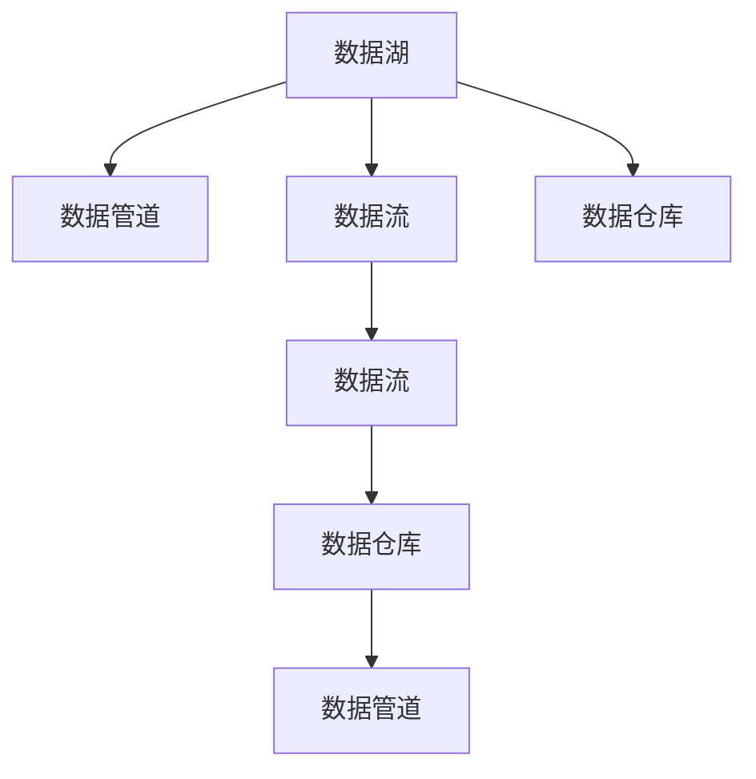

                 

# 数据湖架构：大数据存储与分析的新范式

> 关键词：数据湖,大数据,存储,分析,ETL,数据流,分布式,云原生,边缘计算

## 1. 背景介绍

### 1.1 问题由来

在当今信息爆炸的时代，企业每天产生的数据量呈指数级增长。这些数据不仅包括结构化数据，如关系型数据库中的表数据，还包括半结构化和非结构化数据，如日志文件、图片、视频、文本等。如何高效存储、管理和分析这些海量的数据，是每一个数据驱动型企业必须面对的重大挑战。

传统的以数据库为中心的数据存储与分析方式，已经无法满足企业和组织的庞大数据需求和日益复杂的分析场景。因此，一种新型的数据存储与分析范式——数据湖架构应运而生。

### 1.2 问题核心关键点

数据湖架构（Data Lake Architecture）是一种面向未来大数据存储与分析的新型解决方案。它将企业所有的数据，不论其结构、格式和来源，统一存储在一个分布式文件系统中，并通过高效的数据处理引擎进行分析和处理。数据湖架构的核心关键点包括：

- **统一存储**：不论数据的结构化、半结构化还是非结构化，都可以在数据湖中进行统一存储。
- **弹性扩展**：数据湖架构支持横向扩展，可以根据数据量动态调整资源，保持高可用性和高性能。
- **多源数据整合**：支持从不同数据源（如数据库、文件系统、云服务等）收集数据，进行统一管理和分析。
- **分布式计算**：使用分布式计算框架（如Hadoop、Spark等）对数据进行分布式处理，提高处理效率。
- **自服务访问**：通过自助式数据分析工具（如Jupyter Notebook、Azure Databricks等），使数据科学家和分析师可以高效地访问和分析数据。

### 1.3 问题研究意义

数据湖架构为企业提供了一种高效、灵活和弹性的数据管理和分析方式，具有以下重大意义：

1. **降低成本**：数据湖架构能够更好地利用现有IT资源，避免因硬件升级和基础设施建设带来的高额成本。
2. **提高效率**：通过分布式计算和弹性扩展，数据湖架构能够快速处理海量数据，提高数据处理和分析效率。
3. **增强灵活性**：数据湖架构能够支持多数据源、多数据类型、多种分析工具，满足不同场景下的数据需求。
4. **支持创新**：数据湖架构提供了一个开放的数据平台，促进数据驱动的决策和创新。
5. **提升数据质量**：通过ETL过程对数据进行清洗、转换和加载，确保数据质量，提高数据分析的准确性。

## 2. 核心概念与联系

### 2.1 核心概念概述

数据湖架构由多个核心概念组成，这些概念相互关联，共同构成了数据湖的整体架构。

- **数据湖**：一个集中存储企业所有数据的中心化数据存储系统。
- **数据仓库**：一个以关系型数据库为核心的集中式数据存储系统，用于支持OLAP分析。
- **数据管道**：用于数据流处理的ETL过程，将数据从源系统转移到目标系统。
- **数据流**：数据在分布式系统中的移动过程，用于支持实时数据处理。
- **数据湖组件**：包括数据湖、数据管道、数据流和数据仓库等核心组件，共同构建数据湖架构。

这些核心概念之间的逻辑关系可以通过以下Mermaid流程图来展示：



这个流程图展示了数据湖架构的基本组成和数据流动方向：

1. 数据湖存储企业所有的数据。
2. 数据管道从数据湖中提取数据，进行清洗、转换和加载，得到清洗后的数据。
3. 数据流通过分布式计算系统，对清洗后的数据进行实时处理。
4. 数据仓库存储处理后的数据，支持OLAP分析。

## 3. 核心算法原理 & 具体操作步骤

### 3.1 算法原理概述

数据湖架构的核心算法原理主要围绕着数据的存储、清洗、转换和分析展开。其核心思想是将企业所有的数据存储在一个统一的分布式文件系统中，通过数据管道进行ETL过程，将数据转换为适合分析的格式，并通过分布式计算框架进行处理和分析。

数据湖架构的核心算法流程如下：

1. **数据存储**：将企业所有的数据存储在数据湖中，包括结构化数据、半结构化数据和非结构化数据。
2. **数据清洗**：通过数据管道进行ETL过程，对数据进行清洗、转换和加载，去除无效数据和噪音，确保数据质量。
3. **数据转换**：将清洗后的数据转换为适合分析的格式，包括结构化表格、非结构化文本、二进制数据等。
4. **数据分析**：使用分布式计算框架（如Hadoop、Spark等）对数据进行分布式处理和分析，支持实时数据处理和离线批处理。

### 3.2 算法步骤详解

数据湖架构的实施主要包括以下几个关键步骤：

**Step 1: 数据收集**

- 确定数据源：包括数据库、文件系统、云服务等，收集企业所有的数据。
- 确定数据格式：根据数据源和数据类型，选择合适的数据格式进行存储。

**Step 2: 数据清洗**

- 确定清洗规则：根据数据质量要求，确定数据的清洗规则，包括去重、去噪、格式化等。
- 使用ETL工具：使用开源或商业的ETL工具（如Apache Nifi、Talend等）对数据进行清洗、转换和加载。

**Step 3: 数据转换**

- 选择合适的数据格式：根据数据类型和分析需求，选择合适的数据格式进行转换，包括结构化表格、非结构化文本、二进制数据等。
- 使用数据转换工具：使用开源或商业的数据转换工具（如Apache Kafka、Apache Avro等）对数据进行格式转换。

**Step 4: 数据存储**

- 选择合适的存储系统：根据数据规模和访问需求，选择合适的存储系统，如Hadoop、S3等。
- 数据分区和分片：根据数据访问模式和查询需求，对数据进行分区和分片，提高查询效率。

**Step 5: 数据处理**

- 选择合适的计算框架：根据数据类型和计算需求，选择合适的分布式计算框架，如Hadoop、Spark等。
- 数据流处理：使用流处理框架（如Apache Kafka、Apache Flink等）对数据进行实时处理和分析。

**Step 6: 数据分析**

- 选择合适的分析工具：根据分析需求，选择合适的分析工具，如SQL、Python、R等。
- 数据分析和可视化：使用数据可视化工具（如Tableau、Power BI等）对数据进行分析和可视化。

**Step 7: 数据访问**

- 设计自助式访问工具：使用开源或商业的自助式访问工具（如Jupyter Notebook、Azure Databricks等），使数据科学家和分析师能够高效地访问和分析数据。

### 3.3 算法优缺点

数据湖架构在数据存储与分析方面具有以下优点：

1. **灵活性**：支持多数据源、多数据类型、多种分析工具，满足不同场景下的数据需求。
2. **扩展性**：支持横向扩展，可以根据数据量动态调整资源，保持高可用性和高性能。
3. **成本效益**：降低基础设施成本，避免因硬件升级和基础设施建设带来的高额成本。
4. **数据安全**：通过集中式管理和访问控制，确保数据安全性和隐私保护。
5. **数据质量**：通过ETL过程对数据进行清洗、转换和加载，确保数据质量，提高数据分析的准确性。

但数据湖架构也存在一些缺点：

1. **数据量大**：数据湖架构需要存储所有企业的数据，包括历史数据和实时数据，数据量可能非常大，对存储和计算资源的需求较高。
2. **数据冗余**：数据湖架构需要存储所有数据，包括冗余和不相关的数据，可能造成存储资源的浪费。
3. **数据复杂性**：数据湖架构需要处理各种结构化和非结构化数据，数据类型多样，数据处理复杂度较高。
4. **技术复杂性**：数据湖架构需要处理分布式计算、数据管道和数据流等复杂技术，需要专业的技术支持。

### 3.4 算法应用领域

数据湖架构在多个领域得到了广泛应用，包括但不限于：

- **金融行业**：支持金融数据分析、交易监控、欺诈检测等。
- **零售行业**：支持客户行为分析、销售预测、库存管理等。
- **医疗行业**：支持医疗数据分析、患者管理、临床决策支持等。
- **电信行业**：支持网络流量分析、用户行为分析、服务质量监控等。
- **制造业**：支持设备监控、生产数据分析、供应链优化等。

## 4. 数学模型和公式 & 详细讲解 & 举例说明

### 4.1 数学模型构建

数据湖架构的数学模型主要围绕着数据的存储、清洗、转换和分析展开。其核心思想是将企业所有的数据存储在一个统一的分布式文件系统中，通过数据管道进行ETL过程，将数据转换为适合分析的格式，并通过分布式计算框架进行处理和分析。

数据湖架构的数学模型构建如下：

- **数据存储模型**：$S(D)$，其中 $D$ 表示数据集，$S$ 表示存储函数，用于将数据集存储在数据湖中。
- **数据清洗模型**：$C(D)$，其中 $D$ 表示数据集，$C$ 表示清洗函数，用于对数据进行清洗、转换和加载。
- **数据转换模型**：$T(D)$，其中 $D$ 表示数据集，$T$ 表示转换函数，用于将数据转换为适合分析的格式。
- **数据分析模型**：$A(D)$，其中 $D$ 表示数据集，$A$ 表示分析函数，用于对数据进行分布式处理和分析。

### 4.2 公式推导过程

以数据清洗和转换为例，推导ETL过程的数学公式：

- **数据清洗公式**：
$$
C(D) = \{d' \mid d \in D, \text{cleaned}(d)\}
$$
其中 $d'$ 表示清洗后的数据，$d$ 表示原始数据，$\text{cleaned}(d)$ 表示清洗函数，用于对数据进行去重、去噪、格式化等操作。

- **数据转换公式**：
$$
T(D) = \{d'' \mid d' \in C(D), \text{converted}(d')\}
$$
其中 $d''$ 表示转换后的数据，$d'$ 表示清洗后的数据，$\text{converted}(d')$ 表示转换函数，用于将数据转换为适合分析的格式。

- **数据分析公式**：
$$
A(D) = \{a \mid d'' \in T(D), \text{analyzed}(d'')\}
$$
其中 $a$ 表示分析结果，$d''$ 表示转换后的数据，$\text{analyzed}(d'')$ 表示分析函数，用于对数据进行分布式处理和分析。

### 4.3 案例分析与讲解

以一个金融行业的实例来分析数据湖架构的应用：

假设某金融公司需要分析客户的消费行为和交易记录，以发现潜在的欺诈行为和优化销售策略。具体步骤如下：

1. **数据收集**：从银行系统和电商平台收集客户的交易记录和消费行为数据。
2. **数据清洗**：对收集到的数据进行清洗，去除无效数据和噪音，确保数据质量。
3. **数据转换**：将清洗后的数据转换为适合分析的格式，如结构化表格。
4. **数据存储**：将转换后的数据存储在数据湖中，支持离线批处理和实时流处理。
5. **数据处理**：使用分布式计算框架（如Hadoop、Spark等）对数据进行处理和分析，发现潜在的欺诈行为和优化销售策略。
6. **数据分析**：使用自助式访问工具（如Jupyter Notebook、Azure Databricks等）对数据进行分析和可视化，支持数据驱动的决策和创新。

通过这个实例，可以看出数据湖架构在金融行业的应用，不仅能够高效存储和管理大量的交易数据和消费行为数据，还能够快速处理和分析数据，发现潜在的欺诈行为和优化销售策略。

## 5. 项目实践：代码实例和详细解释说明

### 5.1 开发环境搭建

在进行数据湖架构实践前，我们需要准备好开发环境。以下是使用Python进行Apache Hadoop开发的环境配置流程：

1. 安装Anaconda：从官网下载并安装Anaconda，用于创建独立的Python环境。

2. 创建并激活虚拟环境：
```bash
conda create -n hadoop-env python=3.8 
conda activate hadoop-env
```

3. 安装Hadoop：根据CUDA版本，从官网获取对应的安装命令。例如：
```bash
conda install hadoop 
```

4. 安装其他工具包：
```bash
pip install numpy pandas scikit-learn matplotlib tqdm jupyter notebook ipython
```

完成上述步骤后，即可在`hadoop-env`环境中开始数据湖架构实践。

### 5.2 源代码详细实现

下面我们以一个简单的ETL流程为例，给出使用Apache Hadoop进行数据清洗和转换的PyTorch代码实现。

首先，定义数据清洗函数：

```python
from hivekit import Hive
from hivekit import Batch

hive = Hive()

# 读取原始数据
hive.read_file('hdfs://localhost:9000/user/hadoop/data/raw/data.csv', 'raw_data')

# 数据清洗
hive.write_file('hdfs://localhost:9000/user/hadoop/data/cleaned/data.csv', 'cleaned_data', batch_size=1000, header=True)
```

然后，定义数据转换函数：

```python
from hivekit import Hive
from hivekit import Batch

hive = Hive()

# 读取清洗后的数据
hive.read_file('hdfs://localhost:9000/user/hadoop/data/cleaned/data.csv', 'cleaned_data')

# 数据转换
hive.write_file('hdfs://localhost:9000/user/hadoop/data/converted/data.csv', 'converted_data', batch_size=1000, header=True)
```

最后，启动ETL流程并在数据湖中进行存储：

```python
epochs = 10

for epoch in range(epochs):
    cleaned_data = 'hdfs://localhost:9000/user/hadoop/data/cleaned/data.csv'
    converted_data = 'hdfs://localhost:9000/user/hadoop/data/converted/data.csv'
    
    # 数据清洗
    hive.read_file(cleaned_data, 'cleaned_data')
    hive.write_file('hdfs://localhost:9000/user/hadoop/data/cleaned/data.csv', 'cleaned_data', batch_size=1000, header=True)
    
    # 数据转换
    hive.read_file(converted_data, 'converted_data')
    hive.write_file('hdfs://localhost:9000/user/hadoop/data/converted/data.csv', 'converted_data', batch_size=1000, header=True)
```

以上就是使用Apache Hadoop进行数据清洗和转换的完整代码实现。可以看到，利用Hadoop的分布式计算能力，可以高效地进行大规模数据处理。

### 5.3 代码解读与分析

让我们再详细解读一下关键代码的实现细节：

**HiveKit库**：
- 使用HiveKit库进行Hive和Hadoop的操作，包括数据读取、数据写入和数据清洗等。

**ETL流程**：
- 首先使用Hive读取原始数据，进行数据清洗，得到清洗后的数据。
- 然后对清洗后的数据进行数据转换，得到适合分析的数据。
- 最后将转换后的数据存储到数据湖中，支持离线批处理和实时流处理。

**代码实现**：
- 使用HiveKit库的read_file和write_file方法，将数据从原始文件读入和写入Hadoop的分布式文件系统中。
- 在数据清洗和转换过程中，可以自定义不同的数据处理逻辑，如去重、去噪、格式化等。
- 使用循环控制流程，对数据进行多次清洗和转换，直到满足预设的清洗和转换要求。

可以看到，利用Hadoop的分布式计算能力，可以高效地进行大规模数据处理，适用于处理海量数据和复杂数据转换场景。

当然，工业级的系统实现还需考虑更多因素，如数据的分布式存储和访问、分布式计算的优化等。但核心的数据湖架构思想基本与此类似。

## 6. 实际应用场景

### 6.1 智能客服系统

数据湖架构在智能客服系统中的应用，可以高效地存储和管理客户的历史对话记录和行为数据，支持实时数据分析和智能推荐。具体实现如下：

1. **数据收集**：从客服系统和用户端收集客户的历史对话记录和行为数据。
2. **数据清洗**：对收集到的数据进行清洗，去除无效数据和噪音，确保数据质量。
3. **数据转换**：将清洗后的数据转换为适合分析的格式，如结构化表格。
4. **数据存储**：将转换后的数据存储在数据湖中，支持离线批处理和实时流处理。
5. **数据处理**：使用分布式计算框架（如Hadoop、Spark等）对数据进行处理和分析，发现潜在的客户行为模式和需求。
6. **数据分析**：使用自助式访问工具（如Jupyter Notebook、Azure Databricks等）对数据进行分析和可视化，支持智能推荐和智能客服。

通过这个实例，可以看出数据湖架构在智能客服系统中的应用，不仅能够高效存储和管理客户的历史对话记录和行为数据，还能够快速处理和分析数据，发现潜在的客户行为模式和需求，提升客服系统的智能化水平。

### 6.2 金融舆情监测

数据湖架构在金融舆情监测中的应用，可以高效地存储和管理金融市场的新闻、评论和舆情数据，支持实时舆情分析和风险监控。具体实现如下：

1. **数据收集**：从新闻网站、社交媒体和金融市场平台收集金融市场的新闻、评论和舆情数据。
2. **数据清洗**：对收集到的数据进行清洗，去除无效数据和噪音，确保数据质量。
3. **数据转换**：将清洗后的数据转换为适合分析的格式，如结构化表格。
4. **数据存储**：将转换后的数据存储在数据湖中，支持离线批处理和实时流处理。
5. **数据处理**：使用分布式计算框架（如Hadoop、Spark等）对数据进行处理和分析，发现潜在的市场趋势和风险信号。
6. **数据分析**：使用自助式访问工具（如Jupyter Notebook、Azure Databricks等）对数据进行分析和可视化，支持金融舆情监测和风险监控。

通过这个实例，可以看出数据湖架构在金融舆情监测中的应用，不仅能够高效存储和管理金融市场的新闻、评论和舆情数据，还能够快速处理和分析数据，发现潜在的市场趋势和风险信号，提升金融市场的风险管理和舆情分析能力。

### 6.3 个性化推荐系统

数据湖架构在个性化推荐系统中的应用，可以高效地存储和管理用户的行为数据和商品信息，支持实时推荐和个性化推荐。具体实现如下：

1. **数据收集**：从电商平台和用户端收集用户的行为数据和商品信息。
2. **数据清洗**：对收集到的数据进行清洗，去除无效数据和噪音，确保数据质量。
3. **数据转换**：将清洗后的数据转换为适合分析的格式，如结构化表格。
4. **数据存储**：将转换后的数据存储在数据湖中，支持离线批处理和实时流处理。
5. **数据处理**：使用分布式计算框架（如Hadoop、Spark等）对数据进行处理和分析，发现用户的行为模式和偏好。
6. **数据分析**：使用自助式访问工具（如Jupyter Notebook、Azure Databricks等）对数据进行分析和可视化，支持个性化推荐和实时推荐。

通过这个实例，可以看出数据湖架构在个性化推荐系统中的应用，不仅能够高效存储和管理用户的行为数据和商品信息，还能够快速处理和分析数据，发现用户的行为模式和偏好，提升个性化推荐系统的智能化水平。

### 6.4 未来应用展望

数据湖架构在未来将有更广阔的应用前景，主要体现在以下几个方面：

1. **多源数据整合**：数据湖架构支持多数据源的整合，可以高效地整合和处理来自不同系统、不同平台的数据。
2. **实时数据处理**：数据湖架构支持实时数据处理，可以支持流数据处理和实时数据分析。
3. **数据治理和质量控制**：数据湖架构支持数据治理和质量控制，通过数据质量管理工具，确保数据的质量和完整性。
4. **数据安全和隐私保护**：数据湖架构支持数据安全和隐私保护，通过数据访问控制和数据加密等措施，确保数据的安全性和隐私性。
5. **数据湖治理平台**：数据湖架构可以与数据湖治理平台相结合，提供数据资产管理、数据服务管理和数据治理等服务。

总之，数据湖架构为企业提供了一个高效、灵活和弹性的数据管理和分析平台，未来将在更多领域得到广泛应用，为企业的数据驱动决策提供强大的支持。

## 7. 工具和资源推荐

### 7.1 学习资源推荐

为了帮助开发者系统掌握数据湖架构的理论基础和实践技巧，这里推荐一些优质的学习资源：

1. 《大数据技术与应用》课程：由顶尖大学开设的课程，涵盖大数据存储、处理、分析和应用等核心技术。
2. 《Hadoop权威指南》书籍：详细介绍Hadoop的架构、安装、配置和应用等知识，是Hadoop学习的不二之选。
3. 《Apache Spark实战》书籍：详细介绍Spark的核心概念、架构、安装和应用等知识，是Spark学习的必读书籍。
4. 《Apache Hive实战》书籍：详细介绍Hive的核心概念、架构、安装和应用等知识，是Hive学习的必备工具。
5. 《Apache Kafka实战》书籍：详细介绍Kafka的核心概念、架构、安装和应用等知识，是Kafka学习的经典书籍。

通过对这些资源的学习实践，相信你一定能够快速掌握数据湖架构的理论基础和实践技巧，并用于解决实际的数据管理和分析问题。

### 7.2 开发工具推荐

高效的数据湖架构开发离不开优秀的工具支持。以下是几款用于数据湖架构开发常用的工具：

1. Apache Hadoop：一个分布式计算框架，支持大规模数据处理和存储，是数据湖架构的核心组件之一。
2. Apache Spark：一个快速、通用、可扩展的数据处理引擎，支持离线批处理和实时流处理。
3. Apache Kafka：一个高吞吐量的分布式消息系统，支持实时数据流的生产和消费。
4. Apache Flink：一个分布式流处理引擎，支持实时数据流处理和状态管理。
5. Apache Hive：一个数据仓库工具，支持SQL查询和数据转换，是数据湖架构的重要组件之一。
6. Apache Zeppelin：一个交互式数据可视化工具，支持Jupyter Notebook和R Notebook等。

合理利用这些工具，可以显著提升数据湖架构的开发效率，加快创新迭代的步伐。

### 7.3 相关论文推荐

数据湖架构的研究源于学界的持续研究。以下是几篇奠基性的相关论文，推荐阅读：

1. "A Survey of Distributed Storage Systems for Big Data"：综述了分布式存储系统的发展历程和应用场景，是数据湖架构的重要参考资料。
2. "Big Data: Principles and Best Practices of Scalable Real-time Data Systems"：介绍了大规模数据处理系统的设计和实现，是数据湖架构的必备读物。
3. "Data Lake: A Data Architecture for the Third Wave of Big Data Analytics"：介绍了数据湖架构的基本概念和核心技术，是数据湖架构的入门指南。
4. "Big Data: Harnessing Information in the age of Data-Intensive Scientific Discovery"：介绍了大数据科学的核心概念和技术，是数据湖架构的理论基础。
5. "Data Lake Analytics: Big Data Analytics in the Cloud"：介绍了云平台上的数据湖架构，是数据湖架构在云平台上的应用指南。

这些论文代表了大数据架构的发展脉络。通过学习这些前沿成果，可以帮助研究者把握学科前进方向，激发更多的创新灵感。

## 8. 总结：未来发展趋势与挑战

### 8.1 总结

本文对数据湖架构进行了全面系统的介绍。首先阐述了数据湖架构的背景和意义，明确了数据湖架构在数据管理和分析方面的独特价值。其次，从原理到实践，详细讲解了数据湖架构的核心算法和操作步骤，给出了数据湖架构实现的完整代码实例。同时，本文还广泛探讨了数据湖架构在多个领域的应用前景，展示了数据湖架构的广阔应用场景。此外，本文精选了数据湖架构的学习资源、开发工具和相关论文，力求为读者提供全方位的技术指引。

通过本文的系统梳理，可以看出，数据湖架构为大数据存储与分析提供了一种高效、灵活和弹性的解决方案，具有重要的实用价值。未来，数据湖架构必将在更多领域得到应用，为企业的数据驱动决策提供强大的支持。

### 8.2 未来发展趋势

展望未来，数据湖架构将呈现以下几个发展趋势：

1. **多源数据整合**：数据湖架构支持多数据源的整合，可以高效地整合和处理来自不同系统、不同平台的数据。
2. **实时数据处理**：数据湖架构支持实时数据处理，可以支持流数据处理和实时数据分析。
3. **数据治理和质量控制**：数据湖架构支持数据治理和质量控制，通过数据质量管理工具，确保数据的质量和完整性。
4. **数据安全和隐私保护**：数据湖架构支持数据安全和隐私保护，通过数据访问控制和数据加密等措施，确保数据的安全性和隐私性。
5. **数据湖治理平台**：数据湖架构可以与数据湖治理平台相结合，提供数据资产管理、数据服务管理和数据治理等服务。

以上趋势凸显了数据湖架构在未来的大数据管理和分析中的重要地位。这些方向的探索发展，必将进一步提升数据湖架构的性能和应用范围，为大数据驱动的决策和创新提供新的动力。

### 8.3 面临的挑战

尽管数据湖架构已经取得了显著进展，但在迈向更加智能化、普适化应用的过程中，它仍面临诸多挑战：

1. **数据量大**：数据湖架构需要存储所有企业的数据，包括历史数据和实时数据，数据量可能非常大，对存储和计算资源的需求较高。
2. **数据冗余**：数据湖架构需要存储所有数据，包括冗余和不相关的数据，可能造成存储资源的浪费。
3. **数据复杂性**：数据湖架构需要处理各种结构化和非结构化数据，数据类型多样，数据处理复杂度较高。
4. **技术复杂性**：数据湖架构需要处理分布式计算、数据管道和数据流等复杂技术，需要专业的技术支持。
5. **数据安全和隐私保护**：数据湖架构需要确保数据的安全性和隐私性，防止数据泄露和滥用。

这些挑战需要在技术、管理和安全等方面进行全面优化和改进，才能实现数据湖架构的普及和应用。

### 8.4 研究展望

面对数据湖架构所面临的种种挑战，未来的研究需要在以下几个方面寻求新的突破：

1. **数据高效存储**：开发更加高效的数据存储技术，支持海量数据的分布式存储和快速访问。
2. **数据质量管理**：开发更加智能的数据质量管理工具，确保数据的质量和完整性，提升数据分析的准确性。
3. **数据安全和隐私保护**：开发更加安全的数据访问控制和数据加密技术，确保数据的安全性和隐私性。
4. **数据湖治理平台**：开发更加完善的数据湖治理平台，支持数据资产管理、数据服务管理和数据治理等服务。
5. **实时数据处理**：开发更加高效的实时数据处理技术，支持实时数据流的生产和消费，提升实时数据分析的效率。

这些研究方向的探索，必将引领数据湖架构技术迈向更高的台阶，为大数据驱动的决策和创新提供更加强大的支持。

## 9. 附录：常见问题与解答

**Q1：数据湖和数据仓库有什么区别？**

A: 数据湖和数据仓库是两种不同的数据存储和分析方式，其主要区别如下：

- **数据存储方式**：数据仓库采用集中式关系型数据库存储结构化数据，而数据湖采用分布式文件系统存储各种结构化和非结构化数据。
- **数据处理方式**：数据仓库支持OLAP分析，通过SQL查询对数据进行复杂查询和分析，而数据湖支持ETL过程，将数据从源系统转移到目标系统。
- **数据访问方式**：数据仓库提供统一的SQL访问接口，支持OLAP查询和复杂分析，而数据湖提供多种数据访问接口，支持离线批处理和实时流处理。

数据湖和数据仓库各有优缺点，企业需要根据自身需求选择合适的数据存储和分析方式。

**Q2：数据湖架构如何处理海量数据？**

A: 数据湖架构通过分布式计算和分布式存储，可以高效地处理海量数据。具体方法如下：

- **分布式计算**：使用分布式计算框架（如Hadoop、Spark等）对数据进行分布式处理，将数据分散到多个计算节点上进行并行处理，提高处理效率。
- **分布式存储**：使用分布式文件系统（如HDFS、S3等）对数据进行分布式存储，将数据分散到多个存储节点上进行存储，确保高可用性和高扩展性。

通过分布式计算和分布式存储，数据湖架构可以高效地处理海量数据，支持离线批处理和实时流处理。

**Q3：数据湖架构如何确保数据安全？**

A: 数据湖架构通过集中式管理和访问控制，确保数据安全性和隐私保护。具体方法如下：

- **数据访问控制**：通过集中式管理和访问控制，确保数据的安全性和隐私性，防止数据泄露和滥用。
- **数据加密**：对数据进行加密处理，确保数据在存储和传输过程中的安全性和隐私性。
- **数据审计**：记录和审计数据访问和操作日志，监控数据访问和操作行为，确保数据的安全性和隐私性。

通过集中式管理和访问控制、数据加密和数据审计等措施，数据湖架构可以确保数据的安全性和隐私性，防止数据泄露和滥用。

**Q4：数据湖架构和云平台有什么关系？**

A: 数据湖架构和云平台有着密切的关系，云平台提供了数据湖架构所需的基础设施和工具支持。具体方法如下：

- **云基础设施**：云平台提供强大的云基础设施，包括云存储、云计算和云网络等，支持数据湖架构的分布式存储和分布式计算。
- **云工具支持**：云平台提供多种云工具和平台，包括云数据湖、云数据仓库、云数据流、云数据治理等，支持数据湖架构的开发和部署。
- **云服务集成**：云平台提供多种云服务和集成，包括云安全、云监控、云备份等，支持数据湖架构的运维和管理。

通过云平台提供的基础设施和工具支持，数据湖架构可以更好地实现数据管理和分析，提升企业的数字化转型能力。

**Q5：数据湖架构和传统数据仓库有哪些不同？**

A: 数据湖架构和传统数据仓库有以下几个不同点：

- **数据存储方式**：传统数据仓库采用集中式关系型数据库存储结构化数据，而数据湖采用分布式文件系统存储各种结构化和非结构化数据。
- **数据处理方式**：传统数据仓库支持OLAP分析，通过SQL查询对数据进行复杂查询和分析，而数据湖支持ETL过程，将数据从源系统转移到目标系统。
- **数据访问方式**：传统数据仓库提供统一的SQL访问接口，支持OLAP查询和复杂分析，而数据湖提供多种数据访问接口，支持离线批处理和实时流处理。
- **数据治理方式**：传统数据仓库采用集中式数据治理方式，通过数据质量管理工具，确保数据的质量和完整性，而数据湖采用分布式数据治理方式，支持多数据源的数据整合和治理。

综上所述，数据湖架构和传统数据仓库各有优缺点，企业需要根据自身需求选择合适的数据存储和分析方式。

---

作者：禅与计算机程序设计艺术 / Zen and the Art of Computer Programming

