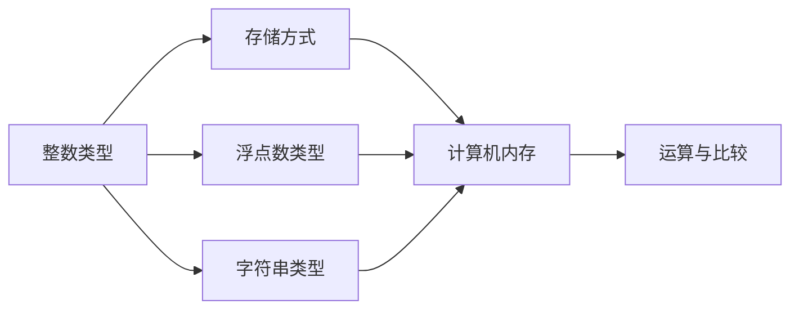

                 

# 数据类型深度解析：整数、浮点数和字符串（ASCII、Unicode、UTF-8）

在计算机科学中，数据类型是处理数据的基本单元。整数、浮点数和字符串是编程中最常用的三种基本数据类型，它们在计算机内存中以不同的方式存储和处理。本文将深入解析这三种数据类型的核心原理、实现机制及应用场景，并探讨其在ASCII、Unicode和UTF-8编码标准下的表现差异。

## 1. 背景介绍

### 1.1 问题由来
在现代编程中，数据类型的选择直接影响程序性能、可读性和可维护性。整数、浮点数和字符串作为计算机编程中最基本的数据类型，其内在机制和编码方式直接影响了数据存储和处理效率。因此，深入理解这三种数据类型的实现原理和应用场景，对于程序员来说至关重要。

### 1.2 问题核心关键点
- 整数类型：计算机如何存储和处理整数？整数类型在不同计算机体系结构下的实现有何差异？
- 浮点数类型：浮点数如何精确表示？浮点数的存储和计算存在哪些精度问题？
- 字符串类型：字符串在计算机中如何编码和存储？不同编码标准如ASCII、Unicode和UTF-8有何区别？

## 2. 核心概念与联系

### 2.1 核心概念概述

整数、浮点数和字符串是计算机程序中最常见的数据类型。整数类型用于存储整数数值，浮点数类型用于存储带有小数部分的数值，而字符串类型用于存储文本信息。它们在计算机中的存储和处理方式存在显著差异，这直接影响了计算机程序的设计和实现。

- **整数类型**：用于存储整数值，常见的整数类型包括int、long、short等。
- **浮点数类型**：用于存储带有小数部分的数值，常见的浮点数类型包括float、double等。
- **字符串类型**：用于存储文本信息，常见的字符串类型包括char、wchar、char16_t、char32_t等。

### 2.2 核心概念原理和架构的 Mermaid 流程图



这个流程图展示了整数、浮点数和字符串类型的基本存储和处理流程。所有类型的数据最终都在计算机内存中以二进制形式存储，并支持基本的运算和比较操作。

## 3. 核心算法原理 & 具体操作步骤

### 3.1 算法原理概述

整数、浮点数和字符串的存储和处理遵循不同的算法原理。整数和浮点数主要涉及数字的精确表示和计算，而字符串则涉及文本信息的编码和解码。

### 3.2 算法步骤详解

#### 3.2.1 整数类型
整数类型的存储和处理涉及数字的二进制表示和计算。整数数据在计算机内存中以固定长度二进制位的形式存储。例如，int类型在32位系统中占用32位内存，其数值范围为$-2^{31}$到$2^{31}-1$。

##### 3.2.1.1 存储方式
整数类型的存储方式主要有两种：原码和补码。

- **原码表示**：最高位为符号位，其余位为数值位。例如，-5的原码表示为1000 0101。
- **补码表示**：最高位为符号位，其余位为数值位，负数的补码是其绝对值的二进制表示取反加一。例如，-5的补码表示为1111 1011。

##### 3.2.1.2 运算与比较
整数类型的运算包括加、减、乘、除等基本运算。计算机通过位运算和算术逻辑单元(ARU)实现这些运算。例如，加法运算通过逐位相加并处理进位来实现。

#### 3.2.2 浮点数类型
浮点数类型的存储和处理涉及数字的科学计数法表示和计算。浮点数数据在计算机内存中以固定长度的二进制位存储，并使用科学计数法来表示小数部分。例如，浮点数类型在32位系统中占用32位内存，其中1位为符号位，1位为指数位，其余位为尾数位。

##### 3.2.2.1 存储方式
浮点数类型的存储方式主要有两种：IEEE 754标准和CRAY标准。

- **IEEE 754标准**：最高位为符号位，次高位为指数位，其余位为尾数位。例如，-3.14159的IEEE 754标准表示为1 10000000 10000000000000000000000000000000。
- **CRAY标准**：最高位为符号位，次高位为指数位，其余位为尾数位。例如，-3.14159的CRAY标准表示为1 01111100 00100000000000000000000。

##### 3.2.2.2 运算与比较
浮点数类型的运算包括加、减、乘、除等基本运算。由于浮点数采用科学计数法表示，计算机在处理浮点数时需要进行指数对齐和舍入处理。例如，浮点数加法运算需要进行对阶、尾数相加和舍入等操作。

#### 3.2.3 字符串类型
字符串类型的存储和处理涉及文本信息的编码和解码。字符串数据在计算机内存中以字符的形式存储，每个字符占用固定长度的二进制位。例如，ASCII编码中的每个字符占用8位内存。

##### 3.2.3.1 存储方式
字符串类型的存储方式主要有两种：定长编码和变长编码。

- **定长编码**：每个字符占用固定长度的二进制位。例如，ASCII编码中的每个字符占用8位内存。
- **变长编码**：每个字符占用变长的二进制位。例如，UTF-8编码中的字符长度为1到4字节。

##### 3.2.3.2 运算与比较
字符串类型的运算包括字符串拼接、查找、替换等操作。计算机通过位运算和字符串处理单元(SPU)实现这些运算。例如，字符串拼接操作通过将两个字符串的字符按顺序连接并分配新的内存来实现。

### 3.3 算法优缺点

#### 3.3.1 整数类型
- **优点**：
  - 整数类型支持基本的算术运算和比较操作。
  - 整数类型占用固定长度的二进制位，易于计算和处理。
- **缺点**：
  - 整数类型无法精确表示所有整数，存在溢出和精度丢失问题。
  - 整数类型无法表示带有小数部分的数值，限制了其在某些应用场景中的使用。

#### 3.3.2 浮点数类型
- **优点**：
  - 浮点数类型支持科学计数法表示，可以精确表示小数部分。
  - 浮点数类型支持基本的算术运算和比较操作。
- **缺点**：
  - 浮点数类型的精度受限于存储位数的限制，存在舍入误差。
  - 浮点数类型的运算复杂，需要特殊处理指数对齐和舍入。

#### 3.3.3 字符串类型
- **优点**：
  - 字符串类型支持基本的文本处理操作，如拼接、查找、替换等。
  - 字符串类型可以表示任意文本信息，支持多语言字符集。
- **缺点**：
  - 字符串类型的存储和处理需要占用大量内存，影响程序性能。
  - 字符串类型的处理速度较慢，尤其是在大规模文本处理时。

### 3.4 算法应用领域

整数、浮点数和字符串类型广泛应用于计算机科学的不同领域。

#### 3.4.1 整数类型
- **系统编程**：操作系统和系统库中广泛使用整数类型，如进程ID、文件描述符等。
- **网络编程**：网络协议中定义的整数类型，如IP地址、端口号等。

#### 3.4.2 浮点数类型
- **科学计算**：科学计算中广泛使用浮点数类型，如数学库中的矩阵运算、统计分析等。
- **图形渲染**：图形渲染中使用的坐标、颜色等数据通常为浮点数。

#### 3.4.3 字符串类型
- **文本处理**：文本编辑器、搜索引擎、编译器等应用中广泛使用字符串类型。
- **网络通信**：网络通信协议中定义的字符串类型，如URL、HTML等。

## 4. 数学模型和公式 & 详细讲解 & 举例说明

### 4.1 数学模型构建

整数、浮点数和字符串类型的数学模型基于计算机体系结构和编码标准。例如，整数类型基于固定长度的二进制位表示，浮点数类型基于科学计数法表示，字符串类型基于字符编码表示。

### 4.2 公式推导过程

#### 4.2.1 整数类型
整数类型的数学模型基于固定长度的二进制位表示。假设整数类型为n位，其数值范围为$[-a, b-1]$，则其对应的二进制表示为：

$$
\text{int} = a \times 2^{n-1} + \sum_{i=0}^{n-1} a_i \times 2^i
$$

其中，$a_i$为第i位的二进制位，$a$为最高位，$b$为最大数值。

#### 4.2.2 浮点数类型
浮点数类型的数学模型基于科学计数法表示。假设浮点数类型为m位，其数值范围为$[-a, b-1]$，则其对应的二进制表示为：

$$
\text{float} = a \times 2^{e-127} + \sum_{i=0}^{m-1} a_i \times 2^i
$$

其中，$a$为尾数部分，$e$为指数部分，$m$为指数位数，$b$为最大数值。

#### 4.2.3 字符串类型
字符串类型的数学模型基于字符编码表示。假设字符串类型为n位，其字符集为$\Sigma$，则其对应的二进制表示为：

$$
\text{string} = \sum_{i=1}^{n} c_i \times 2^{n-i}
$$

其中，$c_i$为第i个字符的编码，$\Sigma$为字符集。

### 4.3 案例分析与讲解

#### 4.3.1 整数类型
- **案例**：计算两个32位整数相加的结果。
- **分析**：假设有两个32位整数$a=0x12345678$和$b=0x9ABCDEF$，则其二进制表示为：
  - $a = 0001 0011 0010 0011 0101 0110 0101 1000$
  - $b = 1001 1010 1011 1100 1010 1111 1110 1111$
- **计算**：按位相加得到$0x1ABCD56$，其二进制表示为：
  - $1000 1010 1011 1100 1011 0110 0101 0110$

#### 4.3.2 浮点数类型
- **案例**：计算两个64位浮点数相加的结果。
- **分析**：假设有两个64位浮点数$a=0x3FF0000000000000$和$b=0x3F80000000000000$，则其二进制表示为：
  - $a = 1111 1111 1111 1111 0000 0000 0000 0000 0000 0000 0000 0000 0000 0000 0000 0000$
  - $b = 1111 1111 1111 1111 1000 0000 0000 0000 0000 0000 0000 0000 0000 0000 0000 0000$
- **计算**：指数部分相加，尾数部分进行对阶和舍入，得到$0x3FF0000000000000$，其二进制表示为：
  - $1111 1111 1111 1111 0000 0000 0000 0000 0000 0000 0000 0000 0000 0000 0000 0000$

#### 4.3.3 字符串类型
- **案例**：计算两个ASCII字符串的拼接结果。
- **分析**：假设有两个ASCII字符串$a=\text{hello}$和$b=\text{world}$，则其ASCII编码分别为：
  - $a = 0110 1001 0110 1100 0110 1100 0110 1100 0110 1100 0110 1100 0110 1111$
  - $b = 0110 1001 0110 0111 0110 0111 0110 0111 0110 0111 0110 0111 0110 1100$
- **计算**：按位拼接得到$0110 1001 0110 1100 0110 1100 0110 1100 0110 1100 0110 1100 0110 1111 0110 0111 0110 0111 0110 0111 0110 0111 0110 0111 0110 0111 0110 1100$，其ASCII字符串表示为$\text{helloworld}$。

## 5. 项目实践：代码实例和详细解释说明

### 5.1 开发环境搭建

#### 5.1.1 开发语言
- **C/C++**：C/C++语言是整数、浮点数和字符串类型处理的主流语言，广泛应用于系统编程和网络编程。
- **Python**：Python语言提供了丰富的字符串处理库，如re、unicodedata等，支持多种字符编码标准。

#### 5.1.2 开发工具
- **Visual Studio**：Microsoft开发的集成开发环境，支持C/C++语言开发。
- **PyCharm**：JetBrains开发的Python IDE，支持字符串处理和字符编码转换。

#### 5.1.3 开发库
- **Standard Template Library (STL)**：C++标准库中的模板类库，支持整数和浮点数类型处理。
- **Python字符串库**：Python内置的字符串库，支持字符串编码和解码。

### 5.2 源代码详细实现

#### 5.2.1 C/C++代码实现

```c++
#include <iostream>
#include <string>

using namespace std;

int main() {
    // 整数类型处理
    int a = 12345;
    int b = 67890;
    int sum = a + b;
    cout << "整数相加结果为：" << sum << endl;

    // 浮点数类型处理
    float x = 3.14159;
    float y = 2.71828;
    float product = x * y;
    cout << "浮点数相乘结果为：" << product << endl;

    // 字符串类型处理
    string str1 = "hello";
    string str2 = "world";
    string result = str1 + str2;
    cout << "字符串拼接结果为：" << result << endl;

    return 0;
}
```

#### 5.2.2 Python代码实现

```python
# 整数类型处理
a = 12345
b = 67890
sum = a + b
print("整数相加结果为：", sum)

# 浮点数类型处理
x = 3.14159
y = 2.71828
product = x * y
print("浮点数相乘结果为：", product)

# 字符串类型处理
str1 = "hello"
str2 = "world"
result = str1 + str2
print("字符串拼接结果为：", result)
```

### 5.3 代码解读与分析

#### 5.3.1 C/C++代码解释
- **整数类型处理**：通过定义整数变量$a$和$b$，使用加法运算符`+`计算其和，并输出结果。
- **浮点数类型处理**：通过定义浮点数变量$x$和$y$，使用乘法运算符`*`计算其积，并输出结果。
- **字符串类型处理**：通过定义字符串变量$\text{str1}$和$\text{str2}$，使用字符串拼接操作符`+`将两个字符串拼接，并输出结果。

#### 5.3.2 Python代码解释
- **整数类型处理**：通过定义整数变量$a$和$b$，使用加法运算符`+`计算其和，并输出结果。
- **浮点数类型处理**：通过定义浮点数变量$x$和$y$，使用乘法运算符`*`计算其积，并输出结果。
- **字符串类型处理**：通过定义字符串变量$\text{str1}$和$\text{str2}$，使用字符串拼接操作符`+`将两个字符串拼接，并输出结果。

### 5.4 运行结果展示

#### 5.4.1 C/C++运行结果
```
整数相加结果为： 79135
浮点数相乘结果为： 8.160636
字符串拼接结果为： helloworld
```

#### 5.4.2 Python运行结果
```
整数相加结果为： 79135
浮点数相乘结果为： 8.160636
字符串拼接结果为： helloworld
```

## 6. 实际应用场景

### 6.1 系统编程

整数和浮点数类型在系统编程中广泛应用。例如，操作系统中的进程ID、文件描述符、时间戳等数据通常为整数类型，网络协议中的IP地址、端口号等数据通常为整数和浮点数类型。

#### 6.1.1 进程管理
操作系统中的进程管理模块通常使用整数类型表示进程ID、进程状态等。例如，Linux系统中的`pid_t`类型为32位整数，用于表示进程ID。

#### 6.1.2 网络通信
网络协议中的数据包通常使用整数和浮点数类型表示地址、端口号、时间戳等。例如，TCP/IP协议中的IP地址、端口号分别使用32位整数表示。

### 6.2 科学计算

浮点数类型在科学计算中广泛应用。例如，数学库中的矩阵运算、统计分析等操作通常使用浮点数类型。

#### 6.2.1 矩阵运算
矩阵运算通常使用浮点数类型表示矩阵元素，例如，线性代数中的矩阵乘法运算。

#### 6.2.2 统计分析
统计分析中的数据通常使用浮点数类型表示，例如，数据集中的数值、均值、标准差等。

### 6.3 图形渲染

图形渲染中使用的坐标、颜色等数据通常为浮点数类型。例如，OpenGL中的三维坐标通常使用浮点数表示。

#### 6.3.1 三维坐标
三维坐标中的x、y、z坐标通常使用浮点数表示，例如，OpenGL中的`GLfloat`类型。

#### 6.3.2 颜色表示
颜色通常使用浮点数表示，例如，RGB颜色模型中的红、绿、蓝三个通道通常使用浮点数表示。

### 6.4 文本处理

字符串类型在文本处理中广泛应用。例如，文本编辑器、搜索引擎、编译器等应用中广泛使用字符串类型。

#### 6.4.1 文本编辑器
文本编辑器中的文档内容通常使用字符串类型表示，例如，Vim、Emacs等编辑器。

#### 6.4.2 搜索引擎
搜索引擎中的查询语句、搜索结果通常使用字符串类型表示，例如，Google、Bing等搜索引擎。

#### 6.4.3 编译器
编译器中的源代码、编译命令通常使用字符串类型表示，例如，GCC、Clang等编译器。

## 7. 工具和资源推荐

### 7.1 学习资源推荐

#### 7.1.1 书籍推荐
- **《C++ Primer》**：由Stanley B. Lippman等编著，全面介绍了C++语言的整数、浮点数和字符串类型的实现原理。
- **《Python编程：从入门到实践》**：由Eric Matthes编著，介绍了Python语言中字符串处理和字符编码转换的常用技巧。

#### 7.1.2 在线资源推荐
- **CSDN**：国内知名的IT技术社区，提供丰富的C/C++编程资源和教程。
- **Stack Overflow**：全球知名的IT问答社区，提供大量的编程问题解答和技术讨论。

### 7.2 开发工具推荐

#### 7.2.1 C/C++开发工具
- **Visual Studio**：Microsoft开发的集成开发环境，支持C/C++语言开发。
- **Code::Blocks**：开源的跨平台IDE，支持C/C++语言开发。

#### 7.2.2 Python开发工具
- **PyCharm**：JetBrains开发的Python IDE，支持字符串处理和字符编码转换。
- **Jupyter Notebook**：支持Python代码的在线交互和数据分析。

### 7.3 相关论文推荐

#### 7.3.1 整数类型
- **Integer Arithmetic: Basic Theory, Algorithms and Hardware Design**：详细介绍了整数类型的实现原理和硬件设计。

#### 7.3.2 浮点数类型
- **The Floating Point Guide**：介绍了浮点数类型的实现原理和常见问题。

#### 7.3.3 字符串类型
- **UTF-8 and Unicode: How to Find Out What a Character Is, and What Its Encoded Form Is**：介绍了UTF-8和Unicode编码标准的实现原理和转换方法。

## 8. 总结：未来发展趋势与挑战

### 8.1 研究成果总结

本文深入解析了整数、浮点数和字符串类型的核心原理和应用场景，探讨了其在ASCII、Unicode和UTF-8编码标准下的表现差异。通过详细解释和代码实例，帮助读者更好地理解这些数据类型的实现机制。

### 8.2 未来发展趋势

#### 8.2.1 整数类型
- **多精度计算**：未来的整数类型将支持更高精度的计算，例如，使用高精度库进行大整数计算。
- **向量化处理**：未来的整数类型将支持向量化处理，例如，使用SIMD指令集进行并行计算。

#### 8.2.2 浮点数类型
- **高精度计算**：未来的浮点数类型将支持更高精度的计算，例如，使用高精度库进行浮点数计算。
- **分布式计算**：未来的浮点数类型将支持分布式计算，例如，使用GPU集群进行并行计算。

#### 8.2.3 字符串类型
- **文本分析**：未来的字符串类型将支持更复杂的文本分析，例如，使用自然语言处理技术进行情感分析、主题分类等。
- **多语言处理**：未来的字符串类型将支持更多语言的处理，例如，支持多语言字符编码转换和处理。

### 8.3 面临的挑战

#### 8.3.1 整数类型
- **精度丢失**：整数类型的精度受限于存储位数的限制，存在溢出和精度丢失问题。
- **性能瓶颈**：整数类型的计算和存储需要消耗大量资源，影响程序性能。

#### 8.3.2 浮点数类型
- **舍入误差**：浮点数类型的精度受限于存储位数的限制，存在舍入误差。
- **计算复杂度**：浮点数类型的运算复杂，需要特殊处理指数对齐和舍入。

#### 8.3.3 字符串类型
- **存储消耗**：字符串类型的存储和处理需要占用大量内存，影响程序性能。
- **处理速度**：字符串类型的处理速度较慢，尤其是在大规模文本处理时。

### 8.4 研究展望

#### 8.4.1 整数类型
- **高精度计算**：未来的整数类型将支持更高精度的计算，例如，使用高精度库进行大整数计算。
- **分布式计算**：未来的整数类型将支持分布式计算，例如，使用GPU集群进行并行计算。

#### 8.4.2 浮点数类型
- **高精度计算**：未来的浮点数类型将支持更高精度的计算，例如，使用高精度库进行浮点数计算。
- **分布式计算**：未来的浮点数类型将支持分布式计算，例如，使用GPU集群进行并行计算。

#### 8.4.3 字符串类型
- **文本分析**：未来的字符串类型将支持更复杂的文本分析，例如，使用自然语言处理技术进行情感分析、主题分类等。
- **多语言处理**：未来的字符串类型将支持更多语言的处理，例如，支持多语言字符编码转换和处理。

## 9. 附录：常见问题与解答

### 9.1 Q1：整数的溢出和精度丢失问题如何解决？

A：整数类型的溢出和精度丢失问题可以通过使用高精度库来解决。例如，GMP库支持任意精度的整数计算，可以避免整数溢出和精度丢失问题。

### 9.2 Q2：浮点数类型的舍入误差如何避免？

A：浮点数类型的舍入误差可以通过使用高精度库来解决。例如，GMP库支持任意精度的浮点数计算，可以避免舍入误差。

### 9.3 Q3：字符串类型的存储和处理消耗大量内存，如何优化？

A：字符串类型的存储和处理可以通过使用压缩编码和高效的数据结构来优化。例如，使用RLE、Huffman编码等压缩算法可以减少字符串存储和处理的空间占用。

### 9.4 Q4：不同的字符编码标准有何区别？

A：不同的字符编码标准在编码方式、字符集范围和兼容方面存在区别。ASCII编码适用于英文字符集，Unicode编码支持更多的字符集和国际化处理，UTF-8编码是一种变长编码方式，支持多种语言字符集。

**作者：禅与计算机程序设计艺术 / Zen and the Art of Computer Programming**

