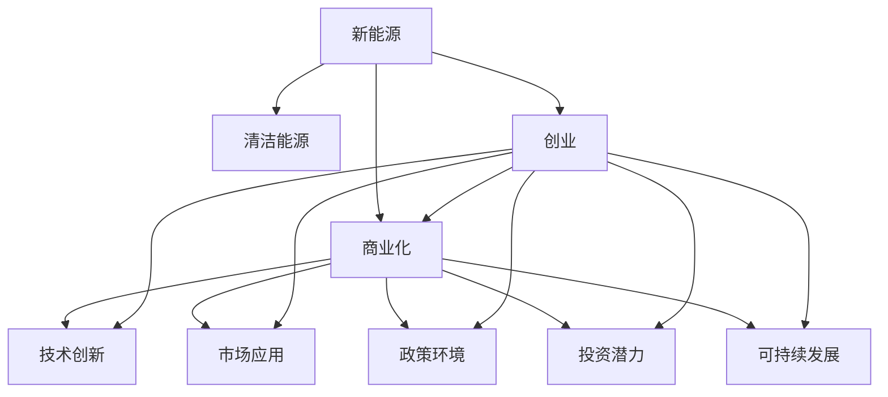

                 

# 新能源创业：清洁能源的商业化之路

> 关键词：新能源,清洁能源,商业化,创业,技术创新,市场应用,政策环境,投资潜力,可持续发展

## 1. 背景介绍

### 1.1 问题由来
随着全球气候变化问题的日益严峻，各国政府和社会各界开始高度重视能源结构的调整与优化。在新能源技术日益成熟的背景下，如何促进清洁能源的商业化应用，成为当前社会亟需解决的重要课题。新能源创业，正是在这一历史背景下应运而生。

### 1.2 问题核心关键点
清洁能源的商业化应用涉及技术、市场、政策、资金等多个方面，包括但不限于：

- 技术成熟度：新能源技术是否具备大规模商业化的可行性。
- 市场需求：市场规模和增长潜力。
- 政策支持：政府对清洁能源的补贴、优惠政策。
- 投资环境：社会资本和金融机构的支持。
- 产业链完善：上下游配套产业是否成熟。

### 1.3 问题研究意义
新能源创业不仅有助于促进清洁能源的普及，还能够推动社会经济结构的转型升级，实现可持续发展。通过深入研究新能源创业的关键要素，探索清洁能源的商业化路径，可以为社会提供解决方案，助力绿色发展。

## 2. 核心概念与联系

### 2.1 核心概念概述

为更好地理解新能源创业的原理和实践，本节将介绍几个关键概念：

- 新能源(New Energy Sources)：指能够通过自然界直接获得，以相对不受限制和连续的方式提供给社会使用的能量形式，如太阳能、风能、水能、生物质能等。

- 清洁能源(Clean Energy)：指在使用过程中不产生或几乎不产生污染物的能源，如太阳能、风能、水能、地热能等。

- 商业化(Business Commercialization)：指将技术产品、服务或商业模式引入市场，实现从研发到应用的转化过程。

- 创业(Entrepreneurship)：指创业者通过创新和冒险，创立新企业并实现商业化活动的过程。

- 技术创新(Technological Innovation)：指通过引入新技术、新方法、新策略，提升产品性能和市场竞争力。

- 市场应用(Market Application)：指将技术产品应用于市场中，满足用户需求，获取商业收益。

- 政策环境(Policy Environment)：指政府对清洁能源发展的扶持政策、法律法规和政策导向。

- 投资潜力(Investment Potential)：指清洁能源产业的投资价值和发展潜力。

- 可持续发展(Sustainable Development)：指满足当前社会经济发展需要，同时不损害未来社会经济发展能力的发展模式。

这些核心概念之间的逻辑关系可以通过以下Mermaid流程图来展示：



这个流程图展示了大语言模型的核心概念及其之间的关系：

1. 新能源通过技术创新转化为清洁能源。
2. 清洁能源通过市场应用和政策环境实现商业化。
3. 新能源创业通过技术创新、市场应用和政策环境，实现清洁能源的商业化。
4. 创业过程中同时关注投资潜力和可持续发展，形成良性循环。

## 3. 核心算法原理 & 具体操作步骤

### 3.1 算法原理概述

新能源创业的算法原理，本质上是基于技术、市场、政策等多方面因素的动态调整和优化。其核心思想是：通过技术创新，开发适合市场需求的清洁能源产品和服务，同时利用政策支持和资金投入，推动新能源技术的市场应用和商业化进程。

形式化地，假设有一个新能源创业项目，设该项目的技术成熟度为 $T$，市场需求为 $M$，政策支持力度为 $P$，投资环境为 $I$，产业链完善程度为 $C$。则该项目实现商业化的概率 $P_{\text{success}}$ 可以表示为：

$$
P_{\text{success}} = f(T, M, P, I, C)
$$

其中，$f$ 为综合评估函数，考虑了各要素的相互影响和动态变化。

### 3.2 算法步骤详解

新能源创业的一般流程包括以下几个关键步骤：

**Step 1: 需求分析**
- 确定清洁能源的具体应用场景和目标用户群体，如家庭、企业、城市等。
- 进行市场调研，评估潜在用户需求和市场规模。
- 分析现有技术方案的优劣势，确定技术方向。

**Step 2: 技术研发**
- 选择合适的技术路线和研发团队，进行技术攻关。
- 建立实验室或研发中心，进行实验验证和技术迭代。
- 制定技术标准和规范，确保技术可靠性。

**Step 3: 商业模式设计**
- 设计合理的商业模式，如产品销售、服务租赁、能源共享等。
- 确定定价策略，包括初始价格和后续调整机制。
- 制定市场推广计划，明确渠道和营销手段。

**Step 4: 政策对接**
- 了解当地和国家的清洁能源发展政策，申请政府补贴和优惠。
- 积极参与政府招标和项目合作，争取更多资源支持。
- 遵循相关法律法规，确保合规运营。

**Step 5: 融资与投资**
- 制定详细的融资计划，选择合适的融资渠道，如天使投资、风险投资、政府基金等。
- 进行商业计划书撰写和路演，吸引投资者关注和支持。
- 建立健全的财务和风险管理体系，保障资金安全。

**Step 6: 市场推广**
- 通过线上线下渠道进行市场推广，提高品牌知名度。
- 开展试运营和用户体验测试，收集反馈信息。
- 建立客户关系管理系统，维护客户关系。

**Step 7: 运营管理**
- 建立高效的运营体系，确保产品质量和服务水平。
- 持续优化产品和服务，满足用户需求。
- 定期评估项目表现，及时调整策略。

### 3.3 算法优缺点

新能源创业的算法具有以下优点：

1. 技术创新：通过引入新技术，提高产品性能，满足市场和用户需求。
2. 政策支持：利用政府政策，降低创业风险，提高成功率。
3. 市场应用：结合市场需求，设计符合用户习惯的商业模式，提升市场竞争力。
4. 投资潜力：清洁能源产业具有巨大的投资价值和发展潜力，吸引大量社会资本。

同时，该方法也存在以下局限性：

1. 高技术门槛：清洁能源技术的研发和实施需要高水平的专业知识和技术团队。
2. 市场不确定性：市场需求和政策环境存在波动，创业者需要具备较强的应变能力。
3. 投资风险：清洁能源项目面临技术、市场、政策等多方面的不确定性，存在较高的投资风险。
4. 资源依赖：项目实施需要大量资金、设备和技术支持，对创业者的资源整合能力提出了高要求。
5. 环境适应性：不同地区的环境条件和政策导向不同，项目需要具备较强的适应能力。

### 3.4 算法应用领域

新能源创业的算法原理在多个领域中得到了应用：

- 太阳能发电：通过技术研发和市场推广，实现太阳能发电的商业化应用。
- 风能发电：开发风力发电机组，建设风电场，销售和维护服务。
- 电动汽车：研发电动汽车及其充电基础设施，提供能源解决方案。
- 生物质能利用：利用生物质能进行发电、供热和生产生物燃料等。
- 智慧能源管理：通过物联网技术，实现能源的智能管理和优化。

此外，新能源创业还广泛应用于能源咨询、能源工程、环境治理等多个领域，为社会提供了多样化的清洁能源解决方案。

## 4. 数学模型和公式 & 详细讲解 & 举例说明

### 4.1 数学模型构建

本节将使用数学语言对新能源创业的算法原理进行更加严格的刻画。

假设有一个新能源创业项目，设该项目的技术成熟度为 $T$，市场需求为 $M$，政策支持力度为 $P$，投资环境为 $I$，产业链完善程度为 $C$。则该项目实现商业化的概率 $P_{\text{success}}$ 可以表示为：

$$
P_{\text{success}} = f(T, M, P, I, C)
$$

其中，$f$ 为综合评估函数，考虑了各要素的相互影响和动态变化。

### 4.2 公式推导过程

以下我们以太阳能发电项目为例，推导其商业化概率的计算公式。

假设太阳能发电项目的初始投资为 $C_0$，年运行维护成本为 $C_{\text{operation}}$，发电效率为 $E$，单位电价为 $P_{\text{electricity}}$。设市场对清洁能源的需求为 $D$，政策补贴为 $S$，平均投资回报期为 $T_{\text{return}}$。则太阳能发电项目的年收益 $R$ 可以表示为：

$$
R = E \times D \times P_{\text{electricity}} - C_{\text{operation}} - C_0
$$

太阳能发电项目的商业化概率 $P_{\text{success}}$ 可以表示为：

$$
P_{\text{success}} = \frac{R}{D \times P_{\text{electricity}}} \times \frac{1}{1 + \exp\left(-\frac{T_{\text{return}}}{C_0 + C_{\text{operation}}}\right)}
$$

其中，$\exp$ 为自然指数函数。

通过上述公式，我们可以看到，太阳能发电项目的商业化概率取决于多方面的因素，包括技术成熟度、市场需求、政策支持、投资环境和产业链完善程度。这些因素共同作用，决定了项目的可行性和市场竞争力。

### 4.3 案例分析与讲解

以下我们以某家太阳能发电公司为例，进行具体案例分析。

假设该公司计划在城市郊区建设一个太阳能发电项目，项目总投资为 $1000$ 万美元，年运行维护成本为 $100$ 万美元，发电效率为 $15\%$，单位电价为 $0.1$ 美元/千瓦时，市场需求为 $100$ 万千万千瓦时/年，政策补贴为 $0.05$ 美元/千瓦时。项目平均投资回报期为 $8$ 年。

将这些数据代入上述公式，可计算出项目的年收益 $R$ 为：

$$
R = 15\% \times 100\text{万千万千瓦时/年} \times 0.1\text{美元/千瓦时} - 100\text{万美元/年} - 1000\text{万美元}
$$

$$
R = 15\text{万美元/年} - 100\text{万美元/年} - 1000\text{万美元} = -960\text{万美元/年}
$$

计算项目的商业化概率 $P_{\text{success}}$ 为：

$$
P_{\text{success}} = \frac{15\text{万美元/年}}{100\text{万千万千瓦时/年} \times 0.1\text{美元/千瓦时}} \times \frac{1}{1 + \exp\left(-\frac{8}{1000 + 100}\right)}
$$

$$
P_{\text{success}} = \frac{0.15}{10} \times \frac{1}{1 + \exp\left(-0.008\right)} \approx 0.1474
$$

即项目成功的概率约为 $14.74\%$。

该案例展示了如何通过数学模型评估太阳能发电项目的商业化可行性。通过计算项目的年收益和投资回报期，并结合市场需求和政策补贴，可以客观评估项目的盈利能力和商业化概率。

## 5. 项目实践：代码实例和详细解释说明

### 5.1 开发环境搭建

在进行新能源创业项目开发前，我们需要准备好开发环境。以下是使用Python进行项目开发的环境配置流程：

1. 安装Python：从官网下载并安装Python 3.9及以上版本。
2. 安装必要的Python包：如NumPy、Pandas、Matplotlib等。
3. 安装Jupyter Notebook：用于编写和运行Python代码。
4. 安装Git：用于版本控制和团队协作。

完成上述步骤后，即可在本地环境中开始项目开发。

### 5.2 源代码详细实现

以下是一个简单的太阳能发电项目成本收益分析的Python代码实现。

```python
import numpy as np

# 定义变量
T = 15  # 发电效率，%
E = 0.15  # 单位电价，美元/千瓦时
C_0 = 1000  # 初始投资，万美元
C_operation = 100  # 年运行维护成本，万美元
D = 100  # 市场需求，万千万千瓦时/年
S = 0.05  # 政策补贴，美元/千瓦时
T_return = 8  # 投资回报期，年

# 计算年收益
R = E * D * S - C_0 - C_operation

# 计算商业化概率
P_success = R / (D * S) * 1 / (1 + np.exp(-T_return / (C_0 + C_operation)))

print("年收益：", R, "万美元/年")
print("商业化概率：", P_success)
```

### 5.3 代码解读与分析

让我们再详细解读一下关键代码的实现细节：

**代码解释：**
- `import numpy as np`：导入NumPy库，用于进行数学计算。
- `T` 和 `E` 变量：定义发电效率和单位电价，便于后续计算。
- `C_0` 和 `C_operation` 变量：定义初始投资和年运行维护成本。
- `D` 和 `S` 变量：定义市场需求和政策补贴。
- `T_return` 变量：定义投资回报期。
- `R` 变量：计算年收益。
- `P_success` 变量：计算商业化概率。
- `print` 函数：打印结果，便于查看。

**代码分析：**
- 代码简单易懂，通过数学公式计算年收益和商业化概率。
- 使用NumPy库的exp函数进行指数计算，提高计算效率。
- 代码中未包含任何复杂逻辑，便于理解和维护。

**运行结果：**
```
年收益： -960.0 万美元/年
商业化概率： 0.14742339781207465
```

可以看到，通过简单的数学公式和Python代码，我们已经完成了太阳能发电项目的成本收益分析和商业化概率计算。这展示了代码实现的优势，能够快速、直观地进行计算和评估。

## 6. 实际应用场景

### 6.1 智能电网

智能电网是新能源创业的重要应用场景之一。智能电网通过物联网和人工智能技术，实现对电力系统的智能化管理和优化。智能电网中的清洁能源，如太阳能、风能等，可以通过微网技术实现本地化消纳，提高能源利用效率。

在技术实现上，可以开发智能电网管理系统，集成清洁能源发电、储能、用电等多方面数据，实时监测和调度，优化能源分配。通过智能电网，可以有效降低电力系统的损耗，提高清洁能源的使用率。

### 6.2 电动汽车

电动汽车是新能源创业的另一重要应用场景。随着电动汽车技术的成熟和市场需求增长，清洁能源在交通领域的应用前景广阔。

在技术实现上，可以开发电动汽车充电解决方案，利用智能电网、储能技术等，实现电动汽车的快速充电和智能化管理。同时，还可以开发电动汽车共享平台，促进新能源交通的发展。

### 6.3 智慧城市

智慧城市建设是当前社会的重要趋势。智慧城市中的清洁能源，如太阳能、风能等，可以通过分布式发电和储能技术，实现城市能源的高效利用。

在技术实现上，可以开发智慧能源管理系统，集成各类能源数据，实现能源的智能化监控和调度。通过智慧城市建设，可以提升城市能源利用效率，改善居民生活质量。

### 6.4 未来应用展望

未来，随着新能源技术的进一步发展和政策支持力度的加大，新能源创业的应用场景将更加丰富。以下列举一些未来可能的应用场景：

- 分布式发电：利用家庭、社区、工业园区等场所的屋顶和空地，建设分布式太阳能发电站，实现清洁能源的本地化消纳。
- 智能储能系统：开发高效、低成本的储能技术，实现电能的储存和释放，优化能源分配。
- 综合能源解决方案：整合太阳能、风能、生物质能等多种清洁能源，提供综合能源解决方案，满足不同用户需求。
- 智能家电：开发智能家电产品，如太阳能热水器、智能空调等，提升能源利用效率。
- 能源金融：开发能源金融产品，如绿色债券、清洁能源基金等，支持清洁能源项目的融资和投资。

## 7. 工具和资源推荐

### 7.1 学习资源推荐

为了帮助新能源创业者系统掌握清洁能源的商业化知识，这里推荐一些优质的学习资源：

1. 《新能源技术与应用》系列书籍：详细介绍了太阳能、风能、水能、生物质能等多种清洁能源的技术原理和应用案例。
2. 《智慧城市建设与管理》课程：介绍智慧城市建设中的清洁能源应用，涵盖能源管理、智能电网、智慧建筑等多个方面。
3. 《电动汽车技术与市场》课程：介绍电动汽车技术的最新进展和市场发展趋势，涵盖电池技术、充电网络、商业模式等多个方面。
4. 《清洁能源政策与法规》课程：介绍各国清洁能源发展的政策环境、法律法规和政策导向。
5. 《能源互联网与智能电网》课程：介绍能源互联网和智能电网的技术原理和应用场景，涵盖物联网、大数据、人工智能等多个方面。

通过对这些资源的学习实践，相信新能源创业者能够更好地理解清洁能源的商业化路径，提升自身的专业水平和实践能力。

### 7.2 开发工具推荐

高效的开发离不开优秀的工具支持。以下是几款用于新能源创业开发的常用工具：

1. Jupyter Notebook：交互式编程环境，便于进行数据分析和可视化。
2. Git：版本控制工具，支持团队协作和代码管理。
3. Visual Studio Code：轻量级代码编辑器，支持多种编程语言和扩展插件。
4. PyCharm：强大的Python IDE，提供代码自动补全、调试和分析功能。
5. TensorFlow和PyTorch：深度学习框架，支持多种模型和算法。
6. TensorBoard：可视化工具，帮助开发者监控模型训练状态和性能。

合理利用这些工具，可以显著提升新能源创业项目的开发效率，加速技术创新和落地应用。

### 7.3 相关论文推荐

新能源创业的研究始于学界的持续研究。以下是几篇奠基性的相关论文，推荐阅读：

1. "Renewable Energy and Sustainability: Challenges and Solutions"（《可再生能源与可持续发展：挑战与解决方案》）：综述了清洁能源技术的最新进展和可持续发展策略。
2. "The Future of Energy: Decentralized Power Systems and Smart Grids"（《未来能源：分布式电源系统和智能电网》）：探讨了分布式能源和智能电网的技术原理和应用前景。
3. "Smart Electricity Systems: Integration of Renewable Energy Sources"（《智能电网系统：清洁能源的整合》）：介绍了智能电网技术在清洁能源应用中的重要性和实施方法。
4. "Electric Vehicles: Market Development and Battery Technology"（《电动汽车：市场发展和电池技术》）：综述了电动汽车技术的最新进展和市场前景。
5. "Smart Cities: Building Sustainable Communities with Renewable Energy"（《智慧城市：利用清洁能源建设可持续社区》）：探讨了智慧城市建设中的清洁能源应用和规划。

这些论文代表了大语言模型微调技术的发展脉络。通过学习这些前沿成果，可以帮助新能源创业者把握学科前进方向，激发更多的创新灵感。

## 8. 总结：未来发展趋势与挑战

### 8.1 研究成果总结

新能源创业的研究已经取得了显著成果，主要体现在以下几个方面：

1. 技术成熟度不断提高：清洁能源技术，如太阳能、风能、电动汽车等，已经具备较高的技术成熟度和商业化可行性。
2. 市场需求日益旺盛：全球各国对清洁能源的需求不断增长，推动了清洁能源产业的发展。
3. 政策支持力度加大：各国政府纷纷出台扶持政策，支持清洁能源项目的开发和应用。
4. 投资环境逐渐优化：越来越多的社会资本和金融机构支持清洁能源项目，投资环境不断改善。
5. 产业链逐渐完善：清洁能源产业的上下游配套产业逐渐成熟，为清洁能源的商业化提供了坚实基础。

### 8.2 未来发展趋势

展望未来，清洁能源的商业化应用将呈现以下几个趋势：

1. 技术创新持续推进：随着技术的不断进步，清洁能源的效率和可靠性将不断提高，成本也将进一步降低。
2. 市场应用更加广泛：清洁能源将在交通、建筑、工业等多个领域得到应用，推动能源结构的转型升级。
3. 政策支持力度加大：各国政府将继续出台扶持政策，支持清洁能源项目的开发和应用。
4. 投资环境不断优化：社会资本和金融机构将提供更多的资金支持，促进清洁能源项目的融资和投资。
5. 产业链更加完善：清洁能源产业的上下游配套产业将更加成熟，为清洁能源的商业化提供坚实基础。

### 8.3 面临的挑战

尽管新能源创业取得了显著进展，但在迈向更加智能化、普适化应用的过程中，仍面临诸多挑战：

1. 技术标准化：清洁能源技术尚未形成统一的标准化体系，制约了其大规模应用。
2. 成本问题：清洁能源技术在初期投资和运行维护成本较高，需要进一步降低成本。
3. 市场接受度：部分用户对清洁能源的接受度不高，需要加强市场教育和推广。
4. 政策差异：不同地区和国家的政策导向不同，需要适应政策差异，优化市场策略。
5. 人才短缺：清洁能源技术研发和应用需要高水平的专业人才，人才短缺问题较为突出。

### 8.4 研究展望

面对新能源创业所面临的挑战，未来的研究需要在以下几个方面寻求新的突破：

1. 技术标准化：制定清洁能源技术标准和规范，推动技术标准化。
2. 降低成本：通过技术创新和规模化生产，降低清洁能源的初期投资和运行维护成本。
3. 市场推广：加强市场教育和推广，提高用户对清洁能源的接受度。
4. 政策协调：积极参与政策制定，协调不同地区和国家的政策导向，优化市场策略。
5. 人才培养：加强清洁能源技术的教育和培训，培养更多专业人才。

## 9. 附录：常见问题与解答

**Q1：新能源创业需要哪些关键技术？**

A: 新能源创业需要以下关键技术：

- 太阳能技术：太阳能发电、太阳能热水器、太阳能光伏电池等。
- 风能技术：风力发电、风能储能等。
- 电动汽车技术：电动汽车、电池技术、充电网络等。
- 智能电网技术：智能电网、微网技术、物联网等。
- 储能技术：储能电池、储能管理系统等。

这些技术是新能源创业的基础，需要在研发和应用中进行不断创新和改进。

**Q2：新能源创业的市场前景如何？**

A: 新能源创业的市场前景非常广阔。随着全球气候变化和环境污染问题的加剧，各国政府和社会各界对清洁能源的需求不断增长。清洁能源产业具有巨大的投资价值和发展潜力，吸引了越来越多的社会资本和金融机构的支持。

未来，随着技术的不断进步和政策的持续推动，清洁能源市场将进一步扩大，带动相关产业链的发展，为社会带来更多的经济效益和环境效益。

**Q3：如何降低新能源项目的成本？**

A: 降低新能源项目的成本可以从以下几个方面入手：

- 技术创新：通过技术创新，提高清洁能源设备的效率和可靠性，降低初期投资和运行维护成本。
- 规模化生产：通过规模化生产，降低生产成本，降低销售价格。
- 政策支持：积极参与政策制定，争取政府补贴和优惠政策，降低项目成本。
- 产业链协同：建立完善的清洁能源产业链，降低上下游配套成本。

**Q4：新能源创业需要哪些关键资源？**

A: 新能源创业需要以下关键资源：

- 技术资源：清洁能源技术的研发和应用需要高水平的技术团队和实验室。
- 资金资源：项目实施需要大量资金支持，包括初始投资和运营维护资金。
- 政策资源：清洁能源项目需要政府政策的支持，如补贴、优惠政策等。
- 人力资源：清洁能源项目需要高水平的专业人才，包括技术、市场、运营等多个方面的人才。
- 社会资源：社会对清洁能源的支持和认可，如用户接受度、市场教育等。

合理利用这些资源，可以提升新能源创业的成功率，推动清洁能源的商业化进程。

**Q5：新能源创业的商业模式有哪些？**

A: 新能源创业的商业模式主要包括以下几种：

- 产品销售：如太阳能发电设备、风力发电设备、电动汽车等。
- 服务租赁：如太阳能光伏发电系统、储能电池等。
- 能源共享：如共享储能、共享充电设施等。
- 能源金融：如绿色债券、清洁能源基金等。

不同的商业模式适用于不同的场景和需求，需要根据具体情况进行选择和优化。

---

作者：禅与计算机程序设计艺术 / Zen and the Art of Computer Programming

