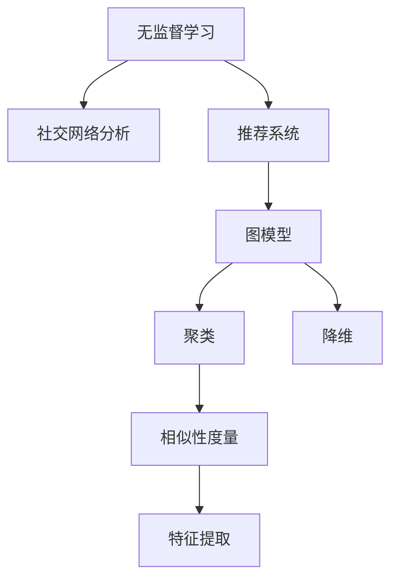

                 

# 无监督学习的应用拓展:社交网络分析和推荐系统

## 1. 背景介绍

### 1.1 问题由来
无监督学习是无标签学习领域的一个重要分支，它通过数据自身蕴含的统计特性进行自我学习和模式发现。与传统监督学习相比，无监督学习在缺乏标注数据的情况下，能够从海量数据中挖掘出潜在的结构与规律。近年来，随着社交网络数据的激增，无监督学习在社交网络分析领域得到了广泛应用。同时，无监督学习也广泛应用在推荐系统中，提升个性化推荐的效果，改善用户体验。

### 1.2 问题核心关键点
无监督学习的核心在于如何从未标注的数据中学习到有意义的模式。其关键点在于：

- **特征提取**：从原始数据中提取有意义的特征表示。
- **聚类分析**：将数据划分为不同的群组，挖掘数据的内在结构。
- **降维处理**：减少数据的维度，降低计算复杂度，同时保留重要信息。
- **相似性度量**：衡量数据点之间的相似性，用于推荐系统和社交网络分析等任务。
- **图模型分析**：基于社交网络等图数据结构，进行关联关系分析与预测。

### 1.3 问题研究意义
无监督学习在社交网络分析和推荐系统中的应用，对于探索数据内在模式、提升推荐系统效果、增强社交网络分析的准确性具有重要意义：

1. **数据探索与理解**：无监督学习可以帮助我们更好地理解社交网络的结构、用户行为模式等，从而为后续分析提供数据基础。
2. **推荐系统优化**：通过无监督学习，可以在推荐系统中引入用户兴趣、产品相似性等信息，提高推荐的准确性和多样性。
3. **社交网络挖掘**：无监督学习可以用于社交网络中的关系预测、社区发现、异常检测等任务，增强社交网络分析的功能。
4. **模型可解释性**：无监督学习模型通常具有较好的可解释性，能够揭示数据的深层规律。
5. **鲁棒性提升**：相比于有监督学习，无监督学习模型在数据噪声、异常值等问题上具有一定的鲁棒性。

## 2. 核心概念与联系

### 2.1 核心概念概述

为更好地理解无监督学习在社交网络分析和推荐系统中的应用，本节将介绍几个密切相关的核心概念：

- **无监督学习(Unsupervised Learning)**：指在没有标签数据的情况下，通过数据自身特征进行自我学习和模式发现的过程。
- **社交网络分析(Social Network Analysis, SNA)**：通过分析社交网络中个体之间的关系，挖掘网络结构与特性，用于理解社会现象和行为规律。
- **推荐系统(Recommendation System)**：通过分析用户的行为和偏好，向用户推荐可能感兴趣的商品、内容等。
- **降维(Dimensionality Reduction)**：通过减少数据的维度，降低数据的复杂度，同时保留重要信息。
- **聚类(Clustering)**：将数据划分为不同的群组，挖掘数据的内在结构。
- **图模型(Graph Model)**：基于图数据结构，用于表示实体之间的关系网络。

这些核心概念之间的逻辑关系可以通过以下Mermaid流程图来展示：



这个流程图展示了几大核心概念的相互关系：

1. 无监督学习通过特征提取和降维等方法，从原始数据中提取有意义的表示。
2. 社交网络分析利用图模型、聚类等方法，分析网络结构与特性。
3. 推荐系统通过相似性度量，优化个性化推荐效果。
4. 特征提取和降维等方法，为聚类和图模型分析提供输入数据。

这些概念共同构成了无监督学习的应用框架，使其能够在各种场景下发挥重要作用。通过理解这些核心概念，我们可以更好地把握无监督学习的工作原理和优化方向。

## 3. 核心算法原理 & 具体操作步骤

### 3.1 算法原理概述

无监督学习在社交网络分析和推荐系统中的应用，主要涉及以下几个关键算法：

- **K-means聚类**：通过迭代将数据划分为K个簇，每个簇代表一个用户群体，用于用户分群和异常检测。
- **奇异值分解(SVD)**：通过分解矩阵奇异值，实现数据的降维和特征提取，用于推荐系统中的相似性计算。
- **协同过滤**：基于用户行为数据，通过相似性度量推荐相似的商品或内容，用于推荐系统中的个性化推荐。
- **图嵌入**：将社交网络中的节点嵌入低维空间，用于关系预测和社区发现等任务。
- **深度学习自编码器**：通过学习数据的隐含表示，实现数据降维和特征提取，用于推荐系统和社交网络分析。

这些算法共同构成了无监督学习在社交网络分析和推荐系统中的主要应用，提升了数据挖掘和用户推荐的效果。

### 3.2 算法步骤详解

#### K-means聚类算法

K-means聚类算法通过将数据划分为K个簇，每个簇代表一个用户群体，用于用户分群和异常检测。以下是K-means聚类算法的主要步骤：

1. **初始化**：随机选择K个质心。
2. **分配**：将每个数据点分配到最近的质心簇中。
3. **更新**：重新计算每个簇的质心。
4. **迭代**：重复2和3步骤，直到质心不再变化或达到预设迭代次数。

#### 奇异值分解(SVD)

奇异值分解(SVD)是一种常用的矩阵分解技术，用于降维和特征提取。SVD将矩阵分解为三个矩阵的乘积，从而实现数据的降维和特征提取。以下是SVD的主要步骤：

1. **矩阵分解**：将原始矩阵分解为三个矩阵的乘积，即 $A = U \Sigma V^T$。
2. **降维**：通过取前K个奇异值和对应的奇异向量，实现数据的降维。
3. **特征提取**：通过降维后的矩阵，提取低维空间中的重要特征。

#### 协同过滤算法

协同过滤算法通过相似性度量，优化个性化推荐效果。以下是协同过滤算法的主要步骤：

1. **用户-物品矩阵**：构建用户对物品的评分矩阵。
2. **相似性度量**：通过余弦相似度等方法，计算用户和物品的相似性。
3. **推荐计算**：通过相似性度量，计算每个物品对用户的预测评分。
4. **推荐排序**：根据预测评分，对物品进行排序，推荐给用户。

#### 图嵌入算法

图嵌入算法将社交网络中的节点嵌入低维空间，用于关系预测和社区发现等任务。以下是图嵌入算法的主要步骤：

1. **节点编码**：将社交网络中的节点编码为向量。
2. **图卷积网络(GCN)**：通过GCN等方法，学习节点的嵌入向量。
3. **关系预测**：通过嵌入向量，预测节点之间的关系。
4. **社区发现**：通过聚类等方法，发现社交网络中的社区。

#### 深度学习自编码器

深度学习自编码器通过学习数据的隐含表示，实现数据降维和特征提取。以下是自编码器的主要步骤：

1. **编码器**：将输入数据压缩为低维编码向量。
2. **解码器**：将编码向量解码为原始数据。
3. **重构误差**：通过计算重构误差，优化模型参数。
4. **特征提取**：通过编码器学习的数据表示，提取重要特征。

### 3.3 算法优缺点

无监督学习在社交网络分析和推荐系统中的应用，具有以下优点：

- **数据灵活性**：无监督学习可以处理大量未标注数据，无需人工标注。
- **自发现模式**：无监督学习能够自动发现数据中的模式和规律，无需预设假设。
- **可解释性**：无监督学习模型通常具有较好的可解释性，能够揭示数据的深层规律。
- **鲁棒性**：无监督学习模型在数据噪声、异常值等问题上具有一定的鲁棒性。

同时，该方法也存在一定的局限性：

- **高计算成本**：无监督学习通常需要大量计算资源，特别是深度学习模型。
- **结果解释性**：无监督学习的结果可能需要领域专家进行解释和验证。
- **过度拟合风险**：无监督学习模型在训练数据不足的情况下，容易过拟合。
- **模型复杂度**：无监督学习模型通常较为复杂，训练和部署难度较高。

尽管存在这些局限性，但无监督学习在社交网络分析和推荐系统中的应用仍然具有广阔的前景，未来值得进一步探索和优化。

### 3.4 算法应用领域

无监督学习在社交网络分析和推荐系统中的应用，覆盖了诸多领域，例如：

- **社交网络分群**：通过K-means聚类等方法，将社交网络用户分为不同的群体，用于用户分群和异常检测。
- **推荐系统个性化推荐**：通过协同过滤、奇异值分解等方法，为用户推荐可能感兴趣的商品或内容。
- **社交网络关系预测**：通过图嵌入等方法，预测社交网络中的关系和社区，用于社区发现和异常检测。
- **社交网络异常检测**：通过聚类和异常检测等方法，检测社交网络中的异常行为和欺诈行为。
- **推荐系统多模态推荐**：通过深度学习自编码器等方法，实现多模态数据融合，提升推荐系统的性能。
- **社交网络情绪分析**：通过无监督学习挖掘社交网络中的情绪信息，用于舆情分析和社交媒体管理。

除了上述这些经典应用外，无监督学习还在个性化广告推荐、用户行为分析、内容推荐优化等多个领域发挥了重要作用。随着无监督学习技术的不断演进，相信其在社交网络分析和推荐系统中的应用将不断拓展，推动相关技术的进步。

## 4. 数学模型和公式 & 详细讲解 & 举例说明

### 4.1 数学模型构建

为更好地理解无监督学习在社交网络分析和推荐系统中的应用，本节将使用数学语言对主要算法进行严格刻画。

假设社交网络中的节点集合为 $V = \{v_1, v_2, \dots, v_n\}$，节点之间的边集合为 $E = \{(v_i, v_j)\}$，边的权重集合为 $W = \{w_{ij}\}$。设节点嵌入向量为 $z_v \in \mathbb{R}^d$，边的嵌入向量为 $z_e \in \mathbb{R}^d$。

#### K-means聚类

K-means聚类的目标是最小化簇内平方和损失，即：

$$
\min_{C, c_k, \mu_k} \sum_{i=1}^n \min_{k=1}^K ||x_i - \mu_k||^2
$$

其中 $C$ 是聚类结果，$c_k$ 是节点 $v_i$ 所在的簇，$\mu_k$ 是簇 $c_k$ 的质心。

#### 奇异值分解(SVD)

SVD的目标是找到矩阵 $A \in \mathbb{R}^{m \times n}$ 的奇异值分解 $A = U \Sigma V^T$，其中 $U \in \mathbb{R}^{m \times k}$，$\Sigma \in \mathbb{R}^{k \times k}$，$V \in \mathbb{R}^{n \times k}$。$\Sigma$ 的对角线上的元素为奇异值，$U$ 和 $V$ 的列向量为奇异向量。

#### 协同过滤

协同过滤的目标是最大化预测评分与实际评分的相关性，即：

$$
\max_{\theta} \sum_{u \in U} \sum_{i \in I} (r_{ui} - \theta^T f(u, i))^2
$$

其中 $r_{ui}$ 是用户 $u$ 对物品 $i$ 的实际评分，$f(u, i)$ 是用户 $u$ 对物品 $i$ 的评分向量。$\theta$ 是评分矩阵 $R$ 的参数。

#### 图嵌入

图嵌入的目标是找到社交网络中节点和边的嵌入向量 $z_v, z_e$，使得嵌入向量能够预测节点之间的关系，即：

$$
\min_{z_v, z_e} \sum_{i=1}^n \sum_{j=1}^n \sum_{(e_{ij} \in E)} ||z_{v_i} + \lambda z_{e_{ij}} - z_{v_j}||^2
$$

其中 $\lambda$ 是边的权重，$e_{ij}$ 是节点 $i$ 和节点 $j$ 之间的边。

#### 深度学习自编码器

自编码器的目标是最小化重构误差，即：

$$
\min_{\theta} \sum_{i=1}^n ||A_{enc}(X_i) - X_i||^2
$$

其中 $X_i$ 是输入数据，$A_{enc}$ 是编码器，$A_{dec}$ 是解码器，$\theta$ 是模型参数。

### 4.2 公式推导过程

#### K-means聚类

K-means聚类算法的数学推导如下：

1. **簇内平方和损失**：

$$
\sum_{i=1}^n ||x_i - \mu_k||^2 = \sum_{i=1}^n (x_i - \mu_k)^T (x_i - \mu_k)
$$

2. **簇分配**：

$$
c_i = \arg\min_{k=1}^K ||x_i - \mu_k||^2
$$

3. **簇更新**：

$$
\mu_k = \frac{1}{n_k} \sum_{i=c_i} x_i
$$

其中 $n_k$ 是簇 $c_k$ 的节点数量。

#### 奇异值分解(SVD)

奇异值分解的目标是找到矩阵 $A \in \mathbb{R}^{m \times n}$ 的奇异值分解 $A = U \Sigma V^T$。

1. **奇异值分解**：

$$
A = U \Sigma V^T
$$

其中 $\Sigma$ 的对角线上的元素为奇异值，$U$ 和 $V$ 的列向量为奇异向量。

2. **奇异值矩阵**：

$$
\Sigma = \text{diag}(\sigma_1, \sigma_2, \dots, \sigma_k)
$$

其中 $\sigma_1 \geq \sigma_2 \geq \dots \geq \sigma_k > 0$。

3. **奇异向量**：

$$
U = \left[ u_1, u_2, \dots, u_m \right] \in \mathbb{R}^{m \times k}, V = \left[ v_1, v_2, \dots, v_n \right] \in \mathbb{R}^{n \times k}
$$

#### 协同过滤

协同过滤的目标是最大化预测评分与实际评分的相关性。

1. **预测评分**：

$$
\hat{r}_{ui} = \theta^T f(u, i)
$$

其中 $f(u, i) = \text{emb}(u) \cdot \text{emb}(i)$，$\text{emb}$ 是嵌入函数。

2. **损失函数**：

$$
L = \sum_{u \in U} \sum_{i \in I} (r_{ui} - \hat{r}_{ui})^2
$$

3. **评分矩阵**：

$$
R = [r_{ui}]
$$

#### 图嵌入

图嵌入的目标是找到社交网络中节点和边的嵌入向量 $z_v, z_e$。

1. **关系预测**：

$$
\min_{z_v, z_e} \sum_{i=1}^n \sum_{j=1}^n \sum_{(e_{ij} \in E)} ||z_{v_i} + \lambda z_{e_{ij}} - z_{v_j}||^2
$$

2. **嵌入优化**：

$$
z_v = A_{enc}(X_v), z_e = A_{enc}(X_e)
$$

其中 $X_v, X_e$ 是节点和边的特征矩阵。

#### 深度学习自编码器

自编码器的目标是最小化重构误差。

1. **重构误差**：

$$
\min_{\theta} \sum_{i=1}^n ||A_{enc}(X_i) - X_i||^2
$$

2. **编码器**：

$$
A_{enc}(X) = W_2 \tanh(W_1 X)
$$

3. **解码器**：

$$
A_{dec}(H) = W_3 \sigma(W_2 H)
$$

其中 $\sigma$ 是激活函数，$\tanh$ 是双曲正切函数。

### 4.3 案例分析与讲解

#### K-means聚类案例

假设有一个社交网络数据集，包含了用户之间的互动关系。我们使用K-means聚类算法将用户分为不同的群体，并检测异常用户。

1. **数据预处理**：将用户互动关系表示为邻接矩阵 $A$。
2. **随机初始化**：随机选择K个质心。
3. **簇分配**：将每个节点分配到最近的质心簇中。
4. **簇更新**：重新计算每个簇的质心。
5. **迭代**：重复2和4步骤，直到质心不再变化。

最终得到用户分群结果，可以通过可视化方法检测异常用户。

#### 奇异值分解(SVD)案例

假设有一个电影评分数据集，包含了用户对电影的评分。我们使用SVD算法对评分矩阵进行降维，并提取用户和电影的特征。

1. **数据预处理**：将评分矩阵表示为 $R$。
2. **奇异值分解**：使用SVD分解评分矩阵，得到 $U$, $\Sigma$, $V^T$。
3. **降维**：取前K个奇异值和对应的奇异向量，得到降维后的矩阵 $R_k$。
4. **特征提取**：通过降维后的矩阵，提取用户和电影的特征。

最终得到用户和电影的特征表示，可以用于推荐系统中的相似性计算。

#### 协同过滤案例

假设有一个电子商务平台，用户对商品进行了评分。我们使用协同过滤算法为用户推荐可能感兴趣的商品。

1. **数据预处理**：将用户评分表示为评分矩阵 $R$。
2. **相似性度量**：通过余弦相似度计算用户和商品的相似性。
3. **推荐计算**：计算每个商品对用户的预测评分。
4. **推荐排序**：根据预测评分，对商品进行排序，推荐给用户。

最终得到个性化推荐结果，提升用户体验。

#### 图嵌入案例

假设有一个社交网络数据集，包含了用户之间的互动关系。我们使用图嵌入算法预测用户之间的关系，并发现社交网络中的社区。

1. **数据预处理**：将社交网络表示为图结构 $G$。
2. **节点嵌入**：使用GCN等方法学习节点嵌入向量。
3. **关系预测**：通过嵌入向量，预测用户之间的关系。
4. **社区发现**：通过聚类等方法发现社交网络中的社区。

最终得到用户之间的关系预测和社区发现结果，用于社交网络分析。

#### 深度学习自编码器案例

假设有一个图像数据集，包含大量图像。我们使用深度学习自编码器对图像进行降维，并提取重要特征。

1. **数据预处理**：将图像表示为矩阵 $X$。
2. **自编码器训练**：使用深度学习自编码器学习数据表示。
3. **特征提取**：通过编码器学习的数据表示，提取重要特征。

最终得到图像的降维和特征表示，可以用于图像分类、对象检测等任务。

## 5. 项目实践：代码实例和详细解释说明

### 5.1 开发环境搭建

在进行无监督学习项目实践前，我们需要准备好开发环境。以下是使用Python进行PyTorch开发的环境配置流程：

1. 安装Anaconda：从官网下载并安装Anaconda，用于创建独立的Python环境。

2. 创建并激活虚拟环境：
```bash
conda create -n pytorch-env python=3.8 
conda activate pytorch-env
```

3. 安装PyTorch：根据CUDA版本，从官网获取对应的安装命令。例如：
```bash
conda install pytorch torchvision torchaudio cudatoolkit=11.1 -c pytorch -c conda-forge
```

4. 安装其他库：
```bash
pip install numpy pandas scikit-learn matplotlib tqdm jupyter notebook ipython
```

完成上述步骤后，即可在`pytorch-env`环境中开始无监督学习实践。

### 5.2 源代码详细实现

下面我们以社交网络分群为例，给出使用PyTorch对K-means算法进行实践的代码实现。

首先，定义K-means算法函数：

```python
import torch
import torch.nn.functional as F
import torch.optim as optim

class KMeans:
    def __init__(self, K, max_iter=100):
        self.K = K
        self.max_iter = max_iter
        self.centroids = None
        self.cluster_labels = None
        self.centroids_grad = None
    
    def fit(self, data):
        N = data.shape[0]
        self.centroids = data[torch.randperm(N)[:self.K]]
        self.cluster_labels = torch.zeros(N)
        for it in range(self.max_iter):
            self.cluster_labels = self.predict(data)
            self.centroids_grad = self.update_centroids(data)
            self.centroids = self.centroids - self.centroids_grad
            if torch.norm(self.centroids_grad) < 1e-5:
                break
    
    def predict(self, data):
        distances = (data - self.centroids.unsqueeze(0)).pow(2).sum(dim=2)
        return torch.argmin(distances, dim=1)
    
    def update_centroids(self, data):
        centroids_grad = torch.zeros(self.K, data.shape[1])
        for k in range(self.K):
            centroids_grad[k] = (torch.sum(data[self.cluster_labels == k] * data[self.cluster_labels == k], dim=0) / (torch.sum(self.cluster_labels == k) + 1e-8)).detach()
        return centroids_grad
    
    def evaluate(self, data):
        distances = (data - self.centroids.unsqueeze(0)).pow(2).sum(dim=2)
        return torch.mean(distances).item()
```

然后，准备社交网络数据并进行K-means聚类：

```python
import numpy as np
from sklearn.preprocessing import MinMaxScaler
import torch
import matplotlib.pyplot as plt

# 生成随机社交网络数据
N = 1000
A = np.random.rand(N, N)
np.fill_diagonal(A, 0)
np.random.shuffle(A)

# 数据标准化
scaler = MinMaxScaler()
A_scaled = scaler.fit_transform(A)

# 转换为PyTorch张量
A_tensor = torch.tensor(A_scaled, dtype=torch.float32)

# 创建K-means模型
kmeans = KMeans(K=5)

# 训练K-means模型
kmeans.fit(A_tensor)

# 可视化聚类结果
plt.scatter(A_scaled[:, 0], A_scaled[:, 1], c=kmeans.cluster_labels.numpy(), cmap='viridis')
plt.scatter(kmeans.centroids.numpy()[:, 0], kmeans.centroids.numpy()[:, 1], marker='*', color='red')
plt.show()
```

最终，通过可视化方法观察到社交网络数据的聚类结果。

### 5.3 代码解读与分析

让我们再详细解读一下关键代码的实现细节：

**KMeans类**：
- `__init__`方法：初始化聚类数目和最大迭代次数。
- `fit`方法：训练K-means模型。
- `predict`方法：计算每个数据点所属的簇。
- `update_centroids`方法：更新聚类中心。
- `evaluate`方法：评估聚类模型的性能。

**训练过程**：
- 首先生成随机社交网络数据，并进行标准化。
- 将数据转换为PyTorch张量，创建K-means模型。
- 调用`fit`方法训练K-means模型，并返回聚类结果。
- 使用`evaluate`方法评估聚类模型的性能。

**可视化过程**：
- 使用Matplotlib绘制聚类结果，将聚类中心用红色星星标出。

可以看到，通过K-means聚类算法，我们可以将社交网络数据划分为不同的群体，实现用户分群和异常检测。代码实现较为简洁高效，适合初学者进行学习和实践。

## 6. 实际应用场景

### 6.1 社交网络分群

社交网络分群是社交网络分析中的基础任务，通过将用户分为不同的群体，可以发现社交网络中的社区结构，用于用户分群、异常检测等任务。

例如，在Facebook和Twitter等社交平台上，通过社交网络分群可以发现不同的用户群体，预测用户的活跃程度和行为模式。企业可以通过分群来定位不同的用户群体，进行有针对性的营销和运营。

### 6.2 推荐系统个性化推荐

推荐系统是推荐系统中的核心任务，通过分析用户行为和物品属性，为用户推荐可能感兴趣的商品或内容，提升用户体验。

例如，在亚马逊和Netflix等电子商务平台上，通过协同过滤算法，可以根据用户的历史评分和行为，为用户推荐可能感兴趣的商品或视频，提高用户的满意度和忠诚度。

### 6.3 社交网络关系预测

社交网络关系预测是社交网络分析中的重要任务，通过分析社交网络中的关系，预测用户之间的关系和社区结构，用于关系预测和社区发现等任务。

例如，在LinkedIn和Facebook等社交平台上，通过图嵌入算法，可以预测用户之间的关系，发现不同的社交网络社区，用于关系预测和社区发现。

### 6.4 社交网络异常检测

社交网络异常检测是社交网络分析中的重要任务，通过分析社交网络中的异常行为，及时发现异常用户和异常行为，用于安全预警和欺诈检测等任务。

例如，在社交平台上，通过聚类和异常检测算法，可以发现异常用户和异常行为，及时采取安全措施，保障用户的安全和隐私。

### 6.5 推荐系统多模态推荐

推荐系统多模态推荐是推荐系统中的前沿技术，通过融合多种数据源，提升推荐系统的性能。

例如，在推荐系统中，除了用户评分和行为数据外，还可以融合图像、视频等多模态数据，提升推荐系统的性能和多样性。

### 6.6 社交网络情绪分析

社交网络情绪分析是社交网络分析中的重要任务，通过分析社交网络中的情绪信息，用于舆情分析和社交媒体管理等任务。

例如，在Twitter和微博等社交平台上，通过情绪分析算法，可以发现用户的情绪变化趋势，用于舆情分析和社交媒体管理。

### 6.7 未来应用展望

随着无监督学习技术的不断演进，未来的社交网络分析和推荐系统将在以下几个方向取得突破：

1. **深度学习优化**：通过深度学习优化，提升聚类、推荐和关系预测的性能。
2. **多模态融合**：通过多模态数据融合，提升推荐系统的性能和多样性。
3. **自适应学习**：通过自适应学习，提升模型对新数据的适应能力。
4. **联邦学习**：通过联邦学习，保护用户隐私的同时提升模型性能。
5. **对抗性鲁棒性**：通过对抗性鲁棒性，提升模型在对抗样本攻击下的稳定性。

这些方向展示了无监督学习在社交网络分析和推荐系统中的巨大潜力，未来的应用场景将更加广泛。

## 7. 工具和资源推荐

### 7.1 学习资源推荐

为了帮助开发者系统掌握无监督学习在社交网络分析和推荐系统中的应用，这里推荐一些优质的学习资源：

1. 《深度学习》书籍：Ian Goodfellow、Yoshua Bengio和Aaron Courville著，全面介绍了深度学习的基本概念和前沿技术。

2. 《Python机器学习》书籍：Sebastian Raschka著，介绍了Python中的机器学习库，包括scikit-learn、TensorFlow和PyTorch等。

3. 《推荐系统实战》书籍：Guan Bo和王烨华著，介绍了推荐系统中的经典算法和应用。

4. 《社交网络分析》课程：斯坦福大学的Coursera课程，介绍了社交网络分析的基本概念和应用。

5. 《深度学习》课程：斯坦福大学的Coursera课程，由Ian Goodfellow主讲，全面介绍了深度学习的基本概念和前沿技术。

通过对这些资源的学习实践，相信你一定能够快速掌握无监督学习在社交网络分析和推荐系统中的应用，并用于解决实际的NLP问题。

### 7.2 开发工具推荐

高效的开发离不开优秀的工具支持。以下是几款用于无监督学习开发的常用工具：

1. PyTorch：基于Python的开源深度学习框架，灵活动态的计算图，适合快速迭代研究。

2. TensorFlow：由Google主导开发的开源深度学习框架，生产部署方便，适合大规模工程应用。

3. scikit-learn：Python中的机器学习库，提供多种聚类、降维等算法，适合快速原型开发。

4. scikit-network：Python中的社交网络分析库，提供多种图模型和算法，适合社交网络分析任务。

5. NetworkX：Python中的图模型库，支持多种图数据结构，适合图模型分析和处理。

合理利用这些工具，可以显著提升无监督学习项目的开发效率，加快创新迭代的步伐。

### 7.3 相关论文推荐

无监督学习在社交网络分析和推荐系统中的应用源于学界的持续研究。以下是几篇奠基性的相关论文，推荐阅读：

1. 《K-means: A method for initializing K-mean clustering algorithms》：Jonatan Lefevre等著，介绍了K-means聚类的基本原理和算法。

2. 《Collaborative Filtering for Implicit Feedback Datasets》：Naveen Kumar Goyal等著，介绍了协同过滤算法的基本原理和应用。

3. 《An overview of deep learning based image representation learning》：Yan Wei等著，介绍了深度学习自编码器的基本原理和应用。

4. 《A Survey on Deep Learning Approaches for Recommendation Systems》：Deepti Sharma和Mohamed I. Jordan著，介绍了深度学习在推荐系统中的应用。

5. 《Graph Embedding Techniques: A Survey》：Yajun Luo等著，介绍了图嵌入算法的原理和应用。

这些论文代表了大规模无监督学习技术的发展脉络。通过学习这些前沿成果，可以帮助研究者把握学科前进方向，激发更多的创新灵感。

## 8. 总结：未来发展趋势与挑战

### 8.1 总结

本文对无监督学习在社交网络分析和推荐系统中的应用进行了全面系统的介绍。首先阐述了无监督学习的基本概念和关键算法，明确了其在社交网络分析和推荐系统中的应用前景。其次，从原理到实践，详细讲解了K-means聚类、奇异值分解、协同过滤、图嵌入和深度学习自编码器等算法的数学模型和实现细节，给出了无监督学习项目开发的完整代码实例。同时，本文还广泛探讨了无监督学习在社交网络分析和推荐系统中的实际应用场景，展示了无监督学习技术的巨大潜力。此外，本文精选了无监督学习的学习资源和开发工具，力求为开发者提供全方位的技术指引。

通过本文的系统梳理，可以看到，无监督学习在社交网络分析和推荐系统中的应用正在成为前沿研究方向，极大地拓展了数据的探索和分析能力。未来，伴随无监督学习技术的不断演进，基于无监督学习的方法将在更多领域得到应用，为传统行业带来变革性影响。

### 8.2 未来发展趋势

展望未来，无监督学习在社交网络分析和推荐系统中的应用将呈现以下几个发展趋势：

1. **深度学习优化**：通过深度学习优化，提升聚类、推荐和关系预测的性能。
2. **多模态融合**：通过多模态数据融合，提升推荐系统的性能和多样性。
3. **自适应学习**：通过自适应学习，提升模型对新数据的适应能力。
4. **联邦学习**：通过联邦学习，保护用户隐私的同时提升模型性能。
5. **对抗性鲁棒性**：通过对抗性鲁棒性，提升模型在对抗样本攻击下的稳定性。
6. **动态更新**：通过在线学习，提升模型对新数据的实时更新能力。

这些趋势展示了无监督学习在社交网络分析和推荐系统中的巨大潜力，未来的应用场景将更加广泛。

### 8.3 面临的挑战

尽管无监督学习在社交网络分析和推荐系统中的应用已经取得了瞩目成就，但在迈向更加智能化、普适化应用的过程中，它仍面临着诸多挑战：

1. **数据质量问题**：无监督学习依赖于高质量的数据，数据噪声和异常值等问题可能影响模型的性能。
2. **模型复杂度**：无监督学习模型通常较为复杂，训练和部署难度较高。
3. **结果解释性**：无监督学习的结果可能需要领域专家进行解释和验证。
4. **鲁棒性问题**：无监督学习模型在数据噪声、异常值等问题上具有一定的鲁棒性，但面对大规模、复杂的数据集，可能仍存在鲁棒性不足的问题。
5. **实时性问题**：无监督学习模型在实时数据流上的性能有待提高。
6. **跨领域应用**：无监督学习模型在跨领域应用时，可能面临领域适应性不足的问题。

尽管存在这些挑战，但无监督学习在社交网络分析和推荐系统中的应用仍然具有广阔的前景，未来值得进一步探索和优化。

### 8.4 研究展望

面对无监督学习面临的挑战，未来的研究需要在以下几个方向寻求新的突破：

1. **数据增强技术**：通过数据增强技术，提升模型的鲁棒性和泛化能力。
2. **模型简化**：通过模型简化，提高模型的实时性和跨领域适应能力。
3. **可解释性提升**：通过可解释性提升技术，增强模型的透明度和可信度。
4. **多模态融合**：通过多模态融合技术，提升模型的综合性能。
5. **联邦学习**：通过联邦学习技术，提升模型的隐私保护和跨领域适应能力。
6. **对抗性鲁棒性**：通过对抗性鲁棒性技术，提升模型的稳定性和安全性。

这些方向展示了无监督学习在社交网络分析和推荐系统中的未来发展方向，必将推动相关技术的进步，带来更多创新的应用场景。

## 9. 附录：常见问题与解答

**Q1：无监督学习适用于所有NLP任务吗？**

A: 无监督学习在社交网络分析和推荐系统中的应用最为常见，但也适用于其他NLP任务。例如，在文本分类、情感分析、命名实体识别等任务中，无监督学习可以用于特征提取和降维，提升模型性能。

**Q2：无监督学习如何避免过拟合问题？**

A: 无监督学习中常见的过拟合问题包括高维数据、数据噪声等。为了避免过拟合，可以采用以下方法：

1. **数据增强**：通过数据增强技术，扩充训练数据集，提升模型的泛化能力。
2. **正则化**：通过L2正则、Dropout等技术，防止模型过拟合。
3. **降维**：通过降维技术，减少数据的维度，降低过拟合风险。
4. **模型简化**：通过模型简化，提升模型的实时性和泛化能力。

**Q3：无监督学习在推荐系统中的应用效果如何？**

A: 无监督学习在推荐系统中的应用效果显著。通过协同过滤、奇异值分解等技术，可以实现个性化推荐，提升用户体验。无监督学习通过分析用户行为和物品属性，发现用户兴趣和物品相似性，从而推荐更加符合用户需求的商品或内容。

**Q4：无监督学习在社交网络分析中的应用难点是什么？**

A: 无监督学习在社交网络分析中的应用难点主要包括：

1. **数据质量问题**：社交网络数据可能存在噪声和异常值，影响模型的性能。
2. **模型复杂度**：社交网络分析中的数据结构复杂，模型训练和推理难度较大。
3. **结果解释性**：社交网络分析的结果可能需要领域专家进行解释和验证，模型的透明度和可信度有待提升。
4. **鲁棒性问题**：社交网络分析中的数据分布变化较大，模型鲁棒性不足。

**Q5：无监督学习如何提升推荐系统的性能？**

A: 无监督学习可以通过以下方法提升推荐系统的性能：

1. **协同过滤**：通过协同过滤算法，分析用户行为和物品属性，推荐可能感兴趣的商品或内容。
2. **奇异值分解**：通过奇异值分解，实现数据的降维和特征提取，提升推荐系统的性能和多样性。
3. **深度学习自编码器**：通过深度学习自编码器，学习数据的隐含表示，提升推荐系统的性能和鲁棒性。

这些方法能够提高推荐系统的准确性和多样性，提升用户体验。

---

作者：禅与计算机程序设计艺术 / Zen and the Art of Computer Programming

