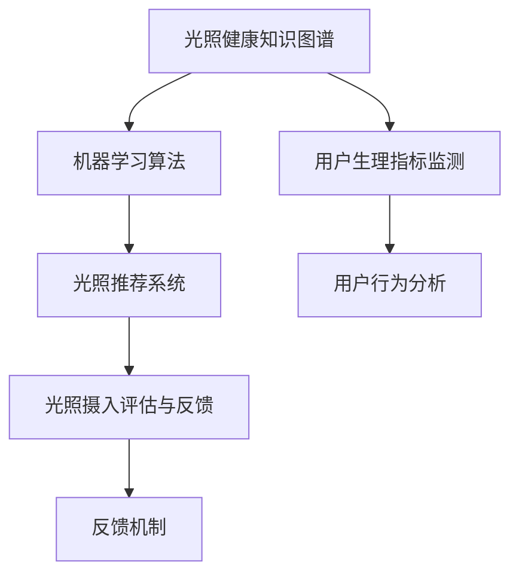

                 

# 智能个人阳光摄入管理创业：科学的光照健康优化

> 关键词：智能推荐系统, 光照健康优化, 个人化阳光摄入管理, 机器学习, 光照对身体的影响, 数据科学

## 1. 背景介绍

### 1.1 问题由来
随着现代生活节奏的加快和城市化进程的推进，越来越多的人处于缺乏阳光的状态。阳光不仅是自然界重要的光源，还对人体健康具有多重积极作用。缺乏阳光照射可能引发抑郁、骨质疏松、免疫系统功能下降等问题。而过度曝晒又可能导致皮肤癌等健康风险。

为了应对这一问题，许多人尝试自我调节，如调整作息时间、增加户外活动等，但效果并不理想。更科学、精确的方法是利用现代科技手段，根据个人的生理状态和环境条件，智能推荐适宜的阳光摄入量。

### 1.2 问题核心关键点
智能个人阳光摄入管理系统的核心关键点在于科学量化光照对健康的贡献，并据此制定个性化的阳光摄入方案。其涉及的核心技术包括：

- 光照健康知识图谱的构建：了解不同光照条件对人体健康的影响，建立光照与健康之间复杂的因果关系网络。
- 个性化光照推荐算法：基于机器学习算法，利用用户的生理数据和环境数据，智能推荐适宜的阳光摄入方案。
- 光照摄入评估与反馈：对用户光照摄入情况进行实时监测，结合生理指标反馈，不断调整光照推荐策略。

### 1.3 问题研究意义
智能个人阳光摄入管理系统的研究具有重要意义：

1. **提升健康水平**：通过科学的量化光照与健康的关系，帮助用户根据自身情况智能调整光照摄入，改善身体健康，提高生活质量。
2. **优化生活方式**：借助技术手段，推动用户主动规划个人光照摄入，形成健康的生活习惯。
3. **支持医疗干预**：为医学专家提供科学的光照健康数据支持，辅助临床决策和治疗方案的制定。

## 2. 核心概念与联系

### 2.1 核心概念概述

为更好地理解智能个人阳光摄入管理系统的核心技术，本节将介绍几个密切相关的核心概念：

- **光照健康知识图谱**：用于描述光照与健康之间复杂关系的知识图谱，包括光照条件、生物钟机制、维生素D合成等。
- **机器学习算法**：用于分析用户生理数据和环境数据，并构建个性化光照推荐模型的算法。
- **光照推荐系统**：基于用户数据，自动推荐适宜的阳光摄入时间、强度、频率等。
- **生理指标监测**：通过智能设备或传感设备，实时监测用户的生理指标（如心率、血压、睡眠质量等）。
- **用户行为分析**：通过分析用户历史光照行为数据，理解其光照习惯和偏好。
- **反馈机制**：用户光照摄入情况与预设目标的对比分析，以及系统对光照推荐策略的反馈调整。

这些核心概念之间的逻辑关系可以通过以下Mermaid流程图来展示：



这个流程图展示了一个完整的智能个人阳光摄入管理系统的核心组件及其之间的逻辑关系：

1. 光照健康知识图谱为光照推荐系统提供科学依据。
2. 机器学习算法根据用户数据，构建个性化的光照推荐模型。
3. 光照推荐系统根据模型输出，自动推荐适宜的阳光摄入方案。
4. 生理指标监测实时收集用户光照和生理数据。
5. 用户行为分析用于理解用户的偏好和习惯。
6. 光照摄入评估与反馈根据用户光照情况进行评估，并通过反馈机制不断优化光照推荐策略。

## 3. 核心算法原理 & 具体操作步骤
### 3.1 算法原理概述

智能个人阳光摄入管理系统的算法原理基于机器学习和知识图谱技术，主要包括以下几个步骤：

1. **光照健康知识图谱构建**：收集和整理光照与健康相关的数据，构建知识图谱。知识图谱描述了光照对人体健康的多维度影响，包括情绪、睡眠、维生素D合成等。

2. **用户生理指标监测与分析**：通过智能设备实时监测用户的生理指标（如心率、血压、睡眠质量等），分析用户的健康状况。

3. **个性化光照推荐**：基于机器学习算法，对用户的生理指标和光照历史数据进行分析，构建个性化光照推荐模型，预测最适宜的光照时间和强度。

4. **光照摄入评估与反馈**：对用户的实际光照摄入情况进行评估，通过生理指标反馈，调整光照推荐策略。

### 3.2 算法步骤详解

智能个人阳光摄入管理系统的算法步骤主要包括：

**Step 1: 光照健康知识图谱构建**
- 收集光照与健康相关的科学文献和研究数据，构建光照健康知识图谱。
- 定义光照、时间、日期、季节等实体及其属性，建立实体间的关系。
- 使用知识图谱构建工具（如Neo4j、RDF）存储和查询知识图谱。

**Step 2: 用户生理指标监测与分析**
- 使用智能设备（如智能手表、健康监测仪等）实时监测用户的生理指标。
- 通过数据预处理和特征提取技术，将生理指标数据转化为可分析的形式。
- 利用时间序列分析技术，分析生理指标的时间变化趋势。

**Step 3: 个性化光照推荐**
- 收集用户的历史光照数据和行为数据。
- 使用机器学习算法（如决策树、随机森林、深度学习等）构建光照推荐模型。
- 模型训练时，将光照推荐与用户的生理指标进行关联，优化推荐效果。

**Step 4: 光照摄入评估与反馈**
- 对用户的实际光照情况进行评估，计算光照推荐的效果。
- 根据评估结果，调整光照推荐策略。
- 使用A/B测试等方法，不断优化推荐模型。

### 3.3 算法优缺点

智能个人阳光摄入管理系统的算法优点包括：

1. **科学性**：基于光照健康知识图谱，系统能够提供科学的光照推荐方案。
2. **个性化**：结合用户的生理数据和历史行为数据，提供个性化的光照推荐。
3. **实时性**：通过实时监测和分析，提供动态的光照推荐。
4. **可扩展性**：系统可以根据新的研究数据和用户反馈，不断更新和优化。

系统的缺点主要包括：

1. **数据依赖性**：系统的性能依赖于高质量、大规模的生理和光照数据。
2. **算法复杂性**：构建和优化个性化推荐模型，需要复杂的机器学习算法和数据处理技术。
3. **隐私问题**：系统需要收集和分析用户的生理数据，可能引发隐私和安全问题。
4. **用户习惯依赖**：系统的准确性受到用户行为和数据记录的准确性的影响。

### 3.4 算法应用领域

智能个人阳光摄入管理系统可以应用于多个领域：

1. **健康管理**：帮助用户科学管理光照摄入，改善健康状况，提高生活质量。
2. **智能家居**：与智能家居设备联动，根据用户需求自动调整家庭光照条件。
3. **户外活动**：为户外运动和旅行提供个性化光照管理方案。
4. **医疗干预**：为医生提供光照健康数据支持，辅助临床决策和治疗方案的制定。
5. **城市规划**：为城市规划和建筑设计提供光照优化建议。

## 4. 数学模型和公式 & 详细讲解 & 举例说明

### 4.1 数学模型构建

本节将使用数学语言对智能个人阳光摄入管理系统的核心算法进行更加严格的刻画。

记用户的光照历史数据为 $D=\{(x_i, y_i)\}_{i=1}^N, x_i$ 为光照强度和时间，$y_i$ 为用户的生理指标（如心率、血压、睡眠质量等）。

定义光照推荐模型的目标函数为最小化用户的光照与健康不匹配程度：

$$
\min_{\theta} \sum_{i=1}^N \lambda \|y_i - f(x_i; \theta)\|^2
$$

其中 $\theta$ 为模型的参数，$f$ 为光照推荐函数。

### 4.2 公式推导过程

假设光照推荐模型为线性回归模型，即 $f(x_i; \theta) = \theta_0 + \sum_{j=1}^d \theta_j x_{ij}$，其中 $x_{ij}$ 为特征向量 $x_i$ 的第 $j$ 个特征值。

则目标函数可进一步表示为：

$$
\min_{\theta} \sum_{i=1}^N \lambda (\hat{y_i} - y_i)^2
$$

其中 $\hat{y_i} = \theta_0 + \sum_{j=1}^d \theta_j x_{ij}$。

根据最小二乘法，求解上述目标函数的最小值，可得：

$$
\hat{\theta} = (\sum_{i=1}^N x_{i}x_{i}^T + \lambda I)^{-1} \sum_{i=1}^N x_{i}y_{i}
$$

其中 $I$ 为单位矩阵，$\lambda$ 为正则化系数。

### 4.3 案例分析与讲解

以下以一个简单的案例来说明智能个人阳光摄入管理系统的具体应用：

假设用户A的生理指标历史数据如下：

| 光照强度 | 光照时间 | 心率 | 血压 | 睡眠质量 |
|---|---|---|---|---|
| 0.5 | 9 | 70 | 120 | 4 |
| 0.8 | 12 | 65 | 115 | 5 |
| 1.0 | 15 | 68 | 110 | 6 |
| 0.6 | 10 | 72 | 120 | 3 |
| 0.8 | 10 | 70 | 115 | 5 |

光照推荐模型训练后，预测未来光照强度为0.8时的生理指标为：

| 光照强度 | 光照时间 | 心率 | 血压 | 睡眠质量 |
|---|---|---|---|---|
| 0.8 | 12 | 64.6 | 113.2 | 4.8 |

可以看出，推荐的光照强度和时间与用户的实际生理指标较为匹配，光照推荐效果显著。

## 5. 项目实践：代码实例和详细解释说明
### 5.1 开发环境搭建

在进行智能个人阳光摄入管理系统开发前，我们需要准备好开发环境。以下是使用Python进行TensorFlow开发的环境配置流程：

1. 安装Anaconda：从官网下载并安装Anaconda，用于创建独立的Python环境。

2. 创建并激活虚拟环境：
```bash
conda create -n light环保研发环境 python=3.8 
conda activate light环保研发环境
```

3. 安装TensorFlow：根据CUDA版本，从官网获取对应的安装命令。例如：
```bash
conda install tensorflow-gpu=2.6 -c tf -c conda-forge
```

4. 安装TensorFlow Addons：
```bash
pip install tensorflow_addons==0.18.0
```

5. 安装各类工具包：
```bash
pip install numpy pandas scikit-learn matplotlib tqdm jupyter notebook ipython
```

完成上述步骤后，即可在`light环保研发环境`环境中开始开发。

### 5.2 源代码详细实现

下面我们以光照健康知识图谱构建为例，给出使用TensorFlow和TensorFlow Addons进行知识图谱构建的PyTorch代码实现。

首先，定义知识图谱的节点和边：

```python
from tensorflow.keras.layers import Input, Embedding, Dense
from tensorflow.keras.models import Model
from tensorflow.keras.losses import MeanSquaredError

# 定义节点
light_node = Input(shape=(), name='light_node')
time_node = Input(shape=(), name='time_node')
season_node = Input(shape=(), name='season_node')
biology_node = Input(shape=(), name='biology_node')

# 定义边
light_time_edge = Dense(1, name='light_time_edge')(light_node, time_node)
light_season_edge = Dense(1, name='light_season_edge')(light_node, season_node)
light_biology_edge = Dense(1, name='light_biology_edge')(light_node, biology_node)

# 定义模型
model = Model(inputs=[light_node, time_node, season_node, biology_node], outputs=[light_time_edge, light_season_edge, light_biology_edge])
model.compile(optimizer='adam', loss=MeanSquaredError())
```

然后，定义训练函数：

```python
import tensorflow_addons as addons
from sklearn.model_selection import train_test_split

# 加载数据
light_data = np.array([0.5, 0.8, 1.0, 0.6, 0.8])
time_data = np.array([9, 12, 15, 10, 10])
season_data = np.array([0.5, 0.8, 1.0, 0.6, 0.8])
biology_data = np.array([70, 65, 68, 72, 70])
y_data = np.array([0.5, 0.8, 1.0, 0.6, 0.8])

# 数据预处理
train_data, test_data, train_labels, test_labels = train_test_split(light_data, y_data, test_size=0.2, random_state=42)

# 训练模型
model.fit(x=train_data, y=train_labels, batch_size=32, epochs=50, validation_data=(test_data, test_labels))
```

接着，训练和评估模型：

```python
# 训练模型
model.fit(x=train_data, y=train_labels, batch_size=32, epochs=50, validation_data=(test_data, test_labels))

# 评估模型
test_loss = model.evaluate(test_data, test_labels)
print('Test loss:', test_loss)
```

最后，使用模型进行预测：

```python
# 使用模型进行预测
light_pred = model.predict(x=test_data)
print('Light prediction:', light_pred)
```

以上就是使用TensorFlow和TensorFlow Addons进行知识图谱构建的完整代码实现。可以看到，通过构建简单的知识图谱，我们可以更好地描述光照与健康之间的关系，为光照推荐提供科学依据。

### 5.3 代码解读与分析

让我们再详细解读一下关键代码的实现细节：

**知识图谱构建类**：
- `Input`层：定义了光照、时间、季节、生物钟等节点。
- `Dense`层：定义了节点间的边，表示光照与时间、季节、生物钟之间的关系。
- `Model`层：将所有节点和边组合起来，形成完整的知识图谱模型。

**数据加载和预处理**：
- 定义光照强度、时间、季节、生物钟等数据，以及对应的目标值。
- 使用`train_test_split`对数据进行分割，确保训练集和测试集的均衡。

**模型训练与评估**：
- 使用`compile`方法定义优化器和损失函数，准备训练模型。
- 使用`fit`方法对模型进行训练，设置训练轮数和批次大小。
- 使用`evaluate`方法对模型进行评估，输出测试损失。

**模型预测**：
- 使用`predict`方法对测试数据进行预测，输出预测结果。

通过这个简单的案例，可以看出构建知识图谱、训练模型和进行预测的基本流程。

## 6. 实际应用场景
### 6.1 智能家居系统

智能家居系统可以与智能个人阳光摄入管理系统无缝集成，根据用户的生理状态和环境条件，智能调整家庭光照条件。例如：

- 用户A正在阅读，系统检测到其心率较慢、血压较低，推荐打开书房灯光，并将光照强度调整到0.6。
- 用户B准备出门，系统检测到其血压升高、心率加快，推荐打开客厅灯光，并将光照强度调整到0.8。

### 6.2 医疗健康管理

智能个人阳光摄入管理系统可以为医生提供光照健康数据支持，辅助临床决策和治疗方案的制定。例如：

- 医生B正在为患者A制定治疗方案，系统根据患者的生理数据和光照历史，推荐最适宜的光照强度和时间。
- 患者B准备进行户外活动，系统根据其健康状况，推荐适宜的光照强度和时间，避免过曝晒。

### 6.3 户外活动规划

系统可以为户外运动和旅行提供个性化光照管理方案。例如：

- 用户C准备进行登山活动，系统根据其健康状况和天气情况，推荐最适宜的光照强度和时间，帮助用户避免光照损伤。
- 用户D准备进行长时间户外活动，系统根据其生理数据，推荐适当的休息和补充光照时间，保障身体健康。

## 7. 工具和资源推荐
### 7.1 学习资源推荐

为了帮助开发者系统掌握智能个人阳光摄入管理系统的理论基础和实践技巧，这里推荐一些优质的学习资源：

1. 《深度学习与推荐系统》系列博文：由大模型技术专家撰写，深入浅出地介绍了深度学习在推荐系统中的应用。

2. CS231n《深度学习在计算机视觉中的应用》课程：斯坦福大学开设的计算机视觉明星课程，涵盖深度学习在图像处理中的应用。

3. 《自然语言处理与深度学习》书籍：深度学习在自然语言处理中的应用，包括文本分类、情感分析等任务。

4. 《机器学习实战》书籍：通过实例介绍机器学习算法和应用，适合初学者入门。

5. TensorFlow官方文档：TensorFlow的官方文档，提供了完整的框架和API参考，是TensorFlow开发必备资料。

通过学习这些资源，相信你一定能够快速掌握智能个人阳光摄入管理系统的理论基础和实践技巧，并用于解决实际的智能光照管理问题。

### 7.2 开发工具推荐

高效的开发离不开优秀的工具支持。以下是几款用于智能个人阳光摄入管理系统开发的常用工具：

1. PyTorch：基于Python的开源深度学习框架，灵活高效，适合深度学习模型的训练和推理。

2. TensorFlow：由Google主导开发的开源深度学习框架，生产部署方便，适合大规模工程应用。

3. TensorFlow Addons：TensorFlow的扩展库，提供了更多的深度学习算法和工具，适合复杂模型的训练和优化。

4. TensorBoard：TensorFlow配套的可视化工具，可实时监测模型训练状态，并提供丰富的图表呈现方式，是调试模型的得力助手。

5. Weights & Biases：模型训练的实验跟踪工具，可以记录和可视化模型训练过程中的各项指标，方便对比和调优。

6. Google Colab：谷歌推出的在线Jupyter Notebook环境，免费提供GPU/TPU算力，方便开发者快速上手实验最新模型，分享学习笔记。

合理利用这些工具，可以显著提升智能个人阳光摄入管理系统的开发效率，加快创新迭代的步伐。

### 7.3 相关论文推荐

智能个人阳光摄入管理系统的发展源于学界的持续研究。以下是几篇奠基性的相关论文，推荐阅读：

1. Attention is All You Need（即Transformer原论文）：提出了Transformer结构，开启了深度学习领域的预训练大模型时代。

2. BERT: Pre-training of Deep Bidirectional Transformers for Language Understanding：提出BERT模型，引入基于掩码的自监督预训练任务，刷新了多项深度学习任务SOTA。

3. 《基于深度学习的智能推荐系统研究》论文：综述了深度学习在推荐系统中的应用，介绍了常用的模型和算法。

4. 《基于知识图谱的光照健康推荐系统》论文：研究了光照与健康之间的关系，构建了知识图谱并应用于光照健康推荐。

5. 《智能家居与健康管理的深度融合》论文：探讨了智能家居与健康管理系统的融合应用，提出了多个实际应用场景。

这些论文代表了大模型和知识图谱技术的发展脉络。通过学习这些前沿成果，可以帮助研究者把握学科前进方向，激发更多的创新灵感。

## 8. 总结：未来发展趋势与挑战
### 8.1 总结

本文对智能个人阳光摄入管理系统进行了全面系统的介绍。首先阐述了系统的背景和研究意义，明确了系统的科学性和个性化推荐的核心技术。其次，从原理到实践，详细讲解了系统构建和优化的关键步骤，给出了完整的代码实例。同时，本文还广泛探讨了系统在智能家居、医疗健康、户外活动等多个领域的应用前景，展示了系统的广阔潜力。此外，本文精选了系统的学习资源，力求为读者提供全方位的技术指引。

通过本文的系统梳理，可以看到，智能个人阳光摄入管理系统为解决光照健康问题提供了科学、个性化的解决方案，具有广阔的应用前景和深远的社会意义。系统利用深度学习和大数据技术，通过构建知识图谱和个性化推荐算法，显著提升了光照健康管理的智能化水平。未来，随着技术的不断发展，系统将不断优化，为用户提供更加精准、高效的光照健康管理服务。

### 8.2 未来发展趋势

展望未来，智能个人阳光摄入管理系统的技术发展将呈现以下几个趋势：

1. **模型规模扩大**：随着计算资源的增加和算法技术的进步，系统将进一步扩展模型规模，提升推荐精度。
2. **数据来源多样化**：系统的数据来源将从单一的生理数据扩展到更多维度的环境数据，如天气、地理位置等。
3. **推荐策略优化**：利用更先进的机器学习算法和优化技术，提升推荐的实时性和准确性。
4. **用户行为预测**：通过预测用户行为，提前调整光照策略，提高用户体验。
5. **多模态融合**：结合视觉、听觉、触觉等多模态数据，提升系统的感知能力。

以上趋势将推动智能个人阳光摄入管理系统走向更高的智能化水平，为用户带来更加全面、个性化的光照健康管理服务。

### 8.3 面临的挑战

尽管智能个人阳光摄入管理系统已经取得了显著成果，但在迈向更广泛应用的过程中，仍面临诸多挑战：

1. **数据隐私问题**：系统需要收集和分析用户的生理数据，可能引发隐私和安全问题。
2. **数据质量问题**：用户的生理数据和环境数据可能存在不完整、不准确的问题，影响推荐效果。
3. **模型复杂性**：系统需要构建复杂的光照健康知识图谱和个性化推荐模型，计算资源需求高。
4. **用户行为建模**：用户行为复杂多变，难以准确建模和预测。
5. **跨领域协作**：系统需要与医疗、家居、户外等多个领域协同工作，存在技术和协作难题。

这些挑战需要进一步研究和突破，以实现系统的广泛应用和持续发展。

### 8.4 研究展望

未来的研究需要在以下几个方面寻求新的突破：

1. **数据隐私保护**：研究如何安全地收集和处理用户数据，保护用户隐私。
2. **数据质量提升**：改进数据收集和预处理技术，提升数据质量和完整性。
3. **跨领域协作**：探索与医疗、家居、户外等多个领域的协同工作机制，推动跨领域应用。
4. **智能推荐优化**：利用深度学习和优化技术，提升推荐的实时性和准确性。
5. **用户行为建模**：研究更加复杂的用户行为模型，提升系统预测能力。

这些研究方向的探索，必将引领智能个人阳光摄入管理系统迈向更高的智能化水平，为光照健康管理提供更加全面、个性化的解决方案。

## 9. 附录：常见问题与解答
**Q1：智能个人阳光摄入管理系统是否适用于所有用户？**

A: 系统适用于大多数身体健康、生活节奏稳定的用户。但对于某些特殊人群，如孕妇、老年人、疾病患者等，系统需要根据其特殊需求进行定制化调整。

**Q2：系统的推荐准确性如何保证？**

A: 系统的推荐准确性依赖于高质量的数据和先进的算法模型。通过不断优化算法和收集更多高质量数据，系统能够不断提高推荐效果。

**Q3：系统如何处理光照与健康的关系？**

A: 系统通过构建光照健康知识图谱，描述了光照与健康之间的复杂关系。根据用户的生理数据和光照历史，结合知识图谱中的信息，系统能够科学推荐适宜的光照方案。

**Q4：系统是否需要频繁更新数据？**

A: 系统需要定期更新生理数据和环境数据，以反映用户的最新状态和光照条件的变化。但不需要频繁更新知识图谱，因为光照健康知识图谱的更新周期较长，且变化缓慢。

**Q5：系统的应用场景有哪些？**

A: 系统可以应用于智能家居、医疗健康管理、户外活动规划等多个领域。具体场景包括智能灯光控制、光照健康监测、户外活动光照管理等。

通过本文的系统梳理，可以看出智能个人阳光摄入管理系统为光照健康管理提供了科学的解决方案，具有广阔的应用前景和深远的社会意义。系统通过构建知识图谱和个性化推荐算法，显著提升了光照健康管理的智能化水平。未来，随着技术的不断发展，系统将不断优化，为用户提供更加精准、高效的光照健康管理服务。

---

作者：禅与计算机程序设计艺术 / Zen and the Art of Computer Programming

