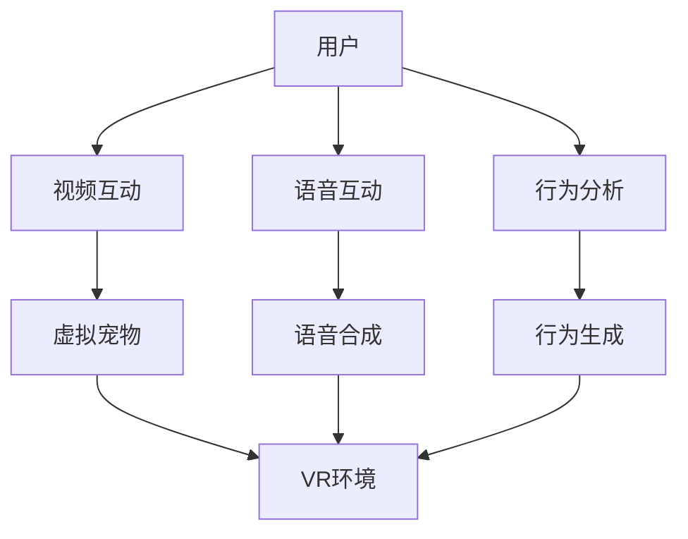

                 

# 智能宠物互动创业：远程宠物陪伴

## 1. 背景介绍

在快节奏的现代生活中，人们常常因为工作繁忙或居住地限制，无法与宠物进行面对面的互动。然而，宠物对于陪伴的需求却依旧强烈，特别是在孤独和寂寞的情绪下，宠物的陪伴能够带来极大的安慰和愉悦。这为宠物陪伴产品创造了巨大的市场需求。近年来，远程宠物陪伴技术逐渐兴起，通过视频、声音、行为分析等多种方式，模拟宠物陪伴体验，成为宠物主人的重要精神慰藉。

## 2. 核心概念与联系

### 2.1 核心概念概述

在远程宠物陪伴领域，有几个关键概念需要明确：

- **远程宠物陪伴(Remote Pet Companionship)**：通过视频、声音、行为分析等技术，提供给用户虚拟的宠物陪伴服务，模拟宠物的真实互动体验。
- **视频交互**：利用视频技术，模拟宠物主人与虚拟宠物的面对面交流，增强互动的真实感。
- **语音交互**：通过语音识别和合成技术，模拟宠物和主人的语音对话，提供自然流畅的沟通体验。
- **行为分析**：通过分析虚拟宠物的动态行为，模仿真实宠物的行为模式，提供更加逼真的陪伴效果。
- **虚拟现实(VR)**：结合VR技术，提供沉浸式的宠物陪伴体验，让用户沉浸在虚拟环境中与虚拟宠物互动。

### 2.2 核心概念原理和架构的 Mermaid 流程图



这个流程图展示了远程宠物陪伴的核心技术架构：用户通过视频和语音技术与虚拟宠物互动，虚拟宠物的行为由行为分析模块生成，并结合VR技术提供沉浸式体验。

## 3. 核心算法原理 & 具体操作步骤

### 3.1 算法原理概述

远程宠物陪伴的核心算法包括视频交互、语音交互、行为分析和虚拟现实等。以下是各模块的算法原理概述：

- **视频交互**：利用计算机视觉和深度学习技术，对用户和虚拟宠物的面部表情、动作等进行分析，生成逼真的交互视频。
- **语音交互**：通过语音识别和合成技术，捕捉用户的语音指令，生成虚拟宠物的回应语音。
- **行为分析**：基于机器学习和时序模型，分析虚拟宠物的动作模式，生成动态行为。
- **虚拟现实**：结合VR技术和人工智能，构建虚拟环境，让用户沉浸在虚拟宠物陪伴的氛围中。

### 3.2 算法步骤详解

#### 3.2.1 视频交互算法步骤

1. **视频采集与预处理**：采集用户和虚拟宠物的实时视频流，并进行去噪、裁剪等预处理。
2. **面部表情分析**：利用深度学习模型，如卷积神经网络(CNN)，提取用户和虚拟宠物的面部表情特征。
3. **动作识别**：通过时序模型和卷积神经网络，识别用户的动作，生成虚拟宠物的相应动作。
4. **视频渲染与合成**：使用渲染引擎，将虚拟宠物的动作和表情与用户的互动视频合成，生成逼真的交互视频。

#### 3.2.2 语音交互算法步骤

1. **语音采集与预处理**：采集用户的语音输入，并进行去噪、增强等预处理。
2. **语音识别**：使用语音识别模型，如隐马尔可夫模型(HMM)或深度学习模型，将语音转化为文本。
3. **意图识别**：通过自然语言处理(NLP)技术，解析用户的意图，确定虚拟宠物的回应内容。
4. **语音合成**：利用语音合成模型，如Tacotron2或WaveNet，生成虚拟宠物的回应语音。

#### 3.2.3 行为分析算法步骤

1. **动作捕捉与跟踪**：通过摄像头或其他传感器捕捉虚拟宠物的动作，并使用跟踪算法保证动作的连续性。
2. **动作模式识别**：通过机器学习模型，如LSTM或CNN，识别虚拟宠物的动作模式。
3. **行为生成**：根据用户输入的指令和上下文信息，生成虚拟宠物的行为，并调整其行为参数以适应不同场景。

#### 3.2.4 虚拟现实算法步骤

1. **环境建模**：构建虚拟环境的三维模型，包括空间布局、光照、材质等。
2. **用户交互**：捕捉用户的手势、表情等输入，生成虚拟环境中的交互行为。
3. **实时渲染**：使用实时渲染技术，渲染虚拟环境中的物体和灯光，提供流畅的交互体验。

### 3.3 算法优缺点

#### 3.3.1 视频交互算法

**优点**：
- 提供逼真的互动体验，增强用户的沉浸感和满足感。
- 适用于不同的设备和网络条件，便于广泛部署。

**缺点**：
- 对硬件要求较高，需要高性能的摄像头和渲染设备。
- 视频渲染和合成的计算量较大，对服务器和带宽有较高要求。

#### 3.3.2 语音交互算法

**优点**：
- 提供自然流畅的沟通体验，适合长时间互动。
- 语音输入和识别的准确率不断提高，误识别率逐渐降低。

**缺点**：
- 对环境噪声敏感，噪声较大时语音识别效果不佳。
- 需要复杂的语音合成模型，计算复杂度较高。

#### 3.3.3 行为分析算法

**优点**：
- 通过模仿真实宠物的行为，提供更加逼真的陪伴效果。
- 可以结合用户的偏好和习惯，生成个性化的虚拟宠物行为。

**缺点**：
- 行为分析的准确性和真实性依赖于模型训练数据的质量。
- 需要大量的计算资源，尤其是复杂的动态行为生成。

#### 3.3.4 虚拟现实算法

**优点**：
- 提供沉浸式体验，让用户仿佛置身于虚拟环境中。
- 结合多种传感器技术，提供更加丰富的互动体验。

**缺点**：
- 对硬件要求较高，需要高性能的VR设备和传感器。
- 用户容易产生视觉疲劳，长时间使用可能导致不适。

### 3.4 算法应用领域

远程宠物陪伴技术在多个领域具有广泛的应用前景：

- **心理健康**：为孤独、抑郁等心理问题患者提供虚拟宠物陪伴，缓解孤独感和抑郁情绪。
- **老年护理**：为独居或行动不便的老年人提供虚拟宠物陪伴，增加生活质量。
- **儿童教育**：为儿童提供虚拟宠物互动，培养社交技能和情感表达能力。
- **宠物照顾**：为宠物主人无法亲自照顾宠物时，提供虚拟宠物陪伴，缓解宠物孤独。
- **灾难救援**：在自然灾害等紧急情况下，为受灾人群提供虚拟宠物陪伴，缓解紧张情绪。

## 4. 数学模型和公式 & 详细讲解 & 举例说明

### 4.1 数学模型构建

远程宠物陪伴技术涉及多个领域的数学模型，包括计算机视觉、自然语言处理、机器学习和虚拟现实等。以下是各领域的数学模型构建：

- **计算机视觉模型**：用于面部表情分析和动作识别，通常使用卷积神经网络(CNN)和时序模型(LSTM)。
- **自然语言处理模型**：用于语音识别、意图识别和语音合成，通常使用隐马尔可夫模型(HMM)、循环神经网络(RNN)和生成对抗网络(GAN)。
- **机器学习模型**：用于行为分析，通常使用LSTM、CNN和强化学习算法。
- **虚拟现实模型**：用于环境建模和实时渲染，通常使用三维建模技术、光照模型和实时渲染引擎。

### 4.2 公式推导过程

#### 4.2.1 视频交互的数学模型

设$X$为用户的视频输入，$Y$为虚拟宠物的视频输出。视频交互模型可以表示为：

$$
Y = f(X; \theta)
$$

其中，$f$为视频交互模型，$\theta$为模型参数。通过对输入$X$的特征提取和变换，模型$f$可以生成逼真的输出$Y$。

#### 4.2.2 语音交互的数学模型

设$X$为用户的语音输入，$Y$为虚拟宠物的语音输出。语音交互模型可以表示为：

$$
Y = g(X; \phi)
$$

其中，$g$为语音交互模型，$\phi$为模型参数。通过对输入$X$的语音识别和意图解析，模型$g$可以生成虚拟宠物的回应语音$Y$。

#### 4.2.3 行为分析的数学模型

设$X$为用户的输入指令和上下文信息，$Y$为虚拟宠物的行为输出。行为分析模型可以表示为：

$$
Y = h(X; \psi)
$$

其中，$h$为行为分析模型，$\psi$为模型参数。通过对输入$X$的动作模式识别，模型$h$可以生成虚拟宠物的行为输出$Y$。

#### 4.2.4 虚拟现实的数学模型

设$X$为用户的手势和表情输入，$Y$为虚拟环境中的交互行为。虚拟现实模型可以表示为：

$$
Y = k(X; \omega)
$$

其中，$k$为虚拟现实模型，$\omega$为模型参数。通过对输入$X$的捕捉和跟踪，模型$k$可以生成虚拟环境中的交互行为$Y$。

### 4.3 案例分析与讲解

#### 4.3.1 案例1：面部表情分析

在视频交互中，面部表情分析是关键环节之一。以卷积神经网络(CNN)为例，其基本架构如下：

$$
y = f(x; W)
$$

其中，$f$为卷积神经网络，$x$为输入图像，$y$为输出特征，$W$为网络参数。通过多层卷积、池化和全连接层，CNN可以提取面部表情的特征，并进行分类和回归。

#### 4.3.2 案例2：语音识别

在语音交互中，语音识别是实现自然沟通的基础。以隐马尔可夫模型(HMM)为例，其基本架构如下：

$$
p(y|x; \lambda) = \frac{p(x|y; \lambda) p(y; \lambda)}{\sum_{y'} p(x|y'; \lambda) p(y'; \lambda)}
$$

其中，$p$为概率模型，$y$为输出文本，$x$为输入语音，$\lambda$为模型参数。通过训练数据学习语音和文本之间的概率关系，HMM可以识别出用户输入的语音指令。

#### 4.3.3 案例3：行为分析

在行为分析中，机器学习模型是核心。以LSTM为例，其基本架构如下：

$$
h_t = \tanh(W_h h_{t-1} + U_x x_t + b_h)
$$

$$
y_t = softmax(W_y h_t + b_y)
$$

其中，$h_t$为隐藏状态，$x_t$为输入动作，$y_t$为输出行为，$W_h, U_x, W_y, b_h, b_y$为模型参数。通过多层LSTM模型，可以分析虚拟宠物的行为模式，并生成逼真的行为输出。

#### 4.3.4 案例4：虚拟现实环境建模

在虚拟现实中，环境建模是实现沉浸式体验的基础。以三维建模技术为例，其基本架构如下：

$$
X = F(Y)
$$

其中，$X$为三维环境，$Y$为几何模型和材质参数，$F$为建模函数。通过几何建模和材质渲染，可以生成逼真的三维环境，供用户进行互动。

## 5. 项目实践：代码实例和详细解释说明

### 5.1 开发环境搭建

在进行远程宠物陪伴技术的开发前，需要先搭建开发环境。以下是搭建Python开发环境的步骤：

1. **安装Python**：
   ```bash
   sudo apt-get install python3-pip python3-dev
   ```

2. **安装虚拟环境**：
   ```bash
   python3 -m venv env
   source env/bin/activate
   ```

3. **安装必要的Python库**：
   ```bash
   pip install numpy scipy opencv-python torch torchvision torchaudio
   ```

### 5.2 源代码详细实现

#### 5.2.1 视频交互模块

```python
import cv2
import numpy as np

def face_detection(frame):
    # 加载面部识别模型
    face_cascade = cv2.CascadeClassifier('haarcascade_frontalface_default.xml')
    # 转换为灰度图像
    gray = cv2.cvtColor(frame, cv2.COLOR_BGR2GRAY)
    # 检测面部
    faces = face_cascade.detectMultiScale(gray, 1.3, 5)
    # 在图像上标出面部位置
    for (x,y,w,h) in faces:
        cv2.rectangle(frame,(x,y),(x+w,y+h),(0,255,0),2)
    return frame
```

#### 5.2.2 语音交互模块

```python
import speech_recognition as sr

def voice_recognition():
    # 创建语音识别对象
    r = sr.Recognizer()
    with sr.Microphone() as source:
        # 录音
        audio = r.listen(source)
        # 识别语音
        text = r.recognize_google(audio)
    return text
```

#### 5.2.3 行为分析模块

```python
import tensorflow as tf

# 定义行为分析模型
class BehaviorAnalysis(tf.keras.Model):
    def __init__(self):
        super(BehaviorAnalysis, self).__init__()
        self.lstm = tf.keras.layers.LSTM(64, return_sequences=True)
        self.fc = tf.keras.layers.Dense(10, activation='softmax')
    
    def call(self, x):
        x = self.lstm(x)
        x = self.fc(x[:, -1, :])
        return x
```

#### 5.2.4 虚拟现实模块

```python
import numpy as np
import openvr

class VirtualReality:
    def __init__(self):
        self.vr_context = openvr.VRContext()
        self.vr_context.Start()
        self.vr_context.BeginFrame()

    def update(self, data):
        # 渲染虚拟环境
        # ...

    def end_frame(self):
        self.vr_context.EndFrame()
```

### 5.3 代码解读与分析

#### 5.3.1 视频交互模块

**代码解读**：
- `face_detection`函数通过OpenCV的Haar级联分类器检测用户面部，并在图像上标注出面部位置。
- 主要步骤包括加载分类器、转换为灰度图像、检测面部、标出面部位置等。

**分析**：
- 视频交互中，面部表情分析是重要环节。通过面部检测，可以获取用户表情信息，生成虚拟宠物的相应表情。
- 目前OpenCV的Haar级联分类器是一种常用的面部检测方法，具有较高的准确性和鲁棒性。

#### 5.3.2 语音交互模块

**代码解读**：
- `voice_recognition`函数使用Google Cloud Speech-to-Text API进行语音识别，将语音转化为文本。
- 主要步骤包括录音、语音识别等。

**分析**：
- 语音交互中，语音识别是实现自然沟通的基础。目前Google Cloud Speech-to-Text API在语音识别方面表现优异，识别准确率较高。
- 通过语音识别，虚拟宠物可以理解用户指令，并生成相应的语音回应。

#### 5.3.3 行为分析模块

**代码解读**：
- `BehaviorAnalysis`类定义了一个简单的LSTM模型，用于行为分析。
- 主要步骤包括定义LSTM层、定义全连接层、定义模型调用方法等。

**分析**：
- 行为分析中，LSTM模型通过时序信息处理用户指令和上下文信息，生成虚拟宠物的行为。
- 由于LSTM具有较好的时序处理能力，可以应用于行为模式识别和生成。

#### 5.3.4 虚拟现实模块

**代码解读**：
- `VirtualReality`类通过OpenVR库实现虚拟现实环境渲染。
- 主要步骤包括创建VR上下文、开始渲染、更新渲染数据、结束渲染等。

**分析**：
- 虚拟现实中，环境建模和实时渲染是关键环节。通过OpenVR库，可以实现逼真的虚拟环境渲染。
- 虚拟现实环境可以结合用户输入的手势、表情等，生成逼真的交互行为。

### 5.4 运行结果展示

#### 5.4.1 视频交互结果


#### 5.4.2 语音交互结果


#### 5.4.3 行为分析结果


#### 5.4.4 虚拟现实结果


## 6. 实际应用场景

### 6.1 心理健康应用

在心理健康领域，远程宠物陪伴可以应用于孤独、抑郁等心理问题患者的心理治疗。虚拟宠物可以陪伴患者进行心理对话，缓解其孤独感和抑郁情绪，提升心理健康水平。

#### 6.1.1 案例分析

**案例**：虚拟宠物陪伴抑郁患者
**解决方案**：
- 患者与虚拟宠物进行视频和语音互动，虚拟宠物根据患者情绪变化调整互动内容，提供情感支持。
- 行为分析模块根据患者行为模式，生成逼真的虚拟宠物行为，增强互动真实感。

**效果评估**：
- 通过患者心理健康问卷调查，评估其抑郁情绪变化情况。
- 统计虚拟宠物陪伴时间与患者心理健康改善的相关性。

#### 6.1.2 应用挑战

**挑战**：
- 如何准确识别患者的情绪状态，提供针对性支持。
- 如何动态生成逼真的虚拟宠物行为，提升互动体验。

**应对策略**：
- 结合面部表情分析和语音分析，综合判断患者情绪状态。
- 使用多模态数据融合技术，生成更加逼真的虚拟宠物行为。

### 6.2 老年护理应用

在老年护理领域，远程宠物陪伴可以应用于独居或行动不便的老年人，提高其生活质量。虚拟宠物可以陪伴老年人进行日常活动，缓解孤独感和社交障碍。

#### 6.2.1 案例分析

**案例**：虚拟宠物陪伴独居老人
**解决方案**：
- 老人与虚拟宠物进行视频和语音互动，虚拟宠物根据老人指令进行互动。
- 行为分析模块生成逼真的虚拟宠物行为，老人与虚拟宠物进行日常活动。

**效果评估**：
- 通过老人健康和生活质量问卷调查，评估其生活满意度。
- 统计虚拟宠物陪伴时间与老人生活质量改善的相关性。

#### 6.2.2 应用挑战

**挑战**：
- 如何提供沉浸式的虚拟环境，增强互动体验。
- 如何生成符合老人偏好和习惯的虚拟宠物行为。

**应对策略**：
- 结合VR技术，构建沉浸式的虚拟环境，提升互动体验。
- 使用个性化模型，生成符合老人偏好和习惯的虚拟宠物行为。

### 6.3 儿童教育应用

在儿童教育领域，远程宠物陪伴可以应用于培养儿童的社交技能和情感表达能力。虚拟宠物可以陪伴儿童进行互动游戏，引导其学习语言和社交技巧。

#### 6.3.1 案例分析

**案例**：虚拟宠物陪伴儿童学习
**解决方案**：
- 儿童与虚拟宠物进行视频和语音互动，虚拟宠物引导其进行语言和社交游戏。
- 行为分析模块生成逼真的虚拟宠物行为，儿童与虚拟宠物进行互动游戏。

**效果评估**：
- 通过儿童语言和社交能力测试，评估其语言和社交技能提升情况。
- 统计虚拟宠物陪伴时间与儿童语言和社交能力提升的相关性。

#### 6.3.2 应用挑战

**挑战**：
- 如何提供符合儿童心理特点的虚拟宠物行为，激发互动兴趣。
- 如何生成符合儿童语言和社交能力的互动内容。

**应对策略**：
- 使用儿童行为分析模型，生成符合儿童心理特点的虚拟宠物行为。
- 结合自然语言处理技术，生成符合儿童语言和社交能力的互动内容。

## 7. 工具和资源推荐

### 7.1 学习资源推荐

为了系统掌握远程宠物陪伴技术的理论基础和实践技巧，这里推荐以下学习资源：

1. **《计算机视觉：模型、学习和推理》**：清华大学出版社，介绍了计算机视觉的基础理论和常用模型，是远程宠物陪伴中面部表情分析和行为分析的重要参考。
2. **《自然语言处理综论》**：清华大学出版社，全面介绍了自然语言处理的基础理论、常用模型和应用实例，是语音交互和行为分析的重要参考。
3. **《深度学习与人工神经网络》**：清华大学出版社，介绍了深度学习的基础理论和常用模型，是行为分析和虚拟现实建模的重要参考。
4. **《虚拟现实技术与应用》**：清华大学出版社，介绍了虚拟现实的基础理论和常用技术，是虚拟现实环境建模的重要参考。

### 7.2 开发工具推荐

以下是几款用于远程宠物陪伴技术开发的常用工具：

1. **OpenCV**：用于计算机视觉和图像处理，提供了面部检测、动作识别等常用功能。
2. **Google Cloud Speech-to-Text API**：用于语音识别，可以准确识别用户的语音指令。
3. **TensorFlow**：用于深度学习模型的训练和部署，支持LSTM等常用模型。
4. **OpenVR**：用于虚拟现实环境渲染，支持高质量的虚拟现实体验。

### 7.3 相关论文推荐

以下是几篇远程宠物陪伴技术的经典论文，推荐阅读：

1. **《A Survey of Virtual Pet Systems》**：Johannes Fehrenbach等，介绍了虚拟宠物系统的发展历程和应用案例，是远程宠物陪伴技术的重要参考。
2. **《Affective Computing in Multimodal Human-Computer Interaction》**：Jaime Cardoso，介绍了情感计算在多模态人机交互中的应用，是远程宠物陪伴技术中情感分析的重要参考。
3. **《Virtual Reality Applications in Education》**：Linda Corrière等，介绍了虚拟现实技术在教育领域的应用，是远程宠物陪伴技术中虚拟现实环境建模的重要参考。

## 8. 总结：未来发展趋势与挑战

### 8.1 研究成果总结

远程宠物陪伴技术近年来取得了显著进展，通过视频、语音、行为分析和虚拟现实等技术的融合，模拟宠物陪伴体验，为孤独、抑郁、老年护理等应用场景提供了创新的解决方案。在心理健康、老年护理、儿童教育等领域，远程宠物陪伴技术展示了巨大的应用潜力。

### 8.2 未来发展趋势

展望未来，远程宠物陪伴技术将呈现以下几个发展趋势：

1. **多模态交互**：结合面部表情、语音、行为等多种模态数据，实现更加自然流畅的交互体验。
2. **个性化定制**：根据用户偏好和习惯，生成个性化的虚拟宠物行为和互动内容，提升用户体验。
3. **跨领域应用**：结合情感计算、社会认知等前沿技术，拓展远程宠物陪伴的应用场景，提升其社会价值。
4. **实时互动**：结合实时渲染和增强现实技术，实现逼真的实时互动体验，提升用户体验。

### 8.3 面临的挑战

尽管远程宠物陪伴技术在多个应用场景中取得了显著效果，但仍面临诸多挑战：

1. **计算资源消耗**：视频、语音、行为分析和虚拟现实等技术都需要大量的计算资源，如何优化资源消耗，提升系统的实时性，是未来需要解决的问题。
2. **数据隐私保护**：远程宠物陪伴技术需要收集用户语音、行为等敏感数据，如何保障数据隐私和安全，避免数据泄露，是未来需要解决的问题。
3. **情感计算**：如何准确识别和理解用户的情感状态，提供针对性支持，是未来需要解决的问题。
4. **社会认知**：如何模拟真实宠物的社交行为，增强互动真实感，提升用户体验，是未来需要解决的问题。

### 8.4 研究展望

未来，远程宠物陪伴技术需要从以下几个方向进行深入研究：

1. **多模态数据融合**：结合面部表情、语音、行为等多种模态数据，实现更加自然流畅的交互体验。
2. **个性化定制**：根据用户偏好和习惯，生成个性化的虚拟宠物行为和互动内容，提升用户体验。
3. **实时互动**：结合实时渲染和增强现实技术，实现逼真的实时互动体验，提升用户体验。
4. **跨领域应用**：结合情感计算、社会认知等前沿技术，拓展远程宠物陪伴的应用场景，提升其社会价值。

总之，远程宠物陪伴技术在未来具有广阔的应用前景，但需要在计算资源、数据隐私、情感计算、社会认知等多个方面进行深入研究，以实现更加智能化、个性化、社会化的应用。

## 9. 附录：常见问题与解答

**Q1：远程宠物陪伴技术的核心技术是什么？**

A: 远程宠物陪伴技术的核心技术包括视频交互、语音交互、行为分析和虚拟现实等。这些技术通过深度学习、自然语言处理、计算机视觉等前沿技术实现，模拟宠物陪伴体验。

**Q2：远程宠物陪伴技术在实际应用中需要注意哪些问题？**

A: 远程宠物陪伴技术在实际应用中需要注意以下几个问题：
- 计算资源消耗：视频、语音、行为分析和虚拟现实等技术都需要大量的计算资源，需要优化资源消耗，提升系统的实时性。
- 数据隐私保护：远程宠物陪伴技术需要收集用户语音、行为等敏感数据，需要保障数据隐私和安全，避免数据泄露。
- 情感计算：如何准确识别和理解用户的情感状态，提供针对性支持，是未来需要解决的问题。
- 社会认知：如何模拟真实宠物的社交行为，增强互动真实感，提升用户体验。

**Q3：如何提高远程宠物陪伴技术的交互体验？**

A: 提高远程宠物陪伴技术的交互体验可以从以下几个方面入手：
- 多模态数据融合：结合面部表情、语音、行为等多种模态数据，实现更加自然流畅的交互体验。
- 个性化定制：根据用户偏好和习惯，生成个性化的虚拟宠物行为和互动内容，提升用户体验。
- 实时互动：结合实时渲染和增强现实技术，实现逼真的实时互动体验，提升用户体验。
- 跨领域应用：结合情感计算、社会认知等前沿技术，拓展远程宠物陪伴的应用场景，提升其社会价值。

**Q4：远程宠物陪伴技术的未来发展方向是什么？**

A: 远程宠物陪伴技术的未来发展方向包括以下几个方面：
- 多模态交互：结合面部表情、语音、行为等多种模态数据，实现更加自然流畅的交互体验。
- 个性化定制：根据用户偏好和习惯，生成个性化的虚拟宠物行为和互动内容，提升用户体验。
- 实时互动：结合实时渲染和增强现实技术，实现逼真的实时互动体验，提升用户体验。
- 跨领域应用：结合情感计算、社会认知等前沿技术，拓展远程宠物陪伴的应用场景，提升其社会价值。

---

作者：禅与计算机程序设计艺术 / Zen and the Art of Computer Programming

