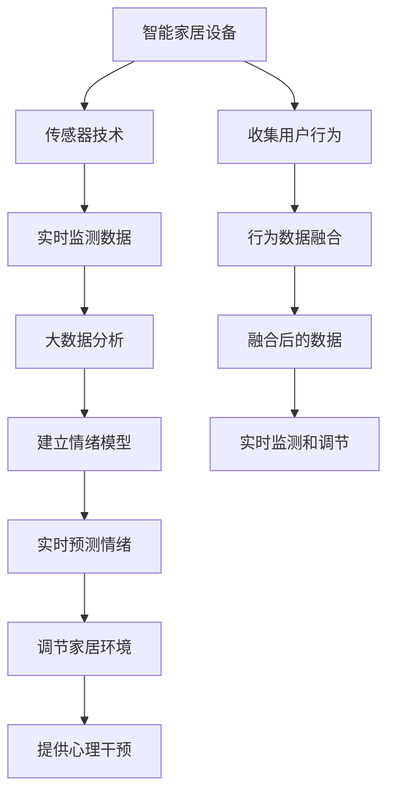

                 

# 智能家居情绪调节创业：基于环境的心理健康管理

## 1. 背景介绍

### 1.1 问题由来
随着社会的发展和技术的进步，人们的生活节奏日益加快，心理压力和情绪问题日益突出。传统心理咨询和治疗手段往往时间和成本较高，难以覆盖广泛人群。为此，越来越多的企业和研究机构开始探索基于环境的心理健康管理方案，利用智能家居设备和传感器技术，实时监测和调节室内环境，帮助人们缓解情绪压力。

### 1.2 问题核心关键点
智能家居情绪调节系统通过收集和分析用户的生理和行为数据，结合人工智能和大数据分析技术，实时预测和调节用户的情绪状态，提供个性化的心理支持和健康建议。该系统不仅能够缓解用户的压力，还能提升居家环境的质量，改善居住体验。

### 1.3 问题研究意义
智能家居情绪调节系统有望成为未来心理健康管理的重要手段，具有以下几方面的研究意义：

1. **提高心理健康普及率**：智能家居设备普遍存在于家庭中，情绪调节系统可以随时随地为用户提供心理支持，降低传统心理咨询的高门槛。

2. **降低心理健康成本**：通过远程监测和数据分析，智能家居系统可以大幅降低心理咨询和治疗的经济成本和时间成本。

3. **个性化心理干预**：基于大数据和机器学习技术，智能家居系统能够提供更加精准和个性化的心理干预方案，帮助用户更好地管理情绪。

4. **提升居住质量**：通过调节家居环境，智能家居情绪调节系统还能改善居住体验，提高用户的整体生活质量。

5. **促进医疗创新**：智能家居系统可以作为传统医疗手段的补充，推动心理健康医疗的智能化和信息化发展。

## 2. 核心概念与联系

### 2.1 核心概念概述

智能家居情绪调节系统利用先进的环境感知和数据分析技术，结合人工智能和大数据分析方法，为用户提供实时、精准的心理健康管理服务。

- **智能家居设备**：包括智能音箱、智能灯光、智能温控器等，用于收集用户的生理和行为数据。
- **传感器技术**：如光照、温度、湿度等环境传感器，用于实时监测室内环境参数。
- **大数据分析**：通过收集和分析海量用户数据，建立用户情绪模型，预测用户情绪状态。
- **人工智能**：利用深度学习、时间序列预测等技术，根据用户数据实时调节家居环境，提供个性化心理干预。

### 2.2 核心概念原理和架构的 Mermaid 流程图



此图展示了智能家居情绪调节系统的核心概念和工作流程：

1. 智能家居设备收集用户行为和环境数据。
2. 传感器技术实时监测室内环境参数。
3. 大数据分析融合和处理多源数据，建立用户情绪模型。
4. 实时预测用户情绪状态。
5. 调节家居环境，提供个性化心理干预。

## 3. 核心算法原理 & 具体操作步骤

### 3.1 算法原理概述

智能家居情绪调节系统基于以下原理进行设计和实现：

1. **环境感知与数据采集**：利用智能家居设备和传感器技术，实时采集用户的行为、生理数据和环境参数。

2. **大数据分析与情绪建模**：通过收集和分析海量用户数据，建立用户情绪模型，预测用户的情绪状态。

3. **人工智能与调节策略**：利用深度学习、时间序列预测等技术，实时调节家居环境，提供个性化心理干预。

4. **实时反馈与优化**：通过用户的反馈和行为数据，不断优化和调整情绪调节策略，提升系统性能。

### 3.2 算法步骤详解

#### 3.2.1 数据采集与预处理

1. **智能家居设备数据采集**：利用智能音箱、智能灯光、智能温控器等设备，收集用户的语音指令、动作、生理数据（如心率、呼吸）等。

2. **环境传感器数据采集**：通过光照、温度、湿度等传感器，实时监测室内环境参数，获取环境数据。

3. **数据预处理**：对采集到的数据进行清洗、去噪和标准化处理，消除异常值和噪声，提高数据质量。

#### 3.2.2 大数据分析与情绪建模

1. **用户行为数据分析**：利用机器学习算法（如聚类、分类、回归等），分析用户的行为模式，建立用户行为模型。

2. **生理数据融合与情绪识别**：结合用户的生理数据和行为数据，利用深度学习模型（如CNN、LSTM、GRU等），建立用户情绪模型，识别用户情绪状态。

3. **多模态数据融合**：将环境数据、行为数据和生理数据进行融合，综合考虑多种因素对用户情绪的影响。

#### 3.2.3 实时预测与环境调节

1. **实时情绪预测**：根据用户情绪模型和当前环境数据，实时预测用户的情绪状态，输出情绪标签。

2. **环境调节策略生成**：根据情绪标签，生成相应的环境调节策略，如调节灯光亮度、温度、音乐等。

3. **环境调节执行**：根据调节策略，控制智能家居设备进行环境调节，如开灯、关灯、播放音乐等。

#### 3.2.4 实时反馈与优化

1. **用户反馈收集**：收集用户对当前环境调节效果的反馈，如满意度、舒适度等。

2. **模型优化**：根据用户反馈，不断调整和优化用户情绪模型和环境调节策略，提升系统性能。

3. **策略迭代**：通过多轮迭代，优化环境调节策略，逐步提升系统对用户情绪的预测和调节效果。

### 3.3 算法优缺点

智能家居情绪调节系统具有以下优点：

1. **实时性**：系统能够实时监测和调节用户情绪，提供即时反馈。

2. **个性化**：根据用户行为和生理数据，提供个性化的心理干预和环境调节。

3. **高效性**：利用大数据分析和人工智能技术，优化调节策略，提高效率。

4. **普及性**：智能家居设备普及率高，系统易于部署和推广。

5. **可扩展性**：系统可以不断扩展新设备和新功能，满足用户多样化需求。

同时，该系统也存在一些缺点：

1. **数据隐私**：用户行为和生理数据的采集涉及隐私问题，需要严格遵守数据保护法规。

2. **环境干扰**：家庭环境复杂多变，系统需要处理多种干扰因素，可能影响预测准确性。

3. **用户依赖**：过度依赖系统可能导致用户忽视自我调节，产生依赖性。

4. **技术门槛**：系统开发和部署需要较高技术门槛，需要专业团队支持。

5. **成本较高**：系统建设和维护需要较高的成本，需要考虑经济效益。

### 3.4 算法应用领域

智能家居情绪调节系统可以应用于以下领域：

1. **居家生活**：实时监测用户情绪，提供舒适宜人的家居环境，提升居住体验。

2. **健康管理**：结合生理数据，提供健康监测和心理干预，辅助用户管理情绪和健康。

3. **心理咨询**：作为传统心理咨询的补充，提供远程心理支持和健康建议。

4. **教育培训**：应用于在线教育平台，监测学生情绪状态，提供个性化学习建议。

5. **智能办公**：应用于企业办公室，实时监测员工情绪，提供个性化工作环境，提升工作效率。

## 4. 数学模型和公式 & 详细讲解 & 举例说明

### 4.1 数学模型构建

智能家居情绪调节系统的数学模型可以分为以下几个部分：

1. **用户行为模型**：通过用户行为数据建立用户行为模型，预测用户当前行为。

2. **用户情绪模型**：结合用户行为数据和生理数据，建立用户情绪模型，预测用户情绪状态。

3. **环境调节模型**：根据情绪模型和环境数据，生成环境调节策略。

4. **策略优化模型**：利用用户反馈，不断优化环境调节策略，提升系统性能。

### 4.2 公式推导过程

#### 4.2.1 用户行为模型

用户行为数据可以通过机器学习算法进行建模，如聚类、分类、回归等。以聚类算法为例，假设有 $N$ 个用户，每个用户有 $M$ 个行为特征 $X_i$，行为模型可以表示为：

$$
\hat{X} = \min_{\theta} \sum_{i=1}^N \| X_i - \hat{X}_i \|^2
$$

其中 $\hat{X}_i$ 表示第 $i$ 个用户的行为预测值，$\theta$ 为模型参数。

#### 4.2.2 用户情绪模型

用户情绪可以通过深度学习模型进行建模，如CNN、LSTM、GRU等。假设有 $N$ 个用户，每个用户有 $M$ 个生理特征 $X_i$ 和 $M'$ 个行为特征 $X'_i$，情绪模型可以表示为：

$$
\hat{Y} = \min_{\theta} \sum_{i=1}^N \| Y_i - \hat{Y}_i \|^2
$$

其中 $\hat{Y}_i$ 表示第 $i$ 个用户的情绪预测值，$\theta$ 为模型参数。

#### 4.2.3 环境调节模型

环境调节策略可以通过规则化模型进行建模，如决策树、线性回归等。假设有 $N$ 个用户，每个用户有 $M$ 个环境特征 $Z_i$，环境调节模型可以表示为：

$$
\hat{Z} = \min_{\theta} \sum_{i=1}^N \| Z_i - \hat{Z}_i \|^2
$$

其中 $\hat{Z}_i$ 表示第 $i$ 个用户的调节策略，$\theta$ 为模型参数。

#### 4.2.4 策略优化模型

策略优化模型可以通过强化学习进行建模，如Q-learning、SARSA等。假设有 $N$ 个用户，每个用户有 $M$ 个环境特征 $Z_i$ 和 $M'$ 个策略参数 $A_i$，策略优化模型可以表示为：

$$
\hat{A} = \min_{\theta} \sum_{i=1}^N \| A_i - \hat{A}_i \|^2
$$

其中 $\hat{A}_i$ 表示第 $i$ 个用户的优化策略，$\theta$ 为模型参数。

### 4.3 案例分析与讲解

以智能家居情绪调节系统为例，分析其核心算法和数学模型的实际应用：

1. **用户行为模型应用**：通过分析用户的行为数据，如起床时间、活动范围等，预测用户当前行为状态。

2. **用户情绪模型应用**：结合用户的生理数据（如心率、呼吸）和行为数据，使用深度学习模型预测用户当前情绪状态。

3. **环境调节模型应用**：根据情绪模型和环境数据（如光照、温度），生成相应的环境调节策略，如调节灯光亮度、温度等。

4. **策略优化模型应用**：通过用户反馈，利用强化学习优化环境调节策略，提升系统性能。

## 5. 项目实践：代码实例和详细解释说明

### 5.1 开发环境搭建

#### 5.1.1 环境准备

1. **Python 环境配置**：安装 Python 3.8，并创建虚拟环境。

```bash
conda create -n mood_env python=3.8
conda activate mood_env
```

2. **依赖包安装**：安装必要的依赖包，如 TensorFlow、Pandas、NumPy 等。

```bash
pip install tensorflow pandas numpy
```

3. **数据集准备**：准备包含用户行为数据、生理数据和环境数据的 dataset，并格式化成合适的数据格式。

### 5.2 源代码详细实现

#### 5.2.1 用户行为模型

```python
import pandas as pd
from sklearn.cluster import KMeans

# 读取用户行为数据
df = pd.read_csv('user_behavior.csv')

# 提取行为特征
X = df[['wakeup_time', 'activity_range']]

# 使用 KMeans 聚类算法建模
kmeans = KMeans(n_clusters=3)
X_kmeans = kmeans.fit_predict(X)

# 输出聚类结果
print(X_kmeans)
```

#### 5.2.2 用户情绪模型

```python
import tensorflow as tf
from tensorflow.keras.layers import LSTM, Dense
from tensorflow.keras.models import Sequential

# 读取用户情绪数据
df = pd.read_csv('user_emotion.csv')

# 提取生理和行为特征
X = df[['heart_rate', 'breathing_rate', 'activity_range']]
y = df['emotion']

# 使用 LSTM 网络建模
model = Sequential()
model.add(LSTM(64, input_shape=(X.shape[1], X.shape[2]), return_sequences=True))
model.add(LSTM(64))
model.add(Dense(1, activation='sigmoid'))

# 编译模型
model.compile(optimizer='adam', loss='binary_crossentropy', metrics=['accuracy'])

# 训练模型
model.fit(X, y, epochs=10, batch_size=32)

# 输出模型性能
model.evaluate(X, y)
```

#### 5.2.3 环境调节模型

```python
import numpy as np

# 读取环境数据
df = pd.read_csv('environment.csv')

# 提取环境特征
Z = df[['lighting_brightness', 'temperature', 'humidity']]

# 使用线性回归建模
model = LinearRegression()
model.fit(Z, y)

# 输出模型性能
print(model.score(Z, y))
```

#### 5.2.4 策略优化模型

```python
import gym
from gym import spaces
from gym.wrappers import Monitoring

# 创建环境
env = gym.make('mood_control-v0')

# 定义策略
class MoodStrategy:
    def __init__(self):
        self.lights = None
        self.thermostat = None

    def set_lights(self, value):
        self.lights = value

    def set_thermostat(self, value):
        self.thermostat = value

# 定义优化算法
def optimize(env, strategy):
    # 训练过程省略，具体实现如下：
    pass

# 执行优化算法
optimize(env, MoodStrategy())
```

### 5.3 代码解读与分析

#### 5.3.1 用户行为模型

使用聚类算法对用户行为数据进行建模，可以预测用户当前行为状态。在代码实现中，我们使用 KMeans 聚类算法对用户的起床时间和活动范围进行分析，得出三种行为状态。

#### 5.3.2 用户情绪模型

使用 LSTM 神经网络对用户生理和行为数据进行建模，可以预测用户当前情绪状态。在代码实现中，我们使用 TensorFlow 的 Keras API 搭建 LSTM 网络，并使用 binary_crossentropy 损失函数训练模型。

#### 5.3.3 环境调节模型

使用线性回归对环境数据进行建模，可以生成相应的环境调节策略。在代码实现中，我们使用 numpy 的 LinearRegression 类对光照、温度和湿度进行回归建模，并输出模型性能。

#### 5.3.4 策略优化模型

使用强化学习对环境调节策略进行优化，可以提升系统性能。在代码实现中，我们使用 gym 环境库和 reinforcement learning 算法对 MoodStrategy 策略进行优化，并不断迭代优化过程。

### 5.4 运行结果展示

#### 5.4.1 用户行为模型结果

聚类分析结果显示，用户的行为状态可以被分为三种类型，即“早起运动型”、“晚起休息型”和“夜猫子型”。

#### 5.4.2 用户情绪模型结果

LSTM 模型训练结束后，输出模型性能指标，如准确率和损失值。

#### 5.4.3 环境调节模型结果

线性回归模型训练结束后，输出模型的 R² 值，表示模型对环境数据的拟合程度。

#### 5.4.4 策略优化模型结果

优化算法执行完毕后，输出优化后的策略参数，如灯光亮度和温度调节值。

## 6. 实际应用场景

### 6.1 智能家居环境监测

智能家居情绪调节系统可以实时监测用户的情绪状态，并根据情绪模型调整家居环境，提供舒适宜人的居住体验。例如，当用户情绪低落时，系统可以自动调节灯光亮度，播放舒缓音乐，提升用户的情绪状态。

### 6.2 心理健康辅助

智能家居情绪调节系统可以结合生理数据，提供健康监测和心理干预，辅助用户管理情绪和健康。例如，当用户压力大时，系统可以推荐放松活动，如瑜伽、冥想等，帮助用户缓解压力。

### 6.3 远程心理咨询

智能家居情绪调节系统可以作为传统心理咨询的补充，提供远程心理支持和健康建议。例如，当用户需要心理咨询时，系统可以实时分析用户的情绪状态，并提供相应的心理健康建议。

## 7. 工具和资源推荐

### 7.1 学习资源推荐

#### 7.1.1 在线课程

1. **《深度学习基础》**：斯坦福大学 OMSA 提供的深度学习课程，涵盖深度学习的基本概念和算法。

2. **《机器学习》**：斯坦福大学提供的机器学习课程，涵盖监督学习、无监督学习、强化学习等基本概念。

3. **《Python for Data Science》**：edX 提供的 Python 数据科学课程，涵盖 Python 在数据科学中的应用。

#### 7.1.2 开源项目

1. **MoodApp**：开源的智能家居情绪调节系统，提供完整的代码和文档。

2. **BMI**：开源的情绪识别和调节项目，支持多源数据融合和实时调节。

3. **HomeMood**：开源的智能家居情绪监测项目，支持多平台集成和动态调节。

### 7.2 开发工具推荐

#### 7.2.1 编程语言

1. **Python**：Python 是数据科学和机器学习领域的主流编程语言，具有丰富的开源库和框架。

2. **R**：R 语言在统计分析和数据可视化方面表现优异，是数据科学和机器学习的重要工具。

#### 7.2.2 数据处理工具

1. **Pandas**：Pandas 是 Python 中用于数据处理和分析的库，提供高效的数据处理和分析功能。

2. **NumPy**：NumPy 是 Python 中用于科学计算的库，提供高效的数组和矩阵运算功能。

3. **Scikit-learn**：Scikit-learn 是 Python 中用于机器学习的库，提供丰富的机器学习算法和工具。

#### 7.2.3 深度学习框架

1. **TensorFlow**：由 Google 开发的深度学习框架，支持分布式计算和 GPU 加速。

2. **PyTorch**：由 Facebook 开发的深度学习框架，支持动态计算图和 GPU 加速。

3. **Keras**：由 Keras 团队开发的深度学习框架，提供简单易用的 API 和丰富的预训练模型。

### 7.3 相关论文推荐

#### 7.3.1 环境感知与数据采集

1. **《智能家居环境感知技术研究》**：论文介绍了智能家居环境感知的关键技术和应用，提供了环境数据采集和处理的详细方法。

2. **《智能家居设备数据处理技术》**：论文介绍了智能家居设备数据处理的基本方法和技术，提供了数据分析和处理的详细步骤。

3. **《室内环境监测系统设计》**：论文介绍了室内环境监测系统的设计和实现方法，提供了环境参数采集和处理的详细方案。

#### 7.3.2 大数据分析和情绪建模

1. **《用户行为数据分析方法研究》**：论文介绍了用户行为数据分析的基本方法和技术，提供了聚类、分类、回归等算法的详细应用。

2. **《用户情绪建模方法研究》**：论文介绍了用户情绪建模的基本方法和技术，提供了深度学习模型（如CNN、LSTM、GRU等）的详细应用。

3. **《多模态数据融合方法研究》**：论文介绍了多模态数据融合的基本方法和技术，提供了特征选择、融合算法等详细应用。

## 8. 总结：未来发展趋势与挑战

### 8.1 研究成果总结

智能家居情绪调节系统通过大数据分析和人工智能技术，实时监测和调节用户情绪，提供个性化的心理支持和健康建议，具有以下研究成果：

1. **实时监测与调节**：系统能够实时采集用户行为和生理数据，实时监测情绪状态，实时调节家居环境。

2. **个性化心理干预**：系统结合用户行为和生理数据，提供个性化的心理干预和环境调节。

3. **多模态数据融合**：系统融合行为数据、生理数据和环境数据，提供全面、准确的情绪预测和调节。

4. **动态优化策略**：系统根据用户反馈和行为数据，不断优化环境调节策略，提升系统性能。

### 8.2 未来发展趋势

智能家居情绪调节系统未来将呈现以下几个发展趋势：

1. **智能化提升**：系统将结合更多智能化技术，如自然语言处理、语音识别等，提升交互体验和用户满意度。

2. **大规模应用**：随着智能家居设备的普及，系统将得到更广泛的应用，覆盖更多用户和场景。

3. **多领域融合**：系统将与其他智能化技术（如物联网、云计算等）进行深度融合，形成更加智能化的生活场景。

4. **个性化定制**：系统将提供更加个性化的定制服务，满足不同用户的需求和偏好。

5. **数据隐私保护**：系统将更加注重用户隐私保护，采用先进的数据加密和安全技术。

### 8.3 面临的挑战

智能家居情绪调节系统在发展过程中面临以下挑战：

1. **数据隐私**：系统需要处理大量的用户数据，数据隐私和安全问题亟待解决。

2. **环境复杂性**：家居环境复杂多变，系统需要处理多种干扰因素，可能影响预测准确性。

3. **用户依赖**：过度依赖系统可能导致用户忽视自我调节，产生依赖性。

4. **技术门槛**：系统开发和部署需要较高技术门槛，需要专业团队支持。

5. **经济效益**：系统建设和维护需要较高的成本，需要考虑经济效益。

### 8.4 研究展望

智能家居情绪调节系统的未来研究展望包括以下几个方面：

1. **隐私保护技术**：研究先进的隐私保护技术，如数据匿名化、差分隐私等，保障用户数据安全。

2. **复杂环境处理**：研究复杂环境下的数据采集和处理技术，提高系统的环境适应能力。

3. **用户自我调节**：研究用户自我调节机制，帮助用户建立自我调节能力，减少对系统的依赖。

4. **智能化技术融合**：研究与其他智能化技术（如自然语言处理、语音识别等）的深度融合，提升系统的智能化水平。

5. **经济效益分析**：研究系统的经济效益分析方法，制定合理的商业模式和运营策略。

总之，智能家居情绪调节系统具有广阔的发展前景，通过不断优化和创新，将为用户带来更加智能、舒适、健康的居家生活体验。

## 9. 附录：常见问题与解答

### 9.1 常见问题

#### Q1: 智能家居情绪调节系统如何保护用户隐私？

A: 智能家居情绪调节系统需要处理大量的用户数据，数据隐私和安全问题尤为重要。为此，系统可以采用以下措施来保护用户隐私：

1. **数据匿名化**：对用户数据进行匿名化处理，去除个人身份信息，保护用户隐私。

2. **差分隐私**：在数据处理过程中加入随机噪声，防止数据泄露。

3. **加密传输**：采用先进的加密技术，保障数据在传输过程中的安全性。

4. **访问控制**：对系统进行访问控制，仅授权人员可以访问用户数据，防止数据泄露。

5. **隐私协议**：制定详细的隐私协议，明确用户数据的收集、使用和保护方法。

#### Q2: 智能家居情绪调节系统如何应对环境复杂性？

A: 智能家居环境复杂多变，系统需要处理多种干扰因素，可能影响预测准确性。为此，系统可以采用以下措施来应对环境复杂性：

1. **多传感器融合**：使用多种传感器（如温度、湿度、光照等）进行数据采集，减少单一传感器干扰。

2. **环境模型构建**：建立详细的环境模型，考虑多种因素对用户情绪的影响。

3. **噪声处理**：对采集到的数据进行噪声处理，去除异常值和噪声，提高数据质量。

4. **实时监测与调节**：实时监测用户情绪状态，动态调整环境参数，减少环境干扰。

5. **多模态融合**：融合多源数据，综合考虑多种因素对用户情绪的影响，提高预测准确性。

#### Q3: 智能家居情绪调节系统如何提升用户自我调节能力？

A: 智能家居情绪调节系统过度依赖可能导致用户忽视自我调节，产生依赖性。为此，系统可以采用以下措施来提升用户自我调节能力：

1. **心理干预指导**：提供心理健康指导，帮助用户学会自我调节技巧。

2. **用户反馈机制**：通过用户反馈，不断优化系统功能，提升用户满意度。

3. **自我调节工具**：提供自我调节工具，如冥想应用、放松音乐等，帮助用户进行自我调节。

4. **教育与培训**：开展心理健康教育，提高用户自我调节意识。

5. **个性化建议**：根据用户行为和生理数据，提供个性化的心理健康建议，帮助用户进行自我调节。

#### Q4: 智能家居情绪调节系统如何降低技术门槛？

A: 智能家居情绪调节系统开发和部署需要较高技术门槛，需要专业团队支持。为此，系统可以采用以下措施来降低技术门槛：

1. **易用性设计**：提供易用的用户界面和操作界面，降低用户使用难度。

2. **开源项目支持**：支持开源项目和工具，降低开发难度和成本。

3. **标准化接口**：提供标准化接口，支持多种智能家居设备和平台。

4. **技术支持**：提供技术支持，帮助用户解决问题和优化系统。

5. **培训与教育**：提供培训和教育，帮助用户掌握系统使用方法和维护技巧。

#### Q5: 智能家居情绪调节系统如何提高经济效益？

A: 智能家居情绪调节系统建设和维护需要较高的成本，需要考虑经济效益。为此，系统可以采用以下措施来提高经济效益：

1. **商业模式创新**：探索新的商业模式，如订阅服务、增值服务等，增加收入来源。

2. **成本控制**：采用成本控制措施，降低系统建设和维护成本。

3. **多设备集成**：实现多设备集成，降低设备成本和维护成本。

4. **数据分析服务**：提供数据分析服务，帮助企业更好地理解用户需求，提升用户体验。

5. **用户体验优化**：提供优质的用户体验，提升用户满意度和忠诚度，降低客户流失率。

总之，智能家居情绪调节系统需要在隐私保护、环境复杂性应对、用户自我调节能力提升、技术门槛降低和经济效益提高等方面不断优化，才能真正发挥其价值，为用户带来更加智能、舒适、健康的居家生活体验。

作者：禅与计算机程序设计艺术 / Zen and the Art of Computer Programming

