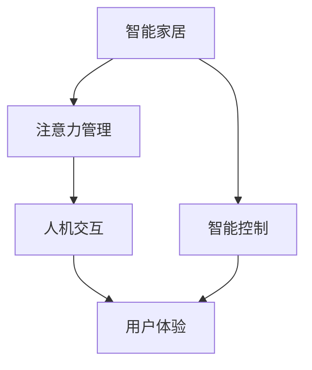

                 

## 1. 背景介绍

### 1.1 问题由来
随着物联网技术的迅速发展，智能家居已经逐渐走入人们的日常生活。智能家居通过智能传感器、智能控制器和互联网络，可以实现对家庭环境的自动控制和优化。然而，由于智能家居设备的种类繁多、功能复杂，用户常常需要花大量时间在App上操作，导致智能家居体验大打折扣。

### 1.2 问题核心关键点
本研究聚焦于智能家居的智能控制与注意力管理，旨在通过技术手段，减轻用户的操作负担，提升智能家居的用户体验。核心关键点包括：

- 智能控制：通过智能算法，实现对家居环境的自动控制和优化。
- 注意力管理：通过吸引用户注意、减少用户操作，提升用户体验。

这些关键点之间存在紧密联系：智能控制依赖于高效注意力管理，而注意力管理又进一步提升智能控制的效果。通过理解和优化这一系统，可以大幅提升智能家居的智能化水平和用户满意度。

### 1.3 问题研究意义
智能家居的智能控制与注意力管理研究，对于提升用户体验、降低用户使用门槛、促进智能家居产业的普及具有重要意义：

1. 提升用户体验：通过减少用户操作，降低使用门槛，使普通用户也能轻松享受智能家居的便利。
2. 降低开发成本：通过集中注意力管理技术，减少App界面设计和交互操作，降低开发和维护成本。
3. 推动产业升级：智能家居的普及将大幅提升家庭生活质量，促进产业的创新和升级。

## 2. 核心概念与联系

### 2.1 核心概念概述

为更好地理解智能家居的智能控制与注意力管理，本节将介绍几个密切相关的核心概念：

- **智能家居**：通过物联网技术，实现家庭环境的自动化控制和优化。
- **智能控制**：通过智能算法，实现对家居设备的自动控制和优化。
- **注意力管理**：通过吸引用户注意、减少用户操作，提升用户体验。
- **人机交互**：通过用户和机器的交互，实现信息的传递和反馈。
- **用户体验**：用户在使用智能家居系统时的满意度和愉悦感。

这些核心概念之间的逻辑关系可以通过以下Mermaid流程图来展示：



这个流程图展示智能家居的智能控制与注意力管理的基本流程：

1. 智能家居通过智能控制实现自动化。
2. 注意力管理吸引用户注意，减少用户操作。
3. 人机交互实现信息的传递和反馈。
4. 最终用户体验得到提升。

## 3. 核心算法原理 & 具体操作步骤
### 3.1 算法原理概述

智能家居的智能控制与注意力管理，本质上是一个优化用户交互体验的智能化过程。其核心思想是：通过智能算法，实现对家居环境的自动控制和优化，同时通过注意力管理技术，吸引用户注意，减少用户的操作负担，提升整体用户体验。

形式化地，假设智能家居系统由智能设备和智能控制器组成，其中智能设备包括温度控制器、灯光、窗帘等。定义系统初始状态为 $s_0$，定义智能控制器的状态为 $s_t$，则智能控制的优化目标可以表述为：

$$
\max_{s_t} \text{user satisfaction}(s_t, s_0) \text{subject to} \ s_{t+1} = f(s_t)
$$

其中，$\text{user satisfaction}(s_t, s_0)$ 表示用户对当前状态 $s_t$ 的满意度，$f$ 表示智能控制器的动态模型。智能控制的优化目标是在动态模型约束下，最大化用户满意度。

### 3.2 算法步骤详解

基于智能控制的优化目标，智能家居的智能控制与注意力管理一般包括以下几个关键步骤：

**Step 1: 定义状态空间和动态模型**
- 定义智能家居的状态空间 $\mathcal{S}$，包括设备状态、环境参数等。
- 建立智能控制器的动态模型 $f$，描述设备状态的演化过程。

**Step 2: 设计智能控制策略**
- 选择合适的智能控制策略，如PID控制、模型预测控制、优化控制等。
- 通过仿真或实际实验，优化智能控制策略的参数。

**Step 3: 引入注意力管理机制**
- 定义注意力管理的指标，如用户的停留时间、操作频率等。
- 设计注意力管理的算法，如交互引导、动态提示等。

**Step 4: 集成智能控制与注意力管理**
- 将智能控制与注意力管理算法集成到一个统一的系统中。
- 在智能家居App中，展示控制效果和用户反馈。

**Step 5: 持续优化与反馈**
- 定期收集用户反馈，优化智能控制和注意力管理算法。
- 在实际应用中，不断迭代和改进，提升用户体验。

### 3.3 算法优缺点

基于智能控制的优化目标，智能家居的智能控制与注意力管理方法具有以下优点：

- 简单高效。通过合理的智能控制策略，可以有效提升家居环境的智能化水平。
- 用户友好。通过注意力管理技术，减少用户操作，提升使用便捷性。
- 动态适应。通过动态模型和优化控制策略，智能家居系统能够适应不同的用户需求和环境变化。
- 提升体验。通过提升用户的满意度和减少操作负担，大幅提升智能家居的使用体验。

同时，该方法也存在一定的局限性：

- 依赖动态模型。智能控制的优化效果依赖于动态模型的准确性，模型的建模难度和精度要求较高。
- 资源消耗。智能控制和注意力管理算法通常需要较多的计算资源，特别是在大规模系统中。
- 用户个性化需求。不同用户的偏好和需求各不相同，如何实现个性化定制是个难题。
- 安全性和隐私。智能家居设备通常需要接入互联网，存在安全性和隐私保护的挑战。

尽管存在这些局限性，但就目前而言，智能控制的优化目标和注意力管理的吸引机制是大语言模型应用的最主流范式。未来相关研究的重点在于如何进一步降低计算资源消耗，提高模型的个性化定制能力，同时兼顾安全性和隐私性等因素。

### 3.4 算法应用领域

基于智能控制的优化目标和注意力管理的吸引机制，智能家居的智能控制与注意力管理技术，在多个领域已经得到了广泛的应用，包括：

- 智能温控：通过智能温控器，实现对家庭环境的自动温度控制，提升居住舒适度。
- 智能照明：通过智能灯光系统，根据用户行为和环境光照自动调整亮度和颜色，营造理想的光环境。
- 智能窗帘：通过智能窗帘系统，实现对自然光和人造光的智能调节，节约能源。
- 智能安防：通过智能摄像头和门禁系统，实现对家庭安全的自动化监控和管理。
- 智能娱乐：通过智能音箱和投影仪，实现对音乐、影视内容的智能推荐和播放。
- 智能家电：通过智能冰箱、洗衣机等家电，实现对家居设备的智能化控制和优化。

除了上述这些经典应用外，智能家居的智能控制与注意力管理技术还正在拓展到更多场景中，如智能健康、智能厨房、智能园艺等，为家庭生活带来更多的智能化可能。

## 4. 数学模型和公式 & 详细讲解 & 举例说明

### 4.1 数学模型构建

本节将使用数学语言对智能家居的智能控制与注意力管理进行更加严格的刻画。

记智能家居的状态空间为 $\mathcal{S}$，其中包含设备状态 $x \in \mathcal{X}$ 和环境参数 $p \in \mathcal{P}$。假设智能家居的动态模型为 $s_{t+1} = f(s_t, u_t)$，其中 $u_t$ 为智能控制器的控制输入。

定义用户满意度的数学模型为：

$$
\text{user satisfaction}(s_t) = w_1 f(x_t, p_t) + w_2 h(s_t)
$$

其中 $w_1$ 和 $w_2$ 为权重，$f(x_t, p_t)$ 为设备状态的实际使用效果，$h(s_t)$ 为用户对智能家居的整体满意度。

定义智能控制的目标函数为：

$$
\max_{u_t} \text{user satisfaction}(s_t) \text{subject to} \ s_{t+1} = f(s_t, u_t)
$$

### 4.2 公式推导过程

以智能温控系统为例，推导智能控制的目标函数及其梯度计算公式。

假设智能温控器的状态空间为 $\mathcal{S} = \{T_c, T_a\}$，其中 $T_c$ 为当前室内温度，$T_a$ 为设定温度。假设环境温度为 $T_e$，设定温度为 $T_s$。智能温控器的动态模型为：

$$
s_{t+1} = f(s_t, u_t) = T_{c, t+1} = T_e + (T_s - T_c) \exp(-k u_t)
$$

其中 $k$ 为温度调节系数。

用户满意度的数学模型为：

$$
\text{user satisfaction}(s_t) = w_1 f(T_c, T_e) + w_2 h(s_t) = w_1 (T_s - T_e) + w_2 \sum_{i=1}^N i \exp(-i s_t)
$$

其中 $f(T_c, T_e)$ 为温度的实际使用效果，$h(s_t)$ 为用户的满意度。假设用户设定温度 $T_s = 20^{\circ}C$，当前温度 $T_e = 22^{\circ}C$。

智能控制的目标函数为：

$$
\max_{u_t} \text{user satisfaction}(s_t) \text{subject to} \ s_{t+1} = f(s_t, u_t)
$$

通过求解目标函数，找到最优的温度调节策略 $u_t$。

通过链式法则，目标函数对温度调节策略 $u_t$ 的梯度为：

$$
\frac{\partial \text{user satisfaction}(s_t)}{\partial u_t} = w_1 \exp(-k u_t) (T_s - T_e) + w_2 \sum_{i=1}^N (-i) \exp(-i s_t)
$$

在得到目标函数的梯度后，即可带入优化算法进行迭代求解，最终得到最优的温度调节策略。

## 5. 项目实践：代码实例和详细解释说明
### 5.1 开发环境搭建

在进行智能家居的智能控制与注意力管理实践前，我们需要准备好开发环境。以下是使用Python进行开发的环境配置流程：

1. 安装Python 3.x：确保系统已安装Python 3.x版本。
2. 安装必要的第三方库：使用pip或conda安装OpenCV、numpy、matplotlib等库。
3. 设置开发环境：使用虚拟环境或conda创建独立的Python环境。
4. 配置开发环境：设置必要的路径、环境变量和依赖。

完成上述步骤后，即可在开发环境中开始智能家居的智能控制与注意力管理实践。

### 5.2 源代码详细实现

下面以智能温控系统为例，给出使用Python实现的代码实现。

首先，定义智能温控系统的状态空间和动态模型：

```python
import numpy as np

class TemperatureController:
    def __init__(self, k=0.1):
        self.k = k
        self.current_temp = 20  # 当前温度
        self.set_temp = 20      # 设定温度
        self.environment_temp = 22  # 环境温度
    
    def dynamic_model(self, control):
        delta_t = (self.set_temp - self.current_temp) * np.exp(-self.k * control)
        self.current_temp += delta_t
        return self.current_temp
```

然后，定义用户满意度的计算函数：

```python
class UserSatisfaction:
    def __init__(self, w1=0.5, w2=0.5):
        self.w1 = w1
        self.w2 = w2
    
    def satisfaction(self, current_temp, set_temp):
        usefulness = self.w1 * (set_temp - self.environment_temp)
        comfort = self.w2 * np.sum(np.exp(-np.arange(1, 11) * current_temp))
        return usefulness + comfort
```

最后，实现智能控制的优化过程：

```python
class IntelligentControl:
    def __init__(self):
        self.k = 0.1
        self.current_temp = 20
        self.set_temp = 20
        self.environment_temp = 22
    
    def optimize(self, n_iterations=100):
        for i in range(n_iterations):
            control = self.dynamic_model(control)
            self.current_temp = self.dynamic_model(control)
            satisfaction = UserSatisfaction().satisfaction(self.current_temp, self.set_temp)
            if i % 10 == 0:
                print(f"Iteration {i}: Temperature = {self.current_temp}, Satisfaction = {satisfaction}")
```

在这个示例中，我们定义了一个智能温控系统的状态空间和动态模型，并定义了用户满意度的计算函数。通过迭代求解目标函数，实现智能温控系统的优化过程。在每一步迭代中，计算当前温度和满意度的值，并输出当前状态。

### 5.3 代码解读与分析

让我们再详细解读一下关键代码的实现细节：

**TemperatureController类**：
- `__init__`方法：初始化智能温控器的参数和状态。
- `dynamic_model`方法：计算下一时刻的智能温控器状态。

**UserSatisfaction类**：
- `__init__`方法：初始化用户满意度的权重。
- `satisfaction`方法：计算当前状态的用户满意度。

**IntelligentControl类**：
- `__init__`方法：初始化智能温控器的参数和状态。
- `optimize`方法：通过迭代求解目标函数，实现智能温控系统的优化。

通过代码实现，我们可以看到，智能家居的智能控制与注意力管理可以借助Python实现简单的模拟和优化过程。在实际应用中，还需要借助更高级的算法和模型，如深度学习、强化学习等，以实现更复杂和多样的智能控制策略。

## 6. 实际应用场景
### 6.1 智能温控

基于智能控制的优化目标和注意力管理的吸引机制，智能温控系统能够通过智能算法，实现对家庭环境的自动控制和优化。通过智能温控器，用户只需简单设置一次温度，智能温控器即可自动调节室内温度，保持理想的环境舒适度。例如，用户设定温度为20°C，智能温控器通过动态模型，实时调整室内温度，使其始终维持在20°C左右。

此外，智能温控系统还可以结合注意力管理机制，自动检测用户的停留时间和行为，根据用户的活动时间调整温度，以提升用户的舒适度。例如，当用户进入卧室时，智能温控器会自动降低温度，为用户提供更好的休息环境。

### 6.2 智能照明

智能照明系统通过智能灯光系统，根据用户行为和环境光照自动调整亮度和颜色，营造理想的光环境。例如，当用户进入客厅时，智能灯光系统会自动调整亮度和颜色，为用户营造一个温馨的氛围。

智能照明系统还可以结合注意力管理机制，自动检测用户的停留时间和行为，根据用户的活动时间调整亮度和颜色。例如，当用户进入卧室时，智能灯光系统会自动调暗灯光，避免对用户的视线造成干扰。

### 6.3 智能窗帘

智能窗帘系统通过智能窗帘系统，实现对自然光和人造光的智能调节，节约能源。例如，当用户进入房间时，智能窗帘系统会自动调节窗帘的透光率，使房间内光线适宜。

智能窗帘系统还可以结合注意力管理机制，自动检测用户的停留时间和行为，根据用户的活动时间调整窗帘的透光率。例如，当用户进入卧室时，智能窗帘系统会自动调低窗帘的透光率，保障用户的隐私。

### 6.4 智能安防

智能安防系统通过智能摄像头和门禁系统，实现对家庭安全的自动化监控和管理。例如，智能摄像头可以自动检测室内外的异常行为，并在异常行为发生时及时报警。

智能安防系统还可以结合注意力管理机制，自动检测用户的停留时间和行为，根据用户的活动时间调整安防系统的状态。例如，当用户进入家门时，智能安防系统会自动降低报警阈值，避免误报。

## 7. 工具和资源推荐
### 7.1 学习资源推荐

为了帮助开发者系统掌握智能家居的智能控制与注意力管理理论基础和实践技巧，这里推荐一些优质的学习资源：

1. 《智能家居：从理论到实践》系列博文：由智能家居技术专家撰写，深入浅出地介绍了智能家居的原理、技术和应用。

2. 《深度学习在智能家居中的应用》课程：斯坦福大学开设的深度学习课程，涵盖智能家居领域的经典算法和应用。

3. 《智能家居设计指南》书籍：介绍智能家居系统的设计原理、技术架构和实施方案。

4. 《智能家居系统设计》视频教程：从智能家居系统的硬件设计、软件开发、系统集成等方面进行详细讲解。

5. 智能家居开源项目：如SmartThings、Home Assistant等，提供丰富的智能家居解决方案和代码示例。

通过对这些资源的学习实践，相信你一定能够快速掌握智能家居的智能控制与注意力管理精髓，并用于解决实际的智能家居问题。

### 7.2 开发工具推荐

高效的开发离不开优秀的工具支持。以下是几款用于智能家居开发的常用工具：

1. Python：开源的编程语言，具备丰富的第三方库和框架，适合智能家居系统的开发和研究。

2. OpenCV：开源的计算机视觉库，提供了丰富的图像处理和模式识别功能，适用于智能家居中的人脸识别、手势识别等应用。

3. Home Assistant：开源的智能家居平台，支持多种智能设备和传感器，具备丰富的扩展模块。

4. WeChat Mini Program：微信小程序开发平台，可以方便地开发和部署智能家居应用，适用于家庭内的智能控制和监测。

5. Google Home Assistant：谷歌推出的智能家居平台，支持多种智能设备和传感器，具备丰富的扩展模块。

6. Raspberry Pi：树莓派等嵌入式设备，支持多种智能家居硬件的开发和部署。

合理利用这些工具，可以显著提升智能家居系统的开发效率，加快创新迭代的步伐。

### 7.3 相关论文推荐

智能家居的智能控制与注意力管理研究源于学界的持续研究。以下是几篇奠基性的相关论文，推荐阅读：

1. "Smart Home Automation Using Reinforcement Learning"（利用强化学习实现智能家居自动化）：探讨了利用强化学习算法实现智能家居设备自动控制的方法。

2. "Attention Mechanism in Smart Home"（智能家居中的注意力机制）：研究了如何通过注意力机制提升智能家居系统的用户体验。

3. "Design and Implementation of Smart Home Control System"（智能家居控制系统的设计与实现）：介绍了智能家居控制系统的设计和实现方法。

4. "Smart Home Security Using AI"（利用AI实现智能家居安防）：研究了利用AI技术提升智能家居安防系统的性能。

5. "Smart Home Lighting System"（智能家居照明系统）：研究了智能家居照明系统的设计与实现方法。

这些论文代表了大语言模型微调技术的发展脉络。通过学习这些前沿成果，可以帮助研究者把握学科前进方向，激发更多的创新灵感。

## 8. 总结：未来发展趋势与挑战

### 8.1 总结

本文对智能家居的智能控制与注意力管理进行全面系统的介绍。首先阐述了智能家居智能控制的优化目标和注意力管理的吸引机制，明确了智能控制与注意力管理在提升用户体验中的重要作用。其次，从原理到实践，详细讲解了智能控制的数学模型和优化过程，给出了智能控制系统的代码实现。同时，本文还广泛探讨了智能控制技术在智能温控、智能照明、智能窗帘、智能安防等多个领域的应用前景，展示了智能控制与注意力管理的广阔应用空间。此外，本文精选了智能控制技术的各类学习资源，力求为读者提供全方位的技术指引。

通过本文的系统梳理，可以看到，智能家居的智能控制与注意力管理技术正在成为智能家居领域的重要范式，极大地提升了家居环境的智能化水平和用户满意度。未来，伴随智能控制和注意力管理技术的持续演进，智能家居必将在更多场景中得到应用，为人类生活带来更多的便利和舒适。

### 8.2 未来发展趋势

展望未来，智能家居的智能控制与注意力管理技术将呈现以下几个发展趋势：

1. 更加智能的模型。随着深度学习和强化学习的不断发展，未来的智能控制模型将更加智能，能够更好地理解用户的意图和行为。

2. 多模态融合。未来的智能家居系统将不仅仅局限于单一模态（如温度、光线）的控制，而是能够融合视觉、听觉、触觉等多种模态，提供更加全面的用户体验。

3. 个性化定制。未来的智能家居系统将具备更强的个性化定制能力，能够根据用户的偏好和习惯进行智能控制。

4. 实时性增强。未来的智能家居系统将具备更高的实时性，能够实时响应用户需求和环境变化。

5. 安全性提升。未来的智能家居系统将具备更高的安全性，能够保护用户的隐私和数据安全。

6. 场景感知。未来的智能家居系统将具备更强的场景感知能力，能够理解用户的上下文和情境，提供更加智能化的服务。

这些趋势凸显了智能家居智能控制与注意力管理技术的广阔前景。这些方向的探索发展，必将进一步提升智能家居的智能化水平和用户满意度，为人类生活带来更多的便利和舒适。

### 8.3 面临的挑战

尽管智能家居的智能控制与注意力管理技术已经取得了瞩目成就，但在迈向更加智能化、普适化应用的过程中，它仍面临着诸多挑战：

1. 数据依赖。智能家居系统需要大量用户行为数据进行训练和优化，数据的收集和处理成本较高。

2. 多设备协同。不同智能设备之间的通信和协同是一个复杂的问题，需要考虑数据格式、通信协议等多方面的问题。

3. 隐私保护。智能家居系统需要处理大量的用户数据，隐私保护和安全性的挑战较大。

4. 系统稳定性。智能家居系统需要具备较高的稳定性和鲁棒性，能够应对各种异常情况。

5. 用户接受度。智能家居系统的使用需要用户有一定的技术基础，系统的易用性和用户接受度是一个重要问题。

6. 成本问题。智能家居系统的建设和维护成本较高，需要找到一个成本和功能之间的平衡点。

尽管存在这些挑战，但智能家居的智能控制与注意力管理技术仍然是大语言模型微调领域的重要应用方向。未来相关研究的重点在于如何进一步降低数据依赖，提高系统的多设备协同能力和隐私保护水平，同时兼顾系统稳定性、用户接受度和成本问题。

### 8.4 研究展望

面对智能家居智能控制与注意力管理所面临的种种挑战，未来的研究需要在以下几个方面寻求新的突破：

1. 探索多模态智能控制方法。研究如何融合视觉、听觉、触觉等多种模态信息，提升智能家居系统的感知和响应能力。

2. 研究强化学习在智能控制中的应用。利用强化学习算法，提升智能家居系统的自适应能力和学习效率。

3. 引入因果推断技术。利用因果推断技术，提升智能家居系统决策的因果性和可解释性。

4. 研究多设备协同技术。研究如何实现不同智能设备之间的通信和协同，提升系统的整体性能。

5. 研究隐私保护技术。研究如何保护用户隐私和数据安全，提升系统的可信度和可靠性。

6. 研究用户交互技术。研究如何提升用户的交互体验和满意度，降低用户的接受和使用门槛。

这些研究方向将引领智能家居智能控制与注意力管理技术迈向更高的台阶，为智能家居系统的智能化和普适化提供有力支持。面向未来，智能家居必将在更多的场景中得到应用，为人类生活带来更多的便利和舒适。

## 9. 附录：常见问题与解答

**Q1：智能家居的智能控制与注意力管理是否适用于所有家居设备？**

A: 智能家居的智能控制与注意力管理技术适用于大部分家居设备，包括智能温控、智能照明、智能窗帘、智能安防等。但对于一些特殊设备，如医疗设备、厨房设备等，可能需要结合具体的设备特点进行优化。

**Q2：智能家居的智能控制与注意力管理如何实现个性化定制？**

A: 智能家居的智能控制与注意力管理可以通过机器学习算法，利用用户的历史数据和行为，训练出个性化的智能控制模型。同时，可以通过用户界面，让用户自主设置偏好和习惯，实现个性化的智能控制。

**Q3：智能家居的智能控制与注意力管理如何保护用户隐私？**

A: 智能家居的智能控制与注意力管理需要采用严格的数据保护措施，如数据加密、匿名化处理等。同时，需要建立明确的数据使用规则，告知用户数据的使用情况，获取用户的同意。

**Q4：智能家居的智能控制与注意力管理如何实现实时性？**

A: 智能家居的智能控制与注意力管理可以通过优化算法和模型，提高计算效率和响应速度，实现实时性。同时，可以通过边缘计算等技术，将计算任务分配到本地设备，降低网络延迟。

**Q5：智能家居的智能控制与注意力管理如何提升系统安全性？**

A: 智能家居的智能控制与注意力管理需要采用多种安全措施，如数据加密、访问控制、异常检测等，确保系统的安全性。同时，需要建立完善的应急处理机制，应对可能的安全威胁。

通过这些问题和解答，相信你能够更全面地理解智能家居的智能控制与注意力管理技术，并应用于实际的项目中。智能家居的智能控制与注意力管理技术正处于快速发展之中，相信未来必将带来更多创新和突破。

---

作者：禅与计算机程序设计艺术 / Zen and the Art of Computer Programming

