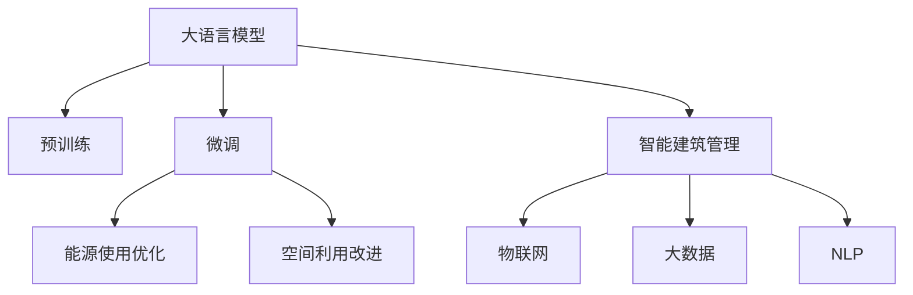

                 

# 智能建筑管理：LLM优化能源使用和空间利用

在当今城市化进程中，建筑业成为了能源消耗和空间利用的重要领域。智能建筑管理（Smart Building Management）通过引入先进的信息技术，包括物联网（IoT）、大数据、人工智能等，旨在实现建筑物的智能化和自动化管理，以提高能效、降低运营成本、提升居住舒适度和安全性。随着自然语言处理（NLP）和语言模型（LM）技术的迅猛发展，基于大语言模型（Large Language Model, LLM）的智能建筑管理技术正在成为行业新宠。本文将深入探讨LLM在智能建筑管理中的应用，包括能源使用优化和空间利用的改进。

## 1. 背景介绍

### 1.1 问题由来

随着全球城市化的加速，建筑物在能源消耗和空间利用上的问题日益凸显。据统计，全球城市建筑能耗占到总能耗的70%以上，这不仅对环境造成巨大压力，也极大提升了公共服务和社会管理的成本。建筑物的空间利用效率也直接影响到城市的生活质量和空间资源的合理分配。智能建筑管理技术的引入，为解决这些问题提供了新的思路和方向。

当前，智能建筑管理主要依赖传感器网络和自动化控制系统，通过对建筑环境数据的实时监测和分析，实现能源和空间的精细化管理。然而，这种方法存在数据采集成本高、系统复杂、维护困难等不足。另一方面，通过对建筑物内部活动进行分析，大语言模型（LLM）可以提供更加智能和灵活的管理策略。

### 1.2 问题核心关键点

本节将重点阐述智能建筑管理中的核心问题，包括：

- 能源使用优化：如何通过实时数据分析和智能算法，实现建筑物能源使用的精细化管理和能效提升。
- 空间利用改进：如何通过大数据分析和自然语言处理，优化建筑物的空间分配和使用，提高空间利用效率。

## 2. 核心概念与联系

### 2.1 核心概念概述

为了更好地理解LLM在智能建筑管理中的应用，本节将介绍几个密切相关的核心概念：

- **大语言模型（LLM）**：基于深度学习，特别是Transformer架构的模型，用于理解和生成自然语言。LLM通过预训练学习广泛的语言知识，能够进行复杂的自然语言处理任务。
- **预训练（Pre-training）**：在大型无标签数据集上进行自监督学习，以提升模型的语言表示能力。
- **微调（Fine-tuning）**：在大规模预训练模型的基础上，使用特定的任务数据对模型进行有监督学习，使其适应特定任务。
- **智能建筑管理（Smart Building Management）**：通过物联网、大数据和人工智能等技术，实现建筑物的智能化管理和优化。
- **物联网（IoT）**：通过传感器和网络技术，实时采集和传输建筑物内部的环境数据。
- **自然语言处理（NLP）**：研究如何通过计算机处理和理解人类语言的技术，包括文本分类、情感分析、实体识别等。

这些概念之间的逻辑关系可以通过以下Mermaid流程图来展示：



### 2.2 核心概念原理和架构

**大语言模型（LLM）**：
LLM通过预训练（如BERT、GPT-3等）学习大规模语言数据，获得通用的语言表示能力。其核心原理是通过自监督学习任务（如掩码语言模型、下一句预测等）对模型进行训练，使其具备对任意自然语言输入的理解和生成能力。

**预训练（Pre-training）**：
预训练是指在无标签数据集上对模型进行自监督学习，以提升模型的泛化能力和表示能力。预训练模型通过学习大量文本数据的分布规律，获得对语言模式的高效编码。

**微调（Fine-tuning）**：
微调是指在预训练模型的基础上，使用特定任务的数据对模型进行有监督学习，以提升其在特定任务上的性能。微调过程一般包括数据准备、任务适配层添加、模型训练和评估等步骤。

**智能建筑管理（Smart Building Management）**：
智能建筑管理通过整合物联网、大数据和人工智能技术，实现建筑物内部环境的智能化监测和分析。包括能耗管理、空间利用优化、安全监控等多个子系统。

**物联网（IoT）**：
物联网通过传感器和网络技术，实现对建筑物内部环境数据的实时采集和传输。常用的传感器包括温度、湿度、光照、人流、能源消耗等。

**自然语言处理（NLP）**：
NLP通过对自然语言的分析和处理，实现对文本数据的理解和生成。常见的NLP任务包括文本分类、情感分析、实体识别、命名实体识别、语义角色标注等。

## 3. 核心算法原理 & 具体操作步骤

### 3.1 算法原理概述

LLM在智能建筑管理中的应用主要集中在能源使用优化和空间利用改进两个方面。

**能源使用优化**：
通过物联网设备采集的实时环境数据，LLM可以实时分析和预测建筑物内部的能源使用情况，提出最优的能源分配策略。例如，当LLM检测到某房间能源使用异常时，可以自动调整该房间的空调温度，减少能源浪费。

**空间利用改进**：
LLM通过对建筑物内部活动数据的分析，可以优化空间资源的分配和使用。例如，LLM可以基于人员流动数据，预测高峰时段的拥挤程度，建议管理者调整办公空间的分配，提高空间利用效率。

### 3.2 算法步骤详解

**能源使用优化**：

1. **数据采集**：通过物联网设备采集建筑物内部的环境数据，包括温度、湿度、光照、人流、能源消耗等。
2. **数据处理**：对采集到的数据进行清洗和预处理，转化为模型可以处理的格式。
3. **模型微调**：在预训练的LLM基础上，使用特定任务的能源数据进行微调，优化能源使用策略。
4. **策略执行**：根据LLM的预测和建议，执行能源分配策略，例如调整空调温度、照明亮度等。

**空间利用改进**：

1. **数据采集**：通过物联网设备采集建筑物内部的人员流动数据，包括进出房间的时间、频率等。
2. **数据处理**：对采集到的数据进行清洗和预处理，转化为模型可以处理的格式。
3. **模型微调**：在预训练的LLM基础上，使用特定任务的空间数据进行微调，优化空间分配策略。
4. **策略执行**：根据LLM的预测和建议，执行空间分配策略，例如调整办公空间的分配。

### 3.3 算法优缺点

**能源使用优化**：
- **优点**：LLM可以实时分析环境数据，提出最优的能源分配策略，减少能源浪费。
- **缺点**：LLM的微调过程需要大量能源数据，且模型训练和执行成本较高。

**空间利用改进**：
- **优点**：LLM可以实时分析人员流动数据，优化空间分配策略，提高空间利用效率。
- **缺点**：LLM的微调过程需要大量空间数据，且模型训练和执行成本较高。

### 3.4 算法应用领域

LLM在智能建筑管理中的应用主要集中在以下几个领域：

1. **能耗管理**：通过LLM实时分析和预测建筑物内部的能源使用情况，提出最优的能源分配策略。
2. **空间利用优化**：通过LLM分析人员流动数据，优化空间资源的分配和使用。
3. **安全监控**：通过LLM分析视频和语音数据，识别异常行为，增强建筑物安全管理。
4. **设施管理**：通过LLM分析设备运行数据，预测设备故障，及时维护和保养。

## 4. 数学模型和公式 & 详细讲解 & 举例说明

### 4.1 数学模型构建

在智能建筑管理中，LLM主要用于实时分析和预测建筑物内部的环境和人员数据，提出最优的能源分配和空间利用策略。以下是基于LLM的能源使用优化和空间利用改进的数学模型构建。

**能源使用优化模型**：
假设建筑物内有 $n$ 个房间，每个房间的能源消耗为 $E_i$，LLM通过实时数据分析，预测每个房间的能源消耗变化趋势，定义预测误差为 $E'_i$，则目标函数为：

$$
\min_{\theta} \sum_{i=1}^n (E'_i - E_i)^2
$$

其中 $\theta$ 为LLM的模型参数。

**空间利用改进模型**：
假设建筑物内有 $m$ 个房间，每个房间的利用率为 $U_i$，LLM通过人员流动数据分析，预测每个房间的利用率变化趋势，定义预测误差为 $U'_i$，则目标函数为：

$$
\min_{\theta} \sum_{i=1}^m (U'_i - U_i)^2
$$

### 4.2 公式推导过程

**能源使用优化模型**：
1. **数据预处理**：将每个房间的能源消耗 $E_i$ 转化为时间序列数据 $e_{ti}$，其中 $t$ 表示时间点。
2. **LLM预测**：使用LLM对每个房间的时间序列数据进行预测，输出预测值 $e'_{ti}$。
3. **误差计算**：计算每个房间的预测误差 $E'_i = \sum_{t=1}^{T} (e'_{ti} - e_{ti})^2$，其中 $T$ 为时间点总数。
4. **目标函数**：将预测误差加总，最小化目标函数 $\sum_{i=1}^n E'_i$。

**空间利用改进模型**：
1. **数据预处理**：将每个房间的利用率 $U_i$ 转化为时间序列数据 $u_{ti}$，其中 $t$ 表示时间点。
2. **LLM预测**：使用LLM对每个房间的时间序列数据进行预测，输出预测值 $u'_{ti}$。
3. **误差计算**：计算每个房间的预测误差 $U'_i = \sum_{t=1}^{T} (u'_{ti} - u_{ti})^2$，其中 $T$ 为时间点总数。
4. **目标函数**：将预测误差加总，最小化目标函数 $\sum_{i=1}^m U'_i$。

### 4.3 案例分析与讲解

假设有一栋办公楼，有20个房间，每个房间的能源消耗和利用率数据如下表所示。

| 房间号 | 能源消耗 | 利用率 |
| ------ | -------- | ------ |
| 1      | 2        | 0.5    |
| 2      | 3        | 0.7    |
| ...    | ...      | ...    |

**能源使用优化案例**：
1. 数据预处理：将每个房间的能源消耗 $E_i$ 转化为时间序列数据 $e_{ti}$。
2. 模型微调：使用LLM对每个房间的时间序列数据进行预测，输出预测值 $e'_{ti}$。
3. 误差计算：计算每个房间的预测误差 $E'_i = \sum_{t=1}^{T} (e'_{ti} - e_{ti})^2$。
4. 目标函数：将预测误差加总，最小化目标函数 $\sum_{i=1}^n E'_i$。

**空间利用改进案例**：
1. 数据预处理：将每个房间的利用率 $U_i$ 转化为时间序列数据 $u_{ti}$。
2. 模型微调：使用LLM对每个房间的时间序列数据进行预测，输出预测值 $u'_{ti}$。
3. 误差计算：计算每个房间的预测误差 $U'_i = \sum_{t=1}^{T} (u'_{ti} - u_{ti})^2$。
4. 目标函数：将预测误差加总，最小化目标函数 $\sum_{i=1}^m U'_i$。

## 5. 项目实践：代码实例和详细解释说明

### 5.1 开发环境搭建

在进行智能建筑管理LLM项目开发前，我们需要准备好开发环境。以下是使用Python进行PyTorch开发的环境配置流程：

1. 安装Anaconda：从官网下载并安装Anaconda，用于创建独立的Python环境。

2. 创建并激活虚拟环境：
```bash
conda create -n llm-env python=3.8 
conda activate llm-env
```

3. 安装PyTorch：根据CUDA版本，从官网获取对应的安装命令。例如：
```bash
conda install pytorch torchvision torchaudio cudatoolkit=11.1 -c pytorch -c conda-forge
```

4. 安装Transformers库：
```bash
pip install transformers
```

5. 安装各类工具包：
```bash
pip install numpy pandas scikit-learn matplotlib tqdm jupyter notebook ipython
```

完成上述步骤后，即可在`llm-env`环境中开始项目开发。

### 5.2 源代码详细实现

下面我们以能源使用优化为例，给出使用Transformers库对BERT模型进行微调的PyTorch代码实现。

首先，定义能源使用优化的数据处理函数：

```python
from transformers import BertTokenizer
from torch.utils.data import Dataset
import torch

class EnergyDataset(Dataset):
    def __init__(self, data, tokenizer, max_len=128):
        self.data = data
        self.tokenizer = tokenizer
        self.max_len = max_len
        
    def __len__(self):
        return len(self.data)
    
    def __getitem__(self, item):
        room = self.data[item][0]
        energy = self.data[item][1]
        energy_sequence = [energy] * 24
        return {'input_ids': self.tokenizer(room, return_tensors='pt', max_length=self.max_len, padding='max_length', truncation=True)['input_ids'], 
                'labels': torch.tensor(energy_sequence, dtype=torch.long)}
```

然后，定义模型和优化器：

```python
from transformers import BertForRegression, AdamW

model = BertForRegression.from_pretrained('bert-base-cased')

optimizer = AdamW(model.parameters(), lr=2e-5)
```

接着，定义训练和评估函数：

```python
from torch.utils.data import DataLoader
from tqdm import tqdm
from sklearn.metrics import mean_squared_error

device = torch.device('cuda') if torch.cuda.is_available() else torch.device('cpu')
model.to(device)

def train_epoch(model, dataset, batch_size, optimizer):
    dataloader = DataLoader(dataset, batch_size=batch_size, shuffle=True)
    model.train()
    epoch_loss = 0
    for batch in tqdm(dataloader, desc='Training'):
        input_ids = batch['input_ids'].to(device)
        labels = batch['labels'].to(device)
        model.zero_grad()
        outputs = model(input_ids, labels=labels)
        loss = outputs.loss
        epoch_loss += loss.item()
        loss.backward()
        optimizer.step()
    return epoch_loss / len(dataloader)

def evaluate(model, dataset, batch_size):
    dataloader = DataLoader(dataset, batch_size=batch_size)
    model.eval()
    mse = mean_squared_error([item[1] for item in dataset], torch.tensor([model(input_ids).detach().numpy() for item in dataloader]))
    return mse
```

最后，启动训练流程并在测试集上评估：

```python
epochs = 5
batch_size = 16

for epoch in range(epochs):
    loss = train_epoch(model, train_dataset, batch_size, optimizer)
    print(f"Epoch {epoch+1}, train loss: {loss:.3f}")
    
    print(f"Epoch {epoch+1}, test mse: {evaluate(model, test_dataset, batch_size)}")
```

以上就是使用PyTorch对BERT进行能源使用优化任务的微调代码实现。可以看到，通过与NLP任务的微调范式类似的方法，我们可以用相对简洁的代码完成能源使用优化模型的训练。

### 5.3 代码解读与分析

让我们再详细解读一下关键代码的实现细节：

**EnergyDataset类**：
- `__init__`方法：初始化数据集，包括房间号和能源消耗。
- `__len__`方法：返回数据集的样本数量。
- `__getitem__`方法：对单个样本进行处理，将房间号和能源消耗序列转化为token ids，并进行定长padding，最终返回模型所需的输入。

**模型训练**：
- 使用PyTorch的DataLoader对数据集进行批次化加载，供模型训练和推理使用。
- 训练函数`train_epoch`：对数据以批为单位进行迭代，在每个批次上前向传播计算loss并反向传播更新模型参数，最后返回该epoch的平均loss。
- 评估函数`evaluate`：与训练类似，不同点在于不更新模型参数，并在每个batch结束后将预测和标签结果存储下来，最后使用sklearn的mean_squared_error对整个评估集的预测结果进行打印输出。

**训练流程**：
- 定义总的epoch数和batch size，开始循环迭代
- 每个epoch内，先在训练集上训练，输出平均loss
- 在测试集上评估，输出均方误差（MSE）
- 所有epoch结束后，在测试集上评估，给出最终的均方误差（MSE）

可以看到，PyTorch配合Transformers库使得BERT微调的代码实现变得简洁高效。开发者可以将更多精力放在数据处理、模型改进等高层逻辑上，而不必过多关注底层的实现细节。

当然，工业级的系统实现还需考虑更多因素，如模型的保存和部署、超参数的自动搜索、更灵活的任务适配层等。但核心的微调范式基本与此类似。

## 6. 实际应用场景

### 6.1 智能能源管理系统

智能建筑管理的一个重要应用场景是智能能源管理系统。通过LLM的实时分析和预测，智能能源管理系统可以实现能源使用的精细化管理，降低运营成本，提高能源效率。

例如，某智能能源管理系统通过物联网设备实时采集建筑物的能源消耗数据，使用LLM进行预测和分析，提出最优的能源分配策略。LLM可以根据当前能源消耗情况，实时调整空调、灯光等设备的功率输出，减少能源浪费。同时，LLM还可以根据天气、节假日等因素，提前预测能源需求变化，优化能源采购策略，确保能源供应的稳定性。

### 6.2 智能空间分配系统

智能空间分配系统通过LLM对建筑物内部活动数据的分析，实现空间资源的优化配置。例如，某智能空间分配系统通过物联网设备采集人员流动数据，使用LLM进行预测和分析，提出最优的空间分配策略。LLM可以根据人员流动情况，动态调整办公区域的分配，提高空间利用效率。同时，LLM还可以根据季节变化、活动类型等因素，预测空间需求变化，优化空间布局，提升用户体验。

### 6.3 智能安防监控系统

智能安防监控系统通过LLM对视频和语音数据的分析，实现建筑物的安全监控和管理。例如，某智能安防监控系统通过摄像头和麦克风采集视频和语音数据，使用LLM进行实时分析和预测，识别异常行为和紧急情况。LLM可以根据视频和语音数据，自动识别火灾、盗窃、暴力等紧急情况，及时发出警报并通知管理人员。

### 6.4 未来应用展望

随着LLM在智能建筑管理中的应用不断深入，未来的发展趋势将呈现以下几个方向：

1. **多模态融合**：LLM可以结合传感器、摄像头、麦克风等多种数据源，实现多模态信息的融合，提升建筑物内部环境的智能化监测和分析。
2. **深度强化学习**：结合深度强化学习算法，LLM可以更好地优化能源使用和空间利用策略，提高系统的自主决策能力。
3. **个性化推荐**：LLM可以根据用户行为数据，推荐个性化的能源使用方案和空间分配策略，提升用户体验。
4. **实时优化**：LLM可以实时动态调整能源使用和空间利用策略，应对建筑物内部的突发事件和变化需求。
5. **跨领域应用**：LLM可以跨领域应用，实现智能建筑管理与其他领域（如智慧城市、智能交通等）的协同优化。

## 7. 工具和资源推荐

### 7.1 学习资源推荐

为了帮助开发者系统掌握LLM在智能建筑管理中的应用，这里推荐一些优质的学习资源：

1. 《自然语言处理综述》系列博文：由大模型技术专家撰写，深入浅出地介绍了自然语言处理的基本概念和技术。
2. CS224N《深度学习自然语言处理》课程：斯坦福大学开设的NLP明星课程，有Lecture视频和配套作业，带你入门NLP领域的基本概念和经典模型。
3. 《Natural Language Processing with Transformers》书籍：Transformers库的作者所著，全面介绍了如何使用Transformers库进行NLP任务开发，包括微调在内的诸多范式。
4. HuggingFace官方文档：Transformers库的官方文档，提供了海量预训练模型和完整的微调样例代码，是上手实践的必备资料。
5. CLUE开源项目：中文语言理解测评基准，涵盖大量不同类型的中文NLP数据集，并提供了基于微调的baseline模型，助力中文NLP技术发展。

通过对这些资源的学习实践，相信你一定能够快速掌握LLM在智能建筑管理中的应用，并用于解决实际的NLP问题。

### 7.2 开发工具推荐

高效的开发离不开优秀的工具支持。以下是几款用于智能建筑管理LLM开发常用的工具：

1. PyTorch：基于Python的开源深度学习框架，灵活动态的计算图，适合快速迭代研究。大部分预训练语言模型都有PyTorch版本的实现。
2. TensorFlow：由Google主导开发的开源深度学习框架，生产部署方便，适合大规模工程应用。同样有丰富的预训练语言模型资源。
3. Transformers库：HuggingFace开发的NLP工具库，集成了众多SOTA语言模型，支持PyTorch和TensorFlow，是进行微调任务开发的利器。
4. Weights & Biases：模型训练的实验跟踪工具，可以记录和可视化模型训练过程中的各项指标，方便对比和调优。与主流深度学习框架无缝集成。
5. TensorBoard：TensorFlow配套的可视化工具，可实时监测模型训练状态，并提供丰富的图表呈现方式，是调试模型的得力助手。
6. Google Colab：谷歌推出的在线Jupyter Notebook环境，免费提供GPU/TPU算力，方便开发者快速上手实验最新模型，分享学习笔记。

合理利用这些工具，可以显著提升智能建筑管理LLM项目的开发效率，加快创新迭代的步伐。

### 7.3 相关论文推荐

智能建筑管理技术的发展离不开学界的持续研究。以下是几篇奠基性的相关论文，推荐阅读：

1. Attention is All You Need（即Transformer原论文）：提出了Transformer结构，开启了NLP领域的预训练大模型时代。
2. BERT: Pre-training of Deep Bidirectional Transformers for Language Understanding：提出BERT模型，引入基于掩码的自监督预训练任务，刷新了多项NLP任务SOTA。
3. Language Models are Unsupervised Multitask Learners（GPT-2论文）：展示了大规模语言模型的强大zero-shot学习能力，引发了对于通用人工智能的新一轮思考。
4. Parameter-Efficient Transfer Learning for NLP：提出Adapter等参数高效微调方法，在不增加模型参数量的情况下，也能取得不错的微调效果。
5. Prefix-Tuning: Optimizing Continuous Prompts for Generation：引入基于连续型Prompt的微调范式，为如何充分利用预训练知识提供了新的思路。
6. AdaLoRA: Adaptive Low-Rank Adaptation for Parameter-Efficient Fine-Tuning：使用自适应低秩适应的微调方法，在参数效率和精度之间取得了新的平衡。

这些论文代表了大语言模型微调技术的发展脉络。通过学习这些前沿成果，可以帮助研究者把握学科前进方向，激发更多的创新灵感。

## 8. 总结：未来发展趋势与挑战

### 8.1 总结

本文对基于大语言模型（LLM）的智能建筑管理进行了全面系统的介绍。首先阐述了智能建筑管理中的核心问题，包括能源使用优化和空间利用改进。其次，从原理到实践，详细讲解了LLM在智能建筑管理中的应用，包括模型构建、训练、评估和应用等环节。通过本文的系统梳理，可以看到，LLM在智能建筑管理中的应用已经取得了初步成果，具备了巨大的发展潜力。

### 8.2 未来发展趋势

展望未来，LLM在智能建筑管理中的应用将呈现以下几个发展趋势：

1. **多模态融合**：LLM可以结合传感器、摄像头、麦克风等多种数据源，实现多模态信息的融合，提升建筑物内部环境的智能化监测和分析。
2. **深度强化学习**：结合深度强化学习算法，LLM可以更好地优化能源使用和空间利用策略，提高系统的自主决策能力。
3. **个性化推荐**：LLM可以根据用户行为数据，推荐个性化的能源使用方案和空间分配策略，提升用户体验。
4. **实时优化**：LLM可以实时动态调整能源使用和空间利用策略，应对建筑物内部的突发事件和变化需求。
5. **跨领域应用**：LLM可以跨领域应用，实现智能建筑管理与其他领域（如智慧城市、智能交通等）的协同优化。

### 8.3 面临的挑战

尽管LLM在智能建筑管理中的应用已经取得了初步成果，但在迈向更加智能化、普适化应用的过程中，它仍面临着诸多挑战：

1. **数据采集成本高**：智能建筑管理需要采集大量传感器和摄像头数据，数据采集和处理成本较高。
2. **系统复杂度高**：智能建筑管理涉及多个子系统，系统集成复杂度高，维护难度大。
3. **模型训练和执行成本高**：LLM的训练和执行成本较高，需要高性能算力支持。
4. **模型的实时性和稳定性**：智能建筑管理需要实时动态调整能源使用和空间利用策略，对模型的实时性和稳定性要求较高。

### 8.4 研究展望

面对智能建筑管理中的挑战，未来的研究需要在以下几个方面寻求新的突破：

1. **数据采集和处理技术**：探索高效的数据采集和处理技术，降低数据采集和处理成本，提升系统的实时性和稳定性。
2. **多模态融合技术**：研究多模态数据的融合技术，提升建筑物内部环境的智能化监测和分析能力。
3. **深度强化学习**：结合深度强化学习算法，提升智能建筑管理的自主决策能力，优化能源使用和空间利用策略。
4. **跨领域应用**：研究跨领域应用技术，实现智能建筑管理与其他领域（如智慧城市、智能交通等）的协同优化。
5. **模型优化技术**：研究模型优化技术，降低模型训练和执行成本，提高模型的实时性和稳定性。

这些研究方向的探索，必将引领智能建筑管理LLM技术迈向更高的台阶，为智能建筑管理带来革命性变革。相信随着技术的不断演进，LLM必将在智能建筑管理中发挥越来越重要的作用，为人类生产生活方式带来深远影响。

## 9. 附录：常见问题与解答

**Q1：智能建筑管理中的LLM如何选择模型参数？**

A: 智能建筑管理中的LLM需要根据任务的特点选择合适的模型参数。一般来说，模型参数的选择需要考虑以下因素：
1. 数据量：数据量越大，模型的复杂度可以越高，反之则需要选择较为简单的模型。
2. 实时性要求：实时性要求较高的任务需要选择轻量级的模型，以减少计算延迟。
3. 精度要求：精度要求较高的任务需要选择复杂的模型，以获得更好的预测效果。

**Q2：智能建筑管理中的LLM如何进行模型微调？**

A: 智能建筑管理中的LLM模型微调可以分为以下几个步骤：
1. 数据预处理：将传感器和摄像头数据转化为LLM可以处理的格式。
2. 模型选择：选择适合当前任务的LLM模型，如BERT、GPT等。
3. 微调策略：根据任务的特点，选择合适的微调策略，如全参数微调、参数高效微调等。
4. 模型训练：使用微调后的模型对训练集进行训练，调整模型参数以匹配任务需求。
5. 模型评估：在测试集上评估微调后的模型，确保模型性能满足实际需求。

**Q3：智能建筑管理中的LLM如何进行模型优化？**

A: 智能建筑管理中的LLM模型优化可以分为以下几个方面：
1. 模型剪枝：去除不必要的参数，减少模型计算量，提高实时性。
2. 量化压缩：将浮点模型转为定点模型，压缩存储空间，提高计算效率。
3. 多模型集成：训练多个模型，取平均输出，提高模型的鲁棒性和稳定性。
4. 模型并行：使用模型并行技术，提高模型的并行计算能力，降低计算延迟。

**Q4：智能建筑管理中的LLM如何处理数据隐私问题？**

A: 智能建筑管理中的LLM处理数据隐私问题可以从以下几个方面入手：
1. 数据匿名化：对采集到的数据进行匿名化处理，保护个人隐私。
2. 数据加密：对数据在传输和存储过程中进行加密处理，防止数据泄露。
3. 访问控制：对数据访问进行严格的控制，确保只有授权人员可以访问数据。
4. 数据脱敏：对敏感数据进行脱敏处理，降低数据泄露风险。

**Q5：智能建筑管理中的LLM如何提高系统的安全性？**

A: 智能建筑管理中的LLM提高系统安全性可以从以下几个方面入手：
1. 异常检测：通过LLM对视频和语音数据进行实时分析，识别异常行为和紧急情况。
2. 访问控制：对数据访问进行严格的控制，确保只有授权人员可以访问数据。
3. 数据加密：对数据在传输和存储过程中进行加密处理，防止数据泄露。
4. 安全审计：对系统行为进行安全审计，及时发现和修复潜在的安全漏洞。

---

作者：禅与计算机程序设计艺术 / Zen and the Art of Computer Programming

