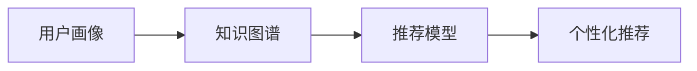

                 

# 智能推荐系统：个性化知识获取的新途径

## 1. 背景介绍

### 1.1 问题由来
在信息化时代，我们被大量的数据所包围，如何高效获取对我们有用的知识，是每个用户都关心的问题。传统的网页搜索结果和广告推荐方式虽然能够提供一定的帮助，但对于大量且复杂的个性化需求，这些方式显得力不从心。智能推荐系统正是解决这一问题的重要技术手段。通过智能化算法，为用户量身定制知识推荐方案，可以显著提升用户获取知识的效率和质量。

智能推荐系统不仅仅是一种算法技术，更是信息技术与业务深度融合的产物。它结合了数据挖掘、机器学习、自然语言处理等多项技术，为用户的知识获取提供了全新的途径。智能推荐系统已经在电商、新闻、社交网络等多个领域得到广泛应用，并且取得了显著的效果。

### 1.2 问题核心关键点
智能推荐系统通过深度学习、数据挖掘和个性化技术，为用户生成个性化的知识推荐。其核心流程包括：

1. **用户行为数据收集**：收集用户在平台上的浏览、点击、购买、搜索等行为数据。
2. **用户画像建模**：使用机器学习算法，对用户的行为数据进行分析，构建用户画像。
3. **知识图谱构建**：使用自然语言处理技术，构建语义丰富的知识图谱。
4. **推荐模型训练**：使用推荐算法，对用户画像和知识图谱进行训练，生成推荐模型。
5. **知识推荐输出**：根据用户画像和推荐模型，生成个性化的知识推荐。

智能推荐系统的关键在于如何更准确地捕捉用户需求，并从海量的知识库中提取对用户有用的信息。通过高效的用户画像建模和推荐模型训练，智能推荐系统能够实现更加精准的知识推荐，提升用户满意度和平台收益。

### 1.3 问题研究意义
研究智能推荐系统对于提升用户体验和推动信息技术的发展具有重要意义：

1. **提升用户体验**：通过个性化推荐，用户能够更快速、便捷地获取到自己感兴趣的知识，极大地提升了知识获取的效率。
2. **推动信息技术的创新**：智能推荐系统是信息技术与业务结合的产物，能够促进新技术的创新和应用，如自然语言处理、深度学习等。
3. **促进数据价值挖掘**：智能推荐系统通过对用户数据的深度挖掘，能够发现潜在的知识需求和信息价值，推动数据的商业应用。
4. **增强平台竞争力**：通过个性化推荐，平台能够更好地满足用户需求，增强平台的市场竞争力。
5. **提升信息安全**：智能推荐系统能够为用户提供更加安全、健康的信息环境，避免恶意信息的传播。

## 2. 核心概念与联系

### 2.1 核心概念概述

智能推荐系统包含多个核心概念，它们之间互相联系，共同构成了推荐系统的知识获取和用户服务框架：

1. **用户画像(User Profiling)**：通过收集和分析用户行为数据，构建用户兴趣、偏好、需求等特征的表示。
2. **知识图谱(Knowledge Graph)**：使用图结构表示知识，包含实体、关系和属性等信息，用于支撑知识推荐。
3. **推荐模型(Recommendation Model)**：通过机器学习算法，对用户画像和知识图谱进行训练，生成能够预测用户兴趣和需求的模型。
4. **个性化推荐(Personalized Recommendation)**：根据用户画像和推荐模型，生成个性化推荐结果。

这些概念之间相互依存，共同驱动智能推荐系统的运行。用户画像和知识图谱是推荐模型的输入，而推荐模型则根据这些输入生成个性化推荐。

### 2.2 核心概念原理和架构的 Mermaid 流程图



这个流程图展示了用户画像、知识图谱、推荐模型和个性化推荐之间的相互关系。用户画像和知识图谱作为输入，被推荐模型所使用，最后生成个性化推荐结果。

## 3. 核心算法原理 & 具体操作步骤
### 3.1 算法原理概述

智能推荐系统通常基于以下几个关键算法：

1. **协同过滤**：通过分析用户的历史行为数据，发现用户之间的相似性，从而进行推荐。
2. **基于内容的推荐**：通过分析用户的历史行为数据，提取用户兴趣和产品/内容特征，进行推荐。
3. **深度学习推荐**：使用深度神经网络模型，对用户画像和知识图谱进行训练，生成推荐模型。
4. **矩阵分解**：使用矩阵分解技术，将用户-物品评分矩阵分解为隐向量表示，用于推荐模型的训练。

这些算法各有优缺点，适用于不同的推荐场景和数据特点。协同过滤适用于用户-物品评分数据不足的情况，基于内容的推荐适用于用户对内容的理解和分析，深度学习推荐能够捕捉更加复杂的用户需求和知识关系，矩阵分解适用于大规模数据的处理。

### 3.2 算法步骤详解

智能推荐系统的核心算法步骤包括：

1. **数据收集**：收集用户行为数据、物品特征数据和知识图谱数据。
2. **用户画像建模**：对用户行为数据进行建模，生成用户画像。
3. **知识图谱构建**：使用自然语言处理技术，构建语义丰富的知识图谱。
4. **推荐模型训练**：使用推荐算法，对用户画像和知识图谱进行训练，生成推荐模型。
5. **推荐结果生成**：根据用户画像和推荐模型，生成个性化推荐结果。

这些步骤中，用户画像和知识图谱的构建是基础，推荐模型的训练是核心，推荐结果的生成是最终目标。

### 3.3 算法优缺点

智能推荐系统具有以下优点：

1. **高效性**：通过自动化算法，能够快速生成个性化推荐，提升知识获取的效率。
2. **精准性**：通过深度学习等技术，能够准确捕捉用户需求，提供精准的推荐。
3. **可扩展性**：推荐系统可以根据用户行为和知识图谱的变化，实时调整推荐模型，具有较好的可扩展性。
4. **个性化**：能够根据用户不同的需求和兴趣，提供个性化的推荐结果。

同时，智能推荐系统也存在一些局限性：

1. **数据依赖**：推荐系统依赖于用户行为数据的准确性和完整性，如果数据不足或存在偏差，将影响推荐效果。
2. **冷启动问题**：新用户或物品可能缺乏历史行为数据，难以进行推荐。
3. **过拟合问题**：推荐模型可能过拟合用户历史数据，导致对新用户或物品的推荐效果不佳。
4. **隐私问题**：用户行为数据涉及隐私，推荐系统需要考虑数据隐私保护。

### 3.4 算法应用领域

智能推荐系统已经在多个领域得到广泛应用，例如：

1. **电商推荐**：为电商用户推荐商品，提高用户购买率和平台收益。
2. **新闻推荐**：为用户推荐新闻文章，提升新闻阅读量和用户粘性。
3. **社交网络**：为社交网络用户推荐好友和内容，增加用户互动和平台活跃度。
4. **视频推荐**：为视频平台用户推荐视频内容，提高用户观看率和平台收益。
5. **教育推荐**：为在线教育平台用户推荐课程和学习资源，提升学习效果和平台收入。

这些应用场景显示了智能推荐系统的广泛影响力和应用前景。

## 4. 数学模型和公式 & 详细讲解 & 举例说明

### 4.1 数学模型构建

智能推荐系统的数学模型通常包括以下几个部分：

1. **用户画像**：使用向量表示用户兴趣和偏好，形式为 $\mathbf{u} = (u_1, u_2, ..., u_n)$。
2. **知识图谱**：使用图结构表示知识，包含实体、关系和属性等信息，形式为 $G=(V,E)$。
3. **推荐模型**：使用深度神经网络等模型，对用户画像和知识图谱进行训练，形式为 $M_{\theta}$。
4. **推荐结果**：使用推荐模型生成推荐结果，形式为 $r_i$。

其中，$u_i$ 表示用户画像中的第 $i$ 个特征，$v_j$ 表示知识图谱中的第 $j$ 个实体，$e_{ij}$ 表示实体 $v_i$ 和 $v_j$ 之间的关系，$\theta$ 表示推荐模型的参数。

### 4.2 公式推导过程

以基于深度学习的推荐模型为例，假设用户画像为 $\mathbf{u}$，知识图谱为 $G$，推荐模型为 $M_{\theta}$。推荐模型的训练公式为：

$$
\min_{\theta} \frac{1}{N} \sum_{i=1}^N \ell(y_i, \hat{y}_i)
$$

其中 $y_i$ 为用户的真实行为数据，$\hat{y}_i$ 为推荐模型生成的预测结果，$\ell$ 为损失函数，$N$ 为数据量。

推荐模型的预测公式为：

$$
\hat{y}_i = M_{\theta}(\mathbf{u}, G)
$$

其中 $M_{\theta}(\cdot)$ 为推荐模型的输出函数。

### 4.3 案例分析与讲解

以电商推荐为例，假设用户画像为 $\mathbf{u}$，知识图谱为 $G$，推荐模型为 $M_{\theta}$。电商推荐系统的目标是为用户推荐商品，预测用户对商品的评分 $r_i$。推荐模型的训练过程如下：

1. 数据收集：收集用户的历史行为数据 $D=\{(x_i, y_i)\}_{i=1}^N$，其中 $x_i$ 为用户的浏览、点击、购买等行为，$y_i$ 为用户的评分。
2. 用户画像建模：对用户行为数据进行建模，生成用户画像 $\mathbf{u}$。
3. 知识图谱构建：使用自然语言处理技术，构建语义丰富的知识图谱 $G$。
4. 推荐模型训练：使用深度神经网络模型 $M_{\theta}$ 对用户画像和知识图谱进行训练。
5. 推荐结果生成：根据用户画像和推荐模型，生成个性化推荐结果 $r_i$。

以深度神经网络模型为例，其训练过程如下：

1. 输入数据预处理：将用户行为数据 $D$ 转化为模型可以处理的格式，形式为 $X=\{x_1, x_2, ..., x_N\}$。
2. 用户画像嵌入：将用户画像 $\mathbf{u}$ 转化为向量表示，形式为 $\mathbf{u}=\{u_1, u_2, ..., u_n\}$。
3. 知识图谱嵌入：将知识图谱 $G$ 转化为向量表示，形式为 $\mathbf{v}=\{v_1, v_2, ..., v_m\}$。
4. 推荐模型训练：使用神经网络模型 $M_{\theta}$ 对用户画像 $\mathbf{u}$ 和知识图谱 $\mathbf{v}$ 进行训练，生成推荐模型 $M_{\theta}$。
5. 推荐结果生成：根据用户画像 $\mathbf{u}$ 和推荐模型 $M_{\theta}$，生成个性化推荐结果 $r_i$。

## 5. 项目实践：代码实例和详细解释说明

### 5.1 开发环境搭建

在进行智能推荐系统的开发实践前，我们需要准备好开发环境。以下是使用Python进行TensorFlow开发的环境配置流程：

1. 安装Anaconda：从官网下载并安装Anaconda，用于创建独立的Python环境。

2. 创建并激活虚拟环境：
```bash
conda create -n tf-env python=3.8 
conda activate tf-env
```

3. 安装TensorFlow：根据CUDA版本，从官网获取对应的安装命令。例如：
```bash
pip install tensorflow==2.7
```

4. 安装各类工具包：
```bash
pip install numpy pandas scikit-learn matplotlib tqdm jupyter notebook ipython
```

完成上述步骤后，即可在`tf-env`环境中开始推荐系统的开发。

### 5.2 源代码详细实现

这里我们以电商推荐系统为例，给出使用TensorFlow进行推荐模型开发的PyTorch代码实现。

首先，定义电商推荐系统的数据处理函数：

```python
import tensorflow as tf
import pandas as pd

# 加载电商数据集
df = pd.read_csv('sales_data.csv')

# 数据预处理
df = df.dropna()
df = df.groupby('user_id').agg({'item_id': 'first', 'rating': 'mean'}).reset_index()

# 特征工程
df['item_category'] = df['item_id'].apply(lambda x: 'item_' + str(x))
df = df.pivot_table(index='user_id', columns='item_category', values='rating').reset_index()

# 构建训练集和测试集
train_data = df[df['user_id'] < 0.8].copy()
test_data = df[df['user_id'] >= 0.8].copy()

# 构建用户画像和物品特征
user_profiles = train_data[['user_id', 'item_category']].groupby('user_id').mean()
item_features = train_data.groupby('item_category').mean()

# 定义特征向量和标签
train_features = pd.get_dummies(user_profiles, prefix='user').join(pd.get_dummies(item_features, prefix='item'), rsuffix='_feature')
train_labels = train_data['rating'].to_numpy()

# 将数据转化为TensorFlow的张量格式
train_features = train_features.to_numpy()
train_labels = train_labels.reshape(-1, 1)
```

然后，定义推荐模型的神经网络：

```python
from tensorflow.keras.layers import Input, Dense, Embedding, Dropout, concatenate
from tensorflow.keras.models import Model

# 定义输入层
user_input = Input(shape=(len(user_profiles),))
item_input = Input(shape=(len(item_features),))

# 定义用户画像和物品特征的嵌入层
user_embeddings = Embedding(input_dim=len(user_profiles), output_dim=100, mask_zero=True)(user_input)
item_embeddings = Embedding(input_dim=len(item_features), output_dim=100, mask_zero=True)(item_input)

# 定义深度神经网络层
user_feature = Dense(100, activation='relu')(user_embeddings)
item_feature = Dense(100, activation='relu')(item_embeddings)

# 定义用户画像和物品特征的拼接层
concatenated = concatenate([user_feature, item_feature])

# 定义全连接层和输出层
dense_layer = Dense(100, activation='relu')(concatenated)
output_layer = Dense(1, activation='sigmoid')(dense_layer)

# 定义模型
model = Model(inputs=[user_input, item_input], outputs=output_layer)
```

接着，定义模型的损失函数和优化器：

```python
# 定义损失函数
loss_fn = tf.keras.losses.BinaryCrossentropy()

# 定义优化器
optimizer = tf.keras.optimizers.Adam(learning_rate=0.001)
```

最后，启动模型训练和测试：

```python
# 定义训练集和测试集
train_dataset = tf.data.Dataset.from_tensor_slices((train_features, train_labels))
test_dataset = tf.data.Dataset.from_tensor_slices((test_features, test_labels))

# 定义批量大小和迭代次数
batch_size = 64
epochs = 10

# 定义训练函数
def train_step(x, y):
    with tf.GradientTape() as tape:
        predictions = model(x)
        loss = loss_fn(y, predictions)
    gradients = tape.gradient(loss, model.trainable_variables)
    optimizer.apply_gradients(zip(gradients, model.trainable_variables))

# 定义测试函数
def test_step(x, y):
    predictions = model(x)
    return predictions

# 训练模型
model.compile(optimizer=optimizer, loss=loss_fn, metrics=['mae'])
model.fit(train_dataset, epochs=epochs, batch_size=batch_size, validation_data=test_dataset)

# 测试模型
test_predictions = test_step(test_features, test_labels)
```

以上就是使用TensorFlow进行电商推荐系统开发的完整代码实现。可以看到，TensorFlow提供的高级API使得模型定义、训练和测试变得简洁高效。

### 5.3 代码解读与分析

让我们再详细解读一下关键代码的实现细节：

**数据处理函数**：
- 加载电商数据集，并进行数据清洗、预处理和特征工程。
- 将用户行为数据转化为模型可以处理的格式，并构建用户画像和物品特征。
- 定义特征向量和标签，将数据转化为TensorFlow的张量格式。

**神经网络定义**：
- 定义输入层、用户画像嵌入层、物品特征嵌入层、深度神经网络层、拼接层、全连接层和输出层。
- 使用Embedding层将用户画像和物品特征转化为向量表示。
- 使用Dense层构建深度神经网络。
- 使用concatenate函数将用户画像和物品特征拼接。
- 定义全连接层和输出层，使用Dense层和sigmoid激活函数。

**模型训练和测试**：
- 定义训练集和测试集，使用tf.data.Dataset从张量中生成数据集。
- 定义批量大小和迭代次数，使用Model编译器配置模型。
- 定义训练函数，使用tf.GradientTape计算梯度，并使用Adam优化器更新模型参数。
- 定义测试函数，计算模型的预测结果和损失。
- 使用fit函数训练模型，使用test函数测试模型。

## 6. 实际应用场景

### 6.1 电商推荐

在电商推荐系统中，智能推荐系统能够根据用户的浏览、点击、购买等行为数据，为用户推荐个性化的商品。通过分析用户的历史行为数据，构建用户画像，结合商品属性和用户画像，生成推荐模型，实现精准的电商推荐。

在实际应用中，电商平台通常会使用基于协同过滤和深度学习的推荐方法。协同过滤方法能够捕捉用户之间的相似性，推荐相似用户的偏好商品；深度学习方法能够学习更加复杂的用户需求和商品特征，提供更加精准的推荐。

### 6.2 新闻推荐

新闻推荐系统根据用户的历史阅读行为，为用户推荐感兴趣的新闻文章。通过分析用户的历史阅读数据，构建用户画像，结合文章属性和用户画像，生成推荐模型，实现精准的新闻推荐。

在实际应用中，新闻推荐系统通常会使用基于内容的推荐和深度学习的推荐方法。基于内容的推荐方法能够根据用户的历史阅读数据，推荐相似的文章；深度学习方法能够学习更加复杂的用户需求和文章特征，提供更加精准的推荐。

### 6.3 社交网络推荐

社交网络推荐系统根据用户的历史互动数据，为用户推荐感兴趣的好友和内容。通过分析用户的历史互动数据，构建用户画像，结合好友和内容的属性和用户画像，生成推荐模型，实现精准的社交网络推荐。

在实际应用中，社交网络推荐系统通常会使用基于协同过滤和深度学习的推荐方法。协同过滤方法能够捕捉用户和好友之间的相似性，推荐相似好友的内容；深度学习方法能够学习更加复杂的用户需求和内容特征，提供更加精准的推荐。

## 7. 工具和资源推荐

### 7.1 学习资源推荐

为了帮助开发者系统掌握智能推荐系统的理论基础和实践技巧，这里推荐一些优质的学习资源：

1. 《推荐系统实战》书籍：由深度学习专家撰写，深入浅出地介绍了推荐系统的原理和实现方法，适合入门学习。

2. CS455《推荐系统》课程：斯坦福大学开设的推荐系统课程，涵盖推荐系统的理论和算法，适合系统学习。

3. 《TensorFlow实战》书籍：TensorFlow官方文档，详细介绍TensorFlow的使用方法，适合深度学习应用开发。

4. Kaggle推荐系统竞赛：Kaggle提供的推荐系统竞赛，通过实际比赛练习推荐算法，适合实战练习。

5. RecSys会议论文：每年一次的推荐系统顶级会议，收录了大量前沿研究成果，适合深度学习研究。

通过对这些资源的学习实践，相信你一定能够快速掌握智能推荐系统的精髓，并用于解决实际的推荐问题。

### 7.2 开发工具推荐

高效的开发离不开优秀的工具支持。以下是几款用于智能推荐系统开发的常用工具：

1. TensorFlow：由Google主导开发的开源深度学习框架，适合大规模工程应用。

2. PyTorch：基于Python的开源深度学习框架，灵活高效，适合快速迭代研究。

3. Apache Spark：分布式计算框架，适合大规模数据处理和模型训练。

4. Scikit-learn：Python数据科学库，提供了多种机器学习算法和工具，适合特征工程和模型训练。

5. Hadoop：分布式计算平台，适合大规模数据存储和处理。

合理利用这些工具，可以显著提升智能推荐系统的开发效率，加快创新迭代的步伐。

### 7.3 相关论文推荐

智能推荐系统的发展离不开学界的持续研究。以下是几篇奠基性的相关论文，推荐阅读：

1. A Survey of Recommendation Systems（推荐系统综述）：综述了推荐系统的多种算法和应用，适合系统学习。

2. Implicit Feature Dimensionality Reduction: A Survey（隐式特征降维综述）：综述了隐式特征降维的多种方法，适合深度学习研究。

3. Deep Learning for Recommender Systems（深度学习推荐系统）：综述了深度学习在推荐系统中的应用，适合深度学习研究。

4. Context-aware Recommendation Models（上下文感知的推荐模型）：介绍多种上下文感知的推荐模型，适合推荐系统应用开发。

5. Adversarial Recommendation Models（对抗性推荐模型）：介绍多种对抗性推荐模型，适合推荐系统安全研究。

这些论文代表了大推荐系统的发展脉络。通过学习这些前沿成果，可以帮助研究者把握学科前进方向，激发更多的创新灵感。

## 8. 总结：未来发展趋势与挑战

### 8.1 总结

本文对智能推荐系统进行了全面系统的介绍。首先阐述了智能推荐系统在提升用户体验和推动信息技术发展中的重要意义，明确了推荐系统在用户画像建模、知识图谱构建、推荐模型训练和个性化推荐等关键步骤中的核心作用。通过详细的数学模型构建和案例分析，展示了智能推荐系统的基本原理和算法实现。通过具体的代码实例和详细解释说明，提供了智能推荐系统的实践方法。最后，通过广泛的实际应用场景和未来发展趋势，展示了智能推荐系统的广泛应用前景。

通过本文的系统梳理，可以看到，智能推荐系统在电商、新闻、社交网络等多个领域取得了显著的效果，成为信息技术与业务结合的重要手段。智能推荐系统的发展方向包括：个性化推荐、协同过滤、基于内容的推荐、深度学习推荐等。这些方向展示了智能推荐系统在数据挖掘、机器学习、自然语言处理等方面的发展潜力，为推荐系统技术的应用提供了更多可能性。

### 8.2 未来发展趋势

展望未来，智能推荐系统的发展趋势包括：

1. **个性化推荐**：随着数据量的增加和算法模型的提升，推荐系统能够更加精准地捕捉用户需求，提供个性化的推荐结果。

2. **协同过滤**：协同过滤方法能够捕捉用户之间的相似性，推荐相似用户的偏好，成为推荐系统的重要组成部分。

3. **基于内容的推荐**：基于内容的推荐方法能够根据用户的历史行为数据，推荐相似的文章、商品等，成为推荐系统的关键手段。

4. **深度学习推荐**：深度学习方法能够学习更加复杂的用户需求和知识关系，提供更加精准的推荐结果。

5. **知识图谱构建**：知识图谱能够提供更加丰富、精细的知识结构，提升推荐系统的效果。

6. **多模态推荐**：多模态推荐能够结合文本、图像、音频等多模态数据，提升推荐系统的表现。

以上趋势展示了智能推荐系统在多个领域的应用前景，相信随着技术的不断发展，推荐系统将能够更好地满足用户需求，提升信息获取的效率和质量。

### 8.3 面临的挑战

尽管智能推荐系统已经取得了显著的效果，但在其发展过程中，仍面临诸多挑战：

1. **数据质量**：推荐系统依赖于高质量的用户行为数据，如果数据存在偏差或缺失，将影响推荐效果。

2. **冷启动问题**：新用户或物品可能缺乏历史行为数据，难以进行推荐。

3. **隐私问题**：用户行为数据涉及隐私，推荐系统需要考虑数据隐私保护。

4. **计算资源**：推荐系统需要大量的计算资源，模型训练和推理过程需要高效的硬件支持。

5. **实时性**：推荐系统需要实时响应用户请求，对计算效率和实时性要求较高。

6. **可解释性**：推荐系统往往被认为是"黑盒"系统，缺乏可解释性，难以进行调试和优化。

这些挑战需要在未来的研究中加以解决，以进一步提升智能推荐系统的性能和应用范围。

### 8.4 研究展望

面对智能推荐系统所面临的挑战，未来的研究需要在以下几个方面寻求新的突破：

1. **数据预处理**：研究高效的数据预处理技术，提升数据质量，减少数据偏差和缺失。

2. **模型优化**：研究高效的模型优化技术，提升推荐系统的计算效率和实时性。

3. **隐私保护**：研究数据隐私保护技术，确保用户数据的隐私和安全。

4. **多模态融合**：研究多模态数据融合技术，提升推荐系统的表现和泛化能力。

5. **模型解释**：研究推荐系统的可解释性技术，提升模型的透明性和可解释性。

6. **跨领域应用**：研究推荐系统在更多领域的应用，如金融、医疗、教育等。

这些研究方向的探索，将推动智能推荐系统的不断发展，为推荐系统技术的应用提供更多可能性。相信随着技术的不断发展，智能推荐系统将能够更好地满足用户需求，提升信息获取的效率和质量。

## 9. 附录：常见问题与解答

**Q1：智能推荐系统是否适用于所有推荐场景？**

A: 智能推荐系统适用于大多数推荐场景，特别是对于数据量较大的场景，能够提供精准的推荐结果。但对于一些特定场景，如金融、医疗等，需要进一步结合领域知识，进行有针对性的推荐。

**Q2：如何选择推荐算法？**

A: 推荐算法的选择需要考虑多个因素，如数据量、用户行为特征、物品属性、推荐场景等。常见的推荐算法包括协同过滤、基于内容的推荐、深度学习推荐等，具体选择需根据场景需求进行评估。

**Q3：推荐系统如何处理冷启动问题？**

A: 冷启动问题是推荐系统的一个重要挑战。常见的处理方式包括：
1. 基于内容的推荐：根据物品属性和用户画像，推荐相似的物品。
2. 利用用户反馈：通过用户反馈数据进行推荐，如评分、点击等。
3. 利用先验知识：结合领域知识，进行推荐，如专家推荐、基于规则推荐等。

**Q4：推荐系统如何保护用户隐私？**

A: 推荐系统需要考虑用户隐私保护，常见的隐私保护技术包括：
1. 数据匿名化：将用户数据进行匿名化处理，保护用户隐私。
2. 差分隐私：在推荐模型训练过程中，加入噪声，保护用户隐私。
3. 数据加密：对用户数据进行加密处理，保护用户隐私。

**Q5：推荐系统如何提升推荐效果？**

A: 推荐系统可以通过以下方式提升推荐效果：
1. 数据质量提升：提高数据收集和处理的效率和准确性。
2. 算法优化：选择和优化推荐算法，提升模型的表现。
3. 特征工程：设计更加有效的特征表示，提升模型的效果。
4. 模型训练：使用大规模数据和先进的模型训练技术，提升模型的性能。

这些方法需要结合具体场景和数据特点进行灵活应用，以提升推荐系统的效果。

总之，智能推荐系统通过深度学习、数据挖掘和个性化技术，为用户生成个性化的推荐结果。智能推荐系统的未来发展方向包括个性化推荐、协同过滤、基于内容的推荐、深度学习推荐等。这些方向的探索和发展，将进一步提升推荐系统的性能和应用范围，为推荐系统技术的应用提供更多可能性。面向未来，推荐系统需要在数据质量、冷启动、隐私保护、计算资源、实时性、可解释性等方面进行不断优化，以推动推荐系统技术的进一步发展。

