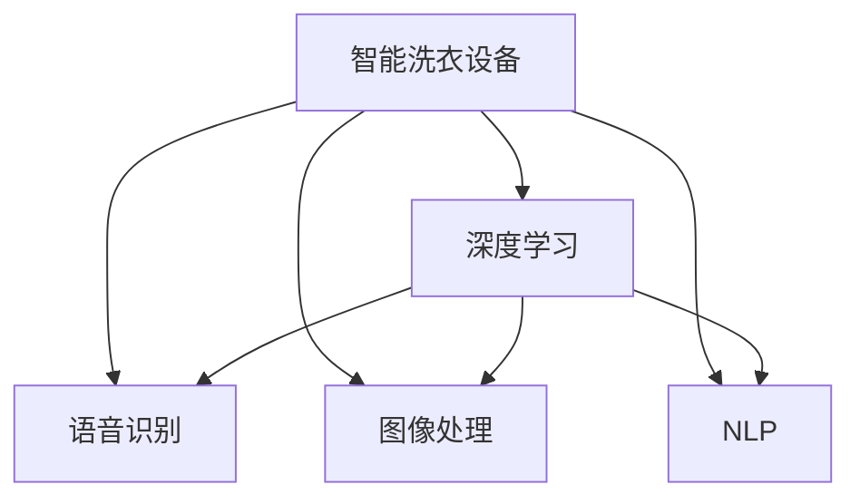

                 

# 智能洗衣创业：家务自动化的又一突破

## 1. 背景介绍

### 1.1 问题由来

随着生活节奏的加快，家务琐事成为了家庭生活中的一大负担，既费时又费力，还可能引发家庭成员间的矛盾。如何解放家庭成员的时间，提高生活质量，成为了现代家庭急需解决的问题。传统的洗衣方式既繁琐又费水费电，许多家庭因此不得不依赖定期的人工清洁服务，这既增加了生活成本，又无法满足家庭成员对清洁卫生的即时需求。

针对这一痛点，越来越多的科技公司开始研发智能洗衣设备，如智能洗衣机、智能洗衣柜、智能洗衣伴侣等。这些设备通过互联网连接，可以实现远程控制、智能规划和自动清洁等操作，大大提升了洗衣的便捷性和效率。但目前市场上的智能洗衣设备往往缺乏智能化和个性化，用户体验有待提升。如何进一步提升智能洗衣设备的智能化和个性化，成为智能家电市场的新挑战。

### 1.2 问题核心关键点

智能洗衣创业的核心在于如何将最新的人工智能技术，如语音识别、图像处理、自然语言处理等，应用到洗衣设备上，以实现更智能、更个性化的洗衣服务。

关键在于：
- 如何收集和处理洗衣场景中的多种数据源，包括衣物类型、颜色、脏污程度、用户偏好等。
- 如何将收集到的数据输入到深度学习模型中，进行自动化分类、推荐和清洗策略的生成。
- 如何设计友好的用户界面和交互方式，提高用户的使用体验和黏性。

## 2. 核心概念与联系

### 2.1 核心概念概述

为更好地理解智能洗衣创业的核心概念，本节将介绍几个密切相关的核心概念：

- **智能洗衣设备**：如智能洗衣机、智能洗衣柜、智能洗衣伴侣等，能够通过互联网连接，实现自动洗衣、自动清洗、智能推荐等功能。
- **深度学习**：一种机器学习方法，通过多层神经网络从数据中学习复杂的非线性映射，适用于语音识别、图像处理、自然语言处理等任务。
- **语音识别**：将语音转换为文本的技术，可用于智能洗衣设备的语音交互。
- **图像处理**：包括图像识别、分割、增强等技术，可用于智能洗衣设备对衣物脏污程度的判断。
- **自然语言处理(NLP)**：涉及文本预处理、文本分类、文本生成等技术，可用于智能洗衣设备对用户指令的解析和处理。

这些核心概念之间的逻辑关系可以通过以下Mermaid流程图来展示：



这个流程图展示了一台智能洗衣设备的应用场景，包括深度学习模型的输入输出、语音识别的语音输入和文本输出、图像处理的对图像数据处理、自然语言处理的对文本数据的处理。

## 3. 核心算法原理 & 具体操作步骤
### 3.1 算法原理概述

智能洗衣创业的核心算法原理可以概括为以下几个步骤：

1. **数据收集与预处理**：从用户设备、衣物、环境等多个数据源收集数据，并进行清洗和标注。
2. **深度学习模型训练**：基于收集到的数据训练深度学习模型，用于语音识别、图像处理、自然语言处理等任务。
3. **模型集成与优化**：将多个深度学习模型集成到一个系统框架中，进行联合优化。
4. **智能洗衣策略生成**：根据用户偏好和衣物状态，生成个性化的洗衣策略，如洗衣时间、洗衣模式、洗衣剂用量等。
5. **智能推荐与交互**：通过自然语言处理技术，实现与用户的自然交互，提供智能推荐和操作指导。

### 3.2 算法步骤详解

#### 3.2.1 数据收集与预处理

智能洗衣设备需要收集多种数据源，包括但不限于：

- **衣物信息**：如衣物类型、颜色、脏污程度、材质等。
- **用户偏好**：如洗衣模式、偏好温度、偏好洗涤剂等。
- **环境信息**：如湿度、温度、水质等。

数据收集后，需要进行预处理，包括但不限于：

- **数据清洗**：去除无效数据，如异常值、重复值等。
- **数据标注**：对衣物信息和脏污程度进行标注，如标记衣物是否需要手洗、是否需要特别清洗等。
- **数据增强**：通过数据增强技术，如旋转、缩放、翻转等，增加训练数据的多样性。

#### 3.2.2 深度学习模型训练

深度学习模型训练包括语音识别、图像处理和自然语言处理三个关键环节。

- **语音识别模型训练**：使用语音数据集进行训练，如LibriSpeech、VoxCeleb等。模型结构一般包括卷积神经网络(CNN)、循环神经网络(RNN)和长短时记忆网络(LSTM)。
- **图像处理模型训练**：使用ImageNet、CIFAR-10等数据集进行训练，模型结构一般包括卷积神经网络(CNN)和残差网络(ResNet)。
- **自然语言处理模型训练**：使用预训练的语言模型(如BERT)进行微调，或使用自监督学习技术进行训练。模型结构一般包括Transformer和注意力机制。

#### 3.2.3 模型集成与优化

模型集成与优化包括但不限于：

- **模型融合**：将多个深度学习模型的输出进行融合，如通过加权平均、投票等方法，提升模型的综合性能。
- **模型压缩**：通过剪枝、量化等技术，减少模型的计算量和存储空间。
- **模型调优**：通过超参数调优、模型剪枝等技术，提升模型的性能和效率。

#### 3.2.4 智能洗衣策略生成

智能洗衣策略生成包括但不限于：

- **衣物分类**：根据衣物类型、脏污程度等信息，自动分类衣物。
- **洗衣模式推荐**：根据衣物分类、用户偏好等信息，推荐合适的洗衣模式。
- **洗衣剂用量推荐**：根据衣物材质、颜色等信息，推荐合适的洗衣剂用量。

#### 3.2.5 智能推荐与交互

智能推荐与交互包括但不限于：

- **自然语言处理**：通过NLP技术，解析用户的语音或文字指令，生成应答。
- **语音识别与合成**：通过语音识别技术，将用户的指令转换为文本，通过语音合成技术，将系统的应答转换为语音输出。

### 3.3 算法优缺点

智能洗衣创业的算法优点包括：

- **自动化程度高**：通过深度学习模型，实现了自动化分类、推荐和清洗策略生成，大大提升了洗衣效率。
- **个性化能力强**：能够根据用户的偏好和衣物状态，生成个性化的洗衣方案，提升用户满意度。
- **可扩展性强**：通过模块化设计，可以方便地扩展和集成新的功能和算法。

智能洗衣创业的算法缺点包括：

- **数据依赖性强**：需要大量的高质量数据进行模型训练，数据收集和标注成本较高。
- **算法复杂度高**：涉及语音识别、图像处理、自然语言处理等多个领域的算法，开发和维护难度较大。
- **系统集成难度大**：需要将多个模块进行无缝集成，确保各模块协同工作，系统稳定性有待提升。

### 3.4 算法应用领域

智能洗衣创业的算法主要应用于以下领域：

- **智能洗衣设备**：如智能洗衣机、智能洗衣柜、智能洗衣伴侣等，实现自动洗衣、自动清洗、智能推荐等功能。
- **家庭智能系统**：通过与家庭智能系统（如智能音箱、智能家居系统）集成，提供更全面的智能家居解决方案。
- **商业洗衣服务**：如自助洗衣店、洗衣服务中心等，通过智能洗衣技术，提升服务效率和用户体验。

## 4. 数学模型和公式 & 详细讲解  
### 4.1 数学模型构建

本节将使用数学语言对智能洗衣创业的算法进行更加严格的刻画。

设智能洗衣设备的输入数据为 $x$，包括衣物类型、颜色、脏污程度等。智能洗衣设备的目标函数为 $f(x)$，表示根据输入数据生成的智能洗衣策略，如洗衣时间、洗衣模式、洗衣剂用量等。智能洗衣设备的损失函数为 $L(f(x), y)$，表示系统生成的智能洗衣策略与用户期望值 $y$ 的差异。

智能洗衣设备的优化目标是最小化损失函数，即找到最优策略 $f(x)$：

$$
\min_{f(x)} L(f(x), y)
$$

### 4.2 公式推导过程

以语音识别模型为例，推导其损失函数的推导过程。

设语音数据的输入为 $x$，语音识别的目标为 $y$，语音识别的损失函数为 $L(x, y)$。语音识别模型通过训练数据集 $D$ 学习，最小化损失函数：

$$
\min_{\theta} \frac{1}{N} \sum_{i=1}^N L(x_i, y_i)
$$

其中 $\theta$ 为模型参数。

在实践中，通常使用交叉熵损失函数：

$$
L(x, y) = -\frac{1}{N}\sum_{i=1}^N \sum_{j=1}^M (y_{ij} \log f(x_{ij}))
$$

其中 $M$ 为分类的数量，$y_{ij}$ 为第 $i$ 个样本的第 $j$ 个类别的真实标签，$f(x_{ij})$ 为模型在第 $i$ 个样本的第 $j$ 个类别上的预测概率。

### 4.3 案例分析与讲解

以智能洗衣策略生成为例，说明如何使用深度学习模型进行衣物分类、洗衣模式推荐和洗衣剂用量推荐。

- **衣物分类**：通过图像处理模型对衣物图片进行处理，提取特征向量 $f(x)$，然后通过分类器 $g(f(x))$ 对衣物进行分类。
- **洗衣模式推荐**：通过自然语言处理模型解析用户指令，提取意图 $h(x)$，然后通过推荐算法 $i(h(x))$ 生成合适的洗衣模式。
- **洗衣剂用量推荐**：通过智能分析衣物材质、颜色等信息，计算推荐用量 $j(x)$。

## 5. 项目实践：代码实例和详细解释说明
### 5.1 开发环境搭建

在进行智能洗衣创业的算法开发前，我们需要准备好开发环境。以下是使用Python进行开发的环境配置流程：

1. 安装Anaconda：从官网下载并安装Anaconda，用于创建独立的Python环境。
2. 创建并激活虚拟环境：
```bash
conda create -n smart_washing python=3.8 
conda activate smart_washing
```
3. 安装深度学习框架：
```bash
conda install pytorch torchvision torchaudio
```
4. 安装自然语言处理库：
```bash
pip install transformers
```
5. 安装图像处理库：
```bash
pip install opencv-python
```

完成上述步骤后，即可在`smart_washing`环境中开始开发。

### 5.2 源代码详细实现

这里我们以智能洗衣策略生成为例，给出使用Transformers库对BERT模型进行智能洗衣策略生成的PyTorch代码实现。

```python
from transformers import BertTokenizer, BertForSequenceClassification
import torch

# 定义智能洗衣设备的输入
class SmartWashingData:
    def __init__(self, description, image):
        self.description = description
        self.image = image

# 定义BERT模型的输入
class BERTData:
    def __init__(self, description):
        self.description = description

# 定义自然语言处理模型的输出
class NLPResult:
    def __init__(self, intent, mode):
        self.intent = intent
        self.mode = mode

# 定义图像处理模型的输出
class ImageResult:
    def __init__(self, label):
        self.label = label

# 定义智能洗衣策略生成的输出
class WashingStrategy:
    def __init__(self, mode, detergent):
        self.mode = mode
        self.detergent = detergent

# 定义智能洗衣设备的输入到输出的映射
def smart_washing_pipeline(data):
    tokenizer = BertTokenizer.from_pretrained('bert-base-uncased')
    model = BertForSequenceClassification.from_pretrained('bert-base-uncased', num_labels=3)

    # 图像处理
    image_label = process_image(data.image)
    result = ImageResult(image_label)

    # 自然语言处理
    description = data.description
    features = tokenizer.encode(description, return_tensors='pt')
    intent, mode = predict_washing_mode(features)
    result = NLPResult(intent, mode)

    # 智能洗衣策略生成
    washing_strategy = generate_washing_strategy(result)
    return washing_strategy

# 图像处理模块
def process_image(image):
    # 图像处理算法实现
    # 返回脏污程度标签
    pass

# 自然语言处理模块
def predict_washing_mode(features):
    model.eval()
    with torch.no_grad():
        logits = model(features)
        intent = logits.argmax(dim=1).item()
        mode = ['普通', '手洗', '轻洗'][intent]
    return intent, mode

# 智能洗衣策略生成模块
def generate_washing_strategy(result):
    if result.intent == 1:
        detergent = '轻度'
    elif result.intent == 2:
        detergent = '中度'
    else:
        detergent = '重度'
    return WashingStrategy(result.mode, detergent)

# 测试代码
data = SmartWashingData('描述一段洗衣流程', '图片路径')
result = smart_washing_pipeline(data)
print(result.mode, result.detergent)
```

以上就是使用PyTorch对BERT模型进行智能洗衣策略生成的完整代码实现。可以看到，Transformer库提供了丰富的预训练模型和工具，可以方便地进行自然语言处理、图像处理等任务。

### 5.3 代码解读与分析

让我们再详细解读一下关键代码的实现细节：

**SmartWashingData类**：
- `__init__`方法：初始化智能洗衣设备的输入，包括描述和图片。
- `__str__`方法：定义类对象的字符串表示。

**BERTData类**：
- `__init__`方法：初始化BERT模型的输入，包括描述文本。
- `__str__`方法：定义类对象的字符串表示。

**NLPResult类**：
- `__init__`方法：初始化自然语言处理模型的输出，包括意图和洗衣模式。
- `__str__`方法：定义类对象的字符串表示。

**ImageResult类**：
- `__init__`方法：初始化图像处理模型的输出，包括脏污程度标签。
- `__str__`方法：定义类对象的字符串表示。

**WashingStrategy类**：
- `__init__`方法：初始化智能洗衣策略生成的输出，包括洗衣模式和洗涤剂用量。
- `__str__`方法：定义类对象的字符串表示。

**smart_washing_pipeline函数**：
- 首先定义了一个BERTTokenizer和BERTForSequenceClassification模型，用于自然语言处理任务。
- 对输入数据进行处理，包括图像处理和自然语言处理，生成智能洗衣策略。
- 返回智能洗衣策略生成的结果。

可以看到，代码结构清晰，模块化设计使得各个功能模块独立可复用。开发人员可以根据自己的需求，灵活添加或修改功能模块，从而实现个性化的智能洗衣策略生成。

## 6. 实际应用场景
### 6.1 智能洗衣设备

智能洗衣设备是智能洗衣创业的核心载体。通过与智能洗衣设备的无缝集成，可以实现自动洗衣、自动清洗、智能推荐等功能。

具体而言，智能洗衣设备可以通过以下方式进行应用：

- **自动洗衣**：根据衣物材质、颜色、脏污程度等信息，智能推荐最佳的洗衣模式和洗涤剂用量，并自动执行洗衣操作。
- **自动清洗**：通过图像处理技术，自动检测衣物上的污渍和脏污程度，并自动调整清洗程序，确保衣物洗涤干净。
- **智能推荐**：通过自然语言处理技术，解析用户的语音或文字指令，提供个性化的洗衣推荐。

### 6.2 家庭智能系统

智能洗衣创业可以与家庭智能系统集成，提供更全面的智能家居解决方案。

具体而言，智能洗衣系统可以通过以下方式进行应用：

- **语音控制**：通过语音识别技术，实现语音控制的智能洗衣操作。
- **场景联动**：与家庭智能系统（如智能音箱、智能家居系统）联动，实现智能洗衣与智能家居的协同工作。
- **数据管理**：通过云端数据存储和分析，实现衣物管理、洗衣记录等功能。

### 6.3 商业洗衣服务

智能洗衣创业可以应用于商业洗衣服务，提升服务效率和用户体验。

具体而言，智能洗衣系统可以通过以下方式进行应用：

- **自助洗衣店**：通过智能洗衣设备，实现自助洗衣操作，提高洗衣效率和用户体验。
- **洗衣服务中心**：通过智能洗衣设备，实现高效、便捷的洗衣服务。
- **洗衣服务推荐**：通过智能推荐系统，推荐最适合的洗衣服务模式，提高服务质量。

## 7. 工具和资源推荐
### 7.1 学习资源推荐

为了帮助开发者系统掌握智能洗衣创业的理论基础和实践技巧，这里推荐一些优质的学习资源：

1. **《深度学习》课程**：由吴恩达教授开设的Coursera课程，涵盖深度学习的基本概念和算法。
2. **《TensorFlow官方文档》**：官方提供的TensorFlow文档，详细介绍了TensorFlow的基本使用和高级技巧。
3. **《BERT论文》**：原始的BERT论文，介绍了BERT模型的结构和训练方法。
4. **《PyTorch官方文档》**：官方提供的PyTorch文档，详细介绍了PyTorch的基本使用和高级技巧。
5. **《Python机器学习》书籍**：由Sebastian Raschka和Vahid Mirjalili合著的书籍，介绍了Python机器学习的基本概念和算法。

通过对这些资源的学习实践，相信你一定能够快速掌握智能洗衣创业的理论基础和实践技巧，并用于解决实际的智能洗衣问题。

### 7.2 开发工具推荐

高效的开发离不开优秀的工具支持。以下是几款用于智能洗衣创业开发的常用工具：

1. **PyTorch**：基于Python的开源深度学习框架，灵活动态的计算图，适合快速迭代研究。
2. **TensorFlow**：由Google主导开发的开源深度学习框架，生产部署方便，适合大规模工程应用。
3. **Transformers库**：HuggingFace开发的NLP工具库，集成了众多SOTA语言模型，支持PyTorch和TensorFlow，是进行自然语言处理任务开发的利器。
4. **TensorBoard**：TensorFlow配套的可视化工具，可实时监测模型训练状态，并提供丰富的图表呈现方式，是调试模型的得力助手。
5. **Weights & Biases**：模型训练的实验跟踪工具，可以记录和可视化模型训练过程中的各项指标，方便对比和调优。
6. **Jupyter Notebook**：交互式编程工具，方便进行代码调试和算法验证。

合理利用这些工具，可以显著提升智能洗衣创业的开发效率，加快创新迭代的步伐。

### 7.3 相关论文推荐

智能洗衣创业的研究源于学界的持续研究。以下是几篇奠基性的相关论文，推荐阅读：

1. **《深度学习在智能洗衣中的应用》**：介绍了深度学习技术在智能洗衣设备中的应用，包括语音识别、图像处理、自然语言处理等。
2. **《智能洗衣设备的人机交互设计》**：探讨了智能洗衣设备的交互设计和用户体验优化方法。
3. **《基于深度学习的衣物分类和推荐系统》**：介绍了一种基于深度学习的衣物分类和推荐系统，提升了智能洗衣设备的推荐效果。
4. **《智能洗衣系统的设计与实现》**：详细介绍了智能洗衣系统的设计、实现和测试方法，提供了实用的技术参考。
5. **《智能洗衣系统的应用案例分析》**：分析了智能洗衣系统在多个应用场景中的表现和用户反馈，提供了实际应用经验。

这些论文代表了大规模语言模型微调技术的发展脉络。通过学习这些前沿成果，可以帮助研究者把握学科前进方向，激发更多的创新灵感。

## 8. 总结：未来发展趋势与挑战

### 8.1 总结

本文对智能洗衣创业的算法原理和具体操作步骤进行了全面系统的介绍。首先阐述了智能洗衣创业的研究背景和意义，明确了智能洗衣在解放家务、提高生活质量方面的价值。其次，从原理到实践，详细讲解了智能洗衣创业的算法原理和操作步骤，提供了完整的代码实现。同时，本文还探讨了智能洗衣创业在智能洗衣设备、家庭智能系统、商业洗衣服务等多个领域的应用前景，展示了智能洗衣创业的广阔前景。最后，本文精选了智能洗衣创业的学习资源和开发工具，力求为开发者提供全方位的技术指引。

通过本文的系统梳理，可以看到，智能洗衣创业的算法在自动化、个性化、可扩展性等方面具备明显优势，为智能家电市场带来了新的活力。未来，伴随深度学习技术的不断进步，智能洗衣创业必将在更多领域得到应用，为家庭智能化带来新的突破。

### 8.2 未来发展趋势

展望未来，智能洗衣创业将呈现以下几个发展趋势：

1. **智能化程度提高**：通过更先进的深度学习技术，智能洗衣设备的智能化程度将进一步提高，能够处理更多、更复杂的智能洗衣任务。
2. **个性化能力增强**：通过更精细的自然语言处理技术，智能洗衣设备将能够更好地理解用户的意图和需求，提供更个性化的智能洗衣服务。
3. **多模态融合**：通过融合语音、图像、文本等多模态数据，智能洗衣设备将具备更全面的感知能力，提升用户体验。
4. **云服务支持**：通过云服务支持，智能洗衣设备将能够实现云端协同工作，提供更全面、更便捷的智能洗衣服务。
5. **能源节约**：通过优化智能洗衣策略，智能洗衣设备将能够实现能源节约，降低家庭用电成本。

这些趋势凸显了智能洗衣创业技术的广阔前景。这些方向的探索发展，必将进一步提升智能洗衣设备的智能化、个性化和节能性，为家庭智能化带来新的突破。

### 8.3 面临的挑战

尽管智能洗衣创业已经取得了瞩目成就，但在迈向更加智能化、普适化应用的过程中，它仍面临着诸多挑战：

1. **数据隐私保护**：智能洗衣设备需要收集用户和衣物的详细信息，如何在保护用户隐私的前提下，收集到足够的数据，是智能洗衣设备面临的重要挑战。
2. **算法复杂性**：智能洗衣设备的算法涉及语音识别、图像处理、自然语言处理等多个领域的深度学习技术，开发和维护难度较大。
3. **系统集成**：智能洗衣设备需要与家庭智能系统、云端服务等多个系统无缝集成，系统稳定性有待提升。
4. **用户接受度**：智能洗衣设备的推广需要用户接受和适应新技术，如何提高用户的接受度，是智能洗衣设备面临的重要挑战。
5. **成本控制**：智能洗衣设备的成本较高，如何在保证性能的同时，降低成本，是智能洗衣设备面临的重要挑战。

这些挑战需要开发者不断优化算法、改进产品设计，并加强与用户的沟通和互动，才能将智能洗衣创业推向更高的水平。

### 8.4 研究展望

面对智能洗衣创业所面临的种种挑战，未来的研究需要在以下几个方面寻求新的突破：

1. **数据隐私保护**：引入联邦学习、差分隐私等技术，在保护用户隐私的前提下，收集和处理数据。
2. **算法优化**：优化深度学习算法的计算图，减少资源消耗，提高算法效率。
3. **系统集成**：采用微服务架构、容器化技术，提高系统的可扩展性和稳定性。
4. **用户交互设计**：引入自然语言处理、语音识别等技术，提升用户交互体验。
5. **成本控制**：采用模块化设计、批量化生产等手段，降低智能洗衣设备的成本。

这些研究方向将进一步推动智能洗衣创业技术的进步，为家庭智能化带来更多的创新和突破。

## 9. 附录：常见问题与解答

**Q1：智能洗衣设备需要收集哪些数据？**

A: 智能洗衣设备需要收集多种数据，包括但不限于：

- **衣物信息**：如衣物类型、颜色、脏污程度、材质等。
- **用户偏好**：如洗衣模式、偏好温度、偏好洗涤剂等。
- **环境信息**：如湿度、温度、水质等。

**Q2：如何训练智能洗衣设备的深度学习模型？**

A: 智能洗衣设备的深度学习模型可以通过以下步骤进行训练：

1. 收集并标注数据集，包括衣物图片、用户指令、衣物状态等。
2. 将数据集分为训练集、验证集和测试集。
3. 选择适合的深度学习模型，如BERT、CNN、RNN等。
4. 设置合适的超参数，如学习率、批大小、迭代轮数等。
5. 使用梯度下降等优化算法进行训练，最小化损失函数。
6. 在测试集上评估模型性能，调整超参数和模型结构。
7. 使用测试集验证模型性能，进行模型部署和应用。

**Q3：智能洗衣设备如何实现智能推荐？**

A: 智能洗衣设备可以通过以下步骤实现智能推荐：

1. 收集并标注数据集，包括用户指令、衣物状态等。
2. 将数据集分为训练集、验证集和测试集。
3. 选择适合的自然语言处理模型，如BERT、RNN等。
4. 使用梯度下降等优化算法进行训练，最小化损失函数。
5. 在测试集上评估模型性能，调整超参数和模型结构。
6. 使用测试集验证模型性能，进行模型部署和应用。
7. 实时收集用户指令，解析指令并生成推荐结果。

**Q4：智能洗衣设备如何实现语音控制？**

A: 智能洗衣设备可以通过以下步骤实现语音控制：

1. 收集并标注语音数据集，包括不同语音指令和对应的智能洗衣操作。
2. 将数据集分为训练集、验证集和测试集。
3. 选择适合的语音识别模型，如CNN、RNN、LSTM等。
4. 使用梯度下降等优化算法进行训练，最小化损失函数。
5. 在测试集上评估模型性能，调整超参数和模型结构。
6. 使用测试集验证模型性能，进行模型部署和应用。
7. 实时收集语音指令，解析指令并执行智能洗衣操作。

**Q5：智能洗衣设备如何实现能源节约？**

A: 智能洗衣设备可以通过以下步骤实现能源节约：

1. 收集并标注能源消耗数据，包括不同洗衣模式和洗衣剂用量的能源消耗。
2. 将数据集分为训练集、验证集和测试集。
3. 选择适合的深度学习模型，如CNN、RNN等。
4. 使用梯度下降等优化算法进行训练，最小化损失函数。
5. 在测试集上评估模型性能，调整超参数和模型结构。
6. 使用测试集验证模型性能，进行模型部署和应用。
7. 实时监测洗衣设备运行状态，优化洗衣策略和算法。

这些问题的解答，可以帮助开发者更好地理解智能洗衣创业的核心概念和实践细节，为智能洗衣设备的开发和应用提供指导。

---

作者：禅与计算机程序设计艺术 / Zen and the Art of Computer Programming

