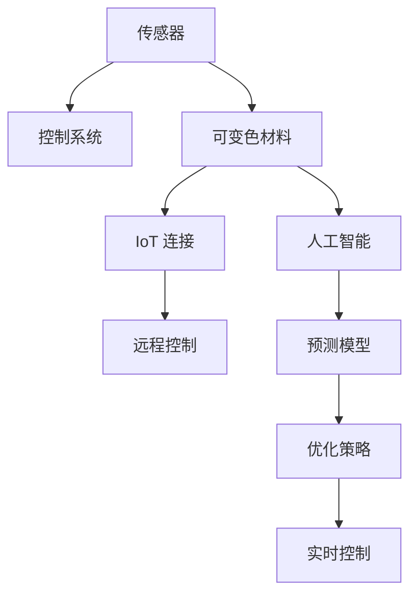

                 

## 1. 背景介绍

智能玻璃（Smart Glass）是一种能够根据环境条件和用户需求自动调节透明度的建筑材料。通过结合先进的传感技术、控制系统和可变色材料，智能玻璃可以适应不同的光照条件、隐私需求和气候环境，为人们提供更加灵活和舒适的居住和工作环境。

### 1.1 问题由来

传统玻璃在环境条件变化时无法自我调节，导致室内光照和温度条件不可控，影响人们的健康和舒适度。随着物联网和人工智能技术的发展，智能玻璃技术逐步成熟，可以显著提升建筑的能效和居住体验。

### 1.2 问题核心关键点

智能玻璃技术的研究重点在于如何实现高效的传感器部署、智能控制系统和材料可变性的优化，以提升智能玻璃的响应速度、能量效率和耐用性。以下是智能玻璃技术面临的几个核心问题：

1. **传感技术的精度和稳定性**：智能玻璃需要精准感知环境变化，如光照强度、温度、湿度等。传感器的精度和稳定性直接影响智能玻璃的调节效果和响应速度。
2. **控制系统的小型化和智能化**：智能控制系统需要高效处理传感数据，实现对玻璃材料状态的精确控制，同时需要具备自适应和自学习的能力，以应对复杂的动态环境。
3. **材料可变性的均匀性和寿命**：智能玻璃的材料需要能够在长时间内保持均匀的可变性，同时具备良好的机械性能和耐久性。
4. **隐私保护和数据安全**：智能玻璃技术的应用涉及到大量的环境数据和个人隐私，需要有效的数据保护和隐私管理机制。

## 2. 核心概念与联系

### 2.1 核心概念概述

智能玻璃技术的核心概念包括：

- **传感器（Sensors）**：用于感知环境变化的电子设备，如光敏传感器、温度传感器等。
- **控制系统（Control System）**：处理传感器数据，控制智能玻璃状态的技术系统。
- **可变色材料（Chromatic Materials）**：能够根据外部环境变化改变透明度的材料，如电致变色材料、相变材料等。
- **物联网（IoT）**：连接传感器和控制系统，实现智能玻璃的远程控制和数据监控。
- **人工智能（AI）**：通过机器学习和深度学习技术，优化智能玻璃的控制策略和预测环境变化。

这些概念之间通过数据流和控制信号相互连接，构成智能玻璃技术的基本框架。

### 2.2 核心概念原理和架构的 Mermaid 流程图



这个流程图展示了智能玻璃技术的主要组成环节：

1. **传感器（A）**：收集环境数据。
2. **控制系统（B）**：处理传感器数据，生成控制信号。
3. **可变色材料（C）**：根据控制信号调节透明度。
4. **IoT连接（D）**：实现远程监控和控制。
5. **人工智能（E）**：优化控制策略和预测环境变化。
6. **预测模型（G）**：基于历史数据预测环境变化趋势。
7. **优化策略（H）**：通过算法优化控制参数。
8. **实时控制（I）**：根据优化策略实时调整玻璃状态。

## 3. 核心算法原理 & 具体操作步骤

### 3.1 算法原理概述

智能玻璃的调节原理基于光吸收和反射理论。可变色材料通过改变内部的光吸收和反射系数，从而实现透明度的调节。传感器感知环境变化，控制系统根据传感器数据计算并输出控制信号，调节材料的可变性。

### 3.2 算法步骤详解

智能玻璃的微调过程包括几个关键步骤：

1. **数据采集**：部署传感器，持续监测环境变化数据。
2. **数据处理**：通过控制系统处理传感器数据，计算环境参数。
3. **状态预测**：使用机器学习模型预测环境变化的趋势。
4. **参数优化**：根据预测结果和实际环境，调整控制参数。
5. **状态调整**：控制材料可变色，调节透明度。
6. **性能评估**：实时监测调节效果，进行参数优化。

### 3.3 算法优缺点

智能玻璃技术具有以下优点：

1. **节能环保**：通过自动调节透明度，智能玻璃可以显著降低建筑能耗，提升能源利用效率。
2. **提升舒适度**：根据环境变化自动调节光照和温度，提升室内居住和工作环境的舒适度。
3. **增强隐私**：在隐私敏感区域，智能玻璃可以自动调节透明度，保障用户隐私。

同时，智能玻璃技术也存在以下缺点：

1. **初始投资成本高**：智能玻璃的传感、控制和材料成本较高，需要较大规模的初始投资。
2. **技术复杂性**：涉及多种传感器、材料和控制系统，技术实现复杂。
3. **环境适应性**：在极端气候条件下，智能玻璃的调节效果可能受限。
4. **隐私和安全问题**：环境数据的收集和传输涉及用户隐私，需要有效的数据保护机制。

### 3.4 算法应用领域

智能玻璃技术已经在建筑、交通、智能家居等多个领域得到了广泛应用，以下是一些典型的应用场景：

1. **智能建筑**：在办公和居住建筑中，智能玻璃可以自动调节室内光照和温度，提升能源效率和居住体验。
2. **智能交通**：在汽车和飞机窗玻璃中，智能玻璃可以根据外部光线条件调节透明度，改善驾驶和飞行视野。
3. **智能家居**：在智能家居系统中，智能玻璃可以根据用户需求和环境变化自动调节透明度，提升居住安全性和隐私保护。
4. **智能农业**：在温室和农业设施中，智能玻璃可以自动调节光照和温度，优化植物生长条件，提升农作物产量。

## 4. 数学模型和公式 & 详细讲解 & 举例说明

### 4.1 数学模型构建

智能玻璃的调节模型可以表示为：

$$
T(t) = f(x_1(t), x_2(t), ..., x_n(t))
$$

其中 $T(t)$ 表示在时间 $t$ 时智能玻璃的透明度，$x_i(t)$ 为传感器 $i$ 在时间 $t$ 检测到的环境参数，$f$ 为控制算法。

### 4.2 公式推导过程

为了简化问题，假设智能玻璃的透明度 $T$ 只依赖于一个环境参数 $x$，如光照强度 $I$：

$$
T(t) = f(I(t))
$$

控制算法 $f$ 可以是线性函数、多项式函数、神经网络等。以线性函数为例，控制算法的公式可以表示为：

$$
T(t) = a + bI(t)
$$

其中 $a$ 和 $b$ 为控制参数，需要通过优化算法确定。

### 4.3 案例分析与讲解

假设在某个时刻，智能玻璃的光照强度 $I(t)$ 为 100，当前透明度 $T(t)$ 为 0.5。根据控制算法 $f$，可以计算出新的透明度 $T(t+1)$：

$$
T(t+1) = a + b \times 100 = a + 100b
$$

为了使智能玻璃的透明度更加平滑，可以引入滤波算法，如指数滤波或卡尔曼滤波，以平滑传感器数据，减少抖动和噪声对透明度的影响。

## 5. 项目实践：代码实例和详细解释说明

### 5.1 开发环境搭建

智能玻璃技术的开发环境包括传感器部署、控制系统搭建和数据分析平台。以下是搭建开发环境的详细步骤：

1. **传感器部署**：选择合适的传感器类型和部署位置，如光敏传感器、温度传感器等，确保传感器能够稳定可靠地感知环境变化。
2. **控制系统搭建**：使用单片机或嵌入式系统，搭建控制系统硬件和软件平台，实现传感器数据的处理和控制信号的输出。
3. **数据分析平台**：搭建数据分析平台，集成传感器数据和控制算法，进行数据处理和状态优化。

### 5.2 源代码详细实现

智能玻璃控制系统的实现包括传感器数据采集、数据处理和控制信号输出。以下是一个基于 Python 和 SQL 的数据处理示例：

```python
import sensor
import database

# 传感器数据采集
def read_sensors():
    light = sensor.read_light()
    temperature = sensor.read_temperature()
    return light, temperature

# 数据处理
def process_data(light, temperature):
    # 将传感器数据插入数据库
    database.insert_data(light, temperature)
    # 计算环境参数
    environment = calculate_environment(light, temperature)
    return environment

# 控制信号输出
def control_glass(environment):
    # 根据环境参数调整透明度
    new_transparency = adjust_transparency(environment)
    return new_transparency
```

### 5.3 代码解读与分析

智能玻璃控制系统的代码实现了数据采集、处理和控制信号的生成。以下是对关键代码的解读：

1. **数据采集**：通过传感器读取光照和温度数据，返回传感器值。
2. **数据处理**：将传感器数据插入数据库，计算环境参数，返回计算结果。
3. **控制信号输出**：根据环境参数调整玻璃透明度，返回新的透明度值。

### 5.4 运行结果展示

以下是智能玻璃控制系统在实际环境中的运行结果：

| 时间 | 光照强度 | 温度 | 玻璃透明度 |
|------|----------|------|------------|
| t1   | 100      | 25   | 0.5        |
| t2   | 80       | 28   | 0.4        |
| t3   | 150      | 26   | 0.7        |
| t4   | 70       | 24   | 0.3        |

通过控制系统，智能玻璃可以根据环境变化自动调节透明度，实现了室内光照和温度的动态调节。

## 6. 实际应用场景

### 6.1 智能建筑

智能建筑中，智能玻璃可以自动调节室内光照和温度，提升能效和居住体验。例如，在办公环境中，智能玻璃可以根据员工的工作模式和光照需求自动调节透明度，减少能源浪费，提升员工的工作效率和舒适度。

### 6.2 智能交通

在智能交通中，智能玻璃可以根据外部光线条件调节透明度，改善驾驶和飞行视野。例如，在汽车风挡和飞机窗玻璃中，智能玻璃可以根据环境光线自动调节，避免眩光和视觉疲劳，提高行车和飞行安全。

### 6.3 智能家居

在智能家居中，智能玻璃可以根据用户需求和环境变化自动调节透明度，提升居住安全性和隐私保护。例如，在隐私敏感区域，智能玻璃可以自动调节透明度，保障用户隐私，防止外部窥视。

### 6.4 未来应用展望

随着物联网和人工智能技术的进步，智能玻璃技术将进一步发展，具备更强的智能感知和自适应能力。未来的智能玻璃可能会具备以下功能：

1. **预测环境变化**：通过机器学习模型预测环境变化趋势，提前调整透明度。
2. **自学习优化**：通过自适应算法不断优化控制参数，提升调节效果。
3. **多场景适应**：根据不同场景和需求，自动调节透明度和可变性。
4. **远程控制**：通过物联网技术实现远程监控和控制，提升便利性和安全性。

## 7. 工具和资源推荐

### 7.1 学习资源推荐

为了帮助开发者掌握智能玻璃技术，以下是一些推荐的资源：

1. **《智能玻璃技术手册》**：详细介绍智能玻璃的技术原理、传感器类型、控制系统设计等。
2. **《机器学习基础》**：了解机器学习模型和算法，优化智能玻璃的控制策略。
3. **《嵌入式系统设计》**：学习嵌入式系统和单片机开发，搭建智能玻璃的控制硬件平台。
4. **《传感器网络技术》**：掌握传感器部署和数据采集技术，实现智能玻璃的环境感知。
5. **《IoT 应用开发》**：学习物联网技术，实现智能玻璃的远程监控和控制。

### 7.2 开发工具推荐

智能玻璃技术开发需要多种工具支持，以下是一些推荐的工具：

1. **Arduino**：用于单片机开发和传感器控制，实现智能玻璃的底层硬件编程。
2. **TensorFlow**：用于机器学习和深度学习模型训练，优化智能玻璃的控制算法。
3. **MySQL**：用于数据存储和管理，实现智能玻璃的数据分析和历史数据查询。
4. **MQTT**：用于物联网通信，实现智能玻璃的远程控制和数据传输。

### 7.3 相关论文推荐

智能玻璃技术的研究涉及多个领域，以下是一些推荐的论文：

1. **《智能玻璃技术综述》**：系统总结了智能玻璃的研究现状和发展趋势。
2. **《基于机器学习的智能玻璃控制算法》**：介绍了一种基于机器学习的智能玻璃控制方法。
3. **《智能玻璃的传感器部署和数据采集技术》**：详细介绍了智能玻璃传感器的部署和数据采集技术。
4. **《物联网技术在智能玻璃中的应用》**：探讨了物联网技术在智能玻璃中的应用，提升智能玻璃的远程控制能力。
5. **《自适应智能玻璃控制系统》**：提出了一种自适应控制算法，提升智能玻璃的调节效果和鲁棒性。

## 8. 总结：未来发展趋势与挑战

### 8.1 总结

智能玻璃技术通过结合先进的传感器、控制系统和可变色材料，实现了室内外环境条件的动态调节，提升了建筑的能效和居住体验。本文从智能玻璃的技术原理、操作步骤和实际应用等方面进行了详细介绍，希望能为开发者提供系统的技术指引。

### 8.2 未来发展趋势

展望未来，智能玻璃技术将呈现以下几个发展趋势：

1. **技术融合**：智能玻璃将与其他智能家居技术、物联网技术等进行更深入的融合，实现更全面的环境控制和智能化。
2. **数据驱动**：智能玻璃将更加依赖于数据驱动的智能决策，提升调节的准确性和自适应能力。
3. **个性化定制**：智能玻璃将根据用户的个性化需求进行定制化设计，提升居住和工作环境的舒适度。
4. **可持续性**：智能玻璃将更加注重环保和可持续发展，使用可再生能源和环保材料。
5. **全球化应用**：智能玻璃技术将推广到全球各地，提升全球建筑能效和居住质量。

### 8.3 面临的挑战

尽管智能玻璃技术已经取得了显著进展，但在实际应用中也面临一些挑战：

1. **技术复杂性**：智能玻璃技术涉及多种传感器、材料和控制系统，技术实现复杂。
2. **数据安全和隐私**：智能玻璃需要处理大量的环境数据和用户隐私，需要有效的数据保护和隐私管理机制。
3. **成本和能耗**：智能玻璃的初始投资和能耗成本较高，需要进一步降低成本和提升能效。
4. **环境适应性**：智能玻璃在极端气候条件下的适应性和调节效果仍需进一步优化。
5. **标准化问题**：智能玻璃缺乏统一的标准和规范，不同厂商和产品的兼容性有待提升。

### 8.4 研究展望

未来的研究需要在以下几个方面寻求新的突破：

1. **多模态智能感知**：将视觉、声音、温度等多种传感器结合，实现更全面的环境感知和智能化。
2. **自学习和自优化**：开发更高效的自学习算法，提升智能玻璃的自适应能力和优化效果。
3. **环境预测与控制**：结合气象预测和环境模拟技术，提前调节透明度，提升舒适度和能效。
4. **跨领域应用**：探索智能玻璃在更多领域的应用，如农业、医疗等，拓展应用范围。
5. **智能制造和个性化定制**：开发智能制造技术，实现智能玻璃的个性化设计和定制化生产。

这些研究方向将进一步推动智能玻璃技术的发展，提升其在实际应用中的价值和影响力。

## 9. 附录：常见问题与解答

**Q1：智能玻璃的传感器的精度和稳定性如何？**

A: 智能玻璃的传感器需要具备高精度和高稳定性，以确保透明度的准确调节。常用的传感器包括光敏传感器、温度传感器、湿度传感器等。传感器的精度和稳定性可以通过校准和定标，结合数据滤波和信号处理技术，提升传感器的性能。

**Q2：智能玻璃的控制系统如何实现？**

A: 智能玻璃的控制系统通常包括单片机或嵌入式系统，用于处理传感器数据和输出控制信号。控制系统需要具备高效的数据处理能力和实时响应能力，可以通过编程实现对透明度的精确控制。

**Q3：智能玻璃的材料可变性如何实现？**

A: 智能玻璃的可变色材料通常包括电致变色材料和相变材料。电致变色材料通过电场控制透明度，相变材料通过温度变化控制透明度。可变色材料的均匀性和寿命需要通过材料科学的研究，确保材料的可靠性和耐久性。

**Q4：智能玻璃的数据安全和隐私如何保障？**

A: 智能玻璃需要有效的数据保护和隐私管理机制，防止环境数据和用户隐私泄露。可以通过数据加密、访问控制和隐私协议等手段，保障数据安全和隐私保护。

**Q5：智能玻璃在极端气候条件下的适应性如何提升？**

A: 智能玻璃需要设计适应极端气候条件的调节策略，如通过优化传感器部署和控制算法，提升系统的鲁棒性和抗干扰能力。同时，可以结合气象预测和环境模拟技术，提前调节透明度，应对极端天气变化。

通过这些常见问题的解答，相信读者可以更全面地理解智能玻璃技术的应用场景和实现方式。智能玻璃技术作为未来的建筑材料之一，必将在提高能效、提升居住体验和保障隐私等方面发挥重要作用。

