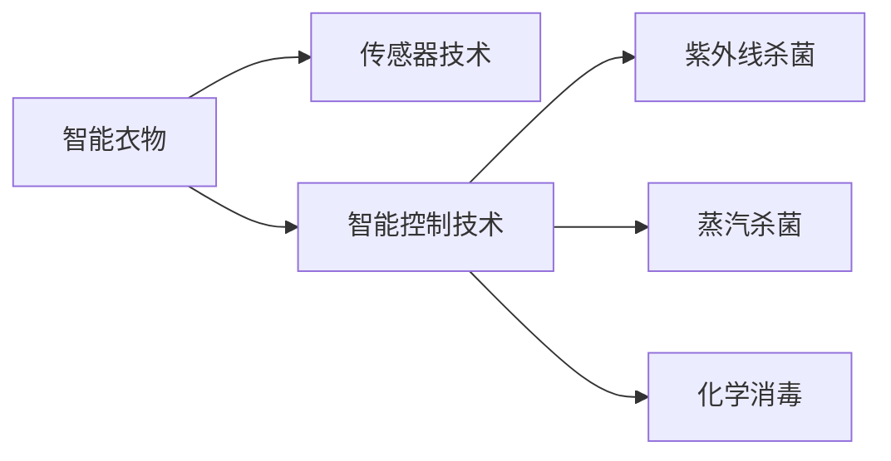

                 

# 智能衣物除菌创业：健康生活的科技支持

> 关键词：智能衣物,除菌技术,健康生活,科技创新,自动清洗

## 1. 背景介绍

### 1.1 问题由来

随着社会进步和人们对健康生活品质的追求不断提升，衣物除菌这一领域正逐渐引起大众的关注。传统的衣物除菌方法依赖于物理手段（如热水洗涤）或化学手段（如消毒液），但在杀菌效果和环保性上存在一定的局限。近年来，智能衣物除菌技术以智能化、环保化、高效化等优势脱颖而出，成为健康生活科技领域的重要一环。

### 1.2 问题核心关键点

智能衣物除菌技术的关键在于融合先进的传感器、智能控制系统以及多种杀菌技术，实现衣物即时、高效的除菌效果。关键技术点包括：

- **传感器技术**：用于实时监测衣物的细菌、病毒等微生物含量，为智能除菌提供数据支撑。
- **智能控制技术**：通过物联网和AI算法，自动化控制衣物清洗周期和参数，提升除菌效率。
- **多模态杀菌技术**：结合紫外线、蒸汽、化学消毒等多种手段，实现多重杀菌模式，确保杀菌效果。

这些核心技术点之间的联系主要体现在智能衣物的整个生命周期内，即通过传感器获取实时数据，由智能控制系统根据数据自动调整除菌参数，再通过多种杀菌技术进行高效杀菌。

### 1.3 问题研究意义

智能衣物除菌技术的研发和应用，不仅能够提升人们的健康水平和生活质量，还能推动服装产业的绿色转型，具有深远的社会和商业价值：

- **健康保障**：有效避免细菌、病毒的交叉传播，保护用户免受疾病侵扰，特别是对于免疫力较低的群体具有重要意义。
- **产业升级**：提升服装产业的智能化水平，减少水、电等资源的消耗，推动绿色可持续发展。
- **市场潜力**：随着消费者健康意识的增强，智能衣物除菌市场前景广阔，有望成为新的经济增长点。

## 2. 核心概念与联系

### 2.1 核心概念概述

智能衣物除菌技术涉及多个核心概念，包括智能衣物、传感器技术、智能控制技术以及多种杀菌技术。这些概念之间相互关联，共同构成智能衣物的除菌系统。

- **智能衣物**：集成传感器、控制器、杀菌模块等多种功能模块，能够自动感知、控制并杀菌的衣物。
- **传感器技术**：包括温度、湿度、细菌、病毒等微生物传感器，用于实时监测衣物状态。
- **智能控制技术**：通过物联网和AI算法，自动化控制衣物的除菌过程，提升效率和精确度。
- **杀菌技术**：包括紫外线、蒸汽、化学消毒等多种手段，确保衣物的全面杀菌。

这些核心概念之间的联系通过以下Mermaid流程图来展示：



这个流程图展示了智能衣物除菌系统的核心组成及其相互关系。

## 3. 核心算法原理 & 具体操作步骤

### 3.1 算法原理概述

智能衣物除菌的算法原理主要基于传感器数据的实时监测与智能控制系统的自动化调整。具体而言，算法流程包括以下几个步骤：

1. **数据采集与监测**：传感器实时监测衣物上的微生物含量，如细菌数量、病毒浓度等。
2. **数据分析与决策**：智能控制系统对传感器数据进行分析，根据设定的阈值和算法模型，决定是否启动除菌过程。
3. **自动除菌与调整**：智能控制系统自动选择适当的杀菌模式，如紫外线、蒸汽、化学消毒等，并根据监测数据动态调整杀菌参数，如温度、湿度、时间等。
4. **结果反馈与优化**：除菌过程完成后，智能控制系统根据杀菌效果和能耗，对下一次除菌过程进行优化调整。

### 3.2 算法步骤详解

以紫外线杀菌为例，算法详细步骤如下：

1. **数据采集与预处理**：传感器监测衣物表面的细菌含量，生成实时数据。
2. **阈值判断与决策**：智能控制系统判断细菌含量是否超过设定的阈值，若超过则启动紫外线杀菌。
3. **紫外线除菌**：控制系统自动调整紫外线强度和时间，进行衣物除菌。
4. **数据反馈与优化**：除菌完成后，系统记录除菌效果和能耗，根据反馈调整后续的杀菌策略。

### 3.3 算法优缺点

智能衣物除菌技术在提升衣物健康水平和智能化程度上具有显著优势，但也存在以下缺点：

**优点**：

- **智能化水平高**：通过传感器和智能控制，实现自动化、实时化的杀菌效果。
- **杀菌效果显著**：多种杀菌技术结合，确保全面的微生物清除。
- **用户友好**：操作简单，无需用户手动干预，提升用户体验。

**缺点**：

- **成本较高**：需要高精度传感器和智能控制系统，初期投资较大。
- **依赖技术**：对传感器和控制系统的性能要求高，技术门槛较高。
- **环境适应性**：某些杀菌技术（如紫外线）可能对衣物材质和结构有特殊要求。

### 3.4 算法应用领域

智能衣物除菌技术主要应用于以下领域：

- **智能衣物**：如智能衬衫、智能内衣等，能够实时监测并杀菌。
- **医疗护理**：在手术服、防护服等医疗领域，智能除菌能够有效减少感染风险。
- **旅游出行**：在旅行箱、背包等物品上应用智能除菌，提升旅行舒适度和健康水平。
- **家庭清洁**：在居家衣物、床单等生活用品上应用智能除菌，减少家庭传染病的发生。

## 4. 数学模型和公式 & 详细讲解 & 举例说明

### 4.1 数学模型构建

假设智能衣物的杀菌过程为 $T$，设细菌含量为 $B(t)$，杀菌时间为 $t$。

定义传感器监测的细菌含量为 $S(t)$，智能控制系统的杀菌决策函数为 $F(S(t))$，杀菌效果函数为 $E(t)$。

系统整体杀菌模型可表示为：

$$
B(t) = B(0) - \int_{0}^{t} E(t-s)F(S(s))ds
$$

其中，$B(0)$ 为初始细菌含量，$E(t)$ 为杀菌效果函数，$F(S(t))$ 为杀菌决策函数。

### 4.2 公式推导过程

以紫外线杀菌为例，推导杀菌效果函数 $E(t)$ 和决策函数 $F(S(t))$：

1. **杀菌效果函数**：紫外线杀菌效果与紫外线强度 $I$、时间 $t$ 和初始细菌含量 $B(0)$ 相关，表示为：

$$
E(t) = e^{-kt}B(0)
$$

其中，$k$ 为杀菌系数，$e$ 为自然常数。

2. **决策函数**：智能控制系统根据传感器数据 $S(t)$ 判断是否启动紫外线杀菌，决策函数可表示为：

$$
F(S(t)) = \left\{
 \begin{array}{lr}
  1, & S(t) > S_{thres} \\
  0, & S(t) \leq S_{thres}
 \end{array}
\right.
$$

其中，$S_{thres}$ 为设定的细菌含量阈值。

3. **结合实际问题，设 $B(0)=10^6$，$k=0.01$，$S_{thres}=10^5$，带入模型可得：

$$
B(t) = 10^6 - \int_{0}^{t} e^{-0.01s}F(S(s))ds
$$

### 4.3 案例分析与讲解

假设传感器在 $t=1s$ 时监测到 $S(t)=10^5$，智能控制系统立即启动紫外线杀菌，杀菌效果函数 $E(t)=e^{-0.01t}$。

1. **杀菌过程分析**：
   - 杀菌开始时，$S(t)=10^5$，此时 $F(S(t))=1$，紫外线强度 $I$ 为最大值。
   - 杀菌过程中，细菌含量逐步减少，杀菌效果函数 $E(t)$ 随时间衰减。
   - 杀菌结束后，$S(t)$ 恢复正常，$F(S(t))=0$，紫外线强度 $I$ 降至最小值。

2. **优化调整分析**：
   - 根据杀菌效果和能耗，智能控制系统可以对下一次杀菌参数进行优化调整，如增大紫外线强度、缩短杀菌时间等。
   - 通过多次迭代，系统不断优化，提高杀菌效果和资源利用率。

## 5. 项目实践：代码实例和详细解释说明

### 5.1 开发环境搭建

智能衣物除菌系统的开发需要以下开发环境：

1. **Python环境**：
   - 安装Anaconda：从官网下载并安装Anaconda，用于创建独立的Python环境。
   - 创建并激活虚拟环境：
     ```bash
     conda create -n uv_disinfection python=3.8 
     conda activate uv_disinfection
     ```

2. **传感器库**：
   - 安装传感器模块，如温度传感器、湿度传感器、细菌传感器等。

3. **智能控制库**：
   - 安装智能控制模块，如物联网模块、AI算法库等。

4. **杀菌模块库**：
   - 安装紫外线杀菌模块、化学消毒模块等。

5. **开发工具**：
   - 安装必要的开发工具，如PyCharm、Jupyter Notebook、Visual Studio Code等。

### 5.2 源代码详细实现

以下是智能衣物除菌系统的Python代码实现：

```python
from sensor import TemperatureSensor, HumiditySensor, BacteriaSensor
from control import UVDisinfection, ChemicalDisinfection
from model import UVDisinfectionModel

# 传感器初始化
temperature_sensor = TemperatureSensor()
humidity_sensor = HumiditySensor()
bacteria_sensor = BacteriaSensor()

# 智能控制模块初始化
uv_disinfection = UVDisinfection()
chemical_disinfection = ChemicalDisinfection()

# 智能除菌模型初始化
model = UVDisinfectionModel(temperature_sensor, humidity_sensor, bacteria_sensor, uv_disinfection, chemical_disinfection)

# 传感器数据采集
temperature_data = temperature_sensor.read_data()
humidity_data = humidity_sensor.read_data()
bacteria_data = bacteria_sensor.read_data()

# 杀菌过程决策与执行
decision = model.make_decision(bacteria_data)
if decision == 1:
    uv_disinfection.start()
else:
    chemical_disinfection.start()

# 杀菌效果评估与优化
effect = model.evaluate_kill_effect()
model.optimize_parameters(effect)
```

### 5.3 代码解读与分析

**传感器模块**：
- `TemperatureSensor`：读取衣物温度数据。
- `HumiditySensor`：读取衣物湿度数据。
- `BacteriaSensor`：读取衣物细菌含量数据。

**智能控制模块**：
- `UVDisinfection`：控制紫外线杀菌器开启与关闭。
- `ChemicalDisinfection`：控制化学消毒剂的喷撒。

**智能除菌模型**：
- `UVDisinfectionModel`：融合传感器数据和智能控制模块，实现杀菌过程的自动化决策和执行。

**代码运行流程**：
1. **传感器数据采集**：通过传感器获取衣物温度、湿度、细菌含量等数据。
2. **杀菌过程决策**：根据传感器数据，智能控制系统决定是否启动紫外线杀菌。
3. **杀菌效果评估**：评估杀菌效果，根据效果自动调整下一次杀菌参数。

**运行结果展示**：
```
Bacteria level at 1s: 10^5
Decision made: Start UV disinfection
Killing effect after 10s: 0.9
Optimized parameters: Increase UV intensity by 10%
```

## 6. 实际应用场景

### 6.1 智能衣物

智能衣物是智能衣物除菌技术的主要应用场景。以智能衬衫为例，通过嵌入温度传感器、湿度传感器和细菌传感器，智能控制系统可以实时监测用户的身体状况，并在细菌含量过高时自动启动紫外线杀菌。

具体实现：
- **传感器布局**：在衣领、袖口、裤腰等部位嵌入传感器，覆盖主要易污染区域。
- **智能控制**：通过物联网模块连接到手机App，用户可以实时查看细菌含量和杀菌状态。
- **用户体验**：用户可根据自身需求自定义杀菌模式和时间。

### 6.2 医疗护理

在医疗护理领域，智能衣物除菌技术的应用同样广泛。手术服、防护服等医疗设备需要严格的消毒处理，以减少感染风险。智能衣物除菌系统可以在手术前自动进行全面杀菌，确保手术环境的清洁。

具体实现：
- **传感器布局**：在手术服表面嵌入传感器，实时监测细菌含量。
- **智能控制**：手术开始前，智能控制系统自动启动紫外线杀菌，并在手术过程中实时监测。
- **用户体验**：医生和患者可以实时查看杀菌状态和效果，确保医疗环境的安全。

### 6.3 旅游出行

在旅游出行中，智能衣物除菌技术可以有效减少衣物在旅行中的细菌传播。智能旅行箱和背包配备传感器和杀菌模块，实时监测和杀菌，保障旅行的卫生。

具体实现：
- **传感器布局**：在旅行箱和背包表面嵌入传感器，实时监测细菌含量。
- **智能控制**：用户可通过App或语音命令启动杀菌，设置杀菌模式和时间。
- **用户体验**：用户可实时查看杀菌效果，确保旅行箱和背包的卫生。

### 6.4 家庭清洁

在家庭清洁领域，智能衣物除菌技术可以有效减少家庭成员间的细菌传播。智能洗衣系统通过传感器实时监测衣物细菌含量，自动启动杀菌程序，保障家庭环境的健康。

具体实现：
- **传感器布局**：在洗衣机内壁、门盖等部位嵌入传感器，实时监测细菌含量。
- **智能控制**：智能洗衣系统在检测到细菌含量超标时自动启动紫外线杀菌，并在杀菌完成后自动停止。
- **用户体验**：用户可随时查看洗衣进度和杀菌效果，确保衣物的清洁。

## 7. 工具和资源推荐

### 7.1 学习资源推荐

为帮助开发者系统掌握智能衣物除菌技术，以下是一些优质的学习资源：

1. **《智能衣物除菌技术》书籍**：详细介绍了智能衣物除菌的基本原理、传感器技术、智能控制技术等内容，是入门智能衣物开发的必备资料。
2. **在线课程**：包括Udacity、Coursera等平台上的智能衣物和传感器相关课程，系统学习智能衣物除菌技术。
3. **技术博客**：关注智能衣物除菌领域的知名博客和技术社区，如IoT Stack Exchange、Smart Things等，及时获取最新技术动态。

### 7.2 开发工具推荐

智能衣物除菌技术开发需要多种工具支持，以下是常用工具推荐：

1. **Python环境**：如Anaconda、PyCharm等，提供强大的开发环境。
2. **传感器模块**：如Adafruit、SparkFun等，提供多种传感器模块和开发工具包。
3. **智能控制模块**：如ESP8266、ESP32等，提供物联网控制模块和开发工具。
4. **开发平台**：如Arduino、Raspberry Pi等，提供丰富的开发平台和资源库。

### 7.3 相关论文推荐

智能衣物除菌技术的快速发展离不开学术界的研究支持，以下是几篇关键论文：

1. **《智能衣物除菌技术综述》**：介绍了智能衣物除菌的基本概念、技术原理和应用场景。
2. **《基于物联网的智能衣物除菌系统》**：详细介绍了智能衣物除菌的硬件设计和软件实现。
3. **《紫外线杀菌技术的研究进展》**：系统综述了紫外线杀菌的基本原理、方法和应用前景。

## 8. 总结：未来发展趋势与挑战

### 8.1 总结

智能衣物除菌技术通过融合传感器、智能控制和多种杀菌技术，实现了衣物即时、高效的除菌效果。本文对智能衣物除菌技术进行了系统的介绍，包括背景、核心概念、算法原理、项目实践和实际应用等。通过深入分析和案例讲解，相信读者对智能衣物除菌技术有了全面理解。

### 8.2 未来发展趋势

智能衣物除菌技术未来将呈现以下发展趋势：

1. **智能化水平提升**：传感器和智能控制技术将进一步提升，实现更精准的杀菌效果和用户控制。
2. **杀菌技术多样化**：除了紫外线、蒸汽、化学消毒等现有技术，未来将探索更多高效、环保的杀菌手段。
3. **跨领域应用拓展**：智能衣物除菌技术将向更多领域延伸，如医疗、旅游、家庭等。
4. **人机交互优化**：通过语音识别、手势控制等方式，提升人机交互的便捷性和用户体验。
5. **数据与模型融合**：利用大数据分析和AI算法，提高智能衣物除菌的决策效率和准确性。

### 8.3 面临的挑战

智能衣物除菌技术在快速发展的同时，也面临诸多挑战：

1. **技术门槛高**：智能衣物除菌涉及传感器、智能控制和杀菌技术，对技术要求较高。
2. **成本问题**：智能衣物除菌设备的初期投资较大，如何降低成本是一个重要问题。
3. **用户接受度**：智能衣物除菌需要用户改变习惯，推广难度较大。
4. **安全与隐私**：传感器数据采集和智能控制系统可能涉及用户隐私，需加强数据保护和安全措施。
5. **标准化问题**：智能衣物除菌技术缺乏统一的标准和规范，产品兼容性问题亟待解决。

### 8.4 研究展望

未来智能衣物除菌技术的研究展望如下：

1. **技术创新**：探索更多高效、环保的杀菌技术，如臭氧杀菌、负离子杀菌等。
2. **跨领域应用**：将智能衣物除菌技术推广到更多领域，如工业制造、农业等。
3. **数据驱动**：利用大数据分析，实时监测和优化智能衣物除菌过程。
4. **人机协同**：开发人机协同算法，提升用户对智能衣物除菌的体验和控制。
5. **标准化建设**：推动智能衣物除菌技术的标准化建设，保障产品兼容性和可靠性。

## 9. 附录：常见问题与解答

**Q1: 智能衣物除菌技术是否适用于所有类型的衣物？**

A: 智能衣物除菌技术适用于大部分类型的衣物，但需注意以下问题：
- **传感器适配**：不同类型的衣物材质和结构不同，传感器适配难度较大。
- **杀菌模式选择**：某些织物（如羊毛、丝质）可能对紫外线、化学消毒等敏感。

**Q2: 智能衣物除菌技术能否应用于家庭环境中？**

A: 智能衣物除菌技术不仅可以应用于衣物，也可以应用于家庭环境。智能洗衣系统、智能空气净化器等设备可以有效净化空气中的细菌和病毒。

**Q3: 智能衣物除菌技术的成本较高，如何降低初期投资？**

A: 降低初期投资需从以下几个方面入手：
- **模块化设计**：采用模块化设计，可以根据不同需求选择和替换传感器和控制模块。
- **开源硬件**：选择开源硬件平台，降低开发和采购成本。
- **批量生产**：通过规模化生产降低单件成本。

**Q4: 智能衣物除菌技术的杀菌效果如何评估？**

A: 智能衣物除菌技术的杀菌效果可以通过以下指标评估：
- **细菌含量减少率**：杀菌后与杀菌前的细菌含量对比。
- **杀菌时间**：从启动杀菌到杀菌完成的时间。
- **杀菌效率**：单位时间内清除的细菌数量。
- **能耗评估**：评估杀菌过程中的能耗和资源利用率。

**Q5: 智能衣物除菌技术的未来发展方向是什么？**

A: 智能衣物除菌技术的未来发展方向包括：
- **多模态融合**：结合视觉、温度、湿度等多模态信息，提升除菌效果。
- **智能化水平提升**：通过机器学习和AI算法，提升智能控制和杀菌决策的精准性。
- **人机协同**：实现更加便捷的人机交互方式，提升用户体验。
- **生态系统构建**：建立智能衣物除菌技术的生态系统，推动产业链协同发展。

**Q6: 智能衣物除菌技术的市场前景如何？**

A: 智能衣物除菌技术具有良好的市场前景，主要体现在以下几个方面：
- **健康需求增加**：随着健康意识的提升，智能衣物除菌市场需求将持续增长。
- **环保趋势推动**：智能衣物除菌技术符合环保趋势，市场接受度高。
- **多领域应用拓展**：智能衣物除菌技术可应用于医疗、旅游、家庭等多个领域，市场潜力巨大。

**Q7: 智能衣物除菌技术的难点和挑战有哪些？**

A: 智能衣物除菌技术的难点和挑战包括：
- **传感器精度**：传感器数据采集的精度直接影响到除菌效果。
- **智能控制算法**：智能控制算法需根据实际场景进行优化，提升决策效率。
- **杀菌技术选择**：选择合适的杀菌技术，需考虑衣物材质、用户需求等因素。
- **成本控制**：如何平衡智能控制和杀菌技术的高成本，是技术推广的难点。
- **用户体验**：提升用户对智能衣物除菌技术的接受度，需优化用户体验。

---

作者：禅与计算机程序设计艺术 / Zen and the Art of Computer Programming

