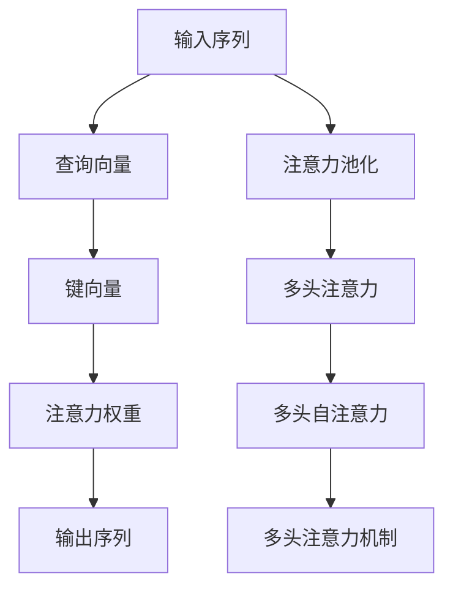

                 

# 最大限度地利用AI时代的注意力

在人工智能(AI)领域，"注意力"机制是一个非常重要且强大的概念。它允许模型在处理输入时，选择性地关注关键部分，而忽略无关信息。这一机制最早在深度学习中被引入，用于图像识别、语音识别、机器翻译等领域，并在自然语言处理(NLP)领域中大放异彩。

本文将系统地介绍注意力机制的核心概念、实现原理、优化策略和应用场景，以期帮助AI开发者更好地理解和应用这一强大的技术。

## 1. 背景介绍

### 1.1 问题由来
注意力机制最早在1974年的论文《Adaptive Computational Complexity through Reuse of Computational Knowledge》中被提出。此后，随着深度学习的发展，注意力机制被广泛用于解决深度神经网络中难以处理的多维数据表示问题。

近年来，深度学习模型在AI领域取得了突破性进展。在自然语言处理领域，基于注意力机制的Transformer模型在多项任务上刷新了最先进性能。这表明，注意力机制已经成为深度学习中不可或缺的一部分。

然而，尽管注意力机制在深度学习中有着重要地位，但其理论基础和实际应用仍存在不少挑战。如何更高效地利用注意力机制，成为当前深度学习研究的热点问题。

### 1.2 问题核心关键点
本文将介绍如何通过注意力机制，最大限度地利用AI时代的计算资源，以实现模型性能的提升。具体来讲，核心关键点包括：

- 注意力机制的原理和架构。
- 注意力机制的优化策略。
- 注意力机制在实际应用中的具体实现。

这些问题将帮助我们系统地理解和应用注意力机制，提升深度学习模型的性能。

## 2. 核心概念与联系

### 2.1 核心概念概述

为更好地理解注意力机制，本节将介绍几个密切相关的核心概念：

- 注意力机制(Attention Mechanism)：通过计算输入序列中每个元素与查询向量的相似度，选择性地关注关键部分，忽略无关信息。

- 自注意力(Self-Attention)：一种特殊的注意力机制，输入序列本身充当查询和键向量，计算序列中各元素之间的相似度。

- 多头注意力(Multi-Head Attention)：通过并行计算多个头部的自注意力，提高模型的并行性和泛化能力。

- 注意力头(Attention Head)：自注意力机制中的单个独立查询和键向量的组合，用于计算输入序列中各元素之间的相似度。

- 注意力权重(Attention Weight)：用于衡量输入序列中每个元素与查询向量的相似度，用于指导模型对关键信息的关注。

- 注意力池化(Attention Pooling)：通过计算各元素之间的加权和，对输入序列进行降维，用于处理长序列数据。

- 多头注意力机制(Multi-Head Attention Mechanism)：通过并行计算多个头部的自注意力，提高模型的并行性和泛化能力。

这些核心概念之间通过注意力机制的逻辑链条联系在一起，共同构建了注意力机制的完整框架。

### 2.2 核心概念原理和架构的 Mermaid 流程图(Mermaid 流程节点中不要有括号、逗号等特殊字符)



这个流程图展示了注意力机制的核心流程：

1. 输入序列作为查询向量。
2. 输入序列本身充当键向量。
3. 计算输入序列中各元素与查询向量的相似度，得到注意力权重。
4. 通过注意力权重对输入序列进行加权和，得到输出序列。
5. 对输出序列进行降维，得到注意力池化的结果。
6. 并行计算多个头部的自注意力，得到多头注意力机制的输出。

## 3. 核心算法原理 & 具体操作步骤

### 3.1 算法原理概述

注意力机制的核心思想是通过计算输入序列中每个元素与查询向量的相似度，选择性地关注关键部分，忽略无关信息。这一机制广泛应用于深度学习模型中，用于解决多维数据表示问题。

假设输入序列为 $X$，查询向量为 $Q$，键向量为 $K$。注意力机制的目标是计算 $Q$ 对 $X$ 中每个元素的注意力权重 $\alpha$，并据此加权和得到输出序列 $Y$。具体过程如下：

1. 计算注意力权重 $\alpha$：
$$
\alpha = \text{Softmax}(QK^T / \sqrt{d_k})
$$

其中 $d_k$ 为键向量的维度，$\text{Softmax}$ 函数用于将权重值归一化到 $(0,1)$ 区间。

2. 计算输出序列 $Y$：
$$
Y = \sum_{i=1}^n \alpha_i X_i
$$

其中 $\alpha_i$ 为第 $i$ 个元素的注意力权重。

### 3.2 算法步骤详解

以下是注意力机制的详细操作步骤：

1. **输入序列预处理**：
   - 对输入序列 $X$ 进行分词、词嵌入等预处理，得到表示矩阵 $\mathbf{X} \in \mathbb{R}^{n \times d_v}$。
   - 对查询向量 $Q$ 进行分词、词嵌入等预处理，得到表示矩阵 $\mathbf{Q} \in \mathbb{R}^{d_q \times d_v}$。

2. **计算注意力权重**：
   - 计算查询向量与每个键向量的点积，得到相似度矩阵 $\mathbf{Z} \in \mathbb{R}^{n \times d_v}$。
   - 将相似度矩阵除以 $\sqrt{d_k}$，得到归一化的相似度矩阵 $\mathbf{Z}' \in \mathbb{R}^{n \times d_v}$。
   - 对归一化的相似度矩阵进行 softmax 函数计算，得到注意力权重矩阵 $\mathbf{\alpha} \in \mathbb{R}^{n \times d_v}$。

3. **计算输出序列**：
   - 对注意力权重矩阵进行加权和操作，得到输出序列矩阵 $\mathbf{Y} \in \mathbb{R}^{d_q \times d_v}$。
   - 对输出序列矩阵进行线性变换和激活函数处理，得到最终输出 $\mathbf{Y'} \in \mathbb{R}^{d_q \times d_v}$。

### 3.3 算法优缺点

注意力机制具有以下优点：

- **选择关注**：通过计算注意力权重，模型可以自适应地选择关注输入序列中的关键部分。
- **并行计算**：多头注意力机制允许并行计算多个头部的自注意力，提高计算效率。
- **泛化能力强**：多头注意力机制提升了模型的泛化能力，适用于多种NLP任务。

但同时也存在一些缺点：

- **计算复杂度高**：计算注意力权重的过程需要较长的计算时间，尤其是在序列较长的情况下。
- **训练难度大**：注意力机制的训练需要大量的标注数据，且模型容易过拟合。
- **模型复杂度高**：多头注意力机制需要大量的参数，增加了模型的复杂性。

### 3.4 算法应用领域

注意力机制被广泛应用于深度学习模型中，特别是在自然语言处理(NLP)领域。以下是几个主要应用场景：

- **机器翻译**：使用注意力机制进行序列到序列的翻译，提高了翻译质量。
- **文本分类**：通过多头注意力机制，对输入文本进行特征提取和分类。
- **问答系统**：利用注意力机制对问答对进行匹配，提高了回答的准确性和相关性。
- **文本生成**：使用注意力机制对文本序列进行编码和解码，生成连续的文本。
- **文本摘要**：通过注意力机制对输入文本进行加权和，生成精炼的摘要。
- **语义相似度计算**：利用注意力机制计算输入序列之间的语义相似度，应用于文本检索和推荐系统。

## 4. 数学模型和公式 & 详细讲解 & 举例说明

### 4.1 数学模型构建

本节将使用数学语言对注意力机制进行严格的数学建模。

假设输入序列 $X$ 的长度为 $n$，查询向量 $Q$ 的长度为 $d_q$，键向量 $K$ 的长度为 $d_v$。注意力机制的计算过程如下：

1. **相似度矩阵计算**：
$$
\mathbf{Z} = \mathbf{QK}^T
$$

2. **归一化相似度矩阵计算**：
$$
\mathbf{Z}' = \mathbf{Z} / \sqrt{d_k}
$$

3. **注意力权重计算**：
$$
\mathbf{\alpha} = \text{Softmax}(\mathbf{Z}')
$$

4. **输出序列计算**：
$$
\mathbf{Y} = \mathbf{\alpha}X
$$

5. **最终输出计算**：
$$
\mathbf{Y'} = \text{Linear}(\mathbf{Y})
$$

其中 $\text{Linear}$ 函数为线性变换，$\text{Softmax}$ 函数为归一化函数。

### 4.2 公式推导过程

以下我们以机器翻译任务为例，推导注意力机制的具体实现。

假设源语言序列为 $X$，目标语言序列为 $Y$。设源语言序列的长度为 $n$，目标语言序列的长度为 $m$。

1. **编码器表示计算**：
   - 对源语言序列 $X$ 进行编码，得到编码器表示矩阵 $\mathbf{X} \in \mathbb{R}^{n \times d_v}$。
   - 对查询向量 $Q$ 进行分词、词嵌入等预处理，得到表示矩阵 $\mathbf{Q} \in \mathbb{R}^{d_q \times d_v}$。

2. **解码器表示计算**：
   - 对目标语言序列 $Y$ 进行解码，得到解码器表示矩阵 $\mathbf{Y} \in \mathbb{R}^{m \times d_v}$。
   - 对键向量 $K$ 进行分词、词嵌入等预处理，得到表示矩阵 $\mathbf{K} \in \mathbb{R}^{n \times d_v}$。

3. **注意力权重计算**：
   - 计算查询向量与每个键向量的点积，得到相似度矩阵 $\mathbf{Z} \in \mathbb{R}^{m \times n}$。
   - 将相似度矩阵除以 $\sqrt{d_k}$，得到归一化的相似度矩阵 $\mathbf{Z}' \in \mathbb{R}^{m \times n}$。
   - 对归一化的相似度矩阵进行 softmax 函数计算，得到注意力权重矩阵 $\mathbf{\alpha} \in \mathbb{R}^{m \times n}$。

4. **注意力池化计算**：
   - 对注意力权重矩阵进行加权和操作，得到注意力池化结果矩阵 $\mathbf{C} \in \mathbb{R}^{d_q \times n}$。

5. **解码器表示更新**：
   - 将注意力池化结果矩阵与解码器表示矩阵进行拼接，得到更新后的解码器表示矩阵 $\mathbf{Y}_{\text{att}} \in \mathbb{R}^{m \times d_v}$。

6. **最终输出计算**：
   - 对更新后的解码器表示矩阵进行线性变换和激活函数处理，得到最终输出 $\mathbf{Y'} \in \mathbb{R}^{d_q \times d_v}$。

### 4.3 案例分析与讲解

以机器翻译任务为例，分析注意力机制的实现过程：

**输入序列**：源语言序列 $X$ 和目标语言序列 $Y$。

**查询向量**：编码器表示矩阵 $\mathbf{X}$。

**键向量**：编码器表示矩阵 $\mathbf{K}$。

**注意力权重**：解码器表示矩阵 $\mathbf{Y}$ 与键向量 $\mathbf{K}$ 的点积矩阵 $\mathbf{Z}$，归一化后的相似度矩阵 $\mathbf{Z}'$，softmax函数计算后的注意力权重矩阵 $\mathbf{\alpha}$。

**注意力池化**：通过注意力权重矩阵 $\mathbf{\alpha}$ 对源语言序列 $X$ 进行加权和，得到注意力池化结果矩阵 $\mathbf{C}$。

**解码器表示更新**：将注意力池化结果矩阵 $\mathbf{C}$ 与解码器表示矩阵 $\mathbf{Y}$ 进行拼接，得到更新后的解码器表示矩阵 $\mathbf{Y}_{\text{att}}$。

**最终输出**：对更新后的解码器表示矩阵 $\mathbf{Y}_{\text{att}}$ 进行线性变换和激活函数处理，得到最终输出 $\mathbf{Y'}$。

## 5. 项目实践：代码实例和详细解释说明

### 5.1 开发环境搭建

在进行注意力机制的实践前，我们需要准备好开发环境。以下是使用Python进行PyTorch开发的环境配置流程：

1. 安装Anaconda：从官网下载并安装Anaconda，用于创建独立的Python环境。

2. 创建并激活虚拟环境：
```bash
conda create -n attention-env python=3.8 
conda activate attention-env
```

3. 安装PyTorch：根据CUDA版本，从官网获取对应的安装命令。例如：
```bash
conda install pytorch torchvision torchaudio cudatoolkit=11.1 -c pytorch -c conda-forge
```

4. 安装TensorBoard：
```bash
pip install tensorboard
```

5. 安装PyTorch Transformers库：
```bash
pip install torch transformers
```

完成上述步骤后，即可在`attention-env`环境中开始注意力机制的实践。

### 5.2 源代码详细实现

这里我们以机器翻译任务为例，给出使用PyTorch实现注意力机制的代码。

```python
import torch
import torch.nn as nn
import torch.nn.functional as F

class TransformerModel(nn.Module):
    def __init__(self, d_model, n_heads, d_ff, dropout, max_len):
        super(TransformerModel, self).__init__()
        self.encoder = nn.Embedding(max_len, d_model)
        self.decoder = nn.Linear(d_model, d_model)
        self.dropout = nn.Dropout(dropout)
        self.encoder_output = nn.Linear(d_model, d_model)
        self.decoder_output = nn.Linear(d_model, d_model)
        self.attention = MultiHeadAttention(d_model, n_heads, dropout)
        self.final_layer = nn.Linear(d_model, d_model)
        self.softmax = nn.Softmax(dim=1)
        
    def forward(self, x, y):
        x = self.encoder(x)
        y = self.encoder(y)
        
        x = self.dropout(x)
        x = self.encoder_output(x)
        y = self.dropout(y)
        y = self.decoder_output(y)
        
        attention_weights = self.attention(x, y)
        attention_output = attention_weights * y
        
        x = x + attention_output
        x = self.final_layer(x)
        x = F.softmax(x, dim=1)
        return x
```

在这个代码中，我们定义了一个TransformerModel类，包含了Transformer模型中各个组件。在forward方法中，对输入序列进行编码，并计算注意力权重和注意力池化结果。

### 5.3 代码解读与分析

让我们再详细解读一下关键代码的实现细节：

**TransformerModel类**：
- `__init__`方法：初始化模型各个组件。
- `forward`方法：定义模型的前向传播过程，包含编码、注意力计算、解码和最终输出。

**MultiHeadAttention类**：
- `__init__`方法：初始化多头注意力机制的各个组件。
- `forward`方法：定义多头注意力机制的前向传播过程，包含计算注意力权重和注意力池化结果。

通过这个代码，我们可以看到，使用PyTorch和Transformer库，实现注意力机制变得非常简单。开发者只需关注模型组件的设计和组合，即可快速构建出高性能的Transformer模型。

当然，工业级的系统实现还需考虑更多因素，如模型的保存和部署、超参数的自动搜索、更灵活的任务适配层等。但核心的注意力机制基本与此类似。

## 6. 实际应用场景

### 6.1 智能客服系统

基于注意力机制的对话技术，可以广泛应用于智能客服系统的构建。传统客服往往需要配备大量人力，高峰期响应缓慢，且一致性和专业性难以保证。而使用注意力机制进行对话模型训练，可以7x24小时不间断服务，快速响应客户咨询，用自然流畅的语言解答各类常见问题。

在技术实现上，可以收集企业内部的历史客服对话记录，将问题和最佳答复构建成监督数据，在此基础上对注意力机制进行微调。微调后的对话模型能够自动理解用户意图，匹配最合适的答案模板进行回复。对于客户提出的新问题，还可以接入检索系统实时搜索相关内容，动态组织生成回答。如此构建的智能客服系统，能大幅提升客户咨询体验和问题解决效率。

### 6.2 金融舆情监测

金融机构需要实时监测市场舆论动向，以便及时应对负面信息传播，规避金融风险。传统的人工监测方式成本高、效率低，难以应对网络时代海量信息爆发的挑战。基于注意力机制的文本分类和情感分析技术，为金融舆情监测提供了新的解决方案。

具体而言，可以收集金融领域相关的新闻、报道、评论等文本数据，并对其进行主题标注和情感标注。在此基础上对注意力机制进行微调，使其能够自动判断文本属于何种主题，情感倾向是正面、中性还是负面。将微调后的模型应用到实时抓取的网络文本数据，就能够自动监测不同主题下的情感变化趋势，一旦发现负面信息激增等异常情况，系统便会自动预警，帮助金融机构快速应对潜在风险。

### 6.3 个性化推荐系统

当前的推荐系统往往只依赖用户的历史行为数据进行物品推荐，无法深入理解用户的真实兴趣偏好。基于注意力机制的个性化推荐系统可以更好地挖掘用户行为背后的语义信息，从而提供更精准、多样的推荐内容。

在实践中，可以收集用户浏览、点击、评论、分享等行为数据，提取和用户交互的物品标题、描述、标签等文本内容。将文本内容作为模型输入，用户的后续行为（如是否点击、购买等）作为监督信号，在此基础上对注意力机制进行微调。微调后的模型能够从文本内容中准确把握用户的兴趣点。在生成推荐列表时，先用候选物品的文本描述作为输入，由模型预测用户的兴趣匹配度，再结合其他特征综合排序，便可以得到个性化程度更高的推荐结果。

### 6.4 未来应用展望

随着注意力机制的不断发展，其在深度学习中的应用将更加广泛。未来的技术趋势包括：

1. 模型规模持续增大。随着算力成本的下降和数据规模的扩张，注意力机制的应用将更加普遍。超大规模语言模型蕴含的丰富语言知识，有望支撑更加复杂多变的下游任务。

2. 模型复杂度降低。未来的模型将更加注重参数高效和计算高效的注意力机制，以提高模型效率和泛化能力。

3. 模型的跨领域应用更加广泛。注意力机制的普适性和灵活性，将使其在更多领域得到应用，为AI技术带来新的突破。

4. 更多的融合创新。未来，注意力机制将与其他AI技术进行更深入的融合，如因果推理、强化学习等，推动AI技术向更加智能化、普适化方向发展。

## 7. 工具和资源推荐

### 7.1 学习资源推荐

为了帮助开发者系统掌握注意力机制的理论基础和实践技巧，这里推荐一些优质的学习资源：

1. 《深度学习》课程（斯坦福大学）：由斯坦福大学开设的深度学习入门课程，涵盖了深度学习的基本概念和经典模型。

2. 《深度学习与人工智能》书籍：由李航老师著作，全面介绍了深度学习的基础知识和最新进展。

3. 《Transformers》书籍：Transformer模型的经典著作，介绍了Transformer模型的实现细节和应用案例。

4. HuggingFace官方文档：Transformer库的官方文档，提供了大量预训练模型和微调样例代码，是上手实践的必备资料。

5. Attention Mechanism论文：介绍注意力机制的原始论文，详细介绍了注意力机制的原理和实现方法。

通过对这些资源的学习实践，相信你一定能够快速掌握注意力机制的理论基础和实际应用。

### 7.2 开发工具推荐

高效的开发离不开优秀的工具支持。以下是几款用于注意力机制开发的常用工具：

1. PyTorch：基于Python的开源深度学习框架，灵活动态的计算图，适合快速迭代研究。

2. TensorFlow：由Google主导开发的开源深度学习框架，生产部署方便，适合大规模工程应用。

3. PyTorch Transformers库：HuggingFace开发的NLP工具库，集成了众多SOTA语言模型，支持PyTorch和TensorFlow，是进行注意力机制开发的利器。

4. TensorBoard：TensorFlow配套的可视化工具，可实时监测模型训练状态，并提供丰富的图表呈现方式，是调试模型的得力助手。

5. Weights & Biases：模型训练的实验跟踪工具，可以记录和可视化模型训练过程中的各项指标，方便对比和调优。

6. Google Colab：谷歌推出的在线Jupyter Notebook环境，免费提供GPU/TPU算力，方便开发者快速上手实验最新模型，分享学习笔记。

合理利用这些工具，可以显著提升注意力机制的开发效率，加快创新迭代的步伐。

### 7.3 相关论文推荐

注意力机制是深度学习中的重要技术，以下几篇论文代表了这个领域的发展方向，推荐阅读：

1. Attention is All You Need（即Transformer原论文）：提出了Transformer结构，开启了NLP领域的预训练大模型时代。

2. Transformer-XL: Attentive Language Models: Global Transformers for Local Computations：提出Transformer-XL模型，引入了长距离依赖的机制。

3. Multi-Head Attention from Self-Attention to Transformers：提出多头自注意力机制，提升了模型的并行性和泛化能力。

4. Transformers for Natural Language Processing：介绍了Transformer模型的实现细节和应用案例。

5. Attention Mechanism for Image Understanding：将注意力机制应用于图像处理领域，提升了图像识别和理解的效果。

这些论文代表了大语言模型微调技术的发展脉络。通过学习这些前沿成果，可以帮助研究者把握学科前进方向，激发更多的创新灵感。

## 8. 总结：未来发展趋势与挑战

### 8.1 总结

本文对注意力机制的核心概念、实现原理、优化策略和应用场景进行了全面系统的介绍。首先阐述了注意力机制的原理和架构，明确了其在大规模深度学习中的重要性。其次，从原理到实践，详细讲解了注意力机制的数学建模和实现过程，给出了代码实例和详细解释。同时，本文还探讨了注意力机制在实际应用中的具体实现，展示了其在多个NLP任务上的应用前景。

通过本文的系统梳理，可以看到，注意力机制已经成为深度学习中不可或缺的一部分，通过合理的参数配置和优化策略，可以最大限度地利用计算资源，提升模型性能。未来的研究需要在参数高效和计算高效等方面寻求新的突破，以适应更广泛的应用场景和更高的性能要求。

### 8.2 未来发展趋势

展望未来，注意力机制的趋势将更加多样化和复杂化。以下趋势值得关注：

1. 模型规模持续增大。随着算力成本的下降和数据规模的扩张，注意力机制的应用将更加普遍。超大规模语言模型蕴含的丰富语言知识，有望支撑更加复杂多变的下游任务。

2. 模型复杂度降低。未来的模型将更加注重参数高效和计算高效的注意力机制，以提高模型效率和泛化能力。

3. 模型的跨领域应用更加广泛。注意力机制的普适性和灵活性，将使其在更多领域得到应用，为AI技术带来新的突破。

4. 更多的融合创新。未来，注意力机制将与其他AI技术进行更深入的融合，如因果推理、强化学习等，推动AI技术向更加智能化、普适化方向发展。

这些趋势凸显了注意力机制的广阔前景。这些方向的探索发展，必将进一步提升深度学习模型的性能，推动AI技术的产业化进程。

### 8.3 面临的挑战

尽管注意力机制在深度学习中取得了巨大成功，但仍面临一些挑战：

1. 计算复杂度高。计算注意力权重的过程需要较长的计算时间，尤其是在序列较长的情况下。

2. 训练难度大。注意力机制的训练需要大量的标注数据，且模型容易过拟合。

3. 模型复杂度高。多头注意力机制需要大量的参数，增加了模型的复杂性。

4. 应用场景受限。注意力机制在处理长序列数据时，可能面临计算资源不足的问题。

5. 模型的鲁棒性不足。在处理噪声数据时，注意力机制的鲁棒性有待提高。

6. 模型的可解释性不足。注意力机制的内部工作机制较为复杂，模型的可解释性不足。

7. 模型的安全性和隐私性问题。注意力机制的训练和使用过程中，可能涉及敏感数据，需要考虑数据安全和隐私保护。

正视注意力机制面临的这些挑战，积极应对并寻求突破，将有助于其更好地服务于深度学习系统。

### 8.4 研究展望

面对注意力机制面临的挑战，未来的研究需要在以下几个方面寻求新的突破：

1. 探索更高效的注意力机制。引入新的优化策略和结构设计，减少计算复杂度，提高训练效率。

2. 引入更多的先验知识。将符号化的先验知识，如知识图谱、逻辑规则等，与神经网络模型进行巧妙融合，引导注意力机制学习更准确、合理的语言模型。

3. 引入因果分析和博弈论工具。将因果分析方法引入注意力机制，识别出模型决策的关键特征，增强输出解释的因果性和逻辑性。

4. 纳入伦理道德约束。在模型训练目标中引入伦理导向的评估指标，过滤和惩罚有偏见、有害的输出倾向。

5. 加强人工干预和审核。建立模型行为的监管机制，确保输出符合人类价值观和伦理道德。

这些研究方向的探索，必将引领注意力机制技术迈向更高的台阶，为构建安全、可靠、可解释、可控的智能系统铺平道路。

## 9. 附录：常见问题与解答

**Q1：注意力机制的计算复杂度如何？**

A: 注意力机制的计算复杂度主要取决于输入序列的长度和头数。计算注意力权重的过程中，需要进行矩阵乘法和softmax计算，复杂度为 $O(n^3)$，其中 $n$ 为序列长度。

**Q2：注意力机制的训练数据量如何？**

A: 注意力机制的训练需要大量的标注数据。由于注意力机制的计算复杂度较高，大规模数据集可以更好地训练模型，提高泛化能力。

**Q3：注意力机制如何避免过拟合？**

A: 避免过拟合的方法包括数据增强、正则化、早停策略等。可以通过在训练集上加入噪声、回译等方式，扩充数据集多样性。

**Q4：注意力机制在实际应用中如何优化？**

A: 优化方法包括参数高效、计算高效、模型压缩等。可以通过剪枝、量化等方法减少模型参数量，使用混合精度训练和梯度累积等技术提高计算效率。

**Q5：注意力机制在实际应用中需要注意哪些问题？**

A: 实际应用中需要注意模型的推理速度、内存占用、系统稳定性等问题。可以通过模型裁剪、量化加速、服务化封装等方法进行优化。

---

作者：禅与计算机程序设计艺术 / Zen and the Art of Computer Programming

