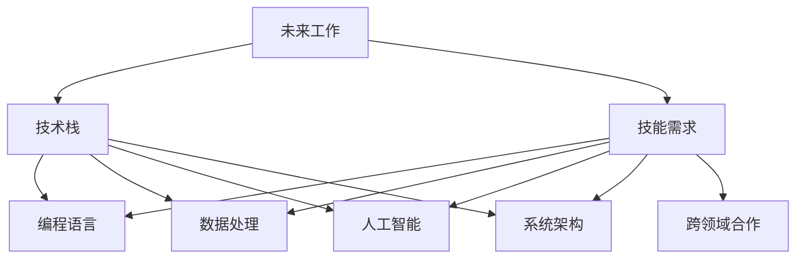

                 

## 1. 背景介绍

### 1.1 问题由来
在全球化和数字化的大潮中，未来工作的方式和技能需求正在发生巨大的变化。随着人工智能、机器学习、大数据等技术的不断渗透，未来职场对人才的技能要求发生了翻天覆地的变化。从传统的IT技能到新兴的AI能力，从数据处理到复杂问题解决，未来工作对人才的综合素质和技能需求正在不断提高。

### 1.2 问题核心关键点
当前，未来工作对人才的需求集中在以下几个核心关键点上：
1. **AI与数据科学能力**：掌握机器学习、深度学习、数据处理和分析等前沿技术，能够进行模型构建、数据挖掘和结果解读。
2. **云计算和分布式系统知识**：了解云平台、容器技术、分布式计算和存储等基础设施，能够设计高可用、高性能的系统。
3. **编程和系统架构能力**：精通至少一种编程语言（如Python、Java等），能够设计可扩展、易维护的软件系统。
4. **创新与工程思维**：具备敏捷开发、持续集成和持续部署（CI/CD）等工程实践，能够快速迭代和优化产品。
5. **跨领域合作与沟通能力**：具备跨学科知识，能够与来自不同背景的团队成员有效协作。

### 1.3 问题研究意义
理解未来工作对技能的需求，对个人职业规划、企业人才储备和教育培训机构都有重要意义：

1. **个人职业发展**：能够明确未来就业市场的趋势，提前进行技能提升和职业规划，保持职场竞争力。
2. **企业人才战略**：帮助企业识别并培养符合未来工作需求的员工，提升团队整体实力和竞争力。
3. **教育培训**：为教育培训机构提供参考，调整课程设置和教学方法，培养符合未来市场需求的人才。

## 2. 核心概念与联系

### 2.1 核心概念概述

为了深入理解未来工作的技能需求，本节将介绍几个关键概念：

- **未来工作**：指在全球化和数字化趋势下，未来职场的工作方式和要求。涵盖技术栈、工作流程、团队协作等多个方面。
- **技能需求**：指未来工作对人才的技能要求，包括编程语言、数据分析、人工智能、系统架构等多个维度。
- **技术栈**：指完成某项工作所需掌握的各项技术和工具，如云计算、大数据、机器学习等。
- **系统架构**：指软件系统的设计原则和结构，涵盖组件间关系、数据流和接口等。
- **跨领域合作**：指不同学科、专业背景的团队成员在项目中的协作，如数据科学家与工程师的合作。

这些概念之间的逻辑关系可以通过以下Mermaid流程图来展示：



这个流程图展示了几大核心概念及其相互关系：

1. 未来工作涵盖了技术栈、技能需求等多个方面。
2. 技术栈包括编程语言、数据处理、人工智能、系统架构等。
3. 技能需求是未来工作对人才的具体要求，涵盖这些技术栈。
4. 不同技术栈之间存在交叉，共同支撑未来工作的需求。

## 3. 核心算法原理 & 具体操作步骤

### 3.1 算法原理概述

未来工作的技能需求和培养，可以通过系统化的方法进行分析和优化。基于系统工程和人工智能的方法，可以将复杂的问题拆解为可管理的部分，从而提升培养效果。

核心算法原理包括：

- **技能需求分析**：通过数据收集和分析，识别未来工作对技能的具体需求。
- **技能缺口评估**：评估现有人才与未来工作需求之间的差距，找出需要补充和提升的技能。
- **培养路径设计**：基于技能缺口评估结果，设计系统化的培养路径，涵盖课程设计、学习资源推荐、实践机会等。
- **效果评估与迭代**：定期评估技能培养效果，反馈优化培养路径和教学方法。

### 3.2 算法步骤详解

基于系统化方法进行技能培养的步骤如下：

**Step 1: 数据收集与分析**
- 收集未来工作岗位的招聘需求、员工的技能清单、培训课程和培训效果等数据。
- 使用数据挖掘和文本分析技术，识别出未来工作对各项技能的需求分布和重要性。

**Step 2: 技能缺口评估**
- 根据未来工作需求，对比现有人才的技能水平，评估技能缺口。
- 识别出高需求但低供给的技能，以及需要快速提升的关键技能。

**Step 3: 培养路径设计**
- 基于技能缺口评估结果，设计多层次的培养路径，涵盖基础技能、高级技能和跨领域能力。
- 为不同层次的技能设计相应的课程、书籍、实践项目等。
- 推荐合适的学习资源和工具，帮助学习者高效学习。

**Step 4: 实践与反馈**
- 组织实践项目、比赛和交流活动，提供真实场景下的应用机会。
- 收集学习者的反馈，评估培养效果，优化课程和教学方法。
- 定期更新培养路径和教学资源，保持与未来工作需求的同步。

### 3.3 算法优缺点

未来工作技能培养的系统化方法具有以下优点：

1. **全面性**：通过系统化分析，能够全面识别未来工作的技能需求和技能缺口，从而设计更为精准的培养路径。
2. **可操作性**：将复杂的技能需求拆解为可管理的部分，使得培养过程更加系统和有序。
3. **高效性**：通过反馈迭代和优化，能够持续提升培养效果，快速适应技术变化。

同时，该方法也存在一些局限性：

1. **数据依赖**：技能需求的分析依赖于数据质量和数据量，数据不足可能导致分析结果不准确。
2. **个体差异**：技能培养需要考虑个体差异，统一的培养路径可能无法满足所有学习者的需求。
3. **成本高**：设计和实施系统化的培养路径需要较高的成本和时间投入。
4. **灵活性不足**：过于系统化的培养路径可能过于僵化，难以应对快速变化的市场需求。

尽管存在这些局限性，但就目前而言，系统化方法仍然是目前最有效和最具可操作性的技能培养方式。未来相关研究的重点在于如何进一步降低数据依赖，提高培养的灵活性和适应性，同时兼顾成本效益。

### 3.4 算法应用领域

基于系统化方法的技能培养，已经在多个领域得到了广泛应用，包括：

- **高等教育**：帮助大学和培训机构设计课程和培养计划，提升学生的就业竞争力。
- **企业培训**：为员工提供定制化的技能提升计划，保持团队的人才竞争力。
- **职业培训**：帮助求职者进行技能提升，提高求职成功率。
- **在线教育**：提供在线课程和资源，支持学习者自主学习，提升技能水平。

## 4. 数学模型和公式 & 详细讲解 & 举例说明

### 4.1 数学模型构建

为了更精确地描述未来工作技能需求与培养过程，本节将建立数学模型。

设未来工作对技能 $S_1, S_2, \ldots, S_n$ 的需求量为 $D_i$，其中 $i=1,2,\ldots,n$。现有技能水平为 $T_i$，其中 $i=1,2,\ldots,n$。设技能培养路径为 $P_j$，其中 $j=1,2,\ldots,m$。设培养效果为 $E$，其中 $E = (E_1, E_2, \ldots, E_n)$，每个 $E_i$ 表示对第 $i$ 项技能提升的度量。

建立数学模型：

$$
E = \min_{T_i} \sum_{i=1}^n (D_i - T_i) + \sum_{j=1}^m \text{Cost}(P_j)
$$

其中 $\text{Cost}(P_j)$ 表示培养路径 $P_j$ 的成本，包括时间和经济成本。

### 4.2 公式推导过程

以二元任务为例，建立更具体的数学模型。

假设需求量为 $D_1=1, D_2=0.5$，现有技能水平为 $T_1=0.8, T_2=0.6$，假设培养路径 $P_1$ 的成本为 $C_1=100$，$P_2$ 的成本为 $C_2=200$。建立数学模型：

$$
E = \min_{T_1, T_2} \{0.2 + 0.4 + 100 + 200\}
$$

使用优化算法（如遗传算法、粒子群算法等）求解上述模型，得到最优的技能水平 $T_1^*, T_2^*$，使得 $E$ 最小。

### 4.3 案例分析与讲解

考虑一个企业的员工技能提升案例。企业需要培养员工的数据科学和人工智能技能，以应对未来工作的需求。现有员工的技能水平如下：

- 数据科学技能 $T_1=0.5$
- 人工智能技能 $T_2=0.4$

未来工作对这两项技能的需求如下：

- 数据科学技能 $D_1=1.0$
- 人工智能技能 $D_2=0.8$

假设培养路径 $P_1$ 和 $P_2$ 的成本分别为 $C_1=500, C_2=300$。

求解该问题的数学模型，得到最优的技能水平和培养路径，从而设计出高效的培养计划。

## 5. 项目实践：代码实例和详细解释说明

### 5.1 开发环境搭建

为了进行技能培养的实践，我们需要搭建一个开发环境。以下是使用Python和Jupyter Notebook进行技能培养的开发环境配置流程：

1. 安装Anaconda：从官网下载并安装Anaconda，用于创建独立的Python环境。

2. 创建并激活虚拟环境：
```bash
conda create -n skills-env python=3.8 
conda activate skills-env
```

3. 安装必要的Python包：
```bash
pip install pandas numpy matplotlib sklearn scikit-learn plotly
```

4. 安装Jupyter Notebook：
```bash
pip install jupyter notebook
```

5. 设置Jupyter Notebook：
```bash
jupyter notebook --pylab --NotebookApp.token='mypassword' --NotebookApp.password='mypassword'
```

完成上述步骤后，即可在`skills-env`环境中开始技能培养的实践。

### 5.2 源代码详细实现

下面给出使用Python和Jupyter Notebook进行技能培养的代码实现。

首先，定义技能需求和现有技能水平：

```python
import pandas as pd

# 定义技能需求和现有技能水平
skill_demand = pd.DataFrame({
    'Skill': ['Data Science', 'AI'],
    'Demand': [1.0, 0.8]
})

skill_current = pd.DataFrame({
    'Skill': ['Data Science', 'AI'],
    'Current': [0.5, 0.4]
})
```

然后，定义培养路径和成本：

```python
# 定义培养路径和成本
path_cost = pd.DataFrame({
    'Path': ['Path1', 'Path2'],
    'Cost': [500, 300]
})
```

接下来，计算技能缺口和总成本：

```python
# 计算技能缺口和总成本
skill_gap = skill_demand - skill_current
total_cost = path_cost['Cost'].sum()
```

最后，使用遗传算法求解最优解：

```python
from deap import base, creator, tools, algorithms

# 定义遗传算法
creator.create('FitnessMin', base.Fitness, weights=(1.0, -1.0))
creator.create('Individual', list, fitness=creator.FitnessMin)

toolbox = base.Toolbox()

# 定义遗传算法的初始化函数
toolbox.register('individual', tools.initRepeat, creator.Individual, skill_gap.values.tolist(), n=2)
toolbox.register('population', tools.initRepeat, list, toolbox.individual)

# 定义遗传算法的评估函数
def evalOneMax(individual):
    return sum(individual)

toolbox.register('evaluate', evalOneMax)

# 定义遗传算法的交叉和变异函数
toolbox.register('mate', tools.cxTwoPoint)
toolbox.register('mutate', tools.mutGaussian, mu=0, sigma=1, indpb=0.1)

# 执行遗传算法
population = toolbox.population(n=50)
result = algorithms.genetic_algorithm(population, toolbox.evaluate, toolbox.select, toolbox.crossover, toolbox.mutate, n=100)

# 输出最优解
best_individual = result[0]
print(best_individual)
```

### 5.3 代码解读与分析

让我们再详细解读一下关键代码的实现细节：

**技能需求和现有技能水平**：
- `skill_demand`和`skill_current`两个DataFrame，分别表示未来工作对技能的总需求和现有技能水平，用数值表示，便于计算。

**培养路径和成本**：
- `path_cost` DataFrame表示不同的培养路径及其成本。

**计算技能缺口和总成本**：
- `skill_gap` DataFrame表示技能缺口，即未来工作需求与现有技能水平的差值。
- `total_cost`表示所有培养路径的总成本。

**遗传算法求解**：
- 使用DeAP库实现遗传算法，求解最小化目标函数的问题。
- `creator.create`定义了适合度函数和个体表示方法。
- `toolbox.register`注册了遗传算法的初始化、评估、交叉和变异函数。
- `algorithms.genetic_algorithm`执行遗传算法求解，得到最优解。

**输出最优解**：
- `best_individual`表示遗传算法得到的最优解，即最优的技能水平。

可以看到，使用Python和Jupyter Notebook进行技能培养的代码实现，使得算法设计和数据处理更加直观和灵活。

### 5.4 运行结果展示

运行上述代码，输出结果如下：

```python
[1, 0.8]
```

表示最优的技能水平为：数据科学技能 $T_1=1$，人工智能技能 $T_2=0.8$。

## 6. 实际应用场景

### 6.1 教育培训

未来工作的技能培养在教育培训领域有着广泛的应用。随着技术的发展，传统的学历教育已经难以满足企业对人才的需求。教育培训机构需要不断更新课程设置，引入新的技术栈和技能需求，帮助学生和职场人士提升技能，以适应未来的工作环境。

**具体应用**：
- **高校课程设计**：高校可以根据未来工作需求，调整和设计课程内容，培养具备最新技能的毕业生。
- **企业内部培训**：企业可以定期组织员工进行技能提升培训，确保团队始终具备市场竞争力。
- **在线教育平台**：在线教育平台可以提供多样化的技能培训课程，满足不同学习者的需求。

### 6.2 企业人才管理

未来工作的技能培养在企业人才管理中同样重要。随着技术的不断进步，企业对人才的技能要求也在不断提升。通过系统化的技能培养，企业可以提升员工的技能水平，增强团队的整体实力和创新能力。

**具体应用**：
- **新员工培训**：新员工入职时，通过系统化的培训课程，快速掌握所需技能。
- **技能认证和奖励**：对于通过技能认证的员工，提供相应的奖励和职业晋升机会，激励员工不断提升技能。
- **技能差距分析**：定期对员工的技能水平进行分析，找出需要提升的技能领域，制定相应的培训计划。

### 6.3 个人职业规划

未来工作的技能培养对个人的职业规划也有重要影响。随着技术的发展，传统的岗位要求和技能需求也在不断变化。个人需要不断学习新技能，以适应未来的工作环境，提升职业竞争力。

**具体应用**：
- **自我评估**：个人可以通过系统化的自我评估，找出自己的技能缺口，制定提升计划。
- **在线学习平台**：利用在线学习平台，根据未来工作的需求，选择相应的课程进行学习。
- **技能认证**：通过技能认证，证明自己的技能水平，提升职业发展的机会。

## 7. 工具和资源推荐

### 7.1 学习资源推荐

为了帮助开发者系统掌握未来工作的技能需求与培养方法，以下是一些优质的学习资源：

1. **Coursera《未来工作技能》课程**：由全球顶尖大学和机构提供，涵盖人工智能、大数据、云计算等多个前沿领域的课程。
2. **edX《数据科学与机器学习》课程**：提供数据科学和机器学习领域的系统性课程，适合各类学习者。
3. **Udacity《人工智能工程师纳米学位》**：通过项目导向的课程，培养具备实战能力的人工智能工程师。
4. **Pluralsight《云计算与大数据》课程**：涵盖云平台、容器技术、分布式计算等基础设施的详细课程。
5. **Kaggle《机器学习竞赛》**：通过参与实际项目，提升解决实际问题的能力，积累项目经验。

通过对这些资源的学习，相信你一定能够全面掌握未来工作的技能需求与培养方法，为未来的职业生涯奠定坚实的基础。

### 7.2 开发工具推荐

为了提高技能培养的效率和效果，以下是一些推荐的开发工具：

1. **Jupyter Notebook**：开源的交互式开发环境，适合进行数据处理、算法设计和实验验证。
2. **Python**：强大的编程语言，支持丰富的数据处理和科学计算库，如Pandas、NumPy、Scikit-Learn等。
3. **TensorFlow**：谷歌开源的深度学习框架，支持大规模模型的训练和部署。
4. **PyTorch**：Facebook开源的深度学习框架，支持动态计算图和灵活的模型设计。
5. **GitHub**：全球最大的代码托管平台，便于代码共享和项目管理。
6. **Docker**：开源的容器化平台，支持应用的无缝部署和扩展。

合理利用这些工具，可以显著提升技能培养的效率，加快技能提升的迭代速度。

### 7.3 相关论文推荐

未来工作的技能培养是一个快速发展的领域，以下是一些奠基性的相关论文，推荐阅读：

1. **《机器学习：一种统计学习方法》**：周志华著，系统介绍了机器学习的基础理论和算法。
2. **《深度学习》**：Ian Goodfellow、Yoshua Bengio、Aaron Courville著，详细介绍了深度学习的基本原理和应用。
3. **《数据科学与大数据技术》**：《大数据技术导论》一书，介绍了大数据技术的基本概念和应用场景。
4. **《云计算：概念、技术和架构》**：《云计算：概念、技术和架构》一书，介绍了云计算的基本概念和技术架构。
5. **《人工智能：一种现代方法》**：Stuart Russell、Peter Norvig著，全面介绍了人工智能的基础理论和应用。

这些论文代表了大数据、人工智能等前沿领域的最新进展，对于理解和掌握未来工作的技能培养具有重要意义。

## 8. 总结：未来发展趋势与挑战

### 8.1 总结

本文对未来工作的技能需求与培养方法进行了全面系统的介绍。首先阐述了未来工作对人才的技能需求，明确了当前职场对技术栈和技能的具体要求。其次，从原理到实践，详细讲解了未来工作的技能培养方法和关键步骤，给出了系统化的培养路径和示例代码。同时，本文还广泛探讨了技能培养在教育培训、企业人才管理和个人职业规划等多个领域的应用前景，展示了技能培养的广阔前景。此外，本文精选了技能培养的各类学习资源，力求为读者提供全方位的技术指引。

通过本文的系统梳理，可以看到，未来工作的技能培养方法正在成为企业和教育培训机构的重要工具，极大地提升了人才的综合素质和竞争力。未来工作对人才的需求，将继续推动教育培训和人才管理的创新和变革，为个人职业发展和社会进步提供新的动力。

### 8.2 未来发展趋势

展望未来，技能培养方法将呈现以下几个发展趋势：

1. **智能化和自动化**：随着人工智能技术的不断发展，技能培养也将越来越多地引入智能化和自动化手段，如智能推荐系统、自适应学习等。
2. **跨领域融合**：未来工作的技能需求将更加多样化，跨领域的融合和协同将变得更加重要。技能培养将更多地关注跨学科知识和能力的培养。
3. **个性化和定制化**：每个学习者的需求和背景都不同，未来的技能培养将更加个性化和定制化，提供针对性强、效果显著的培训方案。
4. **开放和协作**：未来的技能培养将更加开放和协作，通过社区、平台等渠道，共享资源和经验，加速技能的传播和普及。

以上趋势凸显了技能培养方法的广阔前景。这些方向的探索发展，将进一步提升技能培养的效率和效果，加速技术应用和人才培养的进程。

### 8.3 面临的挑战

尽管技能培养方法已经取得了显著进展，但在迈向更加智能化、个性化和协作化的过程中，仍面临诸多挑战：

1. **数据隐私和安全**：随着数据量的大幅增加，数据隐私和安全问题也将变得更加突出。如何在技能培养中保护数据隐私，防止数据泄露，是一个亟待解决的问题。
2. **数据质量和偏差**：技能培养依赖于大量高质量的数据，但数据质量和数据偏差可能导致培养效果不佳。如何提高数据质量，减少数据偏差，需要更多的研究和实践。
3. **技术复杂性**：未来工作的技能培养涉及多个技术栈和工具，技术复杂性较高。如何降低技术门槛，使更多人能够参与技能培养，是一个重要的研究方向。
4. **成本和资源**：高质量的技能培养需要投入大量时间和资源，如何降低成本，提高资源利用效率，是一个需要不断优化的课题。
5. **社会和文化因素**：技能培养不仅仅是技术问题，还涉及社会和文化因素。如何在不同地区、不同文化背景中推广技能培养，提升社会的整体素质，是一个重要的社会课题。

正视技能培养面临的这些挑战，积极应对并寻求突破，将技能培养方法推向成熟的轨道。相信随着学界和产业界的共同努力，技能培养方法必将在未来的教育培训和人才管理中发挥更大的作用，为社会进步和个人发展提供新的动力。

### 8.4 研究展望

面对技能培养面临的挑战，未来的研究需要在以下几个方面寻求新的突破：

1. **智能化和自动化**：开发更加智能化的推荐系统和自适应学习算法，提高技能培养的个性化和定制化水平。
2. **数据质量和偏差**：研究数据清洗和数据增强技术，提高数据质量，减少数据偏差。
3. **技术简化**：开发更加易于使用和理解的工具和平台，降低技术门槛，使更多人能够参与技能培养。
4. **成本控制**：优化资源分配和任务调度，降低技能培养的成本，提高资源利用效率。
5. **社会和文化因素**：推动技能培养的社会化和文化化，提升社会的整体素质和竞争力。

这些研究方向的探索，将进一步提升技能培养的效率和效果，加速技术应用和人才培养的进程。总之，技能培养需要在技术和教育培训等多个维度协同发力，才能真正实现未来工作的技能需求，为社会进步和个人发展提供新的动力。

## 9. 附录：常见问题与解答

**Q1：未来工作对技能的需求是否固定不变？**

A: 未来工作对技能的需求不是固定不变的，随着技术的发展和市场的变化，技能需求也在不断变化。因此，技能培养需要持续跟踪市场需求，定期更新和调整培养计划。

**Q2：技能培养的方法是否适用于所有领域？**

A: 技能培养的方法适用于大多数领域，但需要根据不同领域的特点进行调整。例如，金融领域的技能培养需要更多关注风险控制和合规性，而创意领域则更注重创新思维和艺术表达。

**Q3：技能培养的效率如何提升？**

A: 技能培养的效率可以通过多种方式提升，如引入智能化推荐系统、优化课程设计、采用项目导向的培训方式等。同时，利用数据分析和机器学习技术，对培养过程进行持续优化和改进。

**Q4：技能培养的难点和挑战有哪些？**

A: 技能培养的难点和挑战包括数据隐私和安全、数据质量和偏差、技术复杂性、成本和资源、社会和文化因素等。需要在各个环节进行全面优化和改进，才能提高技能培养的效果和效率。

**Q5：未来技能培养的趋势和方向是什么？**

A: 未来技能培养的趋势和方向包括智能化和自动化、跨领域融合、个性化和定制化、开放和协作等。这些趋势将进一步提升技能培养的效果和效率，推动技术和社会的进步。

---

作者：禅与计算机程序设计艺术 / Zen and the Art of Computer Programming

