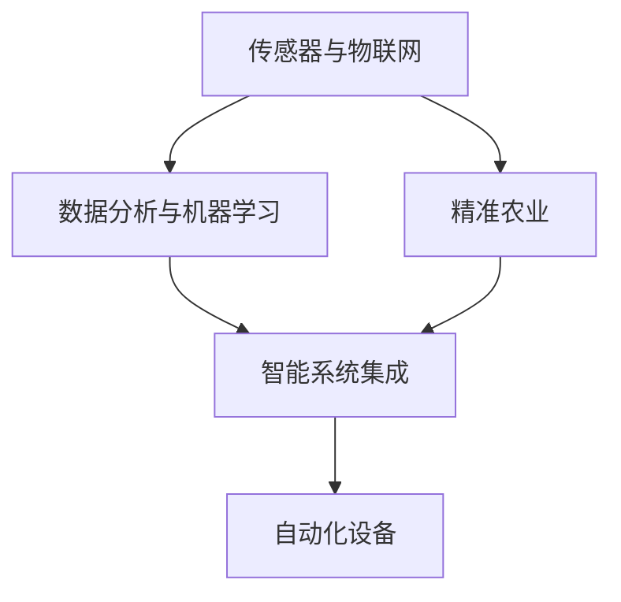
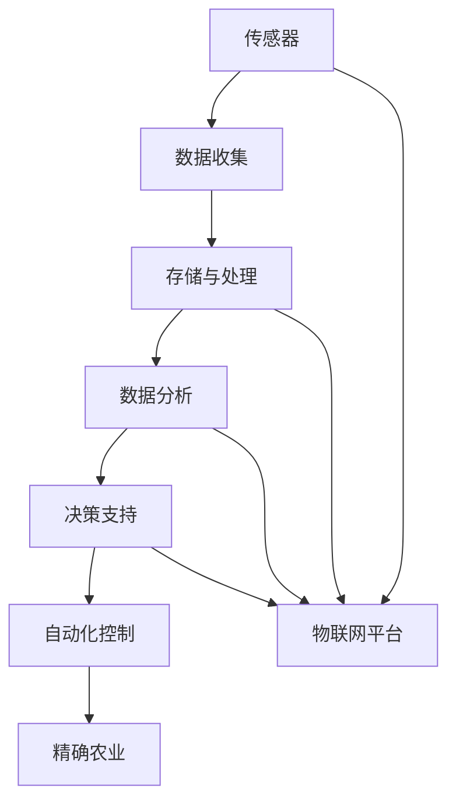

                 

# 未来的智慧农业：2050年的植物工厂与昆虫养殖

## 1. 背景介绍

### 1.1 问题由来

随着全球人口的持续增长和生态环境的日益严峻，可持续农业已成为全球关注的焦点。如何在有限的土地资源和不断变化的环境条件下，提高农业生产的效率和可持续性，是摆在全人类面前的重大挑战。2050年，农业的未来将不再只是传统的耕作和养殖，而是借助先进的信息技术和生物工程技术，实现智能化、自动化的智慧农业。

### 1.2 问题核心关键点

智慧农业的核心在于利用信息化手段对农业生产过程进行优化和智能化管理，包括但不限于以下几个关键点：

- **传感器与物联网**：通过传感器网络实时监测环境参数，如温度、湿度、光照、土壤湿度等，利用物联网技术实现数据收集和传输。
- **数据分析与机器学习**：对收集到的海量数据进行分析和挖掘，提取有用信息，预测和优化农业生产决策。
- **精准农业**：利用精确的数据分析结果，实施精确施肥、播种、灌溉等，提升资源利用效率。
- **自动化设备**：通过自动化机器人、无人机、自动驾驶车辆等技术，实现田间作业的自动化，减少人力成本。
- **智能系统集成**：将传感器、自动化设备和数据分析平台集成到一个统一的智慧农业平台，提供决策支持。

这些关键技术将在未来智慧农业中扮演重要角色，推动农业产业的革新与升级。

### 1.3 问题研究意义

研究智慧农业，对于提升农业生产效率、保障食品安全、改善生态环境、促进农村经济发展具有重要意义：

- 提高生产效率。通过精准农业和大数据分析，实现农业生产的智能化管理，减少资源浪费，提高生产效率。
- 保障食品安全。利用自动化和智能化手段，确保食品从源头到餐桌的安全性和质量。
- 改善生态环境。通过精准施肥、灌溉等措施，减少化肥和农药使用，降低对环境的污染。
- 促进经济发展。智慧农业能够提高农业产值，吸引更多年轻人回乡创业，促进农村经济发展。
- 支持可持续发展。智慧农业能够实现资源的高效利用，减少对环境的压力，支持可持续发展目标。

## 2. 核心概念与联系

### 2.1 核心概念概述

智慧农业涉及多个核心概念，包括但不限于：

- **物联网(IoT)**：通过传感器网络实时监测环境参数，利用互联网技术实现数据收集和传输。
- **数据分析与机器学习**：对收集到的海量数据进行分析和挖掘，提取有用信息，预测和优化农业生产决策。
- **精准农业**：利用精确的数据分析结果，实施精确施肥、播种、灌溉等，提升资源利用效率。
- **自动化设备**：通过自动化机器人、无人机、自动驾驶车辆等技术，实现田间作业的自动化，减少人力成本。
- **智能系统集成**：将传感器、自动化设备和数据分析平台集成到一个统一的智慧农业平台，提供决策支持。

这些概念之间的逻辑关系可以通过以下Mermaid流程图来展示：



### 2.2 核心概念原理和架构的 Mermaid 流程图



### 2.3 核心算法原理

智慧农业的核心算法原理主要基于物联网、数据分析与机器学习和自动化控制三个方向：

- **传感器与物联网**：通过部署各类传感器，实时监测环境参数，如温度、湿度、光照、土壤湿度等，并通过物联网平台实现数据的实时传输。
- **数据分析与机器学习**：利用数据分析技术，如统计分析、数据挖掘、时序分析等，提取有用的农业生产数据，结合机器学习模型，进行农业生产决策的预测与优化。
- **自动化控制**：利用自动化控制技术，如自动化机器人、无人机、自动驾驶车辆等，实现田间作业的自动化，减少人力成本。

这些算法和技术共同构成了智慧农业的运作框架，使得农业生产管理更加高效、精准和可持续。

## 3. 核心算法原理 & 具体操作步骤

### 3.1 算法原理概述

基于物联网的智慧农业算法原理主要包括以下几个关键步骤：

1. **数据采集**：通过传感器网络实时监测环境参数，如温度、湿度、光照、土壤湿度等，并通过物联网平台实现数据的实时传输。
2. **数据存储与处理**：将采集到的数据存储在云端，利用数据分析技术，如统计分析、数据挖掘、时序分析等，提取有用的农业生产数据。
3. **机器学习模型训练**：利用机器学习算法，如回归分析、分类算法、深度学习等，对数据进行分析，预测和优化农业生产决策。
4. **自动化控制**：利用自动化控制技术，如自动化机器人、无人机、自动驾驶车辆等，实现田间作业的自动化，减少人力成本。
5. **智能决策支持**：将数据分析和机器学习的结果集成到一个统一的智慧农业平台，提供决策支持，实现精准农业和智能化管理。

### 3.2 算法步骤详解

以下以植物工厂为例，详细说明智慧农业的算法步骤：

1. **传感器部署与数据采集**：在植物工厂内安装各类传感器，如温度传感器、湿度传感器、光照传感器、土壤湿度传感器等，实时监测环境参数。将采集到的数据通过物联网平台传输到云端。

2. **数据存储与处理**：将采集到的数据存储在云端数据库中，利用数据分析技术，如统计分析、数据挖掘、时序分析等，提取有用的农业生产数据。例如，统计每天各时间段的光照强度，分析土壤湿度变化趋势等。

3. **机器学习模型训练**：利用机器学习算法，如回归分析、分类算法、深度学习等，对数据进行分析，预测和优化农业生产决策。例如，使用回归模型预测温度、湿度对植物生长的影响，优化灌溉和施肥策略。

4. **自动化控制**：利用自动化控制技术，如自动化机器人、无人机、自动驾驶车辆等，实现田间作业的自动化。例如，通过自动驾驶车辆进行精准施肥、播种、灌溉等。

5. **智能决策支持**：将数据分析和机器学习的结果集成到一个统一的智慧农业平台，提供决策支持，实现精准农业和智能化管理。例如，通过数据分析平台实时监控植物生长状态，自动调整环境参数，优化生产流程。

### 3.3 算法优缺点

智慧农业的算法具有以下优点：

- **提高生产效率**：通过精准农业和大数据分析，实现农业生产的智能化管理，减少资源浪费，提高生产效率。
- **保障食品安全**：利用自动化和智能化手段，确保食品从源头到餐桌的安全性和质量。
- **改善生态环境**：通过精准施肥、灌溉等措施，减少化肥和农药使用，降低对环境的污染。
- **促进经济发展**：智慧农业能够提高农业产值，吸引更多年轻人回乡创业，促进农村经济发展。
- **支持可持续发展**：智慧农业能够实现资源的高效利用，减少对环境的压力，支持可持续发展目标。

同时，智慧农业的算法也存在以下缺点：

- **初期成本高**：智慧农业需要大量投资建设传感器网络、自动化设备、数据分析平台等，初期成本较高。
- **技术复杂度高**：智慧农业涉及多学科技术，技术复杂度高，需要专业技术人员进行维护和管理。
- **数据安全问题**：智慧农业依赖大量数据，数据安全和隐私保护成为重要问题。
- **对环境变化的适应性**：智慧农业依赖于稳定的环境参数，对于极端天气、自然灾害等环境变化的适应性较差。

### 3.4 算法应用领域

智慧农业的算法技术在多个领域得到应用，包括但不限于：

- **植物工厂**：通过智能监控和自动化控制，实现植物生长的精准管理，提高产量和质量。
- **昆虫养殖**：利用传感器和自动化设备，监测昆虫的生长状态和环境参数，优化养殖条件。
- **精准农业**：利用数据分析和机器学习技术，优化施肥、播种、灌溉等农业生产决策，提高资源利用效率。
- **智能农场**：将传感器、自动化设备和数据分析平台集成到一个统一的智慧农业平台，提供决策支持，实现农业生产的自动化和智能化。

## 4. 数学模型和公式 & 详细讲解 & 举例说明

### 4.1 数学模型构建

智慧农业的数学模型构建主要基于物联网数据和机器学习技术。假设植物工厂的环境参数数据为 $x_1, x_2, ..., x_n$，植物的生长状态数据为 $y_1, y_2, ..., y_m$。则智慧农业的数学模型可以表示为：

$$
y = f(x)
$$

其中 $f$ 为机器学习模型，将环境参数数据映射到植物的生长状态数据。

### 4.2 公式推导过程

以植物生长的回归模型为例，假设模型为线性回归模型，则公式为：

$$
y = \beta_0 + \beta_1 x_1 + \beta_2 x_2 + ... + \beta_n x_n + \epsilon
$$

其中 $\beta_0, \beta_1, ..., \beta_n$ 为回归系数，$\epsilon$ 为随机误差项。

通过最小二乘法，求解回归系数 $\beta$ 的值，使得模型能够最小化预测误差，具体公式为：

$$
\beta = (X^TX)^{-1}X^Ty
$$

其中 $X = [1, x_1, x_2, ..., x_n]^T$，$y = [y_1, y_2, ..., y_m]^T$。

### 4.3 案例分析与讲解

以植物生长的回归模型为例，假设某植物工厂每天记录了温度、湿度、光照等环境参数，以及相应的植物生长状态数据。利用上述回归模型，可以预测环境参数对植物生长的影响，优化灌溉和施肥策略，提高植物生长速度和产量。

## 5. 项目实践：代码实例和详细解释说明

### 5.1 开发环境搭建

进行智慧农业项目实践，需要搭建一个完整的开发环境，包括以下几个步骤：

1. **安装Python环境**：确保Python版本为3.7以上，安装必要的第三方库，如pandas、numpy、scikit-learn等。
2. **部署传感器网络**：安装各类传感器，如温度传感器、湿度传感器、光照传感器等，通过物联网平台实现数据的实时传输。
3. **搭建数据存储与处理平台**：利用云存储服务（如AWS S3、Google Cloud Storage等）搭建数据存储平台，安装数据分析工具（如Apache Spark、Hadoop等），进行数据的存储与处理。
4. **搭建机器学习平台**：利用机器学习框架（如TensorFlow、PyTorch等）搭建机器学习平台，训练和部署各种机器学习模型。
5. **搭建自动化控制平台**：利用自动化控制技术，如自动驾驶车辆、无人机等，实现田间作业的自动化。

### 5.2 源代码详细实现

以下以植物生长的回归模型为例，给出使用Python进行回归模型训练的代码实现。

```python
import pandas as pd
from sklearn.linear_model import LinearRegression

# 读取数据
data = pd.read_csv('plant_growth.csv')

# 划分数据集
X = data[['temperature', 'humidity', 'light_intensity']]
y = data['growth_rate']

# 训练线性回归模型
model = LinearRegression()
model.fit(X, y)

# 预测新数据
new_data = pd.DataFrame({'temperature': 25, 'humidity': 60, 'light_intensity': 500})
predicted_growth_rate = model.predict(new_data)
```

### 5.3 代码解读与分析

上述代码中，首先使用pandas库读取植物生长的数据集，划分出特征数据 $X$ 和标签数据 $y$。然后，利用scikit-learn库中的线性回归模型进行训练，使用训练好的模型对新数据进行预测。

## 6. 实际应用场景

### 6.1 植物工厂

植物工厂是智慧农业的重要应用场景之一，通过智能监控和自动化控制，实现植物生长的精准管理，提高产量和质量。在植物工厂中，传感器网络实时监测环境参数，如温度、湿度、光照等，利用物联网平台实现数据的实时传输。通过数据分析和机器学习技术，预测和优化灌溉和施肥策略，提高资源利用效率，实现自动化控制，减少人力成本。

### 6.2 昆虫养殖

昆虫养殖是智慧农业的另一个重要应用场景。利用传感器和自动化设备，监测昆虫的生长状态和环境参数，优化养殖条件，提高养殖效率和昆虫品质。通过数据分析和机器学习技术，预测昆虫的生长周期和环境参数之间的关系，优化养殖流程，提高养殖成功率。

### 6.3 精准农业

精准农业是智慧农业的重要组成部分，通过数据分析和机器学习技术，优化施肥、播种、灌溉等农业生产决策，提高资源利用效率。利用传感器网络实时监测土壤湿度、温度、光照等环境参数，利用物联网平台实现数据的实时传输。通过数据分析和机器学习技术，预测和优化农业生产决策，实现精准农业。

### 6.4 智能农场

智能农场是智慧农业的最终目标，将传感器、自动化设备和数据分析平台集成到一个统一的智慧农业平台，提供决策支持，实现农业生产的自动化和智能化。通过传感器网络实时监测环境参数，利用物联网平台实现数据的实时传输。通过数据分析和机器学习技术，预测和优化农业生产决策，实现精准农业。

## 7. 工具和资源推荐

### 7.1 学习资源推荐

为帮助开发者系统掌握智慧农业的技术，推荐以下学习资源：

1. **《智慧农业导论》**：全面介绍智慧农业的基本概念、技术体系和应用场景，适合初学者入门。
2. **《农业物联网与大数据》**：介绍物联网、大数据在农业中的应用，结合实际案例，讲解数据分析与机器学习技术。
3. **《Python数据科学手册》**：系统介绍Python在数据分析与机器学习中的应用，提供丰富的代码实例。
4. **Coursera《智慧农业》课程**：斯坦福大学开设的智慧农业课程，涵盖物联网、数据分析、机器学习等多个方面的知识。
5. **Udemy《智慧农业技术》课程**：由智慧农业专家授课，涵盖传感器、自动化控制、数据分析等多个方面的知识。

### 7.2 开发工具推荐

以下是几款用于智慧农业开发的常用工具：

1. **IoT平台**：如ThingWorx、ThingSpeak等，实现传感器数据的实时传输和存储。
2. **数据分析工具**：如Apache Spark、Hadoop等，进行大数据分析和处理。
3. **机器学习框架**：如TensorFlow、PyTorch等，搭建机器学习模型。
4. **自动化控制工具**：如Arduino、Raspberry Pi等，实现田间作业的自动化。
5. **可视化工具**：如Tableau、Power BI等，对数据进行可视化展示。

### 7.3 相关论文推荐

智慧农业的发展离不开学界的持续研究。以下是几篇奠基性的相关论文，推荐阅读：

1. **《农业物联网数据挖掘与知识发现》**：介绍农业物联网数据的挖掘与知识发现技术，提升农业生产的智能化管理。
2. **《基于机器学习的精准农业研究》**：探讨机器学习在精准农业中的应用，提高农业生产的效率和可持续性。
3. **《智慧农业中的自动化控制技术》**：介绍自动化控制技术在智慧农业中的应用，实现田间作业的自动化。
4. **《智慧农业中的大数据分析与决策支持》**：探讨大数据分析与决策支持技术在智慧农业中的应用，提供决策支持。

## 8. 总结：未来发展趋势与挑战

### 8.1 研究成果总结

智慧农业的研究成果主要集中在以下几个方面：

- **传感器与物联网技术**：实现环境参数的实时监测和数据的实时传输。
- **数据分析与机器学习技术**：利用数据分析和机器学习技术，优化农业生产决策，提高资源利用效率。
- **自动化控制技术**：利用自动化控制技术，实现田间作业的自动化，减少人力成本。
- **智能决策支持平台**：将传感器、自动化设备和数据分析平台集成到一个统一的智慧农业平台，提供决策支持，实现精准农业和智能化管理。

### 8.2 未来发展趋势

未来智慧农业的发展趋势主要包括：

1. **传感器与物联网技术的发展**：随着物联网技术的不断进步，传感器网络将更加智能化和精确化，实现环境参数的实时监测和数据的实时传输。
2. **数据分析与机器学习技术的进步**：随着机器学习算法的不断发展，数据分析和预测能力将更加强大，实现更加精准的农业生产决策。
3. **自动化控制技术的应用**：随着自动化控制技术的不断进步，田间作业的自动化程度将进一步提高，减少人力成本，提高生产效率。
4. **智能决策支持平台的发展**：随着智能决策支持平台技术的不断进步，智慧农业将更加智能化和集成化，实现精准农业和智能化管理。

### 8.3 面临的挑战

智慧农业的发展面临以下挑战：

1. **技术复杂度高**：智慧农业涉及多学科技术，技术复杂度高，需要专业技术人员进行维护和管理。
2. **初期成本高**：智慧农业需要大量投资建设传感器网络、自动化设备、数据分析平台等，初期成本较高。
3. **数据安全问题**：智慧农业依赖大量数据，数据安全和隐私保护成为重要问题。
4. **对环境变化的适应性**：智慧农业依赖于稳定的环境参数，对于极端天气、自然灾害等环境变化的适应性较差。

### 8.4 研究展望

未来智慧农业的研究方向主要包括：

1. **数据隐私保护**：研究如何保护智慧农业数据的安全和隐私，保障数据的安全传输和存储。
2. **低成本传感器技术**：研究低成本、高精度的传感器技术，降低智慧农业的初期投资成本。
3. **环境适应性**：研究如何增强智慧农业对极端天气和自然灾害的适应性，提高系统的鲁棒性。
4. **跨领域融合**：研究如何与其他技术领域（如区块链、物联网、大数据等）进行跨领域融合，提升智慧农业的智能化水平。

## 9. 附录：常见问题与解答

### Q1: 智慧农业的核心技术是什么？

A: 智慧农业的核心技术包括物联网、数据分析与机器学习、自动化控制和智能决策支持。这些技术共同构成了智慧农业的运作框架，使得农业生产管理更加高效、精准和可持续。

### Q2: 智慧农业与传统农业有何区别？

A: 智慧农业通过利用信息化手段对农业生产过程进行优化和智能化管理，相比传统农业，具有更高的生产效率、更好的资源利用效率和更强的环境适应能力。

### Q3: 智慧农业的初期投资成本是否过高？

A: 智慧农业的初期投资成本较高，需要大量投资建设传感器网络、自动化设备、数据分析平台等。但随着技术进步和规模效应，后期运营成本将逐渐降低，投资回报率将逐渐提高。

### Q4: 智慧农业的决策支持平台如何搭建？

A: 智慧农业的决策支持平台需要搭建数据存储与处理平台、机器学习平台和自动化控制平台，集成各类传感器、自动化设备和数据分析工具，实现数据的收集、存储、分析和可视化展示。

---

作者：禅与计算机程序设计艺术 / Zen and the Art of Computer Programming

