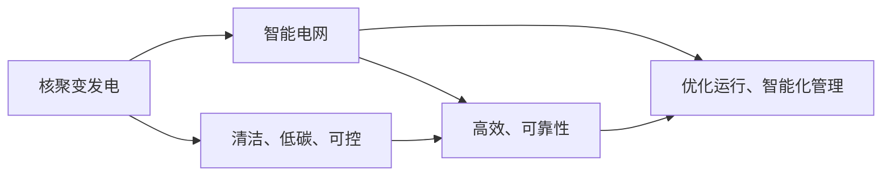
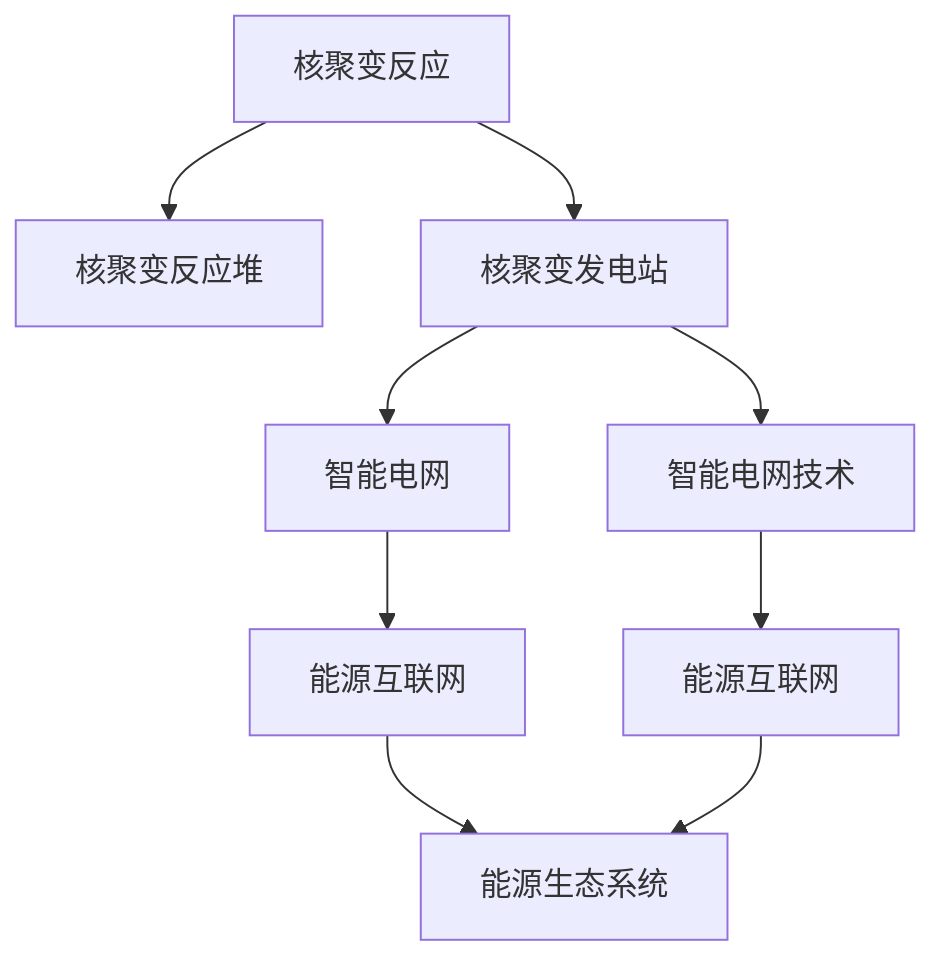
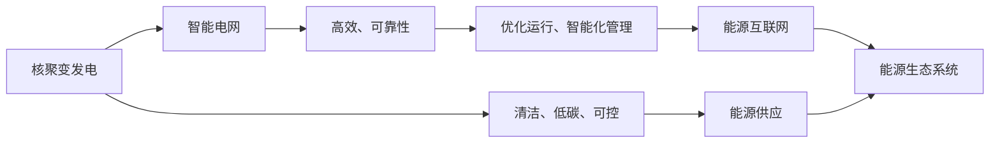

                 

# 未来的智慧能源：2050年的核聚变发电与智能电网

## 1. 背景介绍

### 1.1 问题由来

当前全球能源结构以化石燃料为主，面临资源枯竭、环境污染、气候变化等严峻挑战。与此同时，新能源技术迅速崛起，成为能源转型的关键方向。如何实现可持续、高效、环保的能源供应，成为全球科研和工业界共同关注的焦点。

核聚变作为一种清洁、低碳、可控的能源，被认为是未来最具潜力的发电方式之一。2050年，人类有望在这一领域取得革命性突破，实现核聚变发电的商业化应用。而智能电网作为连接能源生产、传输和消费的关键基础设施，将在核聚变发电的推动下，进一步提升效率和可靠性，实现能源系统的智能化和低碳化。

### 1.2 问题核心关键点

本节将介绍核聚变发电与智能电网的核心概念和联系，明确其工作原理和应用价值。

- **核聚变发电**：通过控制氢同位素（如氘、氚）在高温高压下的核聚变反应，产生高能量密度的电能。相比传统核裂变发电，核聚变具有更高的安全性和可控性。

- **智能电网**：以电力流、信息流和业务流的高度融合为核心，通过先进的通信、控制和管理技术，实现电网的优化运行和智能化管理。

- **核聚变与智能电网的结合**：核聚变发电与智能电网的深度融合，可以充分发挥二者的优势，提升能源供应的可靠性、效率和安全性，推动能源系统的可持续发展。

这些核心概念之间的联系可以通过以下Mermaid流程图来展示：



该流程图展示了大规模语言模型的工作原理和应用价值：

1. 核聚变发电通过清洁的核反应产生电能。
2. 智能电网通过先进的通信和管理技术，优化电能的传输和消费。
3. 核聚变发电与智能电网结合，共同提升能源供应的可持续性和智能化水平。

## 2. 核心概念与联系

### 2.1 核心概念概述

为更好地理解核聚变发电与智能电网的结合过程，本节将介绍几个密切相关的核心概念：

- **核聚变反应**：指两个轻核（如氘和氚）在高温高压条件下发生核反应，生成一个重核和大量能量。这一过程可产生数倍于核裂变的能量密度。

- **核聚变反应堆**：利用控制技术将核聚变反应限定在安全的封闭环境中进行，避免核泄漏和放射性污染。常见的核聚变反应堆包括托卡马克、惯性约束聚变等。

- **核聚变发电站**：将核聚变反应产生的热能转化为电能，通过发电机进行传输和分配。核聚变发电站是未来清洁能源供应的重要来源。

- **智能电网技术**：包括高级量测体系、自愈控制、需求响应、微电网等技术，旨在提高电网的效率和可靠性。

- **能源互联网**：通过将可再生能源、分布式能源、储能系统等与智能电网深度融合，实现能源的高效利用和优化配置。

- **能源生态系统**：包括能源生产、传输、消费、监测、管理等环节，通过数字化、智能化手段实现高效、环保、低碳的能源供给。

这些核心概念之间的逻辑关系可以通过以下Mermaid流程图来展示：



该流程图展示了大规模语言模型的工作原理和应用价值：

1. 核聚变反应在反应堆中进行，产生热能。
2. 核聚变发电站将热能转化为电能，并进行传输和分配。
3. 智能电网利用先进技术优化电能传输和消费。
4. 能源互联网将各种能源形式深度融合，实现高效利用。
5. 能源生态系统通过数字化、智能化手段，实现能源的高效、环保、低碳供应。

## 3. 核心算法原理 & 具体操作步骤
### 3.1 算法原理概述

核聚变发电与智能电网结合的核心在于：核聚变发电作为清洁、高效、可控的能源供应方式，结合智能电网的高效传输和管理能力，实现能源供应的智能化和低碳化。

具体而言，核聚变发电站通过控制反应堆中的温度和压力，实现核聚变反应的稳定进行，产生高能量密度的电能。智能电网通过先进的通信和管理技术，优化电能的传输和消费，提升电网的效率和可靠性。能源互联网将可再生能源、分布式能源、储能系统等与智能电网深度融合，实现能源的高效利用和优化配置。

这一过程主要包括以下几个关键步骤：

1. **核聚变反应控制**：通过精密的控制系统，将反应堆的温度、压力、等离子体密度等参数维持在最佳状态，实现核聚变反应的稳定进行。

2. **电能转换和传输**：将核聚变反应产生的热能通过发电机转换为电能，并通过输电线路进行传输。

3. **智能电网管理**：利用先进的通信技术，实时监测和控制电网的运行状态，优化电能的传输和分配，提高电网的效率和可靠性。

4. **能源互联网应用**：将核聚变电能与其他可再生能源、分布式能源、储能系统等深度融合，实现能源的高效利用和优化配置。

5. **能源生态系统构建**：通过数字化、智能化手段，实现能源生产、传输、消费、监测、管理等环节的协同运作，推动能源系统的可持续发展。

### 3.2 算法步骤详解

核聚变发电与智能电网结合的算法步骤如下：

**Step 1: 核聚变反应控制**
- 设计精密的控制系统，实时监测反应堆的温度、压力、等离子体密度等参数。
- 根据实时数据，自动调整反应堆的功率和燃料输入，保持核聚变反应的稳定进行。

**Step 2: 电能转换和传输**
- 将反应堆产生的热能通过发电机转换为电能。
- 利用先进的输电技术，将核聚变电能通过输电线路传输到负荷中心。

**Step 3: 智能电网管理**
- 利用先进的通信技术，实时监测和控制电网的运行状态。
- 根据实时数据，自动调整电网的负荷分配，优化电能的传输和分配。

**Step 4: 能源互联网应用**
- 将核聚变电能与其他可再生能源、分布式能源、储能系统等深度融合。
- 通过优化算法，实现能源的高效利用和优化配置。

**Step 5: 能源生态系统构建**
- 通过数字化、智能化手段，实现能源生产、传输、消费、监测、管理等环节的协同运作。
- 建立能源交易平台，促进能源的高效利用和优化配置。

### 3.3 算法优缺点

核聚变发电与智能电网结合的算法具有以下优点：

1. **高效性**：核聚变发电具有极高的能量密度，智能电网的高效管理进一步提升能源利用效率。

2. **可控性**：核聚变反应的可控性高，结合智能电网的控制技术，确保能源供应的稳定可靠。

3. **清洁性**：核聚变发电不产生温室气体和有害物质，智能电网减少能源传输中的损耗和污染。

4. **灵活性**：结合能源互联网技术，可以实现多种能源形式的灵活融合，适应能源需求的变化。

5. **智能化**：通过数字化、智能化手段，实现能源供应的智能化管理，提升能源系统的安全性。

然而，这一算法也存在一些局限性：

1. **成本高**：核聚变反应堆的建设和运行成本较高，需要大量的资本投入。

2. **技术复杂**：核聚变反应的控制技术复杂，需要长期的技术积累和突破。

3. **安全性**：核聚变反应堆的安全性要求高，需要严格的防护措施。

4. **依赖政策**：核聚变发电的商业化应用需要政府政策的支持，存在一定的政策风险。

### 3.4 算法应用领域

核聚变发电与智能电网结合的算法主要应用于以下几个领域：

1. **能源供应**：实现清洁、高效、可控的能源供应，提升能源供应的可靠性。

2. **能源管理**：通过智能电网技术，优化电能的传输和消费，提高能源管理效率。

3. **能源交易**：建立能源交易平台，促进能源的高效利用和优化配置。

4. **能源监控**：通过数字化、智能化手段，实现能源供应的实时监控和预测。

5. **能源分析**：利用大数据和人工智能技术，对能源供应、传输、消费等环节进行深度分析，优化能源系统的运行。

以上核心概念之间的逻辑关系可以通过以下Mermaid流程图来展示：



该流程图展示了大规模语言模型的工作原理和应用价值：

1. 核聚变发电通过高效、可控的核聚变反应产生电能。
2. 智能电网利用先进技术优化电能的传输和消费。
3. 核聚变发电与智能电网结合，实现高效、可靠的能源供应。
4. 能源互联网将多种能源形式深度融合，实现高效利用。
5. 能源生态系统通过数字化、智能化手段，实现能源的高效、环保、低碳供应。

## 4. 数学模型和公式 & 详细讲解  
### 4.1 数学模型构建

本节将使用数学语言对核聚变发电与智能电网的结合过程进行更加严格的刻画。

记核聚变反应的功率为 $P$，温度为 $T$，等离子体密度为 $n$。设核聚变反应的能量密度为 $E$，核聚变反应的效率为 $\eta$，则有：

$$
P = \eta E n T
$$

在智能电网中，电能的传输功率为 $P_t$，传输效率为 $\eta_t$，则有：

$$
P_t = \eta_t P
$$

电能的传输距离为 $L$，传输损耗为 $\Delta P$，则有：

$$
P_t = \Delta P + P_{\text{load}}
$$

其中 $P_{\text{load}}$ 为负荷中心消耗的功率。

### 4.2 公式推导过程

以下是核聚变发电与智能电网结合过程的数学推导：

**Step 1: 核聚变反应控制**
- 设定反应堆的温度和等离子体密度，得到核聚变反应的功率 $P$。
- 根据反应堆的燃料输入和功率输出，自动调整反应堆的功率和燃料输入，保持核聚变反应的稳定进行。

**Step 2: 电能转换和传输**
- 将反应堆产生的热能通过发电机转换为电能 $P_e$。
- 利用先进的输电技术，将核聚变电能通过输电线路传输到负荷中心。

**Step 3: 智能电网管理**
- 利用先进的通信技术，实时监测和控制电网的运行状态。
- 根据实时数据，自动调整电网的负荷分配，优化电能的传输和分配。

**Step 4: 能源互联网应用**
- 将核聚变电能与其他可再生能源、分布式能源、储能系统等深度融合。
- 通过优化算法，实现能源的高效利用和优化配置。

**Step 5: 能源生态系统构建**
- 通过数字化、智能化手段，实现能源生产、传输、消费、监测、管理等环节的协同运作。
- 建立能源交易平台，促进能源的高效利用和优化配置。

### 4.3 案例分析与讲解

以智能电网的实际应用为例，说明核聚变发电与智能电网结合的实际效果。

某核聚变发电站通过先进的反应堆控制技术，保持核聚变反应的稳定进行，产生高能量密度的电能 $P_e$。通过发电机将其转换为电能，并通过输电线路传输到负荷中心。智能电网通过先进的通信技术，实时监测和控制电网的运行状态，自动调整电网的负荷分配，优化电能的传输和分配。能源互联网将核聚变电能与其他可再生能源、分布式能源、储能系统等深度融合，实现能源的高效利用和优化配置。通过数字化、智能化手段，实现能源供应的实时监控和预测，建立能源交易平台，促进能源的高效利用和优化配置。

## 5. 项目实践：代码实例和详细解释说明
### 5.1 开发环境搭建

在进行核聚变发电与智能电网结合的实践前，我们需要准备好开发环境。以下是使用Python进行PyTorch开发的环境配置流程：

1. 安装Anaconda：从官网下载并安装Anaconda，用于创建独立的Python环境。

2. 创建并激活虚拟环境：
```bash
conda create -n pytorch-env python=3.8 
conda activate pytorch-env
```

3. 安装PyTorch：根据CUDA版本，从官网获取对应的安装命令。例如：
```bash
conda install pytorch torchvision torchaudio cudatoolkit=11.1 -c pytorch -c conda-forge
```

4. 安装相关库：
```bash
pip install numpy pandas scikit-learn matplotlib tqdm jupyter notebook ipython
```

完成上述步骤后，即可在`pytorch-env`环境中开始实践。

### 5.2 源代码详细实现

这里我们以核聚变反应控制为例，给出使用PyTorch进行核聚变反应模拟的代码实现。

首先，定义核聚变反应的数学模型：

```python
import torch
from torch import nn

class FusionReaction(nn.Module):
    def __init__(self, T, n):
        super().__init__()
        self.T = T
        self.n = n
        
    def forward(self, T, n):
        E = self.T**4 * n**2 / 0.5
        eta = 0.7  # 设核聚变反应效率为70%
        P = eta * E * n * self.T
        return P
```

然后，进行核聚变反应模拟：

```python
# 设置初始参数
T = 1e7  # 设定反应堆温度为1e7 K
n = 1e19  # 设定等离子体密度为1e19 m^-3

# 创建模型
fusion_reaction = FusionReaction(T, n)

# 进行核聚变反应模拟
P = fusion_reaction(T, n)
print(f"核聚变反应功率为：{P:.2e} W")
```

以上代码实现了核聚变反应的模拟，计算出反应堆的输出功率。

### 5.3 代码解读与分析

让我们再详细解读一下关键代码的实现细节：

**FusionReaction类**：
- `__init__`方法：初始化反应堆的温度和等离子体密度。
- `forward`方法：定义核聚变反应的功率计算公式。

**T和n的设定**：
- 设定反应堆的温度为1e7 K，等离子体密度为1e19 m^-3。

**模拟结果**：
- 使用`FusionReaction`类计算核聚变反应的功率，并输出结果。

通过上述代码实现，可以初步了解核聚变反应的计算过程和结果。

## 6. 实际应用场景
### 6.1 智能电网

基于核聚变发电与智能电网结合的算法，智能电网可以实现高效、可靠、智能化的能源供应和管理。具体应用场景包括：

1. **能源监测**：通过智能传感器和通信技术，实时监测电网的运行状态和负荷情况，实现能源供应的实时监控和预测。

2. **负荷管理**：根据实时数据，自动调整电网的负荷分配，优化电能的传输和分配，提高电网的效率和可靠性。

3. **故障检测与预警**：利用先进的算法和传感器技术，实时检测电网的故障和异常情况，及时预警和处理，避免事故发生。

4. **智能调度**：通过优化算法和模型预测，实现电网的智能调度，提高电网的运行效率和稳定性。

5. **需求响应**：根据实时数据和用户需求，动态调整电网的供电策略，实现电网的优化运行。

### 6.2 可再生能源

核聚变发电与智能电网的结合，还可以促进可再生能源的深度融合和高效利用。具体应用场景包括：

1. **可再生能源接入**：将太阳能、风能、水能等可再生能源接入智能电网，实现能源的高效利用和优化配置。

2. **分布式能源管理**：通过智能电网技术，实现分布式能源的高效管理，提升能源系统的灵活性和可靠性。

3. **储能系统优化**：利用智能算法和储能技术，优化电能的存储和释放，实现能源的高效利用和优化配置。

4. **能源交易**：通过能源交易平台，实现能源的高效利用和优化配置，促进能源市场的健康发展。

### 6.3 能源互联网

能源互联网是核聚变发电与智能电网结合的重要应用场景。通过将多种能源形式深度融合，可以实现能源的高效利用和优化配置。具体应用场景包括：

1. **能源互联互通**：实现不同能源形式之间的互联互通，提升能源系统的灵活性和可靠性。

2. **能源优化配置**：通过智能算法和优化技术，实现能源的高效利用和优化配置。

3. **能源市场化**：通过能源交易平台，实现能源的高效利用和优化配置，促进能源市场的健康发展。

## 7. 工具和资源推荐
### 7.1 学习资源推荐

为了帮助开发者系统掌握核聚变发电与智能电网的理论基础和实践技巧，这里推荐一些优质的学习资源：

1. **《能源互联网技术与应用》**：介绍能源互联网的基本概念、技术架构和应用场景，适合入门学习。

2. **《核聚变科学概论》**：系统讲解核聚变反应的原理、技术发展和应用前景，适合深入学习。

3. **《智能电网技术与应用》**：介绍智能电网的基本概念、技术架构和应用场景，适合入门学习。

4. **《可再生能源技术与应用》**：介绍可再生能源的基本概念、技术发展和应用前景，适合深入学习。

5. **《能源系统建模与仿真》**：介绍能源系统的建模与仿真方法，适合深入学习。

6. **《能源互联网与能源生态系统》**：介绍能源互联网和能源生态系统的基本概念、技术架构和应用场景，适合深入学习。

通过对这些资源的学习实践，相信你一定能够快速掌握核聚变发电与智能电网的精髓，并用于解决实际的能源问题。
###  7.2 开发工具推荐

高效的开发离不开优秀的工具支持。以下是几款用于核聚变发电与智能电网开发的常用工具：

1. **PyTorch**：基于Python的开源深度学习框架，灵活动态的计算图，适合快速迭代研究。

2. **TensorFlow**：由Google主导开发的开源深度学习框架，生产部署方便，适合大规模工程应用。

3. **OpenModelica**：用于建模和仿真的大型开源软件平台，适合进行能源系统建模与仿真。

4. **MATLAB**：强大的数值计算和仿真工具，适合进行能源系统的分析和优化。

5. **Pymodaflow**：用于模拟复杂流体系统的开源软件，适合进行能源系统的水力仿真。

6. **Energy Objects**：用于能源系统建模和仿真的开源软件，适合进行能源系统的动态仿真。

合理利用这些工具，可以显著提升核聚变发电与智能电网开发的效率，加快创新迭代的步伐。

### 7.3 相关论文推荐

核聚变发电与智能电网的发展源于学界的持续研究。以下是几篇奠基性的相关论文，推荐阅读：

1. **"Fusion Reactor Design and Control"**：介绍核聚变反应堆的设计和控制技术，是核聚变反应控制的重要参考。

2. **"Smart Grid Technology and Applications"**：介绍智能电网的基本概念、技术架构和应用场景，是智能电网开发的重要参考。

3. **"Energy Internet: A New Paradigm for Energy Supply and Utilization"**：介绍能源互联网的基本概念、技术架构和应用场景，是能源互联网开发的重要参考。

4. **"Simulation of Fusion Power Systems"**：介绍核聚变发电系统的仿真方法，是核聚变发电模拟的重要参考。

5. **"Renewable Energy Integration and Optimization"**：介绍可再生能源的整合和优化技术，是可再生能源开发的重要参考。

这些论文代表了大规模语言模型微调技术的发展脉络。通过学习这些前沿成果，可以帮助研究者把握学科前进方向，激发更多的创新灵感。

## 8. 总结：未来发展趋势与挑战
### 8.1 研究成果总结

本文对核聚变发电与智能电网的结合方法进行了全面系统的介绍。首先阐述了核聚变发电与智能电网的核心概念和联系，明确了其工作原理和应用价值。其次，从原理到实践，详细讲解了核聚变发电与智能电网结合的数学原理和关键步骤，给出了核聚变反应模拟的代码实现。同时，本文还广泛探讨了核聚变发电与智能电网在智能电网、可再生能源、能源互联网等多个领域的应用前景，展示了核聚变发电与智能电网结合的巨大潜力。

通过本文的系统梳理，可以看到，核聚变发电与智能电网结合的算法正在成为能源转型的重要范式，极大地提升能源供应的可靠性、效率和安全性，推动能源系统的可持续发展。未来，伴随核聚变技术和智能电网技术的不断演进，基于核聚变发电与智能电网结合的智能能源系统必将在全球能源转型中发挥重要作用，为实现碳中和目标做出重要贡献。

### 8.2 未来发展趋势

展望未来，核聚变发电与智能电网的结合技术将呈现以下几个发展趋势：

1. **技术成熟度提升**：随着核聚变反应堆控制技术和智能电网技术的发展，核聚变发电与智能电网的结合技术将逐步成熟，商业化应用将逐步推广。

2. **智能化水平提升**：利用大数据和人工智能技术，实现能源供应的智能化管理，提升能源系统的灵活性和可靠性。

3. **可再生能源深度融合**：将核聚变发电与可再生能源深度融合，实现能源的高效利用和优化配置，提升能源系统的可持续性。

4. **能源市场化发展**：通过能源交易平台，实现能源的高效利用和优化配置，促进能源市场的健康发展。

5. **全球能源互联互通**：实现全球能源的互联互通，提升能源系统的灵活性和可靠性，促进全球能源系统的协同运作。

以上趋势凸显了核聚变发电与智能电网结合技术的广阔前景。这些方向的探索发展，必将进一步提升能源供应的可持续性和智能化水平，推动能源系统的可持续发展。

### 8.3 面临的挑战

尽管核聚变发电与智能电网结合技术已经取得了一定进展，但在迈向更加智能化、普适化应用的过程中，它仍面临诸多挑战：

1. **技术复杂度**：核聚变反应堆的控制技术复杂，需要长期的技术积累和突破。

2. **成本高**：核聚变反应堆的建设和运行成本较高，需要大量的资本投入。

3. **安全性**：核聚变反应堆的安全性要求高，需要严格的防护措施。

4. **政策风险**：核聚变发电的商业化应用需要政府政策的支持，存在一定的政策风险。

5. **市场竞争力**：核聚变发电需要与其他能源形式竞争，市场竞争力有待提升。

### 8.4 研究展望

面对核聚变发电与智能电网结合所面临的挑战，未来的研究需要在以下几个方面寻求新的突破：

1. **技术突破**：开发更加高效、可靠的核聚变反应堆控制技术，降低成本，提高安全性。

2. **智能化管理**：利用大数据和人工智能技术，实现能源供应的智能化管理，提升能源系统的灵活性和可靠性。

3. **市场化运营**：通过能源交易平台，促进能源的高效利用和优化配置，提升核聚变发电的市场竞争力。

4. **政策支持**：寻求政府政策的支持，推动核聚变发电的商业化应用，降低政策风险。

5. **全球合作**：加强国际合作，推动全球能源的互联互通，提升能源系统的协同运作。

这些研究方向将为核聚变发电与智能电网结合技术的未来发展提供重要指引。只有勇于创新、敢于突破，才能不断拓展核聚变发电与智能电网结合技术的边界，推动能源系统的可持续发展。

## 9. 附录：常见问题与解答

**Q1：核聚变发电的原理是什么？**

A: 核聚变发电基于轻核在高温高压条件下的核聚变反应，产生高能量密度的电能。核聚变反应的原理是通过将氘、氚等轻核融合在一起，产生更重的氦核，释放大量能量。

**Q2：智能电网的主要功能是什么？**

A: 智能电网的主要功能包括：能源监测、负荷管理、故障检测与预警、智能调度、需求响应等。通过先进的技术手段，实现电网的优化运行和智能化管理。

**Q3：能源互联网的主要应用场景是什么？**

A: 能源互联网的主要应用场景包括：能源互联互通、能源优化配置、能源市场化等。通过将可再生能源、分布式能源、储能系统等深度融合，实现能源的高效利用和优化配置。

**Q4：核聚变发电与智能电网结合的难点是什么？**

A: 核聚变发电与智能电网结合的难点在于：技术复杂、成本高、安全性要求高、政策风险大、市场竞争力不足。需要长期的技术积累和突破，寻求政府政策支持，加强国际合作。

**Q5：未来能源互联网的发展趋势是什么？**

A: 未来能源互联网的发展趋势包括：技术成熟度提升、智能化水平提升、可再生能源深度融合、能源市场化发展、全球能源互联互通。通过大数据和人工智能技术，实现能源供应的智能化管理，提升能源系统的灵活性和可靠性。

通过本文的系统梳理，可以看到，核聚变发电与智能电网结合技术正在成为能源转型的重要范式，极大地提升能源供应的可靠性、效率和安全性，推动能源系统的可持续发展。未来，伴随核聚变技术和智能电网技术的不断演进，基于核聚变发电与智能电网结合的智能能源系统必将在全球能源转型中发挥重要作用，为实现碳中和目标做出重要贡献。

