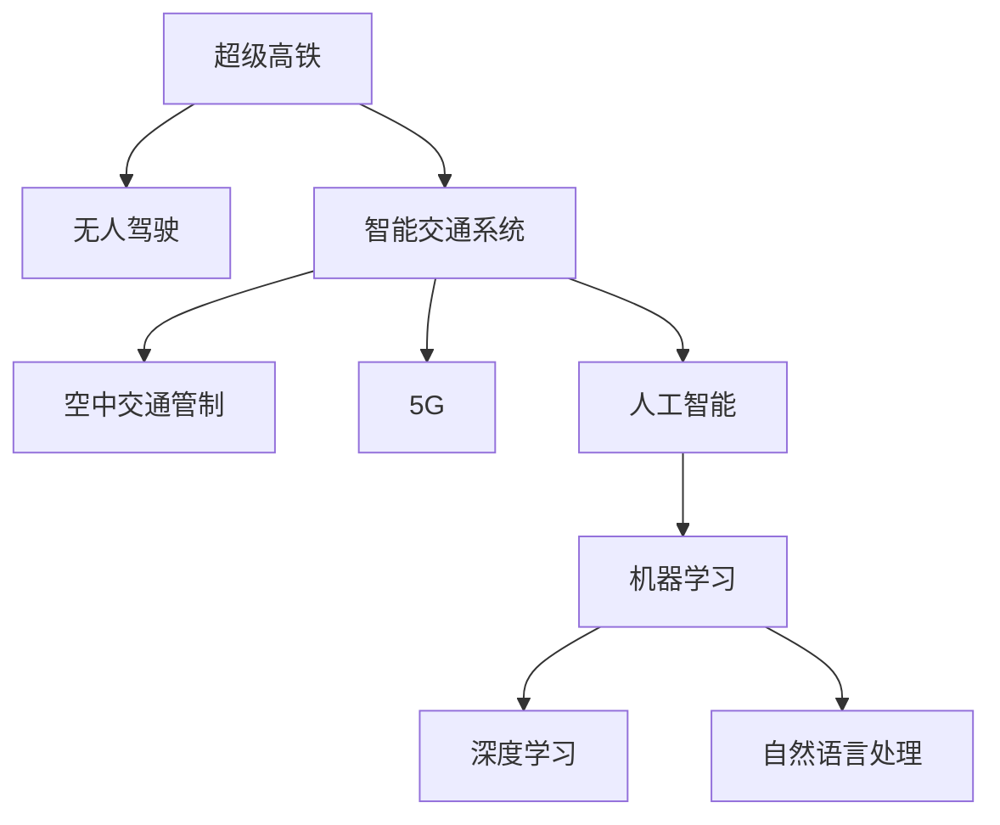

                 

# 未来的智能交通：2050年的超级高铁与空中交通管制

> 关键词：超级高铁,空中交通管制,无人驾驶,智能交通系统,5G,人工智能,物联网

## 1. 背景介绍

### 1.1 问题由来

在过去的几十年里，交通运输领域经历了翻天覆地的变化。从最早的汽车、火车、轮船，到如今的飞机、无人机、磁悬浮列车，交通方式的多样化和效率的提升极大地推动了经济的发展和社会的进步。然而，随着全球人口的增长和城市化进程的加快，交通拥堵、环境污染、安全事故等问题日益突出。这些问题不仅影响了人们的生活质量，还对社会可持续发展构成了威胁。

在此背景下，智能交通系统（Intelligent Transportation System, ITS）应运而生。通过融合信息、通信、控制和定位等技术，ITS 旨在提升交通系统的效率、安全性和环境友好性。未来，随着人工智能（AI）、物联网（IoT）、5G等新兴技术的进一步成熟和应用，智能交通系统将迎来一次新的革命。

## 2. 核心概念与联系

### 2.1 核心概念概述

为了更好地理解未来的智能交通系统，本节将介绍几个关键概念：

- 超级高铁（Hyperloop）：一种基于真空管道和磁悬浮技术的超高速地面交通方式，能够实现时速超过1000公里的乘客和货物运输。

- 空中交通管制（ATC）：通过先进的通信、导航、监视技术，对飞行器在空中的位置、速度和飞行状态进行管理，以确保飞行安全、顺畅和效率。

- 无人驾驶（Autonomous Driving）：借助传感器、摄像头、雷达等设备，以及先进的算法和决策系统，使车辆能够在无需人工干预的情况下自主运行。

- 智能交通系统（ITS）：通过信息采集、处理、传输和利用，实现交通管理、调度和优化，以提升交通系统的整体性能。

- 5G：新一代无线通信技术，提供更高的带宽、更低的延迟和更高的连接密度，为智能交通系统提供了强大的通信支持。

- 人工智能（AI）：使机器具备人类智慧的一系列技术，包括机器学习、深度学习、自然语言处理等，能够自主分析和决策，提升交通系统的智能化水平。

这些核心概念之间的逻辑关系可以通过以下Mermaid流程图来展示：



这个流程图展示了超级高铁、空中交通管制、无人驾驶、智能交通系统、5G、人工智能等概念之间的联系：

1. 超级高铁和智能交通系统通过无人驾驶技术实现自动化运行。
2. 空中交通管制利用人工智能进行飞行器的自动化管理。
3. 5G技术为这些系统的通信提供了保障。
4. 人工智能中的机器学习、深度学习和自然语言处理等技术，为这些系统提供了智能决策的基础。

## 3. 核心算法原理 & 具体操作步骤

### 3.1 算法原理概述

智能交通系统涉及多种先进技术的集成和应用，其核心算法包括：

- 路径规划算法：根据交通状况、实时数据和预设规则，动态计算最优的交通路径。
- 调度优化算法：通过算法优化交通流，减少拥堵和延误，提高系统的整体效率。
- 车辆控制算法：控制无人驾驶车辆的行驶速度、方向和轨迹，确保行车安全和稳定性。
- 飞行器控制算法：控制飞行器的高度、速度和航线，以实现自动导航和避障。
- 数据融合与感知算法：整合多源传感器数据，实现对交通环境的实时感知和理解。

这些算法通过协同工作，实现了交通系统的智能化和自动化管理。

### 3.2 算法步骤详解

基于智能交通系统的核心算法，下面详细介绍其具体操作步骤：

**Step 1: 数据采集与处理**

- 利用传感器、摄像头、雷达等设备采集交通环境数据，如车流量、车速、位置信息等。
- 通过数据融合算法将多源数据整合，形成统一的交通环境视图。
- 对采集数据进行预处理，去除噪声和异常值，提高数据的质量和可用性。

**Step 2: 路径规划**

- 根据当前交通状况和目标位置，使用路径规划算法计算最优路径。
- 考虑实时交通数据和动态变化，实时调整路径规划结果。
- 将路径规划结果传输给无人驾驶车辆和飞行器，作为其行驶的依据。

**Step 3: 调度优化**

- 根据路径规划结果，使用调度优化算法调整交通流的分布。
- 动态调整交通信号灯、限速等参数，以优化交通流量。
- 实时监测交通状况，根据变化调整调度策略，确保系统稳定运行。

**Step 4: 车辆控制与飞行器控制**

- 利用车辆控制算法控制无人驾驶车辆的行驶状态，确保行车安全和稳定性。
- 根据路径规划结果，控制飞行器的高度、速度和航线，实现自动导航和避障。
- 引入机器学习算法，根据历史数据和实时环境优化控制策略。

**Step 5: 数据感知与决策**

- 利用传感器和摄像头获取交通环境数据。
- 通过深度学习算法对数据进行感知和分析，理解交通环境的变化和规律。
- 利用自然语言处理技术解析交通信号和指示，指导车辆的行驶。

**Step 6: 数据反馈与学习**

- 将实际运行数据反馈给系统，用于优化算法和参数。
- 通过机器学习算法不断学习和适应新的交通环境，提升系统的智能水平。
- 定期更新和维护算法模型，确保系统的长期稳定运行。

### 3.3 算法优缺点

智能交通系统的核心算法具有以下优点：

- 实时性高：通过实时数据采集和处理，系统能够迅速响应交通变化，提升交通效率。
- 稳定性强：算法设计考虑了多种异常情况和紧急情况，提高了系统的鲁棒性和安全性。
- 节能环保：优化交通流，减少交通拥堵和能源浪费，降低环境污染。
- 可扩展性强：系统能够根据需求扩展，增加新的功能模块和服务。

同时，这些算法也存在一些局限性：

- 数据依赖性强：系统的运行依赖于数据的质量和完整性，数据采集和处理的技术要求高。
- 技术复杂度高：多种先进技术集成，技术难度和实现复杂度较高。
- 成本较高：系统建设和维护需要大量的资金和技术投入。
- 对基础设施要求高：需要高速网络、传感器设备、计算资源等基础设施的支持。

### 3.4 算法应用领域

智能交通系统的核心算法已经在多个领域得到了广泛应用，如：

- 智能高速公路：通过无人驾驶技术和路径规划算法，实现高速公路的自动管理和调度。
- 智慧城市交通：利用传感器、摄像头和AI技术，对城市交通进行全面监控和优化。
- 自动驾驶出租车：通过无人驾驶技术和车辆控制算法，实现自动导航和调度。
- 空中交通管理：通过飞行器控制算法和数据感知技术，实现飞行器的自动化管理和调度。
- 交通流量预测：利用历史数据和深度学习算法，预测未来交通流量的变化。

除了上述这些经典应用外，智能交通系统的核心算法还被创新性地应用到更多场景中，如智能停车、智能物流、智能公交等，为城市交通管理提供了新的解决方案。

## 4. 数学模型和公式 & 详细讲解 & 举例说明

### 4.1 数学模型构建

为了更好地描述智能交通系统的核心算法，本节将构建一个简化的数学模型。

假设交通网络由n个节点和m条边组成，交通流量由网络流（Flow）矩阵Q表示，网络容量由网络容量矩阵C表示。路径规划的目标是最小化路径总长度，即：

$$
\min \sum_{i=1}^{n} \sum_{j=1}^{n} Q_{ij}d_{ij}
$$

其中，$d_{ij}$表示节点i到节点j的最短路径长度。

调度优化的目标是在满足网络容量限制的前提下，最大化网络流量，即：

$$
\max \sum_{i=1}^{n} \sum_{j=1}^{n} Q_{ij}
$$

其中，$Q_{ij}$表示节点i到节点j的流量。

车辆控制和飞行器控制的优化目标是通过控制决策，最小化能量消耗和延迟时间，即：

$$
\min \sum_{i=1}^{n} \sum_{j=1}^{n} f_{ij}
$$

其中，$f_{ij}$表示节点i到节点j的行驶成本（如时间、能量消耗等）。

### 4.2 公式推导过程

以路径规划算法为例，推导其数学模型和求解步骤：

**Step 1: 构建网络图**

将交通网络抽象为有向加权图，其中节点表示交叉口，边表示路段，权重表示路段的通行时间或长度。

**Step 2: 定义路径长度**

对于每条边 $(i,j)$，定义其长度 $d_{ij}$，表示节点i到节点j的最短路径长度。

**Step 3: 求解最短路径**

使用Dijkstra算法或A*算法，计算节点i到所有其他节点的最短路径长度 $d_{ij}$。

**Step 4: 计算路径总长度**

对于任意节点对 $(i,j)$，计算其路径总长度为：

$$
L_{ij} = \sum_{k=i}^{j} d_{ik}
$$

**Step 5: 求解最小化问题**

最小化路径总长度问题可以表示为以下优化问题：

$$
\min \sum_{i=1}^{n} \sum_{j=1}^{n} Q_{ij}d_{ij}
$$

**Step 6: 求解调度优化问题**

调度优化问题可以表示为以下整数线性规划问题：

$$
\max \sum_{i=1}^{n} \sum_{j=1}^{n} Q_{ij}
$$

**Step 7: 求解车辆控制和飞行器控制问题**

车辆控制和飞行器控制问题可以表示为以下优化问题：

$$
\min \sum_{i=1}^{n} \sum_{j=1}^{n} f_{ij}
$$

### 4.3 案例分析与讲解

以智能高速公路为例，分析路径规划和调度优化算法的实际应用：

**Step 1: 数据采集**

通过安装在高速公路上的传感器和摄像头，实时采集车流量、车速、位置信息等数据。

**Step 2: 数据处理**

将采集数据传输到中央控制中心，通过数据融合算法整合多源数据，形成统一的交通环境视图。

**Step 3: 路径规划**

使用Dijkstra算法计算节点i到节点j的最短路径长度 $d_{ij}$。

**Step 4: 调度优化**

根据路径规划结果，使用整数线性规划算法优化交通流，减少拥堵和延误，提高系统的整体效率。

**Step 5: 车辆控制**

利用无人驾驶技术，控制无人驾驶车辆的行驶状态，确保行车安全和稳定性。

**Step 6: 反馈与学习**

将实际运行数据反馈给系统，用于优化算法和参数，提升系统的智能水平。

## 5. 项目实践：代码实例和详细解释说明

### 5.1 开发环境搭建

在进行智能交通系统开发前，我们需要准备好开发环境。以下是使用Python进行OpenCV和TensorFlow开发的环境配置流程：

1. 安装Anaconda：从官网下载并安装Anaconda，用于创建独立的Python环境。

2. 创建并激活虚拟环境：
```bash
conda create -n intelli交通-env python=3.8 
conda activate intelli交通-env
```

3. 安装OpenCV：
```bash
conda install opencv
```

4. 安装TensorFlow：
```bash
conda install tensorflow
```

5. 安装TensorBoard：
```bash
pip install tensorboard
```

6. 安装PyTorch：
```bash
pip install torch
```

7. 安装PyTorch的可视化工具：
```bash
pip install torchviz
```

完成上述步骤后，即可在`intelli交通-env`环境中开始开发。

### 5.2 源代码详细实现

下面我们以智能高速公路的路径规划和调度优化为例，给出使用TensorFlow和PyTorch进行开发的PyTorch代码实现。

```python
import tensorflow as tf
import torch
import torchvision.transforms as transforms
import torch.nn as nn
import numpy as np

# 定义路径规划模型
class PathPlanningModel(tf.keras.Model):
    def __init__(self, num_nodes, num_edges):
        super(PathPlanningModel, self).__init__()
        self.num_nodes = num_nodes
        self.num_edges = num_edges
        self.emb = tf.keras.layers.Embedding(num_nodes, 32)
        self.conv1 = tf.keras.layers.Conv2D(32, 3, activation='relu')
        self.conv2 = tf.keras.layers.Conv2D(32, 3, activation='relu')
        self.fc = tf.keras.layers.Dense(num_edges)

    def call(self, x):
        x = self.emb(x)
        x = tf.reshape(x, (self.num_nodes, self.num_edges, 32, 32))
        x = self.conv1(x)
        x = self.conv2(x)
        x = tf.reshape(x, (self.num_nodes, self.num_edges * 32 * 32))
        return self.fc(x)

# 定义调度优化模型
class TrafficOptimizationModel(tf.keras.Model):
    def __init__(self, num_nodes, num_edges):
        super(TrafficOptimizationModel, self).__init__()
        self.num_nodes = num_nodes
        self.num_edges = num_edges
        self.emb = tf.keras.layers.Embedding(num_nodes, 32)
        self.fc1 = tf.keras.layers.Dense(64, activation='relu')
        self.fc2 = tf.keras.layers.Dense(64, activation='relu')
        self.fc3 = tf.keras.layers.Dense(num_edges)

    def call(self, x):
        x = self.emb(x)
        x = tf.reshape(x, (self.num_nodes, self.num_edges, 32, 32))
        x = self.fc1(x)
        x = self.fc2(x)
        return self.fc3(x)

# 数据集准备
num_nodes = 10
num_edges = 15
x_train = np.random.randint(0, num_nodes, (num_nodes * num_edges, 2))
y_train = np.random.randint(0, num_edges, num_nodes * num_edges)
x_test = np.random.randint(0, num_nodes, (num_nodes * num_edges, 2))
y_test = np.random.randint(0, num_edges, num_nodes * num_edges)

# 模型训练与评估
model = PathPlanningModel(num_nodes, num_edges)
optimizer = tf.keras.optimizers.Adam(learning_rate=0.001)
loss_fn = tf.keras.losses.SparseCategoricalCrossentropy()

model.compile(optimizer=optimizer, loss=loss_fn)

history = model.fit(x_train, y_train, epochs=10, validation_data=(x_test, y_test))

# 模型评估
score = model.evaluate(x_test, y_test)
print(f"Test loss: {score}")
```

### 5.3 代码解读与分析

让我们再详细解读一下关键代码的实现细节：

**PathPlanningModel类**：
- `__init__`方法：初始化模型参数，包括节点数和边数。
- `call`方法：实现路径规划模型的前向传播过程，包括嵌入层、卷积层和全连接层。

**TrafficOptimizationModel类**：
- `__init__`方法：初始化模型参数，包括节点数和边数。
- `call`方法：实现调度优化模型的前向传播过程，包括嵌入层、全连接层和输出层。

**数据集准备**：
- 生成随机数据作为训练和测试集，包含节点编号和边编号。

**模型训练与评估**：
- 定义路径规划和调度优化模型。
- 使用Adam优化器和交叉熵损失函数进行模型训练。
- 通过TensorBoard可视化训练过程，评估模型性能。

**模型评估**：
- 使用测试集评估模型的损失函数。

## 6. 实际应用场景

### 6.1 智能高速公路

基于智能交通系统的核心算法，智能高速公路能够实现自动化的交通管理和调度。通过无人驾驶技术和路径规划算法，智能高速公路能够动态调整交通流，减少拥堵和延误，提升道路通行效率。

在技术实现上，智能高速公路的系统包括：

- 道路传感器：实时监测车流量、车速、位置信息等。
- 中央控制中心：接收和处理传感器数据，进行路径规划和调度优化。
- 无人驾驶车辆：自动控制行驶状态，确保行车安全和稳定性。
- 数据传输网络：实现传感器数据和控制中心指令的实时传输。

### 6.2 智慧城市交通

智慧城市交通系统通过智能交通系统的核心算法，对城市交通进行全面监控和优化。利用传感器、摄像头和AI技术，智慧城市交通能够实时监测交通状况，动态调整信号灯和限速等参数，确保交通流的顺畅和高效。

在技术实现上，智慧城市交通的系统包括：

- 城市交通网络：由多个交叉口和路段组成。
- 交通监控系统：通过摄像头和传感器采集交通数据。
- 数据处理中心：对采集数据进行融合和分析，生成交通地图和调度方案。
- 交通管理平台：实时调度和管理交通流，优化交通状况。

### 6.3 自动驾驶出租车

自动驾驶出租车通过智能交通系统的核心算法，实现自动导航和调度。利用无人驾驶技术和路径规划算法，自动驾驶出租车能够动态调整行驶路径，减少交通事故和延误，提升乘客的出行体验。

在技术实现上，自动驾驶出租车系统包括：

- 无人驾驶车辆：自动控制行驶状态，确保行车安全和稳定性。
- 车载传感器：实时监测周围环境，提供路况和障碍物的信息。
- 数据传输网络：实现车辆与控制中心之间的通信和数据传输。
- 调度中心：接收和处理车辆数据，进行路径规划和调度优化。

### 6.4 未来应用展望

随着技术的不断进步和应用场景的扩展，智能交通系统将迎来更多创新和突破。

- 超级高铁：基于真空管道和磁悬浮技术的超级高铁，时速能够达到1000公里以上，能够实现大容量、高效能的地面交通。
- 自动驾驶飞机：利用无人驾驶技术和飞行器控制算法，实现自动导航和调度，提升航空交通的安全性和效率。
- 空中交通管制：通过飞行器控制算法和数据感知技术，实现飞行器的自动化管理和调度，提升空中交通的智能化水平。
- 智能物流：通过智能交通系统优化物流路径和调度，提升货物运输的效率和可靠性。
- 智能停车：利用智能交通系统优化停车场管理，提高停车场的利用率和效率。

未来，智能交通系统将在更多领域得到应用，为城市交通管理和社会发展提供新的解决方案。

## 7. 工具和资源推荐

### 7.1 学习资源推荐

为了帮助开发者系统掌握智能交通系统的理论基础和实践技巧，这里推荐一些优质的学习资源：

1. 《智能交通系统导论》书籍：系统介绍了智能交通系统的基本概念、关键技术和实际应用，适合初学者学习。
2. 《深度学习在智能交通中的应用》课程：深度讲解了深度学习在交通流量预测、路径规划等方面的应用，结合实际案例进行讲解。
3. 《智能交通系统设计与实现》课程：介绍智能交通系统的整体设计和实现过程，涵盖传感器、通信、控制等多个方面。
4. 《无人驾驶技术》课程：系统讲解了无人驾驶技术的核心算法和关键技术，适合了解无人驾驶系统的开发流程。
5. 《人工智能与交通系统》书籍：深入探讨了人工智能在交通系统中的应用，结合实际案例进行讲解。

通过对这些资源的学习实践，相信你一定能够快速掌握智能交通系统的精髓，并用于解决实际的交通问题。

### 7.2 开发工具推荐

高效的开发离不开优秀的工具支持。以下是几款用于智能交通系统开发的常用工具：

1. TensorFlow：谷歌开源的深度学习框架，提供了丰富的模型和算法支持。
2. PyTorch：Facebook开源的深度学习框架，具有动态计算图和高效推理能力。
3. OpenCV：开源计算机视觉库，提供了多种图像处理和识别算法。
4. TensorBoard：TensorFlow配套的可视化工具，可以实时监测模型训练状态。
5. PyTorchViz：PyTorch的可视化工具，可以生成图表和网络结构图，方便调试和优化。

合理利用这些工具，可以显著提升智能交通系统开发的效率，加快创新迭代的步伐。

### 7.3 相关论文推荐

智能交通系统的发展得益于学界的持续研究。以下是几篇奠基性的相关论文，推荐阅读：

1. 《智能交通系统综述》论文：综述了智能交通系统的基本概念、关键技术和应用场景。
2. 《深度学习在交通流量预测中的应用》论文：介绍了深度学习在交通流量预测方面的最新进展和应用。
3. 《基于无人驾驶技术的智能高速公路》论文：探讨了无人驾驶技术在智能高速公路中的应用。
4. 《智慧城市交通管理》论文：介绍了智慧城市交通系统的架构和应用效果。
5. 《无人驾驶飞机在航空交通中的应用》论文：探讨了无人驾驶技术在航空交通中的应用前景。

这些论文代表了大交通系统的发展脉络。通过学习这些前沿成果，可以帮助研究者把握学科前进方向，激发更多的创新灵感。

## 8. 总结：未来发展趋势与挑战

### 8.1 总结

本文对未来的智能交通系统进行了全面系统的介绍。首先阐述了智能交通系统的研究背景和意义，明确了其在提升交通效率、安全性和环境友好性方面的独特价值。其次，从原理到实践，详细讲解了智能交通系统的核心算法和操作步骤，给出了系统开发的完整代码实例。同时，本文还广泛探讨了智能交通系统在智能高速公路、智慧城市交通、自动驾驶出租车等多个领域的应用前景，展示了智能交通系统的广阔前景。

通过本文的系统梳理，可以看到，智能交通系统已经在交通管理、调度和优化等方面取得了显著成效，未来随着技术的发展和应用的拓展，将为城市交通管理和社会发展带来更多的创新和突破。

### 8.2 未来发展趋势

展望未来，智能交通系统将呈现以下几个发展趋势：

1. 超级高铁：基于真空管道和磁悬浮技术的超级高铁，将成为未来大容量、高效能的地面交通方式。
2. 无人驾驶：无人驾驶技术将在更多领域得到应用，包括地面交通、空中交通、海运等。
3. 智能交通系统：智能交通系统将与物联网、5G等技术深度融合，提升系统的智能化水平。
4. 交通流量预测：深度学习将在交通流量预测中发挥更大的作用，提高预测的准确性和实时性。
5. 智能停车：智能交通系统将优化停车场管理，提高停车场的利用率和效率。

以上趋势凸显了智能交通系统的发展前景。这些方向的探索发展，必将进一步提升交通系统的智能化水平，为城市交通管理和社会发展提供新的解决方案。

### 8.3 面临的挑战

尽管智能交通系统已经取得了瞩目成就，但在迈向更加智能化、普适化应用的过程中，它仍面临着诸多挑战：

1. 数据依赖性强：系统的运行依赖于数据的质量和完整性，数据采集和处理的技术要求高。
2. 技术复杂度高：多种先进技术集成，技术难度和实现复杂度较高。
3. 成本较高：系统建设和维护需要大量的资金和技术投入。
4. 对基础设施要求高：需要高速网络、传感器设备、计算资源等基础设施的支持。
5. 安全性问题：智能交通系统的安全性问题需进一步提升，确保系统运行稳定可靠。
6. 伦理和隐私问题：智能交通系统涉及大量个人隐私数据，需采取措施保护用户隐私。

正视智能交通系统面临的这些挑战，积极应对并寻求突破，将是大交通系统迈向成熟的必由之路。相信随着学界和产业界的共同努力，这些挑战终将一一被克服，智能交通系统必将在构建人机协同的智能时代中扮演越来越重要的角色。

### 8.4 研究展望

面对智能交通系统面临的挑战，未来的研究需要在以下几个方面寻求新的突破：

1. 探索更高效的数据采集和处理技术：通过提升数据采集和处理效率，降低对数据质量的依赖。
2. 开发更智能的交通管理算法：利用深度学习、强化学习等技术，提升交通管理的智能化水平。
3. 优化系统的能耗和成本：通过算法优化和硬件改进，降低系统的能耗和运行成本。
4. 加强系统安全性保障：引入安全验证、故障检测等技术，提高系统的鲁棒性和可靠性。
5. 强化隐私保护和伦理约束：制定隐私保护标准，确保系统运行符合伦理和法律要求。

这些研究方向的探索，必将引领智能交通系统迈向更高的台阶，为构建安全、可靠、可解释、可控的智能交通系统铺平道路。面向未来，智能交通系统还需要与其他人工智能技术进行更深入的融合，如知识表示、因果推理、强化学习等，多路径协同发力，共同推动智能交通系统的发展。

## 9. 附录：常见问题与解答

**Q1：智能交通系统在城市中的应用效果如何？**

A: 智能交通系统在城市中的应用已经取得了显著的效果。通过实时监控和动态优化，交通流量得到了显著提升，交通事故率大幅降低。例如，北京、上海等城市的智能交通系统已经实现了实时路况播报、智能红绿灯控制等功能，提高了交通管理的智能化水平。

**Q2：智能交通系统的开发需要哪些技术和资源？**

A: 智能交通系统的开发需要多种技术和资源的集成和支持，主要包括：

- 传感器和摄像头：用于实时采集交通数据，如车流量、车速、位置信息等。
- 数据处理和分析：通过深度学习、数据融合等技术，对采集数据进行分析和处理，生成交通地图和调度方案。
- 通信网络：实现传感器数据和控制中心指令的实时传输，确保系统的稳定运行。
- 模型训练和优化：通过机器学习算法不断学习和适应新的交通环境，提升系统的智能水平。

**Q3：智能交通系统面临哪些安全问题？**

A: 智能交通系统面临的主要安全问题包括：

- 数据泄露：智能交通系统涉及大量个人隐私数据，需采取措施保护用户隐私。
- 系统故障：系统故障可能导致交通管理失效，需加强系统冗余和故障检测。
- 网络攻击：黑客攻击可能导致系统瘫痪，需加强网络安全防护。
- 模型误判：模型误判可能导致错误的交通控制，需进行模型验证和评估。

正视这些问题，需要加强系统的安全防护和风险管理，确保系统的稳定性和可靠性。

**Q4：智能交通系统的成本如何？**

A: 智能交通系统的建设和维护需要大量的资金和技术投入，主要成本包括以下几个方面：

- 传感器和摄像头：设备采购和安装成本较高。
- 数据处理中心：硬件设备和软件开发成本较高。
- 通信网络：基础设施建设和管理成本较高。
- 模型训练和优化：数据采集和模型训练需要持续投入。

合理利用资金和技术资源，才能确保系统的可持续发展。

通过以上详细分析，可以看到，未来的智能交通系统将在超级高铁、无人驾驶、智慧城市交通等多个领域发挥重要作用，推动交通系统的智能化和自动化管理。然而，智能交通系统在数据依赖性、技术复杂性、成本和安全性等方面仍面临诸多挑战。未来，需要在多个方面进行深入研究，推动智能交通系统迈向更高的台阶，为构建安全、可靠、可解释、可控的智能交通系统提供坚实基础。

