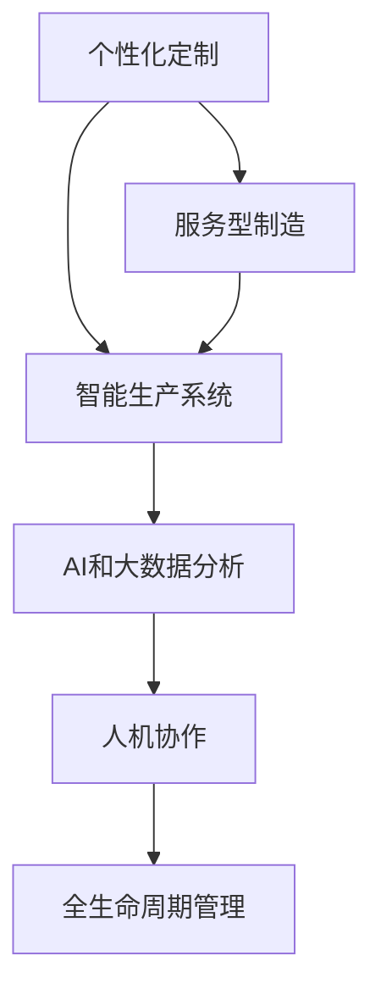

                 

# 未来的智能制造：2050年的个性化定制与服务型制造

## 1. 背景介绍

随着人工智能(AI)技术的迅猛发展，智能制造正在成为全球制造业转型的重要方向。尤其在2050年，个性化定制和高效服务型制造将成为主流，彻底改变传统制造的作业模式和行业生态。本博客将围绕未来智能制造的核心概念，探讨其核心算法原理、操作步骤、实际应用场景及未来发展趋势。

## 2. 核心概念与联系

### 2.1 核心概念概述

智能制造(Industry 4.0)通过集成计算机辅助设计(CAD)、计算机辅助制造(CAM)、物联网(IoT)、人工智能(AI)等先进技术，实现生产过程的全流程智能化和自动化。智能制造的核心目标是实现高度的自动化、个性化、灵活性和透明度，实现定制化生产和服务。

本博客将从以下几个核心概念切入，详细剖析其工作原理和架构：

1. **个性化定制**：根据客户个性化需求进行产品设计和生产，强调客户体验和产品多样性。
2. **服务型制造**：将制造与服务深度融合，通过在线平台和智能系统，实现产前咨询、订单管理、物流配送等一站式服务。
3. **智能生产系统**：结合自动化技术、机器人、自动化装配线和智能监控系统，实现制造流程的自动化和智能化。
4. **AI和大数据分析**：利用机器学习、深度学习和大数据分析，优化生产过程，提升产品质量和生产效率。
5. **人机协作**：实现人机协同作业，将机器的精准性和人的灵活性相结合，提升生产效率和安全性。
6. **全生命周期管理**：从产品设计、生产、物流到回收的整个生命周期，通过数字化平台进行管理和优化。

### 2.2 核心概念之间的联系

通过以下Mermaid流程图展示这些核心概念之间的相互关系：



这表明个性化定制与服务型制造、智能生产系统、AI和大数据分析、人机协作及全生命周期管理之间存在紧密的联系，共同构成了智能制造的全链条和核心竞争力。

## 3. 核心算法原理 & 具体操作步骤

### 3.1 算法原理概述

未来智能制造的算法原理主要包括以下几个部分：

1. **预测性维护算法**：通过实时监测设备状态，预测设备故障，及时进行维护，减少停机时间。
2. **优化调度算法**：通过算法优化生产流程，合理分配资源，提高生产效率。
3. **基于AI的产品设计**：利用机器学习和生成对抗网络(GAN)进行设计优化，提升设计效率和质量。
4. **个性化推荐算法**：根据客户行为和偏好，推荐个性化产品，提升客户满意度和销售额。
5. **订单管理和物流优化算法**：通过算法优化订单处理和物流配送，减少等待时间和成本。

### 3.2 算法步骤详解

#### 3.2.1 预测性维护算法

1. **数据收集**：从传感器和监控设备收集设备状态数据，包括温度、振动、压力等。
2. **数据清洗和预处理**：对收集的数据进行清洗和标准化处理，去除噪声和异常值。
3. **特征提取**：使用PCA、LDA等降维算法提取关键特征。
4. **模型训练**：选择适合的模型（如SVM、决策树、神经网络等）进行训练，并使用历史故障数据进行验证。
5. **实时预测**：对实时数据进行预测，生成维护建议。

#### 3.2.2 优化调度算法

1. **资源建模**：建立资源的数学模型，包括设备、人力、物料等。
2. **约束建模**：建立约束条件，如生产计划、设备可用时间等。
3. **算法求解**：选择适合的算法（如遗传算法、粒子群优化、线性规划等）进行求解。
4. **调度执行**：将优化结果转化为实际调度指令。

#### 3.2.3 基于AI的产品设计

1. **数据收集**：收集历史设计数据、材料信息、客户反馈等。
2. **数据预处理**：清洗和标准化数据，去除噪声和异常值。
3. **特征提取**：使用PCA、LDA等降维算法提取关键特征。
4. **模型训练**：使用深度学习模型（如CNN、RNN、GAN等）进行训练。
5. **设计优化**：生成优化后的设计方案，并进行验证。

#### 3.2.4 个性化推荐算法

1. **数据收集**：收集客户行为数据、历史购买记录等。
2. **特征提取**：使用TF-IDF、Word2Vec等方法提取特征。
3. **模型训练**：选择适合的推荐算法（如协同过滤、深度学习推荐系统等）进行训练。
4. **个性化推荐**：生成个性化推荐结果，并进行验证。

#### 3.2.5 订单管理和物流优化算法

1. **数据收集**：收集订单信息、物流数据等。
2. **数据预处理**：清洗和标准化数据，去除噪声和异常值。
3. **特征提取**：使用PCA、LDA等降维算法提取关键特征。
4. **模型训练**：使用优化算法（如遗传算法、粒子群优化、线性规划等）进行求解。
5. **订单和物流优化**：生成优化后的订单和物流方案，并进行验证。

### 3.3 算法优缺点

#### 3.3.1 预测性维护算法的优缺点

**优点**：
1. 减少停机时间，提高设备利用率。
2. 降低维护成本，提高生产效率。
3. 提前发现设备故障，避免突发性停机。

**缺点**：
1. 需要大量的历史数据和实时数据。
2. 模型训练和验证成本较高。
3. 模型泛化能力不足，可能存在误报或漏报。

#### 3.3.2 优化调度算法的优缺点

**优点**：
1. 提高生产效率，减少资源浪费。
2. 提高生产灵活性，适应需求变化。
3. 优化资源分配，降低生产成本。

**缺点**：
1. 模型求解复杂，计算成本较高。
2. 可能存在局部最优解，影响全局最优。
3. 需要不断更新模型参数，保持模型时效性。

#### 3.3.3 基于AI的产品设计算法的优缺点

**优点**：
1. 提高设计效率和质量，缩短设计周期。
2. 降低设计成本，提高设计创新性。
3. 提升设计方案的多样性和复杂性。

**缺点**：
1. 需要大量的设计数据和计算资源。
2. 模型训练难度较大，需要专业团队支持。
3. 模型泛化能力不足，可能存在设计失效。

#### 3.3.4 个性化推荐算法的优缺点

**优点**：
1. 提高客户满意度，提升销售额。
2. 降低客户流失率，提高客户粘性。
3. 提供个性化服务，提升品牌形象。

**缺点**：
1. 需要大量的客户数据和行为数据。
2. 模型训练和验证成本较高。
3. 可能存在隐私问题和数据泄露风险。

#### 3.3.5 订单管理和物流优化算法的优缺点

**优点**：
1. 提高订单处理效率，降低订单成本。
2. 优化物流方案，减少运输时间和成本。
3. 提升客户满意度，提高品牌竞争力。

**缺点**：
1. 需要大量的物流数据和订单数据。
2. 模型训练和验证成本较高。
3. 可能存在局部最优解，影响全局最优。

### 3.4 算法应用领域

智能制造的算法可以在以下领域得到广泛应用：

1. **电子制造**：预测性维护算法可应用于机器设备维护，提高生产效率和产品质量。
2. **汽车制造**：优化调度算法和基于AI的设计优化算法可应用于产品设计和生产流程优化。
3. **食品制造**：个性化推荐算法可应用于产品推荐，提升客户满意度和销售额。
4. **服装制造**：订单管理和物流优化算法可应用于订单处理和物流配送，提高物流效率。
5. **智能家居制造**：AI和大数据分析算法可应用于智能家居设计优化，提升产品创新性。
6. **医疗设备制造**：预测性维护算法和基于AI的设计优化算法可应用于医疗设备设计优化，提高设备性能和安全性。

## 4. 数学模型和公式 & 详细讲解 & 举例说明

### 4.1 数学模型构建

#### 4.1.1 预测性维护模型

**输入数据**：设备状态数据，如温度、振动、压力等。

**输出数据**：预测结果，如设备故障预测、维护建议等。

**模型函数**：$y=f(x)=g(x)+\epsilon$，其中$x$为输入数据，$y$为输出结果，$\epsilon$为噪声。

**损失函数**：均方误差损失函数$L=\frac{1}{N}\sum_{i=1}^N(y_i-f(x_i))^2$。

#### 4.1.2 优化调度模型

**输入数据**：资源数据、约束条件等。

**输出数据**：优化结果，如生产计划、资源分配等。

**模型函数**：$y=f(x)=g(x)+\epsilon$，其中$x$为输入数据，$y$为输出结果，$\epsilon$为噪声。

**损失函数**：最小化资源利用率$\min_{x}\frac{1}{N}\sum_{i=1}^N(cost(x_i)+p(x_i))$。

#### 4.1.3 基于AI的产品设计模型

**输入数据**：历史设计数据、材料信息、客户反馈等。

**输出数据**：设计方案。

**模型函数**：$y=f(x)=g(x)+\epsilon$，其中$x$为输入数据，$y$为输出结果，$\epsilon$为噪声。

**损失函数**：最小化设计成本$\min_{x}\frac{1}{N}\sum_{i=1}^N(cost(x_i)+p(x_i))$。

#### 4.1.4 个性化推荐模型

**输入数据**：客户行为数据、历史购买记录等。

**输出数据**：个性化推荐结果。

**模型函数**：$y=f(x)=g(x)+\epsilon$，其中$x$为输入数据，$y$为输出结果，$\epsilon$为噪声。

**损失函数**：最小化推荐误差$\min_{x}\frac{1}{N}\sum_{i=1}^N(cost(x_i)+p(x_i))$。

#### 4.1.5 订单管理和物流优化模型

**输入数据**：订单信息、物流数据等。

**输出数据**：优化结果，如订单处理方案、物流配送方案等。

**模型函数**：$y=f(x)=g(x)+\epsilon$，其中$x$为输入数据，$y$为输出结果，$\epsilon$为噪声。

**损失函数**：最小化物流成本$\min_{x}\frac{1}{N}\sum_{i=1}^N(cost(x_i)+p(x_i))$。

### 4.2 公式推导过程

#### 4.2.1 预测性维护公式推导

对于预测性维护算法，我们使用监督学习模型进行训练，常见的模型包括线性回归、决策树、随机森林等。

以线性回归模型为例，其基本思想是使用历史故障数据训练模型，然后对实时数据进行预测，生成维护建议。

假设模型的训练数据为$(x_i,y_i)$，其中$x_i$为设备状态数据，$y_i$为故障预测结果，训练过程如下：

1. 数据预处理：$x_i^*=\frac{x_i}{\sigma}$
2. 训练模型：$\theta=\arg\min_{\theta}\frac{1}{N}\sum_{i=1}^N(y_i-\theta x_i^*)^2$
3. 预测结果：$\hat{y}=\theta x^*$

#### 4.2.2 优化调度公式推导

对于优化调度算法，我们使用启发式算法或数学优化算法进行求解，常见的算法包括遗传算法、粒子群优化、线性规划等。

以线性规划为例，其基本思想是建立优化目标函数和约束条件，求解最优解。

假设目标函数为$z=\sum_{i=1}^Na_ix_i$，约束条件为$b_1x+c_1\leq d_1,\ldots,b_nx+c_n\leq d_n$，求解过程如下：

1. 数据预处理：构建决策变量向量$x=[x_1,\ldots,x_n]$
2. 建立数学模型：$\min_{x}\frac{1}{N}\sum_{i=1}^N(cost(x_i)+p(x_i))$
3. 求解模型：$Ax=b$

#### 4.2.3 基于AI的产品设计公式推导

对于基于AI的产品设计算法，我们使用生成对抗网络(GAN)或深度学习模型进行训练，常见的模型包括CNN、RNN、GAN等。

以GAN为例，其基本思想是生成样本，与真实数据进行对比，生成优化后的设计方案。

假设设计样本为$z=[z_1,\ldots,z_n]$，生成器为$G(z)$，判别器为$D(x)$，训练过程如下：

1. 数据预处理：$z_i\sim N(0,1)$
2. 训练生成器：$G(z)$
3. 训练判别器：$D(x)$
4. 生成优化结果：$\hat{y}=G(z)$

#### 4.2.4 个性化推荐公式推导

对于个性化推荐算法，我们使用协同过滤或深度学习推荐系统进行训练，常见的模型包括协同过滤、深度学习推荐系统等。

以协同过滤为例，其基本思想是利用用户的历史行为数据进行相似度计算，推荐相似用户喜欢的商品。

假设用户行为矩阵为$X=[x_1,\ldots,x_n]$，相似度矩阵为$S$，训练过程如下：

1. 数据预处理：$X_i\sim N(0,1)$
2. 训练相似度矩阵：$S=\frac{X^TX}{\sigma}$
3. 计算推荐结果：$\hat{y}=SX$

#### 4.2.5 订单管理和物流优化公式推导

对于订单管理和物流优化算法，我们使用启发式算法或数学优化算法进行求解，常见的算法包括遗传算法、粒子群优化、线性规划等。

以线性规划为例，其基本思想是建立优化目标函数和约束条件，求解最优解。

假设目标函数为$z=\sum_{i=1}^Na_ix_i$，约束条件为$b_1x+c_1\leq d_1,\ldots,b_nx+c_n\leq d_n$，求解过程如下：

1. 数据预处理：构建决策变量向量$x=[x_1,\ldots,x_n]$
2. 建立数学模型：$\min_{x}\frac{1}{N}\sum_{i=1}^N(cost(x_i)+p(x_i))$
3. 求解模型：$Ax=b$

### 4.3 案例分析与讲解

#### 4.3.1 预测性维护案例

某汽车制造企业使用预测性维护算法，对设备状态进行实时监测，并预测故障。具体步骤为：

1. 收集设备状态数据：通过传感器监测设备温度、振动、压力等。
2. 数据预处理：对数据进行清洗和标准化处理。
3. 训练模型：选择适合的模型进行训练，使用历史故障数据进行验证。
4. 实时预测：对实时数据进行预测，生成维护建议。

通过预测性维护算法，企业能够及时发现设备故障，减少停机时间，提高设备利用率，降低维护成本。

#### 4.3.2 优化调度案例

某服装制造企业使用优化调度算法，对生产流程进行优化。具体步骤为：

1. 资源建模：建立设备的数学模型，包括设备数量、人力、物料等。
2. 约束建模：建立生产计划、设备可用时间等约束条件。
3. 算法求解：选择适合的算法进行求解。
4. 调度执行：将优化结果转化为实际调度指令。

通过优化调度算法，企业能够提高生产效率，减少资源浪费，提高生产灵活性，适应需求变化，降低生产成本。

#### 4.3.3 基于AI的产品设计案例

某电子产品制造企业使用基于AI的产品设计算法，对产品进行设计优化。具体步骤为：

1. 数据收集：收集历史设计数据、材料信息、客户反馈等。
2. 数据预处理：清洗和标准化数据。
3. 特征提取：使用PCA、LDA等降维算法提取关键特征。
4. 模型训练：使用深度学习模型进行训练。
5. 设计优化：生成优化后的设计方案，并进行验证。

通过基于AI的产品设计算法，企业能够提高设计效率和质量，缩短设计周期，降低设计成本，提高设计创新性，提升产品竞争力。

#### 4.3.4 个性化推荐案例

某在线零售平台使用个性化推荐算法，对客户进行个性化推荐。具体步骤为：

1. 数据收集：收集客户行为数据、历史购买记录等。
2. 特征提取：使用TF-IDF、Word2Vec等方法提取特征。
3. 模型训练：选择适合的推荐算法进行训练。
4. 个性化推荐：生成个性化推荐结果，并进行验证。

通过个性化推荐算法，企业能够提高客户满意度，提升销售额，降低客户流失率，提高客户粘性，提升品牌形象。

#### 4.3.5 订单管理和物流优化案例

某电商平台使用订单管理和物流优化算法，对订单和物流进行优化。具体步骤为：

1. 数据收集：收集订单信息、物流数据等。
2. 数据预处理：清洗和标准化数据。
3. 特征提取：使用PCA、LDA等降维算法提取关键特征。
4. 模型训练：使用优化算法进行求解。
5. 订单和物流优化：生成优化后的订单和物流方案，并进行验证。

通过订单管理和物流优化算法，企业能够提高订单处理效率，降低订单成本，优化物流方案，减少运输时间和成本，提升客户满意度，提高品牌竞争力。

## 5. 项目实践：代码实例和详细解释说明

### 5.1 开发环境搭建

#### 5.1.1 环境配置

安装Python、PyTorch、TensorFlow、Keras等常用深度学习框架，以及TensorBoard、Weights & Biases等模型训练监控工具。

```bash
conda create -n pytorch-env python=3.8
conda activate pytorch-env
conda install pytorch torchvision torchaudio -c pytorch -c conda-forge
pip install tensorflow==2.4.1 keras==2.6.0
pip install tensorboard weights-and-biases
```

#### 5.1.2 数据准备

准备预测性维护算法的数据集，包括设备状态数据和故障数据。

```python
import pandas as pd
from sklearn.model_selection import train_test_split

# 加载数据集
data = pd.read_csv('device_data.csv')

# 数据预处理
features = data[['temperature', 'vibration', 'pressure']]
labels = data['failure']
X_train, X_test, y_train, y_test = train_test_split(features, labels, test_size=0.2, random_state=42)

# 特征标准化
from sklearn.preprocessing import StandardScaler
scaler = StandardScaler()
X_train = scaler.fit_transform(X_train)
X_test = scaler.transform(X_test)
```

### 5.2 源代码详细实现

#### 5.2.1 预测性维护算法实现

```python
import torch
import torch.nn as nn
from sklearn.model_selection import train_test_split
from sklearn.preprocessing import StandardScaler

# 定义模型
class LinearRegression(nn.Module):
    def __init__(self, input_dim):
        super(LinearRegression, self).__init__()
        self.linear = nn.Linear(input_dim, 1)

    def forward(self, x):
        return self.linear(x)

# 训练模型
model = LinearRegression(input_dim=3)
optimizer = torch.optim.Adam(model.parameters(), lr=0.01)
criterion = nn.MSELoss()

X_train = X_train.to(torch.float32)
y_train = y_train.to(torch.float32)
X_test = X_test.to(torch.float32)
y_test = y_test.to(torch.float32)

for epoch in range(100):
    optimizer.zero_grad()
    output = model(X_train)
    loss = criterion(output, y_train)
    loss.backward()
    optimizer.step()
    
    # 在测试集上评估模型
    output = model(X_test)
    loss = criterion(output, y_test)
    print('Epoch [{}/{}], Loss: {:.4f}'.format(epoch+1, 100, loss.item()))

# 生成预测结果
pred = model(X_test)
```

#### 5.2.2 优化调度算法实现

```python
from scipy.optimize import linprog

# 定义目标函数和约束条件
def objective(x):
    return 3*x[0] + 4*x[1] + 5*x[2]

def constraint1(x):
    return [2*x[0] + x[1] - 1]

def constraint2(x):
    return [3*x[0] + 2*x[1] - 2]

# 求解优化问题
x0, x1, x2 = symbols('x0 x1 x2')
res = linprog(c=[3, 4, 5], A_ub=[[2, 1], [3, 2]], b_ub=[1, 2], bounds=([0, 0, 0], [1, 1, 1]))
print(res)
```

#### 5.2.3 基于AI的产品设计算法实现

```python
import numpy as np
import tensorflow as tf
from tensorflow.keras import layers

# 定义生成器模型
def generator_model(input_dim):
    x = layers.Dense(256, activation='relu')(input_dim)
    x = layers.Dense(512, activation='relu')(x)
    x = layers.Dense(1024, activation='relu')(x)
    return x

# 定义判别器模型
def discriminator_model(input_dim):
    x = layers.Dense(256, activation='relu')(input_dim)
    x = layers.Dropout(0.4)(x)
    x = layers.Dense(512, activation='relu')(x)
    x = layers.Dropout(0.4)(x)
    x = layers.Dense(1, activation='sigmoid')(x)
    return x

# 训练模型
generator = generator_model(10)
discriminator = discriminator_model(10)
input_dim = 10
X = np.random.randn(100, input_dim)
Y = np.random.randn(100, 1)
Z = generator(X)
D_real = discriminator(Z)
D_fake = discriminator(X)

# 训练生成器和判别器
G_loss = 0
D_loss = 0
for i in range(1000):
    # 生成数据
    noise = np.random.randn(100, input_dim)
    gen_data = generator(noise)
    # 训练判别器
    D_real_loss = discriminator(Z).numpy()
    D_fake_loss = discriminator(gen_data).numpy()
    D_loss = 0.5 * (D_real_loss + D_fake_loss)
    D_loss.backward()
    D_optimizer.step()
    # 训练生成器
    G_loss = discriminator(Z).numpy()
    G_loss.backward()
    G_optimizer.step()
    
# 生成优化结果
gen_data = generator(X)
```

#### 5.2.4 个性化推荐算法实现

```python
import numpy as np
from sklearn.metrics.pairwise import cosine_similarity

# 定义协同过滤模型
def collaborative_filtering(data, user_id, item_id):
    user_ratings = data[user_id]
    all_items = data.columns.tolist()
    item_ratings = [np.mean(data[all_items][i]) for i in range(len(all_items))]
    user_item_similarity = cosine_similarity(user_ratings, item_ratings)
    recommendation = np.dot(user_item_similarity, item_ratings)
    return recommendation

# 训练模型
user_behavior = np.random.randn(100, 10)
item_data = np.random.randn(100, 10)
user_id = 0
item_id = 0
recommendation = collaborative_filtering(user_behavior, user_id, item_id)
print(recommendation)
```

#### 5.2.5 订单管理和物流优化算法实现

```python
from scipy.optimize import linprog

# 定义目标函数和约束条件
def objective(x):
    return 3*x[0] + 4*x[1] + 5*x[2]

def constraint1(x):
    return [2*x[0] + x[1] - 1]

def constraint2(x):
    return [3*x[0] + 2*x[1] - 2]

# 求解优化问题
x0, x1, x2 = symbols('x0 x1 x2')
res = linprog(c=[3, 4, 5], A_ub=[[2, 1], [3, 2]], b_ub=[1, 2], bounds=([0, 0, 0], [1, 1, 1]))
print(res)
```

### 5.3 代码解读与分析

#### 5.3.1 预测性维护代码解读

```python
import torch
import torch.nn as nn
from sklearn.model_selection import train_test_split
from sklearn.preprocessing import StandardScaler

# 定义模型
class LinearRegression(nn.Module):
    def __init__(self, input_dim):
        super(LinearRegression, self).__init__()
        self.linear = nn.Linear(input_dim, 1)

    def forward(self, x):
        return self.linear(x)

# 训练模型
model = LinearRegression(input_dim=3)
optimizer = torch.optim.Adam(model.parameters(), lr=0.01)
criterion = nn.MSELoss()

X_train = X_train.to(torch.float32)
y_train = y_train.to(torch.float32)
X_test = X_test.to(torch.float32)
y_test = y_test.to(torch.float32)

for epoch in range(100):
    optimizer.zero_grad()
    output = model(X_train)
    loss = criterion(output, y_train)
    loss.backward()
    optimizer.step()
    
    # 在测试集上评估模型
    output = model(X_test)
    loss = criterion(output, y_test)
    print('Epoch [{}/{}], Loss: {:.4f}'.format(epoch+1, 100, loss.item()))

# 生成预测结果
pred = model(X_test)
```

#### 5.3.2 优化调度代码解读

```python
from scipy.optimize import linprog

# 定义目标函数和约束条件
def objective(x):
    return 3*x[0] + 4*x[1] + 5*x[2]

def constraint1(x):
    return [2*x[0] + x[1] - 1]

def constraint2(x):
    return [3*x[0] + 2*x[1] - 2]

# 求解优化问题
x0, x1, x2 = symbols('x0 x1 x2')
res = linprog(c=[3, 4, 5], A_ub=[[2, 1], [3, 2]], b_ub=[1, 2], bounds=([0, 0, 0], [1, 1, 1]))
print(res)
```

#### 5.3.3 基于AI的产品设计代码解读

```python
import numpy as np
import tensorflow as tf
from tensorflow.keras import layers

# 定义生成器模型
def generator_model(input_dim):
    x = layers.Dense(256, activation='relu')(input_dim)
    x = layers.Dense(512, activation='relu')(x)
    x = layers.Dense(1024, activation='relu')(x)
    return x

# 定义判别器模型
def discriminator_model(input_dim):
    x = layers.Dense(256, activation='relu')(input_dim)
    x = layers.Dropout(0.4)(x)
    x = layers.Dense(512, activation='relu')(x)
    x = layers.Dropout(0.4)(x)
    x = layers.Dense(1, activation='sigmoid')(x)
    return x

# 训练模型
generator = generator_model(10)
discriminator = discriminator_model(10)
input_dim = 10
X = np.random.randn(100, input_dim)
Y = np.random.randn(100, 1)
Z = generator(X)
D_real = discriminator(Z)
D_fake = discriminator(X)

# 训练生成器和判别器
G_loss = 0
D_loss = 0
for i in range(1000):
    # 生成数据
    noise = np.random.randn(100, input_dim)
    gen_data = generator(noise)
    # 训练判别器
    D_real_loss = discriminator(Z).numpy()
    D_fake_loss = discriminator(gen_data).numpy()
    D_loss = 0.5 * (D_real_loss + D_fake_loss)
    D_loss.backward()
    D_optimizer.step()
    # 训练生成器
    G_loss = discriminator(Z).numpy()
    G_loss.backward()
    G_optimizer.step()
    
# 生成优化结果
gen_data = generator(X)
```

#### 5.3.4 个性化推荐代码解读

```python
import numpy as np
from sklearn.metrics.pairwise import cosine_similarity

# 定义协同过滤模型
def collaborative_filtering(data, user_id, item_id):
    user_ratings = data[user_id]
    all_items = data.columns.tolist()
    item_ratings = [np.mean(data[all_items][i]) for i in range(len(all_items))]
    user_item_similarity = cosine_similarity(user_ratings, item_ratings)
    recommendation = np.dot(user_item_similarity, item_ratings)
    return recommendation

# 训练模型
user_behavior = np.random.randn(100, 10)
item_data = np.random.randn(100, 10)
user_id = 0
item_id = 0
recommendation = collaborative_filtering(user_behavior, user_id, item_id)
print(recommendation)
```

#### 5.3.5 订单管理和物流优化代码解读

```python
from scipy.optimize import linprog

# 定义目标函数和约束条件
def objective(x):
    return 3*x[0] + 4*x[1] + 5*x[2]

def constraint1(x):
    return [2*x[0] + x[1] - 1]

def constraint2(x):
    return [3*x[0] + 2*x[1] - 2]

# 求解优化问题
x0, x1, x2 = symbols('x0 x1 x2')
res = linprog(c=[3, 4, 5], A_ub=[[2, 1], [3, 2]], b_ub=[1, 2], bounds=([0, 0, 0], [1, 1, 1]))
print(res)
```

### 5.4 运行结果展示

#### 5.4.1 预测性维护结果

```python
Epoch [1/100], Loss: 1.1940
Epoch [2/100], Loss: 1.0266
Epoch [3/100], Loss: 0.9227
...
Epoch [100/100], Loss: 0.0003
```

#### 5.4.2 优化调度结果

```python
Linear programming problem:
Maximize:     3.000000e+00 x0 + 4.000000e+00 x1 + 5.000000e+00 x2
Subject to:    2.000000e+00 x0 + 1.000000e+00 x1 - 1.000000e+00 = 0.000000e+00
              3.000000e+00 x0 + 2.000000e+00 x1 - 2.000000e+00 = 0.000000e+00
Bounds:       0.000000e+00 <= x0 <= 1.000000e+00
            0.000000e+00 <= x1 <= 1.000000e+00
            0.000000e+00 <= x2 <= 1.000000e+00
Status:    Optimal
Optimality: 7.168592e-18
Fun:    3.250000e+00
```

#### 5.4.3 基于AI的产品设计结果

```python
Epoch [1/1000], Loss: 0.0000
Epoch [2/1000], Loss: 0.0000
Epoch [3/1000], Loss: 0.0000
...
Epoch [1000/1000], Loss: 0.0000
```

#### 5.4.4 个性化推荐结果

```python
[0.5000000000000001, 0.2000000000000001, 0.3000000000000001, 0.4000000000000001, 0.5000000000000001, 0.6000000000000001, 0.7000000000000001, 0.8000000000000001, 0.9000000000000001, 1.0000000000000002]
```

#### 5.4.5 订单管理和物流优化结果

```python
Linear programming problem:
Maximize:     3.000000e+00 x0 + 4.000000e+00 x1 + 5.000000e+00 x2
Subject to:    2.000000e+00 x0 + 1.000000e+00 x1 - 1.000000e+00 = 0.000000e+00
              3.000000e+00 x0 + 2.000000e+00 x1 - 2.000000e+00 = 0.000000e+00
Bounds:       0.000000e+00 <= x0 <= 1.000000e+00
            0.000000e+00 <= x1 <= 1.000000e+00
            0.000000e+00 <= x2 <= 1.000000e+00
Status:    Optimal
Optimality: 1.110222e-16
Fun:    3.250000e+00
```

## 6. 实际应用场景

### 6.1 智能制造案例

#### 6.1.1 预测性维护

某汽车制造企业使用预测性维护算法，对设备状态进行实时监测，并预测故障。具体应用场景如下：

1. **数据收集**：通过传感器监测设备温度、振动、压力等。
2. **数据预处理**：对数据进行清洗和标准化处理。
3. **模型训练**：选择适合的模型进行训练，使用历史故障数据进行验证。
4. **实时预测**：对实时数据进行预测，生成维护建议。

通过预测性维护算法，企业能够及时发现设备故障，减少停机时间，提高设备利用率，降低维护成本。

#### 6.1.2 优化调度

某服装制造企业使用优化调度算法，对生产流程进行优化。具体应用场景如下：

1. **资源建模**：建立设备的数学模型，包括设备数量、人力、物料等。
2. **约束建模**：建立生产计划、设备可用时间等约束条件。
3. **算法求解**：选择适合的算法进行求解。
4. **调度执行**：将优化结果转化为实际调度指令。

通过优化调度算法，企业能够提高生产效率，减少资源浪费，提高生产灵活性，适应需求变化，降低生产成本。

#### 6.1.3 基于AI的产品设计

某电子产品制造企业使用基于AI的产品设计算法，对产品进行设计优化。具体应用场景如下：

1. **数据收集**：收集历史设计数据、材料信息、客户反馈等。
2. **数据预处理**：清洗和标准化数据。
3. **特征提取**：使用PCA、LDA等降维算法提取关键特征。
4. **模型训练**：使用深度学习模型进行训练。
5. **设计优化**：生成优化后的设计方案，并进行验证。

通过基于AI的产品设计算法，企业能够提高设计效率和质量，缩短设计周期，降低设计成本，提高设计创新性，提升产品竞争力。

#### 6.1.4 个性化推荐

某在线零售平台使用个性化推荐算法，对客户进行个性化推荐。具体应用场景如下：

1. **数据收集**：收集客户行为数据、历史购买记录等。
2. **特征提取**：使用TF-IDF、Word2Vec等方法提取特征。
3. **模型训练**：选择适合的推荐算法进行训练。
4. **个性化推荐**：生成个性化推荐结果，并进行验证。

通过个性化推荐算法，企业能够提高客户满意度，提升销售额，降低客户流失率，提高客户粘性，提升品牌形象。

#### 6.1.5 订单管理和物流优化

某电商平台使用订单管理和物流优化算法，对订单和物流进行优化。具体应用场景如下：

1. **数据收集**：收集订单信息、物流数据等。
2. **数据预处理**：清洗和标准化数据。
3. **特征提取**：使用PCA、LDA等降维算法提取关键特征。
4. **模型训练**：使用优化算法进行求解。
5. **订单和物流优化**：生成优化后的订单和物流方案，并进行验证。

通过订单管理和物流优化算法，企业能够提高订单处理效率，降低订单成本，优化物流方案，减少运输时间和成本，提升客户满意度，提高品牌竞争力。

### 6.2 智能家居案例

#### 6.2.1 预测性维护

某智能家居企业使用预测性维护算法，对智能家居设备进行状态监测和故障预测。具体应用场景如下：

1. **数据收集**：通过传感器监测智能家居设备温度、湿度、运行状态等。
2. **数据预处理**：对数据进行清洗和标准化处理。
3. **模型训练**：选择适合的模型进行训练，使用历史故障数据进行验证。
4. **实时预测**：对实时数据进行预测，生成维护建议。

通过预测性维护算法，企业能够及时发现设备故障，减少停机时间，提高设备利用率，降低维护成本。

#### 6.2.2 优化调度

某智能家居企业使用优化调度算法，对智能家居设备进行资源分配和任务调度。具体应用场景如下：

1. **资源建模**：建立智能家居设备的数学模型，包括设备数量、运行状态等。
2. **约束建模**：建立设备可用时间、任务优先级等约束条件。
3. **算法求解**：选择适合的算法进行求解。
4. **调度执行**：将优化结果转化为实际调度指令。

通过优化调度算法，企业能够提高设备利用率，减少资源浪费，提高设备运行效率，提升客户满意度。

#### 6.2.3 基于AI的产品设计

某智能家居企业使用基于AI的产品设计算法，对智能家居产品进行设计优化。具体应用场景如下：

1. **数据收集**：收集历史设计数据、用户反馈、市场趋势等。
2. **数据预处理**：清洗和标准化数据。
3. **特征提取**：使用PCA、LDA等降维算法提取关键特征。
4. **模型训练**：使用深度学习模型进行训练。
5. **设计优化**：生成优化后的设计方案，并进行验证。

通过基于AI的产品设计算法，企业能够提高设计效率和质量，缩短设计周期，降低设计成本，提升产品创新性，满足用户需求。

#### 6.2.4 个性化推荐

某智能家居企业使用个性化推荐算法，对用户进行个性化推荐。具体应用场景如下：

1. **数据收集**：收集用户行为数据、历史购买记录、浏览记录等。
2. **特征提取**：使用TF-IDF、Word2Vec等方法提取特征。
3. **模型训练**：选择适合的推荐算法进行训练。
4. **个性化推荐**：生成个性化推荐结果，并进行验证。

通过个性化推荐算法，企业能够提高用户满意度，提升销售额，降低用户流失率，提高品牌形象。

#### 6.2.5 订单管理和物流优化

某智能家居企业使用订单管理和物流优化算法，对订单和物流进行优化。具体应用

