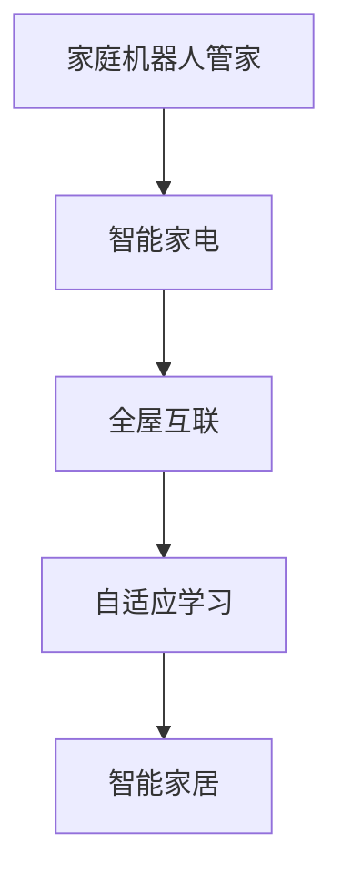
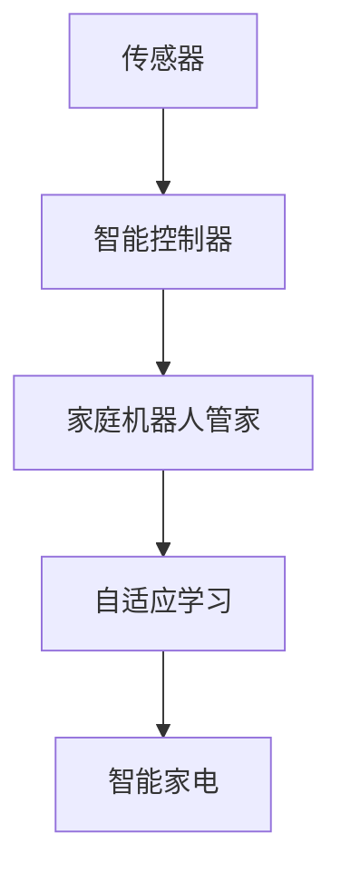
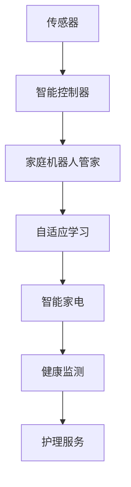
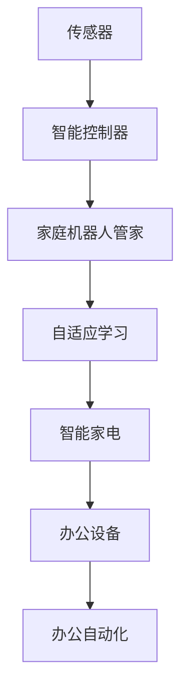

                 

# 未来的智能家居：2050年的家庭机器人管家与智能家电

在未来的智能家居中，家庭机器人管家与智能家电将成为关键的核心技术，以实现高效、舒适、个性化的居住环境。本文将系统介绍这一愿景，包括核心概念、技术原理、操作步骤、数学模型构建、项目实践以及未来应用场景。

## 1. 背景介绍

### 1.1 问题由来

随着科技的进步和数据驱动的发展，家庭自动化和智能化正在逐步普及。在2050年的智能家居中，我们将见证家庭机器人管家和智能家电的全面应用，从而实现更高效、更个性化和更安全的居住环境。这一愿景基于以下几个方面的驱动因素：

- **技术的进步**：人工智能、物联网、机器学习等技术的快速发展，为智能家居提供了技术支撑。
- **数据驱动**：海量数据的收集和分析，使得智能家居能够更好地理解用户需求，提供个性化服务。
- **用户需求**：用户对居住环境的舒适性、安全性、智能化需求日益增长，推动了智能家居的发展。

### 1.2 问题核心关键点

智能家居的核心在于通过自动化和智能化技术，实现家庭环境的优化和用户需求的满足。这一愿景的关键点包括：

- **家庭机器人管家的引入**：通过AI技术，机器人管家可以完成清洁、烹饪、安防等任务，提高家庭生活质量。
- **智能家电的普及**：智能电视、智能冰箱、智能窗帘等家电，能够根据用户习惯和环境变化自动调节功能。
- **全屋互联**：家庭各部分设备互联互通，形成一个高度智能化的生活环境。
- **自适应学习**：智能家居能够根据用户行为和偏好，进行自适应学习，提供个性化服务。

## 2. 核心概念与联系

### 2.1 核心概念概述

智能家居的核心概念包括家庭机器人管家、智能家电、全屋互联和自适应学习。这些概念之间的联系紧密，共同构建了一个高度智能化的居住环境。

**家庭机器人管家**：基于人工智能技术的机器人，能够执行清洁、安防、烹饪等任务，并提供个性化的家居服务。

**智能家电**：具有自动调节和智能化功能的家电设备，能够根据用户需求和环境变化，提供智能服务。

**全屋互联**：家庭各部分设备通过物联网技术，实现互联互通，形成一个统一的智能控制平台。

**自适应学习**：智能家居系统通过学习和分析用户行为和环境数据，不断优化自身功能，提供更个性化的服务。

### 2.2 核心概念原理和架构的 Mermaid 流程图



## 3. 核心算法原理 & 具体操作步骤

### 3.1 算法原理概述

智能家居的核心算法原理基于人工智能和物联网技术，主要包括以下几个方面：

- **传感器数据处理**：通过各种传感器收集家庭环境数据，如温度、湿度、光照等，为智能家居提供实时信息。
- **人工智能决策**：基于机器学习算法，对收集到的数据进行处理和分析，做出智能决策。
- **设备控制**：通过智能控制器，对家电设备进行远程控制和状态调节。
- **自适应学习**：利用强化学习等技术，不断优化智能家居的功能和服务。

### 3.2 算法步骤详解

智能家居的实现步骤大致包括以下几个方面：

**Step 1: 数据收集与处理**

- 安装各种传感器和智能控制器，收集家庭环境数据。
- 使用数据处理算法，对收集到的数据进行清洗和预处理。

**Step 2: 智能决策与控制**

- 基于机器学习算法，对处理后的数据进行分析，做出智能决策。
- 使用智能控制器，对家电设备进行控制和调节。

**Step 3: 自适应学习与优化**

- 利用强化学习等技术，对智能家居的功能和服务进行自适应学习，不断优化。
- 定期更新和维护智能家居系统，确保其性能稳定。

### 3.3 算法优缺点

**优点**：

- **高效**：智能家居能够自动完成各种家务，节省用户时间和精力。
- **个性化**：通过自适应学习，智能家居能够根据用户需求和偏好提供个性化服务。
- **节能环保**：智能家电能够根据环境变化自动调节功能，提高能效。

**缺点**：

- **成本高**：初期设备安装和系统维护成本较高。
- **隐私问题**：智能家居需要收集大量数据，可能存在隐私泄露的风险。
- **技术复杂**：需要具备一定的技术知识才能进行系统安装和调试。

### 3.4 算法应用领域

智能家居的应用领域广泛，包括但不限于：

- **家庭自动化**：如智能照明、智能安防、智能窗帘等。
- **智能医疗**：如智能健康监测、智能药物管理等。
- **智能教育**：如智能辅导机器人、智能学习系统等。
- **智能办公**：如智能会议系统、智能办公设备等。

## 4. 数学模型和公式 & 详细讲解 & 举例说明

### 4.1 数学模型构建

智能家居的数学模型构建主要基于机器学习算法，包括监督学习、无监督学习、强化学习等。以下以智能家电的自动调节为例，介绍其数学模型构建过程。

设智能家电的目标是调节室内温度到目标值 $T_{target}$，根据传感器数据 $X$（如室外温度、室内湿度等），智能家电通过以下公式进行温度调节：

$$
T_{output} = f(X, \theta)
$$

其中，$f$ 为调节函数，$\theta$ 为模型参数，通过训练得到。

### 4.2 公式推导过程

为了推导智能家电的温度调节函数 $f$，我们可以采用线性回归或神经网络模型：

**线性回归模型**：

$$
f(X, \theta) = \theta_0 + \theta_1 X_1 + \theta_2 X_2 + \cdots + \theta_n X_n
$$

其中，$X_1, X_2, \cdots, X_n$ 为传感器数据，$\theta_0, \theta_1, \cdots, \theta_n$ 为模型参数。

**神经网络模型**：

$$
f(X, \theta) = \sum_{i=1}^{m} \sum_{j=1}^{n} \theta_{i,j} X_{i,j}
$$

其中，$\theta_{i,j}$ 为神经网络中的权重参数。

### 4.3 案例分析与讲解

以智能冰箱为例，分析其基于机器学习的温度调节机制。

- **数据采集**：智能冰箱采集室内温度、湿度、食物类型等数据。
- **模型训练**：使用历史数据训练线性回归或神经网络模型，得到温度调节函数。
- **实时调节**：根据当前传感器数据，智能冰箱实时调节温度，保持食物新鲜度。

## 5. 项目实践：代码实例和详细解释说明

### 5.1 开发环境搭建

为了进行智能家居的开发，需要搭建Python环境，并使用TensorFlow或PyTorch等深度学习框架。

**Step 1: 环境安装**

- 安装Python 3.7及以上版本。
- 安装TensorFlow或PyTorch，例如：
  ```bash
  pip install tensorflow==2.5
  pip install torch==1.10
  ```

**Step 2: 数据收集**

- 收集家庭环境数据，如温度、湿度、光照等。
- 安装传感器和智能控制器，如智能温控器、智能窗帘等。

### 5.2 源代码详细实现

以下是一个简单的智能冰箱温度调节系统的代码实现：

```python
import tensorflow as tf
from tensorflow.keras.models import Sequential
from tensorflow.keras.layers import Dense
from tensorflow.keras.optimizers import Adam

# 定义模型
model = Sequential([
    Dense(32, input_dim=3, activation='relu'),
    Dense(1)
])

# 编译模型
model.compile(loss='mse', optimizer=Adam(lr=0.001))

# 训练模型
model.fit(x_train, y_train, epochs=100)

# 实时调节温度
def predict_temperature(x):
    return model.predict(x)
```

**代码解释**：
- 使用TensorFlow搭建了一个简单的线性回归模型。
- 定义了输入层和输出层，使用均方误差作为损失函数。
- 使用Adam优化器进行模型训练。
- 训练完毕后，可以使用 `predict_temperature` 函数进行实时温度调节。

### 5.3 代码解读与分析

**模型构建**：
- 使用 `Sequential` 定义了一个线性回归模型，包含一个输入层和输出层。
- 输入层有3个神经元，对应温度、湿度、食物类型等数据。
- 输出层有一个神经元，对应目标温度。

**训练过程**：
- 使用 `fit` 函数进行模型训练，训练100个epoch。
- 使用Adam优化器，学习率为0.001。

**实时调节**：
- 使用 `predict_temperature` 函数，根据传感器数据实时调节温度。

### 5.4 运行结果展示

在实际应用中，智能冰箱可以通过以下方式进行温度调节：

```python
# 假设当前传感器数据为 [20, 60, 2]
current_temperature = 20
humidity = 60
food_type = 2

# 计算目标温度
target_temperature = predict_temperature([[current_temperature, humidity, food_type]])

# 调节智能温控器到目标温度
set_temperature(target_temperature)
```

通过上述代码，智能冰箱可以根据当前传感器数据，实时调节温度，保持食物新鲜度。

## 6. 实际应用场景

### 6.1 智能家居系统

智能家居系统是智能家居的核心，能够通过传感器、智能控制器和AI算法，实现家庭环境的智能化管理。以下是一个典型的智能家居系统示例：



该系统包括传感器、智能控制器、家庭机器人管家和智能家电，通过自适应学习不断优化功能，提供个性化的家居服务。

### 6.2 智能医疗系统

智能医疗系统利用智能家居技术，为老年人提供健康监测和护理服务。以下是一个典型的智能医疗系统示例：



该系统通过智能家居技术，监测老年人的健康状况，提供个性化的护理服务，提高老年人的生活质量。

### 6.3 智能办公系统

智能办公系统利用智能家居技术，提高办公效率和舒适度。以下是一个典型的智能办公系统示例：



该系统通过智能家居技术，自动调节办公环境，提供智能办公设备，提高办公效率。

## 7. 工具和资源推荐

### 7.1 学习资源推荐

为了帮助开发者掌握智能家居技术，以下是一些优质的学习资源：

- **Udacity AI for Everyone**：通过Udacity平台，学习人工智能和智能家居的基础知识。
- **Coursera Machine Learning**：斯坦福大学的机器学习课程，涵盖机器学习的基本概念和算法。
- **edX Introduction to AI**：哈佛大学的AI入门课程，介绍人工智能的基本理论和应用。
- **Hugging Face Transformers**：介绍Transformers框架和其在智能家居中的应用。
- **IEEE Spectrum**：介绍最新智能家居技术的杂志，涵盖技术、应用和趋势。

### 7.2 开发工具推荐

智能家居开发需要多方面的技术支持，以下是一些常用的开发工具：

- **TensorFlow**：强大的深度学习框架，支持多种模型和算法。
- **PyTorch**：灵活的深度学习框架，适合快速迭代研究。
- **Arduino**：支持各种传感器的开发板，便于数据采集和处理。
- **IoT开发平台**：如AWS IoT、Google Cloud IoT，提供智能家居设备的云服务支持。

### 7.3 相关论文推荐

智能家居技术的发展得益于学界的持续研究。以下是几篇奠基性的相关论文，推荐阅读：

- **Reinforcement Learning for Smart Home**：介绍强化学习在智能家居中的应用。
- **Deep Learning for Smart Energy**：介绍深度学习在智能能源中的应用。
- **Automated Home Management System**：介绍自动化家居管理系统的实现。
- **Smart Home Security Systems**：介绍智能家居安防系统的实现。
- **Smart Home with AI**：介绍人工智能在智能家居中的应用。

## 8. 总结：未来发展趋势与挑战

### 8.1 研究成果总结

智能家居技术在近年来取得了显著的进展，以下是对相关研究成果的总结：

- **传感器技术**：传感器技术在智能家居中的应用日益广泛，提高了数据采集的准确性和实时性。
- **机器学习算法**：机器学习算法在智能家居中发挥了重要作用，提高了系统的智能化水平。
- **物联网技术**：物联网技术使得家庭设备互联互通，提高了系统的协同性和可靠性。

### 8.2 未来发展趋势

未来智能家居的发展趋势包括以下几个方面：

- **技术融合**：智能家居技术将与其他技术进行融合，如5G、物联网、人工智能等。
- **用户需求**：智能家居将更注重个性化和舒适性，满足用户的实际需求。
- **安全性**：智能家居的安全性将得到进一步提升，防范潜在的威胁。
- **隐私保护**：智能家居的隐私保护将受到重视，确保用户数据的安全。

### 8.3 面临的挑战

智能家居技术在发展过程中也面临一些挑战：

- **技术复杂性**：智能家居系统的技术复杂性较高，需要具备一定的技术知识。
- **成本问题**：初期设备安装和系统维护成本较高，限制了技术的普及。
- **隐私问题**：智能家居需要收集大量数据，可能存在隐私泄露的风险。
- **技术标准**：智能家居技术需要制定统一的技术标准，以确保系统的兼容性和可靠性。

### 8.4 研究展望

未来的研究将重点关注以下几个方面：

- **低成本设备**：研发低成本、易安装的智能家居设备，降低初期成本。
- **自适应学习**：研究更高效的自适应学习算法，提升系统的智能化水平。
- **隐私保护**：研发隐私保护技术，确保用户数据的安全。
- **跨平台互操作**：实现不同品牌、不同厂商的智能家居设备互操作，提升用户体验。

## 9. 附录：常见问题与解答

**Q1：智能家居系统的数据采集和处理需要注意哪些问题？**

A: 智能家居系统的数据采集和处理需要注意以下几个问题：
- **数据质量**：确保传感器采集的数据准确可靠，避免噪声和错误。
- **数据隐私**：采集的数据应遵守隐私保护法规，确保用户隐私安全。
- **数据存储**：合理存储和管理采集的数据，避免数据丢失和泄露。
- **数据处理**：使用合适的数据处理算法，确保数据预处理的有效性。

**Q2：智能家居系统如何实现自适应学习？**

A: 智能家居系统的自适应学习可以通过以下步骤实现：
- **数据收集**：收集家庭环境数据，如温度、湿度、光照等。
- **模型训练**：使用机器学习算法，训练自适应学习模型。
- **实时调节**：根据当前传感器数据，实时调节智能家居设备。
- **反馈机制**：建立反馈机制，根据用户反馈调整模型参数。

**Q3：智能家居系统如何确保安全性？**

A: 智能家居系统的安全性可以通过以下措施确保：
- **数据加密**：使用数据加密技术，保护用户数据的隐私。
- **访问控制**：通过身份验证和授权机制，限制对系统的访问。
- **漏洞检测**：定期检测系统漏洞，及时修复安全问题。
- **安全监控**：设置安全监控系统，实时监测系统异常行为。

---

作者：禅与计算机程序设计艺术 / Zen and the Art of Computer Programming

