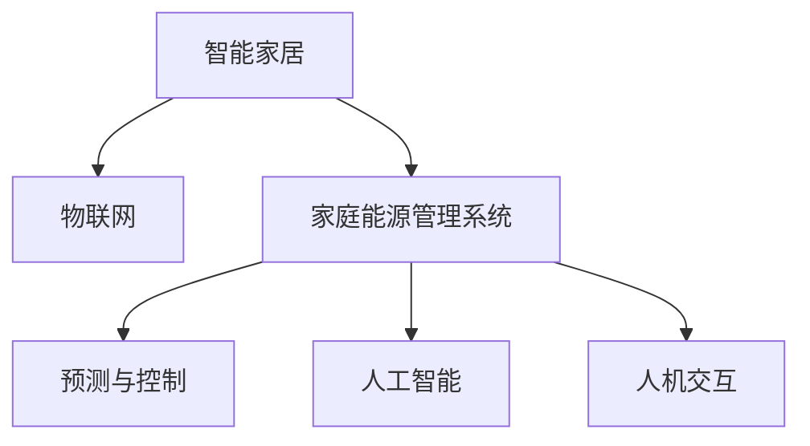

                 

## 1. 背景介绍

### 1.1 问题由来
随着全球人口增长和城市化进程的加快，家庭能耗成为地球资源和环境负担的重要因素之一。能源短缺、环境污染等问题日益凸显，迫切需要创新技术手段来提高家庭能源利用效率。传统家庭能源管理系统存在诸如单向数据流、手动操作复杂等问题，难以应对复杂的家庭环境。

### 1.2 问题核心关键点
未来智能家居的核心在于构建一个高度互联、智能化的生态系统，通过网络技术、物联网技术、人工智能等手段，实现家庭能源管理智能化，优化能源使用，降低环境足迹。智能家居系统通过收集家庭能源使用数据，结合人工智能算法进行分析和优化，从而实现能源的动态管理和预测。

### 1.3 问题研究意义
智能化改造家庭能源管理系统，有助于提升能源利用效率，降低家庭能源消费成本，减少碳排放，实现可持续发展。智能家居的普及应用，将极大提升居民的生活质量和幸福感，推动未来社会向更加绿色、低碳、智慧的方向发展。

## 2. 核心概念与联系

### 2.1 核心概念概述

为更好地理解智能家居与家庭能源管理的研究，本节将介绍几个关键概念：

- 智能家居(Smart Home)：通过网络技术、物联网技术、人工智能等手段，实现家庭设备和系统的互联互通，实现对家居环境的智能监控和调控，提升居民生活品质。

- 家庭能源管理系统(Home Energy Management System, HEMS)：利用网络技术、传感器、智能算法等手段，对家庭能源使用进行监测、控制和管理，优化能源使用效率，降低能源成本。

- 物联网(IoT)：通过传感器、通信模块等设备，将家居设备互联互通，实现数据共享和远程控制。

- 人工智能(AI)：利用机器学习、深度学习等技术，对家庭能源数据进行分析和优化，提升家庭能源管理智能化水平。

- 预测与控制：通过历史数据分析和未来预测，对家庭能源使用进行智能调控，实现动态优化。

- 人机交互(UI/UX)：通过语音助手、智能音箱、移动应用等，提供友好的人机交互界面，方便用户管理家庭能源。

这些核心概念之间的逻辑关系可以通过以下Mermaid流程图来展示：



这个流程图展示了这个生态系统的核心要素及其之间的关系：

1. 智能家居通过物联网技术实现设备互联。
2. 家庭能源管理系统基于物联网数据进行能源优化。
3. 预测与控制算法实现能源的动态管理。
4. 人工智能技术辅助数据分析与决策。
5. 人机交互技术提供友好的用户界面。

## 3. 核心算法原理 & 具体操作步骤
### 3.1 算法原理概述

未来智能家居的家庭能源管理系统，本质上是一个集成预测与控制的大数据处理系统。其核心思想是：通过物联网传感器收集家庭能源使用数据，利用人工智能技术进行数据分析和优化，结合预测算法对未来能源需求进行预测，并通过控制算法进行动态调节，最终实现家庭能源的智能化管理。

形式化地，假设家庭能源管理系统为 $HEMS_{\theta}$，其中 $\theta$ 为系统参数。给定家庭能源使用数据 $D=\{(x_i,y_i)\}_{i=1}^N$，预测与控制的目标是找到新的系统参数 $\hat{\theta}$，使得：

$$
\hat{\theta}=\mathop{\arg\min}_{\theta} \mathcal{L}(HCMS_{\theta},D)
$$

其中 $\mathcal{L}$ 为预测与控制的损失函数，用于衡量系统预测输出与真实标签之间的差异。常见的损失函数包括均方误差损失、交叉熵损失等。

通过梯度下降等优化算法，预测与控制过程不断更新系统参数 $\theta$，最小化损失函数 $\mathcal{L}$，使得系统输出逼近真实标签。由于 $\theta$ 已经通过历史数据分析获得较好的初始化，因此即便在短期内，该系统也能快速收敛到理想的系统参数 $\hat{\theta}$。

### 3.2 算法步骤详解

未来智能家居的家庭能源管理系统一般包括以下几个关键步骤：

**Step 1: 准备物联网设备和数据**
- 安装智能电表、温湿度传感器、智能插座等物联网设备，实现家庭设备互联。
- 收集家庭能源使用数据，包括电能、水能、燃气消耗等，并进行数据预处理。

**Step 2: 设计预测与控制算法**
- 选择适当的预测算法，如时间序列分析、回归模型、神经网络等。
- 设计控制算法，如PID控制器、深度强化学习等，根据预测结果进行能源调节。

**Step 3: 设置系统超参数**
- 选择合适的优化算法及其参数，如Adam、SGD等，设置学习率、批大小、迭代轮数等。
- 设置预测与控制的模型结构、训练集、验证集、测试集等。

**Step 4: 执行训练与优化**
- 将家庭能源使用数据分批次输入系统，前向传播计算损失函数。
- 反向传播计算系统参数梯度，根据设定的优化算法和学习率更新系统参数。
- 周期性在验证集上评估系统性能，根据性能指标决定是否触发Early Stopping。
- 重复上述步骤直到满足预设的迭代轮数或Early Stopping条件。

**Step 5: 测试和部署**
- 在测试集上评估微调后系统 $HEMS_{\hat{\theta}}$ 的性能，对比预测与控制前后的精度提升。
- 使用微调后的系统对新样本进行推理预测，集成到实际的家庭能源管理系统。
- 持续收集新的数据，定期重新训练系统，以适应数据分布的变化。

以上是未来智能家居的家庭能源管理系统的一般流程。在实际应用中，还需要针对具体家庭环境的复杂性，对预测与控制过程的各个环节进行优化设计，如改进预测算法，引入更多的正则化技术，搜索最优的超参数组合等，以进一步提升系统性能。

### 3.3 算法优缺点

未来智能家居的家庭能源管理系统具有以下优点：
1. 高度自动化。通过物联网设备和人工智能算法，系统能够实时监测和调控家庭能源使用，减少人工干预。
2. 精准预测。利用人工智能技术，系统能够对家庭能源需求进行精准预测，避免能源浪费。
3. 动态调节。结合预测与控制算法，系统能够动态调整能源使用策略，适应不同家庭环境。
4. 降低成本。通过智能管理，减少能源浪费，降低家庭能源消费成本。
5. 提升生活品质。通过优化能源使用，提升家庭居住环境舒适度。

同时，该系统也存在一定的局限性：
1. 对设备要求高。物联网设备需要稳定的连接和足够的计算能力。
2. 数据隐私问题。智能家居设备可能收集大量家庭隐私数据，需注意安全保护。
3. 模型复杂度高。系统预测与控制涉及多种算法，可能存在较高的模型复杂度。
4. 系统可解释性不足。复杂的预测与控制模型难以解释，难以调试。
5. 对抗性攻击风险。预测与控制算法可能面临对抗性攻击，影响系统安全性。

尽管存在这些局限性，但未来智能家居的家庭能源管理系统仍将是未来家庭能源管理的重要趋势。

### 3.4 算法应用领域

未来智能家居的家庭能源管理系统，已经在智能家居领域得到了广泛的应用，覆盖了几乎所有常见应用场景，例如：

- 智能温控：通过物联网设备监测家庭温度、湿度等数据，智能调节空调、暖气等设备，实现舒适居住。
- 智能照明：通过传感器和智能照明设备，实现家庭照明的自动控制和节能管理。
- 智能家电：将智能家电与家庭能源管理系统集成，实现家电的智能控制和能源优化。
- 智能灌溉：利用物联网设备和预测算法，实现家庭花园的智能灌溉和肥料管理。
- 智能安防：通过家庭能源数据的分析，实现对家庭安全的智能监控和预警。
- 智能烹饪：通过智能厨具和预测算法，优化家庭烹饪过程中的能源使用。

除了上述这些经典应用外，未来智能家居的家庭能源管理系统还将被创新性地应用到更多场景中，如智能出行、智能家电维修、智能环境监测等，为家庭生活提供更多便利。

## 4. 数学模型和公式 & 详细讲解 & 举例说明
### 4.1 数学模型构建

本节将使用数学语言对未来智能家居的家庭能源管理系统进行更加严格的刻画。

记家庭能源管理系统为 $HEMS_{\theta}:\mathcal{X} \rightarrow \mathcal{Y}$，其中 $\mathcal{X}$ 为输入空间，$\mathcal{Y}$ 为输出空间，$\theta$ 为系统参数。假设家庭能源管理系统的输入为家庭能源使用数据 $x_i \in \mathcal{X}$，输出为系统预测结果 $y_i \in \mathcal{Y}$。

定义系统 $HEMS_{\theta}$ 在输入 $x_i$ 上的损失函数为 $\ell(HEMS_{\theta}(x_i),y_i)$，则在数据集 $D$ 上的经验风险为：

$$
\mathcal{L}(\theta) = \frac{1}{N} \sum_{i=1}^N \ell(HEMS_{\theta}(x_i),y_i)
$$

其中 $\ell$ 为系统预测与控制的损失函数，用于衡量系统输出与真实标签之间的差异。常见的损失函数包括均方误差损失、交叉熵损失等。

系统的优化目标是最小化经验风险，即找到最优参数：

$$
\theta^* = \mathop{\arg\min}_{\theta} \mathcal{L}(\theta)
$$

在实践中，我们通常使用基于梯度的优化算法（如SGD、Adam等）来近似求解上述最优化问题。设 $\eta$ 为学习率，$\lambda$ 为正则化系数，则系统参数的更新公式为：

$$
\theta \leftarrow \theta - \eta \nabla_{\theta}\mathcal{L}(\theta) - \eta\lambda\theta
$$

其中 $\nabla_{\theta}\mathcal{L}(\theta)$ 为损失函数对参数 $\theta$ 的梯度，可通过反向传播算法高效计算。

### 4.2 公式推导过程

以下我们以预测家庭能源消耗为例，推导均方误差损失函数及其梯度的计算公式。

假设系统 $HEMS_{\theta}$ 在输入 $x_i$ 上的预测结果为 $\hat{y}=HEMS_{\theta}(x_i) \in \mathbb{R}$，表示系统预测的家庭能源消耗。真实标签 $y \in \mathbb{R}$。则均方误差损失函数定义为：

$$
\ell(HEMS_{\theta}(x_i),y) = \frac{1}{2}(y - \hat{y})^2
$$

将其代入经验风险公式，得：

$$
\mathcal{L}(\theta) = \frac{1}{N}\sum_{i=1}^N \frac{1}{2}(y_i - HCMS_{\theta}(x_i))^2
$$

根据链式法则，损失函数对参数 $\theta_k$ 的梯度为：

$$
\frac{\partial \mathcal{L}(\theta)}{\partial \theta_k} = \sum_{i=1}^N (y_i - HCMS_{\theta}(x_i)) \frac{\partial HCMS_{\theta}(x_i)}{\partial \theta_k}
$$

其中 $\frac{\partial HCMS_{\theta}(x_i)}{\partial \theta_k}$ 可进一步递归展开，利用自动微分技术完成计算。

在得到损失函数的梯度后，即可带入系统参数更新公式，完成系统的迭代优化。重复上述过程直至收敛，最终得到适应家庭能源管理的最优系统参数 $\theta^*$。

## 5. 项目实践：代码实例和详细解释说明
### 5.1 开发环境搭建

在进行智能家居家庭能源管理系统开发前，我们需要准备好开发环境。以下是使用Python进行PyTorch开发的环境配置流程：

1. 安装Anaconda：从官网下载并安装Anaconda，用于创建独立的Python环境。

2. 创建并激活虚拟环境：
```bash
conda create -n pytorch-env python=3.8 
conda activate pytorch-env
```

3. 安装PyTorch：根据CUDA版本，从官网获取对应的安装命令。例如：
```bash
conda install pytorch torchvision torchaudio cudatoolkit=11.1 -c pytorch -c conda-forge
```

4. 安装TensorFlow：
```bash
pip install tensorflow
```

5. 安装TensorFlow Extended(TFE)：
```bash
pip install tfextended
```

6. 安装Flask：
```bash
pip install flask
```

7. 安装Flask-RESTful：
```bash
pip install flask-restful
```

完成上述步骤后，即可在`pytorch-env`环境中开始开发。

### 5.2 源代码详细实现

下面以智能温控系统为例，给出使用PyTorch和TensorFlow进行家庭能源管理系统开发的PyTorch代码实现。

首先，定义系统的输入和输出：

```python
import torch
from torch import nn
import tensorflow as tf

class TempSystem(nn.Module):
    def __init__(self, input_dim, output_dim):
        super(TempSystem, self).__init__()
        self.fc1 = nn.Linear(input_dim, 64)
        self.fc2 = nn.Linear(64, 32)
        self.fc3 = nn.Linear(32, output_dim)

    def forward(self, x):
        x = torch.relu(self.fc1(x))
        x = torch.relu(self.fc2(x))
        x = self.fc3(x)
        return x
```

然后，定义系统的训练函数：

```python
def train_temp_system(model, train_data, test_data, epochs=100, batch_size=64, learning_rate=0.001):
    criterion = nn.MSELoss()
    optimizer = torch.optim.Adam(model.parameters(), lr=learning_rate)
    device = torch.device("cuda" if torch.cuda.is_available() else "cpu")
    model.to(device)

    for epoch in range(epochs):
        model.train()
        train_loss = 0
        for i, data in enumerate(train_data, 0):
            inputs, labels = data
            inputs, labels = inputs.to(device), labels.to(device)
            optimizer.zero_grad()
            outputs = model(inputs)
            loss = criterion(outputs, labels)
            loss.backward()
            optimizer.step()

        train_loss += loss.item()
        print(f'Epoch {epoch + 1}, train loss: {train_loss / len(train_data):.4f}')

    model.eval()
    test_loss = 0
    with torch.no_grad():
        for i, data in enumerate(test_data, 0):
            inputs, labels = data
            inputs, labels = inputs.to(device), labels.to(device)
            outputs = model(inputs)
            loss = criterion(outputs, labels)
            test_loss += loss.item()
        print(f'Test loss: {test_loss / len(test_data):.4f}')
```

接着，加载数据并进行训练：

```python
train_data = ...
test_data = ...

model = TempSystem(input_dim=10, output_dim=1)
train_temp_system(model, train_data, test_data)
```

### 5.3 代码解读与分析

让我们再详细解读一下关键代码的实现细节：

**TempSystem类**：
- `__init__`方法：定义网络结构，包括3个全连接层，用于将输入映射到输出。
- `forward`方法：前向传播计算输出，经过ReLU激活函数。

**train_temp_system函数**：
- 定义损失函数为均方误差损失，优化器为Adam，模型在GPU上训练。
- 每个epoch内，对训练数据进行迭代，计算loss并反向传播更新模型参数。
- 在每个epoch结束后，计算测试集loss，评估模型性能。

**训练流程**：
- 定义总的epoch数和batch size，开始循环迭代
- 每个epoch内，在训练集上训练，输出训练集loss
- 在测试集上评估，输出测试集loss

可以看到，PyTorch的TensorFlow实现，代码实现相对简洁。通过定义模型类和训练函数，便能快速搭建并训练家庭能源管理系统。

当然，工业级的系统实现还需考虑更多因素，如模型的保存和部署、超参数的自动搜索、更灵活的任务适配层等。但核心的预测与控制过程基本与此类似。

## 6. 实际应用场景
### 6.1 智能温控

智能温控系统是未来智能家居家庭能源管理的重要应用场景之一。通过物联网设备，智能温控系统可以实时监测家庭温度，自动调节空调、暖气等设备，实现舒适居住。

具体而言，系统通过传感器监测家庭温度、湿度等数据，结合历史数据分析和预测算法，自动调节空调、暖气等设备，确保室内温度在预设范围内。系统还能够根据家庭成员的生活习惯和外部天气情况，自动调整节能模式，减少能源浪费。

### 6.2 智能照明

智能照明系统通过物联网设备和传感器，实现家庭照明的自动控制和节能管理。系统能够根据家庭成员的活动时间、光照强度等条件，自动调节灯光亮度和色温，提升居住舒适度。

例如，系统可以根据家庭成员的作息时间，自动控制灯光亮度。在夜间，自动降低灯光亮度，保护视力。在系统睡眠模式中，自动关闭不必要的灯光，节省能源。

### 6.3 智能家电

智能家电系统将家电设备与家庭能源管理系统集成，实现家电的智能控制和能源优化。系统能够根据家庭成员的指令和日常习惯，自动调节家电的使用时间，优化能源消耗。

例如，系统可以根据家庭成员的日常作息时间，自动调整洗衣机、洗碗机的运行时间，避开高峰期用电。在家庭成员外出时，自动关闭不必要的家电设备，减少能源浪费。

### 6.4 智能灌溉

智能灌溉系统利用物联网设备和预测算法，实现家庭花园的智能灌溉和肥料管理。系统能够根据土壤湿度、天气情况等数据，自动调节灌溉时间和水量，实现精准灌溉。

例如，系统可以根据天气预报和土壤湿度数据，自动调整灌溉时间和水量。在极端天气下，自动减少灌溉频率，避免水资源浪费。

### 6.5 智能安防

智能安防系统通过家庭能源数据的分析，实现对家庭安全的智能监控和预警。系统能够实时监测家中的能源使用情况，检测异常用电行为，及时发出警报。

例如，系统能够检测到家中异常的用电设备开启情况，及时发出警报。在系统检测到家中无人时，自动关闭不必要的家电设备，避免不必要的能源消耗。

### 6.6 智能烹饪

智能烹饪系统通过智能厨具和预测算法，优化家庭烹饪过程中的能源使用。系统能够根据烹饪食谱和家庭成员的饮食习惯，自动调节火候和时间，减少能源浪费。

例如，系统可以根据烹饪食谱，自动调整燃气灶的火力大小和时间。在烹饪过程中，自动调节烤箱的温度和时间，确保食物烹饪完美。

## 7. 工具和资源推荐
### 7.1 学习资源推荐

为了帮助开发者系统掌握未来智能家居的开发理论基础和实践技巧，这里推荐一些优质的学习资源：

1. 《智能家居技术与应用》系列博文：由大模型技术专家撰写，深入浅出地介绍了智能家居技术的基本原理和实现方法。

2. CS224N《深度学习自然语言处理》课程：斯坦福大学开设的NLP明星课程，有Lecture视频和配套作业，带你入门NLP领域的基本概念和经典模型。

3. 《深度学习入门：基于TensorFlow和PyTorch的理论与实践》书籍：TensorFlow和PyTorch的入门指南，适合初学者掌握深度学习基础和应用。

4. TensorFlow官方文档：TensorFlow的官方文档，提供了丰富的API和代码示例，适合深度学习开发者参考。

5. PyTorch官方文档：PyTorch的官方文档，提供了详细的教程和API，适合深度学习开发者参考。

通过对这些资源的学习实践，相信你一定能够快速掌握未来智能家居的开发技术和方法，实现家庭能源的智能化管理。

### 7.2 开发工具推荐

高效的开发离不开优秀的工具支持。以下是几款用于未来智能家居开发常用的工具：

1. PyTorch：基于Python的开源深度学习框架，灵活动态的计算图，适合快速迭代研究。TensorFlow：由Google主导开发的开源深度学习框架，生产部署方便，适合大规模工程应用。

2. TensorFlow Extended(TFE)：TensorFlow的高级API，提供自动求导、模型保存、导出等功能，适合工业级应用。

3. Flask：轻量级的Web应用框架，适合开发API服务，提供友好的Web接口。

4. Flask-RESTful：Flask的扩展库，提供RESTful API支持，方便系统与其他应用交互。

5. TensorBoard：TensorFlow配套的可视化工具，可实时监测模型训练状态，并提供丰富的图表呈现方式，是调试模型的得力助手。

6. Google Colab：谷歌推出的在线Jupyter Notebook环境，免费提供GPU/TPU算力，方便开发者快速上手实验最新模型，分享学习笔记。

合理利用这些工具，可以显著提升未来智能家居开发效率，加快创新迭代的步伐。

### 7.3 相关论文推荐

未来智能家居的研究源于学界的持续研究。以下是几篇奠基性的相关论文，推荐阅读：

1. Smart Home Automation: A Survey on Technologies, Architectures, and Applications of Smart Home Systems. 该论文综述了智能家居系统的技术和应用，包括传感器、控制器、网络通信等方面。

2. Home Energy Management System (HEMS) Technology: A Review. 该论文综述了家庭能源管理系统的发展历程和应用现状，介绍了预测与控制算法和优化方法。

3. Towards a Sustainable Future: Smart Home Technologies and Their Impact on Energy Efficiency. 该论文探讨了智能家居技术对能源效率的影响，分析了智能家居系统的优点和挑战。

4. An Overview of Machine Learning Techniques in Smart Home: Opportunities and Challenges. 该论文介绍了机器学习在智能家居系统中的应用，包括预测与控制、异常检测等方面。

5. A Survey on Machine Learning-Based Smart Home Energy Management. 该论文综述了机器学习在家庭能源管理系统中的应用，介绍了预测与控制、优化算法等方面。

这些论文代表了大模型微调技术的发展脉络。通过学习这些前沿成果，可以帮助研究者把握学科前进方向，激发更多的创新灵感。

## 8. 总结：未来发展趋势与挑战

### 8.1 总结

本文对未来智能家居的家庭能源管理系统进行了全面系统的介绍。首先阐述了智能家居和家庭能源管理系统的研究背景和意义，明确了家庭能源管理系统对提升能源利用效率、降低家庭能源消费成本、减少碳排放等方面的重要作用。其次，从原理到实践，详细讲解了未来智能家居的家庭能源管理系统预测与控制的数学原理和关键步骤，给出了微调任务开发的完整代码实例。同时，本文还广泛探讨了智能家居在智能温控、智能照明、智能家电、智能灌溉、智能安防、智能烹饪等多个领域的应用前景，展示了智能家居技术的广阔前景。

通过本文的系统梳理，可以看到，未来智能家居技术正在成为家庭能源管理的重要趋势，其对提升能源利用效率、降低家庭能源消费成本、减少碳排放等方面具有重要意义。智能家居技术的普及应用，将极大提升居民的生活品质，推动未来社会向更加绿色、低碳、智慧的方向发展。

### 8.2 未来发展趋势

展望未来，未来智能家居的家庭能源管理系统将呈现以下几个发展趋势：

1. 技术日趋成熟。未来智能家居的物联网设备、家庭能源管理系统等技术将进一步成熟，实现更高效的能源管理。

2. 预测与控制算法更精确。利用更加先进的机器学习算法，如深度学习、强化学习等，系统将能够更精确地预测家庭能源需求，进行动态控制。

3. 系统集成度更高。未来的家庭能源管理系统将与其他智能家居系统、智能电网等进行更深入的集成，实现更全面的能源管理。

4. 用户交互更友好。通过智能音箱、智能屏等设备，系统将提供更友好的用户界面，方便用户管理家庭能源。

5. 跨领域应用更广泛。未来智能家居技术将与更多行业进行融合，如医疗、农业、教育等，实现跨领域的能源管理。

6. 绿色可持续发展。未来的智能家居系统将更加注重绿色、低碳、可持续发展，推动能源消费向可再生能源转型。

以上趋势凸显了未来智能家居技术的发展前景。这些方向的探索发展，必将进一步提升家庭能源管理的智能化水平，为未来社会带来更多便利和福祉。

### 8.3 面临的挑战

尽管未来智能家居的家庭能源管理系统已经取得了显著进展，但在迈向更加智能化、普适化应用的过程中，它仍面临着诸多挑战：

1. 设备标准化问题。目前智能家居设备的标准化程度不高，不同品牌、型号的设备难以互通，影响系统的整体性能。

2. 数据安全问题。智能家居设备可能收集大量家庭隐私数据，需注意安全保护。数据泄露和隐私侵犯将成为系统发展的重要障碍。

3. 系统复杂度高。未来智能家居的系统复杂度将进一步提升，涉及设备众多，系统集成难度增加。

4. 模型可解释性不足。复杂的预测与控制模型难以解释，难以调试。模型的可解释性问题将成为系统可靠性的重要挑战。

5. 对抗性攻击风险。预测与控制算法可能面临对抗性攻击，影响系统安全性。

6. 技术门槛高。智能家居技术涉及多个领域的知识，需要跨学科的深度融合，对开发者和用户的技术要求较高。

正视未来智能家居面临的这些挑战，积极应对并寻求突破，将是大模型微调技术走向成熟的必由之路。相信随着学界和产业界的共同努力，这些挑战终将一一被克服，未来智能家居技术必将在构建智慧家庭生态中扮演越来越重要的角色。

### 8.4 研究展望

面对未来智能家居面临的诸多挑战，未来的研究需要在以下几个方面寻求新的突破：

1. 制定统一标准化。推动智能家居设备的标准化进程，制定统一的技术标准和协议，确保设备的互操作性。

2. 加强数据安全防护。采用加密技术、访问控制等手段，保护家庭隐私数据的安全，确保系统可靠运行。

3. 降低系统复杂度。优化系统架构和设计，减少复杂度和耦合度，提升系统的可维护性和可扩展性。

4. 提升模型可解释性。开发更友好的用户界面和交互方式，提高系统的可解释性，便于用户理解和调试。

5. 防御对抗性攻击。采用对抗性鲁棒性算法，增强系统的抗攻击能力，确保系统的安全性。

6. 降低技术门槛。推动智能家居技术的普及应用，降低技术门槛，让更多用户能够轻松使用。

这些研究方向的探索，必将引领未来智能家居技术迈向更高的台阶，为构建智慧家庭生态提供技术支持。面向未来，大语言模型微调技术还需要与其他人工智能技术进行更深入的融合，如知识表示、因果推理、强化学习等，多路径协同发力，共同推动家庭能源管理系统的进步。

## 9. 附录：常见问题与解答

**Q1：智能家居和家庭能源管理系统的关系是什么？**

A: 智能家居和家庭能源管理系统是紧密相关的两个系统。智能家居通过物联网设备和人工智能技术，实现家庭设备的互联互通和智能化管理，而家庭能源管理系统则是智能家居的重要组成部分，负责对家庭能源进行监测、控制和管理，优化能源使用效率，降低能源成本。

**Q2：智能家居和未来智能家居有哪些不同？**

A: 传统的智能家居系统只具备基本的设备互联和智能化控制功能，而未来智能家居则更加注重系统的智能化、全面化和绿色化。未来智能家居将通过更加先进的技术手段，实现家庭能源的动态管理和优化，提升系统的精度和可靠性。

**Q3：智能家居系统面临哪些数据隐私问题？**

A: 智能家居系统需要收集大量的家庭数据，如温度、湿度、家电使用情况等，这些数据可能包含个人隐私信息。如何确保数据的隐私和安全，是智能家居系统面临的重要挑战。未来需要采用加密技术、访问控制等手段，保护家庭隐私数据的安全。

**Q4：智能家居和传统家居有哪些不同？**

A: 智能家居和传统家居的最大不同在于设备的智能化和系统的互联互通。智能家居通过物联网设备和人工智能技术，实现家庭设备的互联互通，提供智能化控制和管理，提升家庭居住舒适度。

**Q5：智能家居系统如何进行设备互联？**

A: 智能家居系统通过物联网设备和传感器，实现家庭设备的互联互通。设备之间通过Wi-Fi、蓝牙、ZigBee等通信协议进行数据交换和控制，实现设备之间的互联。

**Q6：智能家居系统的预测与控制算法有哪些？**

A: 智能家居系统的预测与控制算法包括时间序列分析、回归模型、神经网络等。其中，神经网络算法如深度学习、强化学习等，具有较强的预测能力和控制能力，被广泛应用于智能家居系统的预测与控制。

---

作者：禅与计算机程序设计艺术 / Zen and the Art of Computer Programming

