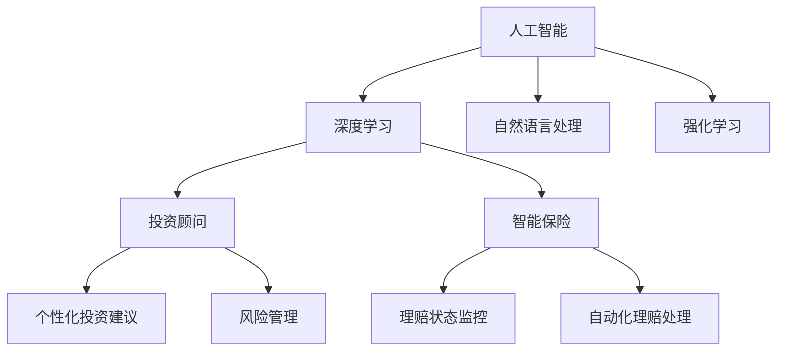

                 

# 未来的智能金融：2050年的AI投资顾问与智能保险理赔

## 1. 背景介绍

### 1.1 问题由来
随着人工智能技术的飞速发展，金融领域逐渐引入了一系列前沿技术，其中AI投资顾问和智能保险理赔成为未来金融科技的重要方向。这些技术的引入，不仅提高了金融服务的效率和质量，也使得金融机构能够更好地服务客户、降低风险，甚至在特定场景下实现智能决策。

### 1.2 问题核心关键点
本文章聚焦于AI投资顾问与智能保险理赔的未来发展，探究其在2050年的应用前景和技术架构。AI投资顾问利用机器学习和大数据算法，为客户提供个性化的投资建议和风险管理。智能保险理赔则通过深度学习技术，实时监控理赔状态，自动化处理理赔请求，提升保险理赔的速度和准确性。

## 2. 核心概念与联系

### 2.1 核心概念概述

为更好地理解AI投资顾问与智能保险理赔的未来技术架构，本节将介绍几个密切相关的核心概念：

- **人工智能(AI)**：利用机器学习、深度学习、自然语言处理等技术，实现数据驱动的智能决策和自动化处理。
- **金融科技(Fintech)**：将互联网和金融相结合，利用信息技术提升金融服务效率和质量，改善客户体验。
- **投资顾问**：提供个性化的投资建议，帮助客户制定投资策略，进行风险管理。
- **智能保险**：通过深度学习、自然语言处理等技术，自动化处理保险理赔流程，提升理赔速度和准确性。
- **深度学习(DL)**：一种机器学习算法，利用多层神经网络进行非线性映射，处理复杂的数据模式。
- **自然语言处理(NLP)**：使计算机能够理解、处理和生成人类语言的技术。
- **强化学习(RL)**：通过与环境的交互，使智能体学习最优策略，应用于投资决策和保险理赔自动化。

这些核心概念之间的逻辑关系可以通过以下Mermaid流程图来展示：



这个流程图展示了一些关键概念的连接关系：

1. **人工智能**是基础，通过深度学习和自然语言处理技术，支持个性化投资建议和智能理赔。
2. **深度学习**用于构建复杂模型，处理海量数据，支持智能决策。
3. **自然语言处理**帮助系统理解人类语言，应用于智能客服和理赔处理。
4. **强化学习**通过与环境的交互优化策略，用于自动化理赔过程。
5. **投资顾问**和**智能保险**都是人工智能在金融领域的具体应用，分别解决投资和理赔问题。

## 3. 核心算法原理 & 具体操作步骤
### 3.1 算法原理概述

AI投资顾问与智能保险理赔的核心算法原理主要基于以下三个方面：

1. **深度学习**：构建深度神经网络，通过多层次的特征提取和模式学习，对大量历史数据进行建模，以预测未来的投资趋势和理赔状态。
2. **自然语言处理**：利用NLP技术，对文本数据进行分词、词性标注、命名实体识别等处理，使得系统能够理解客户的自然语言输入。
3. **强化学习**：通过与环境的交互，不断优化策略，以提升系统的决策准确性和效率。

在实际操作中，这些技术通过以下步骤实现：

**Step 1: 数据收集与预处理**
- **投资顾问**：收集历史股票价格、公司财务数据、市场情绪数据等，用于构建投资策略模型。
- **智能保险**：收集历史理赔数据、用户申请信息、自然灾害数据等，用于构建理赔处理模型。

**Step 2: 模型构建与训练**
- **深度学习模型**：使用卷积神经网络(CNN)、循环神经网络(RNN)、长短时记忆网络(LSTM)等模型对数据进行训练。
- **自然语言处理模型**：利用预训练的BERT、GPT等模型对文本数据进行处理。
- **强化学习模型**：通过Q-learning、SARSA等算法，训练智能体与环境的交互策略。

**Step 3: 微调和优化**
- 通过超参数调优、正则化等技术，提升模型的泛化能力。
- 利用对抗样本生成技术，增强模型的鲁棒性。

### 3.2 算法步骤详解

以下将对AI投资顾问与智能保险理赔的算法步骤进行详细介绍：

**AI投资顾问算法步骤**

1. **数据收集与清洗**：收集市场数据、财务数据、新闻、社交媒体等，清洗噪声和缺失值。
2. **特征提取**：利用PCA、LDA等降维技术，提取关键特征。
3. **模型训练**：使用LSTM、GRU等模型进行训练，得到投资策略模型。
4. **回测与评估**：在历史数据上进行回测，评估模型的投资收益和风险。
5. **在线交易**：将模型部署到交易平台，实现自动化交易。

**智能保险理赔算法步骤**

1. **数据收集与清洗**：收集理赔申请数据、客户信息、自然灾害数据等，清洗噪声和异常值。
2. **模型训练**：使用深度神经网络对数据进行训练，得到理赔状态预测模型。
3. **在线监控**：实时监控理赔状态，利用强化学习优化理赔处理策略。
4. **自动化处理**：根据监控结果，自动处理理赔请求，减少人工干预。

### 3.3 算法优缺点

AI投资顾问与智能保险理赔具有以下优点：

- **高效性**：自动化处理大量数据，节省人工成本，提高决策速度。
- **个性化**：基于客户的历史数据和偏好，提供定制化的投资建议和理赔方案。
- **风险管理**：通过深度学习和大数据分析，更好地预测市场风险，进行风险控制。

然而，这些技术也存在一些局限性：

- **数据依赖**：需要大量的高质量数据进行训练，数据偏差可能导致模型失效。
- **模型复杂性**：深度学习模型复杂，计算资源消耗大，训练时间长。
- **透明度**：模型决策过程复杂，难以解释，对客户信任度有影响。

### 3.4 算法应用领域

AI投资顾问与智能保险理赔已经在金融领域得到了广泛的应用，具体应用领域包括：

- **投资管理**：提供个性化的投资建议，帮助客户制定投资策略，进行风险管理。
- **保险理赔**：自动化处理理赔申请，实时监控理赔状态，提高理赔速度和准确性。
- **金融风险管理**：预测市场风险，进行风险预警和控制。
- **智能客服**：通过自然语言处理技术，提供智能客服，解答客户疑问。
- **智能投顾平台**：结合AI技术和大数据分析，构建智能化投顾平台。

## 4. 数学模型和公式 & 详细讲解 & 举例说明

### 4.1 数学模型构建

本节将使用数学语言对AI投资顾问与智能保险理赔的算法模型进行更加严格的刻画。

设投资顾问的输入数据为 $X$，包括股票价格、财务数据、市场情绪等。目标输出为 $Y$，包括投资策略、风险评级等。投资顾问的数学模型可以表示为：

$$
Y = f(X; \theta)
$$

其中 $f$ 表示模型的非线性映射，$\theta$ 为模型的参数。通过最小化均方误差（MSE）或交叉熵损失（CE）等损失函数，对模型进行训练和优化：

$$
\min_{\theta} \frac{1}{N} \sum_{i=1}^N (Y_i - f(X_i; \theta))^2
$$

对于智能保险理赔，设输入数据为 $X'$，包括理赔申请数据、客户信息、自然灾害数据等，目标输出为 $Y'$，包括理赔状态、处理策略等。智能保险的数学模型可以表示为：

$$
Y' = g(X'; \phi)
$$

其中 $g$ 表示模型的非线性映射，$\phi$ 为模型的参数。通过最小化交叉熵损失等，对模型进行训练和优化：

$$
\min_{\phi} \frac{1}{N'} \sum_{i'=1}^{N'} -y'_{i'}\log g(X'_{i'}; \phi)
$$

### 4.2 公式推导过程

以下以投资顾问的LSTM模型为例，推导其损失函数的计算过程。

设投资顾问的LSTM模型为 $M_{\theta}$，其输入数据为 $X=[x_1,x_2,\ldots,x_T]$，其中 $x_t$ 表示第 $t$ 天的市场数据。模型的输出为 $Y=[y_1,y_2,\ldots,y_T]$，表示每一天的投资策略。损失函数定义为均方误差损失：

$$
\mathcal{L}(\theta) = \frac{1}{T} \sum_{t=1}^T (y_t - \hat{y}_t)^2
$$

其中 $\hat{y}_t$ 表示模型在 $t$ 天的预测策略，$y_t$ 表示实际策略。将均方误差损失展开并计算梯度：

$$
\frac{\partial \mathcal{L}(\theta)}{\partial \theta} = -\frac{2}{T} \sum_{t=1}^T (y_t - \hat{y}_t)(\hat{y}_t - f_{\theta}(x_t))
$$

其中 $f_{\theta}(x_t)$ 表示模型在 $x_t$ 上的预测输出。根据链式法则，计算每个参数的梯度并进行更新：

$$
\theta \leftarrow \theta - \eta \nabla_{\theta}\mathcal{L}(\theta)
$$

### 4.3 案例分析与讲解

以智能保险理赔的深度学习模型为例，分析其构建与训练过程。

假设智能保险理赔的深度学习模型为 $M_{\phi}$，其输入数据为 $X'=[x'_1,x'_2,\ldots,x'_{N'}}$，其中 $x'_i$ 表示第 $i$ 个理赔申请。模型的输出为 $Y'=[y'_1,y'_2,\ldots,y'_{N'}}$，表示每个理赔的状态和处理策略。损失函数定义为交叉熵损失：

$$
\mathcal{L}(\phi) = -\frac{1}{N'} \sum_{i'=1}^{N'} y'_{i'}\log g(X'_{i'}; \phi)
$$

其中 $g(X'_{i'}; \phi)$ 表示模型在 $x'_i$ 上的预测状态和处理策略。通过反向传播计算梯度，并使用优化算法更新模型参数 $\phi$：

$$
\phi \leftarrow \phi - \eta \nabla_{\phi}\mathcal{L}(\phi)
$$

## 5. 项目实践：代码实例和详细解释说明

### 5.1 开发环境搭建

在进行AI投资顾问与智能保险理赔的开发前，我们需要准备好开发环境。以下是使用Python进行TensorFlow开发的环境配置流程：

1. 安装Anaconda：从官网下载并安装Anaconda，用于创建独立的Python环境。

2. 创建并激活虚拟环境：
```bash
conda create -n tf-env python=3.8 
conda activate tf-env
```

3. 安装TensorFlow：根据CUDA版本，从官网获取对应的安装命令。例如：
```bash
pip install tensorflow-gpu==2.7.0
```

4. 安装TensorBoard：
```bash
pip install tensorboard
```

5. 安装其它工具包：
```bash
pip install pandas numpy scikit-learn matplotlib tqdm jupyter notebook ipython
```

完成上述步骤后，即可在`tf-env`环境中开始项目实践。

### 5.2 源代码详细实现

以下以智能保险理赔的深度学习模型为例，给出使用TensorFlow进行开发的PyTorch代码实现。

首先，定义数据处理函数：

```python
import tensorflow as tf
from tensorflow.keras import layers

class理赔处理(tf.keras.Model):
    def __init__(self, input_shape):
        super(理赔处理, self).__init__()
        self.dense1 = layers.Dense(128, activation='relu', input_shape=input_shape)
        self.dense2 = layers.Dense(64, activation='relu')
        self.dense3 = layers.Dense(32, activation='relu')
        self.dense4 = layers.Dense(1, activation='sigmoid')
        
    def call(self, inputs):
        x = self.dense1(inputs)
        x = self.dense2(x)
        x = self.dense3(x)
        return self.dense4(x)
        
    def summary(self):
        print("Model Summary")
        super(理赔处理, self).summary()

# 定义输入数据
input_shape = (100, )
x = tf.random.normal(shape=(10, 100))
y = tf.random.normal(shape=(10, 1))

model = 理赔处理(input_shape)
model.summary()

# 编译模型
model.compile(optimizer='adam', loss='binary_crossentropy', metrics=['accuracy'])

# 训练模型
model.fit(x, y, epochs=10, validation_split=0.2)
```

然后，定义评估和预测函数：

```python
def evaluate(model, test_x, test_y):
    loss, accuracy = model.evaluate(test_x, test_y)
    print(f"Test Loss: {loss:.4f}, Test Accuracy: {accuracy:.4f}")
    
def predict(model, new_x):
    y_pred = model.predict(new_x)
    return y_pred
```

最后，启动训练流程并在测试集上评估：

```python
# 定义输入数据
input_shape = (100, )
x = tf.random.normal(shape=(10, 100))
y = tf.random.normal(shape=(10, 1))

# 编译模型
model = 理赔处理(input_shape)
model.compile(optimizer='adam', loss='binary_crossentropy', metrics=['accuracy'])

# 训练模型
model.fit(x, y, epochs=10, validation_split=0.2)

# 在测试集上评估
test_x = tf.random.normal(shape=(10, 100))
test_y = tf.random.normal(shape=(10, 1))
evaluate(model, test_x, test_y)

# 预测新数据
new_x = tf.random.normal(shape=(1, 100))
y_pred = predict(model, new_x)
print(f"Prediction: {y_pred}")
```

以上就是使用TensorFlow对智能保险理赔模型进行开发的完整代码实现。可以看到，TensorFlow提供了非常强大的Keras API，使得模型的构建和训练变得非常简单和高效。

### 5.3 代码解读与分析

让我们再详细解读一下关键代码的实现细节：

**理赔处理类**：
- `__init__`方法：初始化模型各层结构。
- `call`方法：定义模型前向传播过程。
- `summary`方法：打印模型结构摘要。

**数据生成**：
- `x` 和 `y` 生成随机数据，模拟理赔申请和状态。

**模型编译与训练**：
- `model.compile`方法：设置优化器、损失函数、评估指标。
- `model.fit`方法：进行模型训练，划分训练集和验证集。

**评估与预测**：
- `evaluate`方法：在测试集上评估模型性能。
- `predict`方法：对新数据进行预测。

可以看到，TensorFlow使得模型的构建和训练变得非常方便。开发者可以专注于模型的设计和优化，而不必过多关注底层的实现细节。

当然，工业级的系统实现还需考虑更多因素，如模型的保存和部署、超参数的自动搜索、更灵活的任务适配层等。但核心的模型构建和训练流程基本与此类似。

## 6. 实际应用场景

### 6.1 智能投资顾问

智能投资顾问通过深度学习和自然语言处理技术，能够提供个性化的投资建议和风险管理服务。在实际应用中，智能投资顾问可以应用于以下场景：

1. **个人投资管理**：根据客户的历史数据和偏好，提供个性化的投资策略。
2. **企业投融资**：帮助企业进行市场分析和风险评估，制定投资计划。
3. **资产配置**：通过多因子模型和深度学习技术，进行资产配置和组合优化。
4. **风险预警**：实时监控市场情绪和舆情，进行风险预警和规避。

### 6.2 智能保险理赔

智能保险理赔通过深度学习和强化学习技术，自动化处理理赔申请，提升理赔速度和准确性。在实际应用中，智能保险理赔可以应用于以下场景：

1. **自动化理赔**：通过深度学习模型预测理赔状态，进行自动化处理。
2. **智能客服**：利用自然语言处理技术，提供智能客服，解答理赔疑问。
3. **欺诈检测**：通过深度学习模型检测理赔欺诈，提高理赔处理的透明度和公正性。
4. **个性化服务**：根据客户的历史数据和偏好，提供个性化的理赔方案。

### 6.3 未来应用展望

随着AI技术的发展，未来的AI投资顾问与智能保险理赔将更加智能化和个性化。预计未来将有以下几个重要趋势：

1. **深度学习模型的优化**：通过优化模型结构和训练方法，提升模型的精度和泛化能力。
2. **自然语言处理的突破**：利用预训练语言模型，提升系统的自然语言理解和生成能力。
3. **强化学习的应用**：通过强化学习技术，提升系统的自动化决策能力。
4. **区块链技术的应用**：通过区块链技术，确保数据和交易的安全性和透明性。
5. **联邦学习的应用**：通过联邦学习技术，保护用户隐私，提升模型安全性。
6. **AI伦理的关注**：在模型开发和应用过程中，注重AI伦理和公平性，避免偏见和歧视。

## 7. 工具和资源推荐
### 7.1 学习资源推荐

为了帮助开发者系统掌握AI投资顾问与智能保险理赔的理论基础和实践技巧，这里推荐一些优质的学习资源：

1. **《深度学习》一书**：Ian Goodfellow等著，全面介绍深度学习理论和实践，涵盖深度学习模型构建和优化。
2. **TensorFlow官方文档**：TensorFlow的官方文档，提供丰富的API和样例代码，是进行深度学习开发的重要参考。
3. **Kaggle竞赛平台**：提供丰富的数据集和竞赛题目，通过实践提升深度学习应用能力。
4. **Coursera深度学习课程**：由斯坦福大学Andrew Ng教授主讲，系统介绍深度学习理论和实践，适合入门学习。
5. **OpenAI GPT-3文档**：OpenAI的GPT-3模型文档，提供详细的API接口和使用指南。

通过对这些资源的学习实践，相信你一定能够快速掌握AI投资顾问与智能保险理赔的精髓，并用于解决实际的金融问题。

### 7.2 开发工具推荐

高效的开发离不开优秀的工具支持。以下是几款用于AI投资顾问与智能保险理赔开发的常用工具：

1. **TensorFlow**：由Google主导开发的开源深度学习框架，生产部署方便，适合大规模工程应用。
2. **Keras**：TensorFlow的高层API，提供简单易用的接口，适合快速原型开发。
3. **PyTorch**：由Facebook主导开发的开源深度学习框架，灵活高效，适合研究原型开发。
4. **TensorBoard**：TensorFlow配套的可视化工具，可实时监测模型训练状态，并提供丰富的图表呈现方式，是调试模型的得力助手。
5. **Kaggle**：提供丰富的数据集和竞赛题目，通过实践提升深度学习应用能力。
6. **Jupyter Notebook**：交互式的编程环境，支持多种编程语言和库，适合研究原型开发和数据探索。

合理利用这些工具，可以显著提升AI投资顾问与智能保险理赔的开发效率，加快创新迭代的步伐。

### 7.3 相关论文推荐

AI投资顾问与智能保险理赔的发展源于学界的持续研究。以下是几篇奠基性的相关论文，推荐阅读：

1. **《Deep Learning》一书**：Ian Goodfellow等著，全面介绍深度学习理论和实践，涵盖深度学习模型构建和优化。
2. **《Human-in-the-loop Machine Learning》一书**：Shai Shalev-Shwartz等著，探讨人机协同的机器学习应用，适合了解机器学习与人的交互过程。
3. **《Reinforcement Learning: An Introduction》一书**：Richard S. Sutton和Andrew G. Barto著，全面介绍强化学习理论和实践，涵盖强化学习模型和算法。
4. **《Natural Language Processing with Transformers》一书**：Jacob Devlin等著，全面介绍Transformer架构和自然语言处理技术，适合了解最新的自然语言处理应用。

这些论文代表了大语言模型微调技术的发展脉络。通过学习这些前沿成果，可以帮助研究者把握学科前进方向，激发更多的创新灵感。

## 8. 总结：未来发展趋势与挑战

### 8.1 研究成果总结

本文对AI投资顾问与智能保险理赔的未来发展进行了全面系统的介绍。首先阐述了AI投资顾问与智能保险理赔的研究背景和意义，明确了其在大数据和人工智能驱动下提升金融服务效率和质量的重要价值。其次，从原理到实践，详细讲解了深度学习、自然语言处理和强化学习等核心技术在AI投资顾问与智能保险理赔中的应用，给出了完整代码实例，并对比了其优缺点。同时，本文还广泛探讨了AI投资顾问与智能保险理赔在金融领域的应用前景，展示了其在智能投资、智能理赔等场景中的巨大潜力。

### 8.2 未来发展趋势

展望未来，AI投资顾问与智能保险理赔将呈现以下几个发展趋势：

1. **深度学习模型的优化**：通过优化模型结构和训练方法，提升模型的精度和泛化能力。
2. **自然语言处理的突破**：利用预训练语言模型，提升系统的自然语言理解和生成能力。
3. **强化学习的应用**：通过强化学习技术，提升系统的自动化决策能力。
4. **区块链技术的应用**：通过区块链技术，确保数据和交易的安全性和透明性。
5. **联邦学习的应用**：通过联邦学习技术，保护用户隐私，提升模型安全性。
6. **AI伦理的关注**：在模型开发和应用过程中，注重AI伦理和公平性，避免偏见和歧视。

### 8.3 面临的挑战

尽管AI投资顾问与智能保险理赔已经取得了瞩目成就，但在迈向更加智能化、普适化应用的过程中，它仍面临着诸多挑战：

1. **数据依赖**：需要大量的高质量数据进行训练，数据偏差可能导致模型失效。
2. **模型复杂性**：深度学习模型复杂，计算资源消耗大，训练时间长。
3. **透明度**：模型决策过程复杂，难以解释，对客户信任度有影响。
4. **隐私保护**：如何保护用户隐私，确保数据安全，是AI应用的重要挑战。
5. **伦理问题**：如何确保AI应用的公平性和安全性，避免偏见和歧视。
6. **计算资源**：模型规模的增大需要更多的计算资源，如何提升计算效率，是未来亟需解决的问题。

### 8.4 研究展望

面对AI投资顾问与智能保险理赔所面临的种种挑战，未来的研究需要在以下几个方面寻求新的突破：

1. **数据增强**：通过数据增强技术，提升模型的泛化能力。
2. **模型压缩**：通过模型压缩技术，减小模型规模，提升计算效率。
3. **隐私保护**：通过联邦学习等技术，保护用户隐私，提升模型安全性。
4. **伦理模型**：在模型开发和应用过程中，注重AI伦理和公平性，避免偏见和歧视。
5. **可解释性**：提升模型的可解释性，帮助用户理解模型决策过程。

这些研究方向的探索，必将引领AI投资顾问与智能保险理赔技术迈向更高的台阶，为构建安全、可靠、可解释、可控的智能系统铺平道路。面向未来，AI投资顾问与智能保险理赔技术还需要与其他人工智能技术进行更深入的融合，如知识表示、因果推理、强化学习等，多路径协同发力，共同推动自然语言理解和智能交互系统的进步。只有勇于创新、敢于突破，才能不断拓展语言模型的边界，让智能技术更好地造福人类社会。

## 9. 附录：常见问题与解答

**Q1：AI投资顾问与智能保险理赔是否适用于所有金融场景？**

A: AI投资顾问与智能保险理赔在大多数金融场景中都能取得不错的效果，特别是对于数据量较大的场景。但对于一些特定领域的场景，如高频交易、量化投资等，仍需结合领域知识进行优化。

**Q2：如何选择合适的深度学习模型？**

A: 选择合适的深度学习模型需要考虑多方面因素，如数据规模、任务类型、计算资源等。一般而言，对于分类任务，可以使用CNN、RNN等模型；对于生成任务，可以使用LSTM、GRU等模型。在实际应用中，需要通过实验对比，选择最适合当前任务的模型。

**Q3：如何提高模型的可解释性？**

A: 提高模型的可解释性可以通过多种方式，如使用可解释性更高的模型（如LSTM、决策树等），添加可解释性组件（如Attention机制、可解释性模块等），以及利用可视化技术（如特征可视化、模型可视化等）。

**Q4：如何确保AI应用的安全性和公平性？**

A: 确保AI应用的安全性和公平性需要综合考虑多方面因素，如数据来源、算法设计、模型训练等。在数据处理阶段，应进行数据清洗、异常值检测等；在算法设计阶段，应设计公平性算法、平衡不同群体的利益；在模型训练阶段，应进行公平性验证、隐私保护等。

**Q5：未来AI投资顾问与智能保险理赔的发展方向是什么？**

A: 未来AI投资顾问与智能保险理赔的发展方向主要集中在以下几个方面：

1. **深度学习模型的优化**：通过优化模型结构和训练方法，提升模型的精度和泛化能力。
2. **自然语言处理的突破**：利用预训练语言模型，提升系统的自然语言理解和生成能力。
3. **强化学习的应用**：通过强化学习技术，提升系统的自动化决策能力。
4. **区块链技术的应用**：通过区块链技术，确保数据和交易的安全性和透明性。
5. **联邦学习的应用**：通过联邦学习技术，保护用户隐私，提升模型安全性。
6. **AI伦理的关注**：在模型开发和应用过程中，注重AI伦理和公平性，避免偏见和歧视。

这些研究方向将推动AI投资顾问与智能保险理赔技术的进一步发展，使其更好地服务金融行业，提升金融服务的效率和质量。

---
作者：禅与计算机程序设计艺术 / Zen and the Art of Computer Programming

