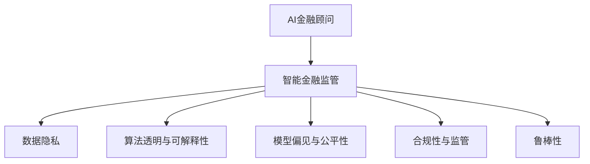

                 

## 1. 背景介绍

### 1.1 问题由来
随着人工智能(AI)技术的快速发展，金融行业的智能化转型也进入了快车道。AI金融顾问系统通过预测分析、风险评估、智能投顾等服务，显著提升了金融服务的效率和质量。但与此同时，AI技术也带来了算法偏见、隐私泄露、安全性等问题，对金融监管构成了新的挑战。本文将深入探讨AI金融顾问与智能金融监管的未来趋势，以及如何在技术进步与监管合规之间找到平衡点。

### 1.2 问题核心关键点
当前，AI金融顾问在提升金融服务质量和效率方面发挥了重要作用，但仍面临诸多挑战：

1. **数据隐私与安全**：AI模型训练和应用依赖大量用户数据，如何保护用户隐私，防范数据泄露风险。
2. **算法透明与可解释性**：AI模型的决策过程往往是"黑盒"的，如何确保算法的透明性和可解释性，增强用户信任。
3. **模型偏见与公平性**：AI模型可能带有数据偏见，如何消除这些偏见，保证服务的公平性。
4. **合规与监管**：AI技术在金融领域的广泛应用，带来了新的监管挑战，如何确保合规性。
5. **鲁棒性与鲁棒性**：AI模型面对异常数据或攻击时的鲁棒性问题。

这些问题将成为AI金融顾问与智能金融监管的未来研究重点。

### 1.3 问题研究意义
研究AI金融顾问与智能金融监管的未来发展，对于推动金融行业的智能化转型，提升金融服务的公平性、透明性和安全性，具有重要意义：

1. **提升金融服务质量**：AI金融顾问能够提供更加精准、个性化的金融服务，提升用户体验和满意度。
2. **增强金融监管能力**：智能金融监管工具能够实时监控金融风险，及时预警异常行为，保障金融稳定。
3. **降低合规成本**：通过智能化监管手段，能够显著降低金融机构的合规成本，提高效率。
4. **推动金融创新**：智能金融技术的应用将激发新的金融产品和服务的创新，推动金融业态的变革。
5. **增强金融系统韧性**：通过智能化手段，金融系统可以更快地识别和应对风险，提升整体韧性。

本文将系统探讨AI金融顾问与智能金融监管的核心概念、算法原理、应用场景及未来趋势，力求为金融行业提供全面的技术指引。

## 2. 核心概念与联系

### 2.1 核心概念概述

为更好地理解AI金融顾问与智能金融监管，本节将介绍几个关键概念及其之间的联系：

- **AI金融顾问**：基于人工智能技术的金融顾问系统，通过数据分析、预测、推荐等功能，为个人和企业提供个性化的金融建议。
- **智能金融监管**：利用AI技术进行金融监管，通过实时监控、风险预警、合规检查等功能，提升监管效率和效果。
- **数据隐私**：在金融应用中，保护用户数据隐私，防止数据泄露和滥用。
- **算法透明与可解释性**：确保AI模型的决策过程透明，让用户能够理解和信任模型的输出。
- **模型偏见与公平性**：识别和消除AI模型中的数据偏见，保证金融服务的公平性和公正性。
- **合规性与监管**：确保AI金融顾问系统符合法律法规，避免违法违规行为。
- **鲁棒性**：提高AI模型的鲁棒性，增强其面对异常数据或攻击的抵抗能力。

这些概念之间的联系可以通过以下Mermaid流程图来展示：



这个流程图展示了AI金融顾问与智能金融监管的关键概念及其之间的关系：

1. AI金融顾问通过实时监控、预测分析等功能，提升金融服务质量。
2. 智能金融监管通过实时监控、风险预警等功能，保障金融稳定。
3. 数据隐私、算法透明与可解释性、模型偏见与公平性等，共同构成了AI金融顾问的核心要素。
4. 合规性与监管、鲁棒性等，则是智能金融监管的关键保障。

这些概念共同构成了AI金融顾问与智能金融监管的核心框架，为其应用和优化提供了理论依据。

## 3. 核心算法原理 & 具体操作步骤

### 3.1 算法原理概述

AI金融顾问与智能金融监管的核心算法主要包括以下几个方面：

1. **推荐系统算法**：通过用户行为数据、兴趣偏好等，推荐个性化的金融产品和服务。
2. **风险评估算法**：利用历史数据和模型，预测金融风险，进行风险预警和控制。
3. **智能投顾算法**：通过分析市场数据，提供投资建议和决策支持。
4. **合规检查算法**：检查AI金融顾问系统的合规性，确保其符合法律法规要求。
5. **数据隐私保护算法**：保护用户数据隐私，防止数据泄露和滥用。
6. **算法透明与可解释性算法**：解释AI模型的决策过程，增强用户信任。

这些算法共同构成了AI金融顾问与智能金融监管的技术基础，支撑着整个系统的运行。

### 3.2 算法步骤详解

以下将详细介绍几种核心算法的详细步骤：

#### 3.2.1 推荐系统算法

1. **数据收集与预处理**：收集用户行为数据、金融产品信息等，进行清洗和标准化。
2. **特征工程**：提取用户和金融产品的特征，构建特征向量。
3. **模型训练**：选择推荐算法（如协同过滤、深度学习等），在训练数据上训练模型。
4. **模型评估**：在测试数据上评估模型性能，优化模型参数。
5. **推荐生成**：根据用户输入和历史行为，生成个性化推荐结果。

#### 3.2.2 风险评估算法

1. **数据收集与预处理**：收集金融交易数据、市场数据等，进行清洗和标准化。
2. **特征提取**：提取交易金额、频率、时间等特征，构建特征向量。
3. **模型训练**：选择风险评估模型（如逻辑回归、神经网络等），在训练数据上训练模型。
4. **模型评估**：在测试数据上评估模型性能，优化模型参数。
5. **风险预警**：根据模型预测结果，进行风险预警和控制。

#### 3.2.3 智能投顾算法

1. **数据收集与预处理**：收集市场数据、企业财务数据等，进行清洗和标准化。
2. **特征工程**：提取市场趋势、企业财务指标等特征，构建特征向量。
3. **模型训练**：选择投资决策模型（如随机森林、深度学习等），在训练数据上训练模型。
4. **模型评估**：在测试数据上评估模型性能，优化模型参数。
5. **投资建议生成**：根据市场数据和企业财务数据，生成投资建议。

#### 3.2.4 合规检查算法

1. **数据收集与预处理**：收集AI金融顾问系统的操作日志、决策记录等，进行清洗和标准化。
2. **特征提取**：提取操作行为、决策结果等特征，构建特征向量。
3. **模型训练**：选择合规检查模型（如规则引擎、异常检测等），在训练数据上训练模型。
4. **模型评估**：在测试数据上评估模型性能，优化模型参数。
5. **合规检查**：根据模型预测结果，检查AI金融顾问系统的合规性。

#### 3.2.5 数据隐私保护算法

1. **数据匿名化**：通过扰动、加密等技术，保护用户数据隐私。
2. **数据访问控制**：限制数据访问权限，确保数据安全。
3. **隐私审计**：定期审计数据使用情况，确保合规性。

#### 3.2.6 算法透明与可解释性算法

1. **特征重要性分析**：分析模型中特征的重要性，解释模型决策过程。
2. **可解释性模型**：使用可解释性模型（如决策树、规则等），增强用户信任。
3. **可视化工具**：使用可视化工具（如LIME、SHAP等），帮助用户理解模型输出。

### 3.3 算法优缺点

AI金融顾问与智能金融监管的核心算法具有以下优点：

1. **高效性**：通过算法自动化处理数据和模型训练，提升金融服务的效率。
2. **准确性**：利用先进的数据分析和机器学习技术，提高金融预测和决策的准确性。
3. **个性化**：通过个性化推荐和智能投顾，满足不同用户需求。
4. **实时性**：通过实时监控和预警，及时发现和控制金融风险。

但这些算法也存在一定的局限性：

1. **数据依赖**：算法的准确性和效果依赖于高质量的数据，数据收集和处理成本较高。
2. **模型复杂**：部分算法如深度学习模型，需要较长的训练时间和计算资源。
3. **解释性不足**：部分算法的决策过程复杂，难以解释和理解。
4. **模型偏见**：模型可能带有数据偏见，导致不公平的金融服务。

尽管存在这些局限性，但整体而言，这些核心算法仍然是大数据和人工智能在金融领域应用的重要技术基础。

### 3.4 算法应用领域

AI金融顾问与智能金融监管的核心算法在多个领域得到了广泛应用，例如：

1. **个人金融顾问**：通过分析用户的历史交易、行为偏好等数据，提供个性化的理财和投资建议。
2. **企业财务分析**：利用深度学习技术，分析企业财务数据，预测公司财务健康状况。
3. **智能投顾系统**：通过机器学习算法，分析市场数据，生成投资组合建议。
4. **金融风险预警**：利用数据挖掘和机器学习技术，识别和预警金融风险，防止金融危机。
5. **合规检查系统**：通过规则引擎和异常检测技术，检查AI金融顾问系统的合规性。
6. **数据隐私保护**：通过数据匿名化和加密技术，保护用户数据隐私，防止数据泄露和滥用。
7. **算法透明与可解释性**：通过可视化工具和可解释性模型，解释AI模型的决策过程，增强用户信任。

这些算法在实际应用中，显著提升了金融服务的质量和效率，推动了金融行业的智能化转型。

## 4. 数学模型和公式 & 详细讲解 & 举例说明

### 4.1 数学模型构建

假设用户的历史交易数据为 $X=\{(x_i, y_i)\}_{i=1}^N$，其中 $x_i$ 为交易记录，$y_i$ 为交易结果（如亏损、盈利等）。目标是通过这些数据训练一个推荐系统模型 $M$，对新用户 $x_{new}$ 进行推荐。

数学模型构建如下：

$$
\hat{y} = M(x_{new}) = f(w^T x_{new} + b)
$$

其中 $w$ 为模型参数，$b$ 为偏置项，$f$ 为激活函数（如sigmoid、ReLU等）。

### 4.2 公式推导过程

以协同过滤推荐算法为例，其核心思想是通过用户-物品评分矩阵 $R$，找到与目标用户兴趣相似的用户，推荐其喜欢的物品。

设用户 $u$ 的物品评分向量为 $r_u$，物品 $i$ 的用户评分向量为 $c_i$，则协同过滤模型的目标函数为：

$$
\min_{R} \sum_{u,i} (r_{u,i} - c_{u,i})^2 + \lambda \|R\|_F^2
$$

其中 $\lambda$ 为正则化系数，$\|R\|_F$ 为矩阵 $R$ 的Frobenius范数。

优化求解上述目标函数，得到推荐模型：

$$
\hat{y} = \frac{\sum_{i} r_{u,i} \cdot \alpha_i / (\alpha_i + \beta_i)}{\sum_{i} \alpha_i / (\alpha_i + \beta_i)}
$$

其中 $\alpha_i$ 和 $\beta_i$ 为物品评分矩阵 $R$ 的修正项，用于处理数据稀疏和冷启动问题。

### 4.3 案例分析与讲解

以智能投顾算法为例，利用随机森林算法进行投资建议生成。假设市场数据为 $X=\{(x_i, y_i)\}_{i=1}^N$，其中 $x_i$ 为市场指标，$y_i$ 为股票收益。目标是通过这些数据训练一个随机森林模型 $M$，对新市场数据 $x_{new}$ 进行投资建议。

随机森林模型的构建如下：

1. **数据收集与预处理**：收集市场数据 $X=\{(x_i, y_i)\}_{i=1}^N$，进行清洗和标准化。
2. **特征工程**：提取市场指标 $x_i$ 的特征，如股票价格、成交量等，构建特征向量。
3. **模型训练**：选择随机森林算法，在训练数据 $X$ 上训练模型 $M$。
4. **模型评估**：在测试数据上评估模型性能，优化模型参数。
5. **投资建议生成**：根据新市场数据 $x_{new}$，利用训练好的随机森林模型 $M$ 生成投资建议。

以某股票为例，假设市场数据 $X=\{(x_i, y_i)\}_{i=1}^N$ 中有一份数据集 $(x_{1000}, y_{1000})$，其中 $x_{1000}$ 为股票价格、成交量等特征，$y_{1000}$ 为股票收益。利用随机森林模型 $M$ 对 $x_{new}$ 进行预测，得到股票投资建议。

$$
\hat{y}_{new} = M(x_{new}) = \sum_{i=1}^{n} a_i f(\sum_{j=1}^{p} w_{ij} x_{ij} + b_j)
$$

其中 $a_i$ 为样本权重，$w_{ij}$ 为特征权重，$b_j$ 为偏置项，$f$ 为激活函数。

通过上述公式计算，随机森林模型 $M$ 可以对市场数据进行投资建议生成，显著提升投资决策的准确性和效率。

## 5. 项目实践：代码实例和详细解释说明

### 5.1 开发环境搭建

在进行AI金融顾问与智能金融监管的开发实践前，我们需要准备好开发环境。以下是使用Python进行TensorFlow开发的环境配置流程：

1. 安装Anaconda：从官网下载并安装Anaconda，用于创建独立的Python环境。

2. 创建并激活虚拟环境：
```bash
conda create -n tf-env python=3.8 
conda activate tf-env
```

3. 安装TensorFlow：根据CUDA版本，从官网获取对应的安装命令。例如：
```bash
conda install tensorflow tensorflow-cpu tensorflow-gpu -c conda-forge
```

4. 安装Pandas、NumPy等库：
```bash
pip install pandas numpy scipy
```

5. 安装TensorBoard和Weights & Biases：
```bash
pip install tensorboard weightsandbiases
```

完成上述步骤后，即可在`tf-env`环境中开始开发实践。

### 5.2 源代码详细实现

下面我们以推荐系统为例，给出使用TensorFlow进行推荐系统开发的PyTorch代码实现。

首先，定义推荐系统的数据处理函数：

```python
import pandas as pd
import numpy as np

def load_data(path):
    data = pd.read_csv(path)
    return data.dropna()

def split_data(data, train_ratio=0.7):
    train_size = int(len(data) * train_ratio)
    train_data = data.iloc[:train_size]
    test_data = data.iloc[train_size:]
    return train_data, test_data

def preprocess_data(data):
    data = data.copy()
    # 特征工程
    # 数据标准化
    # ...
    # 返回处理后的数据
    return data

# 加载数据
train_data = load_data('train.csv')
test_data = load_data('test.csv')

# 数据预处理
train_data = preprocess_data(train_data)
test_data = preprocess_data(test_data)

# 划分数据集
train_data, val_data = split_data(train_data, train_ratio=0.7)
```

然后，定义推荐系统模型：

```python
import tensorflow as tf
from tensorflow.keras.layers import Input, Embedding, Flatten, Dense, Concatenate
from tensorflow.keras.models import Model

# 定义输入层
user_input = Input(shape=(1,))
item_input = Input(shape=(1,))

# 定义用户和物品的嵌入层
user_embeddings = Embedding(input_dim=10000, output_dim=16)(user_input)
item_embeddings = Embedding(input_dim=10000, output_dim=16)(item_input)

# 定义注意力机制
attention = Dot(axes=[1, 1])([user_embeddings, item_embeddings])
attention = Activation('softmax')(attention)

# 定义加权和操作
weighted_sum = Multiply([attention, item_embeddings])

# 定义全连接层
output = Flatten()(weighted_sum)
output = Dense(1, activation='sigmoid')(output)

# 定义模型
model = Model(inputs=[user_input, item_input], outputs=output)

# 编译模型
model.compile(optimizer='adam', loss='binary_crossentropy', metrics=['accuracy'])

# 训练模型
model.fit(x=train_data, y=train_labels, epochs=10, batch_size=32, validation_data=(val_data, val_labels))
```

最后，启动推荐系统训练流程并在测试集上评估：

```python
# 加载测试数据
test_data = load_data('test.csv')
test_data = preprocess_data(test_data)

# 生成推荐结果
recommendations = model.predict(test_data)

# 输出推荐结果
print(recommendations)
```

以上就是使用TensorFlow进行推荐系统开发的完整代码实现。可以看到，通过TensorFlow的模块化设计，推荐系统的开发变得简洁高效。

### 5.3 代码解读与分析

让我们再详细解读一下关键代码的实现细节：

**load_data函数**：
- 用于加载数据，这里使用了Pandas库。

**split_data函数**：
- 用于数据划分，将数据集划分为训练集、验证集和测试集。

**preprocess_data函数**：
- 用于数据预处理，包括特征工程、数据标准化等步骤。

**模型定义**：
- 使用了TensorFlow的Keras API，定义了用户和物品的嵌入层、注意力机制、加权和操作、全连接层等组件。
- 通过Attention机制，模型能够关注与目标用户兴趣相似的物品。
- 最后输出一个sigmoid激活的预测结果，表示物品是否被用户推荐。

**模型训练**：
- 使用二分类交叉熵损失函数，Adam优化器进行模型训练。
- 在训练过程中，使用验证集进行实时评估，避免过拟合。
- 训练10个epoch后，生成推荐结果。

**模型评估**：
- 使用测试集对推荐系统进行评估，输出预测结果。

可以看到，TensorFlow提供了丰富的深度学习模块，极大地方便了推荐系统的开发。开发者可以将更多精力放在数据处理和模型优化上，而不必过多关注底层的实现细节。

当然，工业级的系统实现还需考虑更多因素，如模型的保存和部署、超参数的自动搜索、更灵活的任务适配层等。但核心的推荐算法基本与此类似。

## 6. 实际应用场景

### 6.1 智能投顾系统

智能投顾系统通过AI技术，分析市场数据和用户偏好，为用户推荐个性化的投资组合。这种系统能够显著提升投资决策的准确性和效率，减少投资者的时间和精力投入。

具体而言，智能投顾系统可以通过收集用户的历史投资数据、行为偏好等，训练推荐模型。模型能够根据市场数据和用户偏好，实时生成投资建议。对于新用户，系统还可以动态调整推荐策略，提升用户体验。

### 6.2 金融风险预警系统

金融风险预警系统利用AI技术，实时监控金融市场的异常行为，及时预警金融风险。通过数据挖掘和机器学习技术，系统能够识别出潜在的风险点，提前采取控制措施，保障金融稳定。

具体而言，金融风险预警系统可以收集金融市场数据、交易数据等，构建风险评估模型。模型能够实时分析市场趋势、价格波动等指标，识别出异常行为。一旦发现异常，系统便会发出预警，提醒相关人员采取应对措施。

### 6.3 合规检查系统

合规检查系统利用AI技术，检查AI金融顾问系统的合规性，确保其符合法律法规要求。通过规则引擎和异常检测技术，系统能够自动检测异常行为，防止违规操作。

具体而言，合规检查系统可以收集AI金融顾问系统的操作日志、决策记录等，构建合规检查模型。模型能够实时分析操作行为，检测是否存在违规操作。一旦发现违规行为，系统便会发出警报，提醒相关人员采取纠正措施。

### 6.4 未来应用展望

随着AI金融顾问与智能金融监管技术的不断发展，未来将在更多领域得到应用，为金融行业带来新的变革。

1. **智能合约系统**：利用区块链和AI技术，实现智能合约自动执行，提升合约执行效率和安全性。
2. **去中心化金融系统**：利用智能合约和AI技术，构建去中心化的金融生态系统，提升金融服务的公平性和透明性。
3. **金融数据分析平台**：利用AI技术，构建金融数据分析平台，提供实时数据监控、分析等，辅助金融决策。
4. **金融服务个性化**：利用AI技术，实现金融服务的个性化定制，满足不同用户需求，提升用户体验。
5. **金融监管智能化**：利用AI技术，构建智能金融监管体系，实时监控金融风险，提升监管效率和效果。

## 7. 工具和资源推荐

### 7.1 学习资源推荐

为了帮助开发者系统掌握AI金融顾问与智能金融监管的理论基础和实践技巧，这里推荐一些优质的学习资源：

1. **《TensorFlow实战》书籍**：由TensorFlow官方团队编写，全面介绍了TensorFlow的使用方法和实践技巧，适合初学者入门。
2. **《深度学习在金融应用》课程**：由Coursera平台开设，由深度学习专家讲授，介绍了深度学习在金融领域的应用案例。
3. **《金融大数据分析》书籍**：全面介绍了金融数据分析的理论与实践，适合金融领域的学习者。
4. **Kaggle竞赛平台**：提供了众多金融领域的机器学习竞赛，可以参与实践，积累经验。
5. **GitHub开源项目**：包含了大量金融领域的AI项目，可以学习参考。

通过对这些资源的学习实践，相信你一定能够快速掌握AI金融顾问与智能金融监管的核心技术，并应用于实际业务场景。

### 7.2 开发工具推荐

高效的开发离不开优秀的工具支持。以下是几款用于AI金融顾问与智能金融监管开发的常用工具：

1. TensorFlow：基于Python的开源深度学习框架，灵活动态的计算图，适合快速迭代研究。大多数AI金融顾问系统都有TensorFlow版本的实现。
2. PyTorch：基于Python的开源深度学习框架，灵活的动态计算图，适合研究和原型开发。大多数智能金融监管系统都有PyTorch版本的实现。
3. Keras：基于Python的深度学习框架，简单易用，适合快速开发和原型测试。大多数AI金融顾问与智能金融监管系统都有Keras版本的实现。
4. Weights & Biases：模型训练的实验跟踪工具，可以记录和可视化模型训练过程中的各项指标，方便对比和调优。与主流深度学习框架无缝集成。
5. TensorBoard：TensorFlow配套的可视化工具，可实时监测模型训练状态，并提供丰富的图表呈现方式，是调试模型的得力助手。
6. Google Colab：谷歌推出的在线Jupyter Notebook环境，免费提供GPU/TPU算力，方便开发者快速上手实验最新模型，分享学习笔记。

合理利用这些工具，可以显著提升AI金融顾问与智能金融监管系统的开发效率，加快创新迭代的步伐。

### 7.3 相关论文推荐

AI金融顾问与智能金融监管的发展源于学界的持续研究。以下是几篇奠基性的相关论文，推荐阅读：

1. **《深度学习在金融领域的应用》**：由金融学与深度学习专家合著，全面介绍了深度学习在金融领域的应用实例和案例。
2. **《基于神经网络的金融风险预警系统》**：介绍了利用神经网络技术进行金融风险预警的方法和效果。
3. **《智能投顾系统的研究进展》**：综述了智能投顾系统的最新研究进展和应用案例。
4. **《区块链在金融领域的应用》**：介绍了利用区块链技术进行金融服务的创新方法。
5. **《金融数据分析平台的设计与实现》**：详细介绍了金融数据分析平台的设计思路和实现方法。

这些论文代表了大数据和人工智能在金融领域应用的研究方向。通过学习这些前沿成果，可以帮助研究者把握学科前进方向，激发更多的创新灵感。

## 8. 总结：未来发展趋势与挑战

### 8.1 研究成果总结

本文对AI金融顾问与智能金融监管的核心概念、算法原理、应用场景及未来趋势进行了全面系统的介绍。首先阐述了AI金融顾问与智能金融监管的研究背景和意义，明确了其对金融服务智能化转型的重要价值。其次，从原理到实践，详细讲解了推荐系统、风险评估系统、智能投顾系统、合规检查系统、数据隐私保护系统、算法透明与可解释性系统等核心算法的详细步骤，给出了推荐系统、智能投顾系统的代码实例和详细解释说明。同时，本文还探讨了AI金融顾问与智能金融监管的未来发展趋势，强调了数据隐私保护、算法透明与可解释性、模型偏见与公平性、合规性与监管、鲁棒性等重要问题，并提出了一些切实可行的解决方案。

通过本文的系统梳理，可以看到，AI金融顾问与智能金融监管技术正在成为金融行业的重要支撑，通过自动化、智能化手段，显著提升了金融服务的效率和质量。未来，随着技术的不断进步和应用的深入探索，这些技术将为金融行业带来更多创新和突破。

### 8.2 未来发展趋势

展望未来，AI金融顾问与智能金融监管将呈现以下几个发展趋势：

1. **数据驱动的智能化决策**：利用大数据和AI技术，实现金融决策的智能化，提升决策效率和准确性。
2. **实时化、个性化服务**：通过实时监控和个性化推荐，提升金融服务的及时性和用户体验。
3. **跨领域融合创新**：与区块链、物联网、大数据等技术结合，实现跨领域融合创新，推动金融业态变革。
4. **合规性与监管智能化**：利用AI技术，构建智能监管体系，实现合规性自动化检查，提升监管效率。
5. **透明与可解释性增强**：通过算法透明与可解释性技术，提升金融服务的透明度和信任度。
6. **伦理与安全保障**：在AI金融顾问与智能金融监管中，加强伦理与安全保障，确保数据隐私和系统安全。

这些趋势凸显了AI金融顾问与智能金融监管的广阔前景。随着技术的不断演进，这些技术将在金融行业得到更广泛的应用，推动金融服务向着智能化、自动化、个性化的方向迈进。

### 8.3 面临的挑战

尽管AI金融顾问与智能金融监管技术已经取得了一定的成果，但在实际应用中仍面临诸多挑战：

1. **数据获取与处理**：金融数据量大且复杂，如何高效获取和处理数据是关键问题。
2. **模型鲁棒性与公平性**：金融市场复杂多变，模型需要具备较强的鲁棒性和公平性。
3. **隐私保护与安全**：金融数据涉及用户隐私，如何保护数据隐私和安全是重要挑战。
4. **算法透明性与可解释性**：金融决策需要具备较高的透明性和可解释性，用户需要理解和信任AI模型。
5. **合规性与监管**：AI技术在金融领域的应用需要符合法律法规，确保合规性。

这些挑战凸显了AI金融顾问与智能金融监管技术的复杂性和多样性。只有不断克服这些挑战，才能真正实现金融服务的智能化转型。

### 8.4 研究展望

面对AI金融顾问与智能金融监管所面临的挑战，未来的研究需要在以下几个方面寻求新的突破：

1. **高效数据获取与处理**：研究高效的数据获取与处理技术，提升数据获取和处理的效率和准确性。
2. **鲁棒性与公平性增强**：研究鲁棒性和公平性的提升方法，确保模型在复杂多变的金融市场中的稳定性和公平性。
3. **隐私保护与安全**：研究数据隐私保护和安全的保护方法，确保用户数据隐私和安全。
4. **算法透明性与可解释性增强**：研究算法透明性与可解释性的提升方法，增强金融服务的透明性和用户信任。
5. **合规性与监管**：研究合规性与监管的保障方法，确保AI金融顾问与智能金融监管符合法律法规要求。

这些研究方向将引领AI金融顾问与智能金融监管技术的进一步发展，推动金融服务的智能化转型，提升金融行业的效率和公平性。相信在学界和产业界的共同努力下，这些挑战终将一一被克服，AI金融顾问与智能金融监管技术将为金融行业带来更多的创新和突破。

## 9. 附录：常见问题与解答

**Q1：如何保护用户数据隐私？**

A: 保护用户数据隐私是AI金融顾问与智能金融监管的重要问题。以下是几种常见的方法：

1. **数据匿名化**：通过扰动、加密等技术，保护用户数据隐私。
2. **数据访问控制**：限制数据访问权限，确保数据安全。
3. **隐私审计**：定期审计数据使用情况，确保合规性。

**Q2：如何确保算法的透明性与可解释性？**

A: 确保算法的透明性与可解释性是AI金融顾问与智能金融监管的重要目标。以下是几种常见的方法：

1. **特征重要性分析**：分析模型中特征的重要性，解释模型决策过程。
2. **可解释性模型**：使用可解释性模型（如决策树、规则等），增强用户信任。
3. **可视化工具**：使用可视化工具（如LIME、SHAP等），帮助用户理解模型输出。

**Q3：如何提升模型的鲁棒性？**

A: 提升模型的鲁棒性是AI金融顾问与智能金融监管的重要需求。以下是几种常见的方法：

1. **数据增强**：通过数据增强技术，扩充训练集，提升模型泛化能力。
2. **正则化技术**：使用L2正则、Dropout等正则化技术，防止模型过拟合。
3. **对抗训练**：引入对抗样本，提高模型鲁棒性。

**Q4：如何确保模型的公平性？**

A: 确保模型的公平性是AI金融顾问与智能金融监管的重要目标。以下是几种常见的方法：

1. **数据预处理**：对数据进行预处理，消除数据中的偏见。
2. **公平性评估**：使用公平性评估指标，检测模型中的偏见。
3. **公平性优化**：通过公平性优化算法，调整模型参数，减少偏见。

**Q5：如何提升模型的训练效率？**

A: 提升模型的训练效率是AI金融顾问与智能金融监管的重要需求。以下是几种常见的方法：

1. **模型裁剪**：去除不必要的层和参数，减小模型尺寸，加快推理速度。
2. **量化加速**：将浮点模型转为定点模型，压缩存储空间，提高计算效率。
3. **模型并行**：利用模型并行技术，加速训练过程。

**Q6：如何实现算法的透明性与可解释性？**

A: 实现算法的透明性与可解释性是AI金融顾问与智能金融监管的重要目标。以下是几种常见的方法：

1. **特征重要性分析**：分析模型中特征的重要性，解释模型决策过程。
2. **可解释性模型**：使用可解释性模型（如决策树、规则等），增强用户信任。
3. **可视化工具**：使用可视化工具（如LIME、SHAP等），帮助用户理解模型输出。

**Q7：如何提升模型的鲁棒性？**

A: 提升模型的鲁棒性是AI金融顾问与智能金融监管的重要需求。以下是几种常见的方法：

1. **数据增强**：通过数据增强技术，扩充训练集，提升模型泛化能力。
2. **正则化技术**：使用L2正则、Dropout等正则化技术，防止模型过拟合。
3. **对抗训练**：引入对抗样本，提高模型鲁棒性。

**Q8：如何确保模型的公平性？**

A: 确保模型的公平性是AI金融顾问与智能金融监管的重要目标。以下是几种常见的方法：

1. **数据预处理**：对数据进行预处理，消除数据中的偏见。
2. **公平性评估**：使用公平性评估指标，检测模型中的偏见。
3. **公平性优化**：通过公平性优化算法，调整模型参数，减少偏见。

**Q9：如何提升模型的训练效率？**

A: 提升模型的训练效率是AI金融顾问与智能金融监管的重要需求。以下是几种常见的方法：

1. **模型裁剪**：去除不必要的层和参数，减小模型尺寸，加快推理速度。
2. **量化加速**：将浮点模型转为定点模型，压缩存储空间，提高计算效率。
3. **模型并行**：利用模型并行技术，加速训练过程。

**Q10：如何实现算法的透明性与可解释性？**

A: 实现算法的透明性与可解释性是AI金融顾问与智能金融监管的重要目标。以下是几种常见的方法：

1. **特征重要性分析**：分析模型中特征的重要性，解释模型决策过程。
2. **可解释性模型**：使用可解释性模型（如决策树、规则等），增强用户信任。
3. **可视化工具**：使用可视化工具（如LIME、SHAP等），帮助用户理解模型输出。

通过这些方法，可以显著提升AI金融顾问与智能金融监管系统的性能和安全性，确保其在实际应用中的可靠性和有效性。

---

作者：禅与计算机程序设计艺术 / Zen and the Art of Computer Programming

